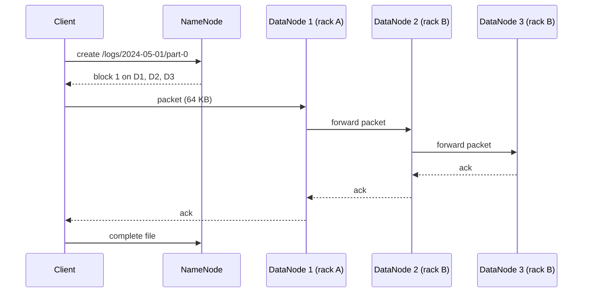

Your cluster has 1,000 machines with 12 disks each. Hard drives fail at around 1–2% a year, so you should expect a few dead disks every week, and one of them will hold part of the file your nightly job is reading. You also want that file read at 1,000 × 12 × 150 MB/s, not at the speed of whichever disk it happens to live on. A distributed file system solves both problems at once: it cuts files into large blocks, spreads the blocks across all the disks, and keeps several copies of each.

Almost every batch and streaming system in this track sits on one of two storage models: a Hadoop-style distributed file system (HDFS, and Google's GFS before it) or a cloud object store (S3, Google Cloud Storage, Azure Blob Storage). They look similar from a Spark job ("read `path/*.parquet`"), but they promise different things about rename, listing and consistency, and those differences explain a surprising amount of modern data engineering, including why table formats like Iceberg exist.

## HDFS: blocks, a NameNode and many DataNodes

HDFS has two kinds of server:

- **DataNodes** store blocks as ordinary files on local disks and serve them over the network.
- **The NameNode** holds the entire namespace in memory: the directory tree, each file's list of block IDs, and (rebuilt from DataNode reports, not persisted) which DataNodes hold each block. Namespace changes are recorded in an edit log and periodically checkpointed into an image file.

A file is cut into **blocks** of 128 MB by default, and each block is stored on 3 DataNodes. The large block size is a deliberate piece of arithmetic. A spinning disk spends about 10 ms seeking and then streams at roughly 100–200 MB/s. If you want the seek to cost no more than about 1% of the read, each read must transfer for at least 1 s, which means blocks of 100 MB or more. Small blocks would also multiply the metadata the NameNode keeps in memory.

### Reads and writes

A client never pushes data through the NameNode. It asks the NameNode where the blocks are, then talks to DataNodes directly.



Writes go through a **pipeline**: the client streams packets to the first DataNode, which forwards to the second, which forwards to the third, and acknowledgements flow back along the chain. The client's outbound bandwidth is spent once, not three times. Reads go to the closest replica (same node, then same rack), and a reader that finds a corrupt block (every block carries checksums) reports it and moves to another replica.

### Placement is a failure model

The default placement puts the first replica on the writer's own node, the second on a node in a **different rack**, and the third on another node in that second rack. That encodes a specific failure model: a top-of-rack switch or power strip can take out a whole rack, so no block may live on only one rack; but cross-rack bandwidth is scarcer than in-rack bandwidth, so the write crosses racks only once.

Replication across the whole cluster also makes recovery fast. When an 8 TB disk dies, its blocks' other replicas are scattered over hundreds of machines, so the NameNode schedules re-replication from all of them in parallel: a few gigabytes per node, done in minutes. A RAID array rebuilding the same 8 TB onto one spare disk at 150 MB/s takes about 15 hours, during which a second failure is far more likely to lose data. Declustered replication is the reason clusters of cheap disks are reliable.

### Erasure coding for cold data

Three replicas cost 200% overhead. HDFS 3 supports **erasure coding**, for example Reed-Solomon RS(6,3): each group of 6 data blocks gets 3 parity blocks, any 6 of the 9 reconstruct the data, and the overhead is 50%. The price is that reading lost data requires fetching 6 blocks and computing, and small files do not fill a stripe efficiently. The usual policy is replication for hot, recent data and erasure coding for large, cold data. Cloud object stores use erasure coding internally, which is part of why they are cheap.

## What HDFS promises, and where it hurts

HDFS gives you something close to a normal file system with a few deliberate restrictions:

| Property | HDFS behaviour |
|---|---|
| Consistency of metadata | Strong. One NameNode orders every namespace operation. |
| Writers | One writer per file at a time, enforced by a lease. Append is allowed; random writes are not. |
| Visibility of data being written | Readers see data up to the writer's last `hflush`; after `close`, the whole file. |
| Rename | Atomic metadata operation, including for directories. |
| Listing | Fast, consistent, served from NameNode memory. |

The atomic directory rename is the quiet foundation of batch processing. Hadoop and Spark commit a job by having each task write into a `_temporary/attempt_…` directory and then renaming successful attempts into the final location. Readers see either no output or all of it. Hold on to that fact; it breaks on object stores.

The NameNode is also HDFS's limit. Every file, directory and block is an object in its heap, at roughly 150 bytes each (a common planning figure is about 1 GB of heap per million blocks). A cluster with 300 million files and 400 million blocks needs a NameNode heap on the order of 100 GB, with garbage-collection pauses to match. This is the **small-files problem**: 1 PB stored as 1 GB files is about a million files and eight million blocks, while the same petabyte as 100 KB files is ten billion files, each with its own block, which no NameNode can hold. Small files are also slow to process, because each one becomes at least one task or one open-seek-read cycle.

Availability was a limit too. The original NameNode was a single point of failure. Modern deployments run an active and a standby NameNode sharing the edit log through a quorum of JournalNodes, with ZooKeeper-based failover and fencing so that a partitioned old active cannot keep writing. Federation splits the namespace across several NameNodes when one heap is not enough.

## Object stores: a different contract

Cloud object stores replaced HDFS for most new platforms, including Netflix's data warehouse, which lives in S3. They are not file systems, and treating them as one is the root of a family of bugs.

| Property | HDFS | Object store (S3, GCS, Azure Blob) |
|---|---|---|
| Namespace | Real directory tree | Flat keys; "directories" are just shared prefixes |
| Update | Append to a file | Replace the whole object; no append, no partial update |
| Rename | Atomic, O(1) metadata change | Does not exist; emulated as copy + delete per object, O(bytes) |
| Listing | Consistent, fast | Paginated (1,000 keys per call on S3), one request per page |
| Consistency | Strong | Now strong read-after-write and list on the major clouds |
| Scaling limit | NameNode heap | Request rate per key prefix, request cost |
| Compute | Co-located with storage | Separate; data crosses the network |

### Consistency has changed, and history still matters

For years S3 offered only eventual consistency for overwrites and listings: a job could write 1,000 files, and the next job's listing might return 997 of them. Data silently went missing from downstream jobs. Netflix, which ran Hadoop directly on S3, published a tool (s3mper) that recorded listings in a separate consistent store to detect this, and AWS shipped similar workarounds. Since late 2020 S3 provides strong read-after-write consistency for writes, overwrites, deletes and listings, and Google Cloud Storage has long been strongly consistent. You will still meet the workarounds in older codebases and the scepticism in older engineers; both came from real incidents.

### Rename is the real problem now

Strong consistency did not bring atomic rename. Committing a Spark job the HDFS way on S3 means copying every output object to its final key and deleting the original: a job that wrote 1 TB copies 1 TB at commit time, and a failure halfway leaves half the output visible. Two fixes exist:

- **Multipart-upload committers.** Each task uploads its files as S3 multipart uploads but does not complete them. Job commit completes the uploads, which is a fast metadata operation per file. Output becomes visible file by file, still not atomically as a set, but without copying data.
- **Table formats.** Iceberg, Delta Lake and Hudi stop relying on directories entirely. The set of files in a table is recorded in metadata files, and a commit atomically swaps one pointer to a new metadata version. Iceberg was started at Netflix largely because Hive tables on S3 depended on directory listings and renames that were slow and unsafe there. The [columnar formats and lakehouses](/learn/big-data/batch-processing/columnar-formats-and-lakehouses) lesson covers how.

S3 has more recently added conditional writes (put only if the key does not exist, and compare-and-swap on an object's ETag), which gives table formats and lock services a primitive for atomic commits without an external database.

### Throughput, prefixes and cost

An object store scales by partitioning its key space, internally, into ranges of key prefixes. S3 documents a baseline of about 3,500 writes and 5,500 reads per second per partitioned prefix and splits hot prefixes automatically over time. Sequential key names (timestamps at the start of the key) used to concentrate load on one partition, which is why older guidance recommended random prefixes.

```viz
{"type": "system", "scenario": "sharding-range", "nodes": 3,
 "title": "Range partitioning and the hot tail",
 "caption": "Object stores and many databases partition keys by range. Keys that share a growing prefix (a timestamp, an auto-increment id) all land in the last range until it is split. Hash-prefixing spreads the load but gives up cheap range listing."}
```

Per request, an object store is slow: a GET has tens to low hundreds of milliseconds of first-byte latency, and a single connection streams at tens of MB/s. Aggregate throughput comes from parallelism: engines issue many concurrent ranged GETs (for example, one per Parquet column chunk), so a cluster can read at hundreds of GB/s from a store no single client could saturate.

Requests also cost money. Reading 10 million 100 KB objects needs 10 million requests instead of a few thousand for the same 1 TB stored as 1,000 objects of 1 GB, and it is far slower because every request pays the latency. The small-files problem survives the move to the cloud; it just changes from a NameNode heap problem to a latency and cost problem. The fix is the same: **compaction** into files of roughly 128 MB to 1 GB.

## Locality: why disaggregation won

HDFS was designed so that computation runs where the data is, because in 2006 the network was the bottleneck. Two things changed. Data-centre networks moved to 25–100 Gbps per server with non-blocking fabrics, so reading from a remote disk is often as fast as reading a local one. And separating storage from compute lets each scale on its own: a nightly job can start 500 machines, read from S3, and release them an hour later, while HDFS clusters must stay up (and stay full) to keep the data available.

The cost is that locality is gone for good. Every byte a query touches crosses the network, which is exactly why the next lessons obsess over *not reading bytes*: columnar layouts, partition pruning, min/max statistics and caching layers exist to shrink the bytes fetched from object storage.

## A worked design decision

A team lands 2 TB of events per day and asks where to store them.

1. **Volume and retention.** 2 TB/day for two years is about 1.5 PB. On HDFS with three replicas that is 4.4 PB of raw disk on always-on machines; in S3 it is 1.5 PB billed per gigabyte-month with durability handled for you.
2. **Access pattern.** Mostly scans by date by Spark and a SQL engine, a few times a day. There is no need for low-latency random reads, so object storage's per-request latency is acceptable.
3. **File layout.** At 2 TB/day, target ~512 MB files: about 4,000 files per day. Streaming ingest that writes a file per partition per minute would produce hundreds of thousands of small files per day; schedule compaction, or buffer longer before writing.
4. **Commit safety.** Several jobs read while others write. Use a table format so readers see snapshots and writers commit atomically, instead of relying on directory renames.
5. **When HDFS still wins.** On-premises clusters with steady utilisation, workloads that need append or very low-latency small reads (HBase uses HDFS for this), or data that must not leave a facility.

## Senior signals

- You describe storage by its **contract** (rename, listing, append, consistency) before its throughput, because the contract decides whether a commit protocol is safe.
- You know that HDFS relies on **atomic directory rename** to commit jobs and that object stores emulate rename as copy + delete, and you can name the fixes: multipart-upload committers and table formats.
- You can estimate **NameNode heap** from file and block counts and explain the small-files problem in both HDFS terms (heap) and object-store terms (request latency and cost).
- You explain replica placement as a **failure model** (rack loss) and declustered replication as the reason cheap disks are safe: recovery runs in parallel across the cluster.
- You know S3 became **strongly consistent** in 2020 and still check whether a code path depends on older workarounds or on rename atomicity it never had.

## Check yourself

```quiz
- q: >-
    A Spark job writes 800 GB to S3 using the classic rename-based output committer. Why is job commit slow and unsafe?
  options: ["S3 is eventually consistent for new objects", "Rename is emulated by copying every object and deleting the original, so commit copies 800 GB and a crash leaves partial output visible", "S3 limits objects to 5 GB", "The NameNode must record every file"]
  answer: 1
  explanation: >-
    Object stores have no rename. The committer's final "rename" becomes a server-side copy of all 800 GB plus deletes, which takes a long time and is not atomic across files. S3 has been strongly consistent since 2020, so consistency is not the issue here.
- q: >-
    An HDFS cluster stores 400 million files averaging 200 KB. What problem are you most likely to hit first?
  options: ["Disk capacity", "NameNode heap and garbage collection, because every file and block is an in-memory object", "Network bandwidth between racks", "Checksum verification cost"]
  answer: 1
  explanation: >-
    400 million files plus their blocks is on the order of 800 million namespace objects, far past what one NameNode heap handles comfortably. The total data (80 TB) is modest; the object count is the problem.
- q: >-
    Why does HDFS place the second and third replicas of a block on a different rack from the first, but on the same rack as each other?
  options: ["To maximise read bandwidth for the writer", "To survive the loss of a whole rack while crossing the rack boundary only once per write", "Because the NameNode can only track two racks per block", "To make erasure coding possible later"]
  answer: 1
  explanation: >-
    A rack can fail as a unit (switch, power). Two racks are enough to survive that; putting replicas 2 and 3 together means the write pipeline crosses racks once, conserving scarce cross-rack bandwidth.
- q: >-
    When an 8 TB disk fails in a 1,000-node HDFS cluster, why is recovery much faster than rebuilding a RAID array?
  options: ["HDFS compresses blocks during recovery", "The lost blocks' surviving replicas are spread across many nodes, so re-replication runs in parallel across the cluster", "HDFS only re-replicates blocks that are read", "RAID rebuilds must verify checksums"]
  answer: 1
  explanation: >-
    Declustered replication means hundreds of nodes each copy a few gigabytes concurrently. A RAID rebuild writes all 8 TB onto one spare disk at single-disk speed, which takes many hours.
- q: >-
    A streaming job writes one Parquet file per partition every 30 seconds to S3, producing about 3 million files a day of about 300 KB each. Downstream queries are slow and expensive. What is the right first fix?
  options: ["Enable S3 strong consistency", "Increase the S3 request-rate limit", "Compact files into roughly 128 MB to 1 GB and buffer longer before writing", "Switch to erasure coding"]
  answer: 2
  explanation: >-
    Each small file costs a request and its latency for every query that reads it, and it inflates planning. Compaction and larger write batches reduce object count by orders of magnitude. Consistency and erasure coding are unrelated to the problem.
```
