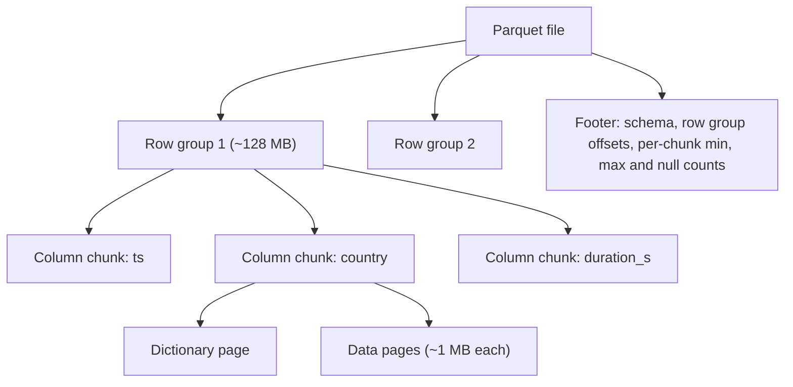
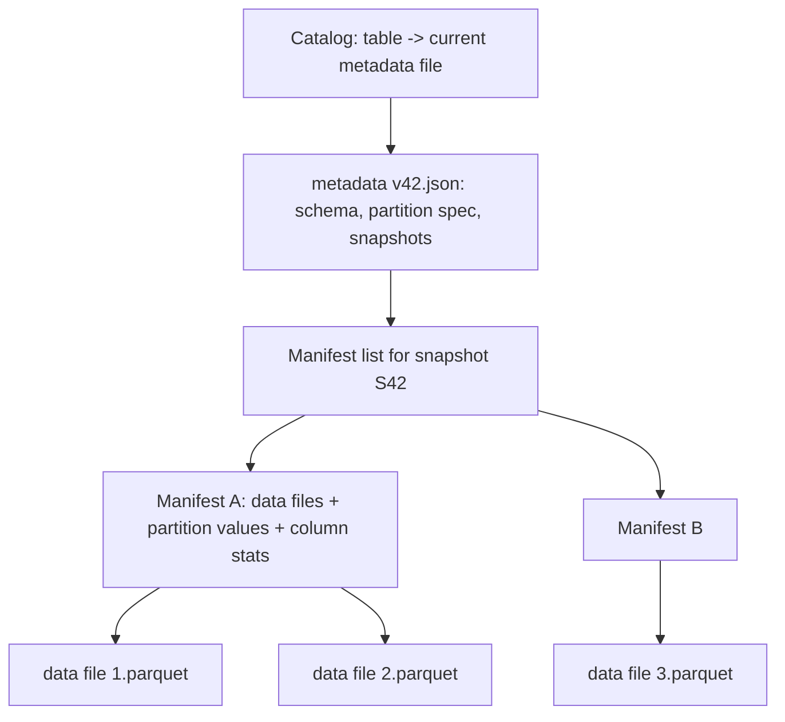

An analyst asks for total watch hours by country for May. The events table has 60 columns and about 50 billion rows a year, roughly 400 bytes per row. Stored row by row (CSV, JSON, Avro), the query must read every byte of every row in May, about 1.7 TB, to use three of the sixty columns. Stored in a columnar format, partitioned by day, it reads three compressed columns for 31 days, on the order of 20 GB. Same data, same answer, about 80 times fewer bytes, and on object storage bytes read is time and money.

That is the first half of this lesson. The second half is about what goes wrong once you have millions of those files in S3 and call a directory of them "a table": readers see half-written data, planning a query means listing 100,000 directories, two writers corrupt each other, and renaming a column silently breaks old files. Table formats (Apache Iceberg, which began at Netflix, plus Delta Lake and Apache Hudi) fix that by adding a metadata layer with atomic commits. Together, open columnar files, a table format and object storage are what people mean by a **lakehouse**.

## Row versus column layout

A row-oriented file stores each record's fields together: `(ts, user, title, country, duration, …)`, then the next record. That is ideal for writing one event or reading a whole record. A column-oriented file stores all values of `ts` together, then all values of `user`, and so on. Three consequences follow:

1. **Column pruning.** A query that touches 3 of 60 columns reads roughly 3/60 of the bytes.
2. **Better compression.** A column holds values of one type with similar distributions, so type-specific encodings work far better than general compression on mixed rows.
3. **Vectorised execution.** An engine can process a batch of 4,096 values of one column in a tight loop that the CPU pipelines and vectorises, instead of interpreting one row at a time. The [OLAP engines](/learn/big-data/batch-processing/olap-engines) lesson builds on this.

The encodings are worth knowing by name because they explain why sort order matters so much:

| Encoding | How it works | Great for |
|---|---|---|
| Dictionary | Store each distinct value once; store small integer ids per row | Low-cardinality strings (`country`: ~190 values, 1 byte per row instead of ~10) |
| Run-length (RLE) | Store `(value, repeat count)` | Sorted or clustered columns: a million sorted `country` ids collapse to about 190 runs |
| Bit-packing | Store integers in the minimum bits needed | Dictionary ids, small counts, booleans |
| Delta | Store differences between consecutive values | Sorted timestamps and ids: deltas are tiny and bit-pack well |

After encoding, pages are usually compressed again with Snappy or Zstandard. A column that is sorted or clustered often shrinks by 10–50×; the same column in random order may shrink by 3×.

## Inside a Parquet file



- A file is divided into **row groups**, sized by the writer's buffered bytes (`parquet.block.size`, 128 MB by default in the Java writer). Within each row group, every column is stored contiguously as a **column chunk**, divided into **pages** of around 1 MB uncompressed (`parquet.page.size`), the unit of encoding and compression.
- The **footer** at the end of the file holds the schema and, for every column chunk, its offset and **statistics**: min, max and null count. Readers fetch the footer first, decide what they need, then issue ranged GETs for only those chunks.
- Optional **page indexes** (column index and offset index, written by default since parquet-mr 1.11) record min/max per page, and optional **Bloom filters** per column chunk answer "is this exact value definitely absent?"

### A row group in bytes

Take one row group of 1,000,000 rows with three columns, written by a job that sorted the day's events by `event_ts`. The sizes below are arithmetic from the encodings, not measurements; a real file will differ by tens of per cent with the compressor and the data.

| Column | Raw | Encoding chosen by the writer | Encoded size | Why |
|---|---|---|---|---|
| `event_ts` (int64 microseconds) | 8 MB | DELTA_BINARY_PACKED | ~2 MB | Sorted: deltas average 86,400 µs (one day over a million rows); each miniblock of 32 is bit-packed at the width of its largest delta minus the block's minimum, roughly 17–19 bits instead of 64 |
| `country` (string, 190 distinct) | ~2 MB | Dictionary page of 190 entries (~1.1 KB) + RLE/bit-packed ids | ~1 MB unsorted, under 1 KB if clustered | 8-bit ids; a clustered column collapses into about 190 runs |
| `duration_s` (int32, ~50,000 distinct) | 4 MB | Dictionary (200 KB) + 16-bit ids | ~2.2 MB | Falls back to PLAIN if the dictionary page would exceed 1 MB (`parquet.dictionary.page.size`) |

Each column chunk is split into data pages of about 1 MB, so `event_ts` is two or three pages, each with a small Thrift header (page type, value count, encoding, sizes, page-level statistics). Zstandard on top typically halves the encoded sizes again. The footer for a 60-column file with ten row groups holds 600 column-chunk entries with offsets and statistics, on the order of 100 KB, and the file ends with the footer's length as a 4-byte little-endian integer and the magic bytes `PAR1`, which is how a reader finds it.

### Reading the file: the request trace

The query `SUM(duration_s) WHERE country = 'BR' AND event_ts BETWEEN 10:00 AND 11:00` runs against a 512 MB file with four row groups, sorted by `event_ts`, on S3.

1. Ranged GET of the last 8 bytes: footer length and magic. One request, tens of milliseconds.
2. Ranged GET of the footer (about 100 KB). The reader now knows every column chunk's offset and statistics.
3. Row-group pruning: `event_ts` min/max per row group are `[00:00, 06:10]`, `[06:10, 12:20]`, `[12:20, 18:30]`, `[18:30, 24:00]`; only row group 2 overlaps 10:00–11:00. Three row groups are skipped without a read.
4. Column pruning: three of sixty column chunks in row group 2 are needed.
5. Page-index pruning: within `event_ts`'s chunk, the column index says pages 3–4 of 12 cover 10:00–11:00, so the offset index gives their byte ranges, and the same row ranges select pages of `country` and `duration_s`.
6. Three or four coalesced ranged GETs fetch about 2 MB. Total: five or six requests and about 2 MB moved, out of 512 MB.

Reorder the same data randomly and step 3 prunes nothing (every row group spans the whole day), step 5 prunes nothing, and the reader fetches three full column chunks from all four row groups, about 20 MB, ten times more. Same query, same file size, different physical order.

### Nested data: definition and repetition levels

Parquet stores nested and repeated fields flat, using two small integers per value from Google's Dremel paper. For an optional list column `tags` with three rows `["a","b"]`, `[]`, `["c"]`, the values are stored as `a, b, c` with **repetition levels** `0, 1, 0, 0` (0 starts a new row; 1 continues the current list) and **definition levels** `3, 3, 1, 3` (how many optional or repeated levels are present: the empty list is defined only to depth 1). The levels are RLE and bit-packed, so a column of mostly non-null flat values costs almost nothing extra, and a reader can reconstruct records from any subset of columns without touching the others.

### ORC, briefly

ORC has the same shape with different names: **stripes** (64 MB by default) instead of row groups, a row index with min/max every 10,000 rows (`orc.row.index.stride`), optional Bloom filters, and a file footer plus a postscript that says how to read the footer. Its finer index granularity gives better skipping on sorted data; Parquet has broader engine support and better nested-type handling. Both are fine choices; the platform's engines decide.

| | Parquet | ORC |
|---|---|---|
| Unit of pruning | Row group (~128 MB) and, with page indexes, page (~1 MB) | Stripe (~64 MB) and row index (10,000 rows) |
| Bloom filters | Per column chunk, since parquet-mr 1.12 | Per column, per stripe |
| Nested data | Dremel levels; strong support | Supported; less used |
| Ecosystem | Spark, Trino, BigQuery, DuckDB, pandas, Iceberg default | Hive-first; Hive ACID tables |

## Predicate pushdown and why sort order decides it

With `WHERE event_ts BETWEEN '2024-05-01 10:00' AND '2024-05-01 11:00'`, the reader compares the predicate with each row group's min/max for `event_ts` and skips every row group whose range cannot overlap. This is **predicate pushdown** (also called zone-map or min/max pruning), and it is only as good as the data's clustering.

- If files are written in event-time order, each row group covers a narrow time range, and a one-hour filter over a month touches about 1/720 of the row groups.
- If rows are in random order, every row group's min is near the start of the month and its max near the end. Every row group "might" match, and pruning skips nothing.

That is why writers sort within partitions (`ORDER BY` or `sortWithinPartitions` before writing) by the columns most often filtered on, and why multi-column clustering schemes such as Z-ordering exist: they interleave the bits of two or three columns into one sort key, so each row group covers a small range of every one of them, trading perfect locality on one column for decent locality on several.

Min/max statistics cannot help an equality predicate on a high-cardinality, unclustered column such as `user_id = 91823311`: every row group's range covers it. That is what column-chunk [Bloom filters](/learn/advanced-data-structures/probabilistic-structures/bloom-filters) are for.

```viz
{"type": "system", "scenario": "bloom-filter", "app": "Reader", "store": "object store",
 "title": "Bloom filters: definitely absent, or maybe present",
 "caption": "A Parquet reader can check a column chunk's Bloom filter before fetching it. A negative answer is certain, so the chunk is skipped; a positive answer may be false, costing one unnecessary read. A few bits per distinct value buy skipping for point lookups that min/max statistics cannot prune."}
```

## Exercise: prune row groups

```exercise
id: prune-row-groups
title: Min/max pruning for a range predicate
prompt: |
  A reader evaluates `lo <= x AND x <= hi` against a Parquet file. For each
  row group it knows the column statistics `[min, max]` for `x`. A row group
  whose values are all null has statistics `[null, null]`.

  Return the indices (ascending) of the row groups the reader must read,
  that is, the ones whose range could contain a matching value.

  - `lo` or `hi` may be `null`, meaning that side is unbounded.
  - A null value never satisfies the predicate, so all-null row groups are
    always skipped.
  - Bounds are inclusive.
languages: [python, javascript]
entry: prune_row_groups
starter:
  python: |
    def prune_row_groups(stats, lo, hi):
        # stats: list of [min, max] (or [None, None] for an all-null group)
        return []
  javascript: |
    function prune_row_groups(stats, lo, hi) {
      // stats: array of [min, max] (or [null, null] for an all-null group)
      return [];
    }
tests:
  - args: [[[1, 10], [11, 20], [21, 30]], 15, 25]
    expected: [1, 2]
  - args: [[[5, 9], [1, 3], [10, 12]], null, 4]
    expected: [1]
    label: unbounded lower side
  - args: [[[null, null], [0, 100]], 50, 50]
    expected: [1]
    label: all-null row group is skipped
  - args: [[[1, 100], [2, 99], [1, 98]], 40, 41]
    expected: [0, 1, 2]
    label: unsorted data defeats pruning
  - args: [[[1, 10], [10, 20], [21, 30]], 20, 20]
    expected: [1]
    hidden: true
    label: inclusive boundaries
  - args: [[[1, 2], [null, null], [3, 4]], null, null]
    expected: [0, 2]
    hidden: true
    label: both sides unbounded
  - args: [[], 1, 5]
    expected: []
    hidden: true
    label: no row groups
hints:
  - "A row group can match only if its max is at least `lo` and its min is at most `hi`."
  - "Treat a `null` bound as always satisfied, and skip groups whose min is null."
```

## When a directory is not a table

The first data lakes, including Netflix's Hive-on-S3 warehouse, defined a table as a directory tree: `plays/date=2024-05-01/country=US/part-00042.parquet`. The metastore stored the table's schema and its list of partition directories, and the files inside a directory were whatever a listing returned. That design has five chronic problems:

1. **No atomic commits.** A job writing 500 files is visible file by file. Readers see partial output; a failed job leaves debris.
2. **Listing is planning.** To plan a query, the engine lists every matching partition directory. On an object store, 100,000 partitions means 100,000 or more LIST requests before reading a byte.
3. **No isolation between writers.** Two jobs overwriting the same partition can interleave and leave a mix of both outputs.
4. **Partitioning leaks into queries.** A table partitioned by a derived `event_date` string requires every query to filter on `event_date`, not on `event_ts`. Forget it and you scan the whole table. Changing the partitioning means rewriting the table.
5. **Fragile schema evolution.** Columns matched by name or position across old files make renames and drops dangerous; a renamed column reads as null, or worse, as another column's data.

## How Iceberg works

Iceberg replaces "the files in these directories" with an explicit, versioned tree of metadata.



- **Data files** are ordinary Parquet (or ORC/Avro), never modified after writing.
- **Manifests** (Avro files) list data files with their partition values and per-column statistics (min, max, null counts, sizes). A **manifest list** records the manifests that make up one snapshot, with partition summaries so whole manifests can be skipped.
- A **metadata file** (JSON) holds the schema, the partition spec, and the list of snapshots. The **catalog** (Hive metastore, a REST catalog, AWS Glue, Nessie) stores one thing per table: a pointer to the current metadata file.

### A commit, traced

The table is at metadata version 42. A Spark job appends one day of data:

1. Tasks write data files: `data/event_ts_day=2024-05-01/00000-0-a1b2.parquet` and 199 more, each with its statistics.
2. The driver writes a manifest `c3d4-m0.avro` listing those 200 files with partition values and column stats.
3. It writes a manifest list `snap-8811-1-e5f6.avro` naming the new manifest plus every manifest of the current snapshot.
4. It writes `metadata/00043-….metadata.json`: the old content plus the new snapshot (id 8811, its sequence number, its manifest list, its parent).
5. It asks the catalog to swap the table's pointer from v42 to v43 **only if it is still v42**. That compare-and-swap is the only step that needs atomicity; a catalog-free design on S3 would need exactly the 2024 conditional `PUT` described in the [object store lesson](/learn/big-data/batch-processing/distributed-file-systems).

Now a second writer started from v42 at the same time, rewriting file 17 to delete some rows. It reaches step 5 after the first commit landed, and its swap fails. It re-reads v43, checks whether the files it rewrote are still present and unchanged (they are; the first commit only appended), rewrites its manifest list on top of v43, and swaps to v44. Had the first commit compacted file 17 away, the check would fail and the second writer would report a conflict instead of silently deleting rows from a file that no longer exists. This is optimistic concurrency control, and it works well when commits are infrequent relative to their duration; hundreds of concurrent streaming writers committing every few seconds to one table will spend their time retrying.

What falls out of this design:

- **Snapshot isolation for readers.** A query pins one snapshot and reads exactly its files, no matter what commits happen meanwhile. Old snapshots enable **time travel** and reproducible reads.
- **Planning without listing.** The engine reads a few metadata files and prunes manifests and data files using partition values and column statistics, so planning cost no longer depends on the number of directories.
- **Hidden partitioning.** The spec says `days(event_ts)`, and Iceberg derives partition values itself. Queries filter on `event_ts` and get pruning automatically. The spec can evolve (from days to hours) without rewriting old data; each file records the spec it was written with.
- **Schema evolution by column ID.** Every column has a permanent ID, and files are read by ID, so renames, drops and reorders are safe metadata changes. Type changes are limited to safe widenings (`int` to `long`, `float` to `double`, `decimal` precision up).

```sql
CREATE TABLE warehouse.analytics.plays (
  event_ts    TIMESTAMP,
  user_id     BIGINT,
  title_id    BIGINT,
  country     STRING,
  duration_s  INT
) USING iceberg
PARTITIONED BY (days(event_ts), bucket(16, user_id));

-- Pruned by the hidden days(event_ts) partition; no event_date column needed.
SELECT country, SUM(duration_s) / 3600.0 AS watch_hours
FROM warehouse.analytics.plays
WHERE event_ts >= TIMESTAMP '2024-05-01 00:00:00'
  AND event_ts <  TIMESTAMP '2024-06-01 00:00:00'
GROUP BY country;

-- Reproduce yesterday's report exactly.
SELECT COUNT(*) FROM warehouse.analytics.plays TIMESTAMP AS OF '2024-06-02 06:00:00';
```

### Updates and deletes

Files are immutable, so a `DELETE` or `MERGE INTO` has two strategies:

- **Copy-on-write**: rewrite every data file that contains an affected row. Reads stay fast; a one-row delete rewrites a whole 512 MB file.
- **Merge-on-read**: write small **delete files** that mark rows as removed, either by file and row position or by column values (equality deletes, which streaming writers use because they need not read the data first), and let readers apply them at query time. Each snapshot carries a sequence number, and an equality delete applies only to data files with a lower sequence number (a position delete also to files added in its own commit), which is what keeps a later append from being deleted by an earlier delete. Writes are cheap; reads slow down as delete files accumulate until compaction folds them in. Format version 3 adds deletion vectors, a compact bitmap per data file, so readers apply one small structure instead of many position-delete files.

Choose per table: copy-on-write for tables with rare, large batch updates; merge-on-read for frequent small updates such as [CDC](/learn/big-data/streaming/change-data-capture) upserts or GDPR deletions. Either way, the table needs **maintenance**: compaction of small files, expiring old snapshots (which is what actually lets deleted data be physically removed, important for privacy deletions), and removing orphaned files left by failed writes. A lakehouse without scheduled maintenance slowly turns back into a small-files problem.

## Iceberg, Delta and Hudi

| | Iceberg | Delta Lake | Hudi |
|---|---|---|---|
| Origin | Netflix, donated to Apache in 2018 | Databricks | Uber |
| Commit log | Tree of metadata files, pointer swap in a catalog | Ordered JSON commit files in `_delta_log/`, periodic Parquet checkpoints; commit by creating the next numbered file atomically | Timeline of instants per table |
| Row-level deletes | Position and equality delete files; deletion vectors in v3 | Deletion vectors | Record-level index and log files |
| Strength | Engine neutrality, hidden partitioning, large-table planning | Tight Spark and Databricks integration | Record-level upserts and incremental pulls |

Delta's log deserves one trace because it is the other common design. Commit 42 is the file `_delta_log/00000000000000000042.json`, a list of actions: `add` (a data file path, size, partition values and statistics), `remove` (a file that is no longer part of the table), and occasionally `metaData` or `protocol`. The current table is the replay of every commit; to avoid replaying thousands of files, every tenth commit writes a Parquet **checkpoint** of the whole state and `_last_checkpoint` points at it. Atomicity is "create file 43 only if it does not exist", which HDFS and Azure give natively; on S3, Delta's multi-cluster mode uses DynamoDB for it, and S3's 2024 conditional writes now provide the same put-if-absent primitive. Both formats converged on the same ideas: immutable data files, a log or tree of metadata, optimistic concurrency, snapshots, and row-level deletes. Pick by the engines you need to support and the write pattern, not by benchmark claims.

```viz
{"type": "system", "scenario": "mvcc", "variant": "table",
 "title": "Snapshots are MVCC at table scale",
 "caption": "A database keeps row versions so readers see a consistent snapshot while writers proceed. A table format does the same with whole files: a reader pins a snapshot, writers add a new one, and old versions are garbage-collected by snapshot expiry, the table-scale equivalent of vacuum."}
```

## Production failure modes

**A selective query reads the whole table.** Symptom: `WHERE event_ts` over one hour scans as many bytes as a full-month query; the engine's "row groups skipped" metric is zero. Diagnosis: the writer emitted rows in arrival order, so every row group's min/max spans the day; or the statistics are missing because an old writer dropped them for long string columns. Fix: sort within partitions on the filter columns before writing (or Z-order for several), and check `parquet-tools meta` shows statistics for the columns you filter on.

**Old files return nulls after a column rename.** Symptom: a Hive-style table renamed `duration` to `duration_s`; every query over files written before the rename shows null for it. Diagnosis: Parquet columns are matched by name in Hive tables, so the old files have no column of the new name. Fix: a table format that resolves columns by ID; until then, rename back and add a view, or rewrite history.

**Readers fail with a type-conversion error after a schema change.** Symptom: `Parquet column cannot be converted` when a column changed from `int` to `bigint`, or worse, silently wrong values when a decimal's scale changed. Diagnosis: the reader applies the table schema to files written with the old physical type. Fix: only widen types in the directions the format permits, and for anything else add a new column and backfill.

**Timestamps are off by exactly the writer's time-zone offset.** Symptom: hours shift between two engines reading the same files. Diagnosis: one writer stored `INT96` or local-time `INT64` and another expects UTC-adjusted microseconds; Spark's `spark.sql.parquet.outputTimestampType` and session time zone decide what is written. Fix: standardise on UTC-adjusted `TIMESTAMP_MICROS`, and treat any `INT96` file as legacy.

**Streaming commits leave a table nobody can plan.** Symptom: a query spends a minute in planning; the metadata directory holds hundreds of thousands of manifests; 16 million small files a month. Diagnosis: a commit every 10 seconds with 64 files each and no maintenance. Fix: commit less often with larger files, and schedule compaction, manifest rewriting and snapshot expiry.

**A privacy deletion is confirmed but the data is still readable.** Symptom: `SELECT … TIMESTAMP AS OF` last week returns the deleted user's rows; storage never shrinks. Diagnosis: the delete only added delete files, and the old data files remain referenced by unexpired snapshots. Fix: compaction to rewrite the files, then snapshot expiry with a retention window shorter than your deletion deadline.

**Writers spend more time retrying than writing.** Symptom: commit latency climbs with the number of concurrent jobs; logs full of `CommitFailedException`. Diagnosis: optimistic concurrency with dozens of writers committing every few seconds to one table. Fix: funnel writes through fewer, larger commits (one streaming job per table, or batched micro-batches), and separate hot tables.

## What mid-level engineers get wrong

- **Writing in arrival order and expecting pushdown to work.** Statistics exist but prune nothing.
- **Expecting min/max to prune a point lookup on a random id.** That needs a Bloom filter or clustering, not a smaller row group.
- **Believing `DELETE` removes bytes.** It adds delete files; compaction and snapshot expiry remove data.
- **Partitioning by a high-cardinality column.** Millions of partitions with a file each is the small-files problem with extra metadata.
- **Renaming a column in a Hive table.** Old files read as null.
- **Skipping maintenance because the writes work.** The table decays into millions of files and thousands of snapshots.

## Interviewer follow-ups

**"Why not gzip the CSV?"** Model answer: gzip is not splittable, so one file is one task; there is no column pruning, no types, no statistics, and parsing text costs more CPU than decoding packed integers. Common wrong answer: "compression ratio", which is comparable for text-heavy data and misses the access pattern.

**"How would you size row groups and files?"** Model answer: files of 128 MB to 1 GB so a task reads one file with few requests; row groups of tens to hundreds of megabytes so statistics prune at a useful granularity; note that the writer buffers a whole row group in memory before writing, so 128 MB × parallel writers is the memory bill. Common wrong answer: "as small as possible for pruning", which multiplies footers, requests and NameNode objects.

**"Two jobs write to the same Iceberg table at once. Is that safe?"** Model answer: yes, through optimistic concurrency: one pointer swap wins, the other validates its assumptions against the new snapshot and retries or fails with a conflict; the caveat is throughput, because retries scale with writer count. Common wrong answer: "the catalog locks the table".

**"How do you delete one user's rows from a petabyte lake?"** Model answer: merge-on-read delete files for the write, compaction to rewrite the affected files, snapshot expiry to drop the old versions, and a retention window that satisfies the deadline; time travel past the deletion must be impossible afterwards. Common wrong answer: "run `DELETE FROM` and it is gone".

**"What does Z-ordering give you that sorting does not?"** Model answer: locality on several columns at once by interleaving their bits, so a filter on either column prunes most row groups, at the cost of weaker pruning on any single column than a plain sort on it. Common wrong answer: "it is faster sorting".

## Senior signals

- You estimate a query in **bytes read after pruning**: columns touched, partitions matched, row groups and pages skipped, and you know sort order decides whether statistics prune anything.
- You can describe a Parquet file **in bytes**: row groups, column chunks, ~1 MB pages with headers, dictionary pages, the footer and its length word, and the five or six ranged requests a reader makes.
- You choose encodings indirectly, by choosing **sort and clustering** order at write time, and you use Bloom filters for high-cardinality point lookups.
- You can explain the five failures of **directory-as-table** and how a table format fixes them with a metadata tree and one atomic pointer swap, and you can trace a commit and a conflict through manifests and metadata files.
- You know table-format commits are **optimistic**, so many high-frequency writers to one table conflict and retry, and you design ingestion accordingly.
- You plan **maintenance** (compaction, snapshot expiry, orphan cleanup) as part of the table, and you know snapshot expiry is what makes a privacy deletion physically real.
- You pick **copy-on-write or merge-on-read** from the update pattern, and you know sequence numbers are what keep delete files from deleting later appends.

## Check yourself

```quiz
- q: >-
    A 2 TB Parquet table is filtered with WHERE user_id = 12345. Reads touch almost every row group even though only 30 rows match. What is the most likely reason and fix?
  options: ["Snappy compression blocks predicate pushdown; use zstd", "Parquet cannot prune on integer columns; convert to ORC", "user_id is unclustered; sort on it or add a Bloom filter", "The query lacks a LIMIT, so every row group is scanned"]
  answer: 2
  explanation: >-
    Min/max pruning only works when a row group's range can exclude the value. Random user_ids give every row group a range spanning almost all ids, so every range contains 12345. Clustering by user_id narrows the ranges; a Bloom filter answers point lookups directly. Compression and file format are not the problem.
- q: >-
    Two Spark jobs commit to the same Iceberg table at the same moment. What happens?
  options: ["The table stays locked until an administrator releases it", "One pointer swap wins; the other rebases, retries or fails", "The later commit silently overwrites the earlier one's files", "Both succeed, and the catalog merges their metadata files"]
  answer: 1
  explanation: >-
    Iceberg uses optimistic concurrency: the catalog swaps the metadata pointer only if it still points at the version the writer started from. The loser re-reads the new base and retries if the changes do not conflict, or fails on a real conflict. Nothing is silently lost, the catalog never merges metadata, and there is no global lock.
- q: >-
    Why does an Iceberg table partitioned by days(event_ts) not require queries to filter on a separate event_date column?
  options: ["Hidden partitioning disables pruning, so filters are moot", "The spec derives day partitions from event_ts itself", "Iceberg stores exactly one data file for each day", "Iceberg sorts every data file by event_ts on write"]
  answer: 1
  explanation: >-
    Hidden partitioning keeps the transform in the table's partition spec, so the planner converts a range predicate on event_ts into a range of day partitions. With Hive-style partitioning the query must name the derived partition column or it scans everything. Pruning still happens; it no longer depends on the query naming a date column.
- q: >-
    A GDPR process deletes a user's rows with DELETE FROM on a merge-on-read Iceberg table. When are the user's bytes actually gone from storage?
  options: ["Immediately, as soon as the DELETE transaction commits", "Never, because Parquet data files are immutable", "After the next schema change rewrites the data files", "After compaction and expiry of the older snapshots"]
  answer: 3
  explanation: >-
    The delete commit only adds delete files; the original data files still exist and older snapshots still reference them for time travel. Compaction produces files without the rows, and snapshot expiry removes the old files. Privacy deletion needs both. Immutability means files are replaced, not that bytes can never be removed.
- q: >-
    A streaming job commits a new Iceberg snapshot every 10 seconds with 64 small files each time. After a month, queries are slow to plan and to run. What is the root cause?
  options: ["The catalog's pointer swap is too slow at this commit rate", "Small files and snapshots piled up without maintenance", "Each file's Parquet footer has grown too large to read", "Iceberg is not designed to accept streaming writes"]
  answer: 1
  explanation: >-
    64 files every 10 seconds is over 16 million files a month, plus a snapshot and manifests per commit. Planning and reading both scale with this debris. Scheduled compaction, manifest rewrites and snapshot expiry keep the table healthy; the format itself supports streaming writes.
- q: >-
    A reader on S3 answers a one-hour range query over a 512 MB Parquet file sorted by event_ts using about six requests and 2 MB of data. Which two structures made that possible?
  options: ["The footer's row-group statistics and the page index", "The Iceberg manifest list and the catalog pointer", "The dictionary pages and the Bloom filter on event_ts", "Snappy compression and the 128 MB row-group size"]
  answer: 0
  explanation: >-
    The footer's per-chunk min/max let the reader skip three of four row groups without reading them, and the column and offset indexes narrowed the remaining chunk to the pages covering the hour, giving exact byte ranges for ranged GETs. Bloom filters serve equality on unclustered columns, compression changes bytes but not requests, and table-format metadata prunes files, not bytes within one.
```
