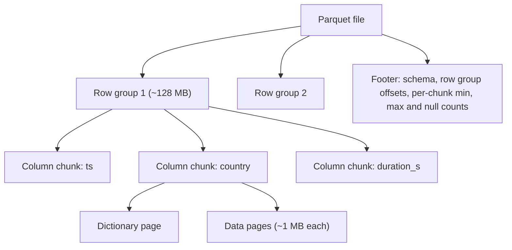
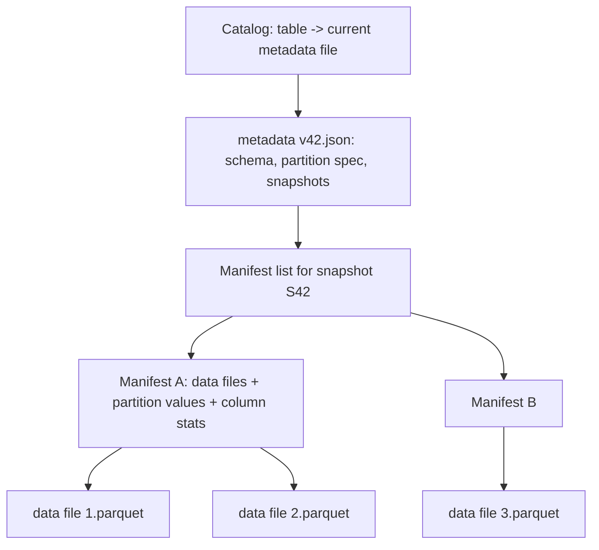

An analyst asks for total watch hours by country for May. The events table has 60 columns and about 50 billion rows a year, roughly 400 bytes per row. Stored row by row (CSV, JSON, Avro), the query must read every byte of every row in May, about 1.7 TB, to use three of the sixty columns. Stored in a columnar format, partitioned by day, it reads three compressed columns for 31 days, on the order of 20 GB. Same data, same answer, about 80 times fewer bytes, and on object storage bytes read is time and money.

That is the first half of this lesson. The second half is about what goes wrong once you have millions of those files in S3 and call a directory of them "a table": readers see half-written data, planning a query means listing 100,000 directories, two writers corrupt each other, and renaming a column silently breaks old files. Table formats (Apache Iceberg, which began at Netflix, plus Delta Lake and Apache Hudi) fix that by adding a metadata layer with atomic commits. Together, open columnar files, a table format and object storage are what people mean by a **lakehouse**.

## Row versus column layout

A row-oriented file stores each record's fields together: `(ts, user, title, country, duration, …)`, then the next record. That is ideal for writing one event or reading a whole record. A column-oriented file stores all values of `ts` together, then all values of `user`, and so on. Three consequences follow:

1. **Column pruning.** A query that touches 3 of 60 columns reads roughly 3/60 of the bytes.
2. **Better compression.** A column holds values of one type with similar distributions, so type-specific encodings work far better than general compression on mixed rows.
3. **Vectorised execution.** An engine can process a batch of 4,096 values of one column in a tight loop that the CPU pipelines and vectorises, instead of interpreting one row at a time. The [OLAP engines](/learn/big-data/batch-processing/olap-engines) lesson builds on this.

The encodings are worth knowing by name because they explain why sort order matters so much:

| Encoding | How it works | Great for |
|---|---|---|
| Dictionary | Store each distinct value once; store small integer ids per row | Low-cardinality strings (`country`: ~190 values, 1 byte per row instead of ~10) |
| Run-length (RLE) | Store `(value, repeat count)` | Sorted or clustered columns: a million sorted `country` ids collapse to about 190 runs |
| Bit-packing | Store integers in the minimum bits needed | Dictionary ids, small counts, booleans |
| Delta | Store differences between consecutive values | Sorted timestamps and ids: deltas are tiny and bit-pack well |

After encoding, pages are usually compressed again with Snappy or Zstandard. A column that is sorted or clustered often shrinks by 10–50×; the same column in random order may shrink by 3×.

## Inside a Parquet file



- A file is divided into **row groups** (typically 128 MB–1 GB of data). Within each row group, every column is stored contiguously as a **column chunk**, divided into **pages** of around 1 MB, the unit of encoding and compression.
- The **footer** at the end of the file holds the schema and, for every column chunk, its offset and **statistics**: min, max and null count. Readers fetch the footer first (one small ranged GET), decide what they need, then issue ranged GETs for just those chunks.
- Optional **page indexes** record min/max per page, and optional **Bloom filters** per column chunk answer "is this exact value definitely absent?"

ORC, the other common format, has the same shape with different names (stripes instead of row groups) and built-in lightweight indexes.

## Predicate pushdown and why sort order decides it

With `WHERE event_ts BETWEEN '2024-05-01 10:00' AND '2024-05-01 11:00'`, the reader compares the predicate with each row group's min/max for `event_ts` and skips every row group whose range cannot overlap. This is **predicate pushdown** (also called zone-map or min/max pruning), and it is only as good as the data's clustering.

- If files are written in event-time order, each row group covers a narrow time range, and a one-hour filter over a month touches about 1/720 of the row groups.
- If rows are in random order, every row group's min is near the start of the month and its max near the end. Every row group "might" match, and pruning skips nothing.

That is why writers sort within partitions (`ORDER BY` or `sortWithinPartitions` before writing) by the columns most often filtered on, and why multi-column clustering schemes such as Z-ordering exist: they keep several columns reasonably clustered at once, trading perfect locality on one column for decent locality on two or three.

Min/max statistics cannot help an equality predicate on a high-cardinality, unclustered column such as `user_id = 91823311`: every row group's range covers it. That is what column-chunk Bloom filters are for.

```viz
{"type": "system", "scenario": "bloom-filter",
 "title": "Bloom filters: definitely absent, or maybe present",
 "caption": "A Parquet reader can check a column chunk's Bloom filter before fetching it. A negative answer is certain, so the chunk is skipped; a positive answer may be false, costing one unnecessary read. A few bits per distinct value buy skipping for point lookups that min/max statistics cannot prune."}
```

## Exercise: prune row groups

```exercise
id: prune-row-groups
title: Min/max pruning for a range predicate
prompt: |
  A reader evaluates `lo <= x AND x <= hi` against a Parquet file. For each
  row group it knows the column statistics `[min, max]` for `x`. A row group
  whose values are all null has statistics `[null, null]`.

  Return the indices (ascending) of the row groups the reader must read,
  that is, the ones whose range could contain a matching value.

  - `lo` or `hi` may be `null`, meaning that side is unbounded.
  - A null value never satisfies the predicate, so all-null row groups are
    always skipped.
  - Bounds are inclusive.
languages: [python, javascript]
entry: prune_row_groups
starter:
  python: |
    def prune_row_groups(stats, lo, hi):
        # stats: list of [min, max] (or [None, None] for an all-null group)
        return []
  javascript: |
    function prune_row_groups(stats, lo, hi) {
      // stats: array of [min, max] (or [null, null] for an all-null group)
      return [];
    }
tests:
  - args: [[[1, 10], [11, 20], [21, 30]], 15, 25]
    expected: [1, 2]
  - args: [[[5, 9], [1, 3], [10, 12]], null, 4]
    expected: [1]
    label: unbounded lower side
  - args: [[[null, null], [0, 100]], 50, 50]
    expected: [1]
    label: all-null row group is skipped
  - args: [[[1, 100], [2, 99], [1, 98]], 40, 41]
    expected: [0, 1, 2]
    label: unsorted data defeats pruning
  - args: [[[1, 10], [10, 20], [21, 30]], 20, 20]
    expected: [1]
    hidden: true
    label: inclusive boundaries
  - args: [[[1, 2], [null, null], [3, 4]], null, null]
    expected: [0, 2]
    hidden: true
    label: both sides unbounded
  - args: [[], 1, 5]
    expected: []
    hidden: true
    label: no row groups
hints:
  - "A row group can match only if its max is at least `lo` and its min is at most `hi`."
  - "Treat a `null` bound as always satisfied, and skip groups whose min is null."
```

## When a directory is not a table

The first data lakes, including Netflix's Hive-on-S3 warehouse, defined a table as a directory tree: `plays/date=2024-05-01/country=US/part-00042.parquet`. The metastore stored the table's schema and its list of partition directories, and the files inside a directory were whatever a listing returned. That design has five chronic problems:

1. **No atomic commits.** A job writing 500 files is visible file by file. Readers see partial output; a failed job leaves debris.
2. **Listing is planning.** To plan a query, the engine lists every matching partition directory. On an object store, 100,000 partitions means 100,000 or more LIST requests before reading a byte.
3. **No isolation between writers.** Two jobs overwriting the same partition can interleave and leave a mix of both outputs.
4. **Partitioning leaks into queries.** A table partitioned by a derived `event_date` string requires every query to filter on `event_date`, not on `event_ts`. Forget it and you scan the whole table. Changing the partitioning means rewriting the table.
5. **Fragile schema evolution.** Columns matched by name or position across old files make renames and drops dangerous; a renamed column reads as null, or worse, as another column's data.

## How Iceberg works

Iceberg replaces "the files in these directories" with an explicit, versioned tree of metadata.



- **Data files** are ordinary Parquet (or ORC/Avro), never modified after writing.
- **Manifests** list data files with their partition values and per-column statistics (min, max, null counts). A **manifest list** records the manifests that make up one snapshot, with partition summaries so whole manifests can be skipped.
- A **metadata file** holds the schema, the partition spec, and the list of snapshots. The **catalog** (Hive metastore, a REST catalog, AWS Glue, Nessie) stores one thing per table: a pointer to the current metadata file.

**A commit** writes new data files, new manifests, a new manifest list and a new metadata file, then asks the catalog to swap the pointer from `v42` to `v43` **only if it is still `v42`**. That compare-and-swap is the only step that needs atomicity. If another writer committed first, the loser re-reads the new base, checks whether the two changes conflict (for example, both rewrote the same files), and either re-applies its change on top or fails. This is optimistic concurrency control, and it works well when commits are infrequent relative to their duration; hundreds of concurrent streaming writers committing every few seconds to one table will spend their time retrying.

What falls out of this design:

- **Snapshot isolation for readers.** A query pins one snapshot and reads exactly its files, no matter what commits happen meanwhile. Old snapshots enable **time travel** and reproducible reads.
- **Planning without listing.** The engine reads a few metadata files and prunes manifests and data files using partition values and column statistics, so planning cost no longer depends on the number of directories.
- **Hidden partitioning.** The spec says `days(event_ts)`, and Iceberg derives partition values itself. Queries filter on `event_ts` and get pruning automatically. The spec can evolve (from days to hours) without rewriting old data; each file records the spec it was written with.
- **Schema evolution by column ID.** Every column has a permanent ID, and files are read by ID, so renames, drops and reorders are safe metadata changes.

```sql
CREATE TABLE warehouse.analytics.plays (
  event_ts    TIMESTAMP,
  user_id     BIGINT,
  title_id    BIGINT,
  country     STRING,
  duration_s  INT
) USING iceberg
PARTITIONED BY (days(event_ts), bucket(16, user_id));

-- Pruned by the hidden days(event_ts) partition; no event_date column needed.
SELECT country, SUM(duration_s) / 3600.0 AS watch_hours
FROM warehouse.analytics.plays
WHERE event_ts >= TIMESTAMP '2024-05-01 00:00:00'
  AND event_ts <  TIMESTAMP '2024-06-01 00:00:00'
GROUP BY country;

-- Reproduce yesterday's report exactly.
SELECT COUNT(*) FROM warehouse.analytics.plays TIMESTAMP AS OF '2024-06-02 06:00:00';
```

### Updates and deletes

Files are immutable, so a `DELETE` or `MERGE INTO` has two strategies:

- **Copy-on-write**: rewrite every data file that contains an affected row. Reads stay fast; a one-row delete rewrites a whole 512 MB file.
- **Merge-on-read**: write small **delete files** that mark rows as removed (by file position or by key), and let readers apply them at query time. Writes are cheap; reads slow down as delete files accumulate until compaction folds them in.

Choose per table: copy-on-write for tables with rare, large batch updates; merge-on-read for frequent small updates such as CDC upserts or GDPR deletions. Either way, the table needs **maintenance**: compaction of small files, expiring old snapshots (which is what actually lets deleted data be physically removed, important for privacy deletions), and removing orphaned files left by failed writes. A lakehouse without scheduled maintenance slowly turns back into a small-files problem.

## Iceberg, Delta and Hudi

| | Iceberg | Delta Lake | Hudi |
|---|---|---|---|
| Origin | Netflix, donated to Apache in 2018 | Databricks | Uber |
| Commit log | Tree of metadata files, pointer swap in a catalog | Ordered JSON commit files in `_delta_log/`, periodic Parquet checkpoints; commit by creating the next numbered file atomically | Timeline of instants per table |
| Strength | Engine neutrality, hidden partitioning, large-table planning | Tight Spark and Databricks integration | Record-level upserts and incremental pulls |

They converged on the same ideas: immutable data files, a log or tree of metadata, optimistic concurrency, snapshots, and row-level deletes. Pick by the engines you need to support and the write pattern, not by benchmark claims.

```viz
{"type": "system", "scenario": "mvcc",
 "title": "Snapshots are MVCC at table scale",
 "caption": "A database keeps row versions so readers see a consistent snapshot while writers proceed. A table format does the same with whole files: a reader pins a snapshot, writers add a new one, and old versions are garbage-collected by snapshot expiry, the table-scale equivalent of vacuum."}
```

## Senior signals

- You estimate a query in **bytes read after pruning**: columns touched, partitions matched, row groups skipped, and you know sort order decides whether min/max statistics prune anything.
- You choose encodings indirectly, by choosing **sort and clustering** order at write time, and you use Bloom filters for high-cardinality point lookups.
- You can explain the five failures of **directory-as-table** and how a table format fixes them with a metadata tree and one atomic pointer swap.
- You know table-format commits are **optimistic**, so many high-frequency writers to one table conflict and retry, and you design ingestion accordingly.
- You plan **maintenance** (compaction, snapshot expiry, orphan cleanup) as part of the table, and you know snapshot expiry is what makes a privacy deletion physically real.
- You pick **copy-on-write or merge-on-read** from the update pattern, not by default.

## Check yourself

```quiz
- q: >-
    A 2 TB Parquet table is filtered with WHERE user_id = 12345. Reads touch almost every row group even though only 30 rows match. What is the most likely reason and fix?
  options: ["Parquet cannot filter integers; convert to ORC", "user_id is unclustered, so every row group's min/max range contains 12345; sort or cluster by user_id, or add Bloom filters on it", "The query needs a LIMIT clause", "Snappy compression prevents predicate pushdown"]
  answer: 1
  explanation: >-
    Min/max pruning only works when a row group's range can exclude the value. Random user_ids give every row group a range spanning almost all ids. Clustering by user_id narrows the ranges; a Bloom filter answers point lookups directly. Compression and file format are not the problem.
- q: >-
    Two Spark jobs commit to the same Iceberg table at the same moment. What happens?
  options: ["Both commits succeed and their metadata files are merged by the catalog", "One compare-and-swap of the table pointer wins; the other re-reads the new base and retries if the changes do not conflict, or fails", "The table is locked until an administrator intervenes", "The second commit silently overwrites the first"]
  answer: 1
  explanation: >-
    Iceberg uses optimistic concurrency: the catalog swaps the metadata pointer only if it still points at the version the writer started from. The loser rebases and retries, or fails on a real conflict. Nothing is silently lost and there is no global lock.
- q: >-
    Why does an Iceberg table partitioned by days(event_ts) not require queries to filter on a separate event_date column?
  options: ["Iceberg sorts every file by event_ts", "Partition values are derived from event_ts by the table's partition spec, so the planner translates predicates on event_ts into partition filters", "Iceberg stores one file per day", "Hidden partitioning disables pruning"]
  answer: 1
  explanation: >-
    Hidden partitioning keeps the transform in metadata. A range predicate on event_ts is converted into a range of day partitions during planning. With Hive-style partitioning the query must name the derived partition column or it scans everything.
- q: >-
    A GDPR process deletes a user's rows with DELETE FROM on a merge-on-read Iceberg table. When are the user's bytes actually gone from storage?
  options: ["Immediately, when the delete commits", "After compaction rewrites the affected files and the older snapshots that reference the original files are expired and their files removed", "Never, because Parquet is immutable", "After the next schema change"]
  answer: 1
  explanation: >-
    The delete commit only adds delete files; the original data files still exist and older snapshots still reference them for time travel. Compaction produces files without the rows, and snapshot expiry removes the old files. Privacy deletion needs both.
- q: >-
    A streaming job commits a new Iceberg snapshot every 10 seconds with 64 small files each time. After a month, queries are slow to plan and to run. What is the root cause?
  options: ["Iceberg does not support streaming writes", "Hundreds of thousands of small files and snapshots accumulate; the table needs compaction, manifest rewriting and snapshot expiry", "The catalog pointer swap is too slow", "Parquet footers are too large"]
  answer: 1
  explanation: >-
    64 files every 10 seconds is over 16 million files a month, plus a snapshot and manifests per commit. Planning and reading both scale with this debris. Scheduled compaction, manifest rewrites and snapshot expiry keep the table healthy; the format itself supports streaming writes.
```
