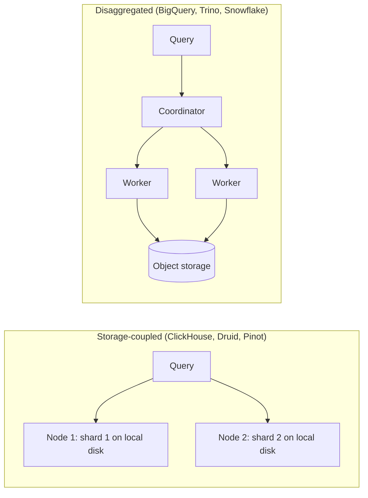

A product team wants a dashboard of streaming quality: rebuffer rate by device, country and title, over the last 30 days, filterable by any of those, refreshing in under two seconds for a few hundred internal users. The table holds about 100 billion rows. A Spark job can compute the answer, but it takes a minute to acquire executors before reading a byte. The warehouse's batch path is correct and far too slow. You need an engine whose whole design assumes that a human is waiting.

Online analytical processing (OLAP) engines are that design. They share the columnar ideas from the [previous lesson](/learn/big-data/batch-processing/columnar-formats-and-lakehouses) and add three more: an execution model that processes columns in batches instead of rows one at a time, indexes and layouts that skip most data before reading it, and an architecture chosen for either raw speed on local disks or elasticity over object storage. Knowing which trade-off each engine made is what lets you pick one in a design review instead of repeating a benchmark.

## Two architectures

**Storage-coupled, shared-nothing.** ClickHouse, Apache Druid and Apache Pinot store data on the local disks (or attached volumes) of the nodes that query it, in their own formats, pre-sorted and pre-indexed at ingest time. Every node owns a shard; a query fans out to all shards and merges partial results. There is no network hop between storage and compute, and the storage layout is tuned for the engine, so these systems deliver sub-second latency at high query rates. The cost is operational: data must be ingested into the engine, capacity is tied to disks, and resharding means moving data.

**Disaggregated.** BigQuery, Snowflake and Trino (formerly PrestoSQL, the community fork of Facebook's Presto) separate compute from storage. Data lives in columnar files in a distributed store (Colossus for BigQuery, S3 for Trino over Iceberg or Hive tables), and a fleet of stateless workers reads it for each query. Compute scales independently (BigQuery allocates "slots" per query; Trino clusters can grow and shrink) and one copy of the data serves many engines. The cost is latency: every query reads over the network, so these engines depend heavily on pruning and caching and tend to land in the one-to-ten-second range rather than tens of milliseconds.



Netflix has written publicly about both styles: Presto for interactive queries over its S3 warehouse, and Druid for real-time metrics on playback quality, where queries must return in well under a second over data that arrived moments ago.

## How a distributed query runs

A coordinator parses SQL, optimises it using table statistics, and splits the physical plan into **stages** (fragments) connected by **exchanges**, just like Spark. Leaf stages scan splits of the data (file row groups, or a node's local parts) and apply filters and partial aggregations; intermediate stages hash-partition rows by the group-by or join key; the final stage merges and sorts.

The crucial difference from Spark is how exchanges move data. Trino and BigQuery pipeline data between stages in memory (BigQuery through a dedicated in-memory shuffle tier), so all stages run concurrently and the first results can stream out before the scan finishes. That is why they are fast, and also why a worker failure traditionally failed the whole query: nothing was written to disk to recover from. Trino has since added an optional fault-tolerant mode that spools exchange data to storage, trading latency for the ability to retry tasks in long queries. Spark's disk-based shuffle is the opposite choice: slower, but a three-hour job survives losing machines.

Two optimisations matter enough to name:

- **Partial aggregation pushed to the leaves.** Every worker aggregates its splits before the exchange, so a `GROUP BY country` over 100 billion rows ships at most a few hundred rows per worker.
- **Dynamic filtering.** When joining a large fact table with a filtered dimension (`titles WHERE genre = 'anime'`), the engine builds the small side first, collects its join keys, and pushes them to the fact table's scan as an extra filter, so row groups without matching `title_id` values are skipped. A join that would scan 100 billion rows scans only what can match.

## Vectorised execution

The textbook query engine is the **Volcano (iterator) model**: each operator implements `next()`, which returns one row by calling `next()` on its child.

```python
class Filter:
    def __init__(self, child, pred):
        self.child, self.pred = child, pred
    def next(self):                       # one virtual call per row per operator
        while (row := self.child.next()) is not None:
            if self.pred(row):
                return row
        return None
```

Elegant, and slow at analytical scale. Scanning 1 billion rows through scan, filter, project and aggregate is 4 billion `next()` calls, each an indirect call with poor branch prediction and scattered memory access. At a few nanoseconds per call, the overhead alone is 10–20 seconds per core before any useful work.

**Vectorised execution** changes the unit of work from a row to a batch of one column's values (typically around 1,000–8,000):

```python
import numpy as np

def filter_batch(duration: np.ndarray, country_id: np.ndarray, us_id: int):
    # One call per batch of ~4,096 rows; the loops inside are tight and SIMD-friendly.
    mask = (duration >= 60) & (country_id == us_id)
    return np.flatnonzero(mask)            # a selection vector: indexes of surviving rows
```

- **Per-call overhead is amortised.** 1 billion rows in batches of 4,096 is about 244,000 calls per operator instead of a billion.
- **Tight loops over contiguous arrays** let the CPU prefetch, pipeline and use SIMD instructions that compare 8–16 values at once.
- **Selection vectors** record which rows survived a filter instead of copying them, and **late materialisation** fetches the other columns only for survivors.
- **Operating on encoded data.** A predicate `country = 'US'` is translated once to the dictionary id, then compared as small integers across the batch, never touching strings.

ClickHouse, DuckDB, Snowflake, BigQuery and Velox-based engines are vectorised. Spark SQL took the other main route, **code generation**: it compiles a whole stage of operators into one Java method with a single loop, which removes the virtual calls in a different way. Both approaches beat the row-at-a-time iterator by roughly an order of magnitude on scan-heavy queries.

## ClickHouse's MergeTree: sort once, skip most

ClickHouse's main table engine is a good model of the storage-coupled design:

```sql
CREATE TABLE playback_quality
(
    event_date  Date,
    event_ts    DateTime,
    title_id    UInt32,
    device      LowCardinality(String),
    country     LowCardinality(String),
    rebuffers   UInt16,
    play_s      UInt32
)
ENGINE = MergeTree
PARTITION BY toYYYYMM(event_date)
ORDER BY (title_id, country, event_date);

SELECT device,
       sum(rebuffers) / (sum(play_s) / 3600) AS rebuffers_per_hour
FROM playback_quality
WHERE title_id = 81234 AND country = 'BR'
  AND event_date >= today() - 30
GROUP BY device
ORDER BY rebuffers_per_hour DESC;
```

- Each insert creates an immutable **part**: columns stored sorted by the `ORDER BY` key. Background **merges** combine small parts into larger ones, exactly like compaction in an LSM tree.
- The **sparse primary index** stores one entry per **granule** of 8,192 rows (the default), not one per row. For 100 billion rows that is about 12 million entries, a few hundred megabytes that stay in memory; a per-row B-tree over the same data would be terabytes. The query binary-searches the index for granules where `(title_id, country)` match and reads only those, often a few thousand granules out of millions.
- The sort key is the whole performance story. Queries that filter on a prefix of `ORDER BY` are fast; queries that filter only on `device` scan everything. Secondary "data-skipping" indexes (min/max, set, Bloom filter per block of granules) and projections (a second copy of the data in another sort order) cover the other access paths, at a storage cost.

```viz
{"type": "system", "scenario": "lsm-tree",
 "title": "Parts and merges: the LSM idea inside an OLAP engine",
 "caption": "Writes land as small sorted runs and background compaction merges them into larger ones. ClickHouse parts, Druid segments and Pinot segments all follow this pattern. Too many small inserts create parts faster than merges can absorb them."}
```

The failure mode follows from the design: every `INSERT` creates a part, so inserting one row at a time from 500 application servers creates parts far faster than merges can combine them, and the engine starts rejecting inserts with a "too many parts" error. The fixes: batch inserts (thousands to hundreds of thousands of rows each, roughly once per second per table), enable the engine's asynchronous insert buffering, or put Kafka in front and let a consumer batch.

## Pre-aggregation and approximation

The fastest scan is the one you do not do. Three techniques turn a 100-billion-row query into a small one:

1. **Rollups and materialised views.** Aggregate at ingest to `(title_id, country, device, hour)` and store sums and counts. If the raw table has 100 billion rows and the rollup has 200 million, dashboard queries get 500 times cheaper. You lose the ability to slice by dimensions you rolled away, so keep the raw table for ad-hoc work. Druid and Pinot build this into ingestion.
2. **Additive measures only.** Store sums and counts, never averages or ratios, so rollups can be re-aggregated (the same algebra as MapReduce combiners). The rebuffer rate above is computed at query time from two sums.
3. **Approximate distinct counts.** Exact `COUNT(DISTINCT user_id)` needs the full set of ids in memory and cannot be rolled up. HyperLogLog sketches use a few kilobytes per group, merge across rollups, and are accurate to about 1–2%. Every engine here exposes one (`uniq` in ClickHouse, `APPROX_COUNT_DISTINCT` in BigQuery and Trino). See [count-min sketch and HyperLogLog](/learn/advanced-data-structures/probabilistic-structures/count-min-sketch-and-hyperloglog).

## Choosing an engine

| Need | Good fit | Why |
|---|---|---|
| User-facing analytics, sub-second, high QPS, fresh data | ClickHouse, Druid, Pinot | Local sorted storage, sparse indexes, streaming ingestion, rollups |
| Ad-hoc SQL over the lakehouse, joins across sources | Trino | Reads Iceberg or Hive tables in place; connectors federate other stores |
| Managed warehouse, no cluster to run | BigQuery, Snowflake | Elastic compute; pay per bytes scanned or per compute time |
| Heavy transformations, hours-long jobs, ML preprocessing | Spark | Disk-based shuffle survives failures; rich APIs beyond SQL |

In a disaggregated engine with on-demand pricing, cost is bytes scanned, so the lessons on pruning are also lessons on the bill: a careless `SELECT *` over a petabyte-scale table can cost thousands of dollars in one query. In a storage-coupled engine, cost is the cluster you keep running, so the question becomes how much data to keep hot and how much to roll up or move to the lake.

## Senior signals

- You classify an engine as **storage-coupled or disaggregated** first, and derive latency, elasticity and operational cost from that choice.
- You explain **vectorised execution** in terms of amortised per-call overhead, tight loops over column batches, selection vectors and operating on dictionary ids.
- You design a ClickHouse or Druid table around its **sort key**, and you know the sparse index only helps queries that filter on a prefix of it.
- You know storage-coupled engines need **batched inserts**, and you put a queue in front of them rather than inserting per event.
- You reach for **rollups with additive measures** and **HyperLogLog** before adding hardware, and you keep the raw data for questions the rollup cannot answer.
- You know pipelined in-memory exchanges make interactive engines fast and fragile, and you keep hours-long jobs in an engine with a durable shuffle.

## Check yourself

```quiz
- q: >-
    A ClickHouse table is ORDER BY (title_id, country, event_date). Which query benefits least from the sparse primary index?
  options: ["WHERE title_id = 42", "WHERE title_id = 42 AND country = 'BR'", "WHERE device = 'tv'", "WHERE title_id = 42 AND country = 'BR' AND event_date = '2024-05-01'"]
  answer: 2
  explanation: >-
    The sparse index is sorted by the ORDER BY key, so it can narrow granules only for filters on a prefix of that key. device is not in the key at all, so every granule must be read unless a data-skipping index or projection covers it.
- q: >-
    Why does vectorised execution outperform the row-at-a-time iterator model on analytical queries?
  options: ["It uses less memory per row", "It amortises per-call overhead over batches and runs tight, SIMD-friendly loops over contiguous column values", "It avoids reading columns that are not needed", "It caches query results"]
  answer: 1
  explanation: >-
    The Volcano model pays a virtual call per row per operator; vectorised engines pay it per batch of thousands and run cache- and SIMD-friendly loops. Column pruning is a storage-format benefit available to both models, and result caching is unrelated.
- q: >-
    500 application servers insert one row per event directly into ClickHouse, and inserts start failing with a too-many-parts error. What is the underlying cause?
  options: ["The sort key has too many columns", "Every insert creates an immutable part, and parts are created faster than background merges can combine them", "ClickHouse cannot accept concurrent writers", "The sparse index has run out of memory"]
  answer: 1
  explanation: >-
    MergeTree turns each insert into a sorted part and relies on background merges, like LSM compaction. Tiny, frequent inserts overwhelm the merges. Batch inserts, async insert buffering, or a Kafka consumer that batches are the fixes.
- q: >-
    A dashboard shows average session length per country from an hourly rollup that stores the average per (country, hour). Daily numbers disagree with a direct query on raw data. Why?
  options: ["Rollups lose precision in floating point", "Averages are not additive; averaging hourly averages weights each hour equally regardless of session count. Store sum and count instead", "The rollup is missing late data", "Countries must be rolled up separately"]
  answer: 1
  explanation: >-
    Only additive measures can be re-aggregated correctly. Storing sum and count per hour lets any coarser grouping compute the exact average as total sum over total count. Late data could cause small differences, but the systematic error comes from averaging averages.
- q: >-
    Why has Trino traditionally failed a whole query when one worker dies, while Spark retries only the lost tasks?
  options: ["Trino does not support retries by design choice of its SQL dialect", "Trino pipelines exchange data in memory between concurrently running stages, so there is no durable intermediate output to recover from; Spark writes shuffle output to disk and recomputes from lineage", "Spark keeps two copies of every task", "Trino workers store the only copy of the table data"]
  answer: 1
  explanation: >-
    In-memory pipelined exchanges are what make interactive engines fast, and they leave nothing to restart from. Spark's materialised shuffle files and lineage let it rerun only the missing work. Trino's optional fault-tolerant mode spools exchanges to storage to get retries back, at a latency cost.
```
