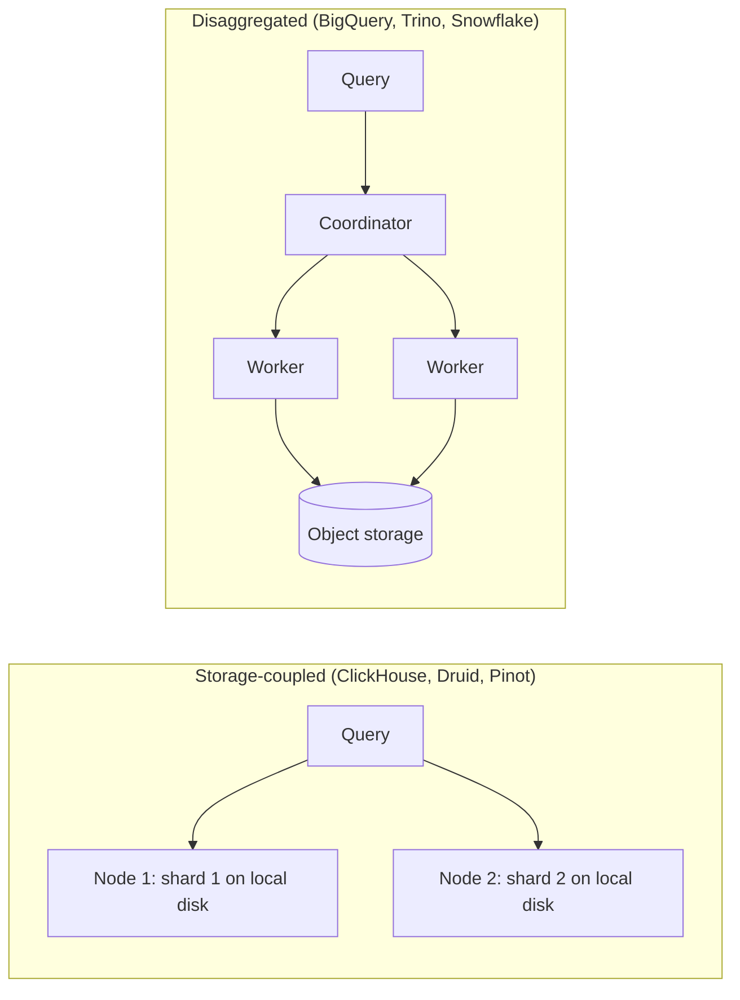

A product team wants a dashboard of streaming quality: rebuffer rate by device, country and title, over the last 30 days, filterable by any of those, refreshing in under two seconds for a few hundred internal users. The table holds about 100 billion rows. A Spark job can compute the answer, but it takes a minute to acquire executors before reading a byte. The warehouse's batch path is correct and far too slow. You need an engine whose whole design assumes that a human is waiting.

Online analytical processing (OLAP) engines are that design. They share the columnar ideas from the [previous lesson](/learn/big-data/batch-processing/columnar-formats-and-lakehouses) and add three more: an execution model that processes columns in batches instead of rows one at a time, indexes and layouts that skip most data before reading it, and an architecture chosen for either raw speed on local disks or elasticity over object storage. Knowing which trade-off each engine made is what lets you pick one in a design review instead of repeating a benchmark.

## Two architectures

**Storage-coupled, shared-nothing.** ClickHouse, Apache Druid and Apache Pinot store data on the local disks (or attached volumes) of the nodes that query it, in their own formats, pre-sorted and pre-indexed at ingest time. Every node owns a shard; a query fans out to all shards and merges partial results. There is no network hop between storage and compute, and the storage layout is tuned for the engine, so these systems deliver sub-second latency at high query rates. The cost is operational: data must be ingested into the engine, capacity is tied to disks, and resharding means moving data.

**Disaggregated.** BigQuery, Snowflake and Trino (formerly PrestoSQL, the community fork of Facebook's Presto) separate compute from storage. Data lives in columnar files in a distributed store (Colossus for BigQuery, S3 for Trino over Iceberg or Hive tables), and a fleet of stateless workers reads it for each query. Compute scales independently (BigQuery allocates "slots" per query; Trino clusters can grow and shrink) and one copy of the data serves many engines. The cost is latency: every query reads over the network, so these engines depend heavily on pruning and caching and tend to land in the one-to-ten-second range rather than tens of milliseconds.



Netflix has written publicly about both styles: Presto for interactive queries over its S3 warehouse, and Druid for real-time metrics on playback quality, where queries must return in well under a second over data that arrived moments ago.

| Axis | Storage-coupled (ClickHouse, Druid, Pinot) | Disaggregated (BigQuery, Trino, Snowflake) |
|---|---|---|
| Typical latency on a pruned query | Tens to hundreds of milliseconds | One to ten seconds |
| Concurrency | Hundreds to thousands of queries per second per cluster | Tens to hundreds; slots or workers are the limit |
| Data freshness | Streaming ingest, visible in seconds | Whatever the table's commit cadence is |
| Elasticity | Add nodes, then move data | Add workers, no data movement |
| Sharing data with other engines | Copy it in; the format is private | One copy in open formats, many engines |
| Cost model | The cluster you keep running | Bytes scanned or compute time per query |

## How a distributed query runs

A coordinator parses SQL, optimises it using table statistics, and splits the physical plan into **stages** (fragments) connected by **exchanges**, as in [Spark](/learn/big-data/batch-processing/spark). Leaf stages scan splits of the data (file row groups, or a node's local parts) and apply filters and partial aggregations; intermediate stages hash-partition rows by the group-by or join key; the final stage merges and sorts.

The crucial difference from Spark is how exchanges move data. Trino and BigQuery pipeline data between stages (BigQuery through a [dedicated tier of remote-memory shuffle nodes](https://cloud.google.com/blog/products/bigquery/in-memory-query-execution-in-google-bigquery) that can spill to Colossus), so all stages run concurrently and the first results can stream out before the scan finishes. That is why they are fast. In Trino it is also why, by default, a worker failure fails the whole query: the exchange data lived in that worker's memory. Trino added an optional fault-tolerant mode in 2022 that spools exchange data to storage, trading latency for the ability to retry tasks in long queries. Spark's disk-based shuffle is the opposite choice: slower, but a three-hour job survives losing machines.

Two optimisations matter enough to name:

- **Partial aggregation pushed to the leaves.** Every worker aggregates its splits before the exchange, so a `GROUP BY country` over 100 billion rows ships at most a few hundred rows per worker.
- **Dynamic filtering.** When joining a large fact table with a filtered dimension (`titles WHERE genre = 'anime'`), the engine builds the small side first, collects its join keys, and pushes them to the fact table's scan as an extra filter, so row groups without matching `title_id` values are skipped. A join that would scan 100 billion rows scans only what can match.

### Under the hood: Trino and BigQuery

In **Trino**, the coordinator turns each table scan into **splits** (one per file, row group or ClickHouse-style part, sized by the connector), and each worker runs a fixed number of **drivers**, each pulling one split through a pipeline of operators one **page** (a batch of column blocks) at a time. Memory is governed per query and per node: a query that exceeds `query.max-memory-per-node` fails immediately with `Query exceeded per-node memory limit`, unless spilling is enabled for the operator that needs it. Joins default to a partitioned strategy (both sides hashed across workers) and switch to a broadcast of the build side when statistics say it is small; the build side of a hash join must fit in memory across the workers, which is the usual reason a Trino query dies. Fault-tolerant execution (off by default; `retry-policy=TASK` with an exchange manager) spools exchange pages to a file system, usually an object store, so a failed task can be retried, at the cost of the streaming pipeline.

**BigQuery** is Google's Dremel lineage: storage in Colossus in the Capacitor columnar format, compute on Borg, connected by the Jupiter network, with a distributed in-memory shuffle service between stages. A query is admitted with a number of **slots** (units of CPU and memory); the plan's stages are scheduled onto them and the execution graph in the console shows per-stage wait, read, compute and write time. On-demand pricing charges per byte scanned ($6.25 per TiB in the US regions at the time of writing, after a free first TiB each month), so partition and cluster pruning are the bill as much as the latency.

## Vectorised execution

The textbook query engine is the **Volcano (iterator) model**: each operator implements `next()`, which returns one row by calling `next()` on its child.

```python
class Filter:
    def __init__(self, child, pred):
        self.child, self.pred = child, pred
    def next(self):                       # one virtual call per row per operator
        while (row := self.child.next()) is not None:
            if self.pred(row):
                return row
        return None
```

Elegant, and slow at analytical scale. Scanning 1 billion rows through scan, filter, project and aggregate is 4 billion `next()` calls, each an indirect call with poor branch prediction and scattered memory access. At a few nanoseconds per call, the overhead alone is 10–20 seconds per core before any useful work.

**Vectorised execution** changes the unit of work from a row to a batch of one column's values (typically around 1,000–8,000):

```python
import numpy as np

def filter_batch(duration: np.ndarray, country_id: np.ndarray, us_id: int):
    # One call per batch of ~4,096 rows; the loops inside are tight and SIMD-friendly.
    mask = (duration >= 60) & (country_id == us_id)
    return np.flatnonzero(mask)            # a selection vector: indexes of surviving rows
```

- **Per-call overhead is amortised.** 1 billion rows in batches of 4,096 is about 244,000 calls per operator instead of a billion.
- **Tight loops over contiguous arrays** let the CPU prefetch, pipeline and use SIMD instructions that compare 8–16 values at once.
- **Selection vectors** record which rows survived a filter instead of copying them, and **late materialisation** fetches the other columns only for survivors.
- **Operating on encoded data.** A predicate `country = 'US'` is translated once to the dictionary id, then compared as small integers across the batch, never touching strings.

### One batch, traced

Take a batch of eight rows with `duration` `[70, 20, 95, 60, 5, 120, 61, 59]` and `country` stored as dictionary ids `[3, 3, 1, 3, 1, 3, 2, 3]` over the dictionary `{1: BR, 2: CA, 3: US}`, and the query `SELECT sum(duration) WHERE duration >= 60 AND country = 'US'`.

1. The planner looks up `'US'` in the dictionary once: id 3. The string is never compared again.
2. `duration >= 60` over the batch gives the bitmask `1 0 1 1 0 1 1 0` (one SIMD compare over eight 32-bit values).
3. `country_id == 3` gives `1 1 0 1 0 1 0 1`.
4. The AND gives `1 0 0 1 0 1 0 0`, which becomes the selection vector `[0, 3, 5]`.
5. The aggregate reads `duration` at those three positions: 70 + 60 + 120 = 250. Nothing was copied; the other columns of the batch were never touched.

At 4,096 rows per batch the same five steps run about 244,000 times for a billion rows, and each step is a loop the compiler can unroll and vectorise. The row-at-a-time engine would perform a billion string comparisons in step 3 alone.

ClickHouse, DuckDB, Snowflake, BigQuery and Velox-based engines are vectorised. Spark SQL took the other main route, **code generation**: it compiles a whole stage of operators into one Java method with a single loop, which removes the virtual calls in a different way. Both approaches beat the row-at-a-time iterator by roughly an order of magnitude on scan-heavy queries.

## ClickHouse's MergeTree: sort once, skip most

ClickHouse's main table engine is a good model of the storage-coupled design:

```sql
CREATE TABLE playback_quality
(
    event_date  Date,
    event_ts    DateTime,
    title_id    UInt32,
    device      LowCardinality(String),
    country     LowCardinality(String),
    rebuffers   UInt16,
    play_s      UInt32
)
ENGINE = MergeTree
PARTITION BY toYYYYMM(event_date)
ORDER BY (title_id, country, event_date);

SELECT device,
       sum(rebuffers) / (sum(play_s) / 3600) AS rebuffers_per_hour
FROM playback_quality
WHERE title_id = 81234 AND country = 'BR'
  AND event_date >= today() - 30
GROUP BY device
ORDER BY rebuffers_per_hour DESC;
```

- Each insert creates an immutable **part**: columns stored sorted by the `ORDER BY` key. Background **merges** combine small parts into larger ones, exactly like compaction in an [LSM tree](/learn/advanced-data-structures/log-structured-and-disk-structures/lsm-trees-and-sstables).
- The **sparse primary index** stores one entry per **granule** of 8,192 rows (`index_granularity`), not one per row. For 100 billion rows that is about 12 million entries, a few hundred megabytes that stay in memory; a per-row B-tree over the same data would be terabytes. The query binary-searches the index for granules where `(title_id, country)` match and reads only those, often a few thousand granules out of millions.
- The sort key is the whole performance story. Queries that filter on a prefix of `ORDER BY` are fast; queries that filter only on `device` scan everything. Secondary "data-skipping" indexes (min/max, set, Bloom filter per block of granules) and projections (a second copy of the data in another sort order) cover the other access paths, at a storage cost.

### Under the hood: a part on disk

A part is a directory named `<partition>_<min_block>_<max_block>_<level>`, for example `202405_1_1_0` for a fresh insert into the May partition. Inside it: `columns.txt` (the schema), `count.txt` (row count), `primary.idx` (the sparse index: the sort-key values of the first row of every granule), one `<column>.bin` per column holding compressed blocks (LZ4 by default, 64 KB to 1 MB uncompressed per block), one `<column>.mrk2` mark file per column (`.cmrk2` in recent releases, which compress marks by default) with, for every granule, the offset of the compressed block and the offset within it once decompressed, `partition.dat` and `minmax_event_date.idx` for partition pruning, and `checksums.txt`. Parts under about 10 MB (`min_bytes_for_wide_part`) are written in a compact form with all columns in one file to save file handles.

A merge of parts `202405_1_1_0` and `202405_2_2_0` produces `202405_1_2_1`: the block range widens and the level increments, and the inputs are deleted after the merge commits. Merges are the only way rows ever move; `ALTER TABLE … UPDATE` and `DELETE` are **mutations** that rewrite whole parts in the background, which is why they are expensive and why lightweight deletes (which mask rows until the next merge) exist.

### The sparse index, traced

The table's primary index for one part has these entries (one per granule of 8,192 rows; only the first two key columns shown):

| Granule | First key | Granule | First key |
|---|---|---|---|
| 0 | (100, AR) | 5 | (81234, BR) |
| 1 | (100, US) | 6 | (81234, BR) |
| 2 | (812, BR) | 7 | (81234, CA) |
| 3 | (81234, AR) | 8 | (81234, US) |
| 4 | (81234, BR) | 9 | (90000, BR) |

For `title_id = 81234 AND country = 'BR'`, a granule can hold matching rows only if its first key is at most `(81234, BR)` and the next granule's first key is at least `(81234, BR)`. Granule 3 qualifies (it starts at `(81234, AR)` and its last rows may already be `BR`), granules 4, 5 and 6 qualify, granule 7 starts at `(81234, CA)` and is skipped, and granules 0–2 end before the key. Four granules, 32,768 rows, are read from a part of 81,920. The mark files then give, for `device`, `rebuffers` and `play_s`, the byte offsets of granule 3's compressed blocks, so three column reads of a few hundred kilobytes replace a scan. Before any of that, `minmax_event_date.idx` already dropped every part whose date range ends before `today() - 30`.

Now the query `WHERE device = 'tv'`: `device` is not a prefix of the sort key, so no granule can be excluded, and the engine reads every granule of `device` (cheap, because `LowCardinality` stores one byte per row) and filters. A skip index (`INDEX device_idx device TYPE set(100) GRANULARITY 4`) would let it drop blocks of four granules whose set of devices lacks `tv`, at the cost of a small index per part.

```viz
{"type": "system", "scenario": "lsm-tree", "variant": "parts",
 "title": "Parts and merges: the LSM idea inside an OLAP engine",
 "caption": "Writes land as small sorted runs and background compaction merges them into larger ones. ClickHouse parts, Druid segments and Pinot segments all follow this pattern. Too many small inserts create parts faster than merges can absorb them."}
```

The failure mode follows from the design: every `INSERT` creates a part, so inserting one row at a time from 500 application servers creates parts far faster than merges can combine them, and once a partition has more active parts than the configured limits the engine first delays inserts (`parts_to_delay_insert`, 1,000 by default) and then rejects them (`parts_to_throw_insert`, 300 before release 23.6 and 3,000 since) with a "too many parts" error. The fixes: batch inserts (thousands to hundreds of thousands of rows each, roughly once per second per table), enable the engine's asynchronous insert buffering, or put Kafka in front and let a consumer batch.

## Exercise: prune granules with a sparse index

```exercise
id: sparse-index-granules
title: Which granules must a sparse primary index read?
prompt: |
  `marks` is a sparse primary index: `marks[i]` is the sort key of the first
  row of granule `i`, as a list of values, and the rows are sorted by that
  key. Granule `i` holds rows with keys from `marks[i]` up to (and possibly
  including) `marks[i + 1]`; the last granule extends to the end of the
  part.

  `prefix` is an equality predicate on the first `len(prefix)` key columns
  (for example `[81234, "BR"]` means `title_id = 81234 AND country = 'BR'`).

  Return the ascending indices of the granules that may contain matching
  rows. Compare keys element by element, like tuples; only the first
  `len(prefix)` elements of each mark matter.
languages: [python, javascript]
entry: granules_to_read
starter:
  python: |
    def granules_to_read(marks, prefix):
        k = len(prefix)
        # tuple(mark[:k]) compares element by element against tuple(prefix)
        return []
  javascript: |
    function granules_to_read(marks, prefix) {
      const k = prefix.length;
      const cmp = (a, b) => {              // compare the first k elements like tuples
        for (let i = 0; i < k; i++) {
          if (a[i] < b[i]) return -1;
          if (a[i] > b[i]) return 1;
        }
        return 0;
      };
      return [];
    }
tests:
  - args: [[[100, "AR", "05-01"], [100, "US", "05-03"], [812, "BR", "05-01"], [81234, "AR", "05-02"], [81234, "BR", "05-01"], [81234, "BR", "05-09"], [81234, "BR", "05-20"], [81234, "CA", "05-01"], [81234, "US", "05-02"], [90000, "BR", "05-01"]], [81234, "BR"]]
    expected: [3, 4, 5, 6]
  - args: [[[100, "AR", "05-01"], [100, "US", "05-03"], [812, "BR", "05-01"], [81234, "AR", "05-02"], [81234, "BR", "05-01"], [81234, "BR", "05-09"], [81234, "BR", "05-20"], [81234, "CA", "05-01"], [81234, "US", "05-02"], [90000, "BR", "05-01"]], [81234]]
    expected: [2, 3, 4, 5, 6, 7, 8]
    label: a shorter prefix reads more granules
  - args: [[[100, "AR", "05-01"], [100, "US", "05-03"], [812, "BR", "05-01"]], [100, "US"]]
    expected: [0, 1]
    label: the granule before a matching mark may hold the first matches
  - args: [[[100, "AR", "05-01"], [100, "US", "05-03"], [812, "BR", "05-01"]], [50, "AA"]]
    expected: []
    label: a key before the first mark is nowhere
  - args: [[[100, "AR", "05-01"], [100, "US", "05-03"], [812, "BR", "05-01"]], [99999]]
    expected: [2]
    hidden: true
    label: the last granule extends to the end of the part
  - args: [[[81234, "BR", "05-01"], [81234, "BR", "05-09"], [81234, "BR", "05-20"], [81234, "CA", "05-01"]], [81234, "BR", "05-09"]]
    expected: [0, 1]
    hidden: true
    label: a full-key predicate
  - args: [[], [1]]
    expected: []
    hidden: true
    label: an empty part
hints:
  - "Granule i can match only if marks[i][:k] <= prefix and (i is the last granule or marks[i + 1][:k] >= prefix)."
  - "Both comparisons are inclusive: the first row of granule i + 1 can equal the key, and so can rows at the end of granule i."
```

## Pre-aggregation and approximation

The fastest scan is the one you do not do. Three techniques turn a 100-billion-row query into a small one:

1. **Rollups and materialised views.** Aggregate at ingest to `(title_id, country, device, hour)` and store sums and counts. If the raw table has 100 billion rows and the rollup has 200 million, dashboard queries get 500 times cheaper. You lose the ability to slice by dimensions you rolled away, so keep the raw table for ad-hoc work. Druid and Pinot build this into ingestion; a rollup that keeps a high-cardinality dimension such as `user_id` shrinks nothing, which is the first thing to check when a rollup is as big as its source.
2. **Additive measures only.** Store sums and counts, never averages or ratios, so rollups can be re-aggregated (the same algebra as MapReduce combiners). The rebuffer rate above is computed at query time from two sums.
3. **Approximate distinct counts.** Exact `COUNT(DISTINCT user_id)` needs the full set of ids in memory and cannot be rolled up. HyperLogLog sketches use a few kilobytes per group, merge across rollups, and are accurate to within a few per cent (Trino's `approx_distinct` defaults to a 2.3% standard error). Every engine here exposes one: `uniqCombined` or `uniqHLL12` in ClickHouse (its plain `uniq` uses a different, adaptive-sampling sketch), `APPROX_COUNT_DISTINCT` in BigQuery and `approx_distinct` in Trino. See [count-min sketch and HyperLogLog](/learn/advanced-data-structures/probabilistic-structures/count-min-sketch-and-hyperloglog).

Druid and Pinot make the rollup the storage format: ingestion writes immutable **segments** (Druid's documentation recommends about 5 million rows, or 300–700 MB, per segment) that are pre-aggregated to the chosen granularity, bitmap-indexed per dimension, and stored in deep storage (S3 or HDFS) as well as on the query nodes. Pinot's star-tree index goes one step further and pre-computes aggregates for combinations of dimensions, so a query over any subset of them touches a few thousand pre-aggregated rows.

## Choosing an engine

| Need | Good fit | Why |
|---|---|---|
| User-facing analytics, sub-second, high QPS, fresh data | ClickHouse, Druid, Pinot | Local sorted storage, sparse indexes, streaming ingestion, rollups |
| Ad-hoc SQL over the lakehouse, joins across sources | Trino | Reads Iceberg or Hive tables in place; connectors federate other stores |
| Managed warehouse, no cluster to run | BigQuery, Snowflake | Elastic compute; pay per bytes scanned or per compute time |
| Heavy transformations, hours-long jobs, ML preprocessing | Spark | Disk-based shuffle survives failures; rich APIs beyond SQL |

In a disaggregated engine with on-demand pricing, cost is bytes scanned, so the lessons on pruning are also lessons on the bill: a careless `SELECT *` over a petabyte-scale table can cost thousands of dollars in one query. In a storage-coupled engine, cost is the cluster you keep running, so the question becomes how much data to keep hot and how much to roll up or move to the lake.

## Production failure modes

**Inserts fail with "too many parts".** Symptom: writers get errors under load; `system.parts` shows thousands of active parts in one partition; merge threads are saturated. Diagnosis: many small inserts, one part each. Fix: batch to thousands of rows per insert about once a second, enable async inserts, or buffer through Kafka.

**A query the sort key does not cover reads everything.** Symptom: a filter on `device` alone takes seconds and reads the whole table's columns; `EXPLAIN indexes = 1` shows no granules dropped. Diagnosis: `device` is not a prefix of `ORDER BY`. Fix: a skip index if the filter is selective, a projection with a different sort order if the query is frequent, or accept the scan if it is rare.

**Mutations pile up and disks fill.** Symptom: `ALTER TABLE … DELETE` for a compliance request takes hours; `system.mutations` shows a queue; free disk halves. Diagnosis: each mutation rewrites every affected part in full, and parts are rewritten again by later merges. Fix: lightweight deletes, TTL expressions for time-based expiry, and batching compliance deletes into one mutation per day.

**A BigQuery bill spikes tenfold.** Symptom: one dashboard query costs more than the rest of the day. Diagnosis: `SELECT *` on an unpartitioned table, or a filter on a derived expression the partition pruner cannot use. Fix: partition and cluster the table, select columns, set `maximum_bytes_billed` on the job so a runaway query fails instead of charging.

**Trino queries die with a per-node memory error.** Symptom: `Query exceeded per-node memory limit` on a join. Diagnosis: the hash join's build side is the large table, because statistics were missing or stale and the optimiser guessed. Fix: collect statistics (`ANALYZE`), let cost-based join reordering pick the build side, enable spilling for that query, or filter the dimension first.

**The real-time dashboard lags by minutes.** Symptom: Druid or Pinot shows data from ten minutes ago while Kafka is current. Diagnosis: ingestion tasks are behind (too few tasks for the partition count, or a segment hand-off stuck on deep storage). Fix: match ingestion tasks to Kafka partitions, size segments so hand-offs are frequent, and alert on ingestion lag as its own metric.

## What mid-level engineers get wrong

- **Treating the sort key as a secondary index list.** It is one order; every other filter is a scan unless a skip index or projection covers it.
- **Inserting per event.** Storage-coupled engines are LSM-shaped; they need batches.
- **Storing averages in a rollup.** They cannot be re-aggregated; store sums and counts.
- **Rolling up with a high-cardinality dimension.** The rollup is as large as the raw table.
- **Reading "in-memory shuffle" as a strength only.** In Trino's default mode it is also why a lost worker kills the query.
- **Comparing engines by benchmark numbers.** The architecture decides latency, elasticity and cost before any tuning.

## Interviewer follow-ups

**"Why can ClickHouse answer in 50 ms where Trino needs 3 s on the same data?"** Model answer: local, pre-sorted storage with a resident sparse index versus remote object storage read over the network for every query; the disaggregated engine pays first-byte latency per file and must plan from metadata. Common wrong answer: "ClickHouse is written in C++", which explains a constant factor, not the architecture.

**"How would you index a query that is not a prefix of the sort key?"** Model answer: a data-skipping index (min/max, set or Bloom) if selective, a projection if the query is hot enough to justify a second copy, or a materialised view for a fixed aggregation. Common wrong answer: "add the column to the ORDER BY", which only helps if it goes first and changes the existing order for everything else.

**"Why store sums and counts rather than the average the dashboard shows?"** Model answer: sums and counts merge across rollups and across nodes; averages of averages weight groups equally and are wrong. Common wrong answer: "for precision".

**"A Trino worker dies during a 20-minute query. What happens?"** Model answer: in the default pipelined mode the query fails, because exchange data lives in memory; with fault-tolerant execution the exchanges are spooled and the tasks retry. Common wrong answer: "it retries the task like Spark".

**"How would you keep a dashboard sub-second over 100 billion rows?"** Model answer: pre-aggregate at ingest to the dashboard's grain with additive measures and HyperLogLog sketches, choose the sort key from the filters, batch ingestion, and keep the raw table elsewhere for ad-hoc questions. Common wrong answer: "add nodes", which does not change per-query work.

## Senior signals

- You classify an engine as **storage-coupled or disaggregated** first, and derive latency, elasticity and operational cost from that choice.
- You explain **vectorised execution** in terms of amortised per-call overhead, tight loops over column batches, selection vectors and operating on dictionary ids, and you can trace a batch through a filter and an aggregate.
- You design a ClickHouse or Druid table around its **sort key**, know how the sparse index and mark files turn a predicate into byte ranges, and know the index only helps queries that filter on a prefix of it.
- You know storage-coupled engines need **batched inserts** and that mutations rewrite parts, and you put a queue in front of them rather than inserting per event.
- You reach for **rollups with additive measures** and **HyperLogLog** before adding hardware, and you keep the raw data for questions the rollup cannot answer.
- You know pipelined in-memory exchanges make interactive engines fast and fragile, and you keep hours-long jobs in an engine with a durable shuffle.

## Check yourself

```quiz
- q: >-
    A ClickHouse table is ORDER BY (title_id, country, event_date). Which query benefits least from the sparse primary index?
  options: ["WHERE title_id = 42 AND device = 'tv'", "WHERE device = 'tv' AND app_version = '5.2'", "WHERE title_id IN (42, 43) AND country = 'BR'", "WHERE title_id = 42 AND country = 'BR'"]
  answer: 1
  explanation: >-
    The sparse index is sorted by the ORDER BY key, so it can narrow granules only for filters on a prefix of that key. Neither device nor app_version is in the key at all, so every granule must be read unless a data-skipping index or projection covers it. The query on title_id = 42 AND device = 'tv' also filters on device, but its title_id prefix still narrows the granules.
- q: >-
    Why does vectorised execution outperform the row-at-a-time iterator model on analytical queries?
  options: ["It skips reading the columns the query does not need", "It pays call overhead per batch, in SIMD-friendly loops", "It needs less memory per row than the iterator model does", "It caches query results between repeated executions"]
  answer: 1
  explanation: >-
    The Volcano model pays a virtual call per row per operator; vectorised engines pay it per batch of thousands and run tight cache- and SIMD-friendly loops over contiguous column values. Column pruning is a storage-format benefit available to both models, and result caching is unrelated.
- q: >-
    500 application servers insert one row per event directly into ClickHouse, and inserts start failing with a too-many-parts error. What is the underlying cause?
  options: ["The sort key has too many columns for each insert", "Each insert makes a part faster than merges combine them", "ClickHouse cannot accept 500 concurrent writers at once", "The sparse primary index has run out of memory on the server"]
  answer: 1
  explanation: >-
    MergeTree turns each insert into an immutable sorted part and relies on background merges, like LSM compaction. Tiny, frequent inserts create parts faster than the merges can combine them. Batch inserts, async insert buffering, or a Kafka consumer that batches are the fixes; the number of writers matters only because each sends tiny inserts.
- q: >-
    A dashboard shows average session length per country from an hourly rollup that stores the average per (country, hour). Daily numbers disagree with a direct query on raw data. Why?
  options: ["Averages of averages ignore each hour's session count", "Each country must be rolled up in a separate table", "Floating-point rounding builds up across the hourly rollups", "The hourly rollup is missing late-arriving sessions"]
  answer: 0
  explanation: >-
    Averages are not additive: averaging hourly averages weights each hour equally regardless of session count. Only additive measures can be re-aggregated correctly, so store sum and count per hour and compute the exact average as total sum over total count. Late data could cause small differences, but the systematic error comes from averaging averages.
- q: >-
    Why has Trino traditionally failed a whole query when one worker dies, while Spark retries only the lost tasks?
  options: ["Spark runs two copies of every task in case one fails", "Stages exchange data in memory, with no durable output", "Each Trino worker holds the only copy of its table data", "Trino's SQL dialect has no way to express a task retry"]
  answer: 1
  explanation: >-
    Trino pipelines exchange data in memory between concurrently running stages; that is what makes interactive engines fast, and it leaves nothing to restart from. Spark writes shuffle output to disk and recomputes from lineage, so it reruns only the missing work. Trino's optional fault-tolerant mode spools exchanges to storage to get retries back, at a latency cost.
- q: >-
    A MergeTree part's sparse index has granule 3 starting at (81234, AR) and granule 4 starting at (81234, BR). For the predicate title_id = 81234 AND country = 'BR', why must granule 3 be read?
  options: ["The index stores only the first column, so country cannot be checked", "Its last rows may already have country BR before granule 4 begins", "Granules are always read in pairs so the mark file can be decoded", "The predicate is on a prefix, so every granule of the part is read"]
  answer: 1
  explanation: >-
    A mark records only the first row of its granule. Granule 3 starts at (81234, AR) and ends immediately before (81234, BR), so its final rows can be BR rows that the index cannot see. Granules whose first key is past the predicate, like one starting at (81234, CA), are skipped. The index holds all sort-key columns, and a prefix predicate is exactly what it prunes.
```
