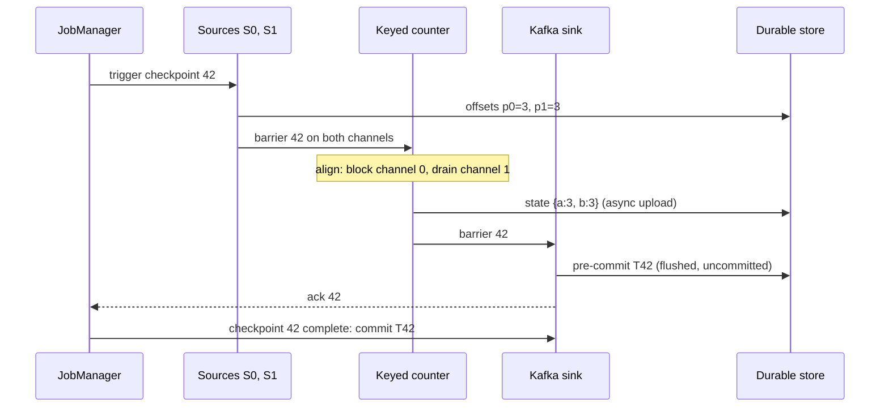

A sessionisation job keeps, for each of 200 million users, the start time, last event and running totals of their current viewing session. At 3 a.m. one of its 32 worker machines dies. The job must resume in minutes, with every user's session intact, without counting any event twice and without dropping the events that arrived while it was down. On a launch day the same job needs to go from 32 to 48 workers, and the state has to be split along with the work.

Windows, joins, deduplication, sessionisation and pattern detection are all **stateful**: the output for an event depends on events seen before it. Once a stream processor holds state, it is a distributed database with an unusual access pattern, and the hard problems are database problems: where the state lives, how it is made durable, and how it is repartitioned. This lesson traces Flink's checkpoint through a small topology, shows what RocksDB does underneath, contrasts Kafka Streams' changelog approach, and works the arithmetic that tells you whether a design holds.

## What state is and where it lives

Most state is **keyed state**: after `keyBy(user_id)` (Flink) or `groupByKey()` (Kafka Streams), every event for a key is routed to the same operator instance, which keeps that key's state locally. The routing is a shuffle, like the ones in [Spark](/learn/big-data/batch-processing/spark), except that it runs forever. Keyed state types are a value, a map (per-title counters for a user), a list (buffered events for a join), and window contents keyed by (key, window). There is also **operator state** that is not keyed, most importantly a source's current offset in each Kafka partition.

A **state backend** decides how the state is stored:

| Backend | Where state lives | Access cost | Memory footprint | Checkpoint | Good for |
|---|---|---|---|---|---|
| Heap (`HashMapStateBackend`) | Java objects on the TaskManager heap | Pointer chase, no serialisation | 2–5× the serialised size (headers, boxing, pointers); GC pauses scale with it | Full serialisation each time | State well under the heap, lowest latency |
| RocksDB (`EmbeddedRocksDBStateBackend`; Kafka Streams default) | An embedded LSM tree on local SSD with a block cache in managed memory | Serialise key and value on every access; reads may hit disk | Bounded by `taskmanager.memory.managed.fraction` (0.4) | Incremental: only new SST files | State far larger than memory |
| Disaggregated (Flink 2.0 `ForStStateBackend`) | Working state on object storage with a local cache | Asynchronous, batched remote reads | Small local cache | Near-instant, state already remote | Very large state where fast rescaling and recovery matter more than per-access latency |

Size it before choosing. 200 million users × about 300 bytes of serialised session state is 60 GB. On the heap, with object overhead, that is 120–300 GB spread over 32 instances, 4–9 GB of heap each, with GC pauses to match. In RocksDB it is 60–120 GB on disk including space amplification, 2–4 GB of local SSD per instance, with hot keys served from the block cache. RocksDB is the default for large state for this reason.

```viz
{"type": "system", "scenario": "lsm-tree",
 "title": "RocksDB underneath the operator",
 "caption": "State updates go to a memtable and are flushed as immutable sorted files, which compaction merges. Immutable files are what make incremental checkpoints cheap: a checkpoint uploads only the files created since the last one."}
```

## Checkpoints: a barrier traced through the topology

Flink uses **asynchronous barrier snapshotting**, a variant of the Chandy–Lamport distributed snapshot: a marker flows with the data, and every operator snapshots exactly the state produced by records before the marker. The topology: a Kafka source with two partitions (subtasks S0 reading p0, S1 reading p1), one keyed counter instance, and a transactional Kafka sink. Records are single letters; `p0 = [a, b, a, a]`, `p1 = [b, b, a]`.



Checkpoint 41 completed earlier with resume offsets p0=2, p1=1, state {a:1, b:2} and the sink's transaction T41 committed.

| Step | Event | Source offsets (next to read) | Counter state | Sink |
|---|---|---|---|---|
| 1 | S0 emits p0[2]=a; S1 emits p1[1]=b, p1[2]=a | p0=3, p1=3 | – | T42 open |
| 2 | JobManager triggers checkpoint 42; S0 and S1 record their offsets and emit barrier 42 behind those records | snapshot: p0=3, p1=3 | – | – |
| 3 | Counter processes a from channel 0 → emits a=2 | – | {a:2, b:2} | T42: a=2 |
| 4 | Barrier 42 arrives on channel 0: **alignment** begins, channel 0 is blocked; S0's next record p0[3]=a is buffered, not processed | – | {a:2, b:2} | – |
| 5 | Counter drains channel 1: b → b=3, a → a=3 | – | {a:3, b:3} | T42: a=2, b=3, a=3 |
| 6 | Barrier 42 arrives on channel 1: aligned. Counter snapshots {a:3, b:3} (RocksDB hard-links its files; upload proceeds in the background), forwards barrier 42, unblocks channel 0 | – | {a:3, b:3} | – |
| 7 | Sink receives barrier 42: flushes T42 (**pre-commit**), snapshots "T42 pending", acks the JobManager, opens T43 | – | – | T42 pre-committed |
| 8 | Counter processes buffered p0[3]=a → emits a=4 | – | {a:4, b:3} | T43: a=4 |
| 9 | All acks in: checkpoint 42 complete. JobManager notifies the sink, which **commits** T42 | – | – | Readers see a=2, b=3, a=3 |
| 10 | The TaskManager running the counter crashes | – | lost | T43 open, uncommitted |
| 11 | Recovery from checkpoint 42: state restored, sources rewind to p0=3, p1=3, T43 aborted | p0=3, p1=3 | {a:3, b:3} | T43 records invisible to `read_committed` readers |
| 12 | p0[3]=a is read again → a=4 emitted again in a new T43 | p0=4 | {a:4, b:3} | Committed once at checkpoint 43 |

Record p0[3] was delivered twice and affected state once, because the state it updated the second time was restored from before its first processing. The output a=4 was produced twice but only one copy is ever committed. That is exactly-once: the effect, not the delivery.

## Aligned versus unaligned barriers

Step 4 is the cost of alignment. Under **backpressure** a slow sink fills the network buffers between the sink and the counter; those buffers back up to the counter's inputs, and barrier 42 on channel 1 waits behind every buffered record. Alignment then takes as long as the buffers take to drain, checkpoints time out (`execution.checkpointing.timeout`, 10 min default), and a job that cannot complete checkpoints replays ever more data at its next failure.

```viz
{"type": "system", "scenario": "backpressure", "requests": 20,
 "title": "Backpressure between operators",
 "caption": "When a consumer is slower than its producer, bounded buffers fill and the producer is slowed rather than allowed to exhaust memory. Flink propagates this with credit-based flow control all the way back to the Kafka source, whose lag grows. Checkpoint barriers travel through the same full buffers, which is why checkpoints slow down under backpressure."}
```

**Unaligned checkpoints** (production-ready since Flink 1.13) change step 4: when barrier 42 arrives on channel 0, the counter forwards it immediately, overtaking the records still queued on channel 1, and writes those in-flight records (`b`, `a` from channel 1, plus anything buffered in its output) into checkpoint 42 alongside its state {a:2, b:2}. Recovery re-injects the in-flight records before the sources' data, so the result is identical. The checkpoint completes in roughly the barrier's network transit time regardless of backpressure, at the price of storing in-flight data, which under heavy backpressure can be gigabytes. `execution.checkpointing.aligned-checkpoint-timeout: 30s` starts aligned and switches to unaligned only when alignment stalls, which is the usual production setting.

## Under the hood: RocksDB and incremental checkpoints

Each keyed state is a RocksDB **column family**. A write goes to the memtable (a write buffer, 64 MB by default) and is flushed as an immutable **SST file**; background compaction merges SST files into larger, sorted ones. Immutability is what makes incremental checkpoints cheap: a checkpoint is the set of SST files that currently make up the database, and only files not already in durable storage need uploading.

| Checkpoint | Local SST files | Uploaded | Referenced from earlier checkpoints |
|---|---|---|---|
| 41 (first) | 001, 002, 003 | 001, 002, 003 (full) | – |
| 42 | 003, 004 (memtable flush), 005 (compaction of 001+002) | 004, 005 | 003 |
| 43 | 003, 005, 006 | 006 | 003, 005 |

A **shared state registry** on the JobManager reference-counts files. When checkpoint 41 is subsumed (`state.checkpoints.num-retained` is 1 by default), 001 and 002 lose their last reference and are deleted; 003 survives because 42 and 43 still point at it. The savings are large but not uniform: a compaction that rewrites a 10 GB level produces 10 GB of new files for the next checkpoint even though the logical state barely changed.

State TTL is configured per state descriptor: `StateTtlConfig.newBuilder(Duration.ofDays(30)).cleanupInRocksdbCompactFilter(1000)` stores an 8-byte last-access timestamp with each value and lets a RocksDB compaction filter drop expired entries as files are merged (checking the current time every 1,000 entries). Without a cleanup strategy, expired entries are hidden on read but stay on disk until they happen to be read or a full snapshot cleanup runs. Window and join state must also have an end: "join within 10 minutes" costs 10 minutes of both streams; "join ever" costs everything.

## The arithmetic of checkpointing

- **Replay on failure** is up to one interval plus restart time. At a 60-second interval, a 45-second restart (task scheduling, RocksDB download and open) and 200,000 events/s, that is about 21 million events to reprocess, during which output lags.
- **Upload bandwidth.** A full snapshot of 100 GB every minute is 1.7 GB/s sustained; incremental uploads run at the rate state changes plus compaction churn, typically a few gigabytes per minute for that job. Downloading 100 GB on recovery across 32 TaskManagers at 200 MB/s each takes about 16 seconds; on one TaskManager it takes over 8 minutes.
- **Interval versus duration.** Keep the interval at least 3–5× the typical checkpoint duration and set `min-pause` so a slow checkpoint cannot be followed immediately by the next; otherwise the job spends its life checkpointing.
- **Interval versus output latency.** With a transactional sink, results become visible only at commit, so the interval is a floor on end-to-end latency (next section).

```yaml
execution.checkpointing.interval: 60s
execution.checkpointing.mode: EXACTLY_ONCE
execution.checkpointing.timeout: 10min
execution.checkpointing.min-pause: 20s      # guarantee progress between checkpoints
execution.checkpointing.aligned-checkpoint-timeout: 30s   # go unaligned only when alignment stalls
state.backend.type: rocksdb
state.backend.incremental: true
state.backend.local-recovery: true          # keep a local copy so recovery on the same machine skips the download
state.checkpoints.dir: s3://checkpoints/sessionizer/
pipeline.max-parallelism: 1024              # fixes the number of key groups; see rescaling
```

Key names drift between Flink versions (`state.backend` became `state.backend.type` in 1.17); check the version you run.

## End-to-end exactly-once: the sink decides

Checkpoints make **state** exactly-once. Output emitted after a checkpoint and before a crash is emitted again after recovery, so the sink must make that invisible:

| Sink design | Duplicates visible? | Extra latency | Sink requirement | Failure handling |
|---|---|---|---|---|
| Idempotent upsert keyed by (window, key) or event id | Never, the replay overwrites the same rows | None | Keyed writes: Cassandra, Elasticsearch document ids, a primary key, a compacted topic | Simplest; correctness relies on a deterministic key |
| Two-phase commit (Kafka transactions, Iceberg commits) | Never for `read_committed` readers | Up to one checkpoint interval | A transactional endpoint | Pre-committed transactions must be re-committed after recovery; timeouts must exceed downtime |
| At-least-once plus reader-side deduplication | Yes, until the reader dedupes by event id | None | None | Moves the problem to every consumer forever |

The **two-phase-commit Kafka sink** in the trace opens one transaction per checkpoint interval. Its transactional id is derived from a prefix, the subtask index and the checkpoint id, so a recovered job can reconstruct the id of a pre-committed but uncommitted transaction (step 7 without step 9) and commit it, which is why the sink stores "T42 pending" in the checkpoint. Two consequences surprise teams. **Latency**: `read_committed` consumers see a 60-second interval's output in 60-second bursts; if the product needs 5-second freshness, you need a 5-second interval and the upload load that implies, or an idempotent sink. **Timeouts**: the broker aborts a transaction open longer than `transaction.timeout.ms`, and a pre-committed transaction that is aborted before the recovered job commits it loses its records. The producer's timeout must exceed checkpoint interval plus maximum tolerated downtime, and brokers cap it at `transaction.max.timeout.ms` (15 minutes by default). Flink's Kafka producer has historically defaulted to one hour, above the cap, so the two settings must be reconciled deliberately. A recovered job also aborts lingering transactions from its previous incarnation on start; until it does, their open state holds back the partitions' last stable offset for every committed reader, as the [Kafka lesson](/learn/big-data/streaming/kafka-internals) explains.

## Kafka Streams: state as a changelog

Kafka Streams reaches the same guarantee without external snapshots. Each state store (RocksDB by default) is backed by a **changelog topic** named `<application.id>-<store>-changelog`, compacted (compact plus delete for windowed stores), and every store update is also produced to it. With `processing.guarantee=exactly_once_v2`, the changelog write, the output records and the input offsets commit in one Kafka transaction every `commit.interval.ms` (100 ms under EOS).

Recovery **replays the changelog** into a fresh local store from the beginning to the current end offset. Cost is proportional to store size: a 50 GB store restored at 100 MB/s takes over 8 minutes, during which that task processes nothing. A clean shutdown writes a `.checkpoint` file with the changelog offset so a restart on the same machine resumes without replay; under EOS an unclean shutdown marks the local store untrusted, and it is wiped and rebuilt (KIP-892, transactional state stores, is the fix under way; check your version). **Standby replicas** (`num.standby.replicas=1`) keep a warm copy on another instance by consuming the changelog continuously, and since Kafka 2.6 (KIP-441) the assignor moves an active task only to an instance whose standby is within `acceptable.recovery.lag` (10,000 records) of the head, warming up elsewhere first. Failover becomes seconds.

| | Flink | Kafka Streams |
|---|---|---|
| Deployment | A cluster (JobManager + TaskManagers), or per-job on Kubernetes | A library inside your service; scale by running more instances |
| Durability of state | Periodic snapshots to object storage | Continuous changelog topics in Kafka |
| Recovery | Restore snapshot, rewind sources | Replay changelog, or promote a standby |
| Parallelism | Operator parallelism, bounded by max parallelism | Bounded by input partitions: one task per partition |
| Output visibility under EOS | At checkpoint commit (seconds to minutes) | At commit interval (100 ms) |
| Sources and sinks | Many connectors | Kafka in, Kafka out |
| Sweet spot | Large state, complex event-time pipelines, many sources | Kafka-centric services with moderate state |

## Rescaling with key groups

If keys were assigned to instances by `hash(key) mod parallelism`, going from 32 to 48 instances would move almost every key, and each new instance would have to scan every old snapshot to find its keys. Flink instead fixes a **max parallelism** (for example 1,024) and hashes every key into one of that many **key groups**, once and forever:

$$ \text{keyGroup} = \text{murmur}(\text{hash}(key)) \bmod \text{maxParallelism} $$

Key groups, not keys, are assigned to instances in **contiguous ranges**: with max parallelism M and parallelism p, instance i owns key groups ⌈i·M/p⌉ to ⌊((i+1)·M − 1)/p⌋. State is stored and snapshotted per key group (RocksDB keys are prefixed with the key group, so a range is a contiguous byte range), and when parallelism changes each new instance reads exactly the ranges it now owns, typically from one or two old instances' files, instead of everything.

The price is that **max parallelism is fixed** for the life of the state: you cannot scale beyond it, and changing it means discarding state or rewriting it offline. Choose it with headroom: 720 divides evenly by many parallelisms, 1,024 by repeated doubling; a very large value adds a small per-key-group overhead in every checkpoint. Rescaling goes through a **savepoint**, a manually triggered portable snapshot: stop with a savepoint, restart from it at the new parallelism. Give every stateful operator a stable **uid**, because operator ids derived from the graph change when you refactor, and a mismatch silently discards that operator's state.

In Kafka Streams the unit is the input partition: 32 partitions means at most 32 active tasks, and rescaling moves whole tasks with their stores between instances. Going beyond 32 means repartitioning the topic, with the key-movement problems from the Kafka lesson.

```exercise
id: key-group-rescaling
title: Plan a rescale with key groups
prompt: |
  A Flink operator has `max_parallelism` key groups numbered 0 to
  `max_parallelism - 1`. With parallelism p, operator instance i owns the
  contiguous range of key groups

      start = ceil(i * max_parallelism / p)
      end   = floor(((i + 1) * max_parallelism - 1) / p)

  (inclusive). The job is rescaled from `old_parallelism` to `new_parallelism`.
  For each new instance, in index order, return an object with:

  - `range`: `[start, end]` of the key groups it owns after rescaling.
  - `reads_from`: the sorted list of old instance indexes whose ranges overlap
    it, that is, whose checkpointed state it must read.

  Use integer arithmetic (`ceil(a / b)` is `(a + b - 1) // b` for non-negative integers).
languages: [python, javascript]
entry: rescale_plan
starter:
  python: |
    def rescale_plan(max_parallelism, old_parallelism, new_parallelism):
        # your code here
        return []
  javascript: |
    function rescale_plan(max_parallelism, old_parallelism, new_parallelism) {
      // your code here
      return [];
    }
tests:
  - args: [128, 3, 4]
    expected: [{"range": [0, 31], "reads_from": [0]}, {"range": [32, 63], "reads_from": [0, 1]}, {"range": [64, 95], "reads_from": [1, 2]}, {"range": [96, 127], "reads_from": [2]}]
  - args: [128, 2, 4]
    expected: [{"range": [0, 31], "reads_from": [0]}, {"range": [32, 63], "reads_from": [0]}, {"range": [64, 95], "reads_from": [1]}, {"range": [96, 127], "reads_from": [1]}]
    label: doubling splits each old range in two
  - args: [128, 4, 2]
    expected: [{"range": [0, 63], "reads_from": [0, 1]}, {"range": [64, 127], "reads_from": [2, 3]}]
    label: scaling down merges ranges
  - args: [10, 3, 3]
    expected: [{"range": [0, 3], "reads_from": [0]}, {"range": [4, 6], "reads_from": [1]}, {"range": [7, 9], "reads_from": [2]}]
    label: uneven division, no change
  - args: [8, 3, 5]
    expected: [{"range": [0, 1], "reads_from": [0]}, {"range": [2, 3], "reads_from": [0, 1]}, {"range": [4, 4], "reads_from": [1]}, {"range": [5, 6], "reads_from": [1, 2]}, {"range": [7, 7], "reads_from": [2]}]
    hidden: true
  - args: [4, 4, 1]
    expected: [{"range": [0, 3], "reads_from": [0, 1, 2, 3]}]
    hidden: true
    label: collapse to one instance
hints:
  - "Write a helper that returns `[start, end]` for instance i given M and p, and use it for both the old and the new parallelism."
  - "Two inclusive ranges [a, b] and [c, d] overlap when `a <= d` and `c <= b`."
```

## Production failure modes

| Failure | Symptom | Diagnosis | Fix |
|---|---|---|---|
| Checkpoint timeouts | Checkpoints fail after 10 minutes; the last successful one is hours old; a restart replays hours | Alignment time dominates the checkpoint duration; the operator before the sink shows 100% backpressured in the UI | Unaligned checkpoints or the aligned timeout so checkpoints complete; then fix the slow sink (batching, async I/O, parallelism), which is the root cause |
| State growing without bound | Checkpoint size climbs linearly for weeks; disks fill; restores slow down | Per-operator state size metric points at one keyed state; keys are never cleared (no TTL, a join with no bound, a window whose cleanup timer was never registered) | State TTL with compaction-filter cleanup, bounded interval joins, explicit timers to clear finished keys, and an alert on checkpoint size growth |
| Restore taking hours | A failover of one TaskManager leaves the job down for an hour | Full snapshots of a heap backend, or every TaskManager downloading the whole checkpoint from a slow object store; recovery on a new machine ignores local copies | Incremental RocksDB checkpoints, `state.backend.local-recovery`, smaller state per instance (more parallelism), a faster object store path |
| Backpressure from a slow sink | Source lag grows; the whole job runs at the sink's speed; checkpoints slow | The sink's `busyTimeMsPerSecond` is at 1,000 and upstream operators are backpressured; the sink writes one record per request | Batch writes, async sink with bounded in-flight requests, more sink parallelism; never remove the backpressure by dropping records silently |
| Transaction timeout after downtime | After a 20-minute outage the job recovers, but a window of output is missing | Pre-committed transactions were aborted by the broker before the job re-committed them | `transaction.timeout.ms` above interval plus tolerated downtime, and the broker's `transaction.max.timeout.ms` raised to match |

## Interviewer follow-ups

**"Why does replay after recovery not double-count?"** Model answer: the state and the source offsets are captured in the same consistent cut, so a replayed record updates state that has been rolled back to before it was first applied. Common wrong answer: "Flink deduplicates by Kafka offset," which it never does.

**"When would you turn on unaligned checkpoints, and what does it cost?"** Model answer: when alignment under backpressure makes checkpoints time out; it stores in-flight records in the checkpoint, so checkpoints grow with the backlog, and it does not fix the slow operator that caused the backpressure. Common wrong answer: "always, because they are faster," ignoring the size cost and the root cause.

**"You need 2-second end-to-end latency and exactly-once into Kafka. Options?"** Model answer: a 1–2 second checkpoint interval with a transactional sink, which is expensive in uploads and coordination, or an idempotent upsert design that decouples visibility from checkpoints. Common wrong answer: "exactly-once with a 60-second interval," which delivers results in minute-long bursts.

**"How do you choose max parallelism?"** Model answer: high enough for any parallelism you will ever run, composite enough to divide evenly, and set explicitly at first launch because changing it later means rewriting state. Common wrong answer: "Flink picks it, we can raise it later."

## What mid-level engineers get wrong

- Choosing the heap backend for 60 GB of state because it benchmarked faster on 1 GB, then meeting the garbage collector.
- Setting a 5-second checkpoint interval on a 100 GB job without incremental checkpoints and saturating the object store.
- Using a two-phase-commit sink and then asking why the dashboard updates once a minute.
- Leaving `transaction.timeout.ms` at a default that is either below the checkpoint interval or above the broker's cap, and discovering it during the first long outage.
- Forgetting operator uids, refactoring a map into two operators, and losing state on the next deploy from a savepoint.
- Sizing Kafka Streams recovery on the commit interval instead of the store size; the changelog replay is the whole store.
- Keeping join state forever because the join has no time bound, and calling it a memory leak in RocksDB.

## Senior signals

- You size state first (keys × bytes, amplification, per-instance share) and choose **heap or RocksDB** from the numbers, with TTLs so state does not grow forever.
- You can trace a checkpoint barrier through source, keyed operator and sink, name what each snapshots (offsets, state, pending transaction) and explain why replayed records do not double-count.
- You know the difference between aligned and unaligned barriers, what unaligned checkpoints store, and that they do not cure the backpressure that made them necessary.
- You explain incremental checkpoints as SST files plus a reference-counting registry, and you know compaction can make an "incremental" upload large.
- You separate **exactly-once state** from **exactly-once output**, and choose idempotent upserts or two-phase-commit sinks knowing the latency, timeout and re-commit rules of the latter.
- You relate checkpoint interval to **replay time, upload bandwidth and output latency**, and watch checkpoint duration and alignment time as leading indicators of trouble under backpressure.
- You choose **max parallelism** up front, set operator **uids**, and rescale through savepoints; in Kafka Streams you know partitions cap parallelism and standby replicas with warm-up cap recovery time.

## Check yourself

```quiz
- q: >-
    A Flink job restores from checkpoint 42 after a crash and reprocesses 50 seconds of Kafka records. Why are per-user counters not double-counted?
  options: ["Kafka transactions stop the source from re-delivering them", "Counters are restored to checkpoint 42, before those records", "Flink deduplicates replayed records using their Kafka offsets", "RocksDB ignores writes that repeat an earlier key and value"]
  answer: 1
  explanation: >-
    State and source positions are snapshotted consistently by the barrier: the counters go back to their values at checkpoint 42, and the sources rewind to the offsets recorded in the same checkpoint. The replayed records are applied to state that has never seen them, so each record affects state exactly once. Records are delivered twice (nothing deduplicates them); their effect is not.
- q: >-
    A job uses Flink's exactly-once Kafka sink with a 2-minute checkpoint interval. Downstream read_committed consumers complain that data arrives in bursts every two minutes. Why?
  options: ["The watermark lags two minutes, so windows fire in batches", "The Kafka producer lingers for two minutes to fill batches", "Unaligned checkpoints hold output until barriers catch up", "Transactions commit only when each checkpoint completes"]
  answer: 3
  explanation: >-
    The two-phase-commit sink pre-commits at the barrier and commits on checkpoint completion. Until then, read_committed consumers cannot see the records, so each period's output appears at once. Shorter intervals or an idempotent upsert sink reduce latency. Producer linger is milliseconds, not minutes.
- q: >-
    Checkpoints start timing out whenever a downstream Elasticsearch sink slows down. What is the most likely mechanism and a reasonable mitigation?
  options: ["Source offsets cannot be committed; increase Kafka retention", "RocksDB compaction is blocked; switch to the heap backend", "The JobManager is overloaded; add more TaskManagers to share it", "Barriers queue behind full buffers; use unaligned checkpoints"]
  answer: 3
  explanation: >-
    Backpressure fills network buffers, and barriers travel with the data, so they queue behind them and aligned checkpoints stall. Unaligned checkpoints let barriers overtake in-flight records, storing them in the snapshot. The slow sink remains the root cause to fix; adding TaskManagers does not unblock the barriers.
- q: >-
    Checkpoint 42 is incremental and references an SST file that was uploaded for checkpoint 41. Checkpoint 41 is then discarded because only one checkpoint is retained. What happens to that file?
  options: ["It is copied into checkpoint 42's directory before checkpoint 41 is removed", "It is deleted with checkpoint 41, and checkpoint 42 re-uploads it at the next interval", "It is rewritten by RocksDB compaction so that checkpoint 42 owns a fresh copy", "It is kept, because the shared state registry still counts a reference from checkpoint 42"]
  answer: 3
  explanation: >-
    Incremental checkpoints share immutable SST files, and the JobManager reference-counts them; a file is deleted only when no retained checkpoint points at it. Nothing is copied or re-uploaded, which is the whole saving. Compaction produces new files for future checkpoints but does not touch files already in durable storage.
- q: >-
    A Kafka Streams instance with a 60 GB state store dies. Recovery takes 10 minutes during which its partitions make no progress. What reduces this most directly?
  options: ["Adding more input partitions to the source topic", "Switching the state store to an in-memory store instead", "Raising the commit interval so less of the log is replayed", "Standby replicas that keep a warm copy of the store"]
  answer: 3
  explanation: >-
    Without a standby, the new owner rebuilds the store by replaying the changelog, which scales with store size, not with the commit interval. A standby replica continuously consumes the changelog on another instance, is already caught up, and can take over in seconds. An in-memory store would still need the full replay.
- q: >-
    A Flink job was started with max parallelism 128 and now needs 200 parallel instances. What is the problem?
  options: ["Flink splits key groups automatically when it rescales", "Only the sources are limited; keyed operators can go to 200", "Only 128 key groups exist, so at most 128 instances own state", "None; parallelism may exceed max parallelism at any time"]
  answer: 2
  explanation: >-
    Key groups are the atomic unit of keyed state and are never split. With 128 of them, more than 128 instances would leave some with nothing, and the key-to-key-group mapping is fixed for the life of the state, so raising max parallelism means discarding or rewriting the state. Choose max parallelism with headroom from the start.
```
