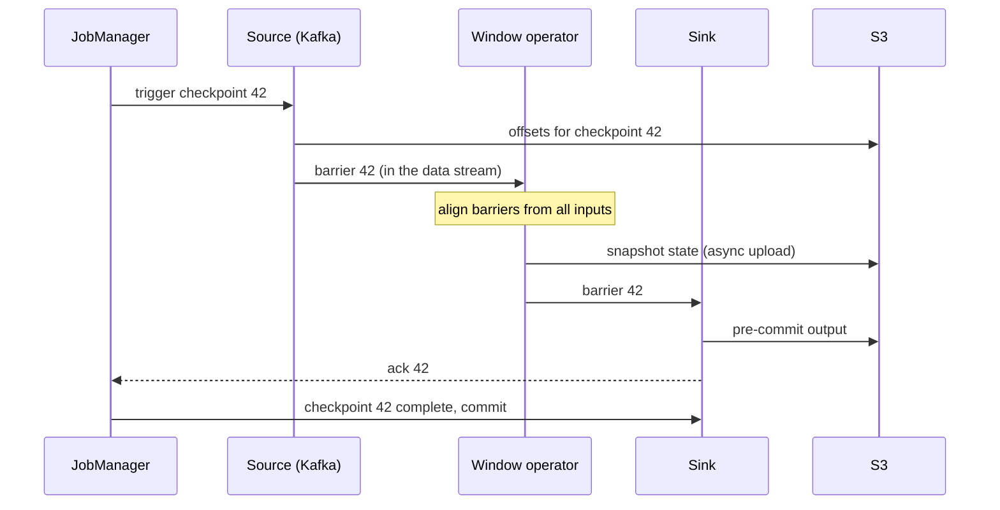

A sessionisation job keeps, for each of 200 million users, the start time, last event and running totals of their current viewing session. At 3 a.m. one of its 32 worker machines dies. The job must resume in minutes, with every user's session intact, without counting any event twice and without dropping the events that arrived while it was down. On a launch day the same job needs to go from 32 to 48 workers, and the state has to be split along with the work.

Windows, joins, deduplication, sessionisation and pattern detection are all **stateful**: the output for an event depends on events seen before it. Once a stream processor holds state, it is a distributed database with an unusual access pattern, and the hard problems are the database problems: where the state lives, how it is made durable, and how it is repartitioned. This lesson covers the mechanisms Flink and Kafka Streams use, and the arithmetic that tells you whether a given design will work.

## What state is and where it lives

Most state is **keyed state**: after `keyBy(user_id)` (Flink) or `groupByKey()` (Kafka Streams), every event for a key is routed to the same operator instance, which keeps that key's state locally. The routing is a shuffle, exactly like the ones in [Spark](/learn/big-data/batch-processing/spark), except that it runs forever. Typical keyed state types are a single value, a map (per-title counters for a user), a list (buffered events for a join), and window contents.

There is also **operator state** that is not keyed: most importantly, a source's current offsets in each Kafka partition.

A **state backend** decides how the state is stored:

| Backend | Where state lives | Good for | Costs |
|---|---|---|---|
| Heap (Flink `HashMapStateBackend`) | Java objects in the TaskManager heap | Small state, lowest latency | Limited by heap; garbage-collection pauses; object overhead can be 2–5× the raw data |
| RocksDB (Flink, Kafka Streams default) | An embedded LSM-tree on local SSD, with a memory cache | State far larger than memory | Every access serialises and deserialises; reads may hit disk |

Size it before choosing. 200 million users × about 300 bytes of serialised session state is 60 GB. As Java objects on the heap, with headers, pointers and boxed fields, it would be several times that; spread over 32 instances it is still tens of gigabytes of heap each, with GC pauses to match. In RocksDB it is roughly 60–120 GB on disk including space amplification, about 2–4 GB of local SSD per instance, with hot keys served from the block cache. RocksDB is the default for large state for this reason.

```viz
{"type": "system", "scenario": "lsm-tree",
 "title": "RocksDB underneath the operator",
 "caption": "State updates go to a memtable and are flushed as immutable sorted files, which compaction merges. Immutable files are what make incremental checkpoints cheap: a checkpoint uploads only the files created since the last one."}
```

Two practices keep state bounded. **State TTL** expires keys that have not been touched for a period (a user inactive for 30 days), because otherwise every key ever seen stays forever. And **window and join state** must have an end: an interval join between plays and ad impressions keeps both sides for the interval, so "join within 10 minutes" costs 10 minutes of both streams in state, while "join ever" costs everything.

## Checkpoints: consistent snapshots of a running dataflow

Local state is lost with its machine, so it must be snapshotted to durable storage. The naive approach, pausing the whole job and dumping every operator's state, is correct and unacceptably slow. Flink uses **asynchronous barrier snapshotting**, a variant of the Chandy–Lamport distributed snapshot algorithm:



1. The JobManager asks every source to start checkpoint *n*. Each source records its current offsets and emits a **barrier** into its output streams, in line with the data.
2. A barrier divides the stream into "before checkpoint *n*" and "after". When an operator with several inputs receives barrier *n* on one input, it **aligns**: it holds back further records from that input until barrier *n* arrives on every input, so its snapshot reflects exactly the records before the barrier on all inputs.
3. The operator snapshots its state (for RocksDB, a local hard-linked copy of the current files, then an asynchronous upload) and forwards the barrier. Processing resumes immediately; the upload happens in the background.
4. When every sink has acknowledged barrier *n*, the checkpoint is complete.

**Recovery** restarts the job from the latest completed checkpoint: every operator restores its state, and every source rewinds to its recorded offsets. Records after the checkpoint are processed again, but the state they update is the state from before they were first processed, so each record affects state **exactly once**. The records were delivered more than once; the effect was not duplicated.

### The arithmetic of checkpointing

- **Interval versus replay.** With a 60-second interval, a failure replays up to 60 seconds of input plus the time to restart. At 200,000 events/s that is up to 12 million events of catch-up, during which output lags. Shorter intervals reduce replay but cost more uploads.
- **Full versus incremental.** A full snapshot of 100 GB every minute is about 1.7 GB/s of sustained upload. Incremental RocksDB checkpoints upload only the SST files created since the previous checkpoint, perhaps a few gigabytes per minute, and reference unchanged files from earlier checkpoints.
- **Alignment under backpressure.** If a downstream operator is slow, network buffers fill and barriers queue behind them. Alignment then takes as long as it takes to drain those buffers, checkpoints start timing out, and a job that cannot complete checkpoints will replay hours of data after its next failure. **Unaligned checkpoints** let barriers overtake buffered records and store those in-flight records as part of the snapshot, trading larger checkpoints for completion under pressure.

```viz
{"type": "system", "scenario": "backpressure", "requests": 20,
 "title": "Backpressure between operators",
 "caption": "When a consumer is slower than its producer, bounded buffers fill and the producer is slowed rather than allowed to exhaust memory. Flink propagates this with credit-based flow control all the way back to the Kafka source, whose lag grows. Checkpoint barriers travel through the same full buffers, which is why checkpoints slow down under backpressure."}
```

A typical Flink configuration (key names vary slightly between versions):

```yaml
execution.checkpointing.interval: 60s
execution.checkpointing.mode: EXACTLY_ONCE
execution.checkpointing.timeout: 10min
execution.checkpointing.min-pause: 20s      # guarantee progress between checkpoints
execution.checkpointing.unaligned: true     # complete checkpoints under backpressure
state.backend: rocksdb
state.backend.incremental: true
state.checkpoints.dir: s3://checkpoints/sessionizer/
pipeline.max-parallelism: 1024              # fixes the number of key groups; see rescaling
```

## End-to-end exactly-once: the sink decides

Checkpoints make **state** exactly-once. The output is another matter: records emitted after checkpoint 42 and before the crash will be emitted again after recovery. Three designs handle that:

1. **Idempotent sink.** Write results as upserts keyed by something deterministic, such as (window start, title_id). A replay overwrites the same rows with the same values. This is the simplest and most robust option whenever the sink supports keyed writes (Cassandra, Elasticsearch with document ids, a database with a primary key, a compacted Kafka topic).
2. **Transactional sink with two-phase commit.** Flink's Kafka sink in exactly-once mode opens a Kafka transaction per checkpoint period, flushes and **pre-commits** when the barrier arrives, and **commits** only when the JobManager announces the checkpoint complete. On failure, uncommitted transactions are aborted and the replay writes them again.
3. **At-least-once with downstream deduplication.** Accept duplicates and remove them by event id at the reader. Cheap to build, and it moves the problem to every consumer.

The transactional sink has two costs that surprise teams. First, **latency**: `read_committed` consumers see nothing until the checkpoint completes, so end-to-end latency is at least the checkpoint interval. A 60-second interval means results appear in 60-second bursts; if the product needs 5-second freshness, you need a 5-second interval (and the upload load that implies) or an idempotent sink instead. Second, **timeouts**: an open Kafka transaction must survive the whole checkpoint interval plus any time spent recovering, or the broker aborts it and its records are lost. The producer's `transaction.timeout.ms` must therefore exceed checkpoint interval plus maximum expected downtime, and brokers cap it with `transaction.max.timeout.ms` (15 minutes by default), rejecting producers that ask for more. Flink's Kafka producer has historically defaulted to a one-hour timeout, so the two settings have to be reconciled deliberately.

## Kafka Streams: state as a changelog

Kafka Streams takes a different route to the same guarantee. Each state store (RocksDB by default) is backed by a **changelog topic**, a compacted Kafka topic that records every update. With `processing.guarantee=exactly_once_v2`, the store update's changelog write, the output records and the input offsets are committed in one Kafka transaction.

Recovery **replays the changelog** into a fresh local store. That is simple and needs no external storage, but its cost is proportional to the store size: restoring a 50 GB store at 100 MB/s takes over 8 minutes, during which that task processes nothing. **Standby replicas** (`num.standby.replicas=1`) keep a warm copy on another instance by continuously consuming the changelog, so failover is a matter of seconds.

| | Flink | Kafka Streams |
|---|---|---|
| Deployment | A cluster (JobManager + TaskManagers), or per-job on Kubernetes | A library inside your service; scale by running more instances |
| Durability of state | Periodic snapshots to object storage | Continuous changelog topics in Kafka |
| Recovery | Restore snapshot, rewind sources | Replay changelog (or promote a standby) |
| Parallelism | Operator parallelism, bounded by max parallelism | Bounded by input partitions: one task per partition |
| Sources and sinks | Many connectors | Kafka in, Kafka out |
| Sweet spot | Large state, complex event-time pipelines, many sources | Kafka-centric microservices with moderate state |

## Rescaling with key groups

The launch-day problem is repartitioning state. If keys were assigned to instances by `hash(key) mod parallelism`, changing parallelism from 32 to 48 would move almost every key, and each new instance would have to scan every old instance's full snapshot to find its keys.

Flink avoids this with **key groups**. A job has a fixed **max parallelism** (for example 1,024). Every key is hashed into one of those key groups once and forever:

$$ \text{keyGroup} = \text{murmur}(\text{hash}(key)) \bmod \text{maxParallelism} $$

Key groups, not keys, are assigned to operator instances, in **contiguous ranges**. With max parallelism M and parallelism p, instance i owns key groups from ⌈i·M/p⌉ to ⌊((i+1)·M − 1)/p⌋. State is stored and snapshotted per key group, so when parallelism changes, each new instance reads exactly the contiguous ranges it now owns, typically from one or two old instances' snapshots, instead of scanning everything.

The price is that **max parallelism is fixed** for the life of the state: you cannot scale beyond it, and changing it means discarding state or rewriting it offline. Choose it with headroom: a highly composite value such as 720 splits evenly across many parallelisms, while 1,024 splits evenly under repeated doubling; a very large value adds a small per-key-group overhead. Rescaling itself goes through a **savepoint**, a manually triggered, portable snapshot: stop with a savepoint, restart with the new parallelism from it. Give every stateful operator a stable **uid** so state can be matched to operators across code changes; without uids, a refactor that changes the auto-generated operator ids silently discards state.

In Kafka Streams the unit is the input partition: a topic with 32 partitions supports at most 32 active tasks, and rescaling moves whole tasks with their stores between instances. Going beyond 32 means repartitioning the topic, with the key-movement problems from the [Kafka lesson](/learn/big-data/streaming/kafka-internals).

```exercise
id: key-group-rescaling
title: Plan a rescale with key groups
prompt: |
  A Flink operator has `max_parallelism` key groups numbered 0 to
  `max_parallelism - 1`. With parallelism p, operator instance i owns the
  contiguous range of key groups

      start = ceil(i * max_parallelism / p)
      end   = floor(((i + 1) * max_parallelism - 1) / p)

  (inclusive). The job is rescaled from `old_parallelism` to `new_parallelism`.
  For each new instance, in index order, return an object with:

  - `range`: `[start, end]` of the key groups it owns after rescaling.
  - `reads_from`: the sorted list of old instance indexes whose ranges overlap
    it, that is, whose checkpointed state it must read.

  Use integer arithmetic (`ceil(a / b)` is `(a + b - 1) // b` for non-negative integers).
languages: [python, javascript]
entry: rescale_plan
starter:
  python: |
    def rescale_plan(max_parallelism, old_parallelism, new_parallelism):
        # your code here
        return []
  javascript: |
    function rescale_plan(max_parallelism, old_parallelism, new_parallelism) {
      // your code here
      return [];
    }
tests:
  - args: [128, 3, 4]
    expected: [{"range": [0, 31], "reads_from": [0]}, {"range": [32, 63], "reads_from": [0, 1]}, {"range": [64, 95], "reads_from": [1, 2]}, {"range": [96, 127], "reads_from": [2]}]
  - args: [128, 2, 4]
    expected: [{"range": [0, 31], "reads_from": [0]}, {"range": [32, 63], "reads_from": [0]}, {"range": [64, 95], "reads_from": [1]}, {"range": [96, 127], "reads_from": [1]}]
    label: doubling splits each old range in two
  - args: [128, 4, 2]
    expected: [{"range": [0, 63], "reads_from": [0, 1]}, {"range": [64, 127], "reads_from": [2, 3]}]
    label: scaling down merges ranges
  - args: [10, 3, 3]
    expected: [{"range": [0, 3], "reads_from": [0]}, {"range": [4, 6], "reads_from": [1]}, {"range": [7, 9], "reads_from": [2]}]
    label: uneven division, no change
  - args: [8, 3, 5]
    expected: [{"range": [0, 1], "reads_from": [0]}, {"range": [2, 3], "reads_from": [0, 1]}, {"range": [4, 4], "reads_from": [1]}, {"range": [5, 6], "reads_from": [1, 2]}, {"range": [7, 7], "reads_from": [2]}]
    hidden: true
  - args: [4, 4, 1]
    expected: [{"range": [0, 3], "reads_from": [0, 1, 2, 3]}]
    hidden: true
    label: collapse to one instance
hints:
  - "Write a helper that returns `[start, end]` for instance i given M and p, and use it for both the old and the new parallelism."
  - "Two inclusive ranges [a, b] and [c, d] overlap when `a <= d` and `c <= b`."
```

## Senior signals

- You size state first (keys × bytes, amplification, per-instance share) and choose **heap or RocksDB** from the numbers, with TTLs so state does not grow forever.
- You explain checkpoints as **barriers plus alignment plus source offsets**, and why replayed records do not double-count: state is restored to before they were processed.
- You separate **exactly-once state** from **exactly-once output**, and choose idempotent upserts or two-phase-commit sinks knowing the latency and timeout costs of the latter.
- You relate checkpoint interval to **replay time, upload bandwidth and output latency**, and you watch checkpoint duration and alignment time as leading indicators of trouble under backpressure.
- You choose **max parallelism** up front, set operator **uids**, and rescale through savepoints; in Kafka Streams you know partitions cap parallelism and standby replicas cap recovery time.

## Check yourself

```quiz
- q: >-
    A Flink job restores from checkpoint 42 after a crash and reprocesses 50 seconds of Kafka records. Why are per-user counters not double-counted?
  options: ["Kafka transactions stop the source from re-delivering them", "Flink deduplicates replayed records using their Kafka offsets", "Counters are restored to checkpoint 42, before those records", "RocksDB ignores writes that repeat an earlier key and value"]
  answer: 2
  explanation: >-
    State and source positions are snapshotted consistently by the barrier: the counters go back to their values at checkpoint 42, and the sources rewind to the offsets recorded in the same checkpoint. The replayed records are applied to state that has never seen them, so each record affects state exactly once. Records are delivered twice (nothing deduplicates them); their effect is not.
- q: >-
    A job uses Flink's exactly-once Kafka sink with a 2-minute checkpoint interval. Downstream read_committed consumers complain that data arrives in bursts every two minutes. Why?
  options: ["Transactions commit only when each checkpoint completes", "The Kafka producer lingers for two minutes to fill batches", "Unaligned checkpoints hold output until barriers catch up", "The watermark lags two minutes, so windows fire in batches"]
  answer: 0
  explanation: >-
    The two-phase-commit sink pre-commits at the barrier and commits on checkpoint completion. Until then, read_committed consumers cannot see the records, so each period's output appears at once. Shorter intervals or an idempotent upsert sink reduce latency. Producer linger is milliseconds, not minutes.
- q: >-
    Checkpoints start timing out whenever a downstream Elasticsearch sink slows down. What is the most likely mechanism and a reasonable mitigation?
  options: ["The JobManager is overloaded; add more TaskManagers to share it", "Barriers queue behind full buffers; use unaligned checkpoints", "Source offsets cannot be committed; increase Kafka retention", "RocksDB compaction is blocked; switch to the heap backend"]
  answer: 1
  explanation: >-
    Backpressure fills network buffers, and barriers travel with the data, so they queue behind them and aligned checkpoints stall. Unaligned checkpoints let barriers overtake in-flight records, storing them in the snapshot. The slow sink remains the root cause to fix; adding TaskManagers does not unblock the barriers.
- q: >-
    A Kafka Streams instance with a 60 GB state store dies. Recovery takes 10 minutes during which its partitions make no progress. What reduces this most directly?
  options: ["Raising the commit interval so less of the log is replayed", "Adding more input partitions to the source topic", "Standby replicas that keep a warm copy of the store", "Switching the state store to an in-memory store instead"]
  answer: 2
  explanation: >-
    Without a standby, the new owner rebuilds the store by replaying the changelog, which scales with store size, not with the commit interval. A standby replica continuously consumes the changelog on another instance, is already caught up, and can take over in seconds. An in-memory store would still need the full replay.
- q: >-
    A Flink job was started with max parallelism 128 and now needs 200 parallel instances. What is the problem?
  options: ["None; parallelism may exceed max parallelism at any time", "Only the sources are limited; keyed operators can go to 200", "Flink splits key groups automatically when it rescales", "Only 128 key groups exist, so at most 128 instances own state"]
  answer: 3
  explanation: >-
    Key groups are the atomic unit of keyed state and are never split. With 128 of them, more than 128 instances would leave some with nothing, and the key-to-key-group mapping is fixed for the life of the state, so raising max parallelism means discarding or rewriting the state. Choose max parallelism with headroom from the start.
```
