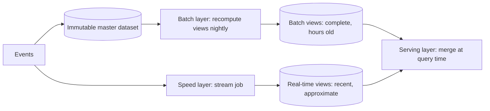
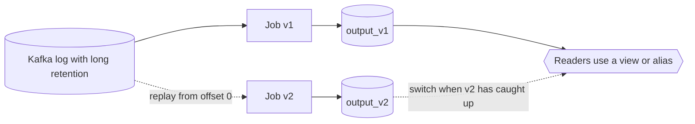

The real-time dashboard says a title was played 4,812,330 times yesterday. The finance report, produced by the nightly batch job, says 4,961,208. Both teams are sure they are right. The streaming job drops events more than ten minutes late; the batch job counts everything that landed in the warehouse by 2 a.m.; the two codebases also disagree on whether a play under 60 seconds counts, because a fix was made to one of them eight months ago. Separately, someone asks how to correct the last two weeks of streaming output after a bug in the sessionisation logic.

These are the two problems every streaming architecture must answer: **where does the correct answer come from**, and **how do you recompute history when the logic changes**. The lambda and kappa architectures are two answers, and most real platforms end up somewhere between them. Underneath both sits one idea, the duality of streams and tables, which is worth tracing on its own because it also explains change data capture, event sourcing, compacted topics and materialised views.

## The lambda architecture

Lambda, popularised by Nathan Marz from a [2011 post](http://nathanmarz.com/blog/how-to-beat-the-cap-theorem.html) onwards, runs two pipelines over the same input:



- The **batch layer** stores every event immutably and periodically recomputes the views from scratch. It is the source of truth: if its logic is wrong, you fix the code and recompute.
- The **speed layer** processes only recent events incrementally to cover the hours since the last batch run. Its results are allowed to be approximate and are discarded once the batch layer catches up.
- The **serving layer** answers queries by merging batch views with real-time views, per metric, knowing where one ends and the other begins.

Lambda made sense because of what stream processors could do in 2011. Early engines were at-least-once, had no event-time semantics, kept state in memory with no durable snapshots, and could not replay history. Batch on Hadoop was slow but trustworthy. Lambda accepted the streaming layer's weaknesses and bounded their damage to a few hours. Its structural cost is two implementations of the same logic in two frameworks, which must agree and do not.

## Trace: why the two layers disagree

Eight play events for one title between 23:50 and 23:59 on day T. The batch job runs at 02:00 on T+1 over everything that has landed, deduplicates by `event_id`, and counts plays of at least 60 seconds. The speed layer is at-least-once (no dedupe), counts plays of at least 30 seconds (the threshold was changed in batch eight months ago and never in the stream job), and drops events more than 10 minutes late.

| Event | Event time | Arrival | Duration | Batch (02:00, ≥ 60 s, deduped) | Speed (≥ 30 s, ≤ 10 min late) |
|---|---|---|---|---|---|
| e1 | 23:50 | 23:50:02 | 1,800 s | counts | counts |
| e2 | 23:51 | 23:51:01 | 45 s | excluded (< 60 s) | counts (≥ 30 s) |
| e3 | 23:52 | 23:52:00 | 900 s | counts | counts |
| e3 again (producer retry, same `event_id`) | 23:52 | 23:52:03 | 900 s | deduplicated | **counts again** |
| e4 | 23:53 | 00:10 (+17 min, offline device) | 600 s | counts | **dropped as late** |
| e5 | 23:55 | 23:55:00 | 20 s | excluded | excluded |
| e6 | 23:57 | 23:57:30 | 3,000 s | counts | counts |
| e7 | 23:58 | 02:30 next day (after the batch cut) | 400 s | **missed** | dropped as late |
| **Total** | | | | **4** | **5** |

The 5 versus 4 decomposes exactly: +1 from the threshold drift (e2), +1 from the undeduplicated retry (e3), −1 from the late drop (e4). Neither layer counted e7: the batch layer is not "the truth", it is a later cut with a different lateness bound (two hours rather than ten minutes). Every one of these differences is a design decision that was made twice, separately. That is the argument against lambda in one table.

## The kappa architecture

In 2014 Jay Kreps, one of Kafka's creators, [questioned the premise](https://www.oreilly.com/radar/questioning-the-lambda-architecture/): if the stream processor is correct (event time, durable state, exactly-once) and the log can be replayed, the batch layer is redundant. **Kappa** keeps only the streaming path. The log is the source of truth, and reprocessing means running the new version of the job over the log from the beginning.



The reprocessing procedure:

1. Deploy job v2 with a **new consumer group** and a **new output table**, starting at the earliest retained offset (or a timestamp, via `offsetsForTimes`, if the fix has a known start).
2. Let it catch up while v1 keeps serving.
3. When v2's lag is near zero and its output has been validated against v1 (row counts per window, a sample of keys), switch readers (a view, an alias, a config flag) to `output_v2`.
4. Stop v1 and delete `output_v1`. Downstream consumers of the *output topic* need a plan too: their committed offsets are meaningless on the new topic, so they reset by timestamp.

One codebase, one set of semantics, history corrected by construction. Kappa depends on three things, and the arithmetic of the last two is where it usually breaks.

- **The job is deterministic in event time.** Processing-time logic, lookups against a service whose answers have since changed, and wall-clock timeouts produce different results on replay. Enrichment data must be versioned (a compacted topic joined as a table) rather than fetched live.
- **The log holds enough history**, at a cost you can pay (next section).
- **Replay is fast enough.** 30 days at a steady 100,000 events/s is 30 × 86,400 × 100,000 ≈ 259 billion events. Reprocessing in 6 hours needs 259 × 10⁹ / 21,600 s ≈ 12 million events/s, 120× the live rate. The topic's partition count caps the replay's parallelism, brokers must serve 30 days of cold reads without hurting live traffic, and the job rebuilds all its state on the way. A job that runs on 20 instances live needs the equivalent of about 2,400 for six hours, or it takes 30 days to replay 30 days.

### Replay capacity on a real topic

Put the same stream on a topic with 64 partitions. A replay job gets at most one consumer per partition, so its parallelism is 64 however many machines you give it. Suppose one consumer, rebuilding state as it goes, sustains 25,000 events/s from a partition (the live job's work plus cold reads). The replay then tops out at 64 × 25,000 = 1.6 million events/s, and the 259 billion events of 30 days take 259 × 10⁹ / 1.6 × 10⁶ ≈ 162,000 s: about 45 hours, not six. The brokers see the same arithmetic from their side: 1.6 million 1 KB events/s is 1.6 GB/s of reads that miss the page cache, spread over the brokers that lead those 64 partitions.

Adding partitions does not widen the replay. Kafka never moves existing records when partitions are added ([its operations guide](https://kafka.apache.org/41/operations/basic-kafka-operations/) says it "will not attempt to automatically redistribute data in any way"), so the 30 days of history stay in the original 64 and the new partitions start empty. The only ways to go wider are to replay from a store that splits more finely, such as a lake table scanned by thousands of tasks, or to copy the history into a wider topic first, which is itself a full read of the old one. Kreps's proposal illustrated the procedure with 30 days of retention; the arithmetic above is why that works at modest rates and why platforms at larger rates backfill from the lake.

## Retention arithmetic and tiered storage

Long retention is a disk bill. At 100,000 events/s of 1 KB each, the topic ingests 100 MB/s:

| Quantity | Arithmetic | Result |
|---|---|---|
| Raw per day | 100 MB/s × 86,400 s | 8.6 TB |
| On broker disks per day, RF 3 | × 3 | 26 TB |
| 30 days on brokers | × 30 | 778 TB |
| With zstd at 3× on JSON | ÷ 3 | 259 TB, about 260 NVMe-class terabytes across the cluster |
| Same 30 days in tiered storage | Remote holds one copy per segment (the object store supplies its own redundancy): 8.6 TB × 30 ÷ 3 | 86 TB of object storage, plus 1–2 days local |

Kafka's tiered storage (KIP-405, production-ready in 3.9) uploads closed segments to object storage and keeps only `local.retention.ms` of each partition on the broker; fetches below the local range are served by downloading remote segment chunks. Two honest caveats. Replay from the remote tier is bounded by broker download throughput and the remote reader thread pool, an order of magnitude of hundreds of MB/s per broker rather than the page-cache speed of hot reads, and a large cold replay competes with live traffic for that broker's network. And compacted topics were not eligible for tiering, so "keep the latest value per key forever" still lives on local disk.

The alternative is to not use Kafka as the archive at all: land the same events in an Iceberg or Delta table in the lake, where 30 days scans with thousands of parallel tasks at columnar speed and does not care how many Kafka partitions exist. That is the modern shape below.

## The stream-table duality, traced

A **table** is the result of applying a stream of changes in order; a **stream** is the history of changes to a table. Both directions are mechanical:

**Changelog to table, with compaction.** A changelog for keys a, b, c, where a null value is a tombstone (a delete):

| Offset | Record | Table after applying | Survives compaction? |
|---|---|---|---|
| 0 | (a, 1) | {a:1} | No: a has a later record |
| 1 | (b, 2) | {a:1, b:2} | No |
| 2 | (a, 3) | {a:3, b:2} | No |
| 3 | (b, ∅) | {a:3} | Yes, as a tombstone, until `delete.retention.ms` (24 h) passes |
| 4 | (c, 4) | {a:3, c:4} | Yes |
| 5 | (a, 5) | {a:5, c:4} | Yes |

Kafka's log cleaner keeps exactly the latest record per key, so the compacted log is [(b, ∅), (c, 4), (a, 5)] in original order and, once the tombstone expires, [(c, 4), (a, 5)]. Replaying either yields the table {a:5, c:4}. Folding a prefix of the full log gives the table as it was at any offset, which is what event sourcing exploits. The exercise below implements this.

**Table to stream, by diffing.** Version 1 of a table is {a:1, b:2}; version 2 is {a:3, c:4}. The diff is the changelog (a, 3) update, (b, ∅) delete, (c, 4) insert. Debezium computes exactly this from the database's own log rather than from snapshots, as [change data capture](/learn/big-data/streaming/change-data-capture) shows.

```viz
{"type": "system", "scenario": "event-sourcing", "requests": 6,
 "title": "State as a fold over a log",
 "caption": "The ordered events are the source of truth; the current balance is derived by folding them. Replaying the log rebuilds the table, and folding a prefix gives the table as it was at any point in time. This is the same relationship as a Kafka changelog and a state store."}
```

**An aggregation's output is a changelog.** A streaming count per title emits, as plays arrive for title X, the records (X, 1), (X, 2), (X, 3). That is a table's changelog: each record replaces the previous value for its key. A downstream job that sums the values it receives reports 6 for a title played 3 times. Kafka Streams names the two sides: a `KStream` is a stream of facts, a `KTable` is a changelog interpreted as a table, `toStream()` converts back, and a stream-table join enriches each play with the current row for its title. Consumers of aggregation output must upsert.

Once you see it, it is everywhere: a database's write-ahead log is a stream and its tables are materialised from it; a compacted topic is a table stored as a stream; a materialised view is a table maintained by applying a stream; a cache is a materialised view you maintain by hand. Kappa's reprocessing is rebuilding a table from its changelog with a new function, the same operation as restoring a Kafka Streams store or rebuilding a search index from CDC.

```viz
{"type": "system", "scenario": "pubsub", "nodes": 3,
 "title": "One log, many derived views",
 "caption": "Each subscriber reads the same events independently and builds its own view: a search index, a cache, a warehouse table. Adding a new view means adding a subscriber and replaying, not changing the producer."}
```

## What most platforms actually do

The distinction blurred once the same engines could run both ways. Flink runs the same SQL or DataStream program in streaming or batch mode; Spark Structured Streaming shares its API with batch Spark; Beam was designed around one model for both. Combined with lakehouse tables, that gives a common modern shape:

- Events flow through Kafka into the streaming job **and** into an Iceberg (or Delta) table in the lake. Netflix's Keystone pipeline has this general shape: the same event streams feed real-time consumers and the S3 warehouse.
- The streaming job produces low-latency results into a serving table.
- **Backfills and reprocessing** run the **same logic** in batch mode over the lake table, with unlimited retention and high scan parallelism, and write to the same output tables.
- For metrics with contractual weight (billing, partner reports), a batch job over complete data **overwrites** the streaming results for day T at T+1 or T+2. The stream is the fast estimate; the batch output is final. This is lambda's correctness model with kappa's single codebase.

## Under the hood: Iceberg as the serving layer

The lakehouse table is what makes "overwrite day T atomically" possible. A Flink Iceberg sink writes Parquet data files continuously and commits a new table **snapshot** once per checkpoint: a manifest listing the new files and a new `metadata.json` whose pointer is swapped in the catalog with an atomic compare-and-swap. Readers always see a whole snapshot, never a half-written batch. The T+1 batch job then runs `INSERT OVERWRITE ... WHERE day = 'T'` (or `MERGE INTO`), which produces one snapshot in which the day's streaming files are replaced by the batch files; a dashboard query sees the estimate one moment and the final numbers the next, never a mixture. Validation of a reprocessed v2 against v1 uses time travel (`FOR VERSION AS OF`). The costs are small files from frequent commits (a checkpoint every minute is 1,440 commits a day, each adding at least one file to every partition it wrote) and the compaction jobs that fix them; the [columnar formats and lakehouses](/learn/big-data/batch-processing/columnar-formats-and-lakehouses) lesson covers the metadata layers, and [ETL and orchestration](/learn/big-data/data-platforms/etl-elt-and-orchestration) covers scheduling the overwrite. Delta's `_delta_log` of JSON commits plays the same role.

| Axis | Classic lambda | Pure kappa | Stream + lakehouse batch, one codebase |
|---|---|---|---|
| Codebases for one metric | Two, in two frameworks | One | One, run in two modes |
| Source of truth | Batch views | The log | The lake table (with the log for the recent window) |
| Reprocessing cost | A batch run over the archive | Replay through Kafka, capped by partitions and brokers | A batch run over columnar files, thousands-wide parallelism |
| Final answer for late data | Batch overwrite at T+1 | Only within the watermark, unless replayed | Batch overwrite at T+1 with the same logic |
| Latency of the estimate | Seconds | Seconds | Seconds |
| Retention bill | Archive plus Kafka | Kafka for the whole history, or tiered | Kafka for days, lake for years |
| Drift risk | High, as the trace shows | None | Low; the same code, but batch mode has no watermark, so lateness policy still differs |
| Operational burden | Two systems, merge logic | One engine, long retention | One engine, plus table maintenance (compaction, snapshot expiry) |

## Production failure modes

| Failure | Symptom | Diagnosis | Fix |
|---|---|---|---|
| Layer drift | Dashboard and report disagree by a few percent every day | Reproduce the trace above: dedupe, thresholds, lateness bounds differ between the two implementations | One codebase in two modes; document which output is final and when |
| Replay that cannot finish | A "reprocess last quarter" job has been running for nine days | Replay rate is capped by partitions and by brokers throttling cold reads; the state rebuild dominates | Backfill from the lake table in batch mode; keep Kafka replay for days, not quarters |
| Non-deterministic replay | v2's output differs from v1's for periods where the logic did not change | Enrichment lookups hit a live service; a processing-time timer; a random sampling seed | Version enrichment data as a compacted topic joined as a table; event-time timers only; seeded sampling keyed by event id |
| Summing an update stream | Downstream totals are several times too high | The upstream output is a KTable changelog; each record replaces, not adds | Upsert by key in the sink; or convert with `toStream()` semantics and emit deltas deliberately |
| Cutover breaks downstream | After switching readers to `output_v2`, a downstream consumer reprocesses two weeks or skips a day | Its committed offsets belonged to `output_v1`; the new topic's offsets mean something else | Reset the downstream group by timestamp at cutover; or write both versions into one table keyed by version and switch a view |
| Cold replay hurts live traffic | Producer latency and consumer lag rise on unrelated topics during a backfill | The replay's fetches evict the page cache and saturate the broker's network | Client quotas for the replay group; run it against the lake instead; schedule it off-peak |

## Interviewer follow-ups

**"Is kappa exactly-once end to end when you replay?"** Model answer: the job's state is, but the output table is a new table; readers must be switched atomically, and downstream consumers of the output topic must reset offsets by time. Common wrong answer: "yes, Kafka transactions handle the switch."

**"Why not keep 90 days in Kafka and skip the lake?"** Model answer: retention arithmetic (rate × days × RF ÷ compression) and replay throughput capped by partitions; tiered storage fixes the disk bill but not the replay parallelism, and compacted topics stay local. Common wrong answer: "disk is cheap," without the multiplication.

**"A consumer sums the counts it receives from a streaming aggregation. What is wrong?"** Model answer: aggregation output is a changelog of a table; each record replaces the prior value for its key, so the consumer must upsert. Common wrong answer: "at-least-once duplicates," which cannot inflate a total several-fold.

**"How do you make the T+1 overwrite invisible to dashboard users?"** Model answer: write it as one Iceberg or Delta snapshot that replaces the day's files atomically, so a query sees either the estimate or the final numbers, never both. Common wrong answer: "delete the streaming rows, then insert the batch rows," which exposes an empty day in between.

## What mid-level engineers get wrong

- Building the second pipeline "for correctness" without deciding which output is final, so both are used and neither is trusted.
- Reprocessing from Kafka with the live job's parallelism and expecting it to finish over a weekend; 30 days at 1× takes 30 days.
- Replaying a job whose enrichment calls a live service, then declaring the old results wrong because the new run differs.
- Treating a streaming count's output as events and summing them.
- Forgetting the downstream consumers of the output topic at cutover; their offsets point at the old topic.
- Setting `retention.ms` to a year because the disk had room in staging.

## Exercise: compact a changelog into a table

```exercise
id: compact-changelog
title: Materialise a table from a changelog, with compaction
prompt: |
  Simulate Kafka log compaction and the table it materialises.

  - `events` is a changelog: a list of `[key, value]` in log order. A `null`
    value is a tombstone (the key was deleted).
  - Compaction keeps, for each key, only its **last** record, in the position
    where that last record appeared (so surviving records keep their original
    relative order).
  - If `retain_tombstones` is `false`, tombstones are removed from the
    compacted log as well (as the cleaner does once `delete.retention.ms` has
    passed). If it is `true`, a tombstone that is the key's last record stays.
  - The table is the latest value per key, excluding deleted keys, sorted by key.

  Return `{"log": [[key, value], ...], "table": [[key, value], ...]}`.
languages: [python, javascript]
entry: compact_changelog
starter:
  python: |
    def compact_changelog(events, retain_tombstones):
        # your code here
        return {"log": [], "table": []}
  javascript: |
    function compact_changelog(events, retain_tombstones) {
      // your code here
      return { log: [], table: [] };
    }
tests:
  - args: [[["a", 1], ["b", 2], ["a", 3], ["b", null], ["c", 4], ["a", 5]], true]
    expected: {"log": [["b", null], ["c", 4], ["a", 5]], "table": [["a", 5], ["c", 4]]}
    label: the worked example, tombstone retained
  - args: [[["a", 1], ["b", 2], ["a", 3], ["b", null], ["c", 4], ["a", 5]], false]
    expected: {"log": [["c", 4], ["a", 5]], "table": [["a", 5], ["c", 4]]}
    label: the tombstone has expired
  - args: [[["k", 1], ["k", null], ["k", 2]], true]
    expected: {"log": [["k", 2]], "table": [["k", 2]]}
    label: a tombstone followed by a new value is compacted away
  - args: [[["t1", "A"], ["t2", "B"], ["t1", "A2"]], true]
    expected: {"log": [["t2", "B"], ["t1", "A2"]], "table": [["t1", "A2"], ["t2", "B"]]}
    label: latest value per key wins, order of last records preserved
  - args: [[], true]
    expected: {"log": [], "table": []}
    label: empty changelog
  - args: [[["x", null], ["y", null]], false]
    expected: {"log": [], "table": []}
    hidden: true
    label: only expired tombstones
  - args: [[["u", 1], ["v", 1], ["u", 2], ["v", 2], ["w", null], ["u", 3]], true]
    expected: {"log": [["v", 2], ["w", null], ["u", 3]], "table": [["u", 3], ["v", 2]]}
    hidden: true
hints:
  - "Walk the log once, recording the index of the last record for each key; a record survives compaction only if it is at that index."
  - "Build the table from the surviving records, skipping tombstones, and sort it by key."
```

## Senior signals

- You name the real problems (**where the correct answer comes from** and **how history is recomputed**) before naming an architecture, and you can trace, event by event, why two implementations of one metric disagree.
- You can do the **retention arithmetic** (rate × days × replication ÷ compression, and what tiered storage changes) and the **replay arithmetic** (history × rate ÷ allowed time against partitions, brokers and state rebuilds).
- You prefer **one codebase run in two modes** over two implementations, and backfill from lake tables rather than from long Kafka retention when history is large.
- You make it explicit which output is **final** (often a batch overwrite at T+1 as one atomic snapshot) and which is an estimate, and you plan the cutover for downstream consumers.
- You treat aggregation outputs as **tables of updates**, not streams of facts, and design sinks as upserts.
- You explain CDC, event sourcing, compacted topics and materialised views as instances of the **stream-table duality**, and can compact a changelog by hand.

## Check yourself

```quiz
- q: >-
    What was the main reason the lambda architecture kept a batch layer as the source of truth?
  options: ["HDFS storage was far cheaper than keeping events in Kafka", "Early stream engines lacked exactly-once state and replay", "Stream processors could not compute aggregations over keys", "Batch jobs finished faster than streams could process data"]
  answer: 1
  explanation: >-
    Early stream processors lacked exactly-once state, event-time semantics and replay, so their results could not be trusted to be complete or correct. Lambda bounded that damage by recomputing everything in a slow but trustworthy batch system; speed was never batch's advantage. Once stream processors gained durable state, event time and replay, that justification weakened, which is the argument behind kappa.
- q: >-
    You must reprocess 60 days of events that arrived at an average of 50,000 events/s, and you want it done in 12 hours. Roughly what replay rate do you need?
  options: ["About 50,000 events/s", "About 6 million events/s", "About 60 million events/s", "About 600,000 events/s"]
  answer: 1
  explanation: >-
    60 days is 120 times 12 hours, so you need 120 times the live rate: 50,000 × 120 = 6 million events/s. That requires enough partitions for the parallelism, brokers able to serve cold reads, and capacity to rebuild state, which is why large backfills often read from lake tables instead.
- q: >-
    In the trace where the batch layer counts 4 and the speed layer counts 5, which single change would remove the largest class of drift for good?
  options: ["Deduplicating events by event_id in the speed layer as well", "Running the same code in batch and streaming modes over the same input", "Moving the batch cut from 02:00 to 04:00 so more late events land", "Raising the speed layer's lateness bound from 10 minutes to 2 hours"]
  answer: 1
  explanation: >-
    Each individual fix (dedupe, threshold, lateness) closes one gap and leaves the others to reappear at the next change, because the logic is still implemented twice. One codebase run in two modes removes the drift mechanism itself; lateness policy is then the only documented, deliberate difference between the estimate and the final number.
- q: >-
    A downstream job consumes the output of a streaming count-per-title aggregation and sums the counts it receives to get a daily total. The totals are far too high. Why?
  options: ["The upstream job is at-least-once, so records are duplicated", "The watermark is too short, so late events are counted twice", "Records are updated counts per key, so sums re-add old values", "Kafka reordered the records, so updates are applied twice"]
  answer: 2
  explanation: >-
    An aggregation turns a stream into a table and emits the table's changes as the count for a key changes. Each record replaces the previous value for its key, so the consumer must treat records as upserts per key. Summing them treats updates as independent facts, a classic stream-table duality bug; occasional at-least-once duplicates could not inflate totals this much.
- q: >-
    A changelog contains (a,1), (b,2), (a,3), (b,null), (c,4), (a,5). After compaction, but before the tombstone expires, what does the log contain?
  options: ["(a,5), (b,2), (c,4), the latest non-null value for every key", "(a,5), (c,4), with the tombstone dropped as soon as the cleaner runs", "(b,null), (c,4), (a,5), each key's last record in its original position", "(a,1), (b,2), (c,4), the first record seen for each key"]
  answer: 2
  explanation: >-
    The cleaner keeps exactly the latest record per key and leaves it where it was, so the survivors are the tombstone for b at offset 3, (c,4) at offset 4 and (a,5) at offset 5. The tombstone stays for delete.retention.ms so a lagging reader still sees the delete; it is not replaced by an older value, and first-seen records are precisely what compaction discards.
- q: >-
    Finance needs daily partner numbers that include events arriving up to 48 hours late, while operations wants per-minute numbers within 30 seconds. What design fits best?
  options: ["A stream estimate plus a T+2 batch overwrite, sharing code", "One streaming job with processing-time windows, so nothing is late", "Two separately written pipelines merged in the serving layer", "A single streaming job with a 48-hour watermark for both"]
  answer: 0
  explanation: >-
    One watermark cannot satisfy both freshness and completeness. A streaming job with a short watermark serves operations, and a batch job over the lake table produces the final daily numbers at T+2 and overwrites the streaming estimates in one atomic snapshot. Sharing the logic avoids lambda's drift, which is the problem with two separately written pipelines. A 48-hour watermark would make operations wait two days.
```
