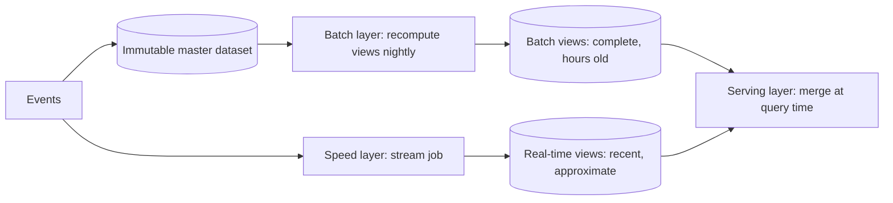
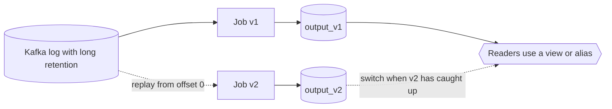

The real-time dashboard says a title was played 4,812,330 times yesterday. The finance report, produced by the nightly batch job, says 4,961,208. Both teams are sure they are right. The streaming job drops events more than ten minutes late; the batch job counts everything that landed in the warehouse by 2 a.m.; the two codebases also disagree on whether a play under 60 seconds counts, because a fix was made to one of them eight months ago. Separately, someone asks how to correct the last two weeks of streaming output after a bug in the sessionisation logic.

These are the two problems every streaming architecture must answer: **where does the correct answer come from**, and **how do you recompute history when the logic changes**. The lambda and kappa architectures are two answers, and most real platforms end up somewhere between them. Underneath both sits one idea, the duality of streams and tables, which is worth understanding on its own because it also explains change data capture, event sourcing and materialised views.

## The lambda architecture

Lambda, popularised around 2011, runs two pipelines over the same input:



- The **batch layer** stores every event immutably and periodically recomputes the views from scratch. It is the source of truth: if its logic is wrong, you fix the code and recompute.
- The **speed layer** processes only recent events incrementally to cover the hours since the last batch run. Its results are allowed to be approximate and are discarded once the batch layer catches up.
- The **serving layer** answers queries by merging batch views with real-time views.

Lambda made sense because of what stream processors could do in 2011. Early engines were at-least-once, had no event-time semantics, kept state in memory with no durable snapshots, and could not replay history. Batch on Hadoop was slow but trustworthy. Lambda accepted the streaming layer's weaknesses and bounded their damage to a few hours.

Its costs are structural:

1. **Two implementations of the same logic** in two frameworks (a Storm topology and a Hive query, say) that must produce the same answer. They drift, as in the opening example, and every change must be made twice and verified to agree.
2. **Merge logic in the serving layer**, which must know where the batch view ends and the real-time view begins, per metric.
3. **Two systems to operate**, monitor and pay for.

## The kappa architecture

In 2014 Jay Kreps, one of Kafka's creators, questioned the premise: if the stream processor is correct (event time, durable state, exactly-once) and the log can be replayed, the batch layer is redundant. **Kappa** keeps only the streaming path. The log is the source of truth, and reprocessing means running the new version of the job over the log from the beginning.



The reprocessing procedure:

1. Deploy job v2 with a **new consumer group** and a **new output table**, starting at the earliest retained offset.
2. Let it catch up while v1 keeps serving.
3. When v2's lag is near zero and its output has been validated against v1, switch readers (a view, an alias, a config flag) to `output_v2`.
4. Stop v1 and delete `output_v1`.

One codebase, one set of semantics, and history is corrected by construction. Kappa depends on three things being true, and the arithmetic of the third is where it usually breaks.

- **The log holds enough history.** With 7-day retention you can only reprocess 7 days. Longer history needs long retention, tiered storage that keeps old segments in object storage, or compacted topics when only the latest value per key matters.
- **The job is deterministic in event time.** Processing-time logic, calls to external services whose answers change, and wall-clock timeouts produce different results on replay.
- **Replay is fast enough.** Consider 30 days of history at a steady 100,000 events/s: 30 × 86,400 × 100,000 ≈ 259 billion events. Reprocessing in 6 hours requires 259 × 10⁹ / 21,600 s ≈ 12 million events/s, 120 times the live rate. Your topic's partition count caps the parallelism of that replay, Kafka brokers must serve 30 days of cold reads without hurting live traffic, and the job's state must be rebuilt along the way. If the job normally runs on 20 instances, the replay needs the equivalent of about 2,400 for six hours, or it takes 30 days to replay 30 days.

That third point is why pure kappa is rare at large scale. A batch engine reading columnar files from object storage can scan 30 days with thousands of parallel tasks, and it does not care how many Kafka partitions there are.

## What most platforms actually do

The distinction blurred once the same engines could run both ways. Flink runs the same SQL or DataStream program in streaming or batch mode; Spark Structured Streaming shares its API with batch Spark; Beam was designed around one model for both. Combined with lakehouse tables, that gives a common modern shape:

- Events flow through Kafka into the streaming job **and** into an Iceberg (or Delta) table in the lake. Netflix's Keystone pipeline has this general shape: the same event streams feed real-time consumers and the S3 warehouse.
- The streaming job produces low-latency results.
- **Backfills and reprocessing** run the **same logic** in batch mode over the lake table, which has unlimited retention and scans with high parallelism, and write to the same output tables.
- For metrics with contractual weight (billing, partner reports), a batch job over complete data **overwrites** the streaming results for day T at T+1 or T+2. The stream is the fast estimate; the batch output is the final answer. This is lambda's correctness model with kappa's single codebase.

| Choose | When |
|---|---|
| Streaming only (kappa) | Logic is event-time and deterministic, history needed is within affordable retention, and replay throughput is achievable with your partition counts |
| Stream plus batch backfill from the lake, same code | Large history, occasional logic changes, one team owning both modes |
| Stream estimate plus batch overwrite | Numbers with financial or contractual weight, where late data after the watermark must still count |
| Separate batch and streaming code (classic lambda) | Only when the batch computation genuinely cannot be expressed in the streaming engine (large model training, complex iterative algorithms), and then keep the streaming side deliberately simple |

## The stream-table duality

Lambda and kappa both rest on one observation: **a stream and a table are two views of the same information.**

- A **table** is the result of applying a stream of changes in order. Replay the changelog of account deposits and withdrawals and you get the balances table.
- A **stream** is the history of changes to a table. Capture every insert, update and delete to the balances table and you have its changelog.

```viz
{"type": "system", "scenario": "event-sourcing", "requests": 6,
 "title": "State as a fold over a log",
 "caption": "The ordered events are the source of truth; the current balance is derived by folding them. Replaying the log rebuilds the table, and folding a prefix gives the table as it was at any point in time. This is the same relationship as a Kafka changelog and a state store."}
```

Once you see it, it is everywhere:

- A database's **write-ahead log** is a stream; its tables are materialised from it. Replication ships the log, and [change data capture](/learn/big-data/streaming/change-data-capture) exposes it.
- A Kafka **compacted topic** is a table stored as a stream: it keeps the latest record per key, so replaying it yields the current table.
- Kafka Streams names both sides: a `KStream` is a stream of independent facts; a `KTable` is a changelog interpreted as a table, where a new record for a key replaces the old one. A stream-table join enriches each play event with the current row for its title.
- A streaming **aggregation turns a stream into a table** (counts per title) and emits that table's changes as a new stream of updates. Downstream consumers must treat that output as upserts, not as new facts. Summing a stream of updated counts double-counts, and this is one of the most common bugs in streaming pipelines.
- A **materialised view** is a table maintained by continuously applying a stream, and a cache is a materialised view you maintain by hand.

The duality also clarifies what kappa's reprocessing really is. Rebuilding `output_v2` from the log is rebuilding a table from its changelog with a new function. It is the same operation as restoring a Kafka Streams state store from its changelog, or rebuilding a search index from a database's CDC stream.

A final consequence is that the log becomes the integration point. Many independent consumers can read the same events for different purposes, each building its own table:

```viz
{"type": "system", "scenario": "pubsub", "nodes": 3,
 "title": "One log, many derived views",
 "caption": "Each subscriber reads the same events independently and builds its own view: a search index, a cache, a warehouse table. Adding a new view means adding a subscriber and replaying, not changing the producer."}
```

## Senior signals

- You name the real problems (**where the correct answer comes from** and **how history is recomputed**) before naming an architecture.
- You can do the **replay arithmetic**: history × rate ÷ allowed time, compared with what partitions, brokers and state rebuilds allow.
- You prefer **one codebase run in two modes** over two implementations, and backfill from lake tables rather than from long Kafka retention when history is large.
- You make it explicit which output is **final** (often a batch overwrite at T+1) and which is an estimate, and you document it for consumers.
- You treat aggregation outputs as **tables of updates**, not streams of facts, and design sinks as upserts.
- You explain CDC, event sourcing, compacted topics and materialised views as instances of the **stream-table duality**.

## Check yourself

```quiz
- q: >-
    What was the main reason the lambda architecture kept a batch layer as the source of truth?
  options: ["Stream processors could not compute aggregations over keys", "Early stream engines lacked exactly-once state and replay", "HDFS storage was far cheaper than keeping events in Kafka", "Batch jobs finished faster than streams could process data"]
  answer: 1
  explanation: >-
    Early stream processors lacked exactly-once state, event-time semantics and replay, so their results could not be trusted to be complete or correct. Lambda bounded that damage by recomputing everything in a slow but trustworthy batch system; speed was never batch's advantage. Once stream processors gained durable state, event time and replay, that justification weakened, which is the argument behind kappa.
- q: >-
    You must reprocess 60 days of events that arrived at an average of 50,000 events/s, and you want it done in 12 hours. Roughly what replay rate do you need?
  options: ["About 50,000 events/s", "About 600,000 events/s", "About 6 million events/s", "About 60 million events/s"]
  answer: 2
  explanation: >-
    60 days is 120 times 12 hours, so you need 120 times the live rate: 50,000 × 120 = 6 million events/s. That requires enough partitions for the parallelism, brokers able to serve cold reads, and capacity to rebuild state, which is why large backfills often read from lake tables instead.
- q: >-
    A downstream job consumes the output of a streaming count-per-title aggregation and sums the counts it receives to get a daily total. The totals are far too high. Why?
  options: ["The watermark is too short, so late events are counted twice", "Kafka reordered the records, so updates are applied twice", "Records are updated counts per key, so sums re-add old values", "The upstream job is at-least-once, so records are duplicated"]
  answer: 2
  explanation: >-
    An aggregation turns a stream into a table and emits the table's changes as the count for a key changes. Each record replaces the previous value for its key, so the consumer must treat records as upserts per key. Summing them treats updates as independent facts, a classic stream-table duality bug; occasional at-least-once duplicates could not inflate totals this much.
- q: >-
    Finance needs daily partner numbers that include events arriving up to 48 hours late, while operations wants per-minute numbers within 30 seconds. What design fits best?
  options: ["A stream estimate plus a T+2 batch overwrite, sharing code", "Two separately written pipelines merged in the serving layer", "One streaming job with processing-time windows, so nothing is late", "A single streaming job with a 48-hour watermark for both"]
  answer: 0
  explanation: >-
    One watermark cannot satisfy both freshness and completeness. A streaming job with a short watermark serves operations, and a batch job over the lake table produces the final daily numbers at T+2 and overwrites the streaming estimates. Sharing the logic avoids lambda's drift, which is the problem with two separately written pipelines. A 48-hour watermark would make operations wait two days.
- q: >-
    Which of these is an example of the stream-table duality?
  options: ["Compressing each column chunk of a Parquet file with zstd", "Rebuilding a state store from its compacted changelog", "Sharding a table by the hash of its primary key", "Adding a secondary index so a range query runs faster"]
  answer: 1
  explanation: >-
    Rebuilding a Kafka Streams state store by replaying its compacted changelog topic: the changelog is the stream of changes; the state store is the table it materialises. Replaying one produces the other. The other options are storage techniques unrelated to converting between streams and tables.
```
