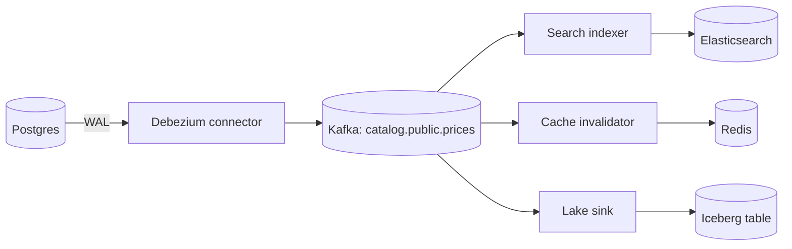

The catalogue service updates a title's price in Postgres, then updates the Elasticsearch document, then deletes the Redis cache key. It has worked for a year. Then three incidents in a month. A deploy restarts the service between the Postgres commit and the Elasticsearch call, and search shows the old price for nine days until someone edits the title again. Two admins edit the same title a few milliseconds apart; Postgres applies A then B, but the Elasticsearch requests race and land B then A, so search permanently shows A. And a bulk SQL fix run directly against the database updates 40,000 rows that never reach search at all, because only the service knew to propagate changes.

All three are the same bug: **dual writes**. When an application writes the same fact to two systems, there is no transaction spanning both, so a crash between them loses one write, and nothing orders concurrent writers across both systems. **Change data capture** (CDC) closes the hole by making the database's own commit log the single source of changes: every other system derives its state from that log, in commit order, including changes made by scripts and other services. This lesson traces the anomalies, then the mechanism from WAL record to search index.

## Dual writes, traced

Two admins change the price of title 81234. Times in milliseconds from the first request.

| t | Admin A (1399) | Admin B (1499) | Postgres | Elasticsearch |
|---|---|---|---|---|
| 0 | `UPDATE … 1399`, commit at 0.8 | | 1399 | 1299 |
| 1 | | `UPDATE … 1499`, commit at 1.6 | 1499 | 1299 |
| 2 | Pauses 20 ms (GC, a slow connection from the pool) | Sends `PUT /prices/_doc/81234 {1499}` | 1499 | 1299 |
| 5 | | Elasticsearch acknowledges | 1499 | 1499 |
| 22 | Sends `PUT /prices/_doc/81234 {1399}` | | 1499 | **1399** |

Both writers succeeded; nothing failed; the index disagrees with the database until the next edit. Retrying does not help (nothing errored), and a queue between the service and Elasticsearch does not help either unless it is ordered by commit, which the service cannot know: it does not learn its own commit's position relative to B's. The crash anomaly is the same table with A's process killed at t=2: Postgres holds 1399, search holds 1299, and no retry ever runs because the process that would retry is gone. Only a mechanism that reads changes *after* commit, in commit order, fixes both.

## Where the changes come from

Every serious database records every committed change in order, because crash recovery and replication need it:

| Axis | PostgreSQL logical decoding | MySQL binlog (row format) | MongoDB change streams |
|---|---|---|---|
| What you read | WAL, decoded by an output plugin (`pgoutput`) through a replication slot | The binary log, as a replica would, via `COM_BINLOG_DUMP_GTID` | The oplog, exposed by `$changeStream` aggregation |
| Position token | LSN (`0/16E8A38`), plus transaction id | Binlog file and position, or GTID set | Resume token (an opaque `_id` per event) |
| Before image | Key only by default; full row with `REPLICA IDENTITY FULL` | Full before and after row with `binlog_row_image=FULL` (default) | None by default; `fullDocumentBeforeChange` needs pre-images enabled per collection (6.0+) |
| Retention risk | The slot pins WAL on the primary until confirmed: disk can fill | `binlog_expire_logs_seconds` (30 days default): a stopped connector past that window must re-snapshot | Oplog is a capped collection sized in GB: a stopped consumer past the window loses its resume point |
| Schema information | Relation messages in the stream: no separate schema history | Rows carry no column names by default (`binlog_row_metadata=MINIMAL`); the connector replays DDL from a schema history topic | Documents are self-describing |
| DDL in the stream | Not emitted; the next relation message reflects it | Emitted as statements, captured into history | Collection and index events since 6.0 |
| Reads from a replica | Standbys from Postgres 16 | Yes, any replica with binlog enabled | Yes, any member |

Log-based CDC beats polling (`WHERE updated_at > :last_seen`) on correctness, not speed: it sees only committed changes in commit order, every change regardless of which code made it, and deletes, which a poll of the current table never sees.

## Under the hood: Postgres logical decoding

With `wal_level = logical`, Postgres writes enough into the WAL to reconstruct row images. A **replication slot** (`pg_create_logical_replication_slot('catalog_cdc', 'pgoutput')`) records two positions: `restart_lsn`, the oldest WAL the decoder may need, and `confirmed_flush_lsn`, the position the consumer has acknowledged. The server refuses to recycle any WAL segment at or after `restart_lsn`, which is both the guarantee and the hazard.

Decoding runs in the walsender process. It reads WAL records forward and sorts changes into a **reorder buffer**, one queue per transaction, because WAL interleaves concurrent transactions and consumers must see each transaction whole and in commit order. A transaction's changes are held (in memory up to `logical_decoding_work_mem`, 64 MB since Postgres 13, then spilled to disk) until its commit record appears, at which point the output plugin is invoked with the changes in order. Two consequences: a two-hour bulk transaction produces nothing for two hours and then a burst of everything, and an aborted transaction produces nothing at all.

`pgoutput` (built into Postgres since 10; Debezium dropped `wal2json` in 2.0, and its other option, `decoderbufs`, must be compiled and installed on the server) emits protocol messages: `Begin`, `Relation` (the table's column names and types, sent when first seen or after a schema change), `Insert`/`Update`/`Delete` with tuples, `Commit`. A **publication** (`CREATE PUBLICATION catalog_pub FOR TABLE titles, prices, outbox`) filters which tables appear. What the `Update` and `Delete` messages carry for the *old* row depends on the table's `REPLICA IDENTITY`: with the default, a delete carries only the primary key and an update carries no old tuple unless the key changed; with `FULL`, both carry the whole old row at the cost of more WAL. Unchanged **TOAST** columns (large text or JSON stored out of line) are not written to the WAL for an update, so without `FULL` the decoder cannot supply them, and Debezium emits a placeholder string for them (`__debezium_unavailable_value`), which a naive sink writes into the search index.

## How Debezium streams Postgres

Debezium runs as a Kafka Connect source connector that writes change events to Kafka, one topic per table (`<prefix>.<schema>.<table>`), keyed by the row's primary key:

```json
{
  "name": "catalog-cdc",
  "config": {
    "connector.class": "io.debezium.connector.postgresql.PostgresConnector",
    "database.hostname": "catalog-db.internal",
    "database.port": "5432",
    "database.user": "cdc_reader",
    "database.password": "${file:/secrets/cdc.properties:password}",
    "database.dbname": "catalog",
    "topic.prefix": "catalog",
    "plugin.name": "pgoutput",
    "slot.name": "catalog_cdc",
    "publication.name": "catalog_pub",
    "table.include.list": "public.titles,public.prices,public.outbox",
    "snapshot.mode": "initial",
    "heartbeat.interval.ms": "10000",
    "tombstones.on.delete": "true"
  }
}
```

On first start the connector creates the slot (fixing the WAL position), then takes a consistent **snapshot** of the included tables and emits every existing row as a read event (`op: "r"`); then it **streams** from the slot, so nothing committed after the slot's creation is missed. `snapshot.mode` chooses: `initial` (snapshot then stream), `no_data` (schema only, then stream), `initial_only`, or an **incremental** snapshot triggered later through a signal table, which reads the table in chunks while streaming continues. The connector's progress (`lsn`, `txId`) lives in Kafka Connect's offsets topic, not in the database; every `heartbeat.interval.ms` it also confirms `confirmed_flush_lsn` to Postgres, which is what lets the slot release WAL when the database is busy but the captured tables are quiet (a quiet database on a busy server needs more, as the trace below shows).

## Trace: three statements to events, a search index and a cache

Three statements on `prices` (`title_id` primary key, default replica identity), each in its own transaction. LSNs are shown as decimal integers, as Debezium emits them.

| Statement | txId | Commit LSN | Event (`op`, `before`, `after`) |
|---|---|---|---|
| `INSERT INTO prices VALUES (81234, 1299, 'USD')` | 5590 | 24022900 | `c`, `null`, `{81234, 1299, USD}` |
| `UPDATE prices SET price_cents = 1499 WHERE title_id = 81234` | 5591 | 24023128 | `u`, `null` (key unchanged, default identity), `{81234, 1499, USD}` |
| `DELETE FROM prices WHERE title_id = 81234` | 5592 | 24023400 | `d`, `{title_id: 81234}`, `null`; then a **tombstone** record with a null value |

The update event as Kafka sees it, topic `catalog.public.prices`, key `{"title_id": 81234}`, offset 1001:

```json
{
  "before": null,
  "after":  {"title_id": 81234, "price_cents": 1499, "currency": "USD"},
  "op": "u",
  "source": {"table": "prices", "lsn": 24023128, "txId": 5591, "ts_ms": 1717430400123},
  "ts_ms": 1717430400311
}
```

`source.ts_ms` is the commit time in the database; the outer `ts_ms` is when Debezium processed it; the difference is the connector's lag. All four records share the key, so they share a partition and arrive in commit order. Two consumer groups apply them:

| Offset | Search indexer (`version_type=external`) | Cache invalidator |
|---|---|---|
| 1000 (`c`) | `PUT /prices/_doc/81234?version=24022900` `{price_cents: 1299}` → 201 | `DEL price:81234` |
| 1001 (`u`) | `PUT …?version=24023128` `{price_cents: 1499}` → 200 | `DEL price:81234` |
| 1002 (`d`) | `DELETE /prices/_doc/81234?version=24023400` → 200 | `DEL price:81234` |
| 1003 (tombstone) | Skip: nothing to apply | Skip |

Now the indexer crashes after 1002 and restarts from its last commit, offset 1001. It replays `PUT …?version=24023128`; Elasticsearch still remembers the deleted document's version 24023400 and answers 409 (version conflict), which the indexer treats as "already newer" and skips. The cache replays `DEL`, a no-op. Delivery was at-least-once; the effect was once. One more subtlety: Elasticsearch keeps a deleted document's version only for `index.gc_deletes` (60 s by default), so a replay that arrives later than that can resurrect the deleted document. If deletes matter, index a soft-delete (`{deleted: true}`) instead of a hard delete, or bound how far back a restarted consumer may replay.

```viz
{"type": "system", "scenario": "cdc", "requests": 4,
 "title": "Log-based CDC from Postgres to a search index",
 "caption": "The connector snapshots existing rows, then decodes committed WAL records into change events with before and after images. A restart replays from the last confirmed LSN, so the sink sees some events twice and must apply them idempotently. A connector that stays down pins WAL on the primary."}
```

Ordering is **per key**: a transaction touching three tables produces events on three topics that consumers see independently. Debezium can emit transaction metadata (begin and end markers with per-table event counts) for a consumer that must reassemble transactions, at the cost of buffering.

## The replication slot can take down your primary

A slot is a promise to keep WAL until the consumer confirms it. If the connector is down, or running but unable to confirm (a stuck Kafka Connect task, no heartbeats on a quiet database that shares a server with a busy one), Postgres keeps every WAL segment since `restart_lsn`:

| WAL rate | Retained per hour | Per day | Long weekend (60 h) |
|---|---|---|---|
| 5 MB/s (a moderately busy OLTP primary) | 18 GB | 432 GB | 1.1 TB |
| 20 MB/s (bulk loads, `REPLICA IDENTITY FULL` on wide tables) | 72 GB | 1.7 TB | 4.3 TB |

A broken connector fills the primary's disk and takes down the database CDC was supposed to observe passively.

```sql
-- Alert when retained WAL per slot crosses a threshold (for example 50 GB).
SELECT slot_name, active, wal_status,   -- wal_status: reserved | extended | unreserved | lost (PG13+)
       pg_size_pretty(pg_wal_lsn_diff(pg_current_wal_lsn(), confirmed_flush_lsn)) AS retained_wal
FROM pg_replication_slots;
```

Defences, in order: page on retained WAL per slot; set `max_slot_wal_keep_size` (Postgres 13+) so an over-limit slot is **invalidated** (`wal_status = 'lost'`) rather than filling the disk, accepting that the connector then fails and must re-snapshot; enable heartbeats; drop the slots of decommissioned connectors, which pin WAL forever. Treat a slot as part of the primary's availability budget.

### A quiet database on a busy server, traced

WAL is written per server, not per database, and a logical slot can release WAL only up to the last position its consumer confirmed. Put the captured `catalog` database, which changes a few times an hour, on the same Postgres server as an `orders` database writing 5 MB/s of WAL. The connector receives an event only when `catalog` commits something; in between it has nothing new to confirm, so `confirmed_flush_lsn` stays at the last catalog commit while `orders` keeps writing. Six quiet hours pin 5 MB/s × 21,600 s ≈ 108 GB of WAL that has nothing to do with the captured tables, and the connector is healthy the whole time. Debezium's [PostgreSQL documentation](https://debezium.io/documentation/reference/stable/connectors/postgresql.html) prescribes two things for this case: heartbeats (`heartbeat.interval.ms`) and a regular change in the captured database itself, which `heartbeat.action.query` automates (for example `UPDATE cdc_heartbeat SET ts = now()` on each heartbeat, with the heartbeat table added to the publication). Each such change travels through the slot, the connector confirms its LSN, and retained WAL falls back to seconds' worth. The same documentation warns that an idle Amazon RDS instance shows the symptom with no second database at all, because RDS writes to its own, uncaptured system tables every few minutes.

## Snapshots and backfills

The initial snapshot of a large table is a long consistent read: 2 TB can take hours, during which WAL accumulates behind it, and an invalidated slot means doing it again. Netflix's **DBLog** interleaves chunked table reads with log streaming: it writes a low watermark into the log, reads a chunk, writes a high watermark, and drops from the chunk any row that appeared as a change event between the two marks, so the chunk never regresses a row and log processing pauses only while a chunk is being selected ([the DBLog paper](https://arxiv.org/abs/2010.12597)). Debezium's **incremental snapshots** use the same design with a signal table. The race that remains is on the sink side: a chunk row read at an older version can still be applied after a newer streaming event by a consumer that lags, so sinks apply events **conditionally on version**, which is the exercise at the end.

## The outbox pattern

Raw table CDC makes your internal schema a public API: a column rename breaks every consumer, and the events describe row mutations rather than business facts. The **transactional outbox** keeps CDC's atomicity while publishing deliberate events:

```sql
CREATE TABLE outbox (
  id            uuid PRIMARY KEY,
  aggregatetype text NOT NULL,      -- routes to the topic: outbox.event.order
  aggregateid   text NOT NULL,      -- becomes the Kafka key
  type          text NOT NULL,      -- OrderPlaced; a header only if the router is told to add it
  payload       jsonb NOT NULL,
  created_at    timestamptz NOT NULL DEFAULT now()
);

BEGIN;
UPDATE orders SET status = 'PLACED', placed_at = now() WHERE order_id = 9001;
INSERT INTO outbox (id, aggregatetype, aggregateid, type, payload)
VALUES (gen_random_uuid(), 'order', '9001', 'OrderPlaced',
        '{"order_id": 9001, "total_cents": 4598, "currency": "USD"}');
DELETE FROM outbox WHERE id = <that id>;   -- optional: the insert is already in the WAL
COMMIT;
```

Debezium's **outbox event router** is a single message transform on the connector: `transforms=outbox`, `transforms.outbox.type=io.debezium.transforms.outbox.EventRouter`. For each insert into `outbox` it emits a record to topic `outbox.event.<aggregatetype>` (`route.topic.replacement` changes the pattern), with key = `aggregateid`, value = `payload`, and a header carrying the outbox row id for consumer deduplication; the event type becomes a header too if you set `table.fields.additional.placement=type:header:type`. Deletes of outbox rows are ignored, so the table can be emptied in the same transaction and never grows. The trace: the transaction above produces one record on `outbox.event.order`, key `9001`, value `{"order_id": 9001, "total_cents": 4598, "currency": "USD"}`, header `id = <uuid>`; every consumer of orders gets a versioned contract, not a view of `orders` and `order_lines`.

```viz
{"type": "system", "scenario": "outbox", "requests": 4, "relay": "CDC (Debezium)",
 "title": "Transactional outbox",
 "caption": "The event row commits in the same transaction as the business change, so neither can exist without the other. A relay (here, CDC on the outbox table) publishes it; a crash before the relay records progress causes a re-publish, so consumers still deduplicate by event id."}
```

Use raw table CDC when you are replicating data (a warehouse, a search index of the same entity, a cache of the same rows). Use the outbox when you are **integrating services**. The [distributed transactions](/learn/system-design/distributed-systems/distributed-transactions) lesson places the outbox among sagas and two-phase commit.

## Keeping caches and search in sync



Each derived store is its own consumer group with its own rules:

- **Search index.** Upsert by primary key with the event's LSN as an external version, so the index rejects anything older than what it holds; replays and snapshot races become harmless. Map deletes to soft-deletes if replays can exceed `gc_deletes`. Never index the TOAST placeholder: either set `REPLICA IDENTITY FULL` on tables with large columns or have the indexer fetch the missing field. The [search engines](/learn/databases/nosql-and-specialised/search-engines) lesson covers the index side.
- **Cache.** Prefer **invalidation** (delete the key) to writing values from the event: the next read repopulates from the database, and a replayed or reordered delete is harmless. One race survives: a reader that missed the cache before the commit can write the pre-commit value after the invalidation. Version the cached value with the row's LSN, or delete again after a short delay. See [caching layers](/learn/databases/data-modeling-and-evolution/caching-layers).
- **Warehouse.** Land the raw events in a lake table, then `MERGE` into a current-state table or keep full history as a slowly changing dimension ([dimensional modelling](/learn/big-data/data-platforms/dimensional-modelling)).

Staleness is commit-to-apply latency: usually sub-second to a few seconds, unbounded when a consumer falls behind. Monitor lag in time per sink, using `source.ts_ms`.

## Schema changes

CDC turns every DDL change into an event-schema change. Serialise events with a schema registry (Avro or Protobuf), enforce backward compatibility, and treat the table like an API: adding a nullable column is safe, renaming or dropping breaks consumers that use it, and a type change can break the connector. Run migrations as expand-and-contract: add the new column, backfill, migrate consumers, then drop the old one, as in [schema migrations at scale](/learn/databases/data-modeling-and-evolution/schema-migrations-at-scale).

## Production failure modes

| Failure | Symptom | Diagnosis | Fix |
|---|---|---|---|
| WAL bloat from an unconsumed slot | Primary disk usage climbs steadily; connector task is failed or paused | `pg_replication_slots` shows a large retained size, `active = false` or a stale `confirmed_flush_lsn` | Restart or drop the slot; `max_slot_wal_keep_size`; page on retained WAL; heartbeats for quiet databases |
| Slot invalidated | Connector fails with the slot in `wal_status = 'lost'` | The retention cap was hit while the connector was down | Drop and recreate the slot and re-snapshot (incrementally); the cap did its job |
| Placeholder overwrites search fields | Product descriptions in search read `__debezium_unavailable_value` after price updates | Unchanged TOAST columns are absent from update events without `REPLICA IDENTITY FULL` | `REPLICA IDENTITY FULL` for those tables, or a partial update in the indexer that skips placeholders |
| Burst from a long transaction | Consumer lag spikes by 40,000 events at once; all with the same `source.ts_ms` | A bulk transaction was decoded at commit; decoding spilled to disk beyond 64 MB | Batch in smaller transactions; size consumers for bursts; monitor the walsender's spill files |
| Resurrected deletes | Deleted titles reappear in search days later | A slow replay applied an old upsert after `gc_deletes` forgot the delete's version | Soft-delete documents; bound replay depth; periodic reconciliation against the database |
| Silent consumer breakage after DDL | One sink stops applying updates; its deserialiser errors on a renamed column | A schema change went out without the consumer contract being updated | Registry compatibility checks in CI; expand-and-contract migrations |

## Interviewer follow-ups

**"Why can't a retry queue fix dual writes?"** Model answer: retries handle failed calls, but the anomalies come from calls that succeed in the wrong order or a process that dies before retrying; only a source ordered by commit (the log) or a single transaction (the outbox) fixes it. Common wrong answer: "make the second write idempotent," which fixes duplication, not ordering or loss.

**"What does a Debezium update event's `before` contain for a Postgres table?"** Model answer: by default nothing (the key only for deletes), because the WAL carries only the new row unless `REPLICA IDENTITY FULL` is set, which also makes unchanged TOAST columns available. Common wrong answer: "always the full previous row."

**"How do you guarantee the search index never regresses a row?"** Model answer: version-conditional writes using the commit LSN, plus soft-deletes so a delete's version cannot be forgotten. Common wrong answer: "process events in order with one consumer," which does not survive snapshot chunks or replays.

**"The outbox table is getting large. Should a cron job clean it?"** Model answer: delete each row in the same transaction that inserted it, or immediately after; the WAL already carries the insert and the router ignores deletes. Common wrong answer: "keep it as an audit log," which turns the outbox into a second copy of the event stream that must be governed.

## What mid-level engineers get wrong

- Writing to the database and publishing to Kafka in the same request handler and calling it "eventually consistent".
- Polling `updated_at` and never noticing that deletes and out-of-band updates are missing.
- Leaving a slot behind after decommissioning a connector; the primary fills up months later.
- Applying CDC events as blind upserts, so a snapshot chunk or a replay puts an old price back.
- Indexing whole events including the TOAST placeholder.
- Exposing `orders` table events to five other teams, then being unable to rename a column.
- Hard-deleting search documents and assuming external versioning protects them forever.

## Exercise

```exercise
id: idempotent-cdc-apply
title: Apply CDC events idempotently with versions
prompt: |
  Build a read model from change events delivered at least once and possibly
  out of order (snapshot rows can arrive after newer streaming events).

  Each event is `[op, key, value, version]`: `op` is `"c"` (create), `"u"`
  (update), `"r"` (snapshot read) or `"d"` (delete, value is null), and
  `version` is the change's log position (larger is newer).

  Apply an event only if its version is strictly greater than the last version
  applied for that key (deletes count, so an old event cannot resurrect a
  deleted row). Create, update and read all upsert the value. Otherwise ignore it.

  Return `{"rows": [[key, value], ...] sorted by key, "ignored": number of ignored events}`.
languages: [python, javascript]
entry: apply_cdc
starter:
  python: |
    def apply_cdc(events):
        rows = {}       # key -> value
        versions = {}   # key -> last applied version (including deletes)
        ignored = 0
        # your code here
        return {"rows": [[k, rows[k]] for k in sorted(rows)], "ignored": ignored}
  javascript: |
    function apply_cdc(events) {
      const rows = new Map();      // key -> value
      const versions = new Map();  // key -> last applied version (including deletes)
      let ignored = 0;
      // your code here
      const keys = [...rows.keys()].sort();
      return { rows: keys.map((k) => [k, rows.get(k)]), ignored };
    }
tests:
  - args: [[["c", "t1", "A", 10], ["c", "t2", "B", 11], ["u", "t1", "A2", 12], ["d", "t2", null, 13]]]
    expected: {"rows": [["t1", "A2"]], "ignored": 0}
  - args: [[["c", "k", "v1", 5], ["u", "k", "v2", 6], ["c", "k", "v1", 5], ["u", "k", "v2", 6]]]
    expected: {"rows": [["k", "v2"]], "ignored": 2}
    label: replay after a connector restart
  - args: [[["u", "p1", "price=12", 40], ["r", "p1", "price=10", 35], ["r", "p2", "price=7", 36]]]
    expected: {"rows": [["p1", "price=12"], ["p2", "price=7"]], "ignored": 1}
    label: stale snapshot row after a newer update
  - args: [[["d", "x", null, 20], ["r", "x", "old", 15]]]
    expected: {"rows": [], "ignored": 1}
    label: a stale row must not resurrect a delete
  - args: [[["c", "x", "v1", 1], ["d", "x", null, 2], ["c", "x", "v2", 3], ["d", "x", null, 2]]]
    expected: {"rows": [["x", "v2"]], "ignored": 1}
    hidden: true
    label: re-created after delete
  - args: [[["u", "a", "1", 7], ["u", "a", "2", 7]]]
    expected: {"rows": [["a", "1"]], "ignored": 1}
    hidden: true
    label: equal version is a duplicate
  - args: [[]]
    expected: {"rows": [], "ignored": 0}
    hidden: true
hints:
  - "Look up the key's last applied version (missing means never seen) and ignore the event unless its version is strictly larger."
  - "For a delete, remove the row but still record the version."
```

## Senior signals

- You recognise **dual writes** in a design and can trace both anomalies with timestamps: a crash between writes loses one, and concurrent writers reorder across systems.
- You prefer **log-based CDC** over polling because it sees only committed changes, in commit order, including deletes and out-of-band writes, and you can say what the WAL, the binlog and the oplog each give and withhold.
- You know how logical decoding works (slot positions, reorder buffer, `pgoutput` messages, replica identity, TOAST) and what each means for the events a sink receives.
- You treat the **replication slot** as a risk to the primary: you monitor retained WAL, cap it with `max_slot_wal_keep_size`, enable heartbeats and have a re-snapshot plan.
- You make every CDC sink **idempotent and version-aware** (external versions and soft-deletes in search, invalidation with a versioned or delayed second delete for caches) because delivery is at-least-once and snapshots race with streaming.
- You choose **raw CDC for replication** and the **outbox with the event router for service integration**, so internal schemas do not become other teams' contracts.
- You run schema changes through a **registry and expand-and-contract**, as you would for a public API.

## Check yourself

```quiz
- q: >-
    A service writes to Postgres and then publishes to Kafka in the same request handler, retrying the publish on failure. What can still go wrong?
  options: ["A crash between the two loses it, and order can diverge", "Nothing, because retrying the publish guarantees delivery", "The database transaction will roll back if the publish fails", "Kafka rejects events that arrive out of commit order"]
  answer: 0
  explanation: >-
    A crash after the database commit and before a successful publish loses the event: retries do not help if the process dies before they happen. And no mechanism orders two handlers' publishes by commit order, so concurrent requests can publish in a different order than they committed. CDC or an outbox makes the database commit the only write, and derives the event from it.
- q: >-
    A Debezium connector for a busy Postgres primary has been failing since Friday night. On Monday the primary's disk is nearly full. Why?
  options: ["The slot makes Postgres keep WAL since the last confirmed LSN", "Kafka Connect keeps staging copies of tables in the database", "Repeated snapshot retries leave behind temporary tables", "Debezium stores its offsets and history in the database"]
  answer: 0
  explanation: >-
    A replication slot pins WAL from its restart_lsn until the consumer confirms it, so days of WAL have accumulated; at 20 MB/s that is 1.7 TB per day. Monitor retained WAL, cap it with max_slot_wal_keep_size, and page when a connector stops confirming. Debezium keeps its offsets in Kafka Connect, not in the source database.
- q: >-
    An update event from a Postgres table with the default replica identity arrives with before set to null and one large description column containing a placeholder string. What explains both?
  options: ["The WAL carries only the new row, and unchanged TOAST columns are not in it", "The snapshot and the stream overlapped, and this is a snapshot read event", "The connector crashed mid-event and emitted a partial record", "The table has no primary key, so Debezium cannot build a before image"]
  answer: 0
  explanation: >-
    With the default replica identity the WAL records only the new tuple for an update (the old one only if the key changed), so Debezium has no before image, and an unchanged out-of-line TOAST value is not written at all, so the connector substitutes a placeholder. REPLICA IDENTITY FULL fixes both at the cost of more WAL. A missing primary key would stop update events entirely rather than blank the before image.
- q: >-
    During an incremental snapshot, the search index sometimes shows a price that was changed minutes ago. What sink design prevents this?
  options: ["Use the event's LSN as an external version on each write", "Apply events with more consumer instances to cut lag", "Disable snapshots and rely on streaming events alone", "Order the writes by processing time at the search indexer"]
  answer: 0
  explanation: >-
    A snapshot chunk can emit an older version of a row after a newer streaming event. Version-conditional writes (the log position as an external version) make the index reject older writes and keep the newest version regardless of arrival order. More consumers would make reordering worse.
- q: >-
    Deleted titles occasionally reappear in Elasticsearch a day after a search indexer is restarted from an old offset. External versioning is in use. What is the mechanism?
  options: ["The cache invalidator repopulated the index from a stale Redis value", "External versions compare as strings, so a shorter LSN looks newer than a longer one", "The index forgot the delete's version after gc_deletes and accepted an old upsert", "Tombstone records are replayed as creates because their value is null"]
  answer: 2
  explanation: >-
    Elasticsearch keeps a deleted document's version only for index.gc_deletes (60 seconds by default). A replay that arrives later finds no version to compare against and indexes the stale upsert, resurrecting the row. Soft-deletes, or bounding how far back a restarted consumer may replay, prevent it. Tombstones carry no payload to create from, and the cache path never writes to the index.
- q: >-
    The orders team wants other services to react when an order is placed. Why is the outbox usually better than letting consumers read CDC events from the orders tables directly?
  options: ["The outbox gives consumers exactly-once delivery for free", "It publishes versioned business events, not internal rows", "CDC cannot capture tables that are written this often", "The outbox has lower latency than reading table changes"]
  answer: 1
  explanation: >-
    Raw CDC exposes row-level mutations of internal tables as a public contract, so a table change breaks consumers. The outbox keeps atomicity (the event commits in the same transaction as the business change), and the event router publishes the payload under a topic and key you control. It is still at-least-once, so consumers deduplicate by the id header.
```
