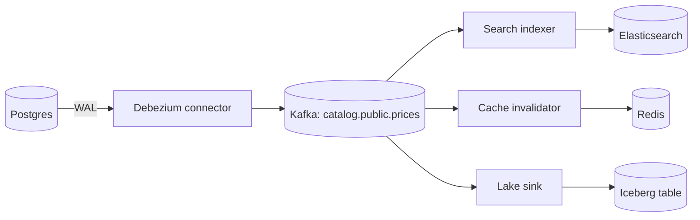

The catalogue service updates a title's price in Postgres, then updates the Elasticsearch document, then deletes the Redis cache key. It has worked for a year. Then three incidents in a month. A deploy restarts the service between the Postgres commit and the Elasticsearch call, and search shows the old price for nine days until someone edits the title again. Two admins edit the same title a few milliseconds apart; Postgres applies A then B, but the Elasticsearch requests race and land B then A, so search permanently shows A. And a bulk SQL fix run directly against the database updates 40,000 rows that never reach search at all, because only the service knew to propagate changes.

All three are the same bug: **dual writes**. When an application writes the same fact to two systems, there is no transaction spanning both, so a crash between them loses one write, and nothing orders concurrent writers across both systems. Retrying and adding queues narrows the window without closing it. **Change data capture** (CDC) closes it by making the database's own commit log the single source of changes: every other system derives its state from that log, in commit order, including changes made by scripts and other services.

## Where the changes come from

Every serious database already records every committed change in order, because it needs that record for crash recovery and replication:

| Database | Log | How CDC reads it |
|---|---|---|
| PostgreSQL | Write-ahead log (WAL) | Logical decoding through a **replication slot** with an output plugin (`pgoutput`), scoped by a publication |
| MySQL / MariaDB | Binary log in row format | The connector registers as a replica and reads binlog events, tracking the position or GTID |
| MongoDB | Oplog | Change streams |
| SQL Server, Oracle | Transaction log | Built-in CDC tables, or log mining |

Log-based CDC has three properties that no application-level approach matches: it sees **only committed** changes, in **commit order**; it sees **every** change regardless of which code made it; and it captures **deletes**, which query-based polling (`WHERE updated_at > :last_seen`) misses entirely, along with any update that forgot to bump `updated_at`.

## How Debezium streams Postgres

Debezium is the most widely used open-source CDC platform. It usually runs as Kafka Connect source connectors that write change events to Kafka, one topic per table, keyed by the row's primary key.

```json
{
  "name": "catalog-cdc",
  "config": {
    "connector.class": "io.debezium.connector.postgresql.PostgresConnector",
    "database.hostname": "catalog-db.internal",
    "database.port": "5432",
    "database.user": "cdc_reader",
    "database.password": "${file:/secrets/cdc.properties:password}",
    "database.dbname": "catalog",
    "topic.prefix": "catalog",
    "plugin.name": "pgoutput",
    "slot.name": "catalog_cdc",
    "publication.name": "catalog_pub",
    "table.include.list": "public.titles,public.prices,public.outbox",
    "snapshot.mode": "initial",
    "heartbeat.interval.ms": "10000"
  }
}
```

On first start the connector creates the replication slot, which makes Postgres retain WAL from that point, then takes a consistent **snapshot** of the existing rows and emits them as read (`op: "r"`) events. After the snapshot it streams from the slot. Each change becomes an event with the row's before and after images and its position in the log:

```json
{
  "before": {"title_id": 81234, "price_cents": 1299, "currency": "USD"},
  "after":  {"title_id": 81234, "price_cents": 1499, "currency": "USD"},
  "op": "u",
  "source": {"table": "prices", "lsn": 24023128, "txId": 5591, "ts_ms": 1717430400123},
  "ts_ms": 1717430400311
}
```

The Kafka record key is `{"title_id": 81234}`, so every change to that row lands in the same partition, in commit order. A delete produces an event with `after: null` followed by a **tombstone** (null value) so that compacted topics eventually drop the key. The connector records the last LSN it processed in Kafka Connect's offsets and periodically confirms it to Postgres, which then lets the slot release older WAL.

```viz
{"type": "system", "scenario": "cdc", "requests": 4,
 "title": "Log-based CDC from Postgres to a search index",
 "caption": "The connector snapshots existing rows, then decodes committed WAL records into change events with before and after images. A restart replays from the last confirmed LSN, so the sink sees some events twice and must apply them idempotently. A connector that stays down pins WAL on the primary."}
```

Two delivery facts shape everything downstream. CDC is **at-least-once**: after a crash, the connector resumes from the last confirmed position and re-emits events the sink has already seen. And ordering is **per key**: events for one row are ordered, but a transaction that touches three tables produces events on three topics that consumers see independently. Debezium can emit transaction metadata (begin and end markers with event counts) for consumers that must reassemble transactions, at the cost of buffering.

## The replication slot can take down your primary

A replication slot is a promise from Postgres to keep WAL until the consumer confirms it. If the connector is down, or running but unable to confirm (a stuck sink, a misconfigured heartbeat), Postgres keeps every WAL segment since the confirmed position. The arithmetic is unforgiving: a database generating 20 MB/s of WAL retains about 1.7 TB per day. A connector that is broken over a long weekend fills the primary's disk and takes down the database that CDC was supposed to observe passively.

```sql
-- Alert when retained WAL per slot crosses a threshold (for example 50 GB).
SELECT slot_name,
       active,
       pg_size_pretty(pg_wal_lsn_diff(pg_current_wal_lsn(), confirmed_flush_lsn)) AS retained_wal
FROM pg_replication_slots;
```

Defences, in order: monitor retained WAL per slot and page on it; set `max_slot_wal_keep_size` (Postgres 13 and later) to cap retention, accepting that an over-limit slot is invalidated and the connector must re-snapshot; enable connector **heartbeats**, which make the connector confirm progress even when its tables are quiet but other databases on the same server are busy; and drop slots belonging to decommissioned connectors. Treat a CDC slot as part of the database's availability budget, not as a harmless reader.

## Snapshots and backfills

The initial snapshot of a large table is a long-running consistent read: a 2 TB table can take hours, during which WAL accumulates and changes queue behind it. Re-snapshotting after a slot is invalidated means doing it again. Netflix published the design of **DBLog**, a CDC framework that interleaves chunked table reads with log streaming using low and high watermark markers written into the log, so a full table can be captured in small chunks without pausing change streaming or holding long locks. Debezium's **incremental snapshots** follow the same idea. Netflix has also described building a data synchronisation platform on top of it to keep derived stores in step with source databases.

Interleaving creates a subtle race that every CDC sink must handle: a snapshot chunk may read a row at an older version and emit it **after** a streaming event carrying a newer version of the same row. A sink that blindly upserts would regress the row. The fix is to apply events **conditionally on version**, which is the exercise at the end of this lesson.

## Keeping caches and search in sync



Each derived store gets its own consumer group and applies events at its own pace:

- **Search index.** Upsert the document by primary key and use the event's LSN as an **external version** (`version_type=external` in Elasticsearch), so the index rejects any write older than the version it holds. Replays and snapshot races then become harmless. Deletes become document deletes.
- **Cache.** Prefer **invalidation** (delete the key) to writing values from the event: the next read repopulates from the database, and a replayed or reordered invalidation is harmless. If you must write through, compare versions as for search.
- **Warehouse.** Land raw change events in a lake table, then `MERGE` them into a current-state table, or keep the full history as a slowly changing dimension (see [dimensional modelling](/learn/big-data/data-platforms/dimensional-modelling)).

The staleness users observe is commit-to-apply latency: usually sub-second to a few seconds, but it grows without bound when a consumer falls behind, so monitor consumer lag in time, per sink.

## The outbox pattern

Raw table CDC has a design cost: it makes your internal schema a public API. Every consumer depends on column names, a rename breaks them, and the events describe row mutations ("row in `order_lines` updated") rather than business facts ("order placed"). The **transactional outbox** keeps CDC's atomicity while publishing deliberate events:

```sql
BEGIN;
UPDATE orders SET status = 'PLACED', placed_at = now() WHERE order_id = 9001;
INSERT INTO outbox (id, aggregate_type, aggregate_id, event_type, payload)
VALUES (gen_random_uuid(), 'order', '9001', 'OrderPlaced',
        '{"order_id": 9001, "total_cents": 4598, "currency": "USD"}');
COMMIT;
```

The business change and the event commit atomically in one local transaction. CDC captures inserts into `outbox` and routes each to a topic by `aggregate_type`, keyed by `aggregate_id` (Debezium ships an outbox event router for this), and the service deletes old outbox rows periodically or immediately after insert, since the WAL already carries the insert.

```viz
{"type": "system", "scenario": "outbox", "requests": 4,
 "title": "Transactional outbox",
 "caption": "The event row commits in the same transaction as the business change, so neither can exist without the other. A relay (here, CDC on the outbox table) publishes it; a crash before the relay records progress causes a re-publish, so consumers still deduplicate by event id."}
```

Use raw table CDC when you are replicating data (to a warehouse, a search index of the same entity, a cache of the same rows). Use the outbox when you are **integrating services**: other teams consume a contract you control and version, not your tables. The [distributed transactions](/learn/system-design/distributed-systems/distributed-transactions) lesson covers the outbox in the context of sagas.

## Schema changes

CDC turns every DDL change into an event-schema change. Serialise events with a schema registry (Avro or Protobuf) and enforce compatibility (typically backward: new consumers can read old events, and additive changes only). Adding a nullable column is safe; renaming or dropping a column breaks consumers that use it; changing a type can break the connector itself. Coordinate schema migrations with CDC consumers the way you coordinate API changes, using expand-and-contract: add the new column, backfill, migrate consumers, then drop the old one.

## Exercise

```exercise
id: idempotent-cdc-apply
title: Apply CDC events idempotently with versions
prompt: |
  Build a read model from change events delivered at least once and possibly
  out of order (snapshot rows can arrive after newer streaming events).

  Each event is `[op, key, value, version]`: `op` is `"c"` (create), `"u"`
  (update), `"r"` (snapshot read) or `"d"` (delete, value is null), and
  `version` is the change's log position (larger is newer).

  Apply an event only if its version is strictly greater than the last version
  applied for that key (deletes count, so an old event cannot resurrect a
  deleted row). Create, update and read all upsert the value. Otherwise ignore it.

  Return `{"rows": [[key, value], ...] sorted by key, "ignored": number of ignored events}`.
languages: [python, javascript]
entry: apply_cdc
starter:
  python: |
    def apply_cdc(events):
        rows = {}       # key -> value
        versions = {}   # key -> last applied version (including deletes)
        ignored = 0
        # your code here
        return {"rows": [[k, rows[k]] for k in sorted(rows)], "ignored": ignored}
  javascript: |
    function apply_cdc(events) {
      const rows = new Map();      // key -> value
      const versions = new Map();  // key -> last applied version (including deletes)
      let ignored = 0;
      // your code here
      const keys = [...rows.keys()].sort();
      return { rows: keys.map((k) => [k, rows.get(k)]), ignored };
    }
tests:
  - args: [[["c", "t1", "A", 10], ["c", "t2", "B", 11], ["u", "t1", "A2", 12], ["d", "t2", null, 13]]]
    expected: {"rows": [["t1", "A2"]], "ignored": 0}
  - args: [[["c", "k", "v1", 5], ["u", "k", "v2", 6], ["c", "k", "v1", 5], ["u", "k", "v2", 6]]]
    expected: {"rows": [["k", "v2"]], "ignored": 2}
    label: replay after a connector restart
  - args: [[["u", "p1", "price=12", 40], ["r", "p1", "price=10", 35], ["r", "p2", "price=7", 36]]]
    expected: {"rows": [["p1", "price=12"], ["p2", "price=7"]], "ignored": 1}
    label: stale snapshot row after a newer update
  - args: [[["d", "x", null, 20], ["r", "x", "old", 15]]]
    expected: {"rows": [], "ignored": 1}
    label: a stale row must not resurrect a delete
  - args: [[["c", "x", "v1", 1], ["d", "x", null, 2], ["c", "x", "v2", 3], ["d", "x", null, 2]]]
    expected: {"rows": [["x", "v2"]], "ignored": 1}
    hidden: true
    label: re-created after delete
  - args: [[["u", "a", "1", 7], ["u", "a", "2", 7]]]
    expected: {"rows": [["a", "1"]], "ignored": 1}
    hidden: true
    label: equal version is a duplicate
  - args: [[]]
    expected: {"rows": [], "ignored": 0}
    hidden: true
hints:
  - "Look up the key's last applied version (missing means never seen) and ignore the event unless its version is strictly larger."
  - "For a delete, remove the row but still record the version."
```

## Senior signals

- You recognise **dual writes** in a design and name both failure modes: a crash between writes loses one, and concurrent writers can be reordered across systems.
- You prefer **log-based CDC** over polling because it sees only committed changes, in commit order, including deletes and out-of-band writes.
- You treat the **replication slot** as a risk to the primary: you monitor retained WAL, cap it, enable heartbeats and have a re-snapshot plan.
- You make every CDC sink **idempotent and version-aware** (external versions in search, invalidation for caches) because delivery is at-least-once and snapshots race with streaming.
- You choose **raw CDC for replication** and the **outbox for service integration**, so internal schemas do not become other teams' contracts.
- You run schema changes through a **registry and expand-and-contract**, as you would for a public API.

## Check yourself

```quiz
- q: >-
    A service writes to Postgres and then publishes to Kafka in the same request handler, retrying the publish on failure. What can still go wrong?
  options: ["Nothing, because retrying the publish guarantees delivery", "Kafka rejects events that arrive out of commit order", "The database transaction will roll back if the publish fails", "A crash between the two loses it, and order can diverge"]
  answer: 3
  explanation: >-
    A crash after the database commit and before a successful publish loses the event: retries do not help if the process dies before they happen. And no mechanism orders two handlers' publishes by commit order, so concurrent requests can publish in a different order than they committed. CDC or an outbox makes the database commit the only write, and derives the event from it.
- q: >-
    A Debezium connector for a busy Postgres primary has been failing since Friday night. On Monday the primary's disk is nearly full. Why?
  options: ["Repeated snapshot retries leave behind temporary tables", "The slot makes Postgres keep WAL since the last confirmed LSN", "Kafka Connect keeps staging copies of tables in the database", "Debezium stores its offsets and history in the database"]
  answer: 1
  explanation: >-
    A replication slot pins WAL until the consumer confirms it, so days of WAL have accumulated. At tens of MB/s of WAL that is terabytes per day. Monitor retained WAL, cap it with max_slot_wal_keep_size, and page when a connector stops confirming. Debezium keeps its offsets in Kafka Connect, not in the source database.
- q: >-
    During an incremental snapshot, the search index sometimes shows a price that was changed minutes ago. What sink design prevents this?
  options: ["Order the writes by processing time at the search indexer", "Apply events with more consumer instances to cut lag", "Use the event's LSN as an external version on each write", "Disable snapshots and rely on streaming events alone"]
  answer: 2
  explanation: >-
    A snapshot chunk can emit an older version of a row after a newer streaming event. Version-conditional writes (the log position as an external version) make the index reject older writes and keep the newest version regardless of arrival order. More consumers would make reordering worse.
- q: >-
    Why is polling a table with WHERE updated_at > last_seen a weaker form of change capture than reading the log?
  options: ["It is slower, since every poll scans the whole table", "It misses deletes and rows whose updated_at is not bumped", "It cannot run against read replicas, so it loads the primary", "It needs a schema registry to interpret the polled rows"]
  answer: 1
  explanation: >-
    Deleted rows are gone from the table, many code paths forget to bump updated_at, and a long transaction can commit a row with an earlier timestamp after the poller has moved past it. The log records every committed change in order. Polling can run on a replica and use an index; its problem is correctness, not speed.
- q: >-
    The orders team wants other services to react when an order is placed. Why is the outbox usually better than letting consumers read CDC events from the orders tables directly?
  options: ["CDC cannot capture tables that are written this often", "It publishes versioned business events, not internal rows", "The outbox has lower latency than reading table changes", "The outbox gives consumers exactly-once delivery for free"]
  answer: 1
  explanation: >-
    Raw CDC exposes row-level mutations of internal tables as a public contract, so a table change breaks consumers. The outbox keeps atomicity (the event commits in the same transaction as the business change) and decouples the event schema from the table schema. It is still at-least-once, so consumers deduplicate.
```
