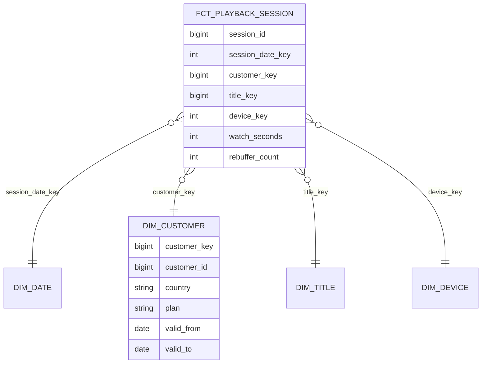

Three analysts are asked for last quarter's revenue by subscription plan and country. They query a replica of the production database, which has 60 normalised tables designed for the billing service. Each writes a different 12-table join, one double-counts invoices that have two line items, one uses the customer's current country instead of the country at the time of payment, and the three answers differ by 4%. Worse, last quarter's number changes every time someone reruns the report, because customers keep moving and the join picks up their new country.

Operational schemas are designed to make writes correct: normalised, with each fact stored once. Analytical schemas must make **reads** correct and easy for people who did not design them. **Dimensional modelling**, codified by Ralph Kimball in the 1990s and still the default shape of analytical marts, does this with a small set of rules: declare the grain, separate measurements (facts) from context (dimensions), and model change over time explicitly. This lesson covers those rules and the one mechanism most teams get wrong, slowly changing dimensions.

## Grain first

The **grain** of a table is what one row represents, stated in business terms: "one row per playback session", "one row per invoice line", "one row per subscription per day". Declare it before choosing any column. Nearly every double-counting bug is a grain bug: joining a table at invoice-line grain to a table at invoice grain and summing an invoice-level amount multiplies it by the number of lines.

Choose the **lowest grain** the source supports. You can always aggregate a fine-grained fact table up; you can never split an aggregate back down, and every new question ("revenue by device") will need a dimension the aggregate discarded.

## Facts and dimensions

A **fact table** records measurements of a business process at the declared grain: numeric **measures** plus foreign keys to dimensions. It is long and narrow: billions of rows, a few dozen columns.

A **dimension table** holds the descriptive context used to filter and group: customer, title, device, date, plan. It is short and wide: thousands to millions of rows, often dozens or hundreds of attributes, deliberately denormalised so that "genre", "maturity rating" and "original language" are columns on `dim_title` rather than three more joins.



Measures come in three kinds, and the kind decides how they may be aggregated:

| Kind | Example | Sum across all dimensions? |
|---|---|---|
| Additive | `watch_seconds`, `revenue_usd`, `rebuffer_count` | Yes |
| Semi-additive | Account balance, active subscribers in a daily snapshot | Across customers yes; across time no (use the last value or an average) |
| Non-additive | Rebuffer rate, average order value, percentages | Never; store the additive components and compute the ratio at query time |

Fact tables also come in three shapes. **Transaction** facts record events (one row per payment). **Periodic snapshots** record state at regular intervals (one row per subscription per day, which is how you answer "how many active subscribers on 1 March" without replaying history). **Accumulating snapshots** track a process with milestones (one row per order, with columns for ordered, shipped and delivered timestamps updated as it progresses).

Dimensions that are shared across fact tables with the same keys and meaning are **conformed**: the same `dim_customer` and `dim_date` serve playback, billing and support marts, so "revenue per active viewer by country" can be computed across processes. Conformed dimensions are the organisational contract of a warehouse; without them, every team's "country" is subtly different.

A typical query reads like the question:

```sql
SELECT d.calendar_quarter,
       c.plan,
       c.country,
       SUM(f.revenue_usd) AS revenue_usd
FROM fct_payment AS f
JOIN dim_date     AS d ON f.payment_date_key = d.date_key
JOIN dim_customer AS c ON f.customer_key = c.customer_key   -- the version valid at payment time
WHERE d.calendar_quarter = '2024-Q1'
GROUP BY d.calendar_quarter, c.plan, c.country;
```

## Star, snowflake or one big table

A **star schema** keeps each dimension as one denormalised table. A **snowflake schema** normalises dimensions further (`dim_title` → `dim_genre` → `dim_genre_family`). In columnar warehouses the star almost always wins: the repeated genre names in `dim_title` cost almost nothing after dictionary encoding, and every removed join is one less thing for the optimiser and the analyst to get wrong.

Many teams go one step further and publish **wide denormalised tables** ("one big table"): the fact with its most-used dimension attributes pre-joined. Columnar storage makes the unused columns free at read time, and dashboards get a single-table query. The costs are real: attribute changes require rewriting the wide table, and the same attribute copied into ten wide tables can disagree. A good compromise keeps the star as the source of truth and generates wide tables from it for specific consumers.

## Patterns you will meet

A handful of named patterns recur in every warehouse. Knowing the names makes design reviews faster, and each one prevents a specific mistake.

- **The date dimension.** A table with one row per calendar day and columns for everything people group by: day of week, ISO week, fiscal quarter, holiday flags per country, "is last day of month". Twenty years is only about 7,300 rows. Without it, every analyst re-derives fiscal quarters in SQL, slightly differently. Add a separate time-of-day dimension if you need hour or minute buckets rather than timestamps.
- **Role-playing dimensions.** One physical dimension used in several roles by the same fact: an order has an order date, a ship date and a delivery date, all keys into `dim_date`. Expose each role as a view with its own column names (`order_date`, `ship_date`) so queries stay readable and joins stay unambiguous.
- **Degenerate dimensions.** An identifier that belongs to the fact but has no attributes of its own, such as an invoice number or a playback session id. Keep it as a column on the fact table; creating a dimension table for it adds a join and no information.
- **Junk dimensions.** A set of low-cardinality flags and codes (payment method, is_trial, is_gift, promo_type) that would otherwise clutter the fact. Combine them into one small dimension of their observed combinations and give the fact a single key to it.
- **Factless fact tables.** Some processes record that something happened or was possible, with no measure: a title being available in a country on a date, a member being eligible for a promotion. The table is just keys, and questions like "which available titles were never played?" become an anti-join between the factless coverage table and the playback fact.
- **Bridge tables.** Many-to-many relationships, such as a title with several genres, need a bridge between fact and dimension, with care: summing a fact across a bridge counts each title once per genre, so either allocate with weights or report such totals as non-additive.

## Surrogate keys

Dimensions use a **surrogate key** (`customer_key`), an integer the warehouse assigns, rather than the source system's natural key (`customer_id`). Three reasons: one natural key can have several historical versions, each needing its own key (next section); several source systems may have overlapping ids; and a source that recycles or changes ids must not rewrite history. Some teams generate surrogate keys as a hash of the natural key plus the version's `valid_from`, which keeps loads deterministic and parallel.

## Slowly changing dimensions

Customers move, plans change, titles get re-categorised. How a dimension handles change decides whether historical reports stay stable. The standard types:

| Type | Behaviour | Result |
|---|---|---|
| 0 | Never change the attribute (original sign-up country) | Stable, possibly stale |
| 1 | Overwrite in place | History rewritten: last year's revenue moves to the customer's new country |
| 2 | Close the current row and insert a new version with validity dates | Each fact joins the version valid when it happened; history is stable |
| 3 | Keep a "previous value" column | One level of history, for side-by-side comparisons |

Type 1 is what the analysts in the opening story were accidentally doing by joining to the current production table. **Type 2** is the one to know in depth. For a customer who moved from France to Germany on 15 March:

| customer_key | customer_id | country | valid_from | valid_to | is_current |
|---|---|---|---|---|---|
| 1001 | 42 | FR | 2023-02-01 | 2024-03-15 | false |
| 1873 | 42 | DE | 2024-03-15 | null | true |

A payment on 2 March is loaded with `customer_key = 1001` and is reported under France forever; a payment on 20 March gets 1873. When loading facts, look up the dimension version whose `[valid_from, valid_to)` range contains the fact's event time, not the current row. If a fact arrives before its dimension row exists (a payment for a customer whose profile has not been extracted yet), insert an **inferred member**: a placeholder dimension row with the natural key and unknown attributes, filled in when the real row arrives, so the fact is not dropped or orphaned.

Maintaining Type 2 is a two-step merge on each load. With a staging table of today's source state:

```sql
-- 1. Close current rows whose tracked attributes changed.
UPDATE dim_customer AS d
SET valid_to = :load_date, is_current = false
FROM stg_customer AS s
WHERE d.customer_id = s.customer_id
  AND d.is_current
  AND (d.country <> s.country OR d.plan <> s.plan);

-- 2. Insert a new current version for changed and brand-new customers.
INSERT INTO dim_customer (customer_key, customer_id, country, plan, valid_from, valid_to, is_current)
SELECT nextval('customer_key_seq'), s.customer_id, s.country, s.plan, :load_date, NULL, true
FROM stg_customer AS s
LEFT JOIN dim_customer AS d
  ON d.customer_id = s.customer_id AND d.is_current
WHERE d.customer_id IS NULL;
```

The second statement relies on the first: after step 1, changed customers no longer have a current row, so they fall into the `IS NULL` branch together with new customers. Run both in one transaction. Note the load is **idempotent**: rerunning it with the same staging data finds no differences and inserts nothing. (Null-safe comparisons, such as `IS DISTINCT FROM`, are needed if tracked attributes can be null.) Tools such as dbt snapshots generate this logic for you, and CDC events from the source database (see [change data capture](/learn/big-data/streaming/change-data-capture)) give you every intermediate change rather than one sample per day.

Two design decisions remain. Choose **which attributes are tracked**: tracking every column of a frequently updated dimension (last login time) creates a new version per login and a dimension as large as a fact table; track the attributes reports group by, and move volatile ones to a separate Type 1 dimension or to the fact. And decide the **effective time** of a change: the load date is easy but lags reality; the source's own change timestamp (available from CDC) is more accurate.

## Exercise

```exercise
id: scd2-merge
title: Maintain a Type 2 slowly changing dimension
prompt: |
  `dim` is a list of rows `[customer_id, country, valid_from, valid_to]`,
  with dates as `"YYYY-MM-DD"` strings and `valid_to = null` for the current
  version. `updates` is a list of `[customer_id, country, effective_date]`
  snapshots of the source, in chronological order.

  For each update:
  - If the customer has no current row, insert `[id, country, effective_date, null]`.
  - If the current row has the same country, do nothing (loads must be idempotent).
  - Otherwise close the current row (`valid_to = effective_date`) and insert a new
    current row starting at `effective_date`.

  Never modify closed historical rows. Return the full table sorted by
  customer_id, then valid_from.
languages: [python, javascript]
entry: scd2_merge
starter:
  python: |
    def scd2_merge(dim, updates):
        rows = [list(r) for r in dim]
        # your code here
        return sorted(rows, key=lambda r: (r[0], r[2]))
  javascript: |
    function scd2_merge(dim, updates) {
      const rows = dim.map((r) => [...r]);
      // your code here
      return rows.sort((a, b) => (a[0] - b[0]) || (a[2] < b[2] ? -1 : a[2] > b[2] ? 1 : 0));
    }
tests:
  - args: [[[1, "FR", "2024-01-01", null], [2, "US", "2024-01-01", null]], [[1, "DE", "2024-03-15"], [2, "US", "2024-03-15"], [3, "BR", "2024-03-15"]]]
    expected: [[1, "FR", "2024-01-01", "2024-03-15"], [1, "DE", "2024-03-15", null], [2, "US", "2024-01-01", null], [3, "BR", "2024-03-15", null]]
  - args: [[[1, "FR", "2024-01-01", "2024-03-15"], [1, "DE", "2024-03-15", null], [2, "US", "2024-01-01", null], [3, "BR", "2024-03-15", null]], [[1, "DE", "2024-03-15"], [2, "US", "2024-03-15"], [3, "BR", "2024-03-15"]]]
    expected: [[1, "FR", "2024-01-01", "2024-03-15"], [1, "DE", "2024-03-15", null], [2, "US", "2024-01-01", null], [3, "BR", "2024-03-15", null]]
    label: rerunning the same load changes nothing
  - args: [[[7, "CA", "2023-06-01", null]], [[7, "US", "2024-01-10"], [7, "MX", "2024-02-20"], [7, "MX", "2024-02-21"]]]
    expected: [[7, "CA", "2023-06-01", "2024-01-10"], [7, "US", "2024-01-10", "2024-02-20"], [7, "MX", "2024-02-20", null]]
    label: several changes in one batch
  - args: [[[5, "JP", "2022-01-01", "2023-01-01"], [5, "KR", "2023-01-01", null]], [[5, "JP", "2024-05-01"]]]
    expected: [[5, "JP", "2022-01-01", "2023-01-01"], [5, "KR", "2023-01-01", "2024-05-01"], [5, "JP", "2024-05-01", null]]
    label: moving back creates a new version
  - args: [[], [[2, "AR", "2024-01-01"], [1, "CL", "2024-01-02"]]]
    expected: [[1, "CL", "2024-01-02", null], [2, "AR", "2024-01-01", null]]
    hidden: true
    label: empty dimension
  - args: [[[1, "FR", "2024-01-01", null]], []]
    expected: [[1, "FR", "2024-01-01", null]]
    hidden: true
    label: no updates
hints:
  - "The current row for a customer is the one whose `valid_to` is null."
  - "Closing a row means setting its `valid_to`; then append the new version. Moving back to an old value is still a new version."
```

## Senior signals

- You **declare the grain** of every fact table in one sentence before designing columns, and you diagnose double counting as a grain mismatch.
- You classify measures as **additive, semi-additive or non-additive** and store components (sums and counts), not ratios.
- You default to a **star schema with conformed dimensions** in columnar warehouses, and generate wide tables from it rather than replacing it.
- You use **surrogate keys** and **Type 2** dimensions so facts join the version valid at event time, and you handle late-arriving dimensions with inferred members.
- You choose **which attributes to track** so that volatile columns do not explode the dimension, and you make every dimension load idempotent.

## Check yourself

```quiz
- q: >-
    An analyst joins fct_invoice_line (one row per invoice line) to fct_invoice (one row per invoice) and sums fct_invoice.tax_usd. Tax comes out about 2.3 times too high. Why?
  options: ["Tax is non-additive", "The join repeats each invoice's tax once per line, a grain mismatch; aggregate lines to invoice grain first or allocate tax to lines", "The tables need a snowflake schema", "Surrogate keys are missing"]
  answer: 1
  explanation: >-
    Joining a coarser-grain table to a finer one repeats the coarse row for every fine row. With about 2.3 lines per invoice, invoice-level tax is summed 2.3 times. Tax is additive; the problem is grain.
- q: >-
    A customer moves from France to Germany. Which slowly changing dimension type keeps last year's revenue reported under France?
  options: ["Type 1", "Type 2", "Type 0 for all attributes", "Any type, as long as the fact table is partitioned"]
  answer: 1
  explanation: >-
    Type 2 closes the France version and adds a Germany version; facts keep pointing at the version valid when they occurred. Type 1 overwrites country and moves all history to Germany. Type 0 would never record the move.
- q: >-
    A daily snapshot table stores active_subscribers per country per day. What does SUM(active_subscribers) over March for France return?
  options: ["The number of active subscribers in France in March", "About 31 times the typical daily count, because the measure is semi-additive and must not be summed across time", "The number of new subscribers in March", "An error"]
  answer: 1
  explanation: >-
    Snapshot counts can be summed across countries on the same day but not across days. For a month, take the value on the last day, an average, or distinct subscribers from a lower-grain table.
- q: >-
    Why do columnar warehouses usually favour star schemas over snowflake schemas?
  options: ["Snowflake schemas cannot be queried with SQL", "Repeated attribute values in denormalised dimensions compress well, and fewer joins make queries simpler and less error-prone", "Star schemas use less storage in row-oriented databases", "Snowflake schemas prevent slowly changing dimensions"]
  answer: 1
  explanation: >-
    Dictionary encoding makes repeated values in a wide dimension nearly free, so normalising them saves little while adding joins. The argument is about columnar storage and usability, not SQL capability.
- q: >-
    A Type 2 customer dimension tracks every column, including last_login_at. It now has more rows than the payments fact table. What is the right fix?
  options: ["Switch the whole dimension to Type 1", "Stop tracking volatile attributes in Type 2: keep last_login_at as Type 1 in a separate dimension or as a fact, and version only attributes that reports group by", "Partition the dimension by login date", "Add more surrogate keys"]
  answer: 1
  explanation: >-
    Each tracked change creates a version, so a frequently changing attribute creates a version per login. Choosing tracked attributes deliberately keeps the dimension small while preserving the history that matters. Switching everything to Type 1 would lose country and plan history.
```
