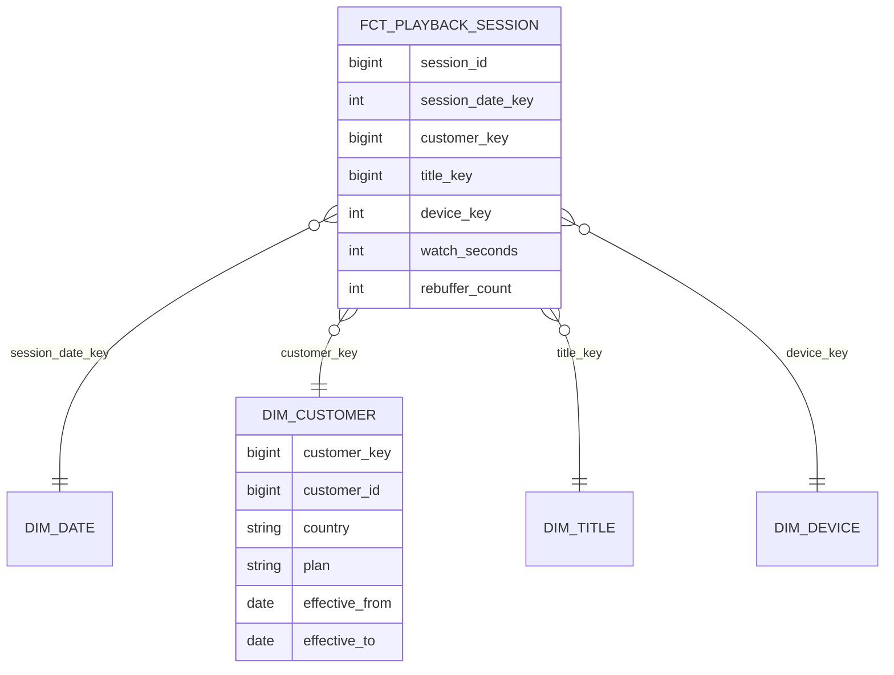

Three analysts are asked for last quarter's revenue by subscription plan and country. They query a replica of the production database, which has 60 normalised tables designed for the billing service. Each writes a different 12-table join, one double-counts invoices that have two line items, one uses the customer's current country instead of the country at the time of payment, and the three answers differ by 4%. Worse, last quarter's number changes every time someone reruns the report, because customers keep moving and the join picks up their new country.

Operational schemas are designed to make writes correct: normalised, with each fact stored once (see [modelling for access patterns](/learn/databases/data-modeling-and-evolution/modelling-for-access-patterns)). Analytical schemas must make **reads** correct and easy for people who did not design them. **Dimensional modelling**, codified by Ralph Kimball in the 1990s and still the default shape of analytical marts, does this with a small set of rules: declare the grain, separate measurements (facts) from context (dimensions), and model change over time explicitly. This lesson traces each rule on real rows, including the one most teams get wrong, slowly changing dimensions.

## Grain first

The **grain** of a table is what one row represents, stated in business terms: "one row per playback session", "one row per invoice line", "one row per subscription per day". Declare it before choosing any column. Nearly every double-counting bug is a grain bug: joining a table at invoice-line grain to a table at invoice grain and summing an invoice-level amount multiplies it by the number of lines.

Choose the **lowest grain** the source supports. You can always aggregate a fine-grained fact table up; you can never split an aggregate back down, and every new question ("revenue by device") will need a dimension the aggregate discarded.

## Facts, dimensions and the three kinds of fact table

A **fact table** records measurements of a business process at the declared grain: numeric **measures** plus foreign keys to dimensions. It is long and narrow: billions of rows, a few dozen columns. A **dimension table** holds the descriptive context used to filter and group: customer, title, device, date, plan. It is short and wide: thousands to millions of rows, dozens or hundreds of attributes, deliberately denormalised so that genre, maturity rating and original language are columns on `dim_title` rather than three more joins.



Fact tables come in three shapes, and the shape decides what a row means over time:

| Shape | Grain | Row lifecycle | Example |
|---|---|---|---|
| Transaction | One row per event | Inserted once, never updated | `fct_payment`: one row per payment |
| Periodic snapshot | One row per entity per period | Inserted once per period | `fct_subscription_daily`: one row per subscription per day, with `is_active`, `balance_usd` |
| Accumulating snapshot | One row per process instance | Updated as milestones complete | `fct_order_fulfilment`: one row per order with `ordered_at`, `shipped_at`, `delivered_at`, filled in over days |

The snapshot answers "how many active subscribers on 1 March" without replaying every event; the accumulating snapshot answers "median time from order to delivery this month" with a single subtraction per row, at the cost of being the one fact table that is updated in place (and therefore the one that needs a `MERGE` rather than a partition overwrite in the [orchestration lesson](/learn/big-data/data-platforms/etl-elt-and-orchestration)).

### Additive, semi-additive and non-additive measures

| Kind | Example | Sum across all dimensions? |
|---|---|---|
| Additive | `watch_seconds`, `revenue_usd`, `rebuffer_count` | Yes |
| Semi-additive | Account balance, active subscribers in a daily snapshot | Across entities yes; across time no |
| Non-additive | Rebuffer rate, average order value, percentages | Never; store the additive components and compute the ratio at query time |

Watch the semi-additive case go wrong on a periodic snapshot of two accounts over three days:

| balance_date | account | balance_usd |
|---|---|---|
| 03-01 | A | 100 |
| 03-01 | B | 50 |
| 03-02 | A | 100 |
| 03-02 | B | 40 |
| 03-03 | A | 120 |
| 03-03 | B | 40 |

`SELECT SUM(balance_usd) WHERE balance_date BETWEEN '03-01' AND '03-03'` returns 450. No account ever held 450; the query added each balance once per day. The two defensible answers are the **end-of-period** total (03-03: 120 + 40 = 160) and the **average daily** total ((150 + 140 + 160) / 3 = 150). Summing across accounts on one day is correct; summing across days is not. A ratio is worse: storing `rebuffer_rate` per session and averaging it weights a 10-second session the same as a 3-hour one; store `rebuffer_count` and `watch_seconds` and divide the sums.

## Star versus snowflake, on rows

A **star schema** keeps each dimension as one denormalised table. A **snowflake** normalises dimensions further. Take four titles and six sessions.

`dim_title` in the star:

| title_key | title | genre | genre_family | maturity |
|---|---|---|---|---|
| 1 | Stranger Things | Sci-Fi | Drama | TV-14 |
| 2 | The Crown | Period Drama | Drama | TV-MA |
| 3 | Nailed It! | Cooking | Reality | TV-PG |
| 4 | Dark | Sci-Fi | Drama | TV-MA |

The snowflake splits it into `dim_title (title_key, title, genre_key, maturity)`, `dim_genre (genre_key, genre, genre_family_key)` and `dim_genre_family (genre_family_key, genre_family)`, so "Drama" is stored once instead of three times.

`fct_playback_session`:

| session_id | date_key | customer_key | title_key | watch_seconds |
|---|---|---|---|---|
| s1 | 20240301 | 1001 | 1 | 2400 |
| s2 | 20240301 | 1001 | 3 | 600 |
| s3 | 20240302 | 1002 | 4 | 3000 |
| s4 | 20240302 | 1001 | 1 | 1200 |
| s5 | 20240303 | 1003 | 2 | 3600 |
| s6 | 20240303 | 1002 | 4 | 900 |

"Watch seconds by genre family" in the star is one join and one group-by: s1, s3, s4, s5, s6 map to Drama (2400 + 3000 + 1200 + 3600 + 900 = 11,100), s2 to Reality (600). The snowflake produces the same two numbers through three joins, each a chance to pick the wrong key or drop rows with an inner join on a nullable genre. What the snowflake saves is the repeated string "Drama": in a row store that is real bytes; in a columnar file the `genre_family` column chunk is dictionary-encoded as two distinct values plus a code per row, run-length encoded when sorted, so the repetition costs bits, not bytes (see [columnar formats and lakehouses](/learn/big-data/batch-processing/columnar-formats-and-lakehouses)). That is why columnar warehouses favour the star.

## Under the hood: how a columnar engine runs a star join

The star's shape is also what the query engine wants. Dimensions are small relative to the fact, so the planner **broadcasts** them: Spark broadcasts any side estimated under `spark.sql.autoBroadcastJoinThreshold` (default 10 MB), so a 20,000-row `dim_title` at 200 bytes per row (4 MB) is copied to every executor and the fact is joined with a local hash lookup and no shuffle. A 250-million-row `dim_customer` is not broadcast; it becomes a shuffle hash or sort-merge join partitioned by `customer_key`, and that join is the one worth pre-computing. **Dynamic partition pruning** (Spark 3.0+, and equivalents in Trino and the cloud warehouses) takes a filter on the dimension (`d.calendar_quarter = '2024-Q1'`) and turns it into a list of fact partitions to read, so the fact scan touches 91 daily partitions, not 1,095. Column pruning means a query that touches four of the fact's forty columns reads four column chunks; that is also why a wide "one big table" costs so little to read.

## Surrogate keys and conformed dimensions

Dimensions use a **surrogate key** (`customer_key`), an integer the warehouse assigns, rather than the source's natural key (`customer_id`). Three reasons: one natural key will have several historical versions, each needing its own key; several source systems may have overlapping ids; and a source that recycles or changes ids must not rewrite history. Sequence-assigned keys are compact and join fastest; a hash of natural key plus `effective_from` makes loads deterministic and parallel at the cost of 16-byte keys. Either way the fact stores the key, never the natural key plus a date: the point-in-time decision is made once, at load, and stored.

Dimensions shared across fact tables with the same keys and meaning are **conformed**: the same `dim_customer` and `dim_date` serve playback, billing and support marts, so "revenue per active viewer by country" can be computed across processes. Conformed dimensions are the organisational contract of a warehouse; without them, every team's "country" is subtly different.

## Patterns you will meet

- **The date dimension.** One row per calendar day with everything people group by: day of week, ISO week, fiscal quarter, holiday flags per country, "is last day of month". Twenty years is about 7,300 rows. Without it, every analyst re-derives fiscal quarters slightly differently.
- **Role-playing dimensions.** One physical `dim_date` used as order date, ship date and delivery date; expose each role as a view with its own column names.
- **Degenerate dimensions.** An identifier with no attributes of its own (invoice number, session id) stays on the fact table; a dimension table for it adds a join and no information.
- **Junk dimensions.** Low-cardinality flags (payment method, is_trial, is_gift, promo_type) combined into one small dimension of observed combinations, so the fact carries one key instead of six columns.
- **Factless fact tables.** A process with no measure: a title available in a country on a date. The table is keys only, and "available titles never played" is an anti-join between it and the playback fact.
- **Bridge tables.** A title with several genres needs a bridge; summing a fact across it counts the title once per genre, so allocate with weights or declare the total non-additive.

## Slowly changing dimensions: the six types

| Type | Behaviour | History kept | Cost |
|---|---|---|---|
| 0 | Never change the attribute (original sign-up country) | The original only | None |
| 1 | Overwrite in place | None: last year's revenue moves to the new country | None; history silently rewritten |
| 2 | Close the current row, insert a new version with effective dates | Full, per change | One row per change; facts must be keyed to the right version |
| 3 | Add a `previous_value` column | One step back | Fixed width; useless for a third change |
| 4 | Current table plus a separate history table, or a **mini-dimension** for volatile attributes keyed from the fact | Full, without bloating the main dimension | Two tables to join |
| 6 | Type 2 rows that also carry Type 1 "current" columns (`country` and `current_country` on every version) | Full, and "as it is now" from the same join | Every version updated on each change |

Type 1 is what the analysts in the opening story were accidentally doing by joining to the production table. **Type 2** is the one to know in depth.

### Type 2 traced through three changes

Customer 42 signs up in France on the basic plan, moves to Germany, upgrades to premium, and moves back to France. `effective_to` is exclusive and open-ended rows use `9999-12-31` rather than null so that range predicates need no `COALESCE`.

Load 1, 2023-02-01 (new customer):

| customer_key | customer_id | country | plan | effective_from | effective_to | is_current |
|---|---|---|---|---|---|---|
| 1001 | 42 | FR | basic | 2023-02-01 | 9999-12-31 | true |

Change 1, 2024-03-15 (country FR → DE): close 1001, insert 1873.

| customer_key | country | plan | effective_from | effective_to | is_current |
|---|---|---|---|---|---|
| 1001 | FR | basic | 2023-02-01 | 2024-03-15 | false |
| 1873 | DE | basic | 2024-03-15 | 9999-12-31 | true |

Change 2, 2024-06-02 (plan basic → premium): close 1873, insert 2410.

| customer_key | country | plan | effective_from | effective_to | is_current |
|---|---|---|---|---|---|
| 1001 | FR | basic | 2023-02-01 | 2024-03-15 | false |
| 1873 | DE | basic | 2024-03-15 | 2024-06-02 | false |
| 2410 | DE | premium | 2024-06-02 | 9999-12-31 | true |

Change 3, 2024-09-20 (country DE → FR): close 2410, insert 3055. Moving back does not reopen 1001; it is a new version.

| customer_key | country | plan | effective_from | effective_to | is_current |
|---|---|---|---|---|---|
| 1001 | FR | basic | 2023-02-01 | 2024-03-15 | false |
| 1873 | DE | basic | 2024-03-15 | 2024-06-02 | false |
| 2410 | DE | premium | 2024-06-02 | 2024-09-20 | false |
| 3055 | FR | premium | 2024-09-20 | 9999-12-31 | true |

### The join that gives point-in-time correctness

Facts are keyed at load time to the version whose range contains the event date:

```sql
INSERT OVERWRITE fct_payment PARTITION (payment_date = :ds)
SELECT s.payment_id, s.payment_date, d.customer_key, s.amount_usd
FROM stg_payment AS s
LEFT JOIN dim_customer AS d
  ON d.customer_id = s.customer_id
 AND s.payment_date >= d.effective_from
 AND s.payment_date <  d.effective_to
WHERE s.payment_date = :ds;
```

Four payments by customer 42:

| payment_id | payment_date | amount_usd | customer_key | version |
|---|---|---|---|---|
| p1 | 2024-03-02 | 10 | 1001 | FR, basic |
| p2 | 2024-03-20 | 10 | 1873 | DE, basic |
| p3 | 2024-07-05 | 16 | 2410 | DE, premium |
| p4 | 2024-10-01 | 16 | 3055 | FR, premium |

Revenue for 2024 by country: FR 26, DE 26; by plan: basic 20, premium 32. The analyst's query joins on `customer_key` alone with no date logic and gets those numbers every time it runs. The wrong join, `ON d.customer_id = s.customer_id AND d.is_current`, reports FR 52 and premium 52, and next month, after another move, different numbers again. Note which row the `LEFT JOIN` returns when a customer moves on the payment day: `p2` on 2024-03-15 would get 1873, because `effective_to` is exclusive and the new version starts that day.

### Maintaining Type 2

Each load is a two-step merge against a staging table of the source's current state:

```sql
-- 1. Close current rows whose tracked attributes changed.
UPDATE dim_customer AS d
SET effective_to = :load_date, is_current = false
FROM stg_customer AS s
WHERE d.customer_id = s.customer_id AND d.is_current
  AND (d.country IS DISTINCT FROM s.country OR d.plan IS DISTINCT FROM s.plan);

-- 2. Insert a new current version for changed and brand-new customers.
INSERT INTO dim_customer (customer_key, customer_id, country, plan, effective_from, effective_to, is_current)
SELECT nextval('customer_key_seq'), s.customer_id, s.country, s.plan, :load_date, DATE '9999-12-31', true
FROM stg_customer AS s
LEFT JOIN dim_customer AS d ON d.customer_id = s.customer_id AND d.is_current
WHERE d.customer_id IS NULL;
```

After step 1, changed customers have no current row, so they fall into the `IS NULL` branch with new customers. Run both in one transaction. The load is idempotent: rerunning it with the same staging data finds no differences and inserts nothing. dbt snapshots generate this logic; CDC events from the source (see [change data capture](/learn/big-data/streaming/change-data-capture)) give every intermediate change and its real timestamp rather than one daily sample keyed to the load date.

Two decisions remain. **Which attributes are tracked**: versioning `last_login_at` creates a row per login and a dimension larger than the fact; track the attributes reports group by and move volatile ones to a Type 4 mini-dimension or onto the fact. **Effective time**: the load date is easy but lags reality by up to a day; the source's change timestamp is accurate and is what CDC gives you.

## Late-arriving dimensions

Two different things arrive late, and they need different fixes.

**A late-arriving dimension row** (the fact comes first). A payment on 03-03 for customer 77, whose profile is not extracted until 03-04. Dropping the fact loses revenue; leaving `customer_key` null breaks every inner join. Insert an **inferred member**: a placeholder version (key 5001, customer_id 77, country and plan `UNKNOWN`, `effective_from` 03-03) and key the fact to it. When the profile arrives, overwrite the placeholder's attributes in place (a Type 1 correction of a guess, not a Type 2 change) so the fact needs no rewrite.

**A late-arriving change** (the fact was keyed to the wrong version). On 03-20 the source reveals that customer 42 actually moved on 03-10, not 03-15. Two rows are now wrong: version 1001 should end on 03-10 and 1873 should start there. Every fact dated in [03-10, 03-15) was keyed to 1001 and must be re-keyed to 1873. The dimension fix is two updates; the fact fix is a rerun of the fact partitions for those five days, which is only cheap because the fact load is an idempotent partition overwrite. A dimension with frequent late changes is an argument for CDC-sourced effective dates, which make them rare.

## The size of a fact table

Assume 200 million playback sessions per day (a round number for a large streaming service, not a published figure). A row of the fact above is about 100 bytes uncompressed: an 8-byte session id, four keys (24 bytes), a 4-byte date key, and a dozen 4-byte measures. Parquet with dictionary and run-length encoding on keys and sorted date columns brings it to roughly 30–50 bytes per row on disk, depending on cardinality and sort order. At 40 bytes: 8 GB per day, 2.9 TB per year, about 9 TB for three years of history.

**Partition by date** (`session_date`), so a query over one week reads 7 partitions, 56 GB, not 9 TB; **sort within the partition** by `customer_key` so a per-customer query prunes row groups through their min/max statistics instead of scanning the day. A Type 2 `dim_customer` for 250 million members at 300 bytes per row is 75 GB, and two tracked changes per member per year add 500 million rows per year: large for a dimension, still a tenth of the fact.

## Star, snowflake or one big table

| | Star | Snowflake | One big table (OBT) |
|---|---|---|---|
| Joins per query | One per dimension | Several per dimension | None |
| Storage of repeated attributes | Dictionary-encoded, near free | Minimal | Copied into every wide table |
| Cost of an attribute change | Update one dimension row | Update one row | Rewrite every wide table that carries it |
| Analyst ergonomics | Readable | Error-prone key chains | Simplest |
| Consistency risk | Low with conformed dimensions | Low | Ten copies of "country" that can disagree |
| Best fit | Source of truth in a columnar warehouse | Row stores; regulatory normalisation | Dashboards and specific consumers |

Many teams publish **wide denormalised tables** (OBT) for dashboards: the fact with its most-used dimension attributes pre-joined. Column pruning makes the unused columns free to read, and a dashboard gets a single-table query with no join to get wrong. The costs are the rewrite on attribute change and the drift between copies. The compromise that works: the star is the source of truth, the wide tables are generated from it by the orchestrator, and nobody edits them by hand.

## Failure modes in production

**A balance summed across days.** Symptom: "total subscribers in March" is 30 times the daily count. Diagnosis: a periodic snapshot with a semi-additive measure aggregated across the period. Fix: last-day-of-period or average, and a comment on the column marking it semi-additive.

**The dimension outgrows the fact.** Symptom: `dim_customer` has 4 billion rows and loads take hours. Diagnosis: a volatile attribute (last login, last device) is tracked as Type 2. Fix: move it to a Type 4 mini-dimension or to the fact, and rebuild the dimension with only the grouped-by attributes tracked.

**Last quarter changes every run.** Symptom: a finance number moves week to week with no backfill. Diagnosis: facts join to the current version (`is_current`) or to a natural key. Fix: key facts to the version at load with the range join, and rerun the affected partitions.

**A late-arriving change leaves a week wrong.** Symptom: revenue for 10–15 March sits under Germany in the dimension's terms but France in the ledger's. Diagnosis: effective dates from the load date, not the source. Fix: correct the two versions' dates, rerun those fact partitions, and switch to CDC timestamps.

**Fan-out through a bridge.** Symptom: watch hours by genre sum to 140% of total watch hours. Diagnosis: multi-genre titles counted once per genre. Fix: weighting factors on the bridge, or report per-genre totals as non-additive.

## Interviewer follow-ups

**"Revenue by country for last year has to be stable forever, but customers move. Design it."** Model answer: a Type 2 customer dimension with effective ranges, facts keyed at load time to the version valid on the payment date, `effective_to` exclusive; the analyst joins on the surrogate key only. Common wrong answer: store `country` on the fact row, which works for one attribute and collapses when the third attribute is requested.

**"Why not put every customer attribute on the fact row?"** Model answer: it is the OBT trade-off: no joins, but 200 million rows a day each carry a copy of attributes that change, so a correction means rewriting history, and the same attribute copied into ten tables drifts. Generate wide tables from the star; do not make them the source of truth. Common wrong answer: "storage is cheap", which ignores the rewrite and the drift.

**"A daily snapshot has 250 million rows per day. How do you answer 'active subscribers on 1 March' and 'in March'?"** Model answer: the first is a filter on one partition and a `COUNT`; the second must be defined (end of period, average, or distinct across the month from the transaction fact) because the measure is semi-additive. Common wrong answer: `SUM(is_active)` over the month.

**"What happens on the day a customer changes plan?"** Model answer: with exclusive `effective_to`, the day belongs to the new version; a change timestamp from CDC can split the day by time if the grain needs it. Common wrong answer: "both versions match and the fact double-counts", which is what inclusive-inclusive ranges do.

**"How big is the fact table and how do you keep queries cheap?"** Model answer: rows per day times bytes per row after compression, partition by date, sort by the most-filtered key, broadcast the small dimensions, pre-compute the one large join. Common wrong answer: a single "add more nodes".

## What mid-level engineers get wrong

- Summing a semi-additive measure across time: month-level subscriber counts inflated by a factor of the number of days.
- Joining facts to the current dimension version: history that rewrites itself.
- Tracking every attribute as Type 2: a dimension that outgrows the fact and loads that cannot finish overnight.
- Storing ratios as measures and averaging them: a rebuffer rate that weights a ten-second session like a three-hour one.
- Using inclusive-inclusive effective ranges: a fact on the change day matches two versions and is counted twice.
- Choosing an aggregate grain to save space: the first question that needs a dropped dimension requires a full rebuild from raw.

## Exercises

```exercise
id: scd2-merge
title: Maintain a Type 2 slowly changing dimension
prompt: |
  `dim` is a list of rows `[customer_id, country, valid_from, valid_to]`,
  with dates as `"YYYY-MM-DD"` strings and `valid_to = null` for the current
  version. `updates` is a list of `[customer_id, country, effective_date]`
  snapshots of the source, in chronological order.

  For each update:
  - If the customer has no current row, insert `[id, country, effective_date, null]`.
  - If the current row has the same country, do nothing (loads must be idempotent).
  - Otherwise close the current row (`valid_to = effective_date`) and insert a new
    current row starting at `effective_date`.

  Never modify closed historical rows. Return the full table sorted by
  customer_id, then valid_from.
languages: [python, javascript]
entry: scd2_merge
starter:
  python: |
    def scd2_merge(dim, updates):
        rows = [list(r) for r in dim]
        # your code here
        return sorted(rows, key=lambda r: (r[0], r[2]))
  javascript: |
    function scd2_merge(dim, updates) {
      const rows = dim.map((r) => [...r]);
      // your code here
      return rows.sort((a, b) => (a[0] - b[0]) || (a[2] < b[2] ? -1 : a[2] > b[2] ? 1 : 0));
    }
tests:
  - args: [[[1, "FR", "2024-01-01", null], [2, "US", "2024-01-01", null]], [[1, "DE", "2024-03-15"], [2, "US", "2024-03-15"], [3, "BR", "2024-03-15"]]]
    expected: [[1, "FR", "2024-01-01", "2024-03-15"], [1, "DE", "2024-03-15", null], [2, "US", "2024-01-01", null], [3, "BR", "2024-03-15", null]]
  - args: [[[1, "FR", "2024-01-01", "2024-03-15"], [1, "DE", "2024-03-15", null], [2, "US", "2024-01-01", null], [3, "BR", "2024-03-15", null]], [[1, "DE", "2024-03-15"], [2, "US", "2024-03-15"], [3, "BR", "2024-03-15"]]]
    expected: [[1, "FR", "2024-01-01", "2024-03-15"], [1, "DE", "2024-03-15", null], [2, "US", "2024-01-01", null], [3, "BR", "2024-03-15", null]]
    label: rerunning the same load changes nothing
  - args: [[[7, "CA", "2023-06-01", null]], [[7, "US", "2024-01-10"], [7, "MX", "2024-02-20"], [7, "MX", "2024-02-21"]]]
    expected: [[7, "CA", "2023-06-01", "2024-01-10"], [7, "US", "2024-01-10", "2024-02-20"], [7, "MX", "2024-02-20", null]]
    label: several changes in one batch
  - args: [[[5, "JP", "2022-01-01", "2023-01-01"], [5, "KR", "2023-01-01", null]], [[5, "JP", "2024-05-01"]]]
    expected: [[5, "JP", "2022-01-01", "2023-01-01"], [5, "KR", "2023-01-01", "2024-05-01"], [5, "JP", "2024-05-01", null]]
    label: moving back creates a new version
  - args: [[], [[2, "AR", "2024-01-01"], [1, "CL", "2024-01-02"]]]
    expected: [[1, "CL", "2024-01-02", null], [2, "AR", "2024-01-01", null]]
    hidden: true
    label: empty dimension
  - args: [[[1, "FR", "2024-01-01", null]], []]
    expected: [[1, "FR", "2024-01-01", null]]
    hidden: true
    label: no updates
hints:
  - "The current row for a customer is the one whose `valid_to` is null."
  - "Closing a row means setting its `valid_to`; then append the new version. Moving back to an old value is still a new version."
```

```exercise
id: assign-dimension-keys
title: Key facts to the dimension version valid at event time
prompt: |
  `dim` is a list of Type 2 dimension rows `[customer_id, surrogate_key,
  effective_from, effective_to]` in no particular order. Dates are
  `"YYYY-MM-DD"` strings; `effective_to` is exclusive and is `null` for the
  current version. `facts` is a list of `[customer_id, event_date]`.

  For each fact, in order, return the `surrogate_key` of the version whose
  `[effective_from, effective_to)` range contains `event_date`, or `null` if
  the customer has no version covering that date.
languages: [python, javascript]
entry: assign_dimension_keys
starter:
  python: |
    def assign_dimension_keys(dim, facts):
        # your code here
        return [None for _ in facts]
  javascript: |
    function assign_dimension_keys(dim, facts) {
      // your code here
      return facts.map(() => null);
    }
tests:
  - args: [[[42, 1001, "2023-02-01", "2024-03-15"], [42, 1873, "2024-03-15", "2024-06-02"], [42, 2410, "2024-06-02", "2024-09-20"], [42, 3055, "2024-09-20", null]], [[42, "2024-03-02"], [42, "2024-03-20"], [42, "2024-07-05"], [42, "2024-10-01"]]]
    expected: [1001, 1873, 2410, 3055]
    label: the four payments from the lesson
  - args: [[[42, 1001, "2023-02-01", "2024-03-15"], [42, 1873, "2024-03-15", "2024-06-02"], [42, 2410, "2024-06-02", "2024-09-20"], [42, 3055, "2024-09-20", null]], [[42, "2024-03-14"], [42, "2024-03-15"], [42, "2024-09-19"], [42, "2024-09-20"]]]
    expected: [1001, 1873, 2410, 3055]
    label: the change day belongs to the new version
  - args: [[[42, 1001, "2023-02-01", "2024-03-15"], [42, 1873, "2024-03-15", null]], [[42, "2023-01-31"], [77, "2024-01-01"]]]
    expected: [null, null]
    label: before the first version, and an unknown customer
  - args: [[[7, 500, "2024-01-01", null], [42, 1873, "2024-03-15", "2024-06-02"], [42, 1001, "2023-02-01", "2024-03-15"]], [[7, "2030-01-01"], [42, "2024-04-01"], [42, "2024-07-01"]]]
    expected: [500, 1873, null]
    hidden: true
    label: rows out of order and a gap after the last closed version
  - args: [[[1, 10, "2024-01-01", null]], []]
    expected: []
    hidden: true
    label: no facts
hints:
  - "Group the dimension rows by customer_id; ISO date strings compare correctly as strings."
  - "A null effective_to means the version is open-ended, so only the lower bound applies."
```

## Senior signals

- You **declare the grain** of every fact table in one sentence before designing columns, and you diagnose double counting as a grain mismatch.
- You classify measures as **additive, semi-additive or non-additive**, you can show on rows why a summed balance is meaningless, and you store components rather than ratios.
- You default to a **star with conformed dimensions** in a columnar warehouse because dictionary encoding makes the snowflake's savings irrelevant, and you generate wide tables from the star rather than replacing it.
- You maintain **Type 2** dimensions with exclusive effective ranges, key facts to the right version **at load time**, and you can trace three changes and four facts by hand.
- You distinguish a **late-arriving row** (inferred member, corrected in place) from a **late-arriving change** (split the version, rerun the fact partitions).
- You do the **size arithmetic**: rows per day times compressed bytes per row, partitioned by date, sorted by the most-filtered key, small dimensions broadcast.

## Check yourself

```quiz
- q: >-
    An analyst joins fct_invoice_line (one row per invoice line) to fct_invoice (one row per invoice) and sums fct_invoice.tax_usd. Tax comes out about 2.3 times too high. Why?
  options: ["Surrogate keys are missing, so invoices join twice", "Tax is non-additive, so it can never be summed", "The join repeats each invoice's tax once per line", "The tables need a snowflake schema to join correctly"]
  answer: 2
  explanation: >-
    Joining a coarser-grain table to a finer one repeats the coarse row for every fine row. With about 2.3 lines per invoice, invoice-level tax is summed 2.3 times. Tax is additive; the problem is a grain mismatch. Aggregate lines to invoice grain first, or allocate tax to lines.
- q: >-
    Customer 42 moved from France to Germany on 15 March and paid on 2 March and 20 March. With a Type 2 dimension keyed at load time, how are the two payments reported?
  options: ["Both under Germany, the current version at query time", "Under whichever version is current when the report runs", "2 March under France and 20 March under Germany, permanently", "Both under France, the version that existed when the customer signed up"]
  answer: 2
  explanation: >-
    Each fact is keyed at load to the version whose effective range contains its payment date: the France version for 2 March and the Germany version for 20 March. The analyst joins on the surrogate key with no date logic, so the answer never changes. Joining to the current version instead would move both payments to Germany and change again after the next move.
- q: >-
    A daily snapshot table stores active_subscribers per country per day. What does SUM(active_subscribers) over March for France return?
  options: ["The number of new subscribers France gained in March", "An error, since snapshot measures cannot be aggregated", "The number of active subscribers in France in March", "About 31 times a typical day's count, which means nothing"]
  answer: 3
  explanation: >-
    The measure is semi-additive: snapshot counts can be summed across countries on the same day but not across days, so the query silently adds each subscriber once per day. For a month, take the value on the last day, an average, or distinct subscribers from a lower-grain table.
- q: >-
    Why do columnar warehouses usually favour star schemas over snowflake schemas?
  options: ["Snowflake schemas cannot be queried efficiently with SQL", "Repeated values compress well and fewer joins mean fewer bugs", "Star schemas use less storage, even in row-oriented databases", "Snowflake schemas cannot represent slowly changing dimensions"]
  answer: 1
  explanation: >-
    Dictionary encoding makes repeated values in a wide denormalised dimension nearly free, so normalising them saves little while adding joins that make queries harder and more error-prone. The argument is about columnar storage and usability, not SQL capability.
- q: >-
    On 20 March the source reveals that a customer's move, loaded as effective 15 March, really happened on 10 March. What must change?
  options: ["Nothing: Type 2 dimensions never modify historical rows", "The two versions' dates, and the fact partitions for 10 to 14 March re-keyed", "Insert a third version starting 10 March and leave the facts alone", "Only the dimension: shift the two versions' effective dates"]
  answer: 1
  explanation: >-
    Facts dated 10 to 14 March were keyed to the old version at load time, so correcting the dimension's effective dates alone leaves those facts pointing at the wrong version. The fix is two date updates on the dimension and an idempotent rerun of the affected fact partitions. Inserting a third version would create an overlapping range and double matches.
- q: >-
    A Type 2 customer dimension tracks every column, including last_login_at. It now has more rows than the payments fact table. What is the right fix?
  options: ["Track only grouped-by attributes; move last_login_at out", "Add a surrogate key per login so versions stay distinct", "Switch the whole dimension to Type 1 to stop new versions", "Partition the dimension by login date to keep scans small"]
  answer: 0
  explanation: >-
    Each tracked change creates a version, so a frequently changing attribute creates a version per login. Version only the attributes reports group by, and keep last_login_at as Type 1 in a mini-dimension or on the fact. Switching everything to Type 1 would lose country and plan history.
```
