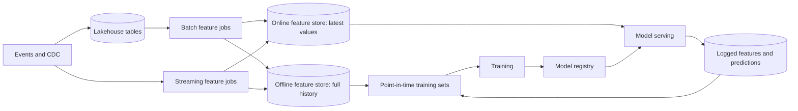

A churn model scores beautifully offline: AUC 0.91 on a held-out month. In production it barely beats the rule "users who have not played anything in two weeks will churn." Two bugs explain the gap, and neither is in the model. First, the training set joined each user's label ("churned within 30 days of 1 May") to features computed from the warehouse **as of the day the training set was built**, in June. A user who churned on 10 May had `plays_last_7d = 0` in June, so the model learned that zero recent plays predicts churn: true, and useless, because at prediction time on 1 May that user still had plays. Second, in production the same feature comes from a streaming job written by another team, which excludes plays shorter than 60 seconds; the batch version counted them. The model is being fed numbers from a different distribution than the one it learned.

Most ML failures in production are data pipeline failures of these two kinds: **leakage**, where training data contains information that would not have been available at prediction time, and **training/serving skew**, where the features seen in serving differ from those seen in training. Both are prevented by pipeline design, not by modelling skill (for the modelling side see [training and generalisation](/learn/ai-and-llms/ml-foundations/training-and-generalisation)), and both are the kind of issue a senior engineer is expected to spot in a design review.

## The shape of an ML data pipeline



Four things distinguish this from the analytics pipelines earlier in the module. Features are needed in two places with different requirements (history for training, low-latency lookups for serving). Training data must be reconstructed **as of the past**, per example. The model's own outputs change the data it will be trained on next (recommendations shape what people watch). And the serving path has a latency budget measured in milliseconds.

## Point-in-time correctness

A training example is an entity, a **prediction time**, and a label observed after it. Every feature attached to that example must be computed only from data available **before** the prediction time. The operation that enforces this is the **point-in-time join** (also called an as-of join): for each label row, take the most recent feature value whose timestamp is at or before the label's timestamp, optionally no older than a time-to-live.

### The leakage bug, row by row

Four users, prediction time 1 May, label "churned by 31 May". The feature history is `plays_last_7d` snapshots (date → value).

| user | label | feature history | correct: latest at or before 1 May | leaked: latest row per user |
|---|---|---|---|---|
| u1 | churned 10 May | 24 Apr → 11, 1 May → 9, 10 May → 0, 17 May → 0 | 9 | 0 |
| u2 | stayed | 28 Apr → 3, 8 May → 5, 15 May → 6 | 3 | 6 |
| u3 | churned 20 May | 30 Apr → 2, 7 May → 1, 20 May → 0 | 2 | 0 |
| u4 | stayed | 26 Apr → 8, 5 May → 7, 12 May → 9 | 8 | 9 |

In the leaked column, every churned user has 0 and every retained user has more than 0: the feature separates the labels perfectly, the offline AUC is 1.0, and the model has learned "people who have already stopped watching have stopped watching". In the correct column the churners have 9 and 2 and the stayers 3 and 8: no threshold separates them, which is the honest difficulty of the problem. The leak is invisible in offline evaluation because the test set is built the same way.

Some engines have an as-of join built in:

```sql
-- DuckDB: for each label, the latest feature row at or before the prediction time.
SELECT l.user_id, l.prediction_ts, l.churned, f.plays_last_7d
FROM labels AS l
ASOF LEFT JOIN user_features AS f
  ON l.user_id = f.user_id AND l.prediction_ts >= f.feature_ts;
```

In Spark or a warehouse without `ASOF JOIN`, the portable form is a range join followed by picking the latest row:

```sql
SELECT user_id, prediction_ts, churned, plays_last_7d
FROM (
  SELECT l.user_id, l.prediction_ts, l.churned, f.plays_last_7d,
         ROW_NUMBER() OVER (PARTITION BY l.user_id, l.prediction_ts
                            ORDER BY f.feature_ts DESC) AS rn
  FROM labels AS l
  LEFT JOIN user_features AS f
    ON f.user_id = l.user_id
   AND f.feature_ts <= l.prediction_ts
   AND f.feature_ts > l.prediction_ts - INTERVAL 30 DAYS     -- TTL bounds the range join
) AS t
WHERE rn = 1;
```

Watch the cost. Without the TTL predicate, each label row joins every earlier feature row for its user: with daily feature snapshots over two years, about 730 rows per label, so 50 million labels become a 36-billion-row intermediate before the window function reduces it. Bounding the range, bucketing both sides by `user_id`, or using an engine with a native as-of join keeps it tractable. Feature stores exist largely to make this join a single, correct, optimised call.

Leakage also enters in less obvious ways: aggregates over a window that extends past the prediction time, dimension tables read in their current state (a plan the user switched to after churning, the Type 1 mistake from [dimensional modelling](/learn/big-data/data-platforms/dimensional-modelling)), and random train/test splits on time-structured data, which let the model see the future of the same users. Split by time for anything that will predict the future.

## Training/serving skew

Skew is any difference between the feature values a model sees in serving and the values it would have seen for the same entity and time in training. The common sources:

1. **Two implementations.** A SQL definition for training and a Java or Flink one for serving, which drift in filters, null handling, time zones and window boundaries.
2. **Different time semantics.** Training uses a daily batch feature (a window ending at midnight); serving uses a real-time one (a window ending now).
3. **Different sources.** Training reads the warehouse's cleaned table; serving reads the operational database or a cache with different semantics.
4. **Defaults.** A missing feature is `null` in training (and imputed) and `0` in serving, where `0` means something real.

### Skew traced on one user

User u7 is scored at 12:00 on 1 May. Their plays in the preceding week:

| play | started | duration |
|---|---|---|
| a | 25 Apr 10:00 | 180 s |
| b | 27 Apr 21:00 | 45 s |
| c | 30 Apr 23:30 | 600 s |
| d | 1 May 08:00 | 30 s |

The **batch** definition (SQL, run nightly at 00:00 on 1 May) counts every play in [24 Apr 00:00, 1 May 00:00): a, b, c → **3**. The **streaming** definition (Flink, evaluated at request time) counts plays of at least 60 seconds in [24 Apr 12:00, 1 May 12:00): a and c qualify, b is too short, d is inside the window but too short → **2**. Decompose the difference: apply the streaming filter to the batch window and you get 2 (b drops out); apply the batch filter to the streaming window and you get 4 (d comes in). The two paths differ in **two independent ways**, a code-path difference and a time-semantics difference, and the model trained on 3 receives 2 with no way to know why. Multiply by 200 features and the serving distribution is not the training distribution.

### Two structural fixes and a monitor

There are two structural fixes, and mature platforms use both:

- **One definition, two materialisations.** A feature is defined once and the platform computes it for both stores: a batch job writes history to the offline store and the latest values to the online store; a streaming feature is computed by one streaming job that writes online, and the same logic is run over historical events (the batch mode of the same engine, as in [lambda vs kappa](/learn/big-data/streaming/lambda-vs-kappa)) to produce its offline history.
- **Log at serving time, train on the log.** When the serving path fetches features to score a request, it logs exactly those values with the request id and timestamp. Training sets are built by joining labels to **logged** features, so training sees precisely what serving saw, including staleness and defaults. The cost is that a brand-new feature has no logged history until it has been served for a while ("log and wait"), so logging is combined with a point-in-time backfill for new features.

To detect skew, compare continuously: for a sample of served requests, recompute the features through the offline path for the same entity and timestamp and track the mismatch rate per feature. A skew monitor that reports "`plays_last_7d` differs on 18% of sampled requests" finds the 60-second bug in a day instead of a quarter.

## Feature stores

A **feature store** implements these patterns:

| Part | What it does | Typical technology |
|---|---|---|
| Registry | Feature definitions, owners, entity keys, types, TTLs, versions | Metadata service, code in a repository |
| Offline store | Full feature history for training and point-in-time joins | Lakehouse tables (Iceberg, Delta), a warehouse |
| Online store | Latest value per entity, single-digit-millisecond reads | Redis, Cassandra, DynamoDB, or similar key-value stores |
| Materialisation | Batch and streaming jobs that compute features and write both stores | Spark, Flink, orchestrated jobs |
| Retrieval APIs | `get_historical_features(labels)` (point-in-time) and `get_online_features(entities)` | SDK or service |

### Under the hood: the write path and the read path

Take a Feast-style layout on Redis (see [key-value stores and Redis](/learn/databases/nosql-and-specialised/key-value-stores-and-redis)). The **offline store** is a table per feature view, `user_features(user_id, event_timestamp, plays_last_7d, ...)`, appended by the batch job each day and partitioned by date, so history is never overwritten and the point-in-time join has every past value. The **batch write path** is an incremental materialisation: read offline rows with `event_timestamp` in (last materialised time, now], keep the latest row per entity, and write it to the online store as one hash per entity key (`HSET user:7 plays_last_7d <bytes> _ts <timestamp>`). At 50,000 writes per second, 250 million entities take about 83 minutes, which must finish before the morning peak. The **streaming write path** skips the offline table on the hot path: a Flink job computes the feature over the event stream, writes the online hash directly, and appends to the offline log so history exists for training.

The **read path** for a ranking request is one `HMGET` for the user's 200 features and a pipelined multi-get for the 500 candidate items, followed by a per-feature **TTL check**: if `now - _ts` exceeds the feature's TTL the value is returned as null, so a stalled materialisation surfaces as missing values rather than as silently stale ones. A same-zone Redis round trip is on the order of a millisecond; 500 item hashes at 1 KB is 500 KB per request. A 10–20 ms budget allows one or two round trips, not 500, which is why item features are pre-joined per entity, hot items cached in-process, and lookups batched.

**Freshness** follows from the write path: a nightly materialisation that finishes at 05:00 serves values between 5 and 29 hours old, and its window ends at midnight regardless of when the request arrives. A streaming feature is seconds old and its window ends now. Those are different features even with identical code, which is skew source 2.

### Feature backfills

A new feature `refunds_90d` needs two years of history before it can be trained on. The backfill computes, for each day D, the value using only events with `ts < D`, which is point-in-time correct by construction, and appends the row with `event_timestamp = D` to the offline store; the last day is then materialised online. As a partitioned job it is 730 runs; at 10 minutes each that is 122 hours serially or about 15 hours at 8-wide, subject to the same pool and cost arithmetic as any backfill in the [orchestration lesson](/learn/big-data/data-platforms/etl-elt-and-orchestration). The alternative is log-and-wait: serve the feature, log it, and train on it in N weeks. Backfill when the feature is expected to matter; log and wait when history is cheap to lose.

### Trade-offs between feature store designs

| Design | Freshness | Skew risk | New-feature backfill | Cost | Operational load |
|---|---|---|---|---|---|
| Batch-only materialisation | Hours | Low if one definition; freshness skew if serving expects fresher | Recompute history, one job | Low | Low |
| Streaming job writing both stores | Seconds | Low (one code path); replay needed for history | Replay events through the same job | Always-on cluster | High |
| Request-time compute from raw | Real-time | High unless a shared library computes both | Hard: recompute per training example | Latency on every request | Medium |
| Log-and-wait on served features | As served | Lowest | None until logged | Log storage | Low |
| Separate batch and streaming implementations | Any | Highest | Depends | Two systems | Highest |

## Embedding pipelines

Embeddings are features whose values only mean something relative to the model that produced them (see [embeddings and similarity](/learn/ai-and-llms/ml-foundations/embeddings-and-similarity)). An item tower run nightly over 50,000 titles at 128 dimensions in float32 is 50,000 × 128 × 4 bytes = 25 MB, small enough to rebuild the nearest-neighbour index every night. User embeddings for 250 million members are 128 GB in float32, which is why they are stored in float16 or int8 and often computed near-line from recent events rather than for everyone every night. Two rules keep the pipeline honest: **version every vector by the model that produced it** (`(model_version, entity_id)` as the key), because vectors from two training runs are not comparable even with identical architecture, and **swap the model, the vectors and the index atomically** so that no request compares a v2 user vector against a v1 item index. The index build is a batch job with its own duration (HNSW construction over 50,000 vectors is seconds; over 50 million it is hours), so the swap is scheduled like any other publication.

## Monitoring drift with PSI

Beyond the data-quality checks of the [previous lesson](/learn/big-data/data-platforms/data-quality-lineage-and-governance), ML pipelines monitor **freshness** of online features (the age of the served value per feature), the **skew rate** from offline recomputation, **label delay** (churn labels arrive weeks later, so recent accuracy is unknowable for a while), **feedback loops** (log the propensity with which an item was shown so training can correct for exposure), and **distribution drift**.

The standard drift statistic is the **population stability index** (PSI). Bin the feature on training-set quantiles, then compare the training proportions `e` with the serving proportions `a`:

$$ \text{PSI} = \sum_i (a_i - e_i)\,\ln\frac{a_i}{e_i} $$

Worked on `plays_last_7d` in five bins after the 60-second filter shipped:

| Bin | Training `e` | Serving `a` | `a − e` | `ln(a/e)` | Term |
|---|---|---|---|---|---|
| 0 plays | 0.30 | 0.50 | +0.20 | +0.5108 | 0.1022 |
| 1–2 | 0.25 | 0.22 | −0.03 | −0.1278 | 0.0038 |
| 3–5 | 0.20 | 0.14 | −0.06 | −0.3567 | 0.0214 |
| 6–10 | 0.15 | 0.09 | −0.06 | −0.5108 | 0.0307 |
| 11+ | 0.10 | 0.05 | −0.05 | −0.6931 | 0.0347 |
| **PSI** | | | | | **0.1927** |

Every term is non-negative because `a − e` and `ln(a/e)` always share a sign. PSI is the symmetrised KL divergence: `KL(a‖e) + KL(e‖a)` = 0.0967 + 0.0960 = 0.1927. The thresholds in common use (below 0.1 no meaningful shift, 0.1 to 0.25 moderate, above 0.25 major) come from credit-scoring practice, not from a theorem; calibrate them per feature. A milder version of the same bug (bin 0 at 0.40 instead of 0.50) scores 0.0568, under the conventional alarm, which is why PSI is paired with the skew-rate monitor rather than trusted alone. A bin with zero mass on either side makes the log blow up; clamp proportions to a small floor such as 0.0001, or merge bins.

```python
import math

def psi(expected_counts, actual_counts, floor=1e-4):
    te, ta = sum(expected_counts), sum(actual_counts)
    total = 0.0
    for e, a in zip(expected_counts, actual_counts):
        pe, pa = max(e / te, floor), max(a / ta, floor)   # clamp empty bins
        total += (pa - pe) * math.log(pa / pe)
    return total

print(round(psi([30, 25, 20, 15, 10], [50, 22, 14, 9, 5]), 4))   # 0.1927
```

Drift is not always a bug. A real change in behaviour (a holiday, a new market) also moves the distribution; the difference is that the skew monitor stays quiet for a real change and lights up for a pipeline change. Check skew before retraining.

## Netflix's published patterns

Netflix has described both halves of this problem publicly. A 2016 post on **distributed time travel for feature generation** described snapshotting the data that online services use (viewing history, lists, the catalogue state) at points in time into S3, so that features could be regenerated exactly as they would have looked at a past moment, and running the **same feature-encoding code** offline over the snapshots and online at request time: one definition, two materialisations. A later post on the evolution of its ML **fact store** (named Axion in the post) described logging the *facts* available at serving time, deduplicating and compacting them into Iceberg tables, and computing features from those facts for training, which is log-at-serving-time applied to inputs rather than to derived values, so that a new feature can be computed from logged facts without waiting.

Netflix open-sourced **Metaflow**, its framework for ML workflows: a flow is a graph of Python steps, every artifact each step produces is versioned and persisted automatically, a failed run can be resumed from the failing step, and steps can be sent to remote compute with a decorator. Production flows are scheduled on the same workflow orchestrator that schedules Netflix's data pipelines (Maestro, from the orchestration lesson). The broader pattern from Netflix's public material is consistent with the rest of this track: events flow through the Keystone pipeline into Iceberg tables in S3, batch and streaming engines compute from those tables and streams, and ML workflows sit on the same foundations rather than on a separate stack.

## Reproducibility

A model is only debuggable if you can rebuild its training set exactly. Record, with every trained model, the feature definitions and their versions, the label definition, the time range, and the **snapshot ids** of every input table. With table formats this is cheap: an Iceberg snapshot id pins exactly which files were read, and time travel reproduces the input months later, as long as snapshot expiry does not remove it first, which is a real tension with privacy deletion.

## Failure modes in production

**Leakage through a latest-value join.** Symptom: offline AUC far above production; the top feature is one that "cannot be that predictive". Diagnosis: the training join has no time condition, or the split is random on time-structured data. Fix: point-in-time join with a TTL, time-based split, and a leakage test that shuffles labels within time buckets.

**A stalled materialisation serving stale values.** Symptom: every prediction drifts in one direction over a day; feature values look valid. Diagnosis: the online `_ts` is 30 hours old across all entities; the batch job failed or the streaming job stalled. Fix: TTLs that turn stale values into nulls the model was trained to handle, a freshness alert per feature, and a stateful-streaming job with checkpoint monitoring (see [stateful streaming](/learn/big-data/streaming/stateful-streaming)).

**Defaults that disagree.** Symptom: users with no history are scored as if they were heavy users. Diagnosis: training imputed nulls with the median; serving filled missing features with 0, or vice versa. Fix: one imputation rule in the feature definition, applied identically in both paths, and logged serving features so training sees the defaults.

**Embedding version mismatch.** Symptom: recommendations become random for a fraction of traffic after a deploy. Diagnosis: user vectors from model v2 compared against an item index built from v1. Fix: version keys, atomic swap of model, vectors and index, and a canary that checks nearest-neighbour agreement between old and new.

**A backfill that reads current dimensions.** Symptom: the new feature is suspiciously predictive in training and inert in production. Diagnosis: the backfill joined a Type 1 dimension as it is today (a plan the user switched to later). Fix: Type 2 dimensions keyed at the feature's `event_timestamp`.

**Online reads blow the latency budget.** Symptom: p99 of the ranking service jumps from 15 ms to 90 ms as candidates grow from 100 to 500. Diagnosis: one round trip per item. Fix: pipelined multi-gets, pre-joined item features, an in-process cache for the hot 1% of items.

## Interviewer follow-ups

**"How do you build the training set for a churn model without leaking?"** Model answer: a label table of (user, prediction time, outcome), a point-in-time join to feature history with a TTL, dimensions read as of the prediction time, and a time-based split; then check that no feature separates the labels implausibly well. Common wrong answer: "join on user id and take the latest features".

**"Training and serving use the same feature definition. Can they still disagree?"** Model answer: yes, through time semantics (a window ending at midnight versus now), freshness, defaults and sources. Trace one user through both paths. Fix by training on logged serving features or computing both from one job. Common wrong answer: "no, the code is identical".

**"Design the online store for 250 million users and 200 features within 20 ms."** Model answer: bytes per entity times entities (400 GB raw, roughly a terabyte with overhead and replication), one hash per entity so a user read is one round trip, pre-joined item features and batched reads for candidates, a materialisation window that fits before peak, TTLs per feature. Common wrong answer: 200 separate lookups per request.

**"PSI on a feature is 0.19 after a deploy. What do you do?"** Model answer: check the skew monitor first: if offline recomputation disagrees with served values, it is a pipeline change and retraining would bake the bug in; if it agrees, the world changed and retraining is the right response. Common wrong answer: retrain immediately.

**"Why version embeddings by model?"** Model answer: vectors from different training runs live in different spaces, so mixing them makes distances meaningless; key by model version and swap model, vectors and index together. Common wrong answer: "the dimensions match, so they are compatible".

## What mid-level engineers get wrong

- Joining labels to the latest feature values: a model that learns the label from the future and collapses in production.
- Random train/test splits on time-structured data: offline metrics that measure memorisation of the same users' futures.
- Trusting "same code" to mean "same feature": window boundaries and freshness differ, and the served distribution drifts from the trained one.
- Materialising nightly without TTLs: a stalled job serves day-old values that look valid.
- Retraining on drift without checking skew: the pipeline bug is baked into the next model.
- Mixing embedding versions during a rollout: nearest-neighbour results that are quietly random for part of the traffic.

## Exercises

```exercise
id: point-in-time-join
title: Point-in-time (as-of) feature join
prompt: |
  Build feature values for training examples without leaking the future.

  - `labels` is a list of `[entity, ts]` training examples.
  - `features` is a list of `[entity, ts, value]` feature observations, in no
    particular order. Timestamps are unique per entity.
  - `ttl` is the maximum allowed age of a feature value.

  For each label, in order, return the value of the feature observation for the
  same entity with the largest `ts` that is `<=` the label's `ts`, provided that
  `label_ts - feature_ts <= ttl`. Otherwise return `null`/`None`.
languages: [python, javascript]
entry: point_in_time_join
starter:
  python: |
    def point_in_time_join(labels, features, ttl):
        # your code here
        return [None for _ in labels]
  javascript: |
    function point_in_time_join(labels, features, ttl) {
      // your code here
      return labels.map(() => null);
    }
tests:
  - args: [[["u1", 6], ["u2", 4], ["u1", 9]], [["u1", 9, 0], ["u1", 1, 10], ["u2", 3, 7], ["u1", 5, 12]], 100]
    expected: [12, 7, 0]
  - args: [[["u1", 0], ["u3", 5]], [["u1", 9, 0], ["u1", 1, 10], ["u2", 3, 7], ["u1", 5, 12]], 100]
    expected: [null, null]
    label: no observation yet, unknown entity
  - args: [[["u2", 13], ["u2", 20]], [["u1", 9, 0], ["u1", 1, 10], ["u2", 3, 7], ["u1", 5, 12]], 10]
    expected: [7, null]
    label: time-to-live
  - args: [[["u1", 8]], [["u1", 9, 0], ["u1", 1, 10], ["u2", 3, 7], ["u1", 5, 12]], 100]
    expected: [12]
    label: never uses a future value
  - args: [[], [["u1", 1, 10]], 5]
    expected: []
    hidden: true
  - args: [[["a", 100], ["b", 50], ["a", 99]], [["a", 90, 1], ["a", 100, 2], ["b", 10, 3], ["b", 40, 4]], 10]
    expected: [2, 4, 1]
    hidden: true
    label: boundaries are inclusive
hints:
  - "Group feature observations by entity and sort each group by timestamp."
  - "For each label, find the last observation with ts <= label ts (a binary search on the sorted group), then check its age against the TTL. Be careful not to treat a value of 0 as missing."
```

```exercise
id: population-stability-index
title: Population stability index between two binned distributions
prompt: |
  `expected` and `actual` are lists of bin counts of the same length (the
  training and serving histograms of one feature). Convert each list to
  proportions by dividing by its own total, replace any proportion that is 0
  with 0.0001, then compute

      PSI = sum over bins of (a - e) * ln(a / e)

  where `e` and `a` are the expected and actual proportions of a bin.
  Return the PSI rounded to 4 decimal places.
languages: [python, javascript]
entry: psi
starter:
  python: |
    import math

    def psi(expected, actual):
        # your code here
        return 0.0
  javascript: |
    function psi(expected, actual) {
      // your code here (Math.log is the natural logarithm)
      return 0;
    }
tests:
  - args: [[30, 25, 20, 15, 10], [50, 22, 14, 9, 5]]
    expected: 0.1927
    label: the worked example from the lesson
  - args: [[30, 25, 20, 15, 10], [60, 50, 40, 30, 20]]
    expected: 0
    label: identical distributions with different totals
  - args: [[30, 25, 20, 15, 10], [40, 25, 17, 11, 7]]
    expected: 0.0568
    label: a mild shift below the conventional alarm
  - args: [[50, 50, 0], [50, 40, 10]]
    expected: 0.7124
    label: an empty expected bin is clamped
  - args: [[100], [7]]
    expected: 0
    hidden: true
    label: a single bin never drifts
  - args: [[1, 1, 1, 1], [10, 10, 10, 70]]
    expected: 0.8757
    hidden: true
    label: a large shift
hints:
  - "Compute both totals first; the two histograms usually have different sample sizes."
  - "Clamp each proportion after dividing, before taking the logarithm; a zero on either side otherwise gives infinity or NaN."
```

## Senior signals

- You ask **"as of when?"** for every feature in a training set, you can trace by hand how a latest-value join manufactures a perfect and useless feature, and you insist on point-in-time joins, time-based splits and dimensions read as of the prediction time.
- You enumerate the sources of **training/serving skew** (two implementations, time semantics, sources, defaults), trace one entity through both paths, and fix them structurally: one definition with two materialisations, and training on **logged serving features**.
- You know the feature store's **write path and read path**: incremental materialisation, one hash per entity, TTL checks that turn staleness into nulls, batched reads inside a millisecond budget.
- You treat feature **backfills** as point-in-time jobs with backfill arithmetic, and **embeddings** as versioned artifacts swapped atomically with their model and index.
- You compute **PSI** by hand, know it is the symmetrised KL divergence, and check the skew monitor before retraining on drift.
- You can describe Netflix's public patterns (time-travel feature generation, a fact store of logged inputs, Metaflow on the shared orchestrator) as instances of these general ideas.

## Check yourself

```quiz
- q: >-
    A churn model's training set joins labels for 1 May to a features table on user_id only, taking each user's latest row. Offline accuracy is excellent and production accuracy is poor. What is the most likely cause?
  options: ["The model is overfitting to noise in the training month", "The labels are imbalanced, since few users churn in May", "The online store is too slow, so serving drops features", "Label leakage from feature rows computed after 1 May"]
  answer: 3
  explanation: >-
    Without a point-in-time condition, the latest feature rows were computed after the prediction time (for example, zero plays after a user churned) and leak the label into the inputs. The model learns the leak, which does not exist at prediction time. Overfitting to noise would hurt held-out offline accuracy too, not only production.
- q: >-
    Training uses a nightly batch feature computed as of midnight; serving reads a streaming version updated every minute. Both implement the same definition correctly. Why can this still hurt the model?
  options: ["The model learned day-old values and now gets fresh ones", "It cannot hurt, because the definitions are identical", "Streaming features are approximate, so values drift apart", "Nightly jobs cannot compute the same windowed aggregates"]
  answer: 0
  explanation: >-
    Freshness and window boundaries are part of the feature's meaning. The model learned the relationship between labels and values whose window ended at midnight; in serving it receives values whose window ends now, with a different distribution. Identical code does not make a 12-hour-stale input and a 1-minute-stale input the same. Training on logged serving values, or computing training features at the same freshness, removes the skew.
- q: >-
    Why is training on features logged at serving time an effective defence against skew, and what is its main cost?
  options: ["It removes the need for labels; it costs some accuracy", "It is faster to compute; its only cost is extra storage", "It avoids point-in-time joins entirely, so it has no real cost", "Training sees what serving saw; new features lack history"]
  answer: 3
  explanation: >-
    Logged features are by construction what the model saw in production, including staleness and defaults. A new feature has no logged history until it has been served for a while, so it must either wait or be backfilled point-in-time from the offline path. Labels are still joined to the logged features by time, so neither labels nor time-based joins go away.
- q: >-
    A range-based point-in-time join over two years of daily feature snapshots for 50 million labels runs for hours and spills terabytes. What is the most effective fix?
  options: ["Sort the labels table by timestamp before the join", "Switch to a random split so fewer labels need features", "Add more executors so the spill spreads over more disks", "Bound the range with a TTL and bucket both sides by entity"]
  answer: 3
  explanation: >-
    Without a lower bound each label joins about 730 earlier rows, a 36-billion-row intermediate. A time-to-live predicate (or a native as-of join) keeps the intermediate close to one row per label; bucketing both sides by entity avoids a large shuffle. More executors only spread the same oversized intermediate.
- q: >-
    The day after a deploy, the PSI of plays_last_7d between training and serving is 0.19. What should happen first?
  options: ["Compare served values with offline recomputation for the same requests", "Roll back the model, since drift means it is no longer valid", "Raise the alert threshold to 0.25, the conventional major-shift level", "Retrain the model on the last week of served data"]
  answer: 0
  explanation: >-
    A PSI of 0.19 says the distribution moved, not why. If offline recomputation of the same entities and timestamps disagrees with the served values, the deploy changed the feature pipeline and retraining would bake the bug into the next model; if it agrees, behaviour really changed and retraining is appropriate. Neither raising the threshold nor rolling back the model addresses the feature path.
- q: >-
    Which record best makes a trained model's dataset reproducible six months later?
  options: ["The Git commit of the service that serves the model", "The row count and schema of the final training set", "The model's hyperparameters, random seed and framework version", "Feature versions, label definition and input snapshot ids"]
  answer: 3
  explanation: >-
    Reproducing data requires knowing exactly what was computed and from which versions of the inputs: feature definitions and versions, the label definition and time range, and the snapshot ids of every input table. Table-format snapshot ids pin the input files; definitions pin the logic. Hyperparameters and row counts describe the model, not the data.
```
