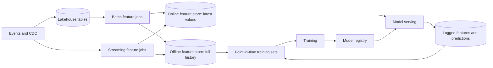

A churn model scores beautifully offline: AUC 0.91 on a held-out month. In production it barely beats the rule "users who have not played anything in two weeks will churn." Two bugs explain the gap, and neither is in the model. First, the training set joined each user's label ("churned within 30 days of 1 May") to features computed from the warehouse **as of the day the training set was built**, in June. A user who churned on 10 May had `plays_last_7d = 0` in June, so the model learned that zero recent plays predicts churn: true, and useless, because at prediction time on 1 May that user still had plays. Second, in production the same feature comes from a streaming job written by another team, which excludes plays shorter than 60 seconds; the batch version counted them. The model is being fed numbers from a different distribution than the one it learned.

Most ML failures in production are data pipeline failures of these two kinds: **leakage**, where training data contains information that would not have been available at prediction time, and **training/serving skew**, where the features seen in serving differ from those seen in training. Both are prevented by pipeline design, not by modelling skill, and both are the kind of issue a senior engineer is expected to spot in a design review of an ML system.

## The shape of an ML data pipeline



Four things distinguish this from the analytics pipelines earlier in the module. Features are needed in two places with different requirements (history for training, low-latency lookups for serving). Training data must be reconstructed **as of the past**, per example. The model's own outputs change the data it will be trained on next (recommendations shape what people watch). And the serving path has a latency budget measured in milliseconds.

## Point-in-time correctness

A training example is an entity, a **prediction time**, and a label observed after it. Every feature attached to that example must be computed only from data available **before** the prediction time. The operation that enforces this is the **point-in-time join** (also called an as-of join): for each label row, take the most recent feature value whose timestamp is at or before the label's timestamp, optionally no older than a time-to-live.

| user | prediction time | label | `plays_last_7d` history (timestamp → value) | Correct feature |
|---|---|---|---|---|
| u1 | 1 May | churned | 24 Apr → 11, 1 May → 9, 10 May → 0 | 9 |
| u2 | 1 May | stayed | 20 Apr → 3 | 3 if within TTL, otherwise null |

Joining on `user_id` alone and taking the latest value gives u1 the value 0 from 10 May: the future leaks in. Some engines have an as-of join built in:

```sql
-- DuckDB: for each label, the latest feature row at or before the prediction time.
SELECT l.user_id, l.prediction_ts, l.churned, f.plays_last_7d
FROM labels AS l
ASOF LEFT JOIN user_features AS f
  ON l.user_id = f.user_id AND l.prediction_ts >= f.feature_ts;
```

In Spark or a warehouse without `ASOF JOIN`, the portable form is a range join followed by picking the latest row:

```sql
SELECT user_id, prediction_ts, churned, plays_last_7d
FROM (
  SELECT l.user_id, l.prediction_ts, l.churned, f.plays_last_7d,
         ROW_NUMBER() OVER (PARTITION BY l.user_id, l.prediction_ts
                            ORDER BY f.feature_ts DESC) AS rn
  FROM labels AS l
  LEFT JOIN user_features AS f
    ON f.user_id = l.user_id
   AND f.feature_ts <= l.prediction_ts
   AND f.feature_ts > l.prediction_ts - INTERVAL 30 DAYS     -- TTL bounds the range join
) AS t
WHERE rn = 1;
```

Watch the cost. Without the TTL predicate, each label row joins every earlier feature row for its user: with daily feature snapshots over two years, about 730 rows per label, so 50 million labels become a 36-billion-row intermediate before the window function reduces it. Bounding the range, bucketing both sides by `user_id`, or using an engine with a native as-of join keeps it tractable. Feature stores exist largely to make this join a single, correct, optimised call.

Leakage also enters in less obvious ways: aggregates computed over a window that extends past the prediction time, dimension tables read in their current state (a subscription plan the user switched to after churning), and random train/test splits on data with a time structure, which let the model see the future of the same users. Split by time for anything that will be used to predict the future.

## Training/serving skew

Skew is any difference between the feature values a model sees in serving and the values it would have seen for the same entity and time in training. The common sources:

1. **Two implementations.** A SQL definition for training and a Java or Flink one for serving, which drift in filters, null handling, time zones and window boundaries.
2. **Different freshness.** Training uses a daily batch feature (as of midnight); serving uses a real-time one (as of now). The model learned what a 12-hour-old value means and receives a fresh one.
3. **Different sources.** Training reads the warehouse's cleaned table; serving reads the operational database or a cache with different semantics.
4. **Defaults.** A missing feature is `null` in training (and imputed by the training pipeline) and `0` in serving, where `0` means something real.

There are two structural fixes, and mature platforms use both:

- **One definition, two materialisations.** A feature is defined once and the platform computes it for both stores: a batch job writes history to the offline store and the latest values to the online store; a streaming feature is computed by one streaming job that writes online, and the same logic is run over historical events (the batch mode of the same engine, as in the [lambda vs kappa](/learn/big-data/streaming/lambda-vs-kappa) lesson) to produce its offline history.
- **Log at serving time, train on the log.** When the serving path fetches features to score a request, it logs exactly those values with the request id and timestamp. Training sets are then built by joining labels to **logged** features, so training sees precisely what serving saw, including staleness and defaults. The cost is that a brand-new feature has no logged history until it has been served for a while ("log and wait"), so logging is usually combined with a point-in-time backfill for new features.

Netflix has described both halves of this problem publicly. An early post on "distributed time travel" for feature generation explained snapshotting the data that online services use so that features can be regenerated as they would have looked at a past moment, and a later post described a fact store that records the facts available at serving time so features can be recomputed from them for training.

To detect skew, compare continuously: for a sample of served requests, recompute the features through the offline path for the same entity and timestamp and track the mismatch rate per feature. A skew monitor that reports "`plays_last_7d` differs by more than 1 on 18% of sampled requests" finds the 60-second filter bug in a day instead of a quarter.

## Feature stores

A **feature store** is the component that implements these patterns:

| Part | What it does | Typical technology |
|---|---|---|
| Registry | Feature definitions, owners, entity keys, types, TTLs, versions | Metadata service, code in a repository |
| Offline store | Full feature history for training and point-in-time joins | Lakehouse tables (Iceberg, Delta), a warehouse |
| Online store | Latest value per entity, single-digit-millisecond reads | Redis, Cassandra, DynamoDB, or similar key-value stores |
| Materialisation | Batch and streaming jobs that compute features and write both stores | Spark, Flink, orchestrated jobs |
| Retrieval APIs | `get_historical_features(labels)` (point-in-time) and `get_online_features(entities)` | SDK or service |

Open-source options such as Feast implement the registry and retrieval layers on top of your own storage; commercial platforms add managed compute. Whether you buy or build, the value is in the guarantees: one definition, point-in-time correct history, and consistent online values.

Size the online store before choosing it. For 250 million members with 200 numeric features each, the raw values are 250M × 200 × 8 bytes = 400 GB, and roughly double to triple that with keys, per-entry overhead and replication. A daily batch materialisation writing 250 million rows at 50,000 writes/s takes about 83 minutes, which must fit before the morning traffic peak. On the read side, a ranking request that scores 500 candidate titles needs item features for all 500 inside a budget of perhaps 10–20 ms, which means batched multi-gets, co-located caches for hot items, and features pre-joined per entity rather than 200 separate lookups.

## Reproducibility

A model is only debuggable if you can rebuild its training set exactly. Record, with every trained model, the feature definitions and their versions, the label definition, the time range, and the **snapshot ids** of every input table. With table formats this is cheap: an Iceberg snapshot id pins exactly which files were read, and time travel reproduces the input months later (as long as snapshot expiry does not remove it first, which is a real tension with privacy deletion; see [data quality, lineage and governance](/learn/big-data/data-platforms/data-quality-lineage-and-governance)).

Netflix open-sourced **Metaflow**, its framework for building ML workflows, which models a pipeline as a graph of steps and versions every artifact each step produces, so any run can be inspected and resumed; production flows are scheduled on the company's workflow orchestrator, the same one that schedules its data pipelines. The broader pattern from Netflix's public material is consistent with the rest of this track: events flow through the Keystone pipeline into Iceberg tables in S3, batch and streaming engines compute from those tables and streams, and ML workflows sit on the same foundations rather than on a separate stack.

## Monitoring ML data

Beyond the data-quality checks of the previous lesson, ML pipelines need:

- **Freshness of online features**: the age of the value served, per feature. A streaming job that stalls silently serves hours-old values that look perfectly valid.
- **Distribution drift**: compare each feature's serving distribution with its training distribution (population stability index, or quantile comparisons). Drift is not always a bug, but it predicts degraded accuracy.
- **Skew rate**: the online-versus-offline recomputation comparison above.
- **Label delay**: labels such as churn arrive weeks later, so offline accuracy for recent models is unknowable for a while; proxy metrics and delayed evaluation jobs fill the gap.
- **Feedback loops**: a recommender trained on what it recommended learns its own biases; log propensities (the probability the item was shown) so training can correct for exposure.

## Exercise

```exercise
id: point-in-time-join
title: Point-in-time (as-of) feature join
prompt: |
  Build feature values for training examples without leaking the future.

  - `labels` is a list of `[entity, ts]` training examples.
  - `features` is a list of `[entity, ts, value]` feature observations, in no
    particular order. Timestamps are unique per entity.
  - `ttl` is the maximum allowed age of a feature value.

  For each label, in order, return the value of the feature observation for the
  same entity with the largest `ts` that is `<=` the label's `ts`, provided that
  `label_ts - feature_ts <= ttl`. Otherwise return `null`/`None`.
languages: [python, javascript]
entry: point_in_time_join
starter:
  python: |
    def point_in_time_join(labels, features, ttl):
        # your code here
        return [None for _ in labels]
  javascript: |
    function point_in_time_join(labels, features, ttl) {
      // your code here
      return labels.map(() => null);
    }
tests:
  - args: [[["u1", 6], ["u2", 4], ["u1", 9]], [["u1", 9, 0], ["u1", 1, 10], ["u2", 3, 7], ["u1", 5, 12]], 100]
    expected: [12, 7, 0]
  - args: [[["u1", 0], ["u3", 5]], [["u1", 9, 0], ["u1", 1, 10], ["u2", 3, 7], ["u1", 5, 12]], 100]
    expected: [null, null]
    label: no observation yet, unknown entity
  - args: [[["u2", 13], ["u2", 20]], [["u1", 9, 0], ["u1", 1, 10], ["u2", 3, 7], ["u1", 5, 12]], 10]
    expected: [7, null]
    label: time-to-live
  - args: [[["u1", 8]], [["u1", 9, 0], ["u1", 1, 10], ["u2", 3, 7], ["u1", 5, 12]], 100]
    expected: [12]
    label: never uses a future value
  - args: [[], [["u1", 1, 10]], 5]
    expected: []
    hidden: true
  - args: [[["a", 100], ["b", 50], ["a", 99]], [["a", 90, 1], ["a", 100, 2], ["b", 10, 3], ["b", 40, 4]], 10]
    expected: [2, 4, 1]
    hidden: true
    label: boundaries are inclusive
hints:
  - "Group feature observations by entity and sort each group by timestamp."
  - "For each label, find the last observation with ts <= label ts (a binary search on the sorted group), then check its age against the TTL. Be careful not to treat a value of 0 as missing."
```

## Senior signals

- You ask **"as of when?"** for every feature in a training set and insist on point-in-time joins, time-based splits and dimensions read as of the prediction time.
- You enumerate the sources of **training/serving skew** (two implementations, freshness, sources, defaults) and fix them structurally: one definition with two materialisations, and training on **logged serving features**.
- You treat the **online store** as a capacity-planned system: bytes per entity, materialisation time, batched reads within a millisecond budget.
- You make training sets **reproducible** with feature versions and table snapshot ids, and you know snapshot retention conflicts with deletion requirements.
- You monitor **feature freshness, drift, skew rate and label delay**, not just model accuracy.
- You can describe Netflix's public patterns (Keystone into Iceberg on S3, Metaflow on the shared orchestrator, time-travel feature generation) as instances of these general ideas.

## Check yourself

```quiz
- q: >-
    A churn model's training set joins labels for 1 May to a features table on user_id only, taking each user's latest row. Offline accuracy is excellent and production accuracy is poor. What is the most likely cause?
  options: ["The online store is too slow, so serving drops features", "Label leakage from feature rows computed after 1 May", "The labels are imbalanced, since few users churn in May", "The model is overfitting to noise in the training month"]
  answer: 1
  explanation: >-
    Without a point-in-time condition, the latest feature rows were computed after the prediction time (for example, zero plays after a user churned) and leak the label into the inputs. The model learns the leak, which does not exist at prediction time. Overfitting to noise would hurt held-out offline accuracy too, not only production.
- q: >-
    Training uses a nightly batch feature computed as of midnight; serving reads a streaming version updated every minute. Both implement the same definition correctly. Why can this still hurt the model?
  options: ["It cannot hurt, because the definitions are identical", "Streaming features are approximate, so values drift apart", "Nightly jobs cannot compute the same windowed aggregates", "The model learned day-old values and now gets fresh ones"]
  answer: 3
  explanation: >-
    Freshness is part of the feature's meaning. The model learned the relationship between labels and values that are up to a day old; in serving it receives fresher values with a different distribution. Identical code does not make a 12-hour-stale input and a 1-minute-stale input the same. Training on logged serving values, or computing training features at the same freshness, removes the skew.
- q: >-
    Why is training on features logged at serving time an effective defence against skew, and what is its main cost?
  options: ["It removes the need for labels; it costs some accuracy", "Training sees what serving saw; new features lack history", "It is faster to compute; its only cost is extra storage", "It avoids point-in-time joins entirely, so it has no real cost"]
  answer: 1
  explanation: >-
    Logged features are by construction what the model saw in production, including staleness and defaults. A new feature has no logged history until it has been served for a while, so it must either wait or be backfilled point-in-time from the offline path. Labels are still joined to the logged features by time, so neither labels nor time-based joins go away.
- q: >-
    A range-based point-in-time join over two years of daily feature snapshots for 50 million labels runs for hours and spills terabytes. What is the most effective fix?
  options: ["Sort the labels table by timestamp before the join", "Switch to a random split so fewer labels need features", "Add more executors so the spill spreads over more disks", "Bound the range with a TTL and bucket both sides by entity"]
  answer: 3
  explanation: >-
    Without a lower bound each label joins about 730 earlier rows, a 36-billion-row intermediate. A time-to-live predicate (or a native as-of join) keeps the intermediate close to one row per label; bucketing both sides by entity avoids a large shuffle. More executors only spread the same oversized intermediate.
- q: >-
    Which record best makes a trained model's dataset reproducible six months later?
  options: ["Feature versions, label definition and input snapshot ids", "The Git commit of the service that serves the model", "The row count and schema of the final training set", "The model's hyperparameters, random seed and framework version"]
  answer: 0
  explanation: >-
    Reproducing data requires knowing exactly what was computed and from which versions of the inputs: feature definitions and versions, the label definition and time range, and the snapshot ids of every input table. Table-format snapshot ids pin the input files; definitions pin the logic. Hyperparameters and row counts describe the model, not the data.
```
