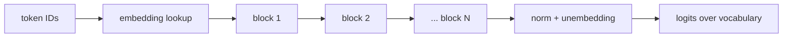

To predict the next token of "The checkout service returned 503 because the database connection pool was", a model has to combine information from positions far apart: "503", "database", "pool". It also has to do this for every position of every training document, trillions of times, which means the computation must run in parallel across positions. The architectures before 2017, recurrent networks, read one token at a time and squeezed everything seen so far into one fixed-size state vector. They were slow to train, because step $t$ had to wait for step $t - 1$, and they forgot: information from 500 tokens back had to survive 500 squeezes.

The **transformer** throws recurrence away. Every position looks directly at every earlier position through **attention**, a weighted average whose weights the model computes on the fly, and all positions are processed at once as matrix multiplications. This lesson walks through one transformer block with numbers you can check by hand. Every model family you will build on (Claude, GPT, Gemini, Llama) is a stack of variations on this block.

## The shape of the whole model

Token IDs from the [tokenizer](/learn/ai-and-llms/how-llms-work/tokenization) are turned into vectors by an embedding lookup, one row of a $V \times d$ table per token, where $d$ (the **model dimension**) is 4,096 in a typical 7B-class model. A sequence of $n$ tokens becomes an $n \times d$ matrix. That matrix passes through $N$ identical **blocks**, each of which maps $n \times d$ to $n \times d$: same shape in, same shape out. At the end, a final linear layer (the **unembedding**) turns each position's vector into $V$ scores, one per vocabulary entry, called **logits**.



Inside each block there are exactly two sub-layers: **attention**, the only place where positions exchange information, and an **MLP**, which transforms each position on its own. Everything else is plumbing that makes a stack of 32 or 80 of them trainable.

## Self-attention: queries, keys and values

Each position's vector $x$ is projected three ways by learned matrices:

- a **query** $q = x W_Q$: what this position is looking for,
- a **key** $k = x W_K$: what this position offers to others,
- a **value** $v = x W_V$: what it passes on if another position attends to it.

Position $i$ scores every position $j$ by the dot product $q_i \cdot k_j$, scaled by $\sqrt{d_k}$ (the query/key dimension). A softmax turns the scores into weights that are positive and sum to 1, and the output for position $i$ is the weighted average of the values:

$$\text{out}_i = \sum_j w_{ij}\, v_j, \qquad w_{ij} = \text{softmax}_j\!\left(\frac{q_i \cdot k_j}{\sqrt{d_k}}\right)$$

Think of it as a soft, differentiable dictionary lookup: the query is compared against every key, and instead of returning the single best match, attention returns a blend of values weighted by how well each key matched.

### Three tokens by hand

Take the sequence "the cat sat" with 2-dimensional embeddings (real models use thousands of dimensions; the arithmetic is identical). After multiplying by the three learned projection matrices, each token has:

| token | query $q$ | key $k$ | value $v$ |
|---|---|---|---|
| the | (0.27, 0.86) | (−0.07, 0.80) | (0.55, 0.80) |
| cat | (0.75, 0.14) | (0.71, 0.56) | (0.55, −0.10) |
| sat | (0.39, −0.70) | (0.68, −0.28) | (−0.05, −0.85) |

Compute the attention output for "sat", the last position, which may look at all three tokens.

**1. Scores.** Dot the query of "sat" with every key:

- with "the": $0.39 \times (-0.07) + (-0.70) \times 0.80 = -0.027 - 0.560 = -0.587$
- with "cat": $0.39 \times 0.71 + (-0.70) \times 0.56 = 0.277 - 0.392 = -0.115$
- with "sat": $0.39 \times 0.68 + (-0.70) \times (-0.28) = 0.265 + 0.196 = 0.461$

**2. Scale.** Divide by $\sqrt{d_k} = \sqrt{2} = 1.414$: $(-0.415, -0.081, 0.326)$.

**3. Softmax.** Exponentiate: $e^{-0.415} = 0.660$, $e^{-0.081} = 0.922$, $e^{0.326} = 1.386$. They sum to 2.968, so the weights are $(0.222, 0.311, 0.467)$. "sat" attends most to itself, then to "cat".

**4. Weighted sum of values.**

- first component: $0.222 \times 0.55 + 0.311 \times 0.55 + 0.467 \times (-0.05) = 0.122 + 0.171 - 0.023 = 0.270$
- second component: $0.222 \times 0.80 + 0.311 \times (-0.10) + 0.467 \times (-0.85) = 0.178 - 0.031 - 0.397 = -0.250$

The output for "sat" is $(0.27, -0.25)$: a new vector that mixes information from all three positions, in proportions the model chose. With random numbers the pattern means nothing; in a trained model, individual attention heads learn recognisable jobs, such as attending to the previous token, from a verb to its subject, from a closing bracket to its opening one, or from a variable's use to its definition.

Step through the full computation for every row:

```viz
{"type": "ml", "algorithm": "attention", "text": "the cat sat",
 "title": "Self-attention across three tokens",
 "caption": "Same embeddings and projections as the table above. Each row computes scores, softmax weights and a weighted sum of values; the last frame applies the causal mask."}
```

### Why divide by the square root of the dimension

If the components of $q$ and $k$ are roughly independent with unit variance, their dot product is a sum of $d_k$ terms and has variance $d_k$, so its typical size is $\sqrt{d_k}$. With $d_k = 128$, unscaled scores are routinely around ±11. A softmax over numbers that far apart is essentially one-hot: all weight on the largest score, near-zero gradients for everything else, and training stalls. Dividing by $\sqrt{d_k}$ brings scores back to unit scale, where the softmax is soft enough to learn from.

### The causal mask

A language model is trained to predict every next token of a document at once: position 1 predicts token 2, position 2 predicts token 3, and so on, all in one forward pass. That only works if position $i$ cannot peek at positions after $i$. The **causal mask** sets every score with $j > i$ to $-\infty$ before the softmax, which turns those weights into exactly 0. In the example, "cat" may only attend to "the" and itself; its weights become (0.40, 0.60) and its output (0.55, 0.26). One forward pass over a 4,000-token document therefore yields 4,000 training examples, which is a large part of why transformers train so efficiently.

### The matrix form

Stack all queries, keys and values into $n \times d_k$ matrices $Q$, $K$ and $V$, and attention for the whole sequence is one expression:

$$\text{Attention}(Q, K, V) = \text{softmax}\!\left(\frac{Q K^\top}{\sqrt{d_k}} + M\right) V$$

where $M$ holds $-\infty$ above the diagonal. $QK^\top$ is an $n \times n$ matrix: every position scored against every position. That square is the reason long contexts are expensive, the subject of [Context windows and the KV cache](/learn/ai-and-llms/how-llms-work/context-windows-and-kv-cache).

```python
import numpy as np

def softmax(z, axis=-1):
    z = z - z.max(axis=axis, keepdims=True)          # stability: exp never overflows
    e = np.exp(z)
    return e / e.sum(axis=axis, keepdims=True)

def causal_self_attention(X, Wq, Wk, Wv):
    Q, K, V = X @ Wq, X @ Wk, X @ Wv                 # each (n, d_k)
    scores = Q @ K.T / np.sqrt(K.shape[-1])          # (n, n)
    n = X.shape[0]
    future = np.triu(np.ones((n, n), dtype=bool), k=1)
    scores = np.where(future, -np.inf, scores)       # causal mask
    return softmax(scores) @ V                       # (n, d_k)

X  = np.array([[0.2, 0.9], [0.8, 0.3], [0.5, -0.6]])     # "the", "cat", "sat"
Wq = np.array([[0.9, -0.2], [0.1, 1.0]])
Wk = np.array([[1.0, 0.4], [-0.3, 0.8]])
Wv = np.array([[0.5, -0.5], [0.5, 1.0]])
causal_self_attention(X, Wq, Wk, Wv)
# [[0.55, 0.80], [0.55, 0.26], [0.27, -0.25]]
```

## Multi-head attention

One set of attention weights per position can only express one pattern of "who to look at". **Multi-head attention** runs several attention computations in parallel, each with its own $W_Q$, $W_K$, $W_V$ of reduced width, concatenates their outputs, and mixes them with an output projection $W_O$. A 7B-class model typically has $d = 4{,}096$ split into 32 heads of 128 dimensions each. The total compute is about the same as one full-width head, but the heads can specialise: one tracks syntax, another the previous token, another long-range references.

Many modern models use **grouped-query attention** (GQA): all 32 query heads are kept, but they share a smaller number of key/value heads (say 8). Output quality stays close to full multi-head attention, and the memory needed to cache keys and values during generation drops by 4×, which, as you will see, is often the limiting resource when serving.

## The MLP: where most parameters live

After attention, every position passes independently through a two-layer feed-forward network: expand from $d$ to about $4d$, apply a non-linearity (GELU, or a gated variant such as SwiGLU in many recent models), and project back to $d$. No information moves between positions here. The MLP holds two matrices of $d \times 4d$, so $8d^2$ parameters against attention's $4d^2$ ($W_Q$, $W_K$, $W_V$ and $W_O$): about two thirds of every block. Interpretability research suggests that much of what a model "knows" about the world is stored in these MLP weights and retrieved by the patterns in the residual stream, although the picture is far from complete.

A useful summary: **attention moves information between positions; the MLP transforms information within a position.**

## Residuals and normalisation: making 80 blocks trainable

Each sub-layer is wrapped the same way:

$$x \leftarrow x + \text{Attention}(\text{Norm}(x)), \qquad x \leftarrow x + \text{MLP}(\text{Norm}(x))$$

The **residual connection** ($x + \ldots$) means each sub-layer only computes a correction that is added to the vector flowing through, rather than replacing it. The running vector is often called the **residual stream**: every block reads from it and writes additively back into it. Because the addition passes gradients through unchanged, the loss signal reaches the first block of an 80-block model directly, which is the fix for vanishing gradients from [Neural networks](/learn/ai-and-llms/ml-foundations/neural-networks).

The **normalisation layer** (LayerNorm, or the cheaper RMSNorm) rescales each token's vector to a standard scale before it enters a sub-layer, followed by a learned per-dimension scale. It keeps activations in a stable range as the residual stream accumulates contributions from dozens of blocks. Placing the norm *before* each sub-layer ("pre-norm", as written above) is the standard in current models because it trains more stably at depth.

Follow one token through one complete block:

```viz
{"type": "ml", "algorithm": "transformer-block", "text": "the cat sat",
 "title": "One token through one transformer block",
 "caption": "Norm, attention, residual add, norm, MLP, residual add. The vector leaves in the same space it entered, ready for the next block."}
```

## Position: how order gets in

Look at the attention formula again: nothing in it depends on where a token sits. Shuffle the input tokens and every output is the same, just shuffled. Without extra information, "dog bites man" and "man bites dog" would be indistinguishable. Transformers inject position in one of a few ways:

- **Learned absolute position embeddings**, one vector per position added to the token embedding. Simple, but the model has no embedding for positions beyond the longest sequence it trained on.
- **Sinusoidal encodings**, the original design: fixed sine and cosine waves of different frequencies added to the embeddings.
- **Rotary position embeddings (RoPE)**, used by many current model families. Instead of adding anything, RoPE rotates each query and key by an angle proportional to its position, pairing up dimensions as 2-D planes. In one plane, rotate $q$ at position $m$ by $m\theta$ and $k$ at position $n$ by $n\theta$; their dot product becomes $\|q\|\|k\|\cos(\phi + (m - n)\theta)$, where $\phi$ is the angle between the unrotated vectors. The score depends only on the **relative distance** $m - n$, which is what language mostly cares about. Stretching those rotation frequencies is also one of the main tools for extending a trained model's context length.

## From the last block to a prediction

After the final block, a last normalisation and the unembedding matrix ($d \times V$, often the transpose of the embedding table) turn each position's vector into $V$ logits. During training, every position's logits are scored with cross-entropy against the token that actually came next. During generation, only the logits at the **last** position are used: they are the model's opinion about the next token, which [Generation and sampling](/learn/ai-and-llms/how-llms-work/generation-and-sampling) turns into an actual choice.

## Counting parameters and compute

The arithmetic is worth being able to do on a whiteboard. Per block: attention $4d^2$ plus MLP $8d^2$ gives about $12d^2$ (ignoring the small norms and biases).

- $d = 4{,}096$: $12 \times 4{,}096^2 \approx 201$ million parameters per block.
- 32 blocks: $6.44$ billion.
- Embedding and unembedding with a 32,000-token vocabulary: $2 \times 32{,}000 \times 4{,}096 \approx 0.26$ billion.
- Total: about **6.7 billion**, which is what a "7B" model is.

Every parameter participates in one multiply and one add per token, so a forward pass costs about $2 \times 6.7 = 13.4$ GFLOPs per token, plus the attention scores themselves, about $4 \times n \times d$ per layer for context length $n$. At short contexts the weights dominate; at long contexts the attention term grows until it rivals them. A 70B-class model with $d = 8{,}192$ and 80 blocks lands at roughly ten times the parameters and FLOPs per token.

## Exercise

```exercise
id: single-query-attention
title: Attention for one query
prompt: |
  Implement scaled dot-product attention for a single query position.

  `q` is a list of d numbers. `keys` and `values` are lists of equal length n
  (n >= 1); each key has d numbers and each value has the same number of
  components m (m may differ from d). Return the output vector (m numbers):

  1. score_j = dot(q, keys[j]) / sqrt(d)
  2. weights = softmax(scores)
  3. output = sum over j of weights[j] * values[j]

  Scores can be large, so compute the softmax in a numerically stable way
  (subtract the maximum score before exponentiating). The caller has already
  applied any causal mask by passing only the visible keys and values.
  Return unrounded floats; results are compared to 6 decimal places.
languages: [python, javascript]
entry: attend
starter:
  python: |
    import math

    def attend(q, keys, values):
        # your code here
        return [0.0] * len(values[0])
  javascript: |
    function attend(q, keys, values) {
      // your code here
      return new Array(values[0].length).fill(0);
    }
tests:
  - args: [[0.39, -0.70], [[-0.07, 0.80], [0.71, 0.56], [0.68, -0.28]], [[0.55, 0.80], [0.55, -0.10], [-0.05, -0.85]]]
    expected: [0.269856, -0.24997]
    label: '"sat" attending over "the cat sat" (the worked example)'
  - args: [[1, 2], [[3, 4]], [[5, 6]]]
    expected: [5, 6]
    label: a single visible position returns its value
  - args: [[0, 0], [[1, 2], [3, 4]], [[1, 0], [0, 1]]]
    expected: [0.5, 0.5]
    label: equal scores average the values
  - args: [[2, 0], [[1, 0], [0, 1]], [[10], [0]]]
    expected: [8.044297]
    label: scores are divided by sqrt(d)
  - args: [[400, 400], [[1, 1], [2, 2]], [[1, 1], [3, 3]]]
    expected: [3, 3]
    hidden: true
    label: large scores need a numerically stable softmax
  - args: [[0.75, 0.14], [[-0.07, 0.80], [0.71, 0.56]], [[0.55, 0.80], [0.55, -0.10]]]
    expected: [0.55, 0.263368]
    hidden: true
    label: '"cat" under the causal mask sees only "the" and itself'
  - args: [[1, 0, -1], [[1, 1, 1], [1, 0, 0], [0, 0, 1], [2, 0, -2]], [[1, 0], [0, 1], [1, 1], [-1, 2]]]
    expected: [-0.634326, 1.676186]
    hidden: true
hints:
  - "d is len(q). Compute all n scores first, then take their maximum."
  - "exp(score - max) never overflows; dividing each by their sum gives the same weights as the naive softmax."
  - "The output has as many components as each value vector: output[c] = sum_j weights[j] * values[j][c]."
```

## Senior signals

- You can say in one sentence what attention computes: **each position takes a softmax-weighted average of value vectors, weighted by query-key similarity**, and it is the only place positions exchange information.
- You explain the **$\sqrt{d_k}$ scaling** (keeping softmax out of saturation) and the **causal mask** (parallel next-token training), not just name them.
- You connect architecture to operations: $QK^\top$ is $n \times n$, so attention cost grows with the square of context; **GQA** exists to shrink the key/value memory that serving must hold.
- You can **count parameters** ($\approx 12d^2$ per block plus embeddings) and **FLOPs** ($\approx 2\times$ parameters per token) for a model from its width and depth.
- You know residual connections and pre-norm are what make **deep stacks trainable**, and that RoPE encodes **relative position** and is the lever for context extension.

## Check yourself

```quiz
- q: >-
    In one attention head, the scores for a query against three keys are (2.0, 2.0, 2.0) after scaling. What is the output?
  options: ["The value of the first key", "The average of the three value vectors", "A zero vector", "The sum of the three value vectors"]
  answer: 1
  explanation: >-
    Equal scores give equal softmax weights of 1/3 each, so the output is the plain average of the values. Softmax weights always sum to 1, so a sum of the values or a zero vector is impossible.
- q: >-
    Why are query-key dot products divided by the square root of the head dimension?
  options: ["To make the attention matrix symmetric", "To normalise the value vectors to unit length", "To reduce the memory used by the attention matrix", "Dot products of d-dimensional vectors grow like the square root of d, and large scores saturate the softmax into near one-hot weights with vanishing gradients"]
  answer: 3
  explanation: >-
    With unit-variance components, a dot product over d terms has standard deviation of about the square root of d. Scaling keeps scores near unit size so the softmax stays soft and trainable. It changes neither symmetry nor memory, and values are not normalised by it.
- q: >-
    What does the causal mask make possible during training?
  options: ["Computing next-token predictions for every position of a document in a single parallel forward pass without any position seeing its own answer", "Using a larger vocabulary", "Skipping the MLP for masked positions", "Training without positional information"]
  answer: 0
  explanation: >-
    Setting future scores to minus infinity means position i can only use tokens up to i, so all n next-token predictions are valid simultaneously and one pass yields n training examples. The MLP still runs everywhere, and position information is still required.
- q: >-
    A model has d = 4,096 and 32 blocks. Roughly how many parameters are in the blocks, excluding embeddings?
  options: ["About 0.5 billion", "About 1.6 billion", "About 6.4 billion", "About 50 billion"]
  answer: 2
  explanation: >-
    Each block has about 12d² parameters: 4d² for the attention projections and 8d² for the 4×-wide MLP. 12 × 4,096² is about 201 million, times 32 blocks is about 6.4 billion. Add roughly 0.26 billion for embeddings and you get a 7B-class model.
- q: >-
    Without any positional encoding, what would a transformer compute for "dog bites man" versus "man bites dog"?
  options: ["Different outputs, because attention is order-sensitive", "The same set of output vectors, just in a different order, because attention treats its inputs as an unordered set", "An error, because the sequence lengths differ", "Identical logits at every position"]
  answer: 1
  explanation: >-
    Attention scores and weighted sums depend only on the vectors, not their positions, so permuting the inputs permutes the outputs. Positional encodings (learned, sinusoidal or rotary) are what make order matter. The lengths are equal, and the logits at each position would be permuted, not identical.
- q: >-
    Which sub-layer of a transformer block moves information between different token positions?
  options: ["The MLP", "The normalisation layer", "Self-attention", "The residual connection"]
  answer: 2
  explanation: >-
    Only attention mixes positions: each output is a weighted sum over other positions' values. The MLP and normalisation act on each position independently, and the residual adds a sub-layer's output to the same position's input.
```
