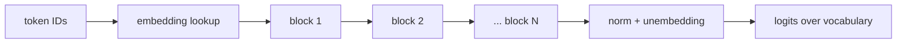

To predict the next token of "The checkout service returned 503 because the database connection pool was", a model has to combine information from positions far apart: "503", "database", "pool". It also has to do this for every position of every training document, trillions of times, which means the computation must run in parallel across positions. The architectures before 2017, recurrent networks, read one token at a time and squeezed everything seen so far into one fixed-size state vector. They were slow to train, because step $t$ had to wait for step $t - 1$, and they forgot: information from 500 tokens back had to survive 500 squeezes.

The **transformer** throws recurrence away. Every position looks directly at every earlier position through **attention**, a weighted average whose weights the model computes on the fly, and all positions are processed at once as matrix multiplications. This lesson walks through one transformer block with numbers you can check by hand. Every model family you will build on is a stack of variations on this block.

## The shape of the whole model

Token IDs from the [tokenizer](/learn/ai-and-llms/how-llms-work/tokenization) are turned into vectors by an embedding lookup, one row of a $V \times d$ table per token, where $d$ (the **model dimension**) is 4,096 in a typical 7B-class model. A sequence of $n$ tokens becomes an $n \times d$ matrix. That matrix passes through $N$ identical **blocks**, each of which maps $n \times d$ to $n \times d$: same shape in, same shape out. At the end, a final linear layer (the **unembedding**) turns each position's vector into $V$ scores, one per vocabulary entry, called **logits**.



Inside each block there are exactly two sub-layers: **attention**, the only place where positions exchange information, and an **MLP**, which transforms each position on its own. Everything else is plumbing that makes a stack of 32 or 80 of them trainable.

## Self-attention: queries, keys and values

Each position's vector $x$ is projected three ways by learned matrices:

- a **query** $q = x W_Q$: what this position is looking for,
- a **key** $k = x W_K$: what this position offers to others,
- a **value** $v = x W_V$: what it passes on if another position attends to it.

Position $i$ scores every position $j$ by the dot product $q_i \cdot k_j$, scaled by $\sqrt{d_k}$ (the query/key dimension). A softmax turns the scores into weights that are positive and sum to 1, and the output for position $i$ is the weighted average of the values:

$$\text{out}_i = \sum_j w_{ij}\, v_j, \qquad w_{ij} = \text{softmax}_j\!\left(\frac{q_i \cdot k_j}{\sqrt{d_k}}\right)$$

Think of it as a soft, differentiable dictionary lookup: the query is compared against every key, and instead of returning the single best match, attention returns a blend of values weighted by how well each key matched.

## Three tokens by hand

Take the sequence "the cat sat" with 2-dimensional embeddings. After multiplying by the three learned projection matrices, each token has:

| token | query $q$ | key $k$ | value $v$ |
|---|---|---|---|
| the | (0.27, 0.86) | (−0.07, 0.80) | (0.55, 0.80) |
| cat | (0.75, 0.14) | (0.71, 0.56) | (0.55, −0.10) |
| sat | (0.39, −0.70) | (0.68, −0.28) | (−0.05, −0.85) |

Compute the attention output for "sat", the last position, which may look at all three tokens.

1. **Scores.** $q_{\text{sat}} \cdot k_{\text{the}} = 0.39(-0.07) + (-0.70)(0.80) = -0.587$; with "cat", $0.277 - 0.392 = -0.115$; with "sat", $0.265 + 0.196 = 0.461$.
2. **Scale.** Divide by $\sqrt{d_k} = \sqrt{2} = 1.414$: $(-0.415, -0.081, 0.326)$.
3. **Softmax.** $e^{-0.415} = 0.660$, $e^{-0.081} = 0.922$, $e^{0.326} = 1.386$; they sum to 2.968, so the weights are $(0.222, 0.311, 0.467)$. "sat" attends most to itself, then to "cat".
4. **Weighted sum of values.** First component $0.222(0.55) + 0.311(0.55) + 0.467(-0.05) = 0.270$; second $0.222(0.80) + 0.311(-0.10) + 0.467(-0.85) = -0.250$.

The output for "sat" is $(0.27, -0.25)$: a new vector that mixes information from all three positions, in proportions the model chose. In a trained model, individual attention heads learn recognisable jobs, such as attending to the previous token, from a verb to its subject, from a closing bracket to its opening one, or from a variable's use to its definition.

```viz
{"type": "ml", "algorithm": "attention", "text": "the cat sat",
 "title": "Self-attention across three tokens",
 "caption": "Same embeddings and projections as the table above. Each row computes scores, softmax weights and a weighted sum of values; the last frame applies the causal mask."}
```

## Scaling and the causal mask

**Why divide by $\sqrt{d_k}$.** If the components of $q$ and $k$ are roughly independent with unit variance, their dot product is a sum of $d_k$ terms with variance $d_k$, so its typical size is $\sqrt{d_k}$. With $d_k = 128$, unscaled scores are routinely around ±11. A softmax over numbers that far apart is essentially one-hot: all weight on the largest score, near-zero gradients for everything else, and training stalls. Dividing by $\sqrt{d_k}$ brings scores back to unit scale.

**The causal mask.** A language model is trained to predict every next token of a document at once: position 1 predicts token 2, position 2 predicts token 3, all in one forward pass. That only works if position $i$ cannot peek at positions after $i$. The **causal mask** sets every score with $j > i$ to $-\infty$ before the softmax, which turns those weights into exactly 0. In the example, "cat" may only attend to "the" and itself; its weights become (0.40, 0.60) and its output (0.55, 0.26). One forward pass over a 4,000-token document therefore yields 4,000 training examples.

Stack all queries, keys and values into $n \times d_k$ matrices and attention for the whole sequence is one expression:

$$\text{Attention}(Q, K, V) = \text{softmax}\!\left(\frac{Q K^\top}{\sqrt{d_k}} + M\right) V$$

where $M$ holds $-\infty$ above the diagonal. $QK^\top$ is an $n \times n$ matrix, the reason long contexts are expensive ([Context windows and the KV cache](/learn/ai-and-llms/how-llms-work/context-windows-and-kv-cache)).

```python
import numpy as np

def softmax(z, axis=-1):
    z = z - z.max(axis=axis, keepdims=True)          # stability: exp never overflows
    e = np.exp(z)
    return e / e.sum(axis=axis, keepdims=True)

def causal_self_attention(X, Wq, Wk, Wv):
    Q, K, V = X @ Wq, X @ Wk, X @ Wv                 # each (n, d_k)
    scores = Q @ K.T / np.sqrt(K.shape[-1])          # (n, n)
    n = X.shape[0]
    future = np.triu(np.ones((n, n), dtype=bool), k=1)
    scores = np.where(future, -np.inf, scores)       # causal mask
    return softmax(scores) @ V                       # (n, d_k)

X  = np.array([[0.2, 0.9], [0.8, 0.3], [0.5, -0.6]])     # "the", "cat", "sat"
Wq = np.array([[0.9, -0.2], [0.1, 1.0]])
Wk = np.array([[1.0, 0.4], [-0.3, 0.8]])
Wv = np.array([[0.5, -0.5], [0.5, 1.0]])
causal_self_attention(X, Wq, Wk, Wv)
# [[0.55, 0.80], [0.55, 0.26], [0.27, -0.25]]
```

## Four dimensions, then two heads

Now the same three tokens in 4 dimensions, with queries, keys and values given directly (as they come out of the projections):

| token | $q$ | $k$ | $v$ |
|---|---|---|---|
| the | (1, 0, 1, 0) | (1, 0, 0, 1) | (1, 0, 0, 0) |
| cat | (2, 0, 0, 1) | (0, 1, 1, 0) | (0, 1, 0, 0) |
| sat | (0, 2, 1, 1) | (1, 1, 0, 0) | (0, 0, 1, 1) |

**One full-width head** ($d_k = 4$, so scale by $\sqrt{4} = 2$), with the causal mask:

| Row | Raw scores $q \cdot k$ | Scaled | Softmax weights | Output |
|---|---|---|---|---|
| the | (1) | (0.5) | (1.000) | (1, 0, 0, 0) |
| cat | (3, 0) | (1.5, 0) | (0.818, 0.182) | (0.818, 0.182, 0, 0) |
| sat | (1, 3, 2) | (0.5, 1.5, 1.0) | (0.186, 0.506, 0.307) | (0.186, 0.506, 0.307, 0.307) |

Check the "sat" row: $q_{\text{sat}} \cdot k_{\text{cat}} = 0 \cdot 0 + 2 \cdot 1 + 1 \cdot 1 + 1 \cdot 0 = 3$; $e^{0.5} + e^{1.5} + e^{1.0} = 1.649 + 4.482 + 2.718 = 8.849$; $4.482 / 8.849 = 0.506$.

**Two heads of 2 dimensions each.** Split every vector into dimensions 1–2 (head A) and 3–4 (head B); each head scales by $\sqrt{2}$ and runs its own softmax. For "sat":

| Head | $q$ slice | Raw scores vs the, cat, sat | Weights | Output slice |
|---|---|---|---|---|
| A (dims 1–2) | (0, 2) | (0, 2, 2) | (0.108, 0.446, 0.446) | (0.108, 0.446) |
| B (dims 3–4) | (1, 1) | (1, 1, 0) | (0.401, 0.401, 0.198) | (0.198, 0.198) |

Concatenated, "sat" gets $(0.108, 0.446, 0.198, 0.198)$, and an output projection $W_O$ ($d \times d$) then mixes the heads' contributions back together. The point is in the weights column: from the same tokens, head A spreads attention between "cat" and "sat" while head B favours "the" and "cat", and neither pattern equals the full-width head's. Each head chooses *where* to look independently, which one wide head cannot do. That is **multi-head attention**; a 7B-class model splits $d = 4{,}096$ into 32 heads of 128 dimensions each, at about the same compute as one full-width head.

## Grouped-query attention

During generation each layer caches every past token's keys and values ([Context windows and the KV cache](/learn/ai-and-llms/how-llms-work/context-windows-and-kv-cache)). **Grouped-query attention** (GQA) keeps all query heads but shares a smaller number of key/value heads among them. With 64 query heads and 8 KV heads, each KV head serves a group of 8 query heads: the cache shrinks by $64/8 = 8\times$, and $W_K$ and $W_V$ shrink from $d \times d$ to $d \times (8 \times 128)$. For a 70B-class shape ($d = 8{,}192$, 80 layers, SwiGLU MLP of width 28,672, 32,000-token vocabulary) that takes the parameter count from 78.4 billion with full multi-head attention to 69.0 billion with GQA, close to the published size of Meta's Llama 2 70B, which uses this configuration. Quality stays close to full multi-head attention; the extreme, one shared KV head, is **multi-query attention**.

## The MLP: where most parameters live

After attention, every position passes independently through a feed-forward network: expand from $d$ to about $4d$, apply a non-linearity, and project back to $d$. No information moves between positions here. With a plain two-matrix MLP that is $8d^2$ parameters against attention's $4d^2$; many recent models use a gated variant (**SwiGLU**) with three matrices of width about $\tfrac{8}{3}d$ (11,008 for $d = 4{,}096$), which keeps the count near $8d^2$. Either way the MLP is about two thirds of every block. Interpretability research suggests that much of what a model "knows" about the world is stored in these weights and retrieved by patterns in the residual stream, although the picture is far from complete.

A useful summary: **attention moves information between positions; the MLP transforms information within a position.**

## Residuals and normalisation: making 80 blocks trainable

Each sub-layer is wrapped the same way:

$$x \leftarrow x + \text{Attention}(\text{Norm}(x)), \qquad x \leftarrow x + \text{MLP}(\text{Norm}(x))$$

The **residual connection** means each sub-layer computes a correction that is added to the vector flowing through, the **residual stream**. Its derivative is $I + f'(x)$, so the gradient always has a path with factor 1 to the first block, the fix for vanishing gradients from [Neural networks](/learn/ai-and-llms/ml-foundations/neural-networks).

The **normalisation layer** rescales each token's vector before it enters a sub-layer. Work both common kinds on $x = (2, 0, -1, 3)$:

- **LayerNorm** subtracts the mean (1.0) and divides by the standard deviation ($\sqrt{2.5} = 1.581$): $(0.632, -0.632, -1.265, 1.265)$, then applies a learned per-dimension scale and shift.
- **RMSNorm** skips the mean and divides by the root mean square, $\sqrt{(4 + 0 + 1 + 9)/4} = 1.871$: $(1.069, 0, -0.535, 1.604)$, then a learned scale. One fewer reduction per token, which is why many recent models use it.

Placing the norm *before* each sub-layer ("pre-norm", as written above) trains more stably at depth than the original post-norm design, because the residual stream itself is never rescaled.

```viz
{"type": "ml", "algorithm": "transformer-block", "text": "the cat sat",
 "title": "One token through one transformer block",
 "caption": "Norm, attention, residual add, norm, MLP, residual add. The vector leaves in the same space it entered, ready for the next block."}
```

## Position: RoPE as a rotation

Nothing in the attention formula depends on where a token sits. Shuffle the inputs and every output is the same, shuffled: "dog bites man" and "man bites dog" would be indistinguishable. Older designs added a **learned absolute position embedding** or fixed **sinusoidal** waves to the token embedding. Many current families use **rotary position embeddings (RoPE)**: pair up the dimensions of each query and key as 2-D planes, and rotate the pair at position $m$ by angle $m\theta$.

Check the key property in one plane with $\theta = 0.5$ radians, $q = (1.0, 0.5)$ and $k = (0.8, -0.2)$ (unrotated dot product 0.70):

| Query position $m$ | Key position $n$ | Offset $m - n$ | Rotated dot product |
|---|---|---|---|
| 3 | 3 | 0 | 0.700 |
| 3 | 1 | 2 | −0.127 |
| 10 | 8 | 2 | −0.127 |
| 1 | 3 | −2 | 0.883 |

Positions 3 and 1 score exactly like positions 10 and 8: the result is $\lVert q \rVert \lVert k \rVert \cos(\phi + (m - n)\theta)$ with $\phi$ the angle between the unrotated vectors, so the score depends only on the **relative offset**. Each plane $i$ of a head with dimension $d_h$ rotates at its own rate $\theta_i = 10{,}000^{-2i/d_h}$: for $d_h = 128$ the fastest pair turns 1 radian per token (a full turn every 6.3 tokens) and the slowest $1.15 \times 10^{-4}$ radians per token (a full turn every 54,000 tokens), so fast planes resolve nearby order and slow ones distance. Rescaling those rates (interpolating positions) is one of the main tools for extending a trained model's context length.

## Counting parameters and compute

Per block, attention has $W_Q$ and $W_O$ at $d^2$ each and $W_K$, $W_V$ at $d \times (n_{kv} \cdot d_h)$ each; the SwiGLU MLP has $3 d\, d_{ff}$. Take a published 7B shape (Meta's Llama 2 7B: $d = 4{,}096$, 32 layers, 32 heads with no key/value sharing, $d_{ff} = 11{,}008$, a 32,000-token vocabulary, separate input and output embeddings):

1. Attention per layer: $4 \times 4{,}096^2 = 67.1$ million.
2. MLP per layer: $3 \times 4{,}096 \times 11{,}008 = 135.3$ million.
3. 32 layers: $32 \times 202.4\text{M} = 6.476$ billion.
4. Embedding and unembedding: $2 \times 32{,}000 \times 4{,}096 = 0.262$ billion.
5. Total: **6.738 billion**; adding the norm weights ($2d$ per layer plus $d$ at the end, 266,240 numbers) gives the published figure of about 6.74 billion.

The whiteboard shortcut is $12d^2$ per block plus embeddings: 6.44 billion plus 0.26. Every parameter participates in one multiply and one add per token, so a forward pass costs about $2 \times 6.74 = 13.5$ GFLOPs per token, plus the attention scores, about $4nd$ per layer for context length $n$. The two are equal when $4nd = 24d^2$, at $n = 6d = 24{,}576$ tokens for this shape: below that the weights dominate, above it attention does.

## Under the hood: FlashAttention and the online softmax

Materialising $QK^\top$ is the naive implementation's problem. At $n = 32{,}768$ with 32 heads in 16-bit, one layer's score matrices are $32{,}768^2 \times 32 \times 2 = 68.7$ GB, more than a GPU holds, and even when it fits, writing it to memory and reading it back dominates the time. **FlashAttention** (Dao and colleagues, 2022) never builds the matrix: it processes keys and values in tiles that fit in the GPU's on-chip memory and keeps, for each query, a running maximum $m$, a running denominator $\ell$ and a running output, rescaling them when a later tile brings a larger score.

Trace the online softmax on the "sat" scores $(-0.415, -0.081, 0.326)$ in two tiles. Tile 1 holds the first two: $m = -0.081$, $\ell = e^{-0.334} + e^{0} = 1.716$. Tile 2 brings 0.326, a new maximum: rescale the old sum by $e^{-0.081 - 0.326} = 0.666$ and add $e^0$: $\ell = 1.716 \times 0.666 + 1 = 2.142$. The weights $e^{s - 0.326}/2.142$ are $(0.222, 0.311, 0.467)$, identical to the one-shot softmax. The FLOPs are unchanged (still quadratic in $n$); what disappears is the $n \times n$ memory traffic, so memory becomes linear in $n$ and attention runs several times faster. Every serious inference and training stack uses a kernel of this kind.

## Choosing attention and position variants

| Variant | KV cache per token (relative) | Parameters in $W_K, W_V$ | Quality | Used for |
|---|---|---|---|---|
| Multi-head (MHA) | 1× | $2d^2$ per layer | reference | earlier and smaller models |
| Grouped-query (GQA, 8 KV heads of 64) | 1/8 | $2d^2/8$ | close to MHA | most large open models at the time of writing |
| Multi-query (MQA, 1 KV head) | 1/64 | $2d^2/64$ | measurably lower on some tasks | latency-critical serving |
| Sliding-window attention | fixed window, not the full context | unchanged | loses direct long-range access | long inputs, often mixed with full layers |

| Position scheme | Relative by construction | Beyond trained length | Extra parameters |
|---|---|---|---|
| Learned absolute | no | undefined | one vector per position |
| Sinusoidal | partly | degrades | none |
| RoPE | yes, via rotation | degrades; extendable by rescaling frequencies | none |

## Failure modes in production

**A training loss that is too good.** *Symptom:* a custom model's training loss drops to near zero within hours, and generation is gibberish. *Diagnosis:* the causal mask is missing or off by one, so each position can see the token it is predicting and learns to copy it. *Fix:* a unit test that changing token $t+1$ leaves the outputs at positions $\le t$ unchanged.

**Batched outputs differ from single outputs.** *Symptom:* the same prompt produces different text when served alone and in a batch. *Diagnosis:* padding tokens are being attended to because the attention mask for padding was not applied (or positions were not offset for left padding). *Fix:* pass the padding mask and correct position IDs; test that batch composition does not change a request's logits beyond numerical noise.

**NaNs in half precision.** *Symptom:* attention outputs become `NaN` on long or unusual inputs in fp16. *Diagnosis:* scores or intermediate sums overflow fp16's maximum of 65,504, or a softmax was computed without subtracting the maximum. *Fix:* bf16 (same exponent range as fp32), max-subtracted softmax, and fused kernels that accumulate in fp32.

**Quality collapses past a length.** *Symptom:* answers degrade sharply once prompts exceed some length, well inside the advertised limit or right at it. *Diagnosis:* positions beyond what the model was trained or extended to; RoPE angles it never saw. *Fix:* stay within the length the model was evaluated at, and measure quality at your real prompt lengths rather than trusting the maximum.

**Out of memory at long context.** *Symptom:* a custom attention implementation fails at 32k tokens that the model supports. *Diagnosis:* it materialises the $n \times n$ scores, 68.7 GB per layer at that length. *Fix:* use a FlashAttention-style kernel.

## Exercises

```exercise
id: single-query-attention
title: Attention for one query
prompt: |
  Implement scaled dot-product attention for a single query position.

  `q` is a list of d numbers. `keys` and `values` are lists of equal length n
  (n >= 1); each key has d numbers and each value has the same number of
  components m (m may differ from d). Return the output vector (m numbers):

  1. score_j = dot(q, keys[j]) / sqrt(d)
  2. weights = softmax(scores)
  3. output = sum over j of weights[j] * values[j]

  Scores can be large, so compute the softmax in a numerically stable way
  (subtract the maximum score before exponentiating). The caller has already
  applied any causal mask by passing only the visible keys and values.
  Return unrounded floats; results are compared to 6 decimal places.
languages: [python, javascript]
entry: attend
starter:
  python: |
    import math

    def attend(q, keys, values):
        # your code here
        return [0.0] * len(values[0])
  javascript: |
    function attend(q, keys, values) {
      // your code here
      return new Array(values[0].length).fill(0);
    }
tests:
  - args: [[0.39, -0.70], [[-0.07, 0.80], [0.71, 0.56], [0.68, -0.28]], [[0.55, 0.80], [0.55, -0.10], [-0.05, -0.85]]]
    expected: [0.269856, -0.24997]
    label: '"sat" attending over "the cat sat" (the worked example)'
  - args: [[1, 2], [[3, 4]], [[5, 6]]]
    expected: [5, 6]
    label: a single visible position returns its value
  - args: [[0, 0], [[1, 2], [3, 4]], [[1, 0], [0, 1]]]
    expected: [0.5, 0.5]
    label: equal scores average the values
  - args: [[2, 0], [[1, 0], [0, 1]], [[10], [0]]]
    expected: [8.044297]
    label: scores are divided by sqrt(d)
  - args: [[400, 400], [[1, 1], [2, 2]], [[1, 1], [3, 3]]]
    expected: [3, 3]
    hidden: true
    label: large scores need a numerically stable softmax
  - args: [[0.75, 0.14], [[-0.07, 0.80], [0.71, 0.56]], [[0.55, 0.80], [0.55, -0.10]]]
    expected: [0.55, 0.263368]
    hidden: true
    label: '"cat" under the causal mask sees only "the" and itself'
  - args: [[1, 0, -1], [[1, 1, 1], [1, 0, 0], [0, 0, 1], [2, 0, -2]], [[1, 0], [0, 1], [1, 1], [-1, 2]]]
    expected: [-0.634326, 1.676186]
    hidden: true
hints:
  - "d is len(q). Compute all n scores first, then take their maximum."
  - "exp(score - max) never overflows; dividing each by their sum gives the same weights as the naive softmax."
  - "The output has as many components as each value vector: output[c] = sum_j weights[j] * values[j][c]."
```

```exercise
id: transformer-params
title: Count a transformer's parameters
prompt: |
  Return the parameter count of a decoder-only transformer, ignoring norm
  weights and biases:

  - head_dim = d / n_heads (an integer)
  - attention per layer: W_Q and W_O are d x d each; W_K and W_V are
    d x (n_kv_heads * head_dim) each
  - MLP per layer (SwiGLU): three matrices of d x d_ff
  - embeddings: vocab x d for the input table, plus another vocab x d for
    the output (unembedding) matrix unless `tied` is true

  Return an integer. The first test is a published 7B shape; the second a
  70B shape with grouped-query attention.
languages: [python, javascript]
entry: transformer_params
starter:
  python: |
    def transformer_params(d, n_layers, n_heads, n_kv_heads, d_ff, vocab, tied):
        # your code here
        return 0
  javascript: |
    function transformer_params(d, n_layers, n_heads, n_kv_heads, d_ff, vocab, tied) {
      // your code here
      return 0;
    }
tests:
  - args: [4096, 32, 32, 32, 11008, 32000, false]
    expected: 6738149376
    label: a 7B shape with full multi-head attention
  - args: [8192, 80, 64, 8, 28672, 32000, false]
    expected: 68975329280
    label: a 70B shape with 8 key/value heads
  - args: [8192, 80, 64, 64, 28672, 32000, false]
    expected: 78370570240
    label: the same shape without key/value sharing
  - args: [4, 1, 2, 1, 8, 10, true]
    expected: 184
    label: a toy model with tied embeddings
  - args: [2048, 24, 16, 4, 5632, 100000, true]
    expected: 1286930432
    hidden: true
  - args: [64, 0, 4, 4, 256, 1000, false]
    expected: 128000
    hidden: true
    label: zero layers leaves only the embeddings
hints:
  - "Compute head_dim first; W_K and W_V are narrower than W_Q whenever n_kv_heads < n_heads."
  - "Per layer: 2*d*d + 2*d*n_kv_heads*head_dim + 3*d*d_ff. Multiply by n_layers, then add the embeddings once."
```

## Interviewer follow-ups

**"Why is attention quadratic, and what does FlashAttention change?"** *Model answer:* every position scores every earlier position, so the score matrix is $n \times n$ and the FLOPs grow as $n^2 d$; FlashAttention keeps the FLOPs but never materialises the matrix, tiling keys and values through on-chip memory with an online softmax, so memory is linear in $n$ and the kernel is no longer bound by reading and writing 68 GB per layer at 32k tokens. *Common wrong answer:* "FlashAttention makes attention linear", which confuses memory with compute.

**"What does grouped-query attention save, and what does it cost?"** *Model answer:* key/value heads are shared by groups of query heads, so the KV cache and the $W_K$, $W_V$ parameters shrink by the group factor (8× for 64 query and 8 KV heads, and 9.4 billion parameters on a 70B shape) at a small quality cost; it matters because decoding is limited by reading the KV cache. *Common wrong answer:* "it reduces attention FLOPs by 8×", when the query-side work is unchanged.

**"Count the parameters of a model with $d = 4{,}096$ and 32 layers."** *Model answer:* about $12d^2 = 201$ million per block, 6.44 billion for 32, plus $2Vd$ for untied embeddings (0.26 billion at 32,000 tokens): 6.7 billion, and I would adjust for GQA and the MLP width if given them. *Common wrong answer:* forgetting the MLP is two thirds of each block, or counting $d^2$ per head.

**"Why pre-norm rather than post-norm?"** *Model answer:* pre-norm leaves the residual stream untouched, so the identity path carries gradients cleanly through dozens of blocks; post-norm rescales the stream after each addition and needs careful warm-up to train deep stacks. *Common wrong answer:* "it is faster".

**"How does RoPE encode relative position?"** *Model answer:* it rotates each 2-D pair of query and key dimensions by an angle proportional to position; the dot product of a query rotated by $m\theta$ and a key rotated by $n\theta$ depends only on $(m - n)\theta$, as the table's identical scores at offsets (3, 1) and (10, 8) show. *Common wrong answer:* "it adds a position vector to the embedding".

## What mid-level engineers get wrong

- **Thinking attention is the whole model.** The MLP is two thirds of the parameters, and much of the stored knowledge.
- **Confusing heads with layers.** Heads run in parallel inside a layer on slices of $d$; layers are sequential.
- **Believing FlashAttention changes the complexity.** It changes memory traffic, not the $n^2$ FLOPs.
- **Forgetting padding and causal masks in custom code.** The resulting bugs look like quality problems.
- **Trusting the advertised context length.** Quality at your prompt lengths is an empirical question.
- **Counting parameters as $12d^2$ for every model.** GQA, SwiGLU widths and tied embeddings move the number by billions.

## Senior signals

- You can say in one sentence what attention computes: **each position takes a softmax-weighted average of value vectors, weighted by query-key similarity**, and it is the only place positions exchange information.
- You can compute attention by hand for a few tokens, explain the **$\sqrt{d_k}$ scaling** and the **causal mask**, and show why two heads can attend differently where one cannot.
- You connect architecture to operations: $QK^\top$ is $n \times n$, FlashAttention removes its memory traffic, and **GQA** shrinks the key/value memory that serving must hold.
- You can **count parameters** for a real configuration (reproducing 6.74 billion for a published 7B shape) and **FLOPs** ($\approx 2\times$ parameters per token, plus $4nd$ per layer for attention).
- You know residual connections and pre-norm are what make **deep stacks trainable**, and that RoPE encodes **relative position** by rotation and is the lever for context extension.

## Check yourself

```quiz
- q: >-
    In one attention head, the scores for a query against three keys are (2.0, 2.0, 2.0) after scaling. What is the output?
  options: ["The average of the three value vectors", "The value vector of the first key", "The sum of the three value vectors", "A zero vector, since no key stands out"]
  answer: 0
  explanation: >-
    Equal scores give equal softmax weights of 1/3 each, so the output is the plain average of the values. Softmax weights are positive and always sum to 1, so a sum of the values or a zero vector is impossible, even when no key stands out.
- q: >-
    Why are query-key dot products divided by the square root of the head dimension?
  options: ["To normalise the value vectors to unit length before mixing them", "To stop scores growing with d and saturating the softmax", "To reduce the memory the attention matrix needs for long inputs", "To keep the attention matrix symmetric between queries and keys"]
  answer: 1
  explanation: >-
    With unit-variance components, a dot product over d terms has standard deviation of about the square root of d, and large scores saturate the softmax into near one-hot weights with vanishing gradients. Scaling keeps scores near unit size so the softmax stays soft and trainable. It changes neither symmetry nor memory, and values are not normalised by it.
- q: >-
    A custom transformer's training loss falls to almost zero within hours, but its generated text is gibberish. What is the most likely bug?
  options: ["The vocabulary is too small for the training corpus", "The learning rate is far too high for a model of this size", "The residual connections were removed from each block", "The causal mask lets each position see the token it predicts"]
  answer: 3
  explanation: >-
    Without a correct causal mask, position i can attend to token i + 1 and copy it, so the training loss collapses while nothing useful is learned; at generation time there is no future token to copy. A high learning rate makes the loss unstable rather than near zero, and missing residuals make deep models hard to train, not suspiciously easy.
- q: >-
    A model has 64 query heads and 8 key/value heads (grouped-query attention). Compared with full multi-head attention, what shrinks by 8 times?
  options: ["The MLP width and the model dimension d", "The key/value cache and the W_K, W_V matrices", "The attention FLOPs for every query head", "The number of query heads the model evaluates"]
  answer: 1
  explanation: >-
    Each key/value head serves a group of 8 query heads, so only 8 heads' keys and values are projected and cached per token: the cache and the W_K, W_V parameters fall by 64/8 = 8. All 64 query heads still compute their scores, so query-side FLOPs are essentially unchanged, and the MLP and d are unaffected.
- q: >-
    With RoPE, a query at position 3 and a key at position 1 give a score of −0.127. What score does the same query and key content give at positions 10 and 8?
  options: ["0.883, since the rotation direction reverses after position 8", "A different value, since absolute position shifts the angle", "−0.127, since only the offset of 2 matters", "0.700, since rotation cancels out at larger positions"]
  answer: 2
  explanation: >-
    RoPE rotates the query by mθ and the key by nθ, so their dot product depends on (m − n)θ only; positions (3, 1) and (10, 8) share the offset 2 and give the same score. 0.700 is the unrotated (offset 0) score, and 0.883 is the score at offset −2, where the key comes after the query.
- q: >-
    A model has d = 4,096 and 32 blocks. Roughly how many parameters are in the blocks, excluding embeddings?
  options: ["About 0.5 billion", "About 6.4 billion", "About 1.6 billion", "About 50 billion"]
  answer: 1
  explanation: >-
    Each block has about 12d² parameters: 4d² for the attention projections and 8d² for the MLP. 12 × 4,096² is about 201 million, times 32 blocks is about 6.4 billion. Add roughly 0.26 billion for embeddings and you get a 7B-class model.
```
