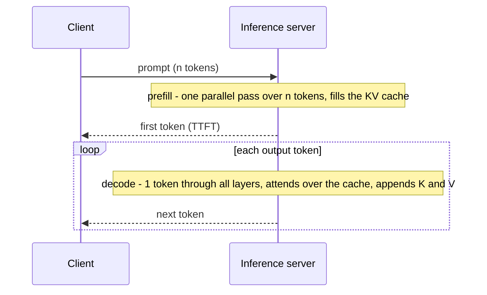

A support assistant sails through testing. In production, conversations run to 40 turns, and three things go wrong at once. The first word of each reply takes six seconds to appear. The GPU fleet that was sized for 2,000 concurrent users tops out at 600. And the model ignores a clause on page 47 of a 90-page contract that a customer pasted in, although the clause is plainly there. None of these is a bug in your code. They are direct consequences of how a transformer processes its context, and each one has a number attached that a senior engineer can estimate before launch.

## What the context window is

The **context** is every token the model conditions on in one call: system prompt, tool definitions, conversation history, retrieved documents, tool results, and the output generated so far. The model keeps nothing between calls. A chat that "remembers" the first message is re-sending the first message every turn. The **context window** is the maximum number of tokens (input plus output) the model can handle in one call, set by how it was trained and served.

A bigger window lets you send more, but every token you send is processed on every call, and the costs are not linear.

## Why attention is quadratic

In [The transformer](/learn/ai-and-llms/how-llms-work/the-transformer), attention computes $QK^\top$: every position scored against every other, $n^2$ scores per head per layer.

| Context $n$ | Scores per head per layer | For 32 heads × 32 layers |
|---|---|---|
| 4,096 | 16.8 million | 17 billion |
| 32,768 | 1.07 billion | 1.1 trillion |
| 131,072 | 17.2 billion | 17.6 trillion |

Multiplying the context by 32 (4k to 128k) multiplies the attention work by 1,024.

Compare that with the rest of the model. The weight matrix multiplications in one layer cost about $24 n d^2$ FLOPs for $n$ tokens (the $12d^2$ parameters, times 2 FLOPs each, per token), which grows linearly. Attention's scores and weighted sums cost about $4 n^2 d$. The two are equal when $n = 6d$: for a 7B-class model with $d = 4{,}096$, at about **25,000 tokens**. Below that, a request's cost is dominated by the weights and grows roughly linearly with length; above it, attention takes over and cost grows with the square.

Memory is the other half. Materialising the attention matrix for 128k tokens in 16-bit would take $131{,}072^2 \times 2$ bytes $= 32$ GiB, for one head of one layer. No production system does that. **FlashAttention** computes attention in tiles that fit in the GPU's fast on-chip memory, combining partial softmaxes as it goes, so the full $n \times n$ matrix never exists. It is exact, not an approximation. Memory becomes linear in $n$ and it runs much faster because it avoids round trips to the GPU's main memory, but the compute is still quadratic.

## Two phases: prefill and decode

Serving a request has two phases with completely different performance characteristics.

**Prefill** processes the whole prompt in one parallel forward pass. Every prompt token goes through every layer at once as large matrix multiplications, which keeps the GPU's arithmetic units busy: prefill is **compute-bound**. It determines **time to first token** (TTFT), and it grows with prompt length, faster than linearly once attention dominates. A 70B-class model needs about $2 \times 70 \times 10^9 = 140$ GFLOPs per prompt token for the weights alone, so a 100,000-token prompt is about $1.4 \times 10^{16}$ FLOPs before attention, several seconds even spread across a server of GPUs. That was the six-second first word.

**Decode** then generates tokens one at a time, as in [Generation and sampling](/learn/ai-and-llms/how-llms-work/generation-and-sampling). Each step does very little arithmetic (one token's worth) but must read every weight of the model, plus the stored keys and values of every previous token, from GPU memory. Decode is **memory-bandwidth-bound**. It determines the time between output tokens, and it is where the KV cache lives.



## The KV cache

When the model generates token $t$, attention at every layer needs the keys and values of all tokens $1 \ldots t-1$. Because of the causal mask, those keys and values never change once computed: a token's representation at layer $\ell$ depends only on tokens at or before it. So the server computes them once and keeps them. Each decode step computes $q$, $k$ and $v$ for the new token only, appends $k$ and $v$ to the cache, and attends over the cache.

Without the cache, step $t$ would recompute keys and values for all $t$ tokens, and generating $n$ tokens would cost $1 + 2 + \dots + n = O(n^2)$ key/value computations. With it, the cost is $O(n)$. Watch the two counters diverge:

```viz
{"type": "ml", "algorithm": "kv-cache", "text": "The cat sat",
 "title": "Prefill, then decode with a KV cache",
 "caption": "Prefill stores keys and values for the prompt. Each decode step computes one new pair and attends over everything cached. The no-cache counter grows quadratically."}
```

The cache trades compute for memory, and the memory is large.

### How big is the KV cache?

For every token, every layer stores one key and one value vector per key/value head:

$$\text{bytes per token} = 2 \times \text{layers} \times \text{kv\_heads} \times \text{head\_dim} \times \text{bytes per value}$$

| Model shape | Per token | 4k tokens | 32k tokens | 128k tokens |
|---|---|---|---|---|
| 7B-class, 32 layers, 32 KV heads × 128, fp16 | 512 KiB | 2 GiB | 16 GiB | 64 GiB |
| Same, with GQA (8 KV heads) | 128 KiB | 0.5 GiB | 4 GiB | 16 GiB |
| 70B-class, 80 layers, 8 KV heads × 128, fp16 | 320 KiB | 1.25 GiB | 10 GiB | 40 GiB |
| 70B-class if it used 64 KV heads | 2.5 MiB | 10 GiB | 80 GiB | 320 GiB |

Work the first row: $2 \times 32 \times 32 \times 128 \times 2 = 524{,}288$ bytes, half a mebibyte, for *every token of every active sequence*. A single 128k-token conversation on that model needs more cache than the model's own weights (about 13 GiB). The last row is why large models use **grouped-query attention**: sharing each key/value head across 8 query heads cuts the cache by 8× with little quality loss. Without it, long context on a 70B-class model would be impractical.

### Capacity planning: memory decides concurrency

GPU memory holds the weights, the KV cache and some working space. Whatever remains after the weights is shared by the caches of all sequences being decoded together, so **KV-cache size decides how many requests one GPU can serve at once**, and concurrency is what makes serving affordable (the next lesson explains why batching is nearly free during decode).

Take one 80 GiB GPU serving the 7B-class model, with 14 GiB of weights, so 66 GiB for cache:

- With full multi-head attention at 4k tokens per sequence (2 GiB each): 33 concurrent sequences.
- With GQA at 8 KV heads (0.5 GiB each): 132.
- With GQA and an 8-bit cache: 264.
- With GQA but 128k-token sequences (16 GiB each): 4.

That last line explains the fleet that topped out at 600 users instead of 2,000: the conversations were longer than the capacity model assumed. Per-request context length is a capacity parameter, not just a product feature.

Serving stacks manage this memory aggressively. **Paged attention**, popularised by the vLLM project, allocates the cache in fixed-size blocks, like pages of virtual memory, instead of reserving one contiguous buffer per request sized for the maximum length, which eliminates most fragmentation and lets requests with a common prefix share blocks. **KV-cache quantisation** stores keys and values in 8 bits (or fewer) instead of 16. Idle conversations' caches can be evicted or moved to CPU memory and restored later.

## Prompt caching: reusing prefill across requests

If thousands of requests start with the same 6,000-token system prompt and tool definitions, recomputing their keys and values on every request is pure waste. **Prompt caching** (also called prefix caching) keeps the KV cache for a prefix after one request and reuses it for later requests that begin with exactly the same tokens. The cached portion skips prefill, so TTFT drops, and hosted providers bill cached input tokens at a steep discount.

The mechanism dictates how you must structure prompts:

- It matches **exact token prefixes from the start** of the request. One changed token invalidates everything after it.
- So put **static content first** (system prompt, tool definitions, reference documents, few-shot examples) and variable content last (the user's message).
- Classic ways to defeat it: a timestamp or request ID at the top of the system prompt, tool definitions serialised in a non-deterministic order, per-user personalisation in the first paragraph.
- Caches expire after a period of inactivity (minutes, typically), and providers differ on whether caching is automatic or needs explicit markers and a minimum prefix length. Check the usage fields in responses to confirm you are actually getting cache hits.

## Long context: what the tricks buy

Models are trained at some context length and extended beyond it with a handful of techniques:

- **Position scaling.** Rotary position embeddings are stretched (their frequencies rescaled) so longer sequences map onto the range of angles seen in training, followed by fine-tuning on long documents.
- **Local attention.** Some layers attend only to a sliding window of recent tokens, which caps their KV cache; information from further back must be carried forward through other layers.
- **Sub-quadratic variants.** Sparse attention patterns, linear-attention approximations and hybrids with state-space layers reduce the $n^2$ term, usually with some quality trade-off on tasks that need precise long-range retrieval.
- **Sequence parallelism.** For very long inputs, the sequence itself is split across GPUs, which exchange keys and values in a ring.

The advertised window is not the same as the **effective** window. Models tend to use information at the beginning and end of a long context more reliably than information in the middle, get worse as irrelevant material is added, and find it harder to combine several facts spread far apart than to retrieve one. "Needle in a haystack" tests, which plant one sentence in filler text, are the easy case. That was the ignored clause on page 47. If your feature depends on long context, measure it on your own documents and questions.

## Spending the context budget

Because a chat resends its history, a conversation's total billed input grows quadratically with its length. If each turn adds 500 tokens, turn $k$ sends about $500k$ tokens, and 20 turns bill $500 \times (1 + 2 + \dots + 20) = 105{,}000$ input tokens for 10,000 tokens of actual conversation. Prompt caching reduces the cost of the repeated prefix but not the attention work or the memory.

Practical rules that follow from the mechanism:

- **Retrieve rather than stuff.** Send the three relevant passages, not the whole manual; see [Retrieval-augmented generation](/learn/ai-and-llms/building-with-llms/retrieval-augmented-generation).
- **Compact history.** Summarise or drop old turns and old tool results once they stop mattering.
- **Trim tool output.** A tool that returns 8,000 tokens of JSON when the model needs three fields pays for those tokens on every later turn.
- **Place critical instructions where they are used best**: at the start, and repeated briefly near the end of very long inputs.
- **Keep the prefix stable** so prompt caching works.

## Exercise

```exercise
id: kv-cache-capacity
title: How many sequences fit on the GPU?
prompt: |
  Implement `max_batch(gpu_gib, weights_gib, layers, kv_heads, head_dim,
  bytes_per_value, seq_len)`: the maximum number of sequences of `seq_len`
  tokens whose KV caches fit on one GPU alongside the model weights.

  - KV bytes per token = 2 * layers * kv_heads * head_dim * bytes_per_value
    (the 2 is one key and one value)
  - bytes per sequence = KV bytes per token * seq_len
  - free bytes = (gpu_gib - weights_gib) * 2^30
  - answer = the whole number of sequences that fit in the free bytes

  Ignore activations and other overhead. If the weights alone do not fit, return 0.
  All inputs are non-negative integers and the result is an integer.
languages: [python, javascript]
entry: max_batch
starter:
  python: |
    def max_batch(gpu_gib, weights_gib, layers, kv_heads, head_dim, bytes_per_value, seq_len):
        # your code here
        return 0
  javascript: |
    function max_batch(gpu_gib, weights_gib, layers, kv_heads, head_dim, bytes_per_value, seq_len) {
      // your code here
      return 0;
    }
tests:
  - args: [80, 14, 32, 32, 128, 2, 4096]
    expected: 33
    label: 7B-class, full multi-head attention, 4k context
  - args: [80, 14, 32, 8, 128, 2, 4096]
    expected: 132
    label: grouped-query attention with 8 KV heads
  - args: [80, 140, 80, 8, 128, 2, 4096]
    expected: 0
    label: 70B-class fp16 weights do not fit on one 80 GiB GPU
  - args: [320, 131, 80, 8, 128, 2, 32768]
    expected: 18
    label: 70B-class across 4 GPUs at 32k context
  - args: [80, 14, 32, 32, 128, 1, 4096]
    expected: 66
    hidden: true
    label: an 8-bit KV cache doubles capacity
  - args: [16, 0, 32, 32, 128, 2, 4096]
    expected: 8
    hidden: true
    label: an exact fit
  - args: [80, 14, 32, 8, 128, 2, 131072]
    expected: 4
    hidden: true
    label: 128k-token sequences
hints:
  - "Per token for the first test: 2 * 32 * 32 * 128 * 2 = 524,288 bytes; per 4,096-token sequence that is exactly 2 GiB."
  - "Use integer floor division (`//` in Python, `Math.floor` in JavaScript) and guard against the weights exceeding GPU memory."
```

## Senior signals

- You separate **prefill (compute-bound, sets time to first token)** from **decode (memory-bandwidth-bound, sets time per output token)** and know which one a given latency complaint is about.
- You can compute **KV-cache bytes per token** from a model's shape and turn it into **concurrent sequences per GPU**, and you treat context length as a capacity-planning input.
- You know attention's cost overtakes the weights' at around **$n = 6d$ tokens**, and that FlashAttention fixes memory, not the quadratic compute.
- You structure prompts for **prefix caching**: static first, variable last, nothing volatile at the top, and you verify hits in the usage data.
- You distinguish **advertised from effective context**, test long-context features on your own data, and prefer retrieval and compaction to stuffing.
- You can explain why chat cost grows **quadratically with conversation length** and what to do about it.

## Check yourself

```quiz
- q: >-
    A request's context grows from 4k to 128k tokens. By roughly what factor does the number of attention scores per layer grow?
  options: ["1×, since FlashAttention keeps it flat", "About 180×, since it grows as n^1.5", "32×, since it is linear in length", "1,024×, since it grows as n squared"]
  answer: 3
  explanation: >-
    Scores scale with n², and (128k / 4k)² = 32² = 1,024. The weight matmuls grow only 32×, which is the tempting linear answer. FlashAttention avoids storing the n × n matrix but still computes every score, so the compute stays quadratic.
- q: >-
    Users complain that responses take 6 seconds before the first word appears, then stream quickly. Which phase is the bottleneck and what helps most?
  options: ["Decode of each token; lower the temperature to speed sampling", "Tokenization of the prompt; switch to a faster tokenizer", "Prefill of a long prompt; shorten or cache the prompt prefix", "Decode of the output; lower max_tokens to cut generation"]
  answer: 2
  explanation: >-
    Time to first token is dominated by prefill, which processes the whole prompt and grows with its length. Shrinking the prompt or reusing a cached prefix cuts it. max_tokens and temperature affect decode, which is already fast here.
- q: >-
    A 7B-class model has 32 layers and 32 key/value heads of dimension 128, stored in fp16. How much KV cache does one 4,096-token sequence need?
  options: ["64 MiB", "2 GiB", "512 MiB", "16 GiB"]
  answer: 1
  explanation: >-
    Per token: 2 × 32 × 32 × 128 × 2 bytes = 524,288 bytes = 0.5 MiB. Times 4,096 tokens gives 2 GiB. 512 MiB is the figure with 8 KV heads (GQA), and 16 GiB is the figure at 32k tokens.
- q: >-
    Your system prompt starts with "Current time: 2026-09-26T14:03:11Z" followed by 5,000 tokens of fixed instructions and tools. Prompt caching shows almost no hits. Why?
  options: ["Prompt caching only applies to prompts under 1,000 tokens", "Cache hits require temperature 0, which the request does not set", "Caches match exact prefixes, and the timestamp changes every call", "Timestamps become special tokens that the cache always skips"]
  answer: 2
  explanation: >-
    Prefix caching reuses KV entries only for an identical token prefix from the first token. A value that changes on every request at the very start invalidates the entire prompt after it, so nothing can be reused. Move volatile content to the end, after the static instructions and tools. Providers set a minimum prefix length, not a maximum, and sampling settings do not affect prefill.
- q: >-
    Switching a model from 32 key/value heads to 8 (grouped-query attention) while keeping 32 query heads mainly improves which serving metric?
  options: ["Vocabulary size, by 4×, so each word needs fewer tokens", "The maximum context the model was trained on, by 4×", "Prefill FLOPs per token, by 4×, and so time to first token", "KV-cache memory per token, by 4×, and so sequences per GPU"]
  answer: 3
  explanation: >-
    GQA shares each key/value head across several query heads, so the cache stores a quarter as many key and value vectors. That multiplies how many concurrent sequences fit alongside the weights, which drives throughput. Query-side compute, and so prefill FLOPs, is largely unchanged, and vocabulary and training context length are separate properties.
```
