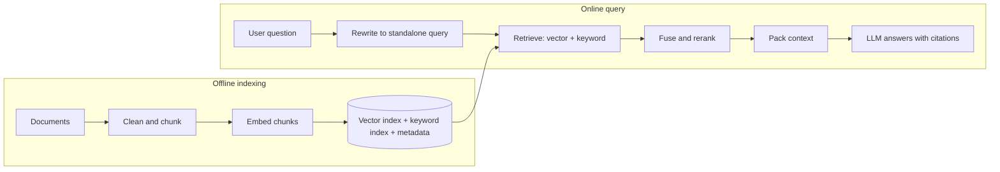

A support assistant has to answer questions from 12,000 help-centre articles that change every week. The model has never seen them, or saw a stale copy during pretraining. Fine-tuning them in takes days, has to be redone on every change, and still cannot tell the user which article an answer came from. Putting everything in the prompt is not an option either: at an average of 750 tokens per article the corpus is 9 million tokens, far beyond any context window, and would cost dollars per question even if it fitted.

Retrieval-augmented generation (RAG) is the standard answer: at query time, find the handful of passages most likely to contain the answer and put only those in the prompt. The model then answers from text it can see and cite, and updating knowledge means updating an index rather than a model. The idea fits in a sentence. Almost all of the engineering, and almost all of the failures, sit in the retrieval half, so this lesson traces that half on concrete data at every stage.

## The pipeline

RAG has an offline half that builds an index and an online half that answers queries.



Step through the online half:

```viz
{"type": "ml", "algorithm": "rag-pipeline", "text": "What is the refund window?", "k": 2,
 "title": "One RAG query end to end",
 "caption": "The query is embedded with the same model as the chunks, the nearest chunks are retrieved, and the prompt carries them with their ids so the answer can cite a source."}
```

Two details are easy to miss. The query must be embedded with *the same model* that embedded the chunks, or the two sets of vectors live in unrelated spaces. And in a conversation the raw user message is often not a searchable query: "what about for EU customers?" means nothing without the previous turn, so production pipelines first ask a small, fast model to rewrite the latest message into a standalone query ("refund window for EU customers") using the chat history.

## Chunking: the decision that caps everything downstream

You cannot embed whole documents usefully. Embedding models have input limits, and one vector for a 20-page article averages every topic in it into a blur. So documents are split into chunks, each with its own vector. The chunk is also the unit that lands in the prompt, so chunking decides both what can be *found* and what the model *sees*.

### Four chunkers on one document

Here is a 101-word policy page (words stand in for tokens; English runs at roughly 0.75 words per token):

```text
# Returns policy
## Standard returns
You can return most items within 30 days of delivery for a full refund. Items must be
unused and in their original packaging. Start a return from the Orders page and print
the prepaid label.
## Electronics
Headphones, speakers and other electronics can be returned within 14 days of delivery
if the seal is unbroken. Opened electronics are refunded minus a 15% restocking fee.
## EU customers
Customers in the EU may withdraw from any online purchase within 14 days without giving
a reason. Refunds are issued within 14 days of receiving the returned item.
```

Two questions users ask: "How long do I have to return headphones?" (the answer sentence is words 43–60) and "Can EU customers return things without a reason?" (words 73–89). Four chunkers, computed:

| Chunker | Chunks | Headphones sentence | EU sentence | What each chunk is about |
|---|---|---|---|---|
| Fixed 20 words, no overlap | 6 (the last is the single word "item.") | Split across chunks 3 and 4 | Split across chunks 4 and 5 | Fragments; no chunk answers either question |
| Fixed 40, no overlap | 3 | Whole, in chunk 2 (words 40–79) | Split across chunks 2 and 3 at "withdraw from / any online purchase" | Chunk 2 mixes the end of standard returns, all of electronics and half the EU rule |
| Fixed 40, overlap 10 | 4 (+33%) | Whole, in chunk 2 (words 30–69) | Whole, in chunk 3 (words 60–99) | Each answer survives in one chunk; topics still mixed |
| Structure-aware (one per section, heading path prefixed) | 3 | Whole, in "Returns policy > Electronics" | Whole, in "Returns policy > EU customers" | One topic per chunk; each chunk says where it sits |

Read off the table: small fixed windows destroy answers, overlap rescues boundary sentences at a predictable cost, and splitting on the document's own structure gets both answers intact with fewer chunks. The 20-word chunker also ends with a one-word chunk, "item.", a fragment that will never match a query well; merging a short tail into its predecessor is a common refinement. The first exercise implements the fixed-window baseline, including the off-by-one that makes naive loops emit a tail chunk already contained in the previous one.

The size trade-off in general:

| Chunk size | Retrieval behaviour | Generation behaviour |
|---|---|---|
| Small (100–200 tokens) | Precise vectors; a match is about one thing | Answers lack surrounding context; more chunks needed per answer |
| Medium (300–600 tokens) | The common default | Enough context for most factual questions |
| Large (1,000+ tokens) | Vectors blur several topics; precision drops | Fewer, richer chunks; more tokens per query |

**Overlap costs arithmetic.** With chunk size $s$ and overlap $o$ the stride is $s - o$, so the chunk count grows by a factor of about $s / (s - o)$. For the 9-million-token corpus, 400-token chunks without overlap give 22,500 vectors; with 80 tokens of overlap the stride is 320 and you get about 28,100, 25% more storage and embedding cost for boundary protection.

Better chunkers follow the document's own structure: split on headings, then paragraphs, then sentences, falling back to token windows only for oversized paragraphs; never split a table row, a code block or a numbered procedure; and **prepend context**, so that "It must be submitted within 30 days" becomes "Returns policy > EU customers > Refund window: It must be submitted within 30 days" before it is embedded. Some teams go further and have a small model write a one-sentence summary of where each chunk sits in its document, one cheap call per chunk at index time.

## Embedding and retrieval, traced for one query

An embedding model maps text to a vector (typically 384 to 3,072 dimensions) so that texts with similar meaning land close together. [Embeddings and similarity](/learn/ai-and-llms/ml-foundations/embeddings-and-similarity) covers how they are learned. To trace retrieval by hand, pretend the model uses five human-readable dimensions (returns, time limit, electronics, EU law, shipping). Real dimensions have no such labels; the arithmetic is the same.

| Chunk | Vector | Length | Cosine with the query |
|---|---|---|---|
| policy#electronics | [0.6, 0.5, 0.9, 0.0, 0.0] | 1.192 | **0.990** |
| warranty#2yr | [0.2, 0.4, 0.6, 0.3, 0.0] | 0.806 | 0.874 |
| policy#standard | [0.8, 0.5, 0.0, 0.0, 0.3] | 0.990 | 0.712 |
| policy#eu | [0.6, 0.6, 0.0, 0.9, 0.0] | 1.237 | 0.517 |
| shipping#times | [0.0, 0.6, 0.0, 0.0, 0.9] | 1.082 | 0.273 |

The query "How long do I have to return headphones?" embeds to $q = [0.7, 0.6, 0.8, 0, 0]$, length 1.221. For the electronics chunk, $q \cdot v = 0.7 \times 0.6 + 0.6 \times 0.5 + 0.8 \times 0.9 = 1.44$, and cosine $= 1.44 / (1.221 \times 1.192) = 0.990$. Two things to notice. The second-best chunk is the *warranty* page, at 0.874, because it is about electronics and time; similarity measures topical closeness, not whether a passage answers the question, which is the gap reranking closes. And if every vector is normalised to unit length at index time, cosine becomes a plain dot product, which is what vector indexes compute fastest.

```viz
{"type": "ml", "algorithm": "embeddings-similarity", "text": "king queen man woman apple banana",
 "title": "Cosine similarity compares direction, not length",
 "caption": "Related words point the same way. Retrieval ranks chunks by exactly this score against the query vector."}
```

Operational facts that matter more than the choice of model:

- **Some models are asymmetric**: they expect a different prefix or mode for queries and for documents. Using the document mode for queries silently costs recall.
- **Changing the embedding model means re-embedding everything.** Vectors from two models are not comparable. Version the index, build the new one alongside the old, switch reads when it is complete, then delete the old one.
- **Embeddings are weak on exact tokens.** Error codes, SKUs, version numbers and surnames carry little semantic signal, which is why keyword search stays in the pipeline.

## Under the hood: approximate nearest-neighbour search

Exact search compares the query with every vector. For 28,000 chunks of 1,024 dimensions that is about 29 million multiply-adds over 115 MB of floats: a few milliseconds, and many RAG systems never need anything cleverer; `pgvector` inside an existing Postgres handles them. At 10 million chunks the same scan streams 10M × 1,024 × 4 bytes ≈ 41 GB through memory per query, on the order of a second on one machine at tens of gigabytes per second of memory bandwidth.

Approximate nearest-neighbour (ANN) indexes trade a little recall for orders of magnitude less work. The most widely used, **HNSW** (hierarchical navigable small world), is a layered graph: each vector links to its near neighbours, and a few vectors are promoted to sparse upper layers that act as express lanes. A search starts at the top, greedily walks toward the query, drops a layer and repeats, touching a few thousand vectors instead of ten million.

```viz
{"type": "ml", "algorithm": "vector-search-hnsw", "query": [7.2, 3.1],
 "title": "HNSW: greedy descent through a layered graph",
 "caption": "Upper layers cover long distances in a few hops; the bottom layer refines. The search visits a small fraction of the points, and can occasionally miss the true nearest one."}
```

The knobs trade recall for cost: a larger search beam (`ef_search` in most implementations) visits more nodes, raising recall and latency; more links per node (`M`) improves recall at the price of memory and build time. HNSW keeps full-precision vectors plus graph links in RAM, so at large scale teams add compression (product quantisation) or partition-based indexes (IVF) that search only the clusters nearest the query; [Vector search internals](/learn/ai-and-llms/ml-foundations/vector-search-internals) works through all three with their recall, latency and memory trade-offs.

**Filtering is where ANN gets subtle.** Real queries carry constraints: this tenant, this product version, documents this user may read. Retrieve the top 10 and *then* filter to a tenant that owns 1% of the corpus, and you expect about 0.1 surviving results. You need an index that filters during the search, a separate index per large tenant, or a much larger candidate set before filtering. When the filter is an access-control rule, it must be applied at retrieval time and never left to the prompt ([LLM security](/learn/ai-and-llms/building-with-llms/llm-security)).

## Under the hood: BM25 and the inverted index

Keyword search keeps an **inverted index**: for each term, the list of documents containing it and how often. A query touches only the lists of its own terms, so a rare term such as "E4012", with a list of two documents, costs almost nothing. **BM25**, the ranking function behind Lucene, Elasticsearch and OpenSearch ([Search engines](/learn/databases/nosql-and-specialised/search-engines)), scores document $d$ for query terms $t$:

$$\text{BM25}(d) = \sum_{t} \text{idf}(t) \cdot \frac{\text{tf}(t,d)\,(k_1 + 1)}{\text{tf}(t,d) + k_1\left(1 - b + b\,\frac{|d|}{\text{avgdl}}\right)}, \qquad \text{idf}(t) = \ln\!\left(1 + \frac{N - n_t + 0.5}{n_t + 0.5}\right)$$

with the usual defaults $k_1 = 1.2$ and $b = 0.75$. Run it on five help articles for the query "error E4012 when exporting invoices" (after lowercasing and stemming: `error`, `e4012`, `when`, `export`, `invoice`). $N = 5$, and the average document is 20.8 tokens long.

| Term | Documents containing it | idf |
|---|---|---|
| `e4012` | 2 (kb-17, kb-88) | ln(1 + 3.5/2.5) = 0.875 |
| `error` | 2 | 0.875 |
| `invoice` | 2 | 0.875 |
| `export` | 4 | ln(1 + 1.5/4.5) = 0.288 |
| `when` | 0 | contributes nothing |

For kb-17 ("Error E4012 means an export exceeded 10,000 rows...", 20 tokens, `error` twice): the length factor is $0.25 + 0.75 \times 20/20.8 = 0.971$, so the `error` term scores $0.875 \times 2 \times 2.2 / (2 + 1.2 \times 0.971) = 1.217$. Summing each document's terms gives kb-17 2.834, kb-03 "Exporting invoices" 1.772, kb-88 "Error code index" 1.671, kb-41 "Invoice settings" 1.463, kb-52 "Exporting reports" 0.456. Two design choices are visible in the formula. **Term frequency saturates**: at average length a term seen once scores 1.0 × idf, twice 1.375, four times 1.692, and never more than $k_1 + 1 = 2.2$, so repeating a keyword cannot win on its own. **Length is normalised**: kb-88 mentions both rare terms but is a long list of codes, so $b$ pushes it below the shorter invoice article.

## Hybrid search with reciprocal rank fusion

The same query through vector search returns general articles about exporting invoices first, because the embedding captured the topic and all but ignored the code: kb-03 (0.83), kb-41 (0.79), then kb-17 (0.74) (illustrative scores). BM25 put kb-17 first. Each retriever catches what the other misses, so production systems run both and fuse the results.

The scores are incomparable: a BM25 score of 2.8 and a cosine of 0.83 are on different, query-dependent scales. **Reciprocal rank fusion** (RRF) uses only ranks:

$$\text{RRF}(d) = \sum_{\text{lists } L} \frac{1}{k + \text{rank}_L(d)}$$

Ranks start at 1, a document missing from a list contributes nothing for that list, and $k = 60$, the constant from the original paper, is the usual default. Taking the top three from each list:

| Document | BM25 rank | Vector rank | RRF score (k = 60) |
|---|---|---|---|
| kb-03 "Exporting invoices" | 2 | 1 | 1/62 + 1/61 = 0.03252 |
| kb-17 "Error E4012" | 1 | 3 | 1/61 + 1/63 = 0.03227 |
| kb-41 "Invoice settings" | not in top 3 | 2 | 1/62 = 0.01613 |
| kb-88 "Error code index" | 3 | not in top 3 | 1/63 = 0.01587 |

Documents that *both* retrievers found rise above anything only one liked. The constant $k$ controls how steeply rank matters: with a large $k$ the difference between ranks 1 and 5 is small, so agreement dominates; with a small $k$ one first place can outweigh several middling appearances. The second exercise implements RRF and shows that effect. Fusion still left the general article narrowly above the one that answers the question, which is the reranker's job.

## Reranking: spend compute on the shortlist

Embedding retrieval uses a **bi-encoder**: query and chunk are embedded separately, so chunk vectors are computed once, offline. That independence makes it fast and limits it: the model never sees the query and the chunk together, so it cannot notice that the warranty page mentions electronics only to say they have a two-year warranty.

A **cross-encoder** reranker reads the query and one candidate together and outputs a relevance score. For the fused list above it might score kb-17 0.94, kb-03 0.71, kb-88 0.55 and kb-41 0.12 (illustrative), putting the page that documents E4012 first. It is more accurate and far too slow to run over a corpus, since nothing is precomputed: reranking 50 candidates of 400 tokens with a 20-token query pushes 50 × 420 = 21,000 tokens through the reranker per query, 21 billion tokens a day at a million queries. The standard funnel: retrieve 50–100 candidates cheaply with hybrid search, rerank them (tens to a few hundred milliseconds for the batch, depending on hardware and model size), keep the top 5–10. An LLM can act as the reranker, at higher cost and latency.

## Packing the context into a token budget

The reranked chunks become part of the prompt, and the prompt has a budget: every chunk is paid for on every request, and irrelevant chunks distract the model. A packer makes the choice explicit. Six candidates after reranking, a budget of 1,500 tokens, at most two chunks per document and a minimum score of 0.30:

| Candidate | Score | Tokens | Decision | Running total |
|---|---|---|---|---|
| kb-17#1 | 0.94 | 380 | take | 380 |
| kb-17#2 | 0.90 | 400 | take (second from kb-17) | 780 |
| kb-03#1 | 0.71 | 520 | take | 1,300 |
| kb-88#1 | 0.55 | 610 | skip: 1,910 would exceed 1,500 | 1,300 |
| kb-03#2 | 0.48 | 300 | skip: 1,600 would exceed 1,500 | 1,300 |
| kb-52#1 | 0.20 | 150 | skip: below the 0.30 floor | 1,300 |

Without the score floor the packer would have taken kb-52#1 (an article about exporting reports) to fill the space, 1,450 tokens of which 150 are noise. At an illustrative $5 per million input tokens and a million queries a day, 1,300 tokens of context cost $6,500 a day, so the floor and the per-document cap are cost controls as well as quality ones. The third exercise implements this packer.

Then lay the chunks out deliberately:

- **Label every chunk with an id and source** (`[kb-17#1] Error E4012 means...`) and ask for citations by id, so users can verify and you can measure whether the answer used the right source.
- **Give the model an exit**: "If the passages do not contain the answer, say you could not find it." Without it, the model fills the gap from memory, the hallucination RAG was meant to prevent.
- **Mind the order.** Models use information at the start and end of a long context better than the middle (a 2023 study named the effect "lost in the middle"), so put the strongest chunks first and do not pad.
- **Treat retrieved text as data.** Anyone who can get a document into your index can put instructions in front of your model; delimit chunks, and rely on the security design, not the wording.

## Evaluating retrieval separately from generation

When a RAG answer is wrong, the first question is *which half failed*: did retrieval miss the passage, or did the model misuse one it was given? Evaluate the halves separately ([Evals and observability](/learn/ai-and-llms/building-with-llms/evals-and-observability)). For retrieval, build a golden set of queries, each labelled with the chunk ids that answer it, and compute:

- **Recall@k**: the fraction of relevant chunks in the top k, averaged over queries. It is the ceiling on answer quality: the model cannot use a passage it never saw.
- **MRR** (mean reciprocal rank): the mean over queries of 1/rank of the first relevant result, 0 if none is found. It rewards putting the answer near the top, where packing and "lost in the middle" favour it.

Five queries, the rank of the relevant chunk under two pipelines:

| Query | Vector only | Hybrid + rerank |
|---|---|---|
| Q1 "error E4012 exporting invoices" | 3 | 1 |
| Q2 "how long to return headphones" | 1 | 1 |
| Q3 "refund timing for EU withdrawals" | 2 | 1 |
| Q4 "HX-220 battery replacement" | not in top 10 | 2 |
| Q5 "change the logo on invoices" | 1 | 1 |
| **Recall@1** | 2/5 = 0.4 | 4/5 = 0.8 |
| **Recall@3** | 4/5 = 0.8 | 5/5 = 1.0 |
| **MRR** | (1/3 + 1 + 1/2 + 0 + 1)/5 = 0.567 | (1 + 1 + 1 + 1/2 + 1)/5 = 0.9 |

Both queries the vector pipeline struggled with contain exact tokens (an error code, a SKU), which is the case hybrid search exists for. Five queries is a demonstration; a real golden set has hundreds, sliced by query type, because an average over mixed queries hides exactly this pattern. For generation, measure **faithfulness** (every claim supported by the retrieved passages), **answer relevance** and **citation accuracy**, usually with a calibrated LLM judge.

## Failure modes

| Symptom | Diagnosis | Fix |
|---|---|---|
| "I could not find that" for questions the docs do answer | Recall@k on the failing queries is low: the passage never reached the prompt, often an exact token the embedding ignored or an answer split across chunks | Hybrid search, structure-aware chunking with overlap, a larger candidate set before reranking |
| Right passage retrieved, wrong or partial answer | The trace shows the chunk id in the prompt; the model misused it, often buried mid-context among marginal chunks | Rerank, pack fewer and better-ordered chunks, clearer instructions and a "not found" exit |
| Confident answer from last quarter's policy | Old and new versions of the page both indexed; the stale one ranks first | Re-index on change, delete superseded chunks by document id, carry a version or date in metadata |
| Recall collapses after an "embedding model upgrade" | Queries embedded with the new model against chunks from the old one | Re-embed the corpus into a new index version; switch reads atomically |
| Small tenants get empty or irrelevant answers | Top-k then filter: larger tenants' chunks fill the top of the ranking | Filter inside the search, per-tenant partitions, or a much larger k before filtering |
| Follow-up questions retrieve nonsense | The raw follow-up ("what about EU?") was embedded without the conversation | Rewrite each turn into a standalone query before retrieval |
| Answer cites a document the user may not see | Access control enforced by prompt instruction, not by the retriever | Permission filter inside retrieval, keyed on the authenticated user |

## Choosing a retrieval stack

| Stack | Exact tokens (codes, SKUs) | Paraphrase ("how long do I have") | Added latency | Index and update cost | Main failure |
|---|---|---|---|---|---|
| BM25 only | Strong | Weak | A few ms | Cheap; incremental | Misses answers phrased differently |
| Vectors only | Weak | Strong | Milliseconds (ANN) | Embedding per chunk; re-embed on model change | Misses rare exact tokens |
| Hybrid + RRF | Strong | Strong | Both retrievers in parallel | Two indexes to keep in sync | Two indexes drifting apart |
| Hybrid + rerank | Strong | Strong, plus relevance | Tens to hundreds of ms | Reranker serving capacity | Latency and cost of the reranker at peak |
| Whole corpus in context with caching | Perfect recall | Perfect recall | Long prefill on a cache miss | None | Only works while the corpus fits |

## When RAG is the wrong design

- **The corpus fits in the context.** A 50-page handbook is roughly 30,000 tokens. Sending all of it with every request, with prompt caching so repeated requests pay a fraction of the input price, is simpler than any pipeline and cannot miss a passage.
- **The data is structured.** "What was revenue by region last quarter?" is a SQL query; give the model a tool that runs parameterised queries instead of embedding table rows.
- **The question aggregates over everything.** "How many of our contracts mention auto-renewal?" needs every document examined; top-k returns ten, a batch job over all documents answers it.
- **The corpus is code.** Coding agents often do better with search tools (grep, symbol lookup, open file) than with embeddings, because code has exact identifiers and explicit structure ([Context management](/learn/ai-assisted-engineering/tools-and-workflows/context-management)).

## Exercises

```exercise
id: chunk-with-overlap
title: Chunk text with overlap
prompt: |
  Implement `chunk_text(text, size, overlap)`.

  Split `text` into words on any whitespace. Produce chunks of at most `size`
  words. Each chunk starts `size - overlap` words after the previous one, so
  consecutive chunks share `overlap` words. Stop as soon as a chunk reaches the
  last word, so you never emit a tail chunk that is already contained in the
  previous one. Return each chunk as its words joined by single spaces.

  You may assume `0 <= overlap < size`. Empty or whitespace-only text returns
  an empty list.
languages: [python, javascript]
entry: chunk_text
starter:
  python: |
    def chunk_text(text, size, overlap):
        words = text.split()
        chunks = []
        # your code here
        return chunks
  javascript: |
    function chunk_text(text, size, overlap) {
      const words = text.split(/\s+/).filter(Boolean);
      const chunks = [];
      // your code here
      return chunks;
    }
tests:
  - args: ["a b c d e f g h i j", 4, 1]
    expected: ["a b c d", "d e f g", "g h i j"]
  - args: ["a b c d e f g h i j", 4, 0]
    expected: ["a b c d", "e f g h", "i j"]
    label: no overlap, short final chunk
  - args: ["one two", 5, 2]
    expected: ["one two"]
    label: text shorter than one chunk
  - args: ["   ", 3, 1]
    expected: []
    label: empty text
  - args: ["a b c d", 2, 1]
    expected: ["a b", "b c", "c d"]
    hidden: true
    label: maximum overlap
  - args: ["a b c d e f g h i j", 4, 2]
    expected: ["a b c d", "c d e f", "e f g h", "g h i j"]
    hidden: true
    label: no redundant tail chunk
  - args: ["  the   quick brown\nfox jumps  ", 3, 1]
    expected: ["the quick brown", "brown fox jumps"]
    hidden: true
    label: irregular whitespace
hints:
  - "The stride is size - overlap. Start at 0 and add the stride after each chunk."
  - "Emit words[start:start + size], and stop after the chunk whose end reaches the number of words."
  - "A plain range(0, n, stride) loop emits an extra tail chunk whenever the previous chunk already reached the end."
```

```exercise
id: reciprocal-rank-fusion
title: Fuse rankings with reciprocal rank fusion
prompt: |
  Implement `rrf(rankings, k)`. `rankings` is a list of ranked lists of
  document ids, best first; for example one list from BM25 and one from vector
  search. A document's fused score is the sum, over the lists it appears in,
  of `1 / (k + rank)`, where `rank` starts at 1. A document missing from a
  list contributes nothing for that list.

  Return every document id ordered by fused score, highest first. Break ties
  by id in ascending string order. No id appears twice in the same list.
languages: [python, javascript]
entry: rrf
starter:
  python: |
    def rrf(rankings, k):
        scores = {}
        # your code here
        return []
  javascript: |
    function rrf(rankings, k) {
      const scores = new Map();
      // your code here
      return [];
    }
tests:
  - args: [[["a", "b", "c"], ["b", "c", "a"]], 60]
    expected: ["b", "a", "c"]
  - args: [[["kb-17", "kb-03", "kb-88"], ["kb-03", "kb-41", "kb-17"]], 60]
    expected: ["kb-03", "kb-17", "kb-41", "kb-88"]
    label: the lesson's worked example
  - args: [[["x", "y", "z"]], 60]
    expected: ["x", "y", "z"]
    label: a single list keeps its order
  - args: [[], 60]
    expected: []
    label: no rankings
  - args: [[["b", "a"], ["a", "b"]], 60]
    expected: ["a", "b"]
    hidden: true
    label: exact tie broken by id
  - args: [[["x", "p", "q", "y"], ["r", "s", "t", "y"]], 60]
    expected: ["y", "r", "x", "p", "s", "q", "t"]
    hidden: true
    label: agreement wins with k = 60
  - args: [[["x", "p", "q", "y"], ["r", "s", "t", "y"]], 1]
    expected: ["r", "x", "y", "p", "s", "q", "t"]
    hidden: true
    label: small k rewards first places
hints:
  - "Loop over each list with its 1-based rank and add 1 / (k + rank) to that document's score."
  - "Sort by descending score, then by id. In Python a key of (-score, id) does both; in JavaScript compare scores first and fall back to comparing ids with < and >."
```

```exercise
id: pack-context
title: Pack retrieved chunks into a token budget
prompt: |
  Implement `pack_context(chunks, budget, per_doc, min_score)`.

  Each chunk is `{"id", "doc", "tokens", "score"}`. Consider chunks in
  descending `score`, breaking ties by `id` in ascending string order. For
  each chunk, in that order:

  - skip it if its `score` is below `min_score` (a score equal to
    `min_score` is kept);
  - skip it if `per_doc` chunks from the same `doc` have already been taken;
  - skip it if adding its `tokens` would take the total above `budget`
    (keep going: a later, smaller chunk may still fit);
  - otherwise take it.

  Return `{"ids": [...], "tokens": total}` with the ids in the order taken.
languages: [python, javascript]
entry: pack_context
starter:
  python: |
    def pack_context(chunks, budget, per_doc, min_score):
        taken, total = [], 0
        # your code here
        return {"ids": taken, "tokens": total}
  javascript: |
    function pack_context(chunks, budget, per_doc, min_score) {
      const taken = [];
      let total = 0;
      // your code here
      return { ids: taken, tokens: total };
    }
tests:
  - args: [[{"id": "kb-17#1", "doc": "kb-17", "tokens": 380, "score": 0.94}, {"id": "kb-17#2", "doc": "kb-17", "tokens": 400, "score": 0.9}, {"id": "kb-03#1", "doc": "kb-03", "tokens": 520, "score": 0.71}, {"id": "kb-88#1", "doc": "kb-88", "tokens": 610, "score": 0.55}, {"id": "kb-03#2", "doc": "kb-03", "tokens": 300, "score": 0.48}, {"id": "kb-52#1", "doc": "kb-52", "tokens": 150, "score": 0.2}], 1500, 2, 0.3]
    expected: {"ids": ["kb-17#1", "kb-17#2", "kb-03#1"], "tokens": 1300}
    label: the lesson's worked example
  - args: [[{"id": "kb-17#1", "doc": "kb-17", "tokens": 380, "score": 0.94}, {"id": "kb-17#2", "doc": "kb-17", "tokens": 400, "score": 0.9}, {"id": "kb-03#1", "doc": "kb-03", "tokens": 520, "score": 0.71}, {"id": "kb-88#1", "doc": "kb-88", "tokens": 610, "score": 0.55}, {"id": "kb-03#2", "doc": "kb-03", "tokens": 300, "score": 0.48}, {"id": "kb-52#1", "doc": "kb-52", "tokens": 150, "score": 0.2}], 1500, 2, 0]
    expected: {"ids": ["kb-17#1", "kb-17#2", "kb-03#1", "kb-52#1"], "tokens": 1450}
    label: no score floor, a later small chunk still fits
  - args: [[], 1000, 2, 0]
    expected: {"ids": [], "tokens": 0}
    label: no candidates
  - args: [[{"id": "a", "doc": "d1", "tokens": 2000, "score": 0.9}], 1000, 2, 0]
    expected: {"ids": [], "tokens": 0}
    label: a single chunk larger than the budget
  - args: [[{"id": "b", "doc": "d1", "tokens": 100, "score": 0.5}, {"id": "a", "doc": "d2", "tokens": 100, "score": 0.5}, {"id": "c", "doc": "d1", "tokens": 100, "score": 0.7}], 1000, 1, 0.5]
    expected: {"ids": ["c", "a"], "tokens": 200}
    hidden: true
    label: ties by id, per-document cap, score equal to the floor
  - args: [[{"id": "x", "doc": "d1", "tokens": 600, "score": 0.8}, {"id": "y", "doc": "d2", "tokens": 400, "score": 0.6}, {"id": "z", "doc": "d3", "tokens": 1, "score": 0.4}], 1000, 3, 0]
    expected: {"ids": ["x", "y"], "tokens": 1000}
    hidden: true
    label: exactly filling the budget
hints:
  - "Sort a copy with key (-score, id) in Python, or compare scores then ids in JavaScript."
  - "Keep a dictionary from doc to the number of chunks taken so far."
  - "Use continue, not break, when a chunk does not fit: a smaller one later may."
```

## Interviewer follow-ups

**"Your RAG assistant gives wrong answers. How do you find out why?"** Model answer: pull failing traces and check whether the right chunk id was in the prompt; if not, it is a retrieval problem, measured by recall@k on a golden set of those queries and fixed in chunking, hybrid search or query rewriting; if it was, it is a generation problem, fixed with reranking, packing and instructions, measured by faithfulness. Common wrong answer: "rewrite the prompt" or "use a bigger model" before knowing which half failed.

**"Why fuse BM25 and vector results with RRF instead of adding the scores?"** Model answer: the scores live on different, query-dependent scales (a BM25 sum of idf-weighted terms against a bounded cosine), so a raw sum lets whichever retriever produces bigger numbers dominate; RRF uses ranks only, which are comparable, and rewards agreement. Common wrong answer: "normalise both to 0–1 and average", which still depends on each query's score distribution.

**"How would you choose chunk size and overlap?"** Model answer: start from the document structure (sections and paragraphs), cap the size around a few hundred tokens, add overlap only for fixed windows, prefix each chunk with its title path, then choose between candidates by recall@k and MRR on a golden set, knowing overlap multiplies the chunk count by $s/(s-o)$. Common wrong answer: "512 tokens, because that is the standard".

**"A tenant with 1% of the data gets empty results. What happened?"** Model answer: the filter runs after a top-k search, so other tenants fill the top k and about 1% of k survives; fix with filtered search inside the index, per-tenant partitions or a larger candidate set, and keep the filter as the access-control boundary. Common wrong answer: "tell the model to only use that tenant's documents".

**"When would you not build RAG?"** Model answer: when the corpus fits in context with caching, when the data is structured and wants SQL, when the question aggregates over every document, and often for code, where search tools beat embeddings. Common wrong answer: "RAG always beats long context because it is cheaper", which ignores caching and retrieval misses.

## What mid-level engineers get wrong

- **Tuning the prompt when retrieval is failing.** Without recall@k on a golden set, weeks go into wording while the answer never reaches the model.
- **Fixed-size chunks with no structure and no context prefix.** Answers are split across boundaries, and a chunk that says "within 30 days" no longer says of what.
- **Vector search alone.** Error codes, SKUs and names are the queries users type most precisely and embeddings handle worst.
- **Adding scores from different retrievers.** One retriever silently dominates depending on the query.
- **Padding the context to the budget.** Marginal chunks cost money on every request and pull the model toward the wrong passage.
- **Post-filtering for access control.** Small tenants get nothing, and a filter that lives in the prompt is not a filter at all.
- **Swapping the embedding model in place.** Mixed vector spaces silently destroy recall until the whole corpus is re-embedded.

## Senior signals

- You debug RAG by asking **which half failed**, and you measure retrieval recall@k and MRR on a labelled, sliced golden set before touching the prompt.
- You treat **chunking as the highest-leverage decision**: structure-aware splits, overlap with a known cost, and context prefixes on every chunk.
- You can compute a **cosine by hand** and a **BM25 term** from its formula, and explain idf, saturation and length normalisation.
- You run **hybrid search** because embeddings are weak on exact tokens, fuse with **RRF** because the scores are not comparable, and **rerank** a shortlist because a cross-encoder cannot scale to the corpus.
- You **pack context to a budget** with a score floor and per-document caps, and you know the cost of every chunk in dollars per day.
- You enforce **access control inside retrieval**, plan **re-embedding** as a versioned migration, and know when **not** to build RAG.

## Check yourself

```quiz
- q: >-
    Users report that the assistant says "I could not find that" for questions the documentation does answer. What should you measure first?
  options: ["Retrieval recall@k on a labelled set of the failing queries", "Whether the prompt is too long for the model's context window", "Answer faithfulness on those queries, scored with an LLM judge", "The model's temperature and how often it declines to answer"]
  answer: 0
  explanation: >-
    "Not found" for answerable questions points at retrieval: the passage probably never reached the prompt. Recall@k tells you whether it did. Faithfulness measures how the model uses the passages it received, which cannot help if the right one is missing.
- q: >-
    Why does reciprocal rank fusion use ranks instead of adding BM25 and cosine scores directly?
  options: ["The scores are on different, query-dependent scales, so a sum is meaningless", "BM25 returns only a ranked list, not scores, so ranks are all it has", "Ranks are cheaper to store and compare than floating-point scores", "Cosine similarity can be negative, which would cancel out the BM25 score"]
  answer: 0
  explanation: >-
    A BM25 score of 2.8 and a cosine of 0.83 cannot be meaningfully added, and their ranges change from query to query, so a raw sum lets one retriever dominate arbitrarily. RRF needs only positions, which are comparable across lists, and rewards documents that several retrievers rank highly. BM25 does produce scores; they are on their own scale.
- q: >-
    In BM25 with k1 = 1.2, a document at average length mentions a query term four times instead of once. How does that term's contribution change?
  options: ["It doubles, because BM25 takes the square root of term frequency", "It stays the same, because BM25 only records whether a term is present", "It rises by about 70%, because term frequency saturates toward k1 + 1", "It quadruples, because the score is proportional to term frequency"]
  answer: 2
  explanation: >-
    At average length the term weight is tf times 2.2 divided by tf + 1.2: 1.0 for one mention and about 1.69 for four, approaching 2.2 however often the term repeats. Saturation stops keyword stuffing from winning, while presence of a rare term (high idf) still counts for a lot.
- q: >-
    You increase chunk overlap from 0 to 100 tokens with 400-token chunks. Roughly how does the number of chunks change?
  options: ["It stays the same, because overlap only changes what each chunk contains", "It grows by about a third, because the stride falls from 400 to 300 tokens", "It grows by a quarter, because 100 is a quarter of the 400-token chunk", "It doubles, because every boundary region now appears in two chunks, not one"]
  answer: 1
  explanation: >-
    Chunk count is about corpus length divided by the stride, size minus overlap. 400/300 is about 1.33, so a third more vectors to embed and store, not a quarter: the overlap shrinks the stride, and the count scales with 1/stride. Overlap protects facts at boundaries at a predictable cost.
- q: >-
    A golden set of five queries has the first relevant result at ranks 3, 1, 2, none and 1. What are recall@3 and MRR?
  options: ["Recall@3 of 0.8 and MRR of 0.567, with the missing query counted as zero", "Recall@3 of 1.0 and MRR of 0.708, ignoring the query that was never found", "Recall@3 of 0.6 and MRR of 0.458, counting only queries found at rank 1 or 2", "Recall@3 of 0.8 and MRR of 0.708, averaging only the four queries found"]
  answer: 0
  explanation: >-
    Four of five queries have their answer in the top 3, so recall@3 is 0.8. MRR averages 1/rank over all five queries, with 0 for the miss: (1/3 + 1 + 1/2 + 0 + 1) / 5 is about 0.567. Dropping the miss from the average inflates both metrics and hides exactly the queries you need to fix.
- q: >-
    A context packer has a 1,500-token budget and has taken 1,300 tokens. The next candidates are 610 tokens at score 0.55 and 150 tokens at score 0.20. What should a good packer do?
  options: ["Take the 610-token chunk and truncate it to fit the remaining 200 tokens", "Take the 150-token chunk, since any context that fits improves the answer", "Stop at the first chunk that does not fit, so ranking order is preserved", "Skip both: one exceeds the budget and the other is below the score floor"]
  answer: 3
  explanation: >-
    The 610-token chunk would take the total to 1,910, and truncating a chunk mid-passage can cut the answer. The 150-token chunk fits but scores 0.20, so it is more likely to distract than help while costing tokens on every request; a score floor exists to refuse it. Stopping at the first misfit would be wrong in general, because a later, relevant, smaller chunk may still fit.
```
