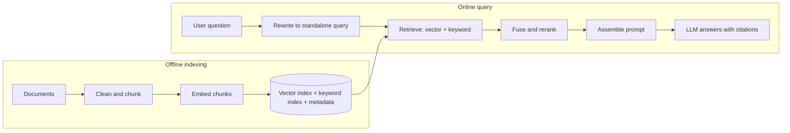

A support assistant has to answer questions from 12,000 help-centre articles that change every week. The model has never seen them, or saw a stale copy during pretraining. Fine-tuning them in takes days, has to be redone on every change, and still cannot tell the user which article an answer came from. Putting everything in the prompt is not an option either: at an average of 750 tokens per article the corpus is 9 million tokens, far beyond any context window, and would cost dollars per question even if it fitted.

Retrieval-augmented generation (RAG) is the standard answer: at query time, find the handful of passages most likely to contain the answer and put only those in the prompt. The model then answers from text it can see and cite, and updating knowledge means updating an index rather than a model. The idea fits in a sentence. Almost all of the engineering, and almost all of the failures, sit in the retrieval half.

## The pipeline

RAG has an offline half that builds an index and an online half that answers queries.



Step through the online half with a concrete query:

```viz
{"type": "ml", "algorithm": "rag-pipeline", "text": "What is the refund window?", "k": 2,
 "title": "One RAG query end to end",
 "caption": "The query is embedded with the same model as the chunks, the nearest chunks are retrieved, and the prompt carries them with their ids so the answer can cite a source."}
```

Two details in that walk-through are easy to miss. The query must be embedded with *the same model* that embedded the chunks, or the two sets of vectors live in unrelated spaces. And in a conversation, the raw user message is often not a searchable query: "what about for EU customers?" means nothing without the previous turn. Production pipelines first ask a small, fast model to rewrite the latest message into a standalone query ("refund window for EU customers") using the chat history.

## Chunking: the decision that caps everything downstream

You cannot embed whole documents usefully. Embedding models have input limits, and a single vector for a 20-page article averages every topic in it into a blur that is close to nothing in particular. So documents are split into chunks, and each chunk gets its own vector. The chunk is also the unit that lands in the prompt, so chunking decides both what can be *found* and what the model *sees*.

The size trade-off:

| Chunk size | Retrieval behaviour | Generation behaviour |
|---|---|---|
| Small (100–200 tokens) | Precise vectors; a match is about one thing | Answers lack surrounding context; more chunks needed per answer |
| Medium (300–600 tokens) | The common default | Enough context for most factual questions |
| Large (1,000+ tokens) | Vectors blur several topics; precision drops | Fewer, richer chunks; more tokens per query |

**Overlap** protects facts that straddle a boundary. If "Refunds are accepted within" ends one chunk and "30 days of delivery" starts the next, neither chunk answers the question. With overlap, consecutive chunks share their boundary words, so the sentence survives intact in at least one of them. The cost is arithmetic: with chunk size $s$ and overlap $o$ the stride is $s - o$, so the chunk count grows by a factor of about $s / (s - o)$. For the 9-million-token corpus, 400-token chunks without overlap give about 22,500 vectors; with 80 tokens of overlap the stride is 320 and you get about 28,000, which is 25% more storage and embedding cost for boundary protection.

Fixed-size windows are the baseline, not the best practice. Better chunkers follow the document's own structure:

- **Split on structure first.** Headings, then paragraphs, then sentences, falling back to token windows only for oversized paragraphs. A chunk that is a whole section is more coherent than one that starts mid-sentence.
- **Keep atomic units whole.** Never split a table row, a code block or a numbered procedure across chunks.
- **Prepend context.** A chunk that says "It must be submitted within 30 days" is useless on its own. Prefix every chunk with its document title and section path ("Returns policy > EU customers > Refund window") before embedding it. Some teams go further and have a small model write a one-sentence summary of where each chunk sits in its document; that costs one cheap model call per chunk at index time and measurably reduces retrieval misses.

The first exercise at the end of this lesson implements the fixed-window baseline with overlap, including the off-by-one that makes naive loops emit a redundant tail chunk.

## Embeddings: turning text into geometry

An embedding model maps a piece of text to a vector (typically 384 to 3,072 dimensions) such that texts with similar meaning land close together. "How long do I have to return an item?" and "Refunds are accepted within 30 days" share almost no words but end up with a high cosine similarity. [Embeddings and similarity](/learn/ai-and-llms/ml-foundations/embeddings-and-similarity) covers how these are learned; here is the geometry in miniature:

```viz
{"type": "ml", "algorithm": "embeddings-similarity", "text": "king queen man woman apple banana",
 "title": "Cosine similarity compares direction, not length",
 "caption": "Related words point the same way. Retrieval ranks chunks by exactly this score against the query vector."}
```

Operational facts that matter more than the choice of model:

- **Normalise vectors to unit length** at index time, and cosine similarity becomes a plain dot product, which every vector index computes fastest.
- **Some models are asymmetric**: they expect a different prefix or mode for queries and for documents. Using the document mode for queries silently costs recall.
- **Changing the embedding model means re-embedding everything.** Vectors from two models are not comparable. Version the index, build the new one alongside the old, switch reads once it is complete, and only then delete the old one.
- **Embeddings are weak on exact tokens.** Error codes, SKUs, version numbers and surnames carry little semantic signal, which is why the next two sections exist.

## Vector indexes: why nearest-neighbour search is approximate

Exact nearest-neighbour search compares the query with every vector. For 28,000 chunks of 1,024 dimensions that is about 29 million multiply-adds and 115 MB of floats: a few milliseconds, and perfectly fine. Many RAG systems never need anything cleverer, and `pgvector` inside an existing Postgres handles them comfortably.

At 10 million chunks the same scan streams about 41 GB of vectors through memory per query (10M × 1,024 × 4 bytes), which is on the order of a second on one machine. Approximate nearest-neighbour (ANN) indexes trade a little recall for orders of magnitude less work. The most widely used is **HNSW** (hierarchical navigable small world): a layered graph where each vector links to its near neighbours, and a few vectors are promoted to sparse upper layers that act as express lanes. A search starts at the top, greedily walks toward the query, drops a layer, and repeats, touching a few thousand vectors instead of ten million.

```viz
{"type": "ml", "algorithm": "vector-search-hnsw", "query": [7.2, 3.1],
 "title": "HNSW: greedy descent through a layered graph",
 "caption": "Upper layers cover long distances in a few hops; the bottom layer refines. The search visits a small fraction of the points, and can occasionally miss the true nearest one."}
```

The knobs are recall versus cost. A larger search beam (`ef_search` in most implementations) visits more nodes, raises recall and costs latency; more links per node (`M`) improves recall at the price of memory and build time. HNSW also keeps full-precision vectors in RAM plus the graph links, so at large scale teams add compression (product quantisation) or partition-based indexes (IVF) that search only the clusters nearest the query.

**Filtering is where ANN gets subtle.** Real queries carry constraints: this tenant, this product version, documents this user may read. If you retrieve the top 10 and *then* filter to a tenant that owns 1% of the corpus, you often have few or no results left. You need an index that filters during the search, or a separate index per large tenant, or a much larger k before filtering. When the filter is an access-control rule, it must be applied at retrieval time and never left to the prompt, a point [LLM security](/learn/ai-and-llms/building-with-llms/llm-security) returns to.

## Hybrid search: meaning plus exact matches

A user searches for "error E4012 when exporting invoices". The vector search returns general articles about exporting invoices, because the embedding captured the topic and all but ignored the code. The one article that documents E4012 ranks only third, below two general articles. Keyword search with **BM25**, the classic lexical ranking function used by Lucene, Elasticsearch and OpenSearch ([Search engines](/learn/databases/nosql-and-specialised/search-engines)), ranks it first, because the rare token "E4012" has a very high inverse document frequency.

Each retriever catches what the other misses, so production systems run both and fuse the results. The fusion problem is that the scores are incomparable: a BM25 score of 14.2 and a cosine similarity of 0.83 are on different, query-dependent scales. **Reciprocal rank fusion** (RRF) sidesteps that by using only ranks:

$$\text{RRF}(d) = \sum_{\text{lists } L} \frac{1}{k + \text{rank}_L(d)}$$

Ranks start at 1, a document missing from a list contributes nothing for that list, and $k = 60$, the constant from the original paper, is the usual default. Worked through for the E4012 query:

| Document | BM25 rank | Vector rank | RRF score (k = 60) |
|---|---|---|---|
| kb-03 "Exporting invoices" | 2 | 1 | 1/62 + 1/61 = 0.03252 |
| kb-17 "Error E4012" | 1 | 3 | 1/61 + 1/63 = 0.03227 |
| kb-41 "Invoice settings" | not retrieved | 2 | 1/62 = 0.01613 |
| kb-88 "Error code index" | 3 | not retrieved | 1/63 = 0.01587 |

The two documents that *both* retrievers found rise to the top, above anything only one retriever liked. The constant $k$ controls how steeply rank matters: with a large $k$ the difference between ranks 1 and 5 is small, so agreement between lists dominates; with a small $k$ a single first place can outweigh several middling appearances. The second exercise implements RRF and shows that effect.

## Reranking: spend compute on the shortlist

Embedding retrieval uses a **bi-encoder**: the query and each chunk are embedded separately, so chunk vectors can be computed once, offline. That independence is what makes it fast, and also what limits it: the model never sees the query and the chunk together, so it cannot notice that a chunk mentions refunds only to say they are handled elsewhere.

A **cross-encoder** reranker reads the query and one candidate chunk together and outputs a relevance score. It is far more accurate and far too slow to run over the whole corpus, since nothing can be precomputed. The standard design is a funnel: retrieve 50–100 candidates cheaply with hybrid search, rerank them with a cross-encoder (typically tens to a few hundred milliseconds for the batch, depending on hardware), and keep the top 5–10 for the prompt. An LLM can also act as the reranker, at higher cost and latency.

## Assembling the prompt

The retrieved chunks become part of the prompt, and how you lay them out matters.

- **Label every chunk with an id and its source** (`[policy.md#3] Refunds are accepted within...`) and ask for citations by id. Citations let users verify answers and let you measure whether the answer used the right source.
- **Tell the model what to do when the context is insufficient**: "If the passages do not contain the answer, say you could not find it." Without that path, the model fills the gap from memory, which is the hallucination RAG was meant to prevent.
- **Mind the order.** Models tend to use information at the start and end of a long context better than information in the middle; a well-known 2023 study named the effect "lost in the middle". Put the strongest chunks first, and do not pad the context with marginal ones.
- **Budget tokens.** Five 400-token chunks add 2,000 tokens to every request. More context is not free and not always better: irrelevant chunks distract the model and cost money on every call.
- **Treat retrieved text as data.** Anyone who can get a document into your index can put instructions in front of your model. Delimit chunks and say they are reference material, but rely on the security design, not the wording.

## Evaluating retrieval separately from generation

When a RAG answer is wrong, the first question is *which half failed*: did retrieval miss the passage, or did the model misuse a passage it was given? Measuring only the final answer hides the difference, so evaluate the halves separately ([Evals and observability](/learn/ai-and-llms/building-with-llms/evals-and-observability)).

For retrieval, build a labelled set of queries, each with the chunk ids that answer it, and compute:

- **Recall@k**: the fraction of relevant chunks that appear in the top k, averaged over queries; with one relevant chunk per query, simply the fraction of queries where it was found. This is the ceiling on answer quality, because the model cannot use a passage it never saw.
- **MRR** (mean reciprocal rank): the average of 1/rank of the first relevant result. For four queries whose first relevant results sit at ranks 1, 3, 2 and nowhere in the top 10, MRR = (1 + 1/3 + 1/2 + 0) / 4 = 0.458, and recall@5 is 3/4.

For generation, check **faithfulness** (every claim in the answer is supported by the retrieved passages), **answer relevance**, and **citation accuracy**, usually with a calibrated LLM judge. Then map symptoms to stages:

| Symptom | Stage that failed | Typical fix |
|---|---|---|
| "I could not find that", but the docs cover it | Retrieval recall | Hybrid search, better chunking, query rewriting, larger candidate set |
| Right passage retrieved, wrong answer | Generation | Clearer instructions, fewer and better-ordered chunks, reranking |
| Confident answer from an outdated article | Index freshness | Incremental re-indexing on change, deduplicate versions, filter by date |
| Great on precise questions, poor on vague ones | Query understanding | Query rewriting or generating several query variants |
| Answer cites a document the user may not see | Access control | Permission filter inside retrieval, per tenant or per user |

## When RAG is the wrong design

- **The corpus fits in the context.** A 50-page handbook is roughly 30,000 tokens. Sending all of it with every request, with prompt caching so repeated requests pay a fraction of the input price, is simpler than any pipeline and cannot miss a passage.
- **The data is structured.** "What was revenue by region last quarter?" is a SQL query. Give the model a tool that runs parameterised queries instead of embedding table rows.
- **The question aggregates over everything.** "How many of our contracts mention auto-renewal?" needs every document examined. Top-k retrieval returns ten; a batch job over all documents answers the question.
- **The corpus is code.** Coding agents often do better with search tools (grep, symbol lookup, open file) than with embeddings, because code has exact identifiers and explicit structure the model can navigate.

## Exercises

```exercise
id: chunk-with-overlap
title: Chunk text with overlap
prompt: |
  Implement `chunk_text(text, size, overlap)`.

  Split `text` into words on any whitespace. Produce chunks of at most `size`
  words. Each chunk starts `size - overlap` words after the previous one, so
  consecutive chunks share `overlap` words. Stop as soon as a chunk reaches the
  last word, so you never emit a tail chunk that is already contained in the
  previous one. Return each chunk as its words joined by single spaces.

  You may assume `0 <= overlap < size`. Empty or whitespace-only text returns
  an empty list.
languages: [python, javascript]
entry: chunk_text
starter:
  python: |
    def chunk_text(text, size, overlap):
        words = text.split()
        chunks = []
        # your code here
        return chunks
  javascript: |
    function chunk_text(text, size, overlap) {
      const words = text.split(/\s+/).filter(Boolean);
      const chunks = [];
      // your code here
      return chunks;
    }
tests:
  - args: ["a b c d e f g h i j", 4, 1]
    expected: ["a b c d", "d e f g", "g h i j"]
  - args: ["a b c d e f g h i j", 4, 0]
    expected: ["a b c d", "e f g h", "i j"]
    label: no overlap, short final chunk
  - args: ["one two", 5, 2]
    expected: ["one two"]
    label: text shorter than one chunk
  - args: ["   ", 3, 1]
    expected: []
    label: empty text
  - args: ["a b c d", 2, 1]
    expected: ["a b", "b c", "c d"]
    hidden: true
    label: maximum overlap
  - args: ["a b c d e f g h i j", 4, 2]
    expected: ["a b c d", "c d e f", "e f g h", "g h i j"]
    hidden: true
    label: no redundant tail chunk
  - args: ["  the   quick brown\nfox jumps  ", 3, 1]
    expected: ["the quick brown", "brown fox jumps"]
    hidden: true
    label: irregular whitespace
hints:
  - "The stride is size - overlap. Start at 0 and add the stride after each chunk."
  - "Emit words[start:start + size], and stop after the chunk whose end reaches the number of words."
  - "A plain range(0, n, stride) loop emits an extra tail chunk whenever the previous chunk already reached the end."
```

```exercise
id: reciprocal-rank-fusion
title: Fuse rankings with reciprocal rank fusion
prompt: |
  Implement `rrf(rankings, k)`. `rankings` is a list of ranked lists of
  document ids, best first; for example one list from BM25 and one from vector
  search. A document's fused score is the sum, over the lists it appears in,
  of `1 / (k + rank)`, where `rank` starts at 1. A document missing from a
  list contributes nothing for that list.

  Return every document id ordered by fused score, highest first. Break ties
  by id in ascending string order. No id appears twice in the same list.
languages: [python, javascript]
entry: rrf
starter:
  python: |
    def rrf(rankings, k):
        scores = {}
        # your code here
        return []
  javascript: |
    function rrf(rankings, k) {
      const scores = new Map();
      // your code here
      return [];
    }
tests:
  - args: [[["a", "b", "c"], ["b", "c", "a"]], 60]
    expected: ["b", "a", "c"]
  - args: [[["kb-17", "kb-03", "kb-88"], ["kb-03", "kb-41", "kb-17"]], 60]
    expected: ["kb-03", "kb-17", "kb-41", "kb-88"]
    label: the lesson's worked example
  - args: [[["x", "y", "z"]], 60]
    expected: ["x", "y", "z"]
    label: a single list keeps its order
  - args: [[], 60]
    expected: []
    label: no rankings
  - args: [[["b", "a"], ["a", "b"]], 60]
    expected: ["a", "b"]
    hidden: true
    label: exact tie broken by id
  - args: [[["x", "p", "q", "y"], ["r", "s", "t", "y"]], 60]
    expected: ["y", "r", "x", "p", "s", "q", "t"]
    hidden: true
    label: agreement wins with k = 60
  - args: [[["x", "p", "q", "y"], ["r", "s", "t", "y"]], 1]
    expected: ["r", "x", "y", "p", "s", "q", "t"]
    hidden: true
    label: small k rewards first places
hints:
  - "Loop over each list with its 1-based rank and add 1 / (k + rank) to that document's score."
  - "Sort by descending score, then by id. In Python a key of (-score, id) does both; in JavaScript compare scores first and fall back to comparing ids with < and >."
```

## Senior signals

- You debug RAG by asking **which half failed**, and you measure retrieval recall@k on a labelled set before touching the prompt.
- You treat **chunking as the highest-leverage decision**: structure-aware splits, overlap with a known cost, and context prefixes on every chunk.
- You run **hybrid search** because embeddings are weak on exact tokens, and you fuse with **RRF** because BM25 and cosine scores are not comparable.
- You use a **retrieve-then-rerank funnel**: cheap bi-encoder recall, then an expensive cross-encoder on the shortlist.
- You enforce **access control inside retrieval**, you know post-filtering a top-k can return nothing, and you plan **re-embedding** as a versioned migration.
- You know when **not** to build RAG: a corpus that fits in context with caching, structured data that wants SQL, and questions that aggregate over everything.

## Check yourself

```quiz
- q: >-
    Users report that the assistant says "I could not find that" for questions the documentation clearly answers. What should you measure first?
  options: ["Retrieval recall@k on a labelled set of the failing queries", "Answer faithfulness on those queries, scored with an LLM judge", "The model's temperature and how often it declines to answer", "Whether the prompt is too long for the model's context window"]
  answer: 0
  explanation: >-
    "Not found" for answerable questions points at retrieval: the passage probably never reached the prompt. Recall@k tells you whether it did. Faithfulness measures how the model uses the passages it received, which cannot help if the right one is missing.
- q: >-
    Why does reciprocal rank fusion use ranks instead of adding BM25 and cosine scores directly?
  options: ["The scores are on different, query-dependent scales, so a sum is meaningless", "BM25 returns only a ranked list, not scores, so ranks are all it has", "Ranks are cheaper to store and compare than floating-point scores", "Cosine similarity can be negative, which would cancel out the BM25 score"]
  answer: 0
  explanation: >-
    A BM25 score of 14 and a cosine of 0.83 cannot be meaningfully added, and their ranges change from query to query, so a raw sum lets one retriever dominate arbitrarily. RRF needs only positions, which are comparable across lists, and rewards documents that several retrievers rank highly. BM25 does produce scores; they are just on their own scale.
- q: >-
    You increase chunk overlap from 0 to 100 tokens with 400-token chunks. Roughly how does the number of chunks change?
  options: ["It stays the same, because overlap only changes what each chunk contains", "It grows by about a third, because the stride falls from 400 to 300 tokens", "It grows by a quarter, because 100 is a quarter of the 400-token chunk", "It doubles, because every boundary region now appears in two chunks, not one"]
  answer: 1
  explanation: >-
    Chunk count is about corpus length divided by the stride, size minus overlap. 400/300 is about 1.33, so a third more vectors to embed and store, not a quarter: the overlap shrinks the stride, and the count scales with 1/stride. Overlap protects facts at boundaries at a predictable cost.
- q: >-
    A multi-tenant RAG system retrieves the top 10 chunks by similarity and then removes chunks from other tenants. What goes wrong for a small tenant?
  options: ["Nothing; the filter guarantees each tenant sees only its own relevant chunks", "Embeddings leak between tenants, because they share one vector index", "Queries become slower than exact search, because the filter scans every chunk", "Other tenants' chunks can fill the top 10, leaving few or no results for it"]
  answer: 3
  explanation: >-
    Post-filtering a top-k starves small tenants, because other tenants' chunks crowd the top of the ranking, leaving few or no results even when relevant chunks exist. The filter is correct about access but not about recall. Filter during the search, retrieve a much larger candidate set, or partition the index by tenant.
- q: >-
    Why is a cross-encoder reranker applied to a shortlist rather than to the whole corpus?
  options: ["It cannot read chunks longer than a few sentences, so it needs short inputs", "It only works on BM25 results, since it needs lexical matches to score", "It scores query and chunk together, so nothing can be precomputed offline", "It is less accurate than the bi-encoder, so it only breaks ties at the top"]
  answer: 2
  explanation: >-
    Bi-encoders embed chunks once offline, which makes corpus-wide search cheap. A cross-encoder reads the query and chunk jointly, which makes it more accurate but means one model pass per pair at query time, far too slow over millions of chunks per query.
- q: >-
    Your company handbook is about 30,000 tokens and changes monthly. What is the simplest design worth considering before building a RAG pipeline?
  options: ["Embed each sentence separately so that retrieval is more precise", "Use BM25 keyword search alone and skip embeddings entirely", "Fine-tune the model on the handbook and retrain it each month", "Put the whole handbook in the prompt with prompt caching"]
  answer: 3
  explanation: >-
    A corpus that fits comfortably in the context can simply be sent every time; caching makes repeated requests pay a fraction of the input price, and nothing can be missed by retrieval. RAG earns its complexity when the corpus is too large for that.
```
