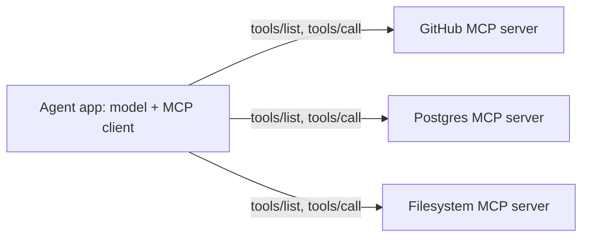

Your team is asked to "add an AI agent" that resolves customer billing disputes. The demo agent reads the dispute, looks up the invoice, checks the payment provider, and issues a credit. It works on the six cases in the demo. In a pilot it loops for 40 steps re-reading the same invoice, issues one credit twice after a timeout, and in one case follows an instruction a customer wrote into the dispute text. Each failure has a boring engineering cause, and none of them is fixed by a better model.

"Agent" is one of the most overloaded words in the industry, so start from the mechanism. An agent is **a language model in a loop that chooses its own next action**: it reads the task and everything that has happened so far, either calls a tool or declares it is done, observes the tool's result, and repeats. The defining property is that the model, not your code, decides the control flow. That property is the source of both the power and every problem in this lesson.

## The loop, and what it costs

The tool-use loop from [Structured outputs and tool use](/learn/ai-and-llms/building-with-llms/structured-outputs-and-tool-use) *is* the agent. What turns it into production code is everything around it: limits, error handling and accounting.

```python
import json
import anthropic

client = anthropic.Anthropic()
# MODEL, SYSTEM and the ToolError / BudgetExceeded / StepLimitExceeded
# exception classes are defined elsewhere in the module.

def run_agent(task, tools, handlers, max_steps=12, max_input_tokens=300_000):
    messages = [{"role": "user", "content": task}]
    input_tokens = 0
    for step in range(max_steps):
        resp = client.messages.create(
            model=MODEL, max_tokens=4096, system=SYSTEM, tools=tools, messages=messages)
        input_tokens += resp.usage.input_tokens
        messages.append({"role": "assistant", "content": resp.content})
        if resp.stop_reason != "tool_use":
            return resp                      # done: final answer, refusal or truncation
        results = [run_tool(b, handlers) for b in resp.content if b.type == "tool_use"]
        messages.append({"role": "user", "content": results})
        if input_tokens > max_input_tokens:
            raise BudgetExceeded(step, input_tokens)
    raise StepLimitExceeded(max_steps)

def run_tool(block, handlers):
    handler = handlers.get(block.name)
    if handler is None:
        return {"type": "tool_result", "tool_use_id": block.id, "is_error": True,
                "content": f"Unknown tool {block.name}."}
    try:
        out = json.dumps(handler(**block.input))
        return {"type": "tool_result", "tool_use_id": block.id, "content": out[:8000]}
    except ToolError as e:                   # errors are observations, not crashes
        return {"type": "tool_result", "tool_use_id": block.id, "is_error": True,
                "content": str(e)}
```

Watch one run of the loop:

```viz
{"type": "ml", "algorithm": "agent-loop", "text": "How many open PRs are older than 7 days?",
 "title": "An agent is a model in a loop",
 "caption": "Each iteration resends the whole transcript. The final step lists the guards a production loop needs: an iteration cap, a token budget, tool timeouts and human confirmation for irreversible actions."}
```

Two pieces of arithmetic explain most agent failures in production.

**Reliability compounds.** If each step is independently right 95% of the time, a 10-step task succeeds $0.95^{10} \approx 60\%$ of the time and a 20-step task about 36%. At 99% per step, 20 steps still fail almost one run in five. Longer autonomous runs need per-step reliability far above what feels "good" in a demo, or checkpoints that catch and correct errors: a test suite, a validator, a human.

**Cost grows faster than the step count.** The transcript is resent on every call. Say the system prompt, tools and task take 3,000 tokens and each step adds 1,500 tokens of tool call and result. Step $i$ sends $3{,}000 + 1{,}500(i-1)$ input tokens, so 20 steps send

$$20 \times 3{,}000 + 1{,}500 \times (0 + 1 + \dots + 19) = 60{,}000 + 285{,}000 = 345{,}000 \text{ tokens}$$

which is quadratic in the number of steps. Prompt caching changes the price, not the shape: if each step reads the previous prefix from cache at roughly a tenth of the input price and pays a small premium to write the new part, the same run costs about a fifth as much. Small tool outputs and aggressive caching are what make long agent runs affordable.

## Workflows first

Most tasks called "agentic" are better served by a **workflow**: a fixed control flow written in code, with LLM calls at some of the steps. Workflows are predictable, testable, cheaper and easier to debug, because you can see the path in the source. A widely used taxonomy of workflow patterns:

| Pattern | Shape | Example |
|---|---|---|
| Prompt chaining | Step A's output feeds step B, with checks in between | Draft a release note, then check it against the changelog |
| Routing | Classify the input, send it to a specialised prompt or model | Billing questions to one prompt, technical ones to another |
| Parallelisation | Independent calls at once, then combine (split the work, or vote) | Review a diff for security, performance and style in parallel |
| Orchestrator and workers | A model splits a task into subtasks that code dispatches | Research question fanned out to several searches |
| Evaluator and optimiser | One call generates, another critiques, loop until it passes | Translation refined against a rubric |

An agent is justified when **the path cannot be known in advance** (which files must change, which queries to run), **the task is valuable enough** to pay for many calls, and **errors can be caught**: tests, a type checker, a reviewer, an undo. Fixing a failing test in a repository satisfies all three; "summarise this ticket" satisfies none.

## Planning

An agent that acts one step at a time with no plan tends to wander: it re-reads the same file, forgets a sub-goal, or stops as soon as one part works. Three techniques help.

- **Interleave reasoning and action.** The ReAct pattern has the model state its reasoning before each tool call. Current models with built-in reasoning modes do this natively, and the reasoning is where they decide what to do next.
- **Make the plan an explicit, visible artefact.** A todo list the agent writes at the start and updates as it goes (through a tool or a scratch file) keeps sub-goals in context after hundreds of tool calls and lets a human see where it has got to.
- **Re-plan on new information.** A plan made before reading the code is a hypothesis. Good agents revise it when a tool result contradicts it; bad ones follow it off a cliff.

## Memory

The context window is the agent's only working memory, and it is finite, expensive and degrades as it fills: models attend less reliably to details buried in very long contexts, sometimes called context rot. Memory design is deciding what stays in the window.

| Strategy | Mechanism | Trade-off |
|---|---|---|
| Keep tool outputs small | Tools return summaries, ids and pages, not raw dumps | Needs deliberate tool design |
| Clear stale tool results | Replace old results with a stub once used | The model cannot re-read them without calling again |
| Compaction | Summarise older turns into a short digest | Lossy; a detail dropped from the summary is gone |
| External memory | The agent writes notes, plans and findings to files or a store, and reads them back | Needs tools and discipline; retrieval can miss |
| Sub-agents | Delegate a subtask to a fresh context; get back only a summary | Extra calls; the parent sees conclusions, not evidence |

Long-term memory across sessions (user preferences, facts learned last week) is a retrieval problem: store notes, retrieve the relevant ones into the next session's context, and apply the same freshness and access-control rules as any RAG index.

## Multi-agent systems

Splitting a task across several agents, usually an orchestrator that delegates to sub-agents with their own contexts and tools, helps in two situations. The first is **breadth**: a research question that fans out into ten independent searches finishes sooner in parallel, and the orchestrator reads ten short summaries instead of ten transcripts full of raw search results. The second is **specialisation**: a sub-agent with a narrow toolset and a focused prompt (search the code, run the tests) makes fewer wrong tool choices than one agent holding forty tools.

It costs in three ways. **Tokens multiply**, because every sub-agent reads its own instructions and context, so a multi-agent run commonly uses several times the tokens of a single agent doing the same job; parallel sub-agents also cannot read a cache entry that the others are still writing. **Information is lost at every hand-off**: the orchestrator acts on summaries, and a sub-agent cannot see what its siblings found unless you pass it along. And **debugging gets harder**, because the step that went wrong is buried in a transcript nobody was watching.

The rule of thumb: use several agents for wide, parallelisable, read-heavy work, and a single agent for tightly coupled work where each step depends on the last, such as a change that touches several related files.

## Tools and the Model Context Protocol

The tool-design advice from the structured outputs lesson applies with more force in agents, because a poorly designed tool gets called dozens of times per run. Prefer fewer, higher-level tools; return compact, model-readable results; make errors actionable; make destructive operations explicit and separate from reads.

The **Model Context Protocol** (MCP) is an open protocol, introduced by Anthropic in late 2024 and since adopted by most major agent tools and IDEs, that standardises how applications expose tools and data to models. An **MCP server** wraps a system (a database, an issue tracker, a file system) and advertises **tools** (callable functions with JSON-schema inputs), **resources** (readable data) and **prompts** (templates). An **MCP client** inside the agent application discovers them with `tools/list` and invokes them with `tools/call`, using JSON-RPC over stdio for local servers or HTTP for remote ones.



The value is the same as any standard interface: write the integration once and use it from any client. The risk is the same too, only sharper. An MCP server is code you run and text you feed to your model; its tool descriptions go into the prompt, and a malicious or compromised server can inject instructions or exfiltrate data through its tools. Treat servers as dependencies with the same scrutiny as a library, and scope their credentials narrowly ([LLM security](/learn/ai-and-llms/building-with-llms/llm-security); for day-to-day use in coding tools see [MCP and integrations](/learn/ai-assisted-engineering/tools-and-workflows/mcp-and-integrations)).

## Guardrails a production agent needs

Every failure in the billing-dispute pilot maps to a missing guardrail.

| Guardrail | What it prevents | Implementation |
|---|---|---|
| Step cap | Infinite loops (40 steps re-reading one invoice) | `max_steps`; return a partial result and escalate |
| Token or cost budget | Runaway spend on one task | Sum `usage` per call; stop above a ceiling |
| Loop detection | The same call with the same arguments, again and again | Hash recent (tool, arguments) pairs; stop or nudge after three repeats |
| Tool timeouts and output caps | One slow dependency stalling the run; a huge result flooding context | Per-tool deadlines; truncate or paginate results |
| Idempotency keys | The double credit after a timeout and retry | Key each side effect on the operation (dispute id and action), not on the attempt |
| Least-privilege tools | Damage from confusion or injection | Read-only by default; scope credentials to the user; allowlist arguments |
| Human confirmation | Irreversible or external actions taken on bad reasoning | Pause the loop and show the exact action and arguments for approval |
| Audit log | Not knowing what happened | Record every call, argument, result and decision with the trace id |

The injected instruction in the dispute text is a security problem, not a prompting problem: the agent read attacker-controlled text and had a tool that moved money. Confirmation on credits, and limits on what the credit tool can do without it, are what contain it.

## When an agent is the wrong tool

- **The path is known.** Classifying a million tickets, extracting fields from invoices, translating documents: one call per item, run in batch, with structured output.
- **Latency matters.** Each step is a model call of one to several seconds. A five-step agent on the hot path of a checkout page is a latency incident.
- **Every decision must be explainable and repeatable**, as in regulated approvals. A deterministic workflow with an LLM at a single, well-evaluated step is far easier to defend.
- **Errors cannot be detected or undone.** If nothing checks the result and nothing can be rolled back, compounding error rates are a liability, not a detail.

A good test in a design review: "What would the workflow version of this look like, and what specifically can it not do?" If the answer is "nothing important", build the workflow.

## Evaluating agents

Agent evals judge outcomes, not transcripts. Did the tests pass, is the database in the expected state, was the right credit issued exactly once? Check the trajectory too: the number of steps, any forbidden tool calls, cost per task. Because agents are non-deterministic, run each case several times. **pass@k** (at least one of k runs succeeds) measures what the agent *can* do; the stricter measure that all k runs succeed measures what it *reliably* does, which is what a production system needs. An agent that solves a task 70% of the time passes all three of three runs only about 34% of the time ($0.7^3$). [Evals and observability](/learn/ai-and-llms/building-with-llms/evals-and-observability) covers the machinery.

## Senior signals

- You define an agent by mechanism, **a model choosing its own control flow in a loop**, and you ask what the workflow version would lose before agreeing to build one.
- You quote the arithmetic: **per-step reliability compounds**, and **input tokens grow quadratically with steps** because the transcript is resent, which caching discounts but does not reshape.
- You design **memory as context management**: small tool outputs, clearing, compaction, external notes and sub-agents, each with its trade-off.
- You treat **MCP servers as dependencies** that inject text into your prompt and hold credentials.
- You list the **guardrails** without prompting: step cap, budget, loop detection, timeouts, idempotency, least privilege, confirmation, audit log.
- You evaluate agents on **outcomes and consistency across runs**, not on one impressive transcript.

## Check yourself

```quiz
- q: >-
    An agent task takes 15 steps, and each step is correct 97% of the time independently. Roughly how often does the whole task succeed?
  options: ["About 85%", "About 45%", "About 63%", "About 97%"]
  answer: 2
  explanation: >-
    0.97 to the 15th power is about 0.63. Per-step reliability that looks excellent in isolation compounds into a task that fails more than a third of the time, which is why long runs need checkpoints such as tests or validators.
- q: >-
    Why does an agent's input-token cost grow roughly quadratically with the number of steps?
  options: ["Providers charge more per token for the later calls in a long conversation", "Each call resends the whole transcript, which itself grows with every step", "Attention cost is quadratic in length, and providers bill for that compute", "The system prompt and tool list are duplicated again on every step"]
  answer: 1
  explanation: >-
    Step i sends everything from steps 1 to i-1, so total input is proportional to 1 + 2 + ... + n, the sum of a linear series. Billing is per token at a flat rate; the quadratic comes from resending, not from attention compute. Caching lowers the price of the repeated prefix but the tokens are still processed on every call.
- q: >-
    A task is to extract five fields from each of 200,000 scanned invoices. Which design fits best?
  options: ["A chat interface where staff paste each invoice and copy out the five fields", "A multi-agent system in which a planner assigns batches of invoices to workers", "A batch workflow: one structured-output call per invoice, validated in code", "An autonomous agent with OCR, database and email tools that works the queue"]
  answer: 2
  explanation: >-
    The path is known and identical for every item, so a workflow is cheaper, faster and testable. An agent adds non-determinism and cost without adding any capability the task needs.
- q: >-
    An agent retried a payment tool call after a timeout and the customer was credited twice. Which guardrail addresses the root cause?
  options: ["A step cap, so the agent cannot keep calling the payment tool in a loop", "A lower temperature, so the model is less likely to repeat the tool call", "An idempotency key on the payment tool, tied to the operation, not the attempt", "A longer tool timeout, so slow payment calls are not mistaken for failures"]
  answer: 2
  explanation: >-
    Retries are unavoidable in distributed systems; side effects must be safe to repeat. An idempotency key tied to the operation (the dispute being credited) makes the second call a no-op, whether the harness retried it or the model issued it again. A step cap limits loops but does not stop one duplicated call, and a longer timeout only makes the retry rarer.
- q: >-
    What is the main security concern when connecting a third-party MCP server to your agent?
  options: ["MCP locks the agent to one model provider, which makes switching models hard", "MCP servers cannot be rate limited, so a busy server can exhaust your quota", "Its tool text enters the model's context and its tools hold your credentials", "MCP messages travel unencrypted, so tool results can be read on the network"]
  answer: 2
  explanation: >-
    An MCP server is both code you run and text your model reads: its tool descriptions and results enter the context, and its tools act with whatever credentials you gave it, so a malicious server can inject instructions or exfiltrate data. Vet it like a dependency and scope its credentials. MCP is an open protocol used across providers.
```
