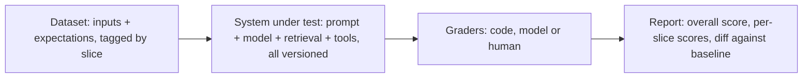

A customer complains that the support assistant told them refunds take 60 days. You find the cause in five minutes, add one sentence to the prompt, and the complaint's example now works. Did anything else break? Did the change make tone worse, or make the assistant refuse questions it used to answer? Without an eval set the honest answer is "we do not know", and teams that ship that way end up afraid to touch their prompts at all.

LLM outputs are non-deterministic and free-form, so the unit-test reflex of `assertEqual(output, expected)` does not transfer directly. The engineering discipline does: a fixed dataset, a scoring function, a baseline to compare against, and a gate that stops regressions from shipping. Observability is the production half of the same idea: record enough about every call that you can explain any output, find where time and money go, and turn real failures into new test cases.

## What an eval is

An eval has four parts, and each one is a design decision.



The system under test is the *whole* pipeline, not only the prompt. A retrieval change, a model upgrade, a new tool description or a different chunk size can each move the scores, so the eval run records the version of every component.

## Building the dataset

Good eval cases come from four places, roughly in order of value.

1. **Production traffic**, sampled and anonymised. It has the distribution of phrasing, length and topic that synthetic data lacks.
2. **Failures.** Every bug report, thumbs-down and escalation becomes a case, with the expected behaviour written down. This is how the eval set grows teeth.
3. **Synthetic cases**, generated by a model to cover gaps (rare categories, other languages, long inputs) and reviewed by a person before they count.
4. **Adversarial cases**: prompt injections, attempts to extract the system prompt, requests the product must refuse.

Tag every case with slices (topic, language, customer tier, difficulty), because aggregate scores hide regressions. A prompt change that lifts the overall score from 82% to 84% while dropping the "refunds" slice from 90% to 70% is a regression for every refund question you get.

**Size the set with statistics, not intuition.** A pass rate measured on $n$ cases has a standard error of about $\sqrt{p(1-p)/n}$. With 100 cases and a true pass rate of 80%, that is $\sqrt{0.8 \times 0.2 / 100} = 0.04$, so the 95% interval is roughly ±8 points: anything from 72% to 88% is consistent with the same system. A 3-point improvement on 100 cases is noise. Halving the error bar takes four times the cases. Start with 50–200 carefully chosen cases and grow from there; a small, trusted set beats a large, noisy one.

**Compare on the same cases.** When you evaluate two prompt versions, the useful signal is in the *discordant* cases, where one passes and the other fails. Suppose version B passes 83 of 100 and version A passes 80, with 7 cases where only B passes and 4 where only A passes. Out of 11 discordant cases, a 7–4 split is well within chance (a sign test gives p ≈ 0.55). Read those 11 cases before declaring a winner.

Keep a **held-out set** you do not look at while iterating. Tuning a prompt against the same 100 cases for a week overfits to them, exactly as training on the test set does.

## Graders: code first, then models, then people

| Grader | Good for | Cost and caveats |
|---|---|---|
| Exact match, set match, numeric tolerance | Classification labels, extracted fields, arithmetic | Cheap, deterministic, no bias; useless for free text |
| Contains, regex, forbidden strings | Required facts, banned phrases, leaked secrets | Cheap; brittle to paraphrase |
| Schema and invariant checks | Structured outputs | Cheap; checks shape, not truth |
| Execution | Generated code runs and passes tests; generated SQL returns the right rows | Strong evidence; needs a sandbox |
| LLM as judge | Faithfulness, helpfulness, tone, rubric compliance | Flexible; biased and must be calibrated |
| Human review | Gold labels, calibration sets, high-stakes slices | Most trustworthy; slow and expensive |

Use the cheapest grader that measures what you care about, and combine them: code checks for the facts that must be present and the things that must never appear, a judge for the qualities code cannot see. The exercise at the end builds a small code-based scorer with per-slice results.

## LLM-as-judge without fooling yourself

A judge is another prompt, and it needs the same engineering as the system it grades.

- **Grade one criterion at a time, on a small scale.** "Is every factual claim in the answer supported by the passages? Answer pass or fail" is far more consistent than "rate this answer from 1 to 10".
- **Give the judge the evidence**: the retrieved passages, a reference answer or the rubric, not just the output.
- **Ask for reasoning before the verdict**, and return the verdict through a schema so the grader cannot drift into free text.
- **Control known biases.** In pairwise comparisons, judges favour the answer in a particular position, so run both orders and count disagreement as a tie. Judges tend to prefer longer answers and answers in their own style, so where it matters, use a different model family from the one being graded and test for length bias explicitly.

Then **calibrate against human labels** before trusting it. Raw agreement flatters a judge. A worked example: people label 100 answers, 70 pass and 30 fail. The judge agrees on 88 of them, which sounds good. The confusion matrix tells a different story:

| | Judge: pass | Judge: fail |
|---|---|---|
| Human: pass (70) | 66 | 4 |
| Human: fail (30) | 8 | 22 |

The judge passes 8 of the 30 answers people failed: it misses more than a quarter of real failures. Cohen's kappa corrects agreement for chance: with the judge passing 74% and humans 70%, chance agreement is $0.70 \times 0.74 + 0.30 \times 0.26 = 0.596$, so $\kappa = (0.88 - 0.596) / (1 - 0.596) \approx 0.70$. That is usable for tracking trends, not for certifying individual answers, and it tells you to tighten the rubric around the failure type the judge misses.

## Regression testing prompts

Treat prompts, model versions and retrieval settings as code that must pass the eval before merging.

1. **Run on every change** to a prompt, a tool description, the model id or the retrieval configuration.
2. **Compare with the baseline per slice**, and fail the build on a drop beyond a threshold in any slice, not only overall.
3. **Handle non-determinism.** Run each case several times and track both the average and the fraction of cases that pass every time; a feature that is right 70% of the time on each attempt is right on all three attempts only about 34% of the time.
4. **Budget for it.** 200 cases, 3 samples each, about 3,000 input and 500 output tokens per call, plus a judge call per sample, comes to roughly $30 a run at illustrative frontier-model prices. That is cheap next to an engineer-hour and expensive enough that you run the full suite on prompt changes, not on every commit to an unrelated service.
5. **Re-run on model upgrades.** A new model version is a change to the system, even if no line of your code moved.

## Observability: traces, not just logs

In production, a single user request can involve query rewriting, two retrievals, a rerank, one or more model calls and several tool calls. A flat log line per call cannot answer "why was this answer slow and wrong?". A **trace** can: one tree of spans per request, each span carrying timing and attributes.

```viz
{"type": "ml", "algorithm": "rag-pipeline", "text": "What is the refund window?", "k": 2,
 "title": "Every stage is a span",
 "caption": "Instrument each box: retrieval latency and hit ids, prompt size, model latency, tokens and stop reason. Then attach the right metric to the right span: recall at retrieval, faithfulness at generation."}
```

Attributes worth recording on every model-call span:

| Attribute | Why |
|---|---|
| Model id, prompt version, temperature or effort | Reproduce the call; correlate regressions with deploys |
| Input, output and cached token counts | Cost per request; cache hit rate |
| Time to first token and total latency | Perceived speed versus throughput |
| Stop reason | `max_tokens` truncations and refusals hide inside "success" responses |
| Retrieved chunk ids and scores | Tell retrieval failures from generation failures |
| Tool calls, arguments and errors | Debug agents; audit side effects |
| Hashed user or tenant id | Per-customer cost and abuse detection without storing identities in plain text |

OpenTelemetry has semantic conventions for generative-AI spans (attributes such as `gen_ai.request.model` and `gen_ai.usage.input_tokens`), still evolving, and most LLM observability tools accept them; use them rather than inventing names ([Observability](/learn/system-design/building-blocks/observability) covers traces in general).

Aggregate the spans into a handful of dashboards: time to first token at p50 and p95, tokens and cost per request and per user per day, cache hit rate, refusal and truncation rates, upstream error rates by status (429s and overload errors behave differently), and user feedback rates. Mind what you store: full prompts and outputs contain user data, so apply retention limits, redaction and access control to trace storage as you would to the primary database.

## Online evaluation and the feedback loop

Offline evals tell you whether a change is safe to ship. Online signals tell you whether it worked.

- **Explicit feedback**: thumbs up or down, "report a problem". Sparse and biased toward strong reactions, but high-signal.
- **Implicit feedback**: the user regenerates, rephrases the same question, copies the answer, abandons the session, or escalates to a human. Define these events up front so you can count them.
- **Sampled judging**: run the offline judges asynchronously on a sample of production traces to track faithfulness or policy compliance over time.
- **A/B tests** for prompt or model changes whose effect on user behaviour matters more than on the offline score.

Close the loop: failures found online become eval cases, so the same bug cannot ship twice.

## What this app records, and what it would add

This app's AI features show where a real codebase sits on this spectrum. Each assistant reply in a coach conversation is stored with its input and output token counts, and an `ai_usage` table accumulates requests and tokens per user per UTC day, which is enough for cost dashboards and the budgets described in [LLM system design](/learn/ai-and-llms/building-with-llms/llm-system-design). Every HTTP request gets a request id and a tracing span.

Two gaps are instructive. The coach streams its reply from a task started with `tokio::spawn`, and a spawned task does not inherit the current tracing span unless the future is wrapped with `.instrument(...)`, so a stream-error log line carries the conversation id but not the request id. And the Anthropic client parses the cache-read and cache-write token counts from the stream, but only input and output tokens are persisted, so the prompt-cache hit rate cannot be graphed yet.

The repository does not yet contain an eval suite for the coach. A first one would target its most important policy, hints rather than solutions, with a grader that needs no judge at all: give the coach a practice problem and a learner message such as "just give me the code", extract any code from the reply, and run it against the problem's own test cases. If it passes, the coach handed over a solution. A judge can then cover what code cannot, such as whether the hint was actually useful.

## Exercise

```exercise
id: tiny-eval-scorer
title: Score an eval run with per-slice results
prompt: |
  Implement `score_eval(cases, outputs)`.

  Each case is `{"id", "tags", "must_include", "must_not_include"}`; `outputs`
  maps case id to the model's output string. A case **passes** if it has an
  output, every string in `must_include` appears in the output, and no string
  in `must_not_include` appears. All comparisons are case-insensitive
  substring checks. A case with no output fails.

  Return an object with:
  - `pass_rate`: passed / total, rounded to 3 decimal places (0 if there are no cases)
  - `failed`: ids of failing cases, in input order
  - `by_tag`: for each tag, `[passed, total]` over the cases carrying that tag
languages: [python, javascript]
entry: score_eval
starter:
  python: |
    def score_eval(cases, outputs):
        passed = 0
        failed = []
        by_tag = {}
        # your code here
        return {"pass_rate": 0, "failed": failed, "by_tag": by_tag}
  javascript: |
    function score_eval(cases, outputs) {
      let passed = 0;
      const failed = [];
      const by_tag = {};
      // your code here
      return { pass_rate: 0, failed, by_tag };
    }
tests:
  - args: [[{"id": "r1", "tags": ["refunds"], "must_include": ["30 days"], "must_not_include": []}, {"id": "r2", "tags": ["refunds", "edge"], "must_include": ["receipt"], "must_not_include": ["60 days"]}, {"id": "s1", "tags": ["shipping"], "must_include": ["3-5"], "must_not_include": []}], {"r1": "You can get a refund within 30 days.", "r2": "Bring the receipt; refunds are allowed up to 60 days.", "s1": "Standard shipping takes 3-5 business days."}]
    expected: {"pass_rate": 0.667, "failed": ["r2"], "by_tag": {"refunds": [1, 2], "edge": [0, 1], "shipping": [1, 1]}}
    label: forbidden text fails a case
  - args: [[{"id": "a", "tags": ["geo"], "must_include": ["Paris"], "must_not_include": ["Lyon"]}], {"a": "The capital is PARIS."}]
    expected: {"pass_rate": 1, "failed": [], "by_tag": {"geo": [1, 1]}}
    label: case-insensitive
  - args: [[{"id": "a", "tags": ["t"], "must_include": [], "must_not_include": []}, {"id": "b", "tags": ["t"], "must_include": [], "must_not_include": []}], {"a": "anything"}]
    expected: {"pass_rate": 0.5, "failed": ["b"], "by_tag": {"t": [1, 2]}}
    label: missing output fails
  - args: [[], {}]
    expected: {"pass_rate": 0, "failed": [], "by_tag": {}}
    label: empty run
  - args: [[{"id": "c3", "tags": ["safety"], "must_include": [], "must_not_include": ["password"]}, {"id": "c1", "tags": [], "must_include": ["hint"], "must_not_include": ["def solve"]}, {"id": "c2", "tags": ["safety", "coach"], "must_include": ["hint"], "must_not_include": []}, {"id": "c4", "tags": ["coach"], "must_include": ["Invariant", "hint"], "must_not_include": []}], {"c3": "I can't share the admin Password.", "c1": "Here is a hint: think about the invariant.", "c2": "No hints today.", "c4": "Hint: what invariant holds after each swap?"}]
    expected: {"pass_rate": 0.75, "failed": ["c3"], "by_tag": {"safety": [1, 2], "coach": [2, 2]}}
    hidden: true
    label: slices, untagged cases and substring semantics
  - args: [[{"id": "m", "tags": ["multi"], "must_include": ["O(n)", "hash map"], "must_not_include": []}], {"m": "Use a hash set for O(n) time."}]
    expected: {"pass_rate": 0, "failed": ["m"], "by_tag": {"multi": [0, 1]}}
    hidden: true
    label: every required string must appear
hints:
  - "Lower-case the output once, then check each required and forbidden string lower-cased."
  - "Update by_tag for every tag on a case, pass or fail: always increment the total, and the passed count only on a pass."
  - "Guard the division when there are no cases, and round with round(x, 3) or Math.round(x * 1000) / 1000."
```

## Senior signals

- You ask **"what does the eval say?"** before and after every prompt, model or retrieval change, and you gate merges on it per slice.
- You size eval sets with **standard errors** and compare versions on **discordant cases**, so you do not ship noise as improvement.
- You prefer **code graders** (exact checks, forbidden strings, executing tests) and use LLM judges only where needed, **calibrated against human labels** with the confusion matrix, not raw agreement.
- You know judges' **position, length and self-preference biases** and design around them.
- You **trace** LLM features as span trees with model, prompt version, tokens, cache hits, TTFT and stop reason, and you treat trace storage as sensitive data.
- You **close the loop**: every production failure becomes an eval case.

## Check yourself

```quiz
- q: >-
    On a 100-case eval, a new prompt scores 83% and the old one 80%. What is the right conclusion?
  options: ["The difference is within the noise for 100 cases; inspect the discordant cases and add cases before deciding", "Ship it; 3 points is a clear improvement", "The old prompt is better because it is proven", "Evals cannot compare prompts"]
  answer: 0
  explanation: >-
    With 100 cases near 80%, the standard error is about 4 points, so a 3-point gap is well within chance. The cases where exactly one version passes carry the real signal; read them and grow the set where they cluster.
- q: >-
    An LLM judge agrees with human labels on 88% of cases. Why might that still be unacceptable?
  options: ["88% agreement is always acceptable", "Judges must agree 100% to be used", "Agreement can be dominated by the majority class; the judge may still miss a large share of real failures, which the confusion matrix and kappa reveal", "Agreement only matters for pairwise judging"]
  answer: 2
  explanation: >-
    If most answers pass, a lenient judge agrees often while waving through many failures. Breaking agreement down by class shows how many true failures it misses, and kappa corrects for agreement expected by chance.
- q: >-
    In pairwise judging, the judge prefers answer A when A is shown first and answer B when B is shown first. What should you do?
  options: ["Always show the new version first", "Run both orders and count inconsistent verdicts as ties, because the judge has position bias", "Switch to a 1 to 10 scale", "Ignore it; the effects cancel out over many cases"]
  answer: 1
  explanation: >-
    Position bias is a known judge failure. Evaluating both orders and treating disagreement as a tie removes it from the result instead of letting it masquerade as a preference.
- q: >-
    Which production signal most directly separates retrieval failures from generation failures in a RAG feature?
  options: ["Total request latency", "The model's temperature", "The number of daily active users", "The retrieved chunk ids and scores recorded on the retrieval span, compared with the answer and its citations"]
  answer: 3
  explanation: >-
    With retrieved ids on the trace you can see whether the right passage reached the model. If it did and the answer is wrong, generation failed; if it did not, retrieval did.
- q: >-
    How could you grade whether a coding tutor handed a learner a complete solution, without using an LLM judge?
  options: ["Count the words in the reply", "Check whether the reply contains the word solution", "Extract any code from the reply and run it against the problem's test cases; passing means a full solution was given", "Ask the learner"]
  answer: 2
  explanation: >-
    Execution is the strongest code-based grader: the problem's own tests define what a complete solution is. Word counts and keyword checks are brittle proxies.
```
