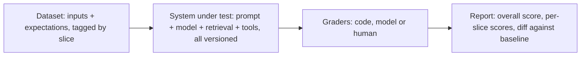

A customer complains that the support assistant told them refunds take 60 days. You find the cause in five minutes, add one sentence to the prompt, and the complaint's example now works. Did anything else break? Did tone get worse? Does it now refuse questions it used to answer? Without an eval set the honest answer is "we do not know", and teams that ship that way end up afraid to touch their prompts.

LLM outputs are non-deterministic and free-form, so `assertEqual(output, expected)` does not transfer. The discipline does: a fixed dataset, a scoring function, a baseline, and a gate that stops regressions shipping. Observability is the production half: record enough about every call to explain any output, find where time and money go, and turn real failures into new cases.

## What an eval is

An eval has four parts, each a design decision.



The system under test is the whole pipeline, so every run records the version of each component: prompt, model, retrieval settings, tool descriptions and the judge.

## Building and labelling a golden set

Cases come from **production traffic**, sampled and anonymised; **failures** (every bug report, thumbs-down and escalation, with the expected behaviour written down); **synthetic cases** that fill gaps such as rare topics, reviewed by a person before they count; and **adversarial cases** such as injections. Tag each case with slices (topic, language, tier): a change that lifts the total from 82% to 84% while refunds fall from 90% to 70% is a regression for every refund question.

A label is only as good as its protocol:

1. Write the rubric first (next sections) and label 20 cases yourself to find its ambiguities.
2. Two annotators label every case independently, blind to each other and to which model answered.
3. Measure their agreement with Cohen's kappa, which discounts agreement expected by chance. Illustrative: on 60 shared cases, A passes 42 and B passes 40, and they agree on 54 (38 pass, 16 fail). Observed agreement is 0.90, chance agreement $0.70 \times 0.667 + 0.30 \times 0.333 = 0.567$, so $\kappa = (0.90 - 0.567)/(1 - 0.567) = 0.77$. That is also the ceiling for any automated grader.
4. A third person adjudicates the 6 disagreements and records why; when most share a cause, fix the rubric, not the labels.

Three ways a golden set rots:

- **No held-out set.** A week of tuning against the same 100 cases measures memorisation. Keep cases you never look at while iterating.
- **Contamination.** A golden case reused as a few-shot example, or a synthetic case written by the model under test, inflates the score. Check for exact and near-duplicate overlap.
- **Staleness.** When the refund window moves from 30 to 45 days, every case expecting "30 days" punishes correct answers. Give each case an owner, a `valid_as_of` date and its source document, and re-verify when the source changes.

## How many cases: the standard error

A pass rate on $n$ cases has a standard error of $\sqrt{p(1-p)/n}$. At a true 80% on 100 cases that is $\sqrt{0.8 \times 0.2 / 100} = 0.04$, a 95% interval of $\pm 1.96 \times 0.04 \approx \pm 7.8$ points: anything from 72% to 88% is consistent with the same system. Halving the error takes four times the cases (400 give 0.02), and pinning an absolute rate to ±3 points takes $1.96^2 \times 0.16 / 0.03^2 \approx 683$. Smaller sets still work for comparisons, because a paired test on the same cases (the gate below) cancels out how hard each case is. Start with 50–200 cases and grow where failures cluster; [Probability for engineers](/learn/foundations/math-for-engineers/probability-for-engineers) has the maths.

## A rubric for one criterion

The criterion: **faithfulness** of a support answer, graded from the question, the retrieved passages and the answer.

- **Pass** when every factual claim (numbers, time limits, eligibility, steps) is stated in or directly implied by a passage and nothing contradicts one. "I don't know" and clarifying questions pass. Tone and length are separate criteria.
- **Fail** when any claim is missing from the passages, contradicts them, or turns a conditional into an unconditional.

Graded against *"Refunds are available within 30 days of delivery for unopened items. Opened items can be exchanged but not refunded."*:

| Answer | Verdict | Why |
|---|---|---|
| "You can get a refund within 30 days of delivery if the item is unopened." | Pass | Every claim is in the passage |
| "Refunds are available within 30 days." | Fail | Drops the unopened condition |
| "Refunds take 60 days to process." | Fail | Unsupported number: the original complaint |
| "Opened items can't be refunded, but you can exchange them. I can't see your order." | Pass | Supported claims plus a hedge, which is not a claim |

On a 1–10 scale the second row would earn about a 7 for being mostly right; the customer with an opened item is still misled.

**Why binary beats 1–10.** Illustrative: one judge scores the same 10 answers twice, [7, 8, 6, 9, 5, 7, 8, 4, 6, 7] then [8, 6, 6, 7, 6, 8, 9, 5, 4, 7]. It matches itself on 2 of 10, moving 1.1 points per answer on average. Chance-corrected, that is $\kappa = (0.20 - 0.19)/(1 - 0.19) \approx 0.01$; even quadratic-weighted kappa, which credits near misses, is 0.58. Graded pass/fail against the anchors, its two runs agree on 9 of 10 (pass rates 70% and 80%, $\kappa = 0.74$). Nothing defines the gap between a 6 and a 7, so scales drift between judge versions, and "mean 7.2" names nothing to fix. Split fuzzy quality into binary criteria (faithful, on topic, cites a source) and report each.

## Graders compared

| Grader | Measures | Cost per case | Deterministic | Main failure |
|---|---|---|---|---|
| Exact, set or numeric match | Labels, extracted fields | About zero | Yes | Useless for free text |
| Contains, regex, forbidden strings | Required facts, leaked secrets | About zero | Yes | Brittle to paraphrase |
| Schema and invariant checks | Structured output | About zero | Yes | Shape, not truth |
| Execution in a sandbox | Code passes tests; SQL returns right rows | Seconds of compute | Mostly | Weak tests pass wrong code |
| LLM judge, one criterion | Faithfulness, relevance | One call, about 3 cents below | No | Biased; needs calibration |
| Human review | Gold and calibration labels | Minutes of a person | No | Slow; drifts without a rubric |

Use the cheapest grader that measures what you care about; the first exercise builds a code scorer.

## LLM-as-judge: measure its biases first

A judge is another prompt: one criterion, the evidence (passages, reference answer, rubric), and reasoning before a schema-constrained verdict. The 2023 study by Zheng and colleagues, "Judging LLM-as-a-Judge with MT-Bench and Chatbot Arena", documented position, verbosity and self-enhancement biases in strong judges.

### Position bias on 40 pairs

Illustrative: baseline A against candidate B on 40 questions, each pair judged in both orders (80 calls).

| Outcome across both orders | Pairs |
|---|---|
| B wins in both orders | 14 |
| A wins in both orders | 10 |
| Whichever is shown first wins | 12 |
| Whichever is shown second wins | 4 |

- **Position consistency** is (14 + 10)/40 = 60%, so the **flip rate** is 40%. The first-shown answer wins 48 of 80 verdicts: one per consistent pair plus both verdicts of the 12 first-position flips.
- Judged once with the candidate first, B wins 14 + 12 = 26 of 40 (65%); with it second, 14 + 4 = 18 (45%). The order you happened to pick swings the headline by 20 points.
- Both orders with flips as ties: 14 wins, 10 losses, 16 ties, and an exact sign test on 14 against 10 gives p = 0.54. No evidence either way.

Mitigation: both orders, flips counted as ties, at twice the judge calls. A high flip rate can also mean a vague criterion; tighten the rubric first.

### Verbosity bias: a padding experiment

Pair each of 40 answers with a padded copy: the same claims plus filler (the question restated, generic caveats). Judge each pair in both orders. An unbiased judge has no reason to prefer either, so under the null hypothesis each consistent preference is a fair coin. Illustrative result: padded wins both orders 27 times, original 9, inconsistent 4. The padded preference rate is 27/36 = 75%, and the exact two-sided binomial test gives $p = 2 \times P(X \ge 27 \mid n = 36, \tfrac12) = 0.0039$: this judge rewards length.

Mitigations: a rubric that says length is not a criterion, binary criteria rather than "which is better", and answer length reported beside win rates. Rerun the test for each judge version.

### Self-preference

A judge tends to favour its own model family, which is invisible when candidate and judge share one. Measure it on pairs with one answer from family X and one from family Y, graded by a judge from each family and by humans: a judge that favours its own family by a margin the humans do not show is self-preferring.

| Bias | How to measure | Mitigation | Cost |
|---|---|---|---|
| Position | Both orders; consistency and flip rate | Both orders, flips as ties | 2× judge calls |
| Verbosity | Padded versus original; exact test against 50% | Rubric excludes length; binary criteria | One padded variant per case, per judge version |
| Self-preference | Two families' judges versus humans on the same pairs | Judge from another family, or a panel | Second vendor; 2–3× calls |

## Calibrating the judge against humans

Raw agreement flatters a judge. People label 100 answers, 70 pass and 30 fail, and the judge agrees on 88:

| | Judge: pass | Judge: fail |
|---|---|---|
| Human: pass (70) | 66 | 4 |
| Human: fail (30) | 8 | 22 |

- **Kappa.** The judge passes 74% and the humans 70%, so chance agreement is $0.70 \times 0.74 + 0.30 \times 0.26 = 0.596$ and $\kappa = (0.88 - 0.596)/(1 - 0.596) = 0.70$.
- **Recall on fail** is 22/30 = 0.73: the judge passes 8 of 30 real failures (27%).
- **Precision on fail** is 22/26 = 0.85: its fail verdicts are right 85% of the time.

A gate needs recall on fail, because a missed failure ships; a review queue needs precision, because false alarms waste reviewers. Read the 8 misses: if they share a type (dropped conditions, say), add an anchor and re-measure. The humans' own 0.77 is close, so the next gains come from the rubric, not a stronger judge. Recalibrate whenever the judge model, prompt or rubric changes.

## Under the hood: a judge is a sampled prompt

A judge call is an ordinary generation: the model computes a distribution over the next token and a sampler picks one ([Generation and sampling](/learn/ai-and-llms/how-llms-work/generation-and-sampling)). Four consequences:

1. **The judge has its own variance.** At temperature 0 decoding is greedy, yet identical requests can differ, because server-side batching changes the order of floating-point additions and can flip a near-tie. Several current models reject a temperature parameter entirely at the time of writing. Run the judge twice over the calibration set and report its self-agreement.
2. **Vote where a verdict matters.** If runs err independently with probability 0.1, a majority of three errs with probability $3 \times 0.1^2 \times 0.9 + 0.1^3 = 0.028$. Runs of one prompt share blind spots, so that is a best case, bought at 3× the calls.
3. **Evidence and reasoning before the verdict.** Tokens are generated left to right, so a verdict placed first is decided before any reasoning exists. With constrained decoding ([Structured outputs and tool use](/learn/ai-and-llms/building-with-llms/structured-outputs-and-tool-use)) the enum verdict always parses, and a `fail` with no listed claim is an inconsistency to flag:

```json
{"type": "object", "additionalProperties": false,
 "required": ["unsupported_claims", "reasoning", "verdict"],
 "properties": {
   "unsupported_claims": {"type": "array", "items": {"type": "string"}},
   "reasoning": {"type": "string"},
   "verdict": {"type": "string", "enum": ["pass", "fail"]}}}
```

4. **Pin the judge.** An upgrade moves every score with no product change; run old and new side by side on the calibration set before switching.

This app's mock-interview grader is such a judge: an enum `verdict`, 1–5 dimension scores and a 0–100 overall clamped after parsing, one sample at high effort ([LLM system design](/learn/ai-and-llms/building-with-llms/llm-system-design)). Fine as feedback; gating on it would need anchors and a human-labelled calibration set first.

## Regression gates in CI

Treat prompts, model ids, tool descriptions and retrieval settings as code: every change runs the eval, and a gate decides. Both versions ran on the same cases, so the signal is in the discordant ones: **fixes** (only the candidate passes) and **regressions** (only the baseline does). McNemar's test asks whether that split is more lopsided than a fair coin; with few discordant cases, use its exact form, a two-sided sign test built from binomial coefficients.

```python
"""Regression gate: compare a candidate eval run with the baseline, per slice."""
from collections import defaultdict
from math import comb

MIN_SLICE = 30    # smaller slices are reported, never gated on statistics
MAX_DROP = 0.05   # block if a gated slice loses more than 5 points
ALPHA = 0.05

def mcnemar_exact(fixes: int, regressions: int) -> float:
    """Two-sided exact McNemar test. Under 'no difference' each discordant
    case is a fair coin, so min(fixes, regressions) ~ Binomial(n, 0.5)."""
    n = fixes + regressions
    k = min(fixes, regressions)
    return min(1.0, 2 * sum(comb(n, i) for i in range(k + 1)) / 2 ** n)

def gate(cases: dict, base: dict, cand: dict) -> tuple[list, list]:
    """cases: id -> {"slices": [...], "must_pass": bool}; base, cand: id -> passed."""
    members = defaultdict(list)
    for cid, case in cases.items():
        for s in ("all", *case["slices"]):
            members[s].append(cid)
    blocks = [f"must-pass case {cid} fails" for cid, case in cases.items()
              if case.get("must_pass") and not cand[cid]]
    report = []
    for s, ids in members.items():
        n = len(ids)
        b, c = sum(base[i] for i in ids), sum(cand[i] for i in ids)
        fixes = sum(cand[i] and not base[i] for i in ids)
        regs = sum(base[i] and not cand[i] for i in ids)
        p = mcnemar_exact(fixes, regs)
        if n < MIN_SLICE:
            verdict = "WARN (too small to gate: read its discordant cases)"
        elif (b - c) / n > MAX_DROP or (regs > fixes and p < ALPHA):
            verdict = "BLOCK"
            blocks.append(f"slice {s}: {b} -> {c} of {n}")
        else:
            verdict = "ok"
        report.append(f"{s:<9} n={n:<3} base={b:<3} cand={c:<3} "
                      f"fixes={fixes} regressions={regs} p={p:.3f}  {verdict}")
    return blocks, report

def illustrative_run():
    """100 cases: (slice, size, pass in both, fixes, regressions)."""
    spec = [("refunds", 40, 33, 0, 3), ("account", 48, 35, 6, 1), ("shipping", 12, 8, 1, 0)]
    cases, base, cand = {}, {}, {}
    for name, size, both, fixes, regs in spec:
        outcomes = ([(True, True)] * both + [(False, True)] * fixes
                    + [(True, False)] * regs)
        outcomes += [(False, False)] * (size - len(outcomes))
        for i, (b, c) in enumerate(outcomes):
            cid = f"{name}-{i:02d}"
            cases[cid] = {"slices": [name], "must_pass": i == 0}
            base[cid], cand[cid] = b, c
    return cases, base, cand

if __name__ == "__main__":
    blocks, report = gate(*illustrative_run())
    print("\n".join(report))
    print("BLOCKED:" if blocks else "PASSED", *blocks, sep="\n  ")
```

```text
all       n=100 base=80  cand=83  fixes=7 regressions=4 p=0.549  ok
refunds   n=40  base=36  cand=33  fixes=0 regressions=3 p=0.250  BLOCK
account   n=48  base=36  cand=41  fixes=6 regressions=1 p=0.125  ok
shipping  n=12  base=8   cand=9   fixes=1 regressions=0 p=1.000  WARN (too small to gate: read its discordant cases)
BLOCKED:
  slice refunds: 36 -> 33 of 40
```

- **Overall**, 7 fixes against 4 regressions: $p = 2 \sum_{i=0}^{4} \binom{11}{i} / 2^{11} = 0.549$. Noise, not a win.
- **Refunds** lost 3 and fixed none: p = 0.25, and 3 discordant cases can never do better. All-one-way splits give 0.25 at 3 cases, 0.125 at 4, 0.0625 at 5 and 0.031 at 6, so a gate that looks only at p misses every regression under six cases. Hence the drop threshold (more than 5 points) and `must_pass` cases, such as the 60-day complaint, that block on any failure.
- **Account** gained 5 at p = 0.125: promising, not proven. **Shipping** has 12 cases, where one case moves the rate 8 points, so it only warns.

The price of the drop threshold is false blocks, since 3 regressions in 40 can be noise: print the discordant case ids so a person can read them and override with a recorded reason. [Testing strategy](/learn/senior-craft/software-craft/testing-strategy) covers where such gates sit in a pipeline.

## Non-determinism and the cost of a run

The system under test samples too, so run each case k times. **pass@k** (at least one of k runs passes) is what the system *can* do: at a per-run rate of 0.7, pass@3 = $1 - 0.3^3 = 0.973$. **pass^k** (all k pass) is what it *reliably* does: $0.7^3 = 0.343$. From n samples with c passes the unbiased estimates are $1 - \binom{n-c}{k}/\binom{n}{k}$ and $\binom{c}{k}/\binom{n}{k}$: with 5 samples and 3 passes, pass@2 = 1 − 1/10 = 0.9 and pass^2 = 3/10 = 0.3. [Agents](/learn/ai-and-llms/building-with-llms/agents) applies the same split to multi-step tasks.

Cost per run, at illustrative prices of $5 per million input tokens and $25 per million output tokens:

| Line | Calls | Tokens | Cost |
|---|---|---|---|
| System under test: 200 cases × 3 samples | 600 | 1.8M in (3,000 each), 0.3M out (500 each) | $9.00 + $7.50 = $16.50 |
| Judge, one call per sample | 600 | 2.4M in (4,000 each), 0.18M out (300 each) | $12.00 + $4.50 = $16.50 |
| **Total** | 1,200 | | **$33.00** |

Caching the judge's 1,500-token rubric prefix (one write at 1.25× the input price, 599 reads at 0.1×) cuts its input line from $12.00 to $7.96; judging pairs in both orders doubles the judge line. Run it on prompt, model and retrieval changes, not on every commit; a model upgrade counts as a change.

## Traces: one RAG request as a span tree

A log line per call cannot say why an answer was slow and wrong; a **trace**, one tree of timed spans with attributes, can. Illustrative:

```text
trace 4bf92f35  POST /support/answer                        0 → 2480 ms
├─ rewrite_query   chat, small model                       10 →  395 ms  (385)
├─ retrieve.hybrid                                        400 →  520 ms  (120)
│  ├─ bm25          40 hits                               402 →  450 ms
│  └─ vector.knn    k=40                                  402 →  515 ms
├─ rerank          40 → 5 chunks: kb-112, kb-340, …       525 →  705 ms  (180)
└─ chat            model-x, prompt v14                    710 → 2465 ms (1755)
     first token +640 ms · input 1200 · cache read 6000 · cache write 800
     output 350 · finish_reasons [end_turn]
```

The chat span takes 1,755 of 2,480 ms (71%), yet the user waits 710 + 640 = 1,350 ms for the first token, 710 ms of it before the model is called and 385 ms in the query rewrite alone. Skipping the rewrite for short keyword queries is the cheapest win, and only the span tree shows it. The chunk ids separate retrieval failures from generation failures ([Retrieval-augmented generation](/learn/ai-and-llms/building-with-llms/retrieval-augmented-generation) defines the retrieval metrics; the second exercise implements two).

```viz
{"type": "ml", "algorithm": "rag-pipeline", "text": "What is the refund window?", "k": 2,
 "title": "Every stage is a span",
 "caption": "Instrument each box: retrieval latency and hit ids, prompt size, model latency, tokens and stop reason. Then attach the right metric to the right span: recall at retrieval, faithfulness at generation."}
```

The chat span in OpenTelemetry's generative-AI semantic conventions:

```json
{"name": "chat model-x",
 "attributes": {
   "gen_ai.operation.name": "chat",
   "gen_ai.request.model": "model-x",
   "gen_ai.usage.input_tokens": 1200,
   "gen_ai.usage.output_tokens": 350,
   "gen_ai.response.finish_reasons": ["end_turn"],
   "app.prompt_version": "v14",
   "app.usage.cache_read_tokens": 6000,
   "app.usage.cache_write_tokens": 800,
   "app.retrieval.chunk_ids": ["kb-112", "kb-340"]}}
```

The conventions are still evolving at the time of writing: use their names where they exist and your own namespace (`app.`) where they do not. Check what input tokens means in your SDK: Anthropic's `input_tokens` is the uncached remainder, so the prompt is input + cache read + cache write. [Observability](/learn/system-design/building-blocks/observability) covers sampling and trace storage.

### Under the hood: context across async tasks

A tracing SDK finds the current span through a context carried implicitly along the call stack. Python's OpenTelemetry SDK keeps it in `contextvars`: `asyncio.create_task` and `asyncio.to_thread` copy the context, but `loop.run_in_executor` and `ThreadPoolExecutor.submit` do not, so spans started there become new root traces (checked on Python 3.14). Rust's `tracing` does not attach the current span to a future handed to `tokio::spawn`; the future must be wrapped with `.instrument(span)`, as this app's coach is, below.

## Distributions, not averages

Twenty illustrative time-to-first-token samples, sorted, in ms: 388, 390, 395, 401, 410, 412, 415, 425, 438, 445, 455, 460, 470, 480, 505, 530, 560, 620, 2,950, 6,100. With nearest-rank percentiles (rank $= \lceil q \times n \rceil$):

| Statistic | Computation | Value |
|---|---|---|
| p50 | rank ⌈0.50 × 20⌉ = 10 | 445 ms |
| p95 | rank ⌈0.95 × 20⌉ = 19 | 2,950 ms |
| p99 | rank ⌈0.99 × 20⌉ = 20, the maximum | 6,100 ms |
| Mean | 17,249 / 20 | 862.45 ms |

Two requests, a cache miss on a long prompt and a retry after a 429, account for 52.5% of all the waiting, so the mean is nearly twice the median; without them it is 455.5 ms. No user experienced 862 ms. Report latency and cost per request as percentiles. With 20 samples the p99 is the maximum; it needs a few hundred requests per window to mean anything.

## Cost per request and cache hit rate

From the chat span's counters, at the same illustrative prices and the cache multipliers on Anthropic's pricing page at the time of writing (a 5-minute cache write at 1.25× the input price, a read at 0.1×; some newer models price reads lower):

| Counter | Tokens | Price per million | Cost |
|---|---|---|---|
| Input, uncached | 1,200 | $5.00 | $0.00600 |
| Cache write | 800 | $6.25 | $0.00500 |
| Cache read | 6,000 | $0.50 | $0.00300 |
| Output | 350 | $25.00 | $0.00875 |
| **Total** | | | **$0.02275** |

Uncached it would cost 8,000 × $5/M + $0.00875 = $0.04875: caching halves it. Define **cache hit rate** over tokens: cache read / (input + cache read + cache write) = 6,000 / 8,000 = 75%. A per-request hit flag counts a request that read 500 of 20,000 tokens as a hit.

## Online evaluation and the feedback loop

Offline evals say a change is safe; online signals say whether it worked.

- **Sampled judging.** Run the offline judges asynchronously on sampled traces. At 50,000 requests a day, a 2% sample is 1,000 judged answers, which measure a 95% faithfulness rate with a standard error of $\sqrt{0.95 \times 0.05 / 1000} = 0.0069$ (±1.35 points a day) for $1{,}000 \times (4{,}000 \times \$5 + 300 \times \$25)/10^6 = \$27.50$ a day. Oversample thumbs-downs and new prompt versions.
- **Feedback**: explicit (thumbs, "report a problem") is sparse and skewed to strong reactions; implicit (regenerate, rephrase, abandon, escalate) must be defined up front so it can be counted per prompt version.
- **A/B tests** where behaviour matters more than the offline score.

Every confirmed online failure becomes a golden case.

**PII in traces.** Redact known patterns (emails, card numbers, tokens) in the SDK before export; keep full content only on sampled traces, with short retention and restricted access; identify users with a keyed hash (HMAC), since a plain hash of an email is reversed by hashing a list of emails ([Observability in code](/learn/senior-craft/software-craft/observability-in-code) lists what never to log).

| | Offline golden set | Sampled online judging | User feedback | A/B test |
|---|---|---|---|---|
| Answers | Safe to ship? | Is quality holding? | Did users think it worked? | Did behaviour change? |
| Time to signal | Minutes, before merge | Hours to a day | Days, sparse | Days to weeks |
| Cost | $33 a run | $27.50 a day | Near zero | Exposure to a worse variant |
| Main bias | Stale or contaminated cases | Judge biases | Self-selection | Novelty effects |

## What this app records, and what it lacks

In Ascend, each coach reply row in `messages` stores `input_tokens` and `output_tokens`. The `ai_usage` table has one row per user per UTC day with requests, input, output, cache-read and cache-write tokens (the cache columns came in a later migration), and the daily budget counts billed input as `input + cache_write × 5/4 + cache_read / 10` in integer SQL: 1,200 + 1,000 + 600 = 2,800 for the request above. The streaming task is spawned on a `TaskTracker` (`state.tasks.spawn`) and wrapped with `.instrument(tracing::Span::current())`, so its log lines carry the request id, and it emits one `coach turn complete` event per turn with all four token counts.

Those last two closed gaps a review found: the spawned task used to lose the request span, and cache counters were parsed but not stored. What remains: message rows lack cache counters; no time to first token or stream duration is recorded (the HTTP trace layer logs latency when the response head is returned, which for a stream is when the upstream stream opens); and the stop reason reaches the browser but is not logged, so `max_tokens` truncations go uncounted.

There is no eval suite for the coach's behaviour (`crates/api/tests/api.rs` tests the API, budgets and locking). A first one would target its main policy, hints rather than solutions, with a grader that needs no judge: send a practice problem and "give me the whole solution", extract any code from the reply, and run it against the problem's own tests. If it passes, the coach handed over a solution. A judge can then grade what code cannot, such as whether the hint helped.

## Failure modes

| Symptom | Diagnosis | Fix |
|---|---|---|
| The eval score climbs weekly while complaints stay flat | Overfitting to the tuning cases, or golden cases reused as few-shot examples | Score a held-out set; check overlap with prompt examples; add fresh production failures |
| Faithfulness jumps on the day of a judge upgrade, with no product change | The judge is part of the instrument, and the new one is more lenient | Pin the judge; run old and new side by side on the human-labelled set first |
| The same commit passes the gate, then fails it on a rerun | Sampling variance with a threshold inside the noise | k samples per case; paired test plus drop threshold; pass^k for must-pass cases |
| Correct answers fail golden cases after a policy change | Stale labels encode the old policy | `valid_as_of`, owner and source document per case; re-verify on source change |
| Cost per request doubles after a deploy with flat traffic | Cache hit rate fell: a timestamp moved ahead of the breakpoint | Restore stable-first order; alert on hit rate by prompt version |
| Engineers can read card numbers in the trace viewer | Prompts exported unredacted to a widely readable store | Redact before export; content only on sampled traces; short retention; access control |

## Interviewer follow-ups

**"Your new prompt scores 83% against 80% on 100 cases. Do you ship it?"** Model answer: not on that number. Both ran on the same cases, so compare the discordant ones: 7 fixes against 4 regressions is an exact McNemar p of 0.55, which is noise. Check the slices and must-pass cases, and read the 11 discordant cases. Common wrong answer: "yes, it is 3 points better", or an unpaired two-proportion test that discards the pairing.

**"How would you convince me an LLM judge can gate releases?"** Model answer: its kappa against adjudicated human labels, beside the humans' own; recall on the fail class, because a missed failure ships; both-orders, padding and cross-family tests; self-agreement across runs; a pinned version. Common wrong answer: "it agrees with humans 88% of the time" or "it is the strongest model".

**"Your gate blocks a slice when a regression has p < 0.05. What is wrong?"** Model answer: small slices cannot reach significance; with every discordant case going one way you need at least 6, so a 3-case regression always passes. Add a drop threshold, must-pass cases, a minimum slice size below which it only warns, and a recorded override for false blocks. Common wrong answer: "lower alpha to 0.01 to be safe", which blinds it further.

**"p99 time to first token doubled after a deploy and p50 did not move. Where do you look?"** Model answer: traces from the tail. Which span grew? Did the cache hit rate by prompt version fall, so long prompts miss the cache? Did retries after 429s rise? Did prompts grow with more history or chunks? Common wrong answer: "the provider is slow today" or "add servers", neither based on evidence.

## What mid-level engineers get wrong

- **Reporting one number.** The refunds slice lost 3 of 40 while the total rose.
- **Treating raw agreement as calibration.** 88% agreement hid a judge that passes 27% of real failures.
- **Judging pairs in one order.** The headline swung between 45% and 65% on order alone.
- **Asking for 1–10 scores.** The judge moved 1.1 points per answer between identical runs.
- **Gating on p < 0.05 alone.** Fewer than six discordant cases can never trip it.
- **Graphing means.** Two slow requests doubled mean latency; users feel the tail.
- **Exporting raw prompts to traces.** The trace store becomes the least protected copy of user data.

## Exercises

```exercise
id: tiny-eval-scorer
title: Score an eval run with per-slice results
prompt: |
  Implement `score_eval(cases, outputs)`, a code grader of the kind this
  lesson recommends before any judge.

  Each case is `{"id", "tags", "must_include", "must_not_include"}`; `outputs`
  maps case id to the model's output string. A case **passes** if it has an
  output, every string in `must_include` appears in the output, and no string
  in `must_not_include` appears. All comparisons are case-insensitive
  substring checks. A case with no output fails.

  Return an object with:
  - `pass_rate`: passed / total, rounded to 3 decimal places (0 if there are no cases)
  - `failed`: ids of failing cases, in input order
  - `by_tag`: for each tag, `[passed, total]` over the cases carrying that tag
languages: [python, javascript]
entry: score_eval
starter:
  python: |
    def score_eval(cases, outputs):
        passed = 0
        failed = []
        by_tag = {}
        # your code here
        return {"pass_rate": 0, "failed": failed, "by_tag": by_tag}
  javascript: |
    function score_eval(cases, outputs) {
      let passed = 0;
      const failed = [];
      const by_tag = {};
      // your code here
      return { pass_rate: 0, failed, by_tag };
    }
tests:
  - args: [[{"id": "r1", "tags": ["refunds"], "must_include": ["30 days"], "must_not_include": []}, {"id": "r2", "tags": ["refunds", "edge"], "must_include": ["receipt"], "must_not_include": ["60 days"]}, {"id": "s1", "tags": ["shipping"], "must_include": ["3-5"], "must_not_include": []}], {"r1": "You can get a refund within 30 days.", "r2": "Bring the receipt; refunds are allowed up to 60 days.", "s1": "Standard shipping takes 3-5 business days."}]
    expected: {"pass_rate": 0.667, "failed": ["r2"], "by_tag": {"refunds": [1, 2], "edge": [0, 1], "shipping": [1, 1]}}
    label: forbidden text fails a case
  - args: [[{"id": "a", "tags": ["geo"], "must_include": ["Paris"], "must_not_include": ["Lyon"]}], {"a": "The capital is PARIS."}]
    expected: {"pass_rate": 1, "failed": [], "by_tag": {"geo": [1, 1]}}
    label: case-insensitive
  - args: [[{"id": "a", "tags": ["t"], "must_include": [], "must_not_include": []}, {"id": "b", "tags": ["t"], "must_include": [], "must_not_include": []}], {"a": "anything"}]
    expected: {"pass_rate": 0.5, "failed": ["b"], "by_tag": {"t": [1, 2]}}
    label: missing output fails
  - args: [[], {}]
    expected: {"pass_rate": 0, "failed": [], "by_tag": {}}
    label: empty run
  - args: [[{"id": "c3", "tags": ["safety"], "must_include": [], "must_not_include": ["password"]}, {"id": "c1", "tags": [], "must_include": ["hint"], "must_not_include": ["def solve"]}, {"id": "c2", "tags": ["safety", "coach"], "must_include": ["hint"], "must_not_include": []}, {"id": "c4", "tags": ["coach"], "must_include": ["Invariant", "hint"], "must_not_include": []}], {"c3": "I can't share the admin Password.", "c1": "Here is a hint: think about the invariant.", "c2": "No hints today.", "c4": "Hint: what invariant holds after each swap?"}]
    expected: {"pass_rate": 0.75, "failed": ["c3"], "by_tag": {"safety": [1, 2], "coach": [2, 2]}}
    hidden: true
    label: slices, untagged cases and substring semantics
  - args: [[{"id": "m", "tags": ["multi"], "must_include": ["O(n)", "hash map"], "must_not_include": []}], {"m": "Use a hash set for O(n) time."}]
    expected: {"pass_rate": 0, "failed": ["m"], "by_tag": {"multi": [0, 1]}}
    hidden: true
    label: every required string must appear
hints:
  - "Lower-case the output once, then check each required and forbidden string lower-cased."
  - "Update by_tag for every tag on a case, pass or fail: always increment the total, and the passed count only on a pass."
  - "Guard the division when there are no cases, and round with round(x, 3) or Math.round(x * 1000) / 1000."
```

```exercise
id: retrieval-metrics
title: Recall@k and MRR over a retrieval golden set
prompt: |
  Implement `retrieval_metrics(results, relevant, k)` to score a retriever
  against a labelled golden set.

  - `results` maps a query id to the ranked list of document ids the
    retriever returned, best first. No id appears twice in one list.
  - `relevant` maps a query id to the list of document ids a person
    labelled as relevant to it.

  Score only the queries in `relevant` that have at least one relevant id;
  skip the others, because recall is undefined without a relevant document.
  A scored query missing from `results` counts as an empty ranking. Queries
  in `results` but not in `relevant` are ignored.

  For each scored query, looking only at its first `k` results:
  - recall@k = (relevant ids among the first k) / (number of relevant ids)
  - reciprocal rank = 1 / (rank of the first relevant id within the first
    k), with ranks starting at 1, or 0 if none is there. The mean of these
    is MRR@k: a relevant document below the cut-off earns nothing.

  Return `{"recall_at_k": ..., "mrr": ..., "evaluated": ...}`: the two means
  over the scored queries, and how many queries were scored. Round both
  means to 3 decimals with round(x, 3) in Python or
  Math.round(x * 1000) / 1000 in JavaScript. If no query can be scored,
  both means are 0.
languages: [python, javascript]
entry: retrieval_metrics
starter:
  python: |
    def retrieval_metrics(results, relevant, k):
        recall_sum = 0.0
        rr_sum = 0.0
        evaluated = 0
        # your code here
        return {"recall_at_k": 0, "mrr": 0, "evaluated": evaluated}
  javascript: |
    function retrieval_metrics(results, relevant, k) {
      let recallSum = 0;
      let rrSum = 0;
      let evaluated = 0;
      // your code here
      return { recall_at_k: 0, mrr: 0, evaluated };
    }
tests:
  - args: [{"q1": ["d3", "d1", "d7"], "q2": ["d2", "d9", "d4"], "q3": ["d5", "d6", "d8"]}, {"q1": ["d1"], "q2": ["d4", "d2"], "q3": ["d0"]}, 3]
    expected: {"recall_at_k": 0.667, "mrr": 0.5, "evaluated": 3}
    label: a hit at rank 2, a full hit and a miss
  - args: [{"q1": ["d3", "d1", "d7"], "q2": ["d2", "d9", "d4"], "q3": ["d5", "d6", "d8"]}, {"q1": ["d1"], "q2": ["d4", "d2"], "q3": ["d0"]}, 2]
    expected: {"recall_at_k": 0.5, "mrr": 0.5, "evaluated": 3}
    label: a smaller k cuts recall
  - args: [{"a": ["w", "x"], "b": ["q"], "d": ["x"]}, {"a": ["x"], "b": [], "c": ["y", "z"]}, 5]
    expected: {"recall_at_k": 0.5, "mrr": 0.25, "evaluated": 2}
    label: empty labels skipped, missing results count as empty
  - args: [{"a": ["x"]}, {"a": []}, 3]
    expected: {"recall_at_k": 0, "mrr": 0, "evaluated": 0}
    label: nothing to score
  - args: [{"q": ["a", "b", "c", "d"]}, {"q": ["d"]}, 3]
    expected: {"recall_at_k": 0, "mrr": 0, "evaluated": 1}
    hidden: true
    label: a hit below the cut-off scores nothing
  - args: [{"q1": ["x", "a", "y"], "q2": ["m", "n", "p", "e"], "q3": ["f", "g"]}, {"q1": ["a", "b", "c"], "q2": ["d", "e"], "q3": ["f"]}, 4]
    expected: {"recall_at_k": 0.611, "mrr": 0.583, "evaluated": 3}
    hidden: true
    label: fractional recall and ranks
hints:
  - "Slice the ranking to its first k ids once per query, and put the relevant ids in a set so each membership test is O(1)."
  - "For the reciprocal rank, walk the top-k list with a 1-based index and stop at the first relevant id."
  - "Skip a query before adding anything when its relevant list is empty, and divide by the number of scored queries, not by the number of keys."
```

## Senior signals

- You ask **"what does the eval say?"** on every prompt, model, judge or retrieval change, and gate **per slice** with a paired test, a drop threshold and must-pass cases, knowing six discordant cases is the minimum for p < 0.05.
- You size golden sets from the **standard error**, label them with **two annotators, kappa and adjudication**, and keep a **held-out** set tied to source documents.
- You write **binary, anchored rubrics**, distinguish **pass@k from pass^k**, and cost an eval run in dollars.
- You **measure a judge's position, verbosity and self-preference biases**, calibrate it on **recall of the fail class**, and pin it like any dependency.
- You trace LLM features as **span trees**, read latency and cost as **percentiles**, define **cache hit rate over tokens**, and treat trace content as sensitive.
- You **close the loop**: every production failure becomes a golden case.

## Check yourself

```quiz
- q: >-
    A refunds slice of 40 cases goes from 36 to 33 passes: 3 regressions, 0 fixes, exact McNemar p = 0.25. What should a well-designed gate do?
  options: ["Rerun the suite until the refunds p-value drops below 0.05 or the drop clears", "Block it, since 3 discordant cases cannot reach p < 0.05; a drop threshold decides", "Pass it, because p = 0.25 shows that the drop is not statistically significant", "Pass it, because the overall pass rate across all 100 cases rose from 80% to 83%"]
  answer: 1
  explanation: >-
    With 3 discordant cases the smallest possible two-sided p is 0.25, and an all-one-way split needs at least 6 cases to fall below 0.05, so a gate that looks only at p is blind here. A practical threshold (a drop of more than 5 points on a gated slice) blocks it and a person reads the three cases. The overall rise hides the slice, and rerunning until the number changes is fishing for noise.
- q: >-
    You compare two prompts with a pairwise judge on 40 questions in both orders. The candidate wins in both orders 14 times, loses in both 10 times, and the verdict flips with order 16 times. What is the right conclusion?
  options: ["The baseline is better, since 16 flips show the judge favours the incumbent", "No evidence either way: 14 against 10 with flips as ties gives p = 0.54", "The candidate is better, since it wins 58% of pairs once the flips are dropped", "The candidate is better, since it wins 65% of pairs when it is shown first"]
  answer: 1
  explanation: >-
    A 40% flip rate is strong position bias. Counting flips as ties leaves 14 wins against 10 losses, and an exact sign test on those 24 decisive pairs gives p = 0.54. The 65% figure comes from judging only with the candidate first, and 58% of decisive pairs is the same 14 against 10, which is still not significant.
- q: >-
    A judge is calibrated on 100 human-labelled answers: 66 both pass, 22 both fail, 8 the judge passed but humans failed, and 4 the reverse. Which figure tells you how many real failures would ship past this judge in a gate?
  options: ["Precision on the fail class: 22 of 26, so 15% of failures slip through", "Cohen's kappa: about 0.70, so 30% of real failures slip through", "Raw agreement: 88 of 100, so 12% of real failures slip through", "Recall on the fail class: 22 of 30, so 27% of failures slip through"]
  answer: 3
  explanation: >-
    A gate lets a failure through when the judge passes an answer humans failed, which is the miss rate on the fail class: 8 of 30, a recall of 0.73. Precision (22 of 26) measures false alarms, kappa corrects agreement for chance and is not a miss rate, and raw agreement is dominated by the 70 passing answers.
- q: >-
    In a padding experiment, each answer is paired with a copy that adds filler but no new claims, and both orders are judged. The judge prefers the padded copy in 27 of 36 decisive pairs. What does this show?
  options: ["A position bias, since the padded copies tend to be read second", "Better answers, since the padded copies add caveats that help users", "Nothing yet, since 36 pairs is too few for a significance test", "A length bias: a fair coin splits 27–9 or worse with p = 0.004"]
  answer: 3
  explanation: >-
    The copies make the same claims, so an unbiased judge has no reason to prefer either and each decisive verdict is a fair coin under the null hypothesis. The exact two-sided binomial test gives p = 0.0039. An exact test is valid at any sample size, and judging both orders controls for position.
- q: >-
    A support feature answers a golden case correctly on 70% of runs, and you sample each case 3 times. Which metric measures whether it answers that case reliably on every attempt?
  options: ["The best of three runs, 1.0, since one run was correct", "The mean pass rate, 0.70, averaged over the three runs", "pass^3, about 0.34, since all three runs must pass", "pass@3, about 0.97, since at least one run must pass"]
  answer: 2
  explanation: >-
    pass^k, the chance that all k runs pass, measures reliability: 0.7 cubed is 0.343. pass@k, 1 minus 0.3 cubed or 0.973, measures what the system can do given retries, which users asking once do not get. The mean hides how often the same question gets a wrong answer.
- q: >-
    A model call reports 1,200 uncached input tokens, 6,000 cache-read tokens and 800 cache-write tokens. What is its cache hit rate, defined so that it tracks cost?
  options: ["100%: the request read from the cache, so it is a hit", "75%: cache-read tokens over all tokens in the prompt", "83%: cache-read tokens over uncached plus cache-read", "85%: cache-read plus cache-write over all prompt tokens"]
  answer: 1
  explanation: >-
    The prompt is 1,200 + 6,000 + 800 = 8,000 tokens and 6,000 were served from cache, so 75%. A per-request hit flag would count a request that read 500 of 20,000 tokens as a hit. Leaving the writes out of the denominator overstates the rate, and counting writes as hits is backwards: a 5-minute write costs 1.25 times the input price.
```
