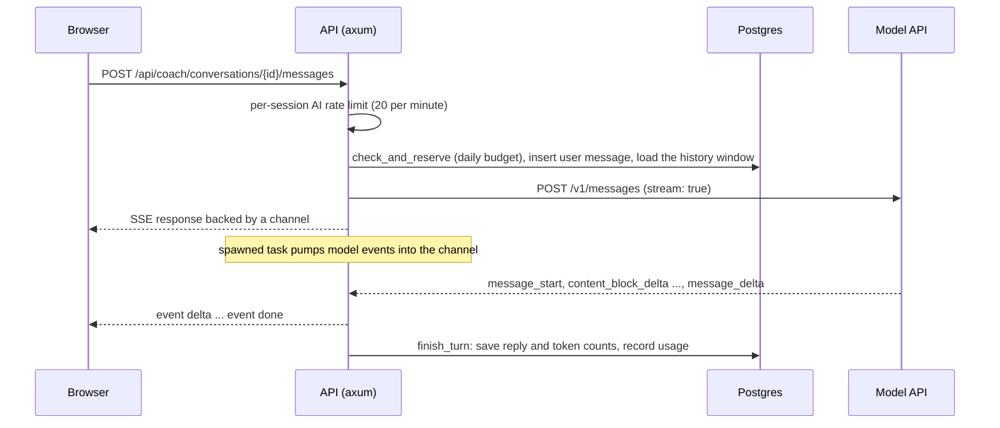

Design an AI tutor for a free learning platform. It should know which lesson or problem the learner is on and what is in their code editor, stream its replies, keep conversation history, generate fresh quizzes, and run and grade mock interviews. The whole product runs on one shared API key, so a single enthusiastic user or a script must not be able to run up an unbounded bill. And it must teach: a tutor that pastes the answer to every exercise defeats the product.

That is this app's AI coach. This lesson designs it the way you would in an interview or a design review (requirements, cost model, caching, routing, fallbacks, limits, observability) and checks each decision against the code in `crates/core/src/ai/` and `crates/api/src/routes/`, including the places where a reviewer pushed back and what changed. It ends by showing how the same reasoning changes for a documentation chatbot and a coding copilot.

## Requirements

| Kind | Requirement | Number that drives the design |
|---|---|---|
| Functional | Chat with lesson, problem and editor context; history per conversation | Up to 30 past messages per turn |
| Functional | Generate quizzes, personalise roadmaps, grade interviews, all consumed by code | Schema-valid JSON, no retry loop |
| Latency | First words quickly; a full answer can take seconds | Time to first token of a few seconds; replies of ~700 tokens |
| Cost | Bounded per user per day on one shared key | Daily request, input and output caps per user |
| Abuse | A script cannot hammer model-calling routes | A per-session rate limit on those routes only |
| Durability | Closing the tab does not lose a reply that is being generated | The reply is persisted by a task, not by the HTTP response |
| Policy | Hints, not solutions; no AI help during a solo mock interview | Enforced by construction where possible, by instruction otherwise |

## The cost model per request

Start with tokens, because tokens are latency and money. The coach's system prompt is assembled per turn from these parts (sent as two blocks, for reasons the caching section explains); sizes are measured from the code and content at roughly four characters per token:

| Part | Size | Changes |
|---|---|---|
| Persona and teaching rules | ~300 tokens (1,185 characters) | On deploy |
| Curriculum map (every track and module title) | ~500 tokens | On deploy |
| Current lesson body, or problem statement plus hints | Up to 24 KB (about 6,000 tokens) | When the learner moves |
| Editor contents | Up to 12 KB (about 3,000 tokens) | Whenever the learner types |
| Progress summary | ~50 tokens | Occasionally |

On top come up to 30 previous messages of history. A typical turn on a lesson is about 8,000 tokens of system prompt, 3,000 of history and 700 of output. Thinking tokens, when the model reasons before answering, are billed as output, so the effort setting is also a cost setting. At illustrative frontier-model rates of $5 per million input tokens and $25 per million output tokens, with cache reads at a tenth of the input price and 5-minute cache writes at 1.25 times it:

| Turn | Input | Output | Total |
|---|---|---|---|
| No caching | 11,000 × $5/M = $0.055 | 700 × $25/M = $0.0175 | $0.073 |
| System prompt read from cache | 8,000 × $0.50/M + 3,000 × $5/M = $0.019 | $0.0175 | $0.037 |
| System prompt written to cache | 8,000 × $6.25/M + 3,000 × $5/M = $0.065 | $0.0175 | $0.083 |

At 2,000 daily coach users averaging 8 turns, 16,000 turns a day cost between $592 (every turn a cache hit) and $1,328 (every turn a cache write), so the cache hit rate is the largest single lever. The other products, per call and illustrative: a quiz reads up to 30,000 characters of lesson (about 7,700 input tokens with instructions) and writes around 2,000 tokens, about $0.09; a final interview grade reads up to 60,000 characters of transcript plus 12,000 of code (about 18,000 tokens) and may write up to its 4,000-token limit at high effort, up to $0.19.

### The ceiling

Then the number a reviewer asks for: the **ceiling**. Production caps each user at 120,000 output tokens and 2,000,000 billed input tokens a day, which is $3.00 + $10.00 = $13 per user per day at these rates. If all 2,000 users hit the cap, the day costs $26,000, twenty to forty times the expected bill. The budget bounds the worst case; it does not make it affordable, which is why the design also rate-limits scripts and alerts on spend.

## The architecture



There is no official Rust SDK, so `crates/core/src/ai/anthropic.rs` is a small typed client over HTTP covering exactly what the app uses: streamed text and one-shot JSON-schema responses. Four products sit on it (the coach, quiz generation, mock interviews and the roadmap personaliser), and every model call reserves budget first.

## Caching: the prompt layout

Prompt caching is KV-cache reuse across requests. During prefill the model computes attention keys and values for every prompt token ([Context windows and the KV cache](/learn/ai-and-llms/how-llms-work/context-windows-and-kv-cache)); if a later request starts with a byte-identical prefix, the provider loads them instead of recomputing, which cuts both the price of those tokens and the time to first token.

```viz
{"type": "ml", "algorithm": "kv-cache", "text": "The cat sat",
 "title": "Prompt caching reuses the prefill",
 "caption": "Within one generation the cache avoids recomputing earlier tokens. Prompt caching keeps a prefix's keys and values across requests, so a byte-identical prefix is not prefilled again."}
```

The rules follow from the mechanism. The match is an exact prefix match in render order: tools, then system, then messages. A `cache_control` breakpoint marks the end of a cacheable prefix (up to four per request). An entry lives about five minutes by default, refreshed on every hit, with a one-hour option at a higher write price. Prefixes below a model-dependent minimum (from a few hundred to a few thousand tokens) are silently not cached, and the response's `usage` reports `cache_read_input_tokens` and `cache_creation_input_tokens` so you can check.

The first version sent the whole system prompt, ordered stable-first, as one block with one breakpoint at its end, after the editor contents. A review found the ordering right and the breakpoints wrong: a learner who edited code between questions missed the cache every time and paid the 1.25× write premium, more than with caching off; the history had no breakpoint at all; and no cache counter was persisted, so none of it showed on a graph.

The current code splits the builder: `stable_prompt()` returns the persona and curriculum map, `context_prompt()` the lesson or problem, editor contents and progress. The client's `Request` gained `context` and `cache_conversation`, and a coach turn renders as:

```json
{
  "model": "<AI_MODEL>",
  "max_tokens": 4000,
  "system": [
    {"type": "text", "text": "You are the Ascend coach: ...\n\n# Curriculum map\n...", "cache_control": {"type": "ephemeral"}},
    {"type": "text", "text": "# Current context\n..."}
  ],
  "messages": [{"role": "user", "content": "..."}, {"role": "assistant", "content": "..."}, {"role": "user", "content": "Why does my loop never terminate?"}],
  "thinking": {"type": "adaptive"},
  "output_config": {"effort": "medium"},
  "cache_control": {"type": "ephemeral"},
  "stream": true
}
```

The explicit breakpoint closes the stable block, a prefix shared across users as well as turns; a unit test asserts that the volatile context sits after it. The top-level `cache_control` is automatic caching: the API places a breakpoint on the last message and moves it forward, so turn N+1 reads turns 1 to N from cache and writes only the newest exchange. Review the fix the same way. The conversation's cached prefix *includes* the context block, so a learner who asks follow-ups without touching the editor pays about $0.010 of input per turn instead of $0.019, while one who edits before every question still reads only the ~800-token stable block and rewrites everything after it: about $0.064. Moving the editor snapshot into the latest user message would fix that case too, at the cost of old snapshots accumulating in history. Stable-first ordering is necessary but not sufficient: put a breakpoint at each stability boundary, know which volatile part sits inside which cached prefix, and let the counters tell you whether it works.

## Caching: the stepped history window

A conversation can outgrow any window, so the coach sends at most 30 past messages. The obvious implementation, "the last 30", slides by one exchange every turn, which changes the *first* message of the history on every request. Everything after the context block then misses the cache on every turn of a long conversation.

`coach.rs` moves the window's start in steps of 10 instead: `history_start(total)` is 0 until the conversation exceeds 30 messages, then `ceil((total - 30) / 10) × 10`. The start stays put for five turns (ten messages), so four turns in five read the whole prefix and write only the newest exchange; on the fifth the start jumps, the window drops to 21 messages, and one turn pays the rewrite. A unit test pins both properties: never more than 30 messages, and never fewer than 21 once the window is full.

Priced for a long conversation (800 stable tokens, a 6,000-token lesson, messages averaging 100 tokens from the learner and 400 from the coach), simulated over 25 turns past message 30:

| Window | Turn shape | Billed-equivalent input per turn | Input cost per turn at $5/M |
|---|---|---|---|
| Sliding, last 30 messages | Every turn: read 800, write 13,500 | 16,955 | $0.085 |
| Stepped by 10 | One turn in five: read 800, write 11,100; four in five: read ~12,400, write 500 | 4,303 on average | $0.022 |

A four-fold difference from choosing *which* messages to drop. The same principle applies to any truncation, summarisation or "memory" feature that edits the front of the conversation: change the prefix rarely and in large steps, never a little every turn.

## Effort and model routing

The coach uses one model, configured by `AI_MODEL`, and routes by **effort** instead: chat turns, quizzes, roadmap suggestions and interview turns run at medium effort; the final interview grade runs at high effort, because it is judgement-heavy and the learner waits for it once. Effort changes how much the model thinks, and thinking bills as output, so this is routing by cost without a second model.

A second, cheaper model is the next lever, and each candidate route needs three answers. **Is quality unchanged?** Titles, classification and quiz drafts are candidates, grading is not, and the eval set decides ([Evals and observability](/learn/ai-and-llms/building-with-llms/evals-and-observability)). **What does it save?** A quiz at about $0.09 on a model at a fifth of the price costs about $0.02. **What does it break?** Caches are per model, so switching models mid-conversation makes the next turn a full cache write; route whole conversations or one-shot calls. A per-request difficulty classifier adds a call to every request, so it pays only where the price gap is large.

## Streaming replies over Server-Sent Events

A 700-token reply at 50–100 tokens per second takes 7–14 seconds to finish; streaming shows the first words as soon as prefill and any thinking are done. The coach uses Server-Sent Events, a one-directional `text/event-stream` response, which is all a chat reply needs ([Real-time transports](/learn/networking/application-protocols/real-time-transports)). The important decision is who owns the reply. In `routes/coach.rs` the handler prepares the turn, opens the upstream stream, and hands it to a spawned task; the HTTP response only reads from a channel (a Tokio `mpsc` with capacity 64):

```rust
let (tx, rx) = sse::channel();
let coach = state.coach.clone();
// The spawned task outlives the request; `.instrument` carries the request
// span (method, path, request id) into its logs.
state.tasks.spawn(
    async move {
        futures::pin_mut!(upstream);
        let (reply, usage, error) = sse::pump(upstream, &tx).await;
        if let Some(e) = &error {
            tracing::warn!(error = %e, conversation = %conv.id, "coach stream error");
        }
        tracing::info!(
            conversation = %conv.id,
            input_tokens = usage.input_tokens,
            output_tokens = usage.output_tokens,
            cache_read_tokens = usage.cache_read_input_tokens,
            cache_write_tokens = usage.cache_creation_input_tokens,
            "coach turn complete"
        );
        if let Err(e) = coach.finish_turn(user.id, conv.id, reply, usage).await {
            tracing::error!(error = %e, "failed to persist coach reply");
        }
    }
    .instrument(tracing::Span::current()),
);
Ok(sse::respond(rx))
```

Three parts came from review: `.instrument(tracing::Span::current())`, because a bare spawned task does not inherit the request's span and its errors were logged without a request id; the `coach turn complete` event with all four usage counters; and `state.tasks`, a `TaskTracker` that `main` closes and awaits for up to 30 seconds on shutdown, because a learner who closed the tab has no open connection for graceful shutdown to wait on.

Inside `pump`, each event is appended to the full reply and forwarded with `let _ = tx.send(ev).await;`. If the browser disconnects, `send` fails and the error is deliberately ignored: the loop keeps consuming the model's stream, so `finish_turn` still saves the complete reply and records its tokens. The trade-off is explicit: generation continues, and is billed, after the user has left. For a tutor, keeping an answer worth a few cents is right; for inline autocomplete, where abandoned requests are the norm, you cancel upstream on disconnect.

The browser receives `delta` events, then exactly one `done` (tokens and stop reason) or `error`. A `ping` comment every 15 seconds keeps proxies from closing the connection while the model thinks. The user's message is saved before the model is called; if the stream fails before any text, the next turn's `collapse_roles` merges the two consecutive user messages so the API's alternation rule holds.

## Rate limits and budgets

Two independent layers protect the shared key.

### Per-session rate limit

**It stops bursts and scripts.** Only the routes that call the model (a coach message, quiz generation, roadmap suggestions, interview turns, the interview assistant and the final grade) pass through an in-memory keyed limiter (the `governor` crate, which implements GCRA and behaves like a token bucket) allowing 20 requests per minute per session: a burst of 20, then one every three seconds. The key is a digest of the session cookie, falling back to the client IP when there is none, so learners sharing one office or campus address do not throttle each other; reading history does not touch this bucket. It lives in process memory, which is right for a single instance and resets on deploy ([Rate limiting algorithms](/learn/networking/network-algorithms/rate-limiting-algorithms)).

```viz
{"type": "system", "algorithm": "token-bucket", "requests": 10,
 "title": "Burst capacity and refill rate",
 "caption": "Capacity sets the largest burst, refill sets the sustained rate. The coach's per-session limiter is the same shape: 20 requests of burst, refilled at one every three seconds."}
```

### Per-user daily budget

**It caps cost.** The `ai_usage` table has one row per user per UTC day with request, input, output, cache-read and cache-write counters. The defaults (environment variables) are 120 requests, 2,000,000 billed input tokens and 60,000 output tokens a day; production raises the request and output caps to 150 and 120,000 in `.railway/railway.ts`. Every model call first runs `check_and_reserve` in `budget.rs`, one conditional upsert that counts the request only while the user is under every limit:

```sql
INSERT INTO ai_usage (user_id, day, input_tokens, output_tokens, requests)
VALUES ($1, $2, 0, 0, 1)
ON CONFLICT (user_id, day) DO UPDATE
   SET requests = ai_usage.requests + 1
 WHERE ai_usage.requests < $3
   AND (ai_usage.input_tokens + ai_usage.cache_write_tokens * 5 / 4 + ai_usage.cache_read_tokens / 10) < $4
   AND ai_usage.output_tokens < $5
RETURNING requests
```

No returned row means over budget: the call fails with a rate-limit error whose message says the budget resets at midnight UTC and whose `Retry-After` header counts the seconds to the next UTC midnight. After the reply, `record` adds the actual counts with a plain increment upsert. Each is one statement, so concurrent requests cannot lose each other's updates, and Postgres rather than Redis fits because the limit is per day, the counts must survive restarts, and one file owns the policy.

### What review changed

Three review findings shaped the budget:

1. **Check and increment were separate statements.** Concurrent requests from a user at 119 could all read "under the limit" before any increment landed. The conditional upsert makes them queue on the row lock and re-evaluate the `WHERE` clause; `ai_budget_reservation_cannot_be_overshot_by_concurrency` in `crates/api/tests/api.rs` fires 30 reservations at a limit of 10 and asserts exactly 10 succeed. An atomic increment is not an atomic check-and-increment.
2. **The token checks are pre-flight**, deliberately. A request that starts at 59,000 output tokens can end at 63,000, overshooting by up to its `max_tokens`. Fine for a soft cap; a hard cap would reserve `max_tokens` up front and refund the rest.
3. **The input limit first counted only `input_tokens`**, which is *uncached* input, in the same change that turned on conversation caching and moved nearly all input into cache reads and writes. It now counts **billed** input (writes weighted 1.25, reads 0.1, integer arithmetic), and `cache_writes_count_against_the_input_budget_and_the_refusal_says_when_to_retry` records 90,000 cache-write tokens with no uncached input (112,500 billed) and checks the next request is refused with a retry time. The weights are the common 5-minute multipliers; some newer models price reads lower still, so the budget over-counts for them, a conservative error. A budget in money, from all four counters and each model's prices, would be exact and survive a change of model.

## Structured outputs and frozen transcripts

Quizzes, roadmap suggestions and interview grades are consumed by code, so they use one-shot calls with a JSON schema in `output_config.format`, validated again after parsing ([Structured outputs and tool use](/learn/ai-and-llms/building-with-llms/structured-outputs-and-tool-use)). The grader receives the transcript as JSON lines with platform-assigned roles, so a candidate cannot forge an interviewer turn by typing one.

The transcript is **frozen once the interview ends**. Every append is one conditional `UPDATE ... SET transcript = transcript || $2 WHERE status = 'active'` that also caps the transcript at 400 entries, so concurrent appends (a reply persisting while the learner types) each apply exactly once; `finish` is conditional on the same status, so of two racing finish requests exactly one stores a grade; and a reply still streaming when the interview ends matches no row when it tries to append, which the task logs at info level rather than as an error. An integration test, `transcripts_freeze_when_an_interview_ends_and_appends_never_lose_entries`, checks all three. One window remained after that, and the review of this lesson named it: the status changed when the grade was *stored*, not when the learner clicked finish, so a reply that landed during the seconds of high-effort grading was still appended, and the stored transcript could hold a turn the grader never saw. It is now closed. `begin_grading` moves the interview to a `grading` status in the same statement that stores the final code, before the grader is called; `append_transcript` refuses writes in that state ("the interview is being graded"); a failed grade (the model unavailable, the budget spent) calls `resume_after_failed_grading` so the learner can finish again; and a `grading` row older than five minutes, left by a request that died mid-grade, may be graded again rather than sticking forever. The integration test `grading_freezes_the_transcript_and_a_failed_grade_reopens_the_interview` walks all of it. A mock interview that ends with fewer than two candidate turns is marked abandoned without calling the grader at all.

## Policy: hints, not solutions

**By construction, the coach cannot leak what it never sees.** The content loader strips quiz answers and explanations from lesson bodies and splits each practice problem's editorial away from its statement, so the coach's context never contains a reference solution or an answer key. The "no AI help" promise of a solo mock interview is enforced on the server too: sending a coach message or generating a quiz is refused with a conflict error while the user has an active solo interview (bounded by its time box plus a grace period, so an abandoned tab cannot lock the coach forever).

**By instruction, it declines to write solutions.** The persona asks for the next hint, the invariant or the unblocking question unless the learner explicitly gives up, and a problem page adds the author's hints to reveal one at a time. An instruction is a probability, not a guarantee, acceptable only because the person harmed by talking the coach round is the learner doing it; at a security boundary, [LLM security](/learn/ai-and-llms/building-with-llms/llm-security) says instructions must never be the control. The in-interview assistant runs under the opposite policy and may write code, because directing an assistant is what that format tests.

## Fallbacks and degradation

The client classifies every failure and logs the provider's own words instead of forwarding them, because error bodies can echo request content: 429 becomes a rate-limit error with a 30-second `Retry-After`, 529 and 503 "the provider is overloaded", 401 and 403 "temporarily unavailable". Failures *inside* a stream follow the same rule ("The AI provider is overloaded, so the reply stopped early."), and a unit test asserts the provider's text never reaches the learner. With no API key configured, the coach reports itself disabled and the rest of the product works.

Nothing retries a turn automatically: the server's client has no retry loop, and the browser's automatic retries (at most two, honouring `Retry-After`) apply to reads, not to the POST that starts a turn. That leaves a ladder a reviewer would propose, in order of cost:

1. **One jittered retry before the first byte** on 429, 529 or a connection error. It is safe because nothing has been shown; after streaming starts, a retry would duplicate text, so the turn fails instead.
2. **A fallback model** for sustained overload. It starts cold: its cache holds nothing, so an 11,000-token turn is a full write, about $0.069 of input against $0.010 for a warm follow-up on the primary. Budget for the spike, and keep the conversation on the fallback until it ends rather than bouncing back and forth.
3. **Degrade the feature, not the product**: show the problem's own hints, or say the coach is busy, while lessons, practice and code execution carry on without the model.

## Observability

What the app records today, and what each piece answers:

| Signal | Where | Answers |
|---|---|---|
| Request span with method, path and a sanitised request id | Every HTTP request; the spawned stream task carries it via `.instrument` | Which request caused this error log line |
| `coach turn complete`: input, output, cache-read and cache-write tokens | One log event per coach turn | Cost per turn; cache hit rate per turn |
| `ai_usage`: requests and all four token counters per user per UTC day | Postgres | Spend per user; who is near a cap; daily cache hit rate |
| Input and output tokens on each stored assistant message | `messages` rows | Which replies were expensive |
| Budget refusals and provider failures | 429 statuses on the per-response log line; warn-level logs with the provider's status and a truncated body | Whether users hit caps or the provider is struggling |

From the counters, the cache hit rate is `cache_read / (input + cache_read + cache_write)` and billed input is `input + 1.25 × cache_write + 0.1 × cache_read`; ADR 0004 names a falling hit rate as a reason to revisit the design, because it means a prompt change broke the stable prefix. Two gaps remain. The HTTP layer logs each response's latency, but for a streamed turn that is the time until the stream opened, so neither time to first token nor generation time can be graphed. And no eval suite checks the replies; the first should run any code in a reply against the problem's own tests.

## Failure modes

| Symptom | Diagnosis | Fix |
|---|---|---|
| Daily spend climbs 3× with no rise in users | Cache reads fall to near zero in `ai_usage`: a prompt change put something volatile (a timestamp, the learner's name) before the breakpoint | Keep the stable block byte-identical; compare cache read and write counters per turn before and after the deploy |
| Long conversations cost several times more per turn than short ones | History trimmed one exchange per turn, rewriting the prefix every turn | Step the window (30 messages in steps of 10), or summarise in large, rare steps |
| A learner is refused at 10:00 with a budget error they did not expect | Billed input includes cache writes at 1.25×; a long conversation on a big lesson writes tens of thousands of tokens a turn | Show usage in the UI (`/coach/status` returns it); cap history and context sizes; keep the stable prefix cacheable |
| Replies are lost on deploys | The stream task was untracked, so the process exited mid-generation | `TaskTracker`, closed and awaited with a bounded timeout on shutdown |
| Error logs from streamed turns cannot be joined to requests | A spawned task does not inherit the tracing span | Instrument the future with the current span |
| A graded interview's stored transcript differs from what was graded | A reply finished streaming after the interview ended, or during the seconds of grading | Conditional append on `status = 'active'`, and a `grading` status set in one statement before the grader is called (both in place) |
| One script uses a whole classroom's allowance | The rate limit was keyed by IP, so everyone behind one NAT shared it | Key model-calling routes by session digest, IP only as a fallback |

## Generalising: a docs chatbot and a coding copilot

The same questions (what is in the context, what a token costs, what latency the user perceives, what caps the spend, what must never happen) give different answers for other products.

| | AI coach (this app) | Docs chatbot | Inline coding copilot |
|---|---|---|---|
| Latency that matters | First token in a few seconds | First token in a second or two | Whole suggestion in a few hundred milliseconds, or it is useless |
| Context | Lesson or problem, editor, progress, history | Retrieved chunks with citations | Code around the cursor plus ranked snippets from related files |
| Model | Large, reasoning at medium effort | Mid-size to large, plus retrieval | Small and fast, trained for fill-in-the-middle; larger model for chat |
| Caching | Stable system prefix; stepped history window | Stable system prompt; answer cache keyed on tenant and document version | Prefix reuse per file; cancel stale requests |
| Cost control | Per-user daily budget and per-session limit | Per-tenant quotas; answer cache | Debounce keystrokes and cancel in-flight requests |
| On disconnect | Keep generating and persist | Cancel | Cancel immediately |
| Worst failure | Handing over solutions | A confident answer the docs do not support | A suggestion that arrives after the user has moved on |

Two traps are specific to these designs. A **semantic answer cache**, which reuses an answer for a question that embeds close to a previous one, will eventually serve "refunds for US orders" to someone who asked about EU orders, and across tenants it leaks; key it on the exact normalised question, tenant and document version ([Retrieval-augmented generation](/learn/ai-and-llms/building-with-llms/retrieval-augmented-generation) covers the retrieval side). For a **copilot**, most requests are wasted by design because the user keeps typing: cancellation and debouncing are the cost model.

## Exercise

```exercise
id: daily-ai-budget
title: Replay a day against the AI budget
prompt: |
  Implement `run_budget(limits, events)`, a model of this app's daily AI
  budget for one user.

  `limits` is `{"requests", "input", "output"}`. The state starts with every
  counter at 0: `requests`, `input` (uncached input tokens), `output`,
  `cache_read` and `cache_write`. Events are processed in order:

  - `["reserve"]`: allowed only if `requests < limits.requests`, billed input
    `< limits.input`, and `output < limits.output`, where billed input is
    `input + (cache_write * 5) // 4 + cache_read // 10` in integer
    arithmetic on the running totals. If allowed, add 1 to `requests` and
    record `"ok"`; otherwise change nothing and record `"refused"`.
  - `["record", input, output, cache_read, cache_write]`: add each number to
    its counter. Recording always succeeds and produces no result.

  Return the list of results of the `"reserve"` events, in order.
languages: [python, javascript]
entry: run_budget
starter:
  python: |
    def run_budget(limits, events):
        s = {"requests": 0, "input": 0, "output": 0, "cache_read": 0, "cache_write": 0}
        results = []
        # your code here
        return results
  javascript: |
    function run_budget(limits, events) {
      const s = { requests: 0, input: 0, output: 0, cache_read: 0, cache_write: 0 };
      const results = [];
      // your code here
      return results;
    }
tests:
  - args: [{"requests": 2, "input": 1000000, "output": 60000}, [["reserve"], ["reserve"], ["reserve"]]]
    expected: ["ok", "ok", "refused"]
    label: request cap
  - args: [{"requests": 150, "input": 100000, "output": 60000}, [["reserve"], ["record", 0, 10, 0, 90000], ["reserve"]]]
    expected: ["ok", "refused"]
    label: cache writes count at 1.25x
  - args: [{"requests": 150, "input": 2000000, "output": 60000}, [["reserve"], ["record", 3000, 59000, 0, 0], ["reserve"], ["record", 3000, 4000, 0, 0], ["reserve"]]]
    expected: ["ok", "ok", "refused"]
    label: the check is pre-flight, so output can overshoot
  - args: [{"requests": 10, "input": 100, "output": 100}, []]
    expected: []
    label: no events
  - args: [{"requests": 150, "input": 100000, "output": 60000}, [["record", 0, 0, 999999, 0], ["reserve"], ["record", 0, 0, 1, 0], ["reserve"]]]
    expected: ["ok", "refused"]
    hidden: true
    label: integer division applies to the running total
  - args: [{"requests": 1, "input": 1000000, "output": 60000}, [["reserve"], ["reserve"], ["record", 10, 10, 0, 0], ["reserve"]]]
    expected: ["ok", "refused", "refused"]
    hidden: true
    label: refused reservations do not count
  - args: [{"requests": 150, "input": 1000, "output": 60000}, [["record", 998, 0, 0, 1], ["reserve"], ["record", 0, 0, 0, 1], ["reserve"]]]
    expected: ["ok", "refused"]
    hidden: true
    label: write weighting rounds down on the running total
hints:
  - "Compute billed input from the running totals each time you reserve, not per record event."
  - "In Python use //; in JavaScript use Math.floor on the division. All values are non-negative."
  - "Only a successful reservation changes the requests counter."
```

## Interviewer follow-ups

**"Estimate the daily cost of this coach, and its worst case."** Model answer: about 11,000 input and 700 output tokens per turn, $0.037 to $0.083 depending on caching, so 16,000 turns cost $600 to $1,300; every user at the cap is $13 each, $26,000 for 2,000 users, which is why rate limits and spend alerts sit on top of the budget. Common wrong answer: a price per million tokens with no token count per turn.

**"Why do the coach's cache writes cost more than having no cache, for some learners?"** Model answer: a write bills at 1.25× input, and a learner who edits code before every question invalidates everything after the stable block, so each turn rewrites the context and history at the premium; the fix is breakpoints at each stability boundary and moving volatile data later. Common wrong answer: "caching is always cheaper".

**"How do you keep history bounded without breaking the cache?"** Model answer: truncate in large, rare steps (the coach keeps at most 30 messages and moves the start by 10), so four turns in five reuse the prefix; the simulated cost per turn falls about four-fold against a sliding window. Common wrong answer: "drop the oldest message each turn".

**"The provider returns 529 for ten minutes. What does the user see, and what should happen?"** Model answer: today, a classified "overloaded, try again" message and no automatic retry; the next step is one jittered retry before the first byte, then a fallback model that starts cold and stays for the conversation, then degrading to static hints, all with the retry budget and spend visible on a dashboard. Common wrong answer: "retry until it works".

**"Why a conditional upsert rather than read, check, then increment?"** Model answer: separate statements let concurrent requests all pass the check before any increment lands; the conditional upsert evaluates the limit and increments under the row lock in one statement, proved by a 30-way concurrency test against a limit of 10. Common wrong answer: "the increment is atomic, so it is safe".

## What mid-level engineers get wrong

- **Pricing a feature per token instead of per turn and per day.** Without the token composition of a turn and the cache hit rate, the estimate is off by a factor of two in either direction.
- **Putting volatile data first.** A timestamp or user name at the top of the system prompt makes every request a cache write at 1.25×.
- **Trimming history by one message a turn.** Every long-conversation turn rewrites the prefix.
- **Limiting uncached input only.** With caching on, most input is cache reads and writes, so the limit barely moves while spend does.
- **Check-then-increment in application code.** Concurrency overshoots the limit by the number of requests in flight.
- **Forwarding provider errors to users.** Error bodies can quote the request, including another user's content in a shared prompt.

## Senior signals

- You start an LLM design from **token arithmetic**: what is in the context, what each turn costs, how much the cache hit rate swings the bill, and what the **worst-case ceiling** is.
- You lay prompts out **stable first, volatile last**, place breakpoints at stability boundaries, **step history truncation** so prefixes survive, and verify hits with the usage counters.
- You **route by effort before routing by model**, and you know caches are per model, so fallbacks start cold and routes should not alternate mid-conversation.
- You decide **who owns a streamed reply** and what happens on disconnect, deploy and late arrival (the frozen transcript).
- You layer **per-session rate limits for bursts and per-user billed-token budgets for cost**, use atomic conditional upserts, and give refusals a `Retry-After`.
- You design **fallbacks as a ladder** (retry before the first byte, fallback model, degrade the feature) and keep provider error text out of responses.
- You separate **policies enforced by construction** from **policies enforced by instruction**, and **observe** cost, cache hit rate and refusals per turn and per user.

## Check yourself

```quiz
- q: >-
    The coach sends a cached stable system block (persona and curriculum map), then an uncached context block that includes the editor contents, then the history, with top-level automatic caching on the last message. A learner edits their code before every question. What does each turn read from cache?
  options: ["Only the stable block, because the edit changes the prefix under the history breakpoint", "Nothing, because a change anywhere in the system prompt invalidates all of its breakpoints", "Everything, because the context block has no cache_control marker of its own", "Only the history, because automatic caching skips the system prompt entirely"]
  answer: 0
  explanation: >-
    Caching is an exact prefix match in render order, system then messages. The explicit breakpoint after the stable block still matches, so that part is read. The automatic breakpoint on the last message covers the context block too, so a code edit changes that prefix and everything after the stable block is written again at the write premium. Moving the editor snapshot into the latest user turn would keep the history prefix stable.
- q: >-
    The coach keeps at most 30 past messages and moves the window's start in steps of 10 instead of dropping one exchange per turn. Why?
  options: ["So the database query can use an index on message number instead of timestamps", "So old messages are summarised in batches of 10, which saves output tokens", "So the model always sees exactly 30 messages, which keeps its answers consistent", "So the history's first message changes rarely and most turns reuse the cached prefix"]
  answer: 3
  explanation: >-
    A sliding window changes the first message of the history every turn, so everything after the context block misses the cache on every turn. Stepping keeps the start fixed for five turns, so four in five read the prefix and write only the newest exchange; in the lesson's simulation that cut billed input per turn about four-fold. The window holds between 21 and 30 messages, not always 30, and nothing is summarised.
- q: >-
    Why does the coach run the model stream in a spawned task that writes to a channel, instead of streaming directly from the request handler?
  options: ["SSE responses must be written from a separate OS thread, not from the handler", "Spawned tasks run on a faster executor, so tokens reach the browser sooner", "So the reply is still consumed and saved if the browser disconnects midway", "To avoid holding a database connection open for the length of the stream"]
  answer: 2
  explanation: >-
    If the handler owned the stream, a disconnect would drop it and lose the reply. The task, not the HTTP response, owns persistence: it keeps reading after the receiver is gone and calls finish_turn, and a TaskTracker lets shutdown wait for it. Speed has nothing to do with it; the tokens arrive no faster. The cost is paying for generations nobody is watching.
- q: >-
    The first version of the daily budget read today's usage, checked it against the limit, then incremented the request counter with an atomic upsert. What could still happen?
  options: ["The counter could go negative when a refund raced with a new reservation", "Nothing, because the atomic upsert made the check and the increment atomic", "Lost updates: two concurrent increments could overwrite each other's counts", "Concurrent requests could all pass the check before any increment landed"]
  answer: 3
  explanation: >-
    The upsert made each increment atomic, so no update was lost, but the check was a separate read, so requests in flight together could all pass it and overshoot the limit by their number. The current check_and_reserve is a conditional upsert that increments only while under every limit and returns a row only if it did, and a 30-way concurrency test against a limit of 10 proves it.
- q: >-
    The daily input limit first compared against the API's input_tokens, and conversation caching was switched on in the same change. Which cost did that leave without a direct cap?
  options: ["Uncached input, because input_tokens counts only the prompt tokens read from cache", "Prompt-cache writes, which input_tokens leaves out and which bill at 1.25x input", "Output spend, because output tokens were recorded but never compared with a limit", "Thinking tokens, because they bill as input and are reported in no counter at all"]
  answer: 1
  explanation: >-
    input_tokens counts only uncached input; the API reports cache writes and reads separately, and with caching on nearly all of a chat's input moves into those two counters. The fix counts billed input in the reservation: cache writes weighted 1.25 and reads 0.1. Output was always a condition in the WHERE clause, and thinking tokens bill as output, not input.
- q: >-
    The provider is overloaded, and you add a fallback to a second model for coach turns. What cost should you expect on the first fallback turn of a long conversation?
  options: ["Nothing extra, because failed turns on the primary model already paid for the prefix", "The same as a warm turn, because the prompt cache is shared across a provider's models", "Lower than a warm turn, because the fallback model is smaller and so reads cache faster", "A full cache write of the whole prompt, because caches are per model and start cold"]
  answer: 3
  explanation: >-
    Cached prefixes belong to one model, so the fallback reads nothing and writes the entire prompt at the write premium: about $0.069 of input for an 11,000-token turn against about $0.010 for a warm follow-up on the primary. Keep a conversation on the fallback once it moves, rather than alternating, or every switch pays the write again.
```
