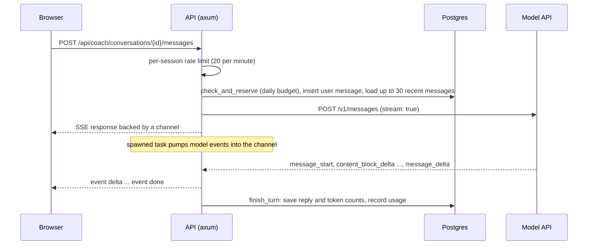

Design an AI tutor for a free learning platform. It should know which lesson or problem the learner is on and what is in their code editor, stream its replies, keep conversation history, generate fresh quizzes, and run and grade mock interviews. The whole product runs on one shared API key, so a single enthusiastic user or a script must not be able to run up an unbounded bill. And it must teach: a tutor that pastes the answer to every exercise defeats the product.

That is this app's AI coach. This lesson designs it the way you would in an interview or a design review (requirements, numbers, architecture, deep dives, failure modes) and checks each decision against the code in `crates/core/src/ai/` and `crates/api/src/routes/`, including the places where a reviewer would push back. It ends by showing how the same reasoning changes for a documentation chatbot and a coding copilot.

## The numbers

Start with tokens, because tokens are latency and money. The coach's system prompt is assembled per turn from these parts (sent as two blocks, for reasons the caching section explains):

| Part | Size | Changes |
|---|---|---|
| Persona and teaching rules | ~350 tokens | On deploy |
| Curriculum map (every track and module title) | ~500 tokens | On deploy |
| Current lesson body, or problem statement plus hints | Up to ~24 KB (about 6,000 tokens) | When the learner moves |
| Editor contents | Up to 12 KB (about 3,000 tokens) | Whenever the learner types |
| Progress summary | ~50 tokens | Occasionally |

On top come up to 30 previous messages of history. A typical turn on a lesson is about 8,000 tokens of system prompt, 3,000 of history and 700 of output. Thinking tokens, when the model reasons before answering, are billed as output, so the effort setting is also a cost setting.

Price that at illustrative frontier-model rates of $5 per million input tokens and $25 per million output tokens, with cache reads at about a tenth of the input price and 5-minute cache writes at 1.25 times it:

| Turn | Input | Output | Total |
|---|---|---|---|
| No caching | 11,000 × $5/M = $0.055 | 700 × $25/M = $0.0175 | $0.073 |
| System prompt read from cache | 8,000 × $0.50/M + 3,000 × $5/M = $0.019 | $0.0175 | $0.037 |
| System prompt written to cache | 8,000 × $6.25/M + 3,000 × $5/M = $0.065 | $0.0175 | $0.083 |

At 2,000 daily coach users averaging 8 turns, that is 16,000 turns a day, somewhere between about $600 and $1,300 depending almost entirely on the cache hit rate. Caching is the largest single lever in the design, which is why the prompt layout comes first.

## The architecture



There is no official Rust SDK, so `crates/core/src/ai/anthropic.rs` is a small typed client over HTTP that covers exactly what the app uses: streamed text and one-shot JSON-schema responses. Four products sit on it: the coach, quiz generation, mock interviews and the roadmap personaliser. Every model call goes through the budget service first.

## Laying out the prompt for caching

Prompt caching is KV-cache reuse across requests. During prefill, the model computes attention keys and values for every prompt token ([Context windows and the KV cache](/learn/ai-and-llms/how-llms-work/context-windows-and-kv-cache)). If a later request starts with a byte-identical prefix, the provider can load those keys and values instead of recomputing them, which cuts both the price of those tokens and the time to first token.

```viz
{"type": "ml", "algorithm": "kv-cache", "text": "The cat sat",
 "title": "Prompt caching reuses the prefill",
 "caption": "Within one generation the cache avoids recomputing earlier tokens. Prompt caching keeps a prefix's keys and values across requests, so a byte-identical prefix is not prefilled again."}
```

The rules follow from the mechanism. The match is an exact prefix match, in render order: tools, then system, then messages. You mark the end of a cacheable prefix with a `cache_control` breakpoint (Anthropic allows up to four per request). An entry lives for about five minutes by default, refreshed on every hit, with a one-hour option at a higher write price. Prefixes below a model-dependent minimum (from a few hundred to a few thousand tokens) are silently not cached, and the response's `usage` reports `cache_read_input_tokens` and `cache_creation_input_tokens` so you can check.

The first version of the coach built the whole system prompt as one string in a `system_prompt` builder in `coach.rs`, ordered by stability, and said so in a comment:

```rust
let mut s = String::with_capacity(16_000);
s.push_str(COACH_PERSONA);
s.push_str("\n\n# Curriculum map\n");
// ... one line per track with its module titles ...
// Volatile context goes last so the prefix above stays cacheable.
s.push_str("\n# Current context\n");
// ... lesson body or problem statement and hints, then editor contents, then progress
```

The client sent it as a single system block marked for caching, with adaptive thinking and an effort level:

```json
{
  "model": "<AI_MODEL>",
  "max_tokens": 4000,
  "system": [
    {"type": "text", "text": "You are the Ascend coach: ...\n\n# Curriculum map\n...\n\n# Current context\n...", "cache_control": {"type": "ephemeral"}}
  ],
  "messages": [{"role": "user", "content": "..."}, {"role": "assistant", "content": "..."}, {"role": "user", "content": "Why does my loop never terminate?"}],
  "thinking": {"type": "adaptive"},
  "output_config": {"effort": "medium"},
  "stream": true
}
```

A design review found the ordering right and the breakpoints wrong. Because the system prompt was one block, its only breakpoint was at the very end, after the editor contents. A cache hit therefore needed the *entire* system prompt, code included, to match one sent in the last few minutes. Two questions in a row about the same lesson with an unchanged editor hit. A learner who edited code between questions missed every time, and each miss paid the 1.25× write premium: in the table above, that learner's turns cost more than they would with caching switched off. The conversation history had no breakpoint, so it was reprocessed at full price on every turn. And although the client parsed `cache_read_input_tokens` and `cache_creation_input_tokens` from the stream, only input and output tokens were persisted, so none of this could be seen on a graph.

The current code splits the builder in two. `stable_prompt()` returns the persona and curriculum map, identical for every learner and every turn; `context_prompt()` returns the lesson or problem, the editor contents and the progress summary. The client's `Request` gained two fields, `context` and `cache_conversation`, and renders a coach turn like this:

```json
{
  "model": "<AI_MODEL>",
  "max_tokens": 4000,
  "system": [
    {"type": "text", "text": "You are the Ascend coach: ...\n\n# Curriculum map\n...", "cache_control": {"type": "ephemeral"}},
    {"type": "text", "text": "# Current context\n..."}
  ],
  "messages": [{"role": "user", "content": "..."}, {"role": "assistant", "content": "..."}, {"role": "user", "content": "Why does my loop never terminate?"}],
  "thinking": {"type": "adaptive"},
  "output_config": {"effort": "medium"},
  "cache_control": {"type": "ephemeral"},
  "stream": true
}
```

There are now two breakpoints. The explicit one closes the stable block, so the persona and curriculum map are a prefix shared across users as well as turns. The top-level `cache_control` is automatic caching: the API places a breakpoint on the last message and moves it forward as the conversation grows, so turn N+1 reads turns 1 to N from cache and writes only the newest exchange. The volatile context block sits between the two with no marker of its own, and every turn's cache reads and writes are now logged and stored (see the next two sections).

Review the fix the same way. Render order is system, then messages, so the conversation's cached prefix *includes* the context block. A learner who asks follow-ups without touching the editor now reads almost the whole prompt from cache and writes only the newest exchange: about $0.010 of input per turn at the rates above, against $0.019 before. A learner who edits before every question still reads only the stable block (under a thousand tokens, which is above the minimum cacheable length on current models and below it on some older ones, so check the counters) and rewrites the context and history at the write premium: about $0.064 of input per turn, barely better than the old $0.065. Moving the editor snapshot out of the system prompt and into the latest user turn, so that an edit changes only the newest message, would fix that case too, at the cost of old snapshots accumulating in history (attach one only when the code changed). The general lesson: stable-first ordering is necessary but not sufficient. Put a breakpoint at each stability boundary, know which volatile part sits inside which cached prefix, and let the usage counters, not the comment in the code, tell you whether it works.

## Streaming replies over Server-Sent Events

A 700-token reply generated at, say, 50–100 tokens per second takes 7–14 seconds to finish. Streaming makes the first words appear as soon as the prefill (and any thinking) is done, and time to first token is the latency users perceive. The coach uses Server-Sent Events: a long-lived HTTP response of `text/event-stream`, one-directional, which is all a chat reply needs ([Real-time transports](/learn/networking/application-protocols/real-time-transports) compares it with WebSockets).

The important design choice is who owns the reply. In `routes/coach.rs`, the handler prepares the turn, opens the upstream stream, and hands it to a spawned task; the HTTP response only reads from a channel (a Tokio `mpsc` with capacity 64):

```rust
let (tx, rx) = sse::channel();
let coach = state.coach.clone();
// The spawned task outlives the request; `.instrument` carries the request
// span (method, path, request id) into its logs.
state.tasks.spawn(
    async move {
        futures::pin_mut!(upstream);
        let (reply, usage, error) = sse::pump(upstream, &tx).await;
        if let Some(e) = &error {
            tracing::warn!(error = %e, conversation = %conv.id, "coach stream error");
        }
        tracing::info!(
            conversation = %conv.id,
            input_tokens = usage.input_tokens,
            output_tokens = usage.output_tokens,
            cache_read_tokens = usage.cache_read_input_tokens,
            cache_write_tokens = usage.cache_creation_input_tokens,
            "coach turn complete"
        );
        if let Err(e) = coach.finish_turn(user.id, conv.id, reply, usage).await {
            tracing::error!(error = %e, "failed to persist coach reply");
        }
    }
    .instrument(tracing::Span::current()),
);
Ok(sse::respond(rx))
```

Three parts of that block came from review. The first version spawned the bare `async move` block, and a spawned task does not inherit the caller's tracing span, so "coach stream error" and "failed to persist coach reply" were logged without a request ID and could not be joined to the request that caused them. `.instrument(tracing::Span::current())` attaches the handler's span to the task. The `coach turn complete` event is the second addition: one structured line per turn with all four usage counters, which is what makes the cache hit rate visible. The third is where the task is spawned. It was a bare `tokio::spawn`, so nothing tracked it. Graceful shutdown waits for open connections, but a learner who has closed the tab has no connection, so on a deploy the process could exit while that task was still generating, and the reply the design exists to save was dropped unsaved. `state.tasks` is a `TaskTracker` from `tokio-util`: on shutdown `main` closes it and waits up to 30 seconds for tracked tasks to finish persisting, bounded so a hung upstream cannot block the deploy. The rule generalises beyond Rust: work that outlives its request must be handed its context explicitly, and the shutdown path must know it exists.

Inside `pump`, each upstream event is appended to the full reply and forwarded with `let _ = tx.send(ev).await;`. If the browser disconnects, the receiver is dropped and `send` fails immediately; the error is deliberately ignored and the loop keeps consuming the model's stream, so `finish_turn` still saves the complete reply and records its tokens. A learner who closes the tab mid-answer finds the whole answer when they come back. The trade-off is explicit: generation continues, and is billed, after the user has left. For a tutor, keeping an answer worth a few cents is the right call; for inline autocomplete, where abandoned requests are the norm, you would cancel upstream on disconnect instead.

The details around it matter as much:

- **Events.** The browser receives `delta` events with text, then exactly one `done` (carrying input tokens, output tokens and stop reason as JSON) or `error`. The client guarantees its stream always ends with one of the two.
- **Keep-alives.** A `ping` comment every 15 seconds stops proxies and load balancers from closing an idle connection. That matters here because the client forwards only text deltas: while the model is thinking, the browser sees nothing but keep-alives.
- **Partial failure.** The user's message is saved before the model is called. If the stream fails midway, whatever text arrived is still saved; if it fails before any text, the conversation is left with two user messages in a row. The next turn passes history through `collapse_roles`, which merges consecutive same-role messages so the API's alternation rule holds.
- **Accounting gaps.** The output-token count arrives in the stream's final event, so a stream that dies midway records no output tokens for that turn, and one that ends in an error records no input tokens either. The request slot was already reserved, so the budget still counts the request.

## Budgets and rate limits

Two independent layers protect the shared key.

**Per-session rate limiting** stops bursts and scripts. Every route that calls the model (a coach message, quiz generation, roadmap suggestions, interview turns) passes through an in-memory keyed limiter (the `governor` crate, which implements GCRA and behaves like a token bucket) allowing 20 requests per minute per session: a burst of 20, then one more every three seconds. The key is a digest of the session cookie, falling back to the client IP when there is none, so learners sharing one office or campus address do not throttle each other; reading history or listing conversations does not touch this bucket. It lives in process memory, which is right for a single instance and resets on deploy; the code comments note it would move to Redis if the API scaled out. [Rate limiting algorithms](/learn/networking/network-algorithms/rate-limiting-algorithms) covers the family.

```viz
{"type": "system", "algorithm": "token-bucket", "requests": 10,
 "title": "Burst capacity and refill rate",
 "caption": "Capacity sets the largest burst, refill sets the sustained rate. The coach's per-session limiter is the same shape: 20 requests of burst, refilled at one every three seconds."}
```

**Per-user daily budgets** cap cost. The `ai_usage` table has one row per user per UTC day with request, input-token and output-token counters, plus prompt-cache read and write counters. The defaults, configurable by environment variable, are 120 requests, 2,000,000 billed input tokens and 60,000 output tokens a day (production raises the request and output caps to 150 and 120,000 in `.railway/railway.ts`). Every model call first runs `check_and_reserve`, one conditional upsert that counts the request only while the user is under every limit:

```sql
INSERT INTO ai_usage (user_id, day, input_tokens, output_tokens, requests)
VALUES ($1, $2, 0, 0, 1)
ON CONFLICT (user_id, day) DO UPDATE
   SET requests = ai_usage.requests + 1
 WHERE ai_usage.requests < $3
   AND (ai_usage.input_tokens + ai_usage.cache_write_tokens * 5 / 4 + ai_usage.cache_read_tokens / 10) < $4
   AND ai_usage.output_tokens < $5
RETURNING requests
```

No returned row means over budget, and the call fails with a rate-limit error that says when the budget resets, both in its message and as a `Retry-After` header counting down to the next UTC midnight. After the reply, `record(user, usage)` adds the actual counts (input, output, cache reads, cache writes) with a plain increment upsert. Each is one statement inside the database, so concurrent requests cannot lose each other's updates the way a read-modify-write in application code would, and the first request of the day creates the row. Postgres rather than Redis is a deliberate fit: the limit is per day, not per millisecond, the counts must survive restarts, and one file (`budget.rs`) owns the whole policy.

The first version of this code drew three review comments. Two led to fixes, one of which needed a second round; one is a trade-off worth stating.

1. **The check and the increment were separate statements.** `check_and_reserve` used to read today's row, compare it with the limits, then run the increment upsert. Several concurrent requests from a user at 119 could all pass the check before any increment landed, overshooting by the user's concurrency. The conditional upsert above closes the gap: concurrent reservations queue on the row lock, and each re-evaluates the `WHERE` clause against the latest committed counts. The fix shipped with proof, `ai_budget_reservation_cannot_be_overshot_by_concurrency` in `crates/api/tests/api.rs`, which fires 30 reservations at once against a limit of 10 and asserts that exactly 10 succeed. The lesson: an atomic increment is not an atomic check-and-increment.
2. **The token check is pre-flight** (unchanged, and deliberate). A request that starts below 60,000 output tokens can end above it by up to its `max_tokens` (4,000 for a coach turn). That is fine for a soft cost cap. A hard cap would reserve `max_tokens` up front and refund the unused part.
3. **Input tokens were recorded but not limited, and cache tokens were not recorded at all.** The output cap bounds output spend at 60,000 × $25/M = $1.50 per user per day, but a long conversation can send tens of thousands of input tokens per request, so the request cap was the only ceiling on input spend. The fix added `AI_DAILY_INPUT_TOKENS` as a third condition in the reservation (2,000,000 input tokens is about $10 a day at the rates above) and two cache columns, `cache_read_tokens` and `cache_write_tokens`, through a new migration, `m0006_ai_usage_cache_tokens`, rather than an edit to the one that created the table. ADR 0004 now names a falling cache hit rate in those columns as a reason to revisit the design. That fix needed a second round. The limit first compared against the API's `input_tokens`, which counts only *uncached* input, and the same change turned on conversation caching, which moves nearly all of a chat's input into cache reads and writes. The limit barely moved while cache writes, billed at 1.25× the input price, went uncounted. The reservation now compares *billed* input, the expression in the SQL above: cache writes weighted 1.25 and reads 0.1, so the limit counts roughly what the invoice does. `cache_writes_count_against_the_input_budget_and_the_refusal_says_when_to_retry` records 90,000 cache-write tokens with no uncached input and checks that the next request is refused. A single budget in money, computed from all four counters with each model's prices, would go one step further and survive a change of model.

Small cost controls appear elsewhere too: a mock interview that ends with fewer than two candidate turns is marked abandoned without calling the grader at all, and user messages are capped at 8,000 characters.

## Structured outputs for quizzes and grading

Quizzes and interview grades are consumed by code, so both use one-shot calls with a JSON schema in `output_config.format` ([Structured outputs and tool use](/learn/ai-and-llms/building-with-llms/structured-outputs-and-tool-use)).

- **Quiz generation** (`quiz.rs`) sends up to 30,000 characters of the lesson inside `<lesson>` tags with a system prompt demanding four options per question, exactly one correct index, at least one scenario question and explanations that address the most tempting wrong option. The requested count is clamped to 3–10. After parsing, questions whose answer index is out of range are dropped, and an empty result is an error.
- **Interview grading** (`interview.rs`) uses a schema whose `verdict` is an enum (`strong_hire`, `hire`, `lean_hire`, `lean_no_hire`, `no_hire`) with per-dimension scores and notes, strengths, improvements and next steps. It runs at high effort, because grading is judgement-heavy and the user waits for it once, at the end; the coach's chat turns run at medium effort because they are interactive. The overall score is clamped to 0–100 after parsing, since the schema cannot express a range. The transcript reaches the grader as JSON lines, one object per turn with a role assigned by the platform, so a candidate cannot forge an interviewer turn by typing one: newlines and quotes in their text stay inside a JSON string.

The client also maps failure modes to user-facing errors: a `refusal` stop reason becomes "the model declined this request", HTTP 429 becomes a try-again-shortly rate-limit error with a 30-second `Retry-After`, 529 and 503 become "the provider is overloaded", 401 and 403 become "the AI coach is temporarily unavailable", and other failures become a 502 with a short message while the provider's error body goes to the logs. (An earlier version echoed the first 200 characters of a 400 body to the client. Provider errors can quote request content, so the body is now logged and never forwarded.) The same rule took a second fix for failures *inside* a stream: an `error` event from the provider, or a dropped connection, used to reach the browser as the provider's own text. Now the text is logged and the learner sees a classified sentence such as "The AI provider is overloaded, so the reply stopped early. Try again shortly." instead of the provider's words.

## Policy: hints, not solutions

The coach's most important behaviour is pedagogical, and it is enforced in two different ways.

**Structurally, it cannot leak what it never sees.** The content loader strips quiz answers and explanations from lesson bodies, and splits each practice problem's editorial (everything from `## Solution` on) away from its statement. The coach's context gets the public lesson body and the problem statement, never the reference solution or the answer key.

**By instruction, it declines to write solutions.** The persona says: "Never hand over a full solution to an exercise or practice problem the learner is working on. Give the next hint, the invariant, or the question that unblocks them. If they explicitly say they have given up, give the approach in prose first, then code." On a problem page, the context adds the author's hints with an instruction to reveal them one at a time, only when asked, and repeats the rule right after the hints.

An instruction is a probability, not a guarantee: the model can solve most problems itself, and a persistent learner can talk it round. That is acceptable here because the only person harmed is the learner doing the talking, the opposite of a security boundary, where [LLM security](/learn/ai-and-llms/building-with-llms/llm-security) says instructions must never be the control. The same model runs under different policies elsewhere: the mock interviewer is told never to reveal the solution, while the assistant available in AI-assisted interviews is explicitly allowed to write code, because directing and checking an assistant is what that format tests. The policy is measurable, too: [Evals and observability](/learn/ai-and-llms/building-with-llms/evals-and-observability) sketches an eval that runs any code in a coach reply against the problem's own tests.

## Failure modes and degradation

- **No API key configured:** the coach reports itself disabled and the rest of the product works normally.
- **Budget exhausted:** a clear error that says when the limit resets (midnight UTC).
- **Provider overloaded or rate limiting:** mapped to retry-later messages. Nothing retries a turn automatically: the server's model client has no retry loop, and the browser's automatic retries (at most two, honouring `Retry-After`) apply only to reads, not to the POST that starts a turn. One jittered retry *before the first byte* would be safe and cheap; after streaming has started, a retry would duplicate text, so the turn should fail instead.
- **Slow provider:** a 10-second connect timeout and a 180-second overall request timeout, which also bounds the longest possible streamed reply.

## Generalising: a docs chatbot and a coding copilot

The same questions (what is in the context, what does a token cost, what latency does the user perceive, what caps the spend, what must never happen) give different answers for other products.

| | AI coach (this app) | Docs chatbot | Inline coding copilot |
|---|---|---|---|
| Latency that matters | First token in a few seconds | First token in a second or two | Whole suggestion in a few hundred milliseconds, or it is useless |
| Context | Lesson or problem, editor, progress, history | Retrieved chunks with citations | Code around the cursor plus ranked snippets from related files |
| Model | Large, reasoning at medium effort | Mid-size to large, plus retrieval | Small and fast, trained for fill-in-the-middle; larger model for chat |
| Caching | Stable system prefix | Stable system prompt; answer cache for frequent questions keyed on tenant and document version | Prefix reuse per file; cancel stale requests |
| Cost control | Per-user daily budget and per-session limit | Per-tenant quotas; answer cache | Debounce keystrokes and cancel in-flight requests as the user types |
| Worst failure | Handing over solutions | A confident answer the docs do not support | A suggestion that arrives after the user has moved on |

Two traps are specific to these designs. A **semantic answer cache**, which reuses an answer for a question that embeds close to a previous one, will eventually serve "refunds for US orders" to someone who asked about EU orders, and across tenants it leaks; key caches on the exact normalised question, tenant and document version unless you have measured the risk. And for a **copilot**, most requests are wasted by design, because the user keeps typing: cancellation and debouncing are the cost model, not an optimisation.

## Senior signals

- You start an LLM design from **token arithmetic**: what is in the context, what each turn costs, and how much the cache hit rate swings the bill.
- You lay prompts out **stable first, volatile last**, place cache breakpoints at stability boundaries, and verify hits with the usage counters rather than assuming them.
- You decide **who owns a streamed reply**: a spawned task that persists it survives disconnects at the price of paying for abandoned generations, and you can say when to make the opposite choice.
- You layer **rate limits for bursts and budgets for cost**, use atomic upserts for counters, and know where check-then-increment overshoots.
- You use **schema-constrained output** for anything code consumes and still validate the invariants the schema cannot express.
- You separate **policies enforced by construction** (the coach never sees solutions) from **policies enforced by instruction** (it declines to write them), and you only accept the latter where the harm is contained.

## Check yourself

```quiz
- q: >-
    The coach sends a cached stable system block (persona and curriculum map), then an uncached context block that includes the editor contents, then the history, with top-level automatic caching on the last message. A learner edits their code before every question. What does each turn read from cache?
  options: ["Only the stable block, because the edit changes the prefix under the history breakpoint", "Nothing, because a change anywhere in the system prompt invalidates all of its breakpoints", "Everything, because the context block has no cache_control marker of its own", "Only the history, because automatic caching skips the system prompt entirely"]
  answer: 0
  explanation: >-
    Caching is an exact prefix match in render order, system then messages. The explicit breakpoint after the stable block still matches, so that part is read. The automatic breakpoint on the last message covers the context block too, so a code edit changes that prefix and everything after the stable block is written again at the write premium. Moving the editor snapshot into the latest user turn would keep the history prefix stable.
- q: >-
    Why does the coach run the model stream in a spawned task that writes to a channel, instead of streaming directly from the request handler?
  options: ["SSE responses must be written from a separate OS thread, not from the handler", "Spawned tasks run on a faster executor, so tokens reach the browser sooner", "So the reply is still consumed and saved if the browser disconnects midway", "To avoid holding a database connection open for the length of the stream"]
  answer: 2
  explanation: >-
    If the handler owned the stream, a disconnect would drop it and lose the reply. The task, not the HTTP response, owns persistence: it keeps reading after the receiver is gone and calls finish_turn. Speed has nothing to do with it; the tokens arrive no faster. The cost is paying for generations nobody is watching.
- q: >-
    The first version of the daily budget read today's usage, checked it against the limit, then incremented the request counter with an atomic upsert. What could still happen?
  options: ["The counter could go negative when a refund raced with a new reservation", "Nothing, because the atomic upsert made the check and the increment atomic", "Lost updates: two concurrent increments could overwrite each other's counts", "Concurrent requests could all pass the check before any increment landed"]
  answer: 3
  explanation: >-
    The upsert made each increment atomic, so no update was lost, but the check was a separate read, so requests in flight together could all pass it and overshoot the limit by their number. The current check_and_reserve is a conditional upsert that increments only while under every limit and returns a row only if it did, and a 30-way concurrency test against a limit of 10 proves it.
- q: >-
    The daily input limit first compared against the API's input_tokens, and conversation caching was switched on in the same change. Which cost did that leave without a direct cap?
  options: ["Uncached input, because input_tokens counts only the prompt tokens read from cache", "Prompt-cache writes, which input_tokens leaves out and which bill at 1.25x input", "Output spend, because output tokens were recorded but never compared with a limit", "Thinking tokens, because they bill as input and are reported in no counter at all"]
  answer: 1
  explanation: >-
    input_tokens counts only uncached input; the API reports cache writes and reads separately, and with caching on nearly all of a chat's input moves into those two counters. The fix counts billed input in the reservation: cache writes weighted 1.25 and reads 0.1. Output was always a condition in the WHERE clause, and thinking tokens bill as output, not input.
- q: >-
    The coach never sees a problem's editorial solution, and its prompt also tells it not to write solutions. Why keep both mechanisms?
  options: ["Stripping exists only to keep the prompt short, not to protect the answers", "Stripping hides the reference; the instruction curbs solutions the model writes", "They are redundant, so either one could be removed without changing any behaviour", "The instruction keeps the prompt stable, which the prompt cache depends on"]
  answer: 1
  explanation: >-
    Construction removes what the model can leak: the reference solution never reaches it. Instruction shapes what it chooses to generate, and no amount of stripping prevents the model from solving the problem unaided, so neither mechanism makes the other redundant. Relying on the instruction is acceptable only because a determined learner can harm only their own learning.
- q: >-
    You are designing inline code completion. Which cost control matters most?
  options: ["A larger model at high effort, so fewer suggestions are rejected", "Persisting every completion in a spawned task so none is wasted", "A per-user daily token budget alone, enforced before each completion", "Debouncing keystrokes and cancelling requests the user has typed past"]
  answer: 3
  explanation: >-
    Most completion requests are made obsolete by the next keystroke. Debouncing and cancellation remove that waste; persisting completions the user has already typed past, as the coach does with chat replies, would pay for exactly the work you want to avoid.
```
