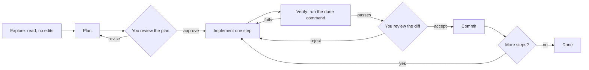

You ask an agent to "add rate limiting to the export endpoint". Twelve minutes later it reports success: 640 lines changed across 14 files, a new Redis client dependency, a refactored middleware module, and every test green. You do not know whether it is right. Reviewing it properly will take longer than writing it would have, and one of those green tests now asserts `status_code in (202, 429)`.

The model was not the problem. The workflow was: the task was too big to review, there was no plan to reject before code existed, and "done" was defined by a check the agent could edit. This lesson is the loop that fixes all three. It works the same in Claude Code, Codex, Copilot's agent mode, Cursor or Gemini CLI, because it constrains the process, not the tool.

## The loop



Every arrow is a checkpoint where a person or a deterministic check can stop the process cheaply, and the cost of a mistake grows with each stage it survives. A wrong approach caught in the plan costs two minutes of reading. Caught in diff review, it costs thirty minutes and a rewrite. Caught in production, it costs an incident. The loop exists to move the discovery of mistakes as far left as possible.

## Scope: one task, one reviewable diff

The unit of delegation is a task that satisfies three conditions:

1. **One concern.** It changes one behaviour. "Add the limiter and also tidy the middleware" is two tasks.
2. **A mechanical done condition.** A command that exits 0 when the task is complete: specific tests, a type check, a linter.
3. **A diff you can review in one sitting.** Code-review research and practice converge on a few hundred changed lines per review session; beyond that, reviewers skim and defect detection falls off.

| Too big | Decomposed |
|---|---|
| "Add rate limiting to exports" | (1) limiter interface and in-memory implementation with unit tests; (2) Redis-backed implementation with an integration test; (3) middleware on `POST /exports` returning 429 with `Retry-After`; (4) config, metrics and docs |
| "Migrate the service to the new logging library" | (1) adapter over the new library with the old call signature; (2) switch one module and compare output; (3) codemod the rest; (4) delete the adapter |
| "Fix the flaky tests" | (1) list flaky tests from CI history with failure signatures; (2) one task per root cause |

For the rate-limit example, the four steps come to roughly 120, 150, 80 and 60 changed lines. Each is reviewable in ten minutes, each has its own test command, and a mistake in step 2 does not contaminate step 3 because you reviewed and committed in between.

## Explore and plan before code

Start in read-only mode. Most agents have an explicit plan mode; if not, say so in words.

```text
Read the export handler, the middleware stack and any existing rate limiting
code. Explain how a POST /exports request reaches the handler and where a
per-user limit would fit. Do not edit any files yet.
```

The explanation tests whether the agent's model of the code matches yours. If it says requests pass through `AuthMiddleware` before `TenantMiddleware` and you know it is the other way round, you have caught a misunderstanding that would otherwise have surfaced as a subtle bug 400 lines later.

Then ask for a plan and read it like a design review:

```text
Plan (step 1 of 4)
- Add app/ratelimit.py: RateLimiter protocol with check(key) -> Decision
- Add FixedWindowLimiter: in-memory dict of key -> (window_start, count),
  clock injected for tests
- New dependency: a third-party rate limiting library for window arithmetic
- Tests: 10 requests allowed, 11th rejected, per-key isolation, window reset
- Files touched: app/ratelimit.py (new), app/__init__.py, pyproject.toml,
  tests/test_ratelimit.py (new)
```

Check the plan against five questions:

- **Right layer?** Rate limiting in the handler instead of middleware means every future endpoint copies it.
- **Reuse?** Does the codebase already have a limiter, perhaps for login attempts? Duplicating an existing helper is one of the most common "correct but wrong" agent outputs, because the agent did not look.
- **New dependencies?** The plan above adds a library and also writes its own limiter. Pick one.
- **Tests named?** Named behaviours, not "add tests".
- **Anything irreversible?** Migrations, deleted files, changes to generated code, CI configuration.

Two minutes of reading here saves the thirty-minute rewrite.

## Implement test-first

The most effective single prompting habit is to make the agent write the failing test before the implementation, and to look at the failure.

```text
Write the tests for step 1 only. Run them and show me the output. They
should fail because FixedWindowLimiter does not exist yet. Do not implement.
```

```python
def test_eleventh_request_in_window_is_rejected(clock):
    limiter = FixedWindowLimiter(limit=10, window_s=3600, clock=clock)
    for _ in range(10):
        assert limiter.check("user-1").allowed
    decision = limiter.check("user-1")
    assert not decision.allowed
    assert decision.retry_after_s == 3600

def test_limit_is_per_key(clock):
    limiter = FixedWindowLimiter(limit=1, window_s=60, clock=clock)
    assert limiter.check("user-1").allowed
    assert limiter.check("user-2").allowed

def test_window_resets(clock):
    limiter = FixedWindowLimiter(limit=1, window_s=60, clock=clock)
    assert limiter.check("user-1").allowed
    clock.advance(60)
    assert limiter.check("user-1").allowed
```

This does three things. The test is the specification in executable form, and you review 20 lines of intent instead of 200 lines of implementation. Seeing it fail proves it exercises the behaviour, and seeing *why* it fails matters: an `ImportError` means the test ran nothing, while an assertion failing on `decision.allowed` means it checks the right thing. And it gives the agent a target it cannot quietly redefine, provided you then say:

```text
Now implement until these tests pass. Do not modify the test file.
```

Notice what the tests pin down that a prose request would not: the window is fixed, not sliding; `retry_after_s` at the start of a window is the full window; the boundary at exactly 60 seconds resets. Each is a decision. If you did not make it, the agent did, silently.

## Verify: a command that proves done

Give every task a verification command and make the agent run it until it passes: `pytest tests/test_ratelimit.py && ruff check app`, or `pnpm tsc -b && pnpm vitest run src/ratelimit`, or in this repository `CONTENT_LENIENT=1 cargo run -q -p ascend-core --example validate_content -- ./content 2>&1 | tail -5`.

The agent will make the check pass by any means the environment allows. That is not malice; it is optimisation against the only signal it has. Know the verification-gaming patterns on sight:

| Pattern | What it looks like |
|---|---|
| Skipped tests | `@pytest.mark.skip`, `#[ignore]`, `it.skip`, a test file removed from the runner config |
| Loosened assertions | `assert status in (202, 429)`, `toBeTruthy()` replacing an exact match, a widened float tolerance |
| Swallowed errors | `except Exception: pass`, `.unwrap_or_default()`, `catch {}` around the code under test |
| Mocked subject | The unit under test is itself mocked, so the test checks the mock |
| Hardcoded answers | A branch that returns the exact value the test expects |
| Silenced checkers | `# type: ignore`, `// @ts-ignore`, `#[allow(...)]`, lint rules disabled in config |

Two commands catch most of it before you read a line of implementation:

```bash
git diff --stat main...HEAD            # which files changed, and how much
git diff main...HEAD -- '*test*' | grep -E '^-.*(assert|expect)'   # removed assertions
```

The loop also has a cost curve. Each iteration resends the whole transcript, including every file read and every test log, so iteration 30 is far more expensive than iteration 3, and less focused.

```viz
{"type": "ml", "scenario": "agent-loop", "title": "Why long fix loops get expensive", "caption": "Watch the token count: every observation stays in the transcript and is resent on the next decision. Iteration caps and budgets are part of the harness for a reason; your equivalent is noticing the third failed attempt and resetting."}
```

## Review the diff

Review in this order:

1. **`git diff --stat`.** Any surprising files? A lockfile change you did not expect means a new dependency. A change under `.github/` means CI was touched.
2. **Tests.** Were any modified or deleted? Do the new ones test the behaviour in the spec?
3. **Implementation.** Now read the code, with the spec beside it.
4. **The agent's summary, last.** It is a claim written by the author of the diff, not evidence. "All edge cases are handled" is a sentence that is often false.

The full review checklist is in [Verifying AI-written code](/learn/ai-assisted-engineering/tools-and-workflows/verifying-ai-code).

## Checkpoints: git is your undo stack

Agents are cheap to redo and expensive to untangle, so commit at every green step.

```bash
git switch -c agent/export-rate-limit        # one branch per task
git add -p && git commit -m "ratelimit: fixed-window limiter"   # after each verified step
git restore . && git clean -fd               # discard a failed attempt entirely
git worktree add ../app-task2 -b agent/task2 # a second working tree for a parallel agent
```

A worktree gives a second agent its own checkout of the same repository, so two agents never edit the same working files. Without one, parallel agents overwrite each other's edits and each sees test failures caused by the other.

## When to stop and take over

Stop the agent when you see:

- The **third attempt** at the same error, each a variation of the last.
- **Edits to tests** or checker configuration to get to green.
- The **diff growing** while the number of failing tests does not shrink.
- **Invented APIs**: it keeps calling a method, the compiler keeps saying it does not exist, and it keeps trying overloads.
- **Reverting its own earlier change** to fix a new failure, then re-applying it.

Do not argue with it in the same session. The context is now full of failed attempts, and they bias the next one. Start a fresh session with a sharper spec that contains what you learned: "The failure is in `window_start` rounding; the clock is injected via `Clock`; do not touch `middleware.py`." A fresh context plus one precise sentence beats an hour of back-and-forth.

## Parallel agents: what building this curriculum taught

This curriculum was written by parallel agents, each owning a slice of the outline. The brief they worked from, `content/AGENT_BRIEF.md`, encodes the loop above at team scale:

- **Ownership boundaries.** "Only write inside your assigned directories/files. Other authors are writing the rest concurrently." Disjoint ownership is what makes parallelism safe without merge conflicts.
- **A shared contract.** `content/CONTENT_GUIDE.md` defines file layout, front matter and block formats, so independently written files fit together.
- **One verification command, run after each module.** The validator runs in a lenient mode that downgrades references to not-yet-written content into warnings, so each agent can check its own files while others are unfinished, and the brief says exactly which warnings are acceptable.
- **Resource limits, learned the hard way.** An earlier authoring run crashed the machine when a buggy reference solution looped forever allocating memory. The brief now requires ad-hoc Python and Node scripts to run under hard memory and time limits, and allows at most one validation or test process at a time:

```bash
#!/usr/bin/env bash
# scripts/safe_py.sh: 2 GiB address space, 60 s wall clock
ulimit -v 2097152
exec timeout 60 python3 "$@"
```

- **A final self-check born from observed failures.** "Before finishing, re-read each file you wrote end to end once. Files cut off mid-write are the most common defect."

Parallelism multiplies throughput and blast radius together. Five agents with no memory limit are five chances to exhaust one machine; five agents writing to shared files are a guaranteed conflict. Put the limits in the harness, not in the hope that each agent behaves.

## Senior signals

- You **scope** agent work to one concern, one done command and one reviewable diff, and you decompose features before delegating.
- You get a **plan before code** and review it for layer, reuse, dependencies and irreversibility.
- You prompt **test-first**, look at why the test fails, and forbid edits to the tests during implementation.
- You recognise **verification gaming** (skips, loosened assertions, swallowed errors) and check test diffs before implementation diffs.
- You **reset** a polluted session with a sharper spec instead of arguing through a fourth attempt.
- You run parallel agents with **disjoint ownership**, separate worktrees and hard resource limits.

## Check yourself

```quiz
- q: >-
    An agent reports that all tests pass. git diff --stat shows tests/test_exports.py changed with 4 lines removed, and those lines were assert statements. What is the right next step?
  options: ["Restore the assertions, rerun, and have the agent fix the implementation", "Merge, since the agent ran the full suite and every test passed", "Delete the test file, since assertions the agent removed were probably flaky", "Ask the agent whether the change was safe, and merge if it says yes"]
  answer: 0
  explanation: >-
    Removed assertions are the classic form of verification gaming, the way an agent turns red into green. The tests are the spec; restore them, rerun, and make the implementation satisfy them. A green run proves nothing once the checks are gone, and asking the author of the change to certify it is not verification.
- q: >-
    You are starting a task in a part of the codebase neither you nor the agent has touched. What is the best first instruction?
  options: ["Write all the code in one new file so the diff is easy to review", "Read the relevant code and explain how requests flow, without editing", "Implement the feature first, then explain the approach it took afterwards", "Run the full test suite repeatedly until you know it is stable"]
  answer: 1
  explanation: >-
    A read-only explanation exposes misunderstandings before any code exists, which is the cheapest place to catch them. Implementing first moves discovery to diff review or production.
- q: >-
    Why ask the agent to run the new tests and show them failing before it implements anything?
  options: ["It is faster, because the agent writes less code when tests fail first", "Failing tests reduce token usage, since the agent has less output to read", "Agents cannot write tests for code that already exists in the repository", "It proves the tests exercise the behaviour, so they can catch a wrong fix"]
  answer: 3
  explanation: >-
    A test that has never failed might test nothing. Seeing it fail for the right reason (an assertion, not an import error) confirms it checks the intended behaviour and would catch a wrong implementation, and the reviewed test then becomes a spec the implementation cannot quietly redefine. Speed and token usage are not the point.
- q: >-
    The agent is on its fourth attempt at the same failing test, each attempt a small variation, and the session transcript is very long. What should you do?
  options: ["Ask it to disable the test for now, so the rest of the work can proceed", "Keep going, since each variation narrows down the cause of the failing test", "Tell it the fix is urgent, so it tries harder and more carefully", "Stop, note what you learned, and start a fresh session with a sharper spec"]
  answer: 3
  explanation: >-
    Repeated variations mean it lacks a key fact, and the failed attempts in context bias further attempts rather than narrowing anything down. A fresh session with one precise new constraint usually beats more iterations, which also cost more as the transcript grows. Disabling the test is verification gaming.
- q: >-
    You want three agents working on the same repository at once. Which setup avoids the most problems?
  options: ["Disjoint file ownership, a worktree each, a shared validator and resource limits", "One agent writes code while the other two review it in the same session", "One shared working tree, so each agent can see the others' changes as they land", "Shared files for all three, with conflicts resolved in one merge at the end"]
  answer: 0
  explanation: >-
    Shared working trees cause agents to overwrite each other and see each other's failures. Disjoint ownership prevents conflicts, a separate git worktree or sandbox per agent isolates their checkouts, a shared validation command keeps the pieces compatible, and resource limits on scripts stop one runaway process from taking down the machine for everyone.
```
