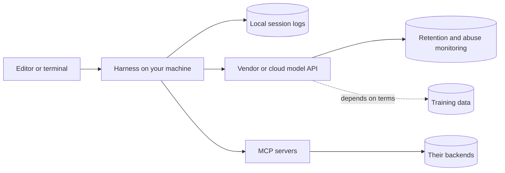

A developer debugging a failed deploy pastes the error into a chat assistant. The error includes the connection string, password and all. Elsewhere, an agent asked to "figure out why the service will not start locally" runs `cat .env` to understand the configuration, and forty production credentials are now in a transcript: on the vendor's side of the API, in a session log in the developer's home directory, and in the screenshot they post to the team channel asking why the agent is being weird.

Nobody did anything malicious. The leak is a side effect of an agent's normal behaviour: it reads files and runs commands to build context, and secrets are files and command output like any other. Security for AI tools is mostly about arranging things so that normal behaviour cannot leak what matters, and about having a policy that tells people what to do before and after it does.

## Where your data goes



Every arrow is a place your code and prompts can persist. For each tool your team uses, you need answers to these questions, from the contract and the vendor's data-usage documentation rather than from a blog post:

| Question | Why it matters |
|---|---|
| Are prompts and code retained, and for how long? | Retained data can be breached, subpoenaed or reviewed |
| Are they used for training? | Your code could influence suggestions to others |
| Which region processes them, and which subprocessors? | Data residency and customer contracts |
| Can admins exclude paths or repositories? | Keeps the most sensitive code out entirely |
| Is there an audit log of usage? | You cannot investigate what you cannot see |
| Where are local transcripts stored? | Plain-text session logs on laptops are a secret store nobody planned |

Consumer and business terms often differ. A developer using a personal account on company code may be under entirely different retention and training terms from the ones your security team approved.

## How secrets get into context

- **The agent reads them.** `.env`, `config/production.yml`, `~/.aws/credentials`, `~/.kube/config`, while exploring or debugging.
- **Command output echoes them.** `env`, `printenv`, `docker inspect`, `kubectl describe pod` (environment variables included), `set -x` in a shell script, HTTP client debug logging that prints headers, stack traces that include connection strings.
- **You paste them.** Logs, `curl` commands with an `Authorization` header, screenshots.
- **The agent writes them.** You paste a key "just to test the integration" and it hardcodes the key into a fixture that gets committed.

Note what is missing from the defences: `.gitignore`. It tells git not to track a file. It does nothing to stop a process from reading it.

## Keeping secrets out: defence in depth

1. **Do not keep long-lived secrets on disk.** Use a secret manager and short-lived credentials (SSO-based CLI sessions, workload identity) so that a leaked value expires. Commit an example file with placeholders; this repository commits `.env.example` and ignores the real ones:

```text
.env
.env.*
!.env.example
```

2. **Deny reads in the harness.** Permission rules such as `Read(./.env)` and `Read(./secrets/**)` stop the file tool. They are useful and not sufficient: a shell command can still `cat` the file unless shell commands are also restricted.
3. **Run autonomous agents in a sandbox** (a container or dev container) that simply does not contain production credentials. What is not there cannot leak.
4. **Scan for secrets** before commit and in CI with tools such as gitleaks or trufflehog, and enable push protection on your code host.
5. **Redact before you paste.** Make it a reflex, or a tool (the exercise below builds one).
6. **Assume leaked, then rotate.** If a secret enters a prompt, treat it as compromised and rotate it the same day. Deleting the conversation does not un-send the request, and retention policies are promises about the future, not about what already happened.

## Worked example: the leak, step by step

Replay the opening scenario as a chain of events, and note which control would have broken each link:

| Step | What happened | Control that breaks the chain |
|---|---|---|
| 1 | Production credentials lived in a `.env` file on the laptop | Short-lived credentials from SSO; production secrets never on developer disks |
| 2 | The agent read `.env` while exploring | A deny rule on `.env*` for the file tool and for shell reads |
| 3 | The agent ran with the developer's full environment | A dev container that holds only local-development credentials |
| 4 | The contents entered the transcript and went to the vendor | Nothing can recall it now; this is where rotation starts |
| 5 | The session log on disk kept a copy | Periodic cleanup of local transcripts; full-disk encryption |
| 6 | A screenshot went to a team channel | Redaction habit; channel retention policies |
| 7 | Nobody rotated because "retention is short" | A written rule: any secret in a prompt is rotated the same day |

Two things stand out. The earliest links are the cheapest to break: a secret that is not on disk cannot be read, sent, logged or screenshotted. And once step 4 has happened, no control can undo the exposure; later controls only limit how many more copies exist, and only rotation makes the secret worthless. That is why the policy has to say so explicitly rather than leave it to judgement at 6 p.m. on a Friday.

## What never to paste

| Category | Examples | Use instead |
|---|---|---|
| Credentials | API keys, tokens, passwords, private keys, connection strings, session cookies | Describe the shape ("a 40-character token"); redact |
| Customer personal data | Names, emails, addresses, payment and health data | Synthetic or properly anonymised samples |
| Production data | Query results, dumps, exported tables | The schema plus generated rows |
| Unpatched vulnerabilities | Exploit details before a fix ships | Only approved tools, per your security team's process |
| Confidential business information | Unreleased financials, acquisitions, unannounced products | Do not |
| Third-party material under NDA | A partner's API docs, a customer's code | Check the contract first |
| Company source code in unapproved tools | Anything on a personal account or an unvetted tool | The approved, contracted tool |

The simple rule: company code goes only into approved tools under business terms; nothing in the first five rows goes into any tool.

## Injection through the repository

Anything the agent reads can instruct it: a README, a code comment, a dependency's documentation, a test fixture, an issue, a web page it fetched. Researchers have demonstrated instructions hidden in agent rules files using invisible Unicode characters, which a human reviewer does not see in a normal diff view and a model reads perfectly well. The same idea applies to any text that ends up in context.

The mechanism is the one you saw with retrieval: text that enters the prompt is supposed to be data, and the model cannot reliably keep it that way.

```viz
{"type": "ml", "scenario": "rag-pipeline", "title": "Retrieved text is data, not instructions", "caption": "Whatever an agent reads (a document chunk, a README, a code comment) is assembled into the prompt beside your instructions. A system prompt saying so reduces the risk; only permissions and sandboxing bound the damage when it fails."}
```

Mitigations:

- Review changes to memory and rules files like code, with a diff view that shows invisible characters.
- Do not auto-approve shell commands in sessions that read untrusted content.
- Evaluate untrusted repositories (an open-source project you are assessing, a candidate's take-home) in a sandbox with no credentials and restricted network access.
- Apply the MCP lesson's rule: break the combination of private data, untrusted content and outbound communication. See [MCP and integrations](/learn/ai-assisted-engineering/tools-and-workflows/mcp-and-integrations) and [LLM security](/learn/ai-and-llms/building-with-llms/llm-security).

## Licensing, provenance and IP

Models can reproduce fragments of their training data, most often well-known code. If a verbatim copy of copyleft-licensed code lands in a proprietary product, you may inherit licence obligations you did not intend.

- **Filters.** Some tools offer a setting that blocks suggestions matching public code. Turn it on where your policy requires it.
- **Contracts.** Some vendors offer intellectual-property indemnity on business tiers, often conditional on such settings being enabled. Read the conditions.
- **Suspicion heuristics.** A long block with distinctive comments, an unusual variable naming style, or anything resembling a licence header is worth a search before you accept it.
- **Dependencies** suggested by an agent get the same licence review as any other dependency.
- **Ownership and provenance.** The copyright status of AI-generated output is unsettled and varies by jurisdiction; that is a question for your legal team, not for a lesson. The engineering practice that holds up either way: a human remains the accountable author, and meaningful AI involvement is recorded (a `Co-Authored-By` trailer, a pull request label) so provenance can be audited later.

## A team policy you can adopt

A good policy fits on one page, is specific enough to follow without asking, and makes the safe path the easy one.

```text
AI-assisted development policy (v1)

1. Approved tools: <list>, on company accounts under business terms.
   Company code and data never go to personal accounts or unapproved tools.
2. Data classes
   - Internal source code without secrets: allowed in approved tools.
   - Credentials, customer personal data, production data, unpatched
     vulnerability details: never, in any tool.
3. Secrets
   - No long-lived secrets in repositories; minimise them on laptops.
   - Agent settings deny reads of .env*, secrets/, ~/.aws, ~/.ssh, ~/.kube.
   - Any secret that enters a prompt is rotated the same day.
4. Autonomy tiers
   - Tier 0, no approval: read, search, run tests and linters locally.
   - Tier 1, per-action approval: edit files, add dependencies, commit.
   - Tier 2, humans only: push to protected branches, deploy, touch
     production data or infrastructure, change CI or permissions.
5. Review: AI-assisted changes get the same review as any other change.
   The author can explain every line. Meaningful AI assistance is noted.
6. Integrations: MCP servers and agent integrations are reviewed like
   dependencies; changes to shared agent config need a security reviewer.
7. Incidents: report suspected leaks in #security immediately.
   Reporting is never blamed; hiding is.
```

Two design choices carry the policy. **Autonomy tiers** describe what agents may do by the reversibility and blast radius of the action, not by the tool, so the policy survives the next product launch. And **blameless reporting** matters because the cost of a leaked key grows by the hour; a policy that punishes reporting guarantees late reports.

## Exercise

```exercise
id: redact-before-paste
title: Redact secrets before they leave your machine
prompt: |
  Write `redact(text)`, a filter you run on logs and snippets before pasting
  them into any AI tool. Return the text with secrets replaced, applying
  these rules in this order. Lines are separated by `\n`; everything not
  matched by a rule must be preserved exactly.

  1. **Sensitive assignments.** A line made of: optional spaces or tabs,
     optionally the word `export` followed by spaces or tabs, a name
     (letters, digits and underscores, not starting with a digit), optional
     spaces or tabs, `=` or `:`, optional spaces or tabs, then a non-empty
     value running to the end of the line. If the name, uppercased, contains
     `SECRET`, `PASSWORD` or `TOKEN`, keep everything before the value and
     replace the value with `[REDACTED]`.
  2. **Internal API keys.** `asc_live_` or `asc_test_` followed by 24
     lowercase hex characters (`0-9`, `a-f`) is replaced by `[REDACTED]`.
  3. **Bearer tokens.** `Bearer`, one space, then one or more characters
     from letters, digits and `- . _ ~ + / =`. Keep `Bearer ` and replace
     the token with `[REDACTED]`.

  The rules are deliberately conservative: a false positive costs a
  re-paste, a false negative costs a key rotation.
languages: [python, javascript]
entry: redact
starter:
  python: |
    def redact(text):
        # Apply rule 1 line by line, then rules 2 and 3 to the whole text.
        return text
  javascript: |
    function redact(text) {
      // Apply rule 1 line by line, then rules 2 and 3 to the whole text.
      return text;
    }
tests:
  - args: ["DB_PASSWORD=hunter2\nPORT=5432\nnote: rotate monthly"]
    expected: "DB_PASSWORD=[REDACTED]\nPORT=5432\nnote: rotate monthly"
    label: env file with one secret
  - args: ["export GITHUB_TOKEN = abc123"]
    expected: "export GITHUB_TOKEN = [REDACTED]"
    label: export with spaces around the separator
  - args: ["curl -H \"Authorization: Bearer abc.DEF-123_x\" https://api.example.com/v1/orders"]
    expected: "curl -H \"Authorization: Bearer [REDACTED]\" https://api.example.com/v1/orders"
    label: bearer token in a curl command
  - args: ["key: asc_live_0123456789abcdef01234567 # prod"]
    expected: "key: [REDACTED] # prod"
    label: internal API key
  - args: ["client_secret: \"s3cr3t value\""]
    expected: "client_secret: [REDACTED]"
    label: YAML-style secret
  - args: ["TOKEN_TTL_SECONDS=3600\nMAX_TOKENS=512"]
    expected: "TOKEN_TTL_SECONDS=[REDACTED]\nMAX_TOKENS=[REDACTED]"
    label: the name rule is deliberately conservative
  - args: ["  db_password: x\n  password:\nuser: admin"]
    expected: "  db_password: [REDACTED]\n  password:\nuser: admin"
    hidden: true
    label: indentation kept, empty value left alone
  - args: ["Bearer [REDACTED] and asc_test_ffffffffffffffffffffffff"]
    expected: "Bearer [REDACTED] and [REDACTED]"
    hidden: true
    label: already-redacted text stays stable
hints:
  - "Split on newlines and handle rule 1 with an anchored pattern per line: prefix group, name group, value group. Rejoin with newlines."
  - "For rule 1 the value must start with a non-whitespace character, so a line like 'password:' with nothing after it does not match."
  - "Rules 2 and 3 are global substitutions over the whole text. In the bearer rule, '[' is not a token character, which is why already-redacted text is left alone."
```

## Senior signals

- You know **where prompts and code go** for each tool your team uses, including local transcripts, and you get answers from contracts rather than marketing.
- You treat **`.gitignore` as irrelevant to agents** and keep secrets out of reach with secret managers, deny rules and sandboxes.
- You **rotate any secret that enters a prompt**, the same day, without debating retention policies.
- You treat **everything an agent reads as potential instructions** and sandbox work on untrusted repositories.
- You handle **licensing and provenance** with filters, contract conditions and recorded AI involvement, and leave copyright questions to legal.
- You write policy in **autonomy tiers by blast radius** with blameless reporting, so it survives new tools and gets followed.

## Check yourself

```quiz
- q: >-
    During a session, an agent read .env and a production API key appeared in the transcript. Your vendor contract promises short retention. What should happen?
  options: ["Nothing, since the contract's short retention means the key will be purged", "Delete the conversation, which removes the transcript from the vendor too", "Rotate the key the same day, then add controls so the leak cannot recur", "Tell the agent to forget the key and confirm it no longer appears in context"]
  answer: 2
  explanation: >-
    Once sent, a secret must be treated as compromised: retention is a promise about the future, deleting the conversation does not un-send the request, and copies may exist in local logs, screenshots or monitoring. Rotation removes the risk; controls such as deny rules, sandboxing and no long-lived secrets on disk fix the cause. A model cannot forget a request that already happened.
- q: >-
    Your repository's .gitignore lists .env. Does that stop a coding agent from reading the file?
  options: ["No; .gitignore only affects git, and any process running as you can read it", "Yes, because agents apply .gitignore to their file reads by default", "Only when the file is also listed in the agent's memory file as ignored", "Only for terminal agents, which honour it; IDE agents index everything"]
  answer: 0
  explanation: >-
    .gitignore is not an access control. Some tools skip ignored files in search results, but a read or a shell cat still works. Deny rules, sandboxes and keeping secrets off disk are the controls.
- q: >-
    You want an agent to evaluate an unfamiliar open-source repository. What setup best limits the risk of instructions hidden in that repository?
  options: ["A sandbox with no credentials, restricted network and no auto-approved shell", "Only let it read Markdown and source files, never scripts or configuration", "Tell the agent to ignore any instructions it finds inside the repository", "Use the most capable model available, since it is best at spotting injection"]
  answer: 0
  explanation: >-
    Hidden instructions cannot be reliably filtered by the model, and they can sit in any file, Markdown included. A sandbox without credentials and with restricted network access means a successful injection finds nothing to steal and no way to send it, and not auto-approving shell commands keeps you in the loop. Instructions and model choice lower the odds; they do not bound the damage.
- q: >-
    An AI suggestion contains a 60-line function with distinctive comments and something resembling a licence header. What is the right response?
  options: ["Delete the comments and licence header, then keep the code as your own", "Search for its origin, then comply with the licence or write your own version", "Ask the model whether it copied the code, and accept it if it says no", "Accept it, since AI output cannot be copyrighted and so carries no obligations"]
  answer: 1
  explanation: >-
    Treat it as a possible verbatim copy. Reproduction of licensed code can carry obligations regardless of how it arrived, and the copyright status of AI output does not change that. Stripping comments hides provenance without changing it, and the model cannot reliably tell you where its output came from. Enable a public-code filter if your tool offers one.
- q: >-
    Which of these may be pasted into an approved enterprise AI tool under a typical policy?
  options: ["The source of an internal utility module that contains no secrets", "Details of an unpatched vulnerability in your login flow, into any tool", "A stack trace that includes the production database connection string", "A sample of real customer emails to test a new parser against"]
  answer: 0
  explanation: >-
    Internal code without secrets is the use case approved tools exist for. Connection strings are credentials, customer emails are personal data, and unpatched vulnerability details follow the security team's process rather than general-purpose tools.
```
