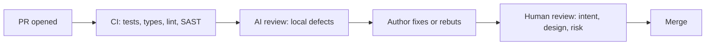

An AI can produce a twelve-page design document in forty seconds, complete with goals, non-goals, three alternatives and a risk table. It looks finished, and that is the danger. The value of a design document was never the text. It is the thinking that writing it forces on the author, the decisions it records with their reasons, and the alignment it creates among the people who read it. A generated document can skip all three while looking as if it did them.

Senior engineers are judged on the quality of their decisions, and on whether the people around them understood and agreed with those decisions. AI is a strong tool for both, used one way, and a way to fake both, used the other.

## What AI is good and bad at in design

Design is choosing under constraints: your traffic, your team's skills, your budget, your existing systems, your SLAs, your organisation's appetite for risk. The model knows none of these unless you tell it, so by default it designs for an imaginary average company.

| Helps | Hurts |
|---|---|
| Widening the option space: "give me three designs that differ in consistency model" | Anchoring: the first option it proposes becomes the one you evaluate everything against |
| Red-teaming: "you are the on-call engineer; what pages at 3 a.m.?" | Homogenised designs: the most common architecture in public writing, whether or not it fits |
| Completeness checks: missing sections on rollback, migration, observability, cost | Fabricated facts about your systems ("the auth service supports mTLS") or about technologies |
| Arithmetic scaffolding for estimates, which you then check | Decision laundering: "the AI recommended it" standing in for a rationale |
| Drafting prose after the decisions are made | Replacing the author's thinking with the reader's skimming |

## A workflow: you frame, AI expands, you decide

1. **Write the problem statement and constraints yourself**, in half a page. This is where the thinking happens; do not delegate it.
2. **Ask for divergent options along explicit axes**, so you get real alternatives rather than three variations of one idea.
3. **Interrogate each option** with one question: what would make this wrong?
4. **Red-team** with roles: on-call engineer, security reviewer, finance partner, the team that has to migrate.
5. **Decide, and write the decision and its rationale yourself.**
6. **Let AI draft the connective prose**, then edit it until it says what you mean.

### Worked example: payment webhooks

You are designing ingestion for a payment provider's webhooks. Your constraints: peaks of 2,000 events per second during sales, the provider retries failed deliveries for up to three days with at-least-once semantics, events can arrive out of order, a refund must never be applied twice, a team of four, and you already run Postgres and Kafka.

```text
Here are the problem and constraints (pasted above). Propose three designs
that differ in where durability and deduplication happen. For each: the
failure mode at 10x peak, what happens when the provider sends the same
event twice an hour apart, what happens when events arrive out of order,
and the operational cost for a team of four. Do not recommend one yet.
```

The response offers three options: (A) a synchronous handler that inserts each event into Postgres with a unique constraint on the provider's event id and applies it in the same transaction; (B) a thin handler that acknowledges and enqueues to Kafka, with consumers applying events; (C) a serverless function with conditional writes to a managed key-value store.

It is a useful spread. It also contains two claims you must catch.

**"Option B provides exactly-once processing, because Kafka supports exactly-once semantics."** Kafka's exactly-once guarantees cover reading from Kafka, processing and writing back to Kafka within a transaction. Applying a refund in Postgres, or calling the provider's API, is a side effect outside Kafka. A consumer that crashes after the database commit and before the offset commit will process the event again. You still need idempotency keyed on the provider's event id at the point of the side effect. See [Exactly-once semantics](/learn/system-design/distributed-systems/exactly-once-semantics).

**"At 2,000 events per second of about 1 KB each, ingest is roughly 2 GB/s."** It is 2,000 × 1 KB = 2 MB/s, a thousand times less. Unit slips like this are common in generated estimates and they change the design: 2 GB/s argues for a streaming platform, while 2 MB/s is comfortably within what a single well-provisioned Postgres primary handles for small inserts. Check every number with the method from [Back-of-envelope estimation](/learn/system-design/building-blocks/back-of-envelope-estimation).

With the corrections made, you decide: option A, because the unique constraint gives idempotency at exactly the point of the side effect, the load fits the database you already operate, and a team of four should not add moving parts it does not need. You record the trigger for revisiting: if handler latency approaches the provider's delivery timeout, move to B, keeping the same idempotency key. That paragraph is yours. The AI widened the options and you caught its errors; neither of those is the decision.

### Prompts that make AI a better design critic

Generic requests ("review my design") get generic praise with a few safe suggestions. Specific roles and framings get useful criticism:

- **Pre-mortem.** "Assume this design failed badly 18 months after launch. Write the incident report: what failed, why nobody caught it in review, and what the first warning sign was."
- **Assumption audit.** "List every assumption this design makes about load, data shape, dependencies and team capacity. For each, say what happens if it is off by 10x, and which one is least certain."
- **Adversarial reviewer.** "You are a staff engineer who has run a system like this at ten times our traffic. What would you push back on first?"
- **Operability.** "Walk through the first on-call week. What pages, what dashboards are missing, what runbook steps do not exist yet?"
- **Migration.** "Describe the rollout from today's system to this one with no downtime. Where is the point of no return?"

Each prompt produces a list you triage. Most items will be irrelevant or already handled; the one or two that are not are worth the whole exercise. Keep the triage visible in the doc ("considered, not applicable because..."): reviewers trust a design more when they can see what was ruled out.

## ADRs with AI

An architecture decision record captures one decision in a page. A widely used format, from Michael Nygard, has a title, a status, the context, the decision and its consequences.

```text
ADR-031: Idempotent webhook ingestion in Postgres

Status: Accepted (2026-09-12)

Context
  The payment provider delivers webhooks at least once, retries for up to
  three days, and may reorder events. Peak load is about 2,000 events/s
  (about 2 MB/s). A duplicated refund is a financial incident.

Decision
  The webhook handler inserts each event into provider_events with a
  unique constraint on provider_event_id and applies it in the same
  transaction. Duplicates hit the constraint and are acknowledged as no-ops.

Consequences
  + Idempotency is enforced where the side effect happens.
  + No new infrastructure for a team of four.
  - Handler latency includes the database write; we alert when p99 exceeds
    40% of the provider's timeout and revisit (see alternative B).
  - Out-of-order events are applied in arrival order; state transitions
    must be validated against the current order state.

Alternatives considered
  B: Kafka buffer with idempotent consumers (rejected for now: operational
     cost, and it still needs the same idempotency key).
  C: Serverless with conditional writes (rejected: a second datastore).
```

AI is good at drafting *Context* from meeting notes and at formatting. You own *Decision* and *Consequences*, and the negative consequences in particular: models tend to list advantages generously and costs sparingly, and the minus lines are what a future engineer most needs. Before accepting a drafted ADR, verify every factual claim in the context and make sure each rejected alternative says why. More on the practice in [Documentation and ADRs](/learn/senior-craft/software-craft/documentation-and-adrs) and [Design docs and RFCs](/learn/senior-craft/technical-leadership/design-docs-and-rfcs).

## AI in code review

AI shows up in review in three roles.

**As a reviewer on pull requests.** Review bots (Copilot's code review, Claude Code or Codex running in CI, and others) are good at local defects: a missing `await`, unchecked `None`, a leaked file handle, an off-by-one, an error path without a test, inconsistent error handling. They are weak at intent (is this the right change at all?), cross-system consequences, product correctness and whether the code should exist. Their biggest operational risk is noise: a bot whose comments are wrong a third of the time trains the team to ignore all of them, including the one that mattered. Tune it (comment only on changed lines, only above a severity threshold) and measure the share of its comments that lead to a change.

**As the author's pre-review.** Before requesting human review, run the diff past an AI with your team's checklist and fix the mechanical findings. Human reviewers should spend their attention on design, not on the missing null check.

**As the subject of review.** When a pull request was largely written by an agent, the person who opened it owns every line. Ask for the spec or plan in the description, keep the change small, and review the tests before the implementation, as in [Verifying AI-written code](/learn/ai-assisted-engineering/tools-and-workflows/verifying-ai-code).



The division of labour this implies:

| Machines should catch | Humans should spend time on |
|---|---|
| Formatting, lint, types, known insecure patterns | Is this the right problem and the right fix? |
| Missing tests for new branches | Does the design fit the system's direction? |
| Local defects: nulls, awaits, leaks, off-by-ones | Cross-service effects, data migrations, rollout risk |
| Dependency and secret scanning | Naming, API shape and anything future readers must live with |

## The review burden

Generation got cheap; review did not. Suppose a team of six each opens 4 pull requests a week at 30 minutes of review each: 24 PRs and 12 hours of review a week. With agents, each opens 10: 60 PRs and 30 hours. Something gives. Either reviews get shallower (rubber-stamping) or the queue grows until throughput is back where it started.

The senior response is to change the system, not to review faster:

- **Cap PR size** and stack small PRs, so each review is short and focused.
- **Move mechanical checks into CI**, so humans never review formatting or known-bad patterns.
- **Prefer codemods** to mass edits, so reviewers read the program, not its 200 outputs.
- **Hold authors accountable**: the author can explain every line and has run the checklist before asking.
- **Watch the metrics**: review latency, review comments per PR, and escaped defects. Falling comments with rising PR volume is a warning, not a win.

The mentoring side of review, which does not go away because code was generated, is in [Code review as mentorship](/learn/senior-craft/technical-leadership/code-review-as-mentorship).

## Senior signals

- You write the **problem statement and constraints yourself** and use AI to diverge and red-team, never to decide.
- You **catch confident errors**: semantics overstated ("exactly-once"), units slipped by a factor of a thousand, facts about your systems invented.
- You own the **decision and its negative consequences** in every ADR, and you record the trigger for revisiting it.
- You deploy AI reviewers for **local defects**, tune them for precision, and keep humans on intent and design.
- You treat the **review burden** as a system problem: PR size limits, CI gates, codemods and author accountability.
- You never let "the AI recommended it" stand in for a **rationale**.

## Check yourself

```quiz
- q: >-
    Which way of using AI in writing a design document preserves the document's value?
  options: ["Write it all yourself and use AI only to check spelling, grammar and tone", "Write the constraints, then let the AI pick the option that has the most advantages", "Write the problem yourself, use AI to diverge and red-team, then decide yourself", "Generate the whole document from the ticket, then edit it before review"]
  answer: 2
  explanation: >-
    The value is in the thinking, the decision and the alignment. Write the problem and constraints yourself, use AI to generate divergent options and red-team them, then decide and write the rationale yourself. AI is strong at widening options and finding holes, but it does not know your constraints and it cannot own the decision, so letting it pick is the tempting mistake. Restricting it to spelling wastes its real strengths.
- q: >-
    A generated design says a Kafka-based webhook pipeline gives exactly-once refunds because Kafka supports exactly-once semantics. What is wrong?
  options: ["Kafka's guarantee stops at Kafka; the refund side effect still needs idempotency", "Exactly-once only holds with a single partition, which cannot carry this load", "Kafka has no transactions, so it cannot offer exactly-once in any form", "Nothing, since Kafka's exactly-once semantics extend to consumer side effects"]
  answer: 0
  explanation: >-
    Kafka's exactly-once covers read-process-write within Kafka, using transactions. A refund applied to a database or an external API is a side effect outside that transaction: a consumer can apply it and crash before committing its offset, then process the event again. Idempotency keyed on the event id, at the point of the side effect, is what prevents a double refund.
- q: >-
    An AI estimate reads "2,000 events per second at about 1 KB each is roughly 2 GB/s". What is the correct figure?
  options: ["2 GB/s", "200 MB/s", "20 KB/s", "2 MB/s"]
  answer: 3
  explanation: >-
    2,000 × 1 KB = 2,000 KB, about 2 MB per second. A thousand-fold unit slip changes the architecture you would choose, which is why every generated number gets checked.
- q: >-
    Your team has started ignoring the AI review bot's comments. What is the most likely cause, and the fix?
  options: ["Engineers distrust automation; require a reply to every bot comment", "The bot is too slow; move it to run after merge so it never blocks work", "Too many false positives; tune it for precision and track comments acted on", "The bot's model is too small; switch to a larger one to improve its accuracy"]
  answer: 2
  explanation: >-
    Noisy reviewers get ignored, including when they are right. Precision matters more than recall for a comment stream humans read, so tune the bot to changed lines and higher severity and track what share of its comments lead to changes. Mandating replies to noise adds cost without restoring trust, and a bigger model does not fix a noisy configuration.
- q: >-
    After adopting coding agents, pull requests per engineer rise from 4 to 10 a week and review comments per PR are falling. What is the best interpretation and response?
  options: ["Agents are producing bad code; stop using them until quality recovers", "Code quality has improved, so fewer review comments are needed; celebrate it", "Reviews are getting shallower; cap PR size and move mechanical checks to CI", "Review capacity is short; hire more reviewers and keep the process as is"]
  answer: 2
  explanation: >-
    Falling comments with rising volume usually means rubber-stamping, not better code. The fix is to make each review smaller and more focused, move mechanical checking to machines, prefer codemods for mass edits, and hold authors to explaining every line. Banning agents throws away the gains; hiring alone does not fix the process.
```
