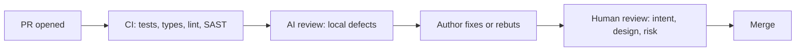

An AI can produce a twelve-page design document in forty seconds, complete with goals, non-goals, three alternatives and a risk table. It looks finished, and that is the danger. The value of a design document was never the text. It is the thinking that writing it forces on the author, the decisions it records with their reasons, and the alignment it creates among the people who read it. A generated document can skip all three while looking as if it did them.

Senior engineers are judged on the quality of their decisions, and on whether the people around them understood and agreed with those decisions. AI is a strong tool for both, used one way, and a way to fake both, used the other. This lesson is the first way: the workflow, a worked design with the two errors a model made in it, the arithmetic that catches such errors, a pre-mortem you can run as a command, and the same discipline applied to code review, where cheap generation has changed the economics of the reviewer's attention.

## What AI is good and bad at in design

Design is choosing under constraints: your traffic, your team's skills, your budget, your existing systems, your SLAs, your organisation's appetite for risk. The model knows none of these unless you tell it, so by default it designs for an imaginary average company.

| Helps | Hurts |
|---|---|
| Widening the option space: "give me three designs that differ in consistency model" | Anchoring: the first option it proposes becomes the one you evaluate everything against |
| Red-teaming: "you are the on-call engineer; what pages at 3 a.m.?" | Homogenised designs: the most common architecture in public writing, whether or not it fits |
| Completeness checks: missing sections on rollback, migration, observability, cost | Fabricated facts about your systems ("the auth service supports mTLS") or about technologies |
| Arithmetic scaffolding for estimates, which you then check | Decision laundering: "the AI recommended it" standing in for a rationale |
| Drafting prose after the decisions are made | Replacing the author's thinking with the reader's skimming |

## A workflow: you frame, AI expands, you decide

1. **Write the problem statement and constraints yourself**, in half a page. This is where the thinking happens; do not delegate it.
2. **Ask for divergent options along explicit axes**, so you get real alternatives rather than three variations of one idea.
3. **Interrogate each option** with one question: what would make this wrong?
4. **Red-team** with roles: on-call engineer, security reviewer, finance partner, the team that has to migrate.
5. **Decide, and write the decision and its rationale yourself.**
6. **Let AI draft the connective prose**, then edit it until it says what you mean.

### Worked example: payment webhooks

You are designing ingestion for a payment provider's webhooks. Your constraints: peaks of 2,000 events per second during sales, the provider retries failed deliveries for up to three days with at-least-once semantics, events can arrive out of order, a refund must never be applied twice, a team of four, and you already run Postgres and Kafka.

```text
Here are the problem and constraints (pasted above). Propose three designs
that differ in where durability and deduplication happen. For each: the
failure mode at 10x peak, what happens when the provider sends the same
event twice an hour apart, what happens when events arrive out of order,
and the operational cost for a team of four. Do not recommend one yet.
```

The response offers three options: (A) a synchronous handler that inserts each event into Postgres with a unique constraint on the provider's event id and applies it in the same transaction; (B) a thin handler that acknowledges and enqueues to Kafka, with consumers applying events; (C) a serverless function with conditional writes to a managed key-value store.

It is a useful spread. It also contains two claims you must catch.

### Two claims to catch by hand

**"Option B provides exactly-once processing, because Kafka supports exactly-once semantics."** Kafka's exactly-once guarantees cover reading from Kafka, processing and writing back to Kafka within a transaction. Applying a refund in Postgres, or calling the provider's API, is a side effect outside Kafka. A consumer that crashes after the database commit and before the offset commit will process the event again. You still need idempotency keyed on the provider's event id at the point of the side effect. See [Exactly-once semantics](/learn/system-design/distributed-systems/exactly-once-semantics).

**"At 2,000 events per second of about 1 KB each, ingest is roughly 2 GB/s."** Do the arithmetic by hand, in steps small enough to check:

| Step | Calculation | Result |
|---|---|---|
| Peak ingest | 2,000 events/s × 1 KB | 2,000 KB/s = 2 MB/s |
| The model's figure | 2 GB/s ÷ 2 MB/s | wrong by 1,000× |
| A two-hour sale peak | 2 MB/s × 7,200 s | about 14 GB of raw events |
| Average day at 300 events/s | 300 × 86,400 | about 26 million events, about 26 GB raw |
| A year, before indexes and compression | 26 GB × 365 | about 9.5 TB |
| Write rate against one Postgres primary | 2,000 small inserts/s with one unique index | inside the envelope of thousands to low tens of thousands per second, depending on `synchronous_commit`, row width, index count and batching |
| The same at 10× peak | 20,000 inserts/s | at the edge of that envelope: the trigger for option B |

Two design facts fall out of the corrected numbers, and neither was visible in the model's version. First, 2 MB/s is comfortably within what a single well-provisioned Postgres primary handles for small inserts, so the streaming platform is not required for the load; the ingest number the model gave would have argued for it. Second, the storage line says retention is a decision: nine terabytes a year of raw events means a policy for archiving applied events after the provider's three-day retry window, which belongs in the design. Check every generated number with the method from [Back-of-envelope estimation](/learn/system-design/building-blocks/back-of-envelope-estimation); unit slips by a factor of a thousand are among the most common errors in generated estimates, because the model produces the shape of an estimate without carrying the units.

### The decision, and who owns it

With the corrections made, you decide: option A, because the unique constraint gives idempotency at exactly the point of the side effect, the load fits the database you already operate, and a team of four should not add moving parts it does not need. You record the trigger for revisiting, now as a number: if sustained ingest approaches 10,000 events per second, or handler p99 approaches 40% of the provider's delivery timeout, move to B, keeping the same idempotency key. That paragraph is yours. The AI widened the options and you caught its errors; neither of those is the decision.

### Prompts that make AI a better design critic

Generic requests ("review my design") get generic praise with a few safe suggestions. Specific roles and framings get useful criticism:

- **Pre-mortem.** "Assume this design failed badly 18 months after launch. Write the incident report: what failed, why nobody caught it in review, and what the first warning sign was."
- **Assumption audit.** "List every assumption this design makes about load, data shape, dependencies and team capacity. For each, say what happens if it is off by 10x, and which one is least certain."
- **Adversarial reviewer.** "You are a staff engineer who has run a system like this at ten times our traffic. What would you push back on first?"
- **Operability.** "Walk through the first on-call week. What pages, what dashboards are missing, what runbook steps do not exist yet?"
- **Migration.** "Describe the rollout from today's system to this one with no downtime. Where is the point of no return?"

Each prompt produces a list you triage. Most items will be irrelevant or already handled; the one or two that are not are worth the whole exercise. Keep the triage visible in the doc ("considered, not applicable because..."): reviewers trust a design more when they can see what was ruled out.

### The pre-mortem as a command

A prompt you retype is a habit; a prompt in a file is a process the whole team runs. In Claude Code, at the time of writing, a skill is a Markdown file with front matter under `.claude/skills/<name>/SKILL.md`, invoked as `/<name>`, with `$ARGUMENTS` replaced by whatever follows the command (a `!` backtick prefix can also run a shell command and paste its output into the prompt before the model sees it). A pre-mortem skill that takes the document's path:

```markdown
---
name: premortem
description: Write the 18-month incident report for a design document before it is approved
---
Design under review: $ARGUMENTS

Read that document in full before writing anything.

Assume this design shipped and failed badly 18 months after launch. Write
the incident report as the on-call engineer would:
1. What failed, in one sentence, with the metric that showed it.
2. The mechanism: which assumption in the design turned out false, and how
   the failure propagated.
3. Why review did not catch it: name the section that should have raised it.
4. The first warning sign, and the dashboard or alert that would have shown
   it a week earlier.
5. Three questions the reviewers should ask the author now.
Be specific to this design. Do not give generic advice about monitoring.
```

Then `/premortem docs/design/webhook-ingestion.md` produces a report that names the section of *this* document that should have raised the failure. Other tools have equivalents (prompt files in Copilot, custom commands in Cursor and Gemini CLI); where there is none, the same text pasted with the document attached works, and the discipline is the same: the author triages the report in the document, visibly.

## ADRs with AI

An architecture decision record captures one decision in a page. A widely used format, from [Michael Nygard's 2011 post](https://www.cognitect.com/blog/2011/11/15/documenting-architecture-decisions), has a title, a status, the context, the decision and its consequences, and he asks for all the consequences, "not just the 'positive' ones".

```text
ADR-031: Idempotent webhook ingestion in Postgres

Status: Accepted (2026-09-12)

Context
  The payment provider delivers webhooks at least once, retries for up to
  three days, and may reorder events. Peak load is about 2,000 events/s
  (about 2 MB/s); average about 300/s, about 26 GB of raw events per day.
  A duplicated refund is a financial incident.

Decision
  The webhook handler inserts each event into provider_events with a
  unique constraint on provider_event_id and applies it in the same
  transaction. Duplicates hit the constraint and are acknowledged as no-ops.
  Applied events older than 7 days are archived nightly.

Consequences
  + Idempotency is enforced where the side effect happens.
  + No new infrastructure for a team of four.
  - Handler latency includes the database write; we alert when p99 exceeds
    40% of the provider's timeout and revisit (see alternative B).
  - Out-of-order events are applied in arrival order; state transitions
    must be validated against the current order state.
  - Sustained ingest near 10,000 events/s exceeds the comfortable envelope
    of one primary; that number triggers the move to B.

Alternatives considered
  B: Kafka buffer with idempotent consumers (rejected for now: operational
     cost, and it still needs the same idempotency key).
  C: Serverless with conditional writes (rejected: a second datastore).
```

AI is good at drafting *Context* from meeting notes and at formatting. You own *Decision* and *Consequences*, and the negative consequences in particular: models tend to list advantages generously and costs sparingly, and the minus lines are what a future engineer most needs. Before accepting a drafted ADR, verify every factual claim in the context and make sure each rejected alternative says why, and put the revisit trigger in as a number rather than an adjective. More on the practice in [Documentation and ADRs](/learn/senior-craft/software-craft/documentation-and-adrs) and [Design docs and RFCs](/learn/senior-craft/technical-leadership/design-docs-and-rfcs).

## AI in code review

AI shows up in review in three roles.

**As a reviewer on pull requests.** Review bots (Copilot's code review, Claude Code or Codex running in CI, and others) are good at local defects: a missing `await`, unchecked `None`, a leaked file handle, an off-by-one, an error path without a test, inconsistent error handling. They are weak at intent (is this the right change at all?), cross-system consequences, product correctness and whether the code should exist. Their biggest operational risk is noise: a bot whose comments are wrong a third of the time trains the team to ignore all of them, including the one that mattered.

**As the author's pre-review.** Before requesting human review, run the diff past an AI with your team's checklist and fix the mechanical findings. Human reviewers should spend their attention on design, not on the missing null check.

**As the subject of review.** When a pull request was largely written by an agent, the person who opened it owns every line. Ask for the spec or plan in the description, keep the change small, and review the tests before the implementation, as in [Verifying AI-written code](/learn/ai-assisted-engineering/tools-and-workflows/verifying-ai-code).



The division of labour this implies:

| Machines should catch | Humans should spend time on |
|---|---|
| Formatting, lint, types, known insecure patterns | Is this the right problem and the right fix? |
| Missing tests for new branches | Does the design fit the system's direction? |
| Local defects: nulls, awaits, leaks, off-by-ones | Cross-service effects, data migrations, rollout risk |
| Dependency and secret scanning | Naming, API shape and anything future readers must live with |

### Under the hood: what a review bot sees

Understanding what the bot is given explains both what it catches and what it cannot. A pull-request reviewer, whichever product, works from the **unified diff**: the changed hunks with a few lines of context on each side (git's default is three), plus whatever surrounding files the bot's harness chooses to read or the model asks to read. It usually also gets the PR title and description. It does not get the ticket, the design document, the conversation in which the approach was chosen, or the running system. So its judgements about *intent* are inferences from the diff text, which is why "is this the right change?" is beyond it and "this `await` is missing" is squarely within it.

Large pull requests are split into chunks to fit a token budget, typically per file or per group of hunks, and each chunk is reviewed with limited knowledge of the others. A rename in one file and a stale caller in another can land in different chunks; the bot sees two locally fine changes and misses the cross-file break that a compiler or a human reading the whole diff would catch. This is the technical reason to keep PRs small: below the chunking threshold, the bot reads the whole change as one thing.

Comments are posted through the code host's review API, which only allows inline comments on lines that appear in the diff, so a bot cannot annotate the unchanged function that the change silently broke; it can only mention it in a summary, where it is easy to miss. Most products apply a severity threshold before posting and offer settings for which paths to review; both are the levers for the precision problem below. All of this is general to the architecture rather than to any vendor, and the specifics change by the month; what does not change is that the bot is reasoning from a partial view of the text, without the context a human reviewer carries in their head.

### Running a reviewer in CI

At the time of writing, the official GitHub Action for Claude Code is `anthropics/claude-code-action`. It has two modes: an **interactive** mode with no `prompt` input, where it responds when someone mentions the trigger phrase (`@claude` by default) in a PR or issue comment; and an **automation** mode, where a `prompt` input makes it run on the workflow's events without being asked. A reviewer belongs in automation mode, with its scope written down:

```yaml
name: ai-review
on:
  pull_request:
    types: [opened, synchronize]
jobs:
  review:
    runs-on: ubuntu-latest
    permissions:
      contents: read
      pull-requests: write
    steps:
      - uses: actions/checkout@v4
        with:
          fetch-depth: 0
      - uses: anthropics/claude-code-action@v1
        with:
          anthropic_api_key: ${{ secrets.ANTHROPIC_API_KEY }}
          prompt: |
            Review this pull request against .github/review-checklist.md.
            Comment only on changed lines, and only on defects you are
            confident about: missing awaits, unchecked None, off-by-ones,
            swallowed errors, unparameterised SQL, tests weakened or skipped.
            Do not comment on style or formatting. If you find nothing,
            say so in one line.
          claude_args: "--max-turns 15 --allowedTools Read,Grep,Glob,Bash(gh pr comment:*)"
```

Three details carry the safety. The `permissions` block gives the job only what a reviewer needs; the allowed tools are read-only plus the one command that posts a comment, so an injected instruction in the PR description cannot make the job push code or read secrets it was not given; and `--max-turns` bounds the loop so a confused run cannot spend the budget. Treat the prompt as the bot's job description and change it when the acted-on rate says the bot is talking too much. Check the action's current documentation before copying this; the input names above are the ones documented at the time of writing.

## The review burden

Generation got cheap; review did not. Suppose a team of six each opens 4 pull requests a week at 30 minutes of review each: 24 PRs and 12 hours of review a week. With agents, each opens 10: 60 PRs and 30 hours. Something gives. Either reviews get shallower (rubber-stamping) or the queue grows until throughput is back where it started.

### Tuning a bot by its acted-on rate

Add a review bot to that team and the attention economics get sharper. Illustrative numbers, of the kind you should measure for your own team: the bot leaves 2 comments per PR, so 120 comments a week. Each takes about 2 minutes to read, and a wrong one takes another 3 minutes to check and dismiss.

| | Untuned bot | Tuned bot |
|---|---|---|
| Comments per week | 120 | 30 |
| Wrong | 40 | 3 |
| Right but not worth a change (nits) | 50 | 5 |
| **Acted on** (led to a change) | 30 | 22 |
| Acted-on rate | 25% | 73% |
| Reviewer time on the stream | 120 × 2 + 40 × 3 = 360 min | 30 × 2 + 3 × 3 = 69 min |

The untuned bot has more true findings in absolute terms. It also teaches every reviewer, within a week, that three comments in four need no action, and a reviewer who has learned that skims the fourth. In the tuned column, the 22 findings get read because nearly every comment has earned it. The measurable quantity is the **acted-on rate**: comments that led to a change, divided by comments. Track it weekly; when it falls under about half, tighten the configuration (changed lines only, higher severity, no style, fewer paths) until it recovers, and accept that the tuned bot reports fewer things. The same reasoning is why alert fatigue is fixed by deleting alerts rather than adding dashboards.

### Changing the system, not the reviewers

The senior response to the burden is to change the system, not to review faster:

- **Cap PR size** and stack small PRs, so each review is short and focused, and each stays under the bot's chunking threshold.
- **Move mechanical checks into CI**, so humans never review formatting or known-bad patterns.
- **Prefer codemods** to mass edits, so reviewers read the program, not its 200 outputs.
- **Hold authors accountable**: the author can explain every line and has run the checklist before asking.
- **Watch the metrics**: review latency, review comments per PR, the bot's acted-on rate, and escaped defects. Falling comments with rising PR volume is a warning, not a win.

The mentoring side of review, which does not go away because code was generated, is in [Code review as mentorship](/learn/senior-craft/technical-leadership/code-review-as-mentorship).

## Failure modes

| Symptom | Diagnosis | Fix |
|---|---|---|
| Every alternative in the design doc is evaluated against the model's first proposal, and wins or loses by how much it differs from it | Anchoring: the first option became the frame | Ask for options along explicit axes before any recommendation, and write your own option before reading the model's |
| The rationale section says the approach was "recommended by analysis" and nobody can explain the trade-off in the review | Decision laundering: the AI's recommendation replaced a reason | The author writes Decision and Consequences by hand, including the minus lines and a numeric revisit trigger |
| The design assumes "the auth service supports mTLS" and the migration plan collapses in week two | A fabricated fact about your own system, produced with the same fluency as the true ones | Verify every claim about your systems against code or an owner before approval; mark unverified claims in the document |
| Reviewers stop reading the bot's comments, including a correct one about a missing `await` that later causes an incident | Acted-on rate fell below the level at which reading pays; the stream trained people to skim | Tune for precision (changed lines, high severity, no style), track the acted-on rate weekly, delete comment categories that never lead to changes |
| PRs per engineer rose from 4 to 10 and comments per PR fell by half | Rubber-stamping: review capacity was fixed and volume was not | Cap PR size, stack small PRs, move mechanical checks to CI, prefer codemods, require the author's spec in the description |
| A generated estimate argues for a streaming platform the team cannot operate | A unit slip (2 GB/s for 2 MB/s) changed the architecture | Recompute every number by hand in steps small enough to check; put the corrected numbers in the ADR |

## Interviewer follow-ups

**"You used an AI to help with this design. Which parts did it do and which did you do?"** Model answer: I wrote the problem statement and constraints; the model produced divergent options and red-teamed them; I caught two errors in its output (an overstated exactly-once claim and a thousand-fold unit slip); I decided and wrote the rationale and the negative consequences. Common wrong answer: describing the model's recommendation as the decision, which is decision laundering said out loud.

**"The model said Kafka gives you exactly-once, so the refund cannot be applied twice. Is that true?"** Model answer: Kafka's guarantee covers read-process-write within Kafka; a refund in Postgres or a call to the provider is outside it, so a consumer that commits the database write and crashes before committing its offset reprocesses the event; idempotency keyed on the provider's event id at the side effect is still required. Common wrong answer: "yes, with idempotent producers and transactions enabled", which describes the mechanism without noticing where it stops.

**"Your review bot posts 120 comments a week. How do you know whether it is helping?"** Model answer: by the acted-on rate, comments that led to a change divided by comments, tracked weekly; when it drops under about half, reviewers skim, so tune for precision even though the absolute number of true findings falls. Common wrong answer: "by the number of bugs it finds", which rewards volume and produces the noise that gets it ignored.

**"Why can a review bot miss a broken caller in another file that a compiler would catch?"** Model answer: the bot reasons from diff hunks with a few lines of context, chunked per file for large PRs, and can only comment on lines in the diff; a cross-file break sits in two chunks or in an unchanged file. CI with a compiler or type checker catches it deterministically, and small PRs keep the bot below its chunking threshold. Common wrong answer: "a larger model would catch it", which ignores what the model is given.

**"Pull requests per engineer went from 4 to 10 after adopting agents. What do you watch?"** Model answer: review latency, comments per PR, the bot's acted-on rate and escaped defects; falling comments with rising volume means rubber-stamping, and the fix is PR size caps, CI gates, codemods and author accountability rather than faster reviewing. Common wrong answer: celebrating the throughput.

## What mid-level engineers get wrong

- **Generating the whole document, then editing.** The thinking that writing forces never happens, so the decision has no owner and the review has nothing to align on.
- **Trusting the model's numbers because they have units.** A thousand-fold slip changes the architecture; recomputing by hand takes two minutes and they skip it.
- **Accepting "exactly-once" and similar guarantees at face value.** The guarantee is real inside a boundary; they do not ask where the boundary is, and the side effect sits outside it.
- **Listing advantages the model wrote and omitting costs.** The minus lines are what the next engineer needs, and the model writes them sparingly.
- **Measuring a review bot by how much it finds.** Volume produces noise, noise produces skimming, and the one comment that mattered is skimmed with the rest.
- **Reviewing faster to absorb agent-generated volume.** Attention is fixed; the process has to change, or the escaped-defect rate reports the shortfall.
- **Writing "revisit if load grows" instead of a number.** Without a trigger, the revisit never happens, and the design fails at the load the ADR could have named.

## Senior signals

- You write the **problem statement and constraints yourself** and use AI to diverge and red-team, never to decide.
- You **catch confident errors**: semantics overstated ("exactly-once"), units slipped by a factor of a thousand, facts about your systems invented, and you recompute every generated number by hand.
- You own the **decision and its negative consequences** in every ADR, and you record the trigger for revisiting it as a number.
- You make red-teaming a **repeatable command** with a skill or prompt file, and you triage its output visibly in the document.
- You deploy AI reviewers for **local defects**, know what the bot can and cannot see, tune it by its **acted-on rate**, and keep humans on intent and design.
- You treat the **review burden** as a system problem: PR size limits, CI gates, codemods and author accountability.
- You never let "the AI recommended it" stand in for a **rationale**.

## Check yourself

```quiz
- q: >-
    Which way of using AI in writing a design document preserves the document's value?
  options: ["Write the problem yourself, use AI to diverge and red-team, then decide yourself", "Write the constraints, then let the AI pick the option that has the most advantages", "Write it all yourself and use AI only to check spelling, grammar and tone", "Generate the whole document from the ticket, then edit it before review"]
  answer: 0
  explanation: >-
    The value is in the thinking, the decision and the alignment. Write the problem and constraints yourself, use AI to generate divergent options and red-team them, then decide and write the rationale yourself. AI is strong at widening options and finding holes, but it does not know your constraints and it cannot own the decision, so letting it pick is the tempting mistake. Restricting it to spelling wastes its real strengths.
- q: >-
    A generated design says a Kafka-based webhook pipeline gives exactly-once refunds because Kafka supports exactly-once semantics. What is wrong?
  options: ["Kafka has no transactions, so it cannot offer exactly-once in any form", "Nothing, since Kafka's exactly-once semantics extend to consumer side effects", "Exactly-once only holds with a single partition, which cannot carry this load", "Kafka's guarantee stops at Kafka; the refund side effect needs idempotency"]
  answer: 3
  explanation: >-
    Kafka's exactly-once covers read-process-write within Kafka, using transactions. A refund applied to a database or an external API is a side effect outside that transaction: a consumer can apply it and crash before committing its offset, then process the event again. Idempotency keyed on the event id, at the point of the side effect, is what prevents a double refund.
- q: >-
    An AI estimate reads "2,000 events per second at about 1 KB each is roughly 2 GB/s". What is the correct figure, and what does the correction change?
  options: ["2 MB/s, which fits one Postgres primary and removes the case for streaming", "2 GB/s, so the estimate was right and the design needs Kafka", "20 KB/s, which means the load is negligible and no design work is needed", "200 MB/s, which confirms that a streaming platform is required at peak"]
  answer: 0
  explanation: >-
    2,000 × 1 KB = 2,000 KB, about 2 MB per second, a thousand-fold slip. At 2 MB/s and 2,000 small inserts per second the load sits inside what one well-provisioned primary handles, so the generated number would have argued for infrastructure the corrected one does not need. Every generated number gets recomputed by hand for this reason.
- q: >-
    Your team has started ignoring the AI review bot's comments. What is the most likely cause, and the fix?
  options: ["Engineers distrust automation; require a reply to every bot comment", "The bot's model is too small; switch to a larger one to improve its accuracy", "The bot is too slow; move it to run after merge so it never blocks work", "Too many comments need no action; tune for precision and track acted-on rate"]
  answer: 3
  explanation: >-
    When most comments need no action, skimming becomes the rational default and correct comments get skimmed too. Precision matters more than recall for a stream humans read, so restrict the bot to changed lines and higher severity, drop style comments, and track the share of comments that lead to changes weekly. Mandating replies to noise adds cost without restoring trust, and a bigger model does not fix a noisy configuration.
- q: >-
    Why can a pull-request review bot miss a caller in another file that the change silently broke?
  options: ["Review bots are only permitted to read test files, never production code", "It sees chunked diff hunks with little context and can only comment on diff lines", "Bots review only the PR description, not the code, so callers are invisible", "The code host strips file names from the diff before the bot receives it"]
  answer: 1
  explanation: >-
    The bot works from changed hunks with a few lines of context, large PRs are split into chunks reviewed mostly in isolation, and the review API only allows inline comments on lines in the diff, so an unchanged broken caller can at best be mentioned in a summary. A compiler or type checker in CI catches it deterministically, and small PRs keep the whole change in one chunk.
- q: >-
    After adopting coding agents, pull requests per engineer rise from 4 to 10 a week and review comments per PR are falling. What is the best interpretation and response?
  options: ["Reviews are getting shallower; cap PR size and move mechanical checks to CI", "Agents are producing bad code; stop using them until quality recovers", "Code quality has improved, so fewer review comments are needed; celebrate it", "Review capacity is short; hire more reviewers and keep the process as is"]
  answer: 0
  explanation: >-
    Falling comments with rising volume usually means rubber-stamping, not better code. The fix is to make each review smaller and more focused, move mechanical checking to machines, prefer codemods for mass edits, and hold authors to explaining every line. Banning agents throws away the gains; hiring alone does not fix the process.
```
