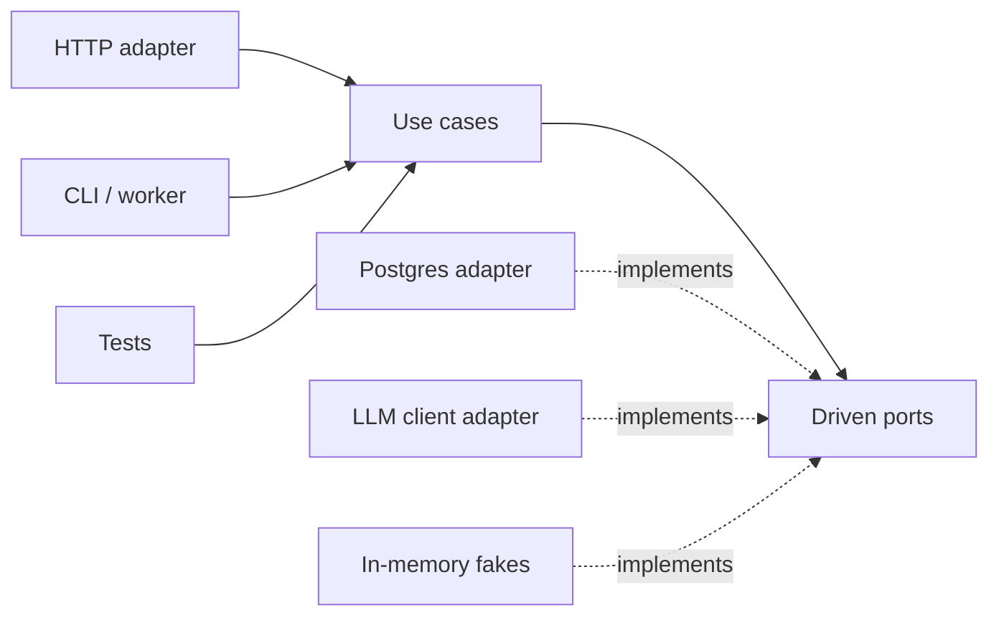
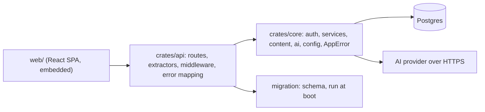

Open a three-year-old service and find the login handler. It parses JSON, runs a SQL query, verifies a password, decides which error message to show, mints a token, writes it to the database, formats a cookie and picks a status code, all in 150 lines. It works. Then three things happen in the same quarter: product wants a CLI that creates accounts in bulk, the security team wants the password hashing parameters changed, and the web framework ships a major version with a new request type. Each change touches the same function, each needs the whole HTTP stack plus a database to test, and each reviewer has to understand everything to approve anything.

Architecture is the set of decisions that make those changes cheap. Its main tool is the **boundary**: a line in the code that says which concepts may cross and in which direction. This lesson is about where to draw those lines, what they cost, and how this repository draws them.

## What a boundary is

A boundary is a place where the vocabulary changes. On one side you talk about `Request`, `HeaderMap`, `StatusCode` and cookies. On the other you talk about users, sessions, lessons and progress. Code that speaks both vocabularies at once is where change hurts, because a change to either vocabulary lands there.

Every boundary has a price. You write mapping code (HTTP body to input struct, domain error to status code). You add an indirection a new reader must follow. You sometimes duplicate a type on each side. So "add more layers" is not the senior answer. The senior answer starts from a question: **where does change come from, and which side of the line should absorb it?**

| Source of change | Rate of change | Should be isolated from |
|---|---|---|
| Business rules (who may delete a comment, when a session expires) | Monthly | Frameworks, transport, storage |
| Transport (REST today, a CLI or a queue consumer tomorrow) | Yearly | Business rules |
| Framework versions (Axum 0.7 to 0.8, Express 4 to 5) | Yearly, painfully | Everything else |
| Vendors (an AI provider, a payment gateway, an email service) | Unpredictably | Business rules |
| Storage engine | Rarely, very expensively | Usually not worth isolating fully |

The last row matters. Hiding the database behind an interface "in case we switch to Mongo" is the most common over-engineered boundary, because the switch almost never happens and the abstraction leaks transactions, locking and query shapes anyway.

## Dependency direction

Layers only help if the arrows point the right way. The rule, whatever name you know it by (clean architecture, onion, hexagonal): **source-code dependencies point toward policy and away from mechanism.** The domain may not import the web framework; the web framework's adapter imports the domain.

The trick that makes this possible is **dependency inversion**. When the domain needs something from the outside world (look up a user, call an AI model), it declares an interface in its own vocabulary and the outer layer implements it.

```python
from typing import Protocol
from dataclasses import dataclass
from datetime import datetime

class UserStore(Protocol):                       # a port, owned by the domain
    def find_by_email(self, email: str) -> "User | None": ...

@dataclass
class NewSession:
    token: str            # raw token, handed to the transport layer once
    expires_at: datetime

class InvalidCredentials(Exception): ...

class AuthService:                               # domain: no HTTP, no SQL
    def __init__(self, users: UserStore, sessions, hasher):
        self.users, self.sessions, self.hasher = users, sessions, hasher

    def login(self, email: str, password: str) -> tuple["User", NewSession]:
        user = self.users.find_by_email(email.strip().lower())
        if not self.hasher.verify(password, user.password_hash if user else None):
            raise InvalidCredentials()
        return user, self.sessions.create(user.id)

def login_handler(request, auth: AuthService):   # inbound adapter: HTTP only
    body = LoginInput.parse(request.body)
    try:
        user, session = auth.login(body.email, body.password)
    except InvalidCredentials:
        return error_response(422, "validation_error", "invalid email or password")
    resp = json_response(user.public())
    resp.set_cookie("session", session.token, httponly=True, secure=True, samesite="Lax")
    return resp
```

Now the unit test for "wrong password is rejected" constructs `AuthService` with an in-memory `UserStore` and never starts a server. The CLI calls `auth.login` directly. The framework upgrade touches `login_handler` and nothing else.

## Hexagonal architecture: ports and adapters

Alistair Cockburn's hexagonal architecture names the pieces. The **application core** sits in the middle. It exposes **driving ports** (the use cases: `login`, `mark_lesson_complete`) and declares **driven ports** (what it needs: user storage, a clock, an LLM). **Adapters** plug into ports: driving adapters translate a transport into use-case calls (an HTTP router, a CLI, a test); driven adapters implement the needs (a Postgres repository, an HTTP client for a vendor).



What it buys: fast tests with fakes, several entry points sharing one set of rules, and vendor swaps that stay local. What it costs: an interface per driven dependency, mapping between transport types and domain types, and the discipline to keep framework types out of the core. It pays for itself when the domain is rich and long-lived. It is overhead when the service is a thin CRUD layer over one table, where the "domain" is the schema and a test against a real database is both simpler and more honest.

## This repository: a core crate and an api crate

Ascend's backend is two Rust crates with one hard boundary between them. The module doc in `crates/core/src/lib.rs` states the contract: the domain layer is "transport-agnostic: no Axum, no HTTP types. The API crate is a thin adapter that maps HTTP to these services and back."

The rule is written down (the repository's `CLAUDE.md` says "`crates/core` must not depend on HTTP types. Routes stay thin; logic lives in services."), but it is not *enforced* by a document. It is enforced by the build graph: `crates/core/Cargo.toml` does not list `axum`, `tower` or `http` as dependencies, so a `use axum::...` in core fails to compile. `crates/api/Cargo.toml` depends on `ascend-core`, never the reverse. That is the cheapest possible fitness function: the compiler runs it on every build.



Follow a login through it. The handler in `crates/api/src/routes/auth.rs` is almost entirely translation:

```rust
async fn login(
    State(state): State<AppState>,
    jar: CookieJar,
    headers: HeaderMap,
    Json(input): Json<LoginInput>,
) -> ApiResult<(CookieJar, Json<ascend_core::auth::CurrentUser>)> {
    let (user, session) = state.auth.login(input, user_agent(&headers)).await?;
    let jar = jar.add(session_cookie(&state, session.token, session.expires_at));
    Ok((jar, Json(user)))
}
```

`AuthService::login` in `crates/core/src/auth/service.rs` validates the input, normalises the email, verifies the password, and creates a session. It returns a `NewSession { token, expires_at }`. It does not know what a cookie is. The api crate decides that the token travels in an `HttpOnly`, `SameSite=Lax` cookie whose `Secure` flag comes from configuration. If Ascend grew a mobile client that wanted a bearer token instead, only the adapter would change.

| Concern | Where it lives | Why there |
|---|---|---|
| Parsing JSON bodies, cookies, headers | `crates/api/src/routes`, `crates/api/src/extractors.rs` | Transport vocabulary |
| Status codes and error bodies | `crates/api/src/error.rs` | One mapping for the whole API |
| Rules: sessions expire, only the author or an admin deletes a comment | `crates/core/src/auth`, `crates/core/src/services` | Reusable by any entry point |
| Validated configuration | `crates/core/src/config.rs` | Every binary needs it, none should re-parse it |
| Schema | `migration/src` | Evolves on its own timeline, runs before the server binds |
| Curriculum | `content/` Markdown, embedded and parsed at startup | Reviewed and versioned like code |

The last row is a boundary decision too. Lessons are not database rows; they are files compiled into the binary, and the database refers to them only by stable slug (the doc comment on `migration/src/m0002_learning.rs` explains that this lets content change without a migration). Content therefore gets code review, diffs and atomic deploys for free.

### Where it is not pure hexagonal

Read the code honestly and you will see that the core is not a pure hexagon. `AuthService` holds a concrete `sea_orm::DatabaseConnection`; the entities in `crates/core/src/entities` are SeaORM models; `AppError` has a `Database(#[from] sea_orm::DbErr)` variant; and the AI client in `crates/core/src/ai` uses `reqwest` directly. There are no repository traits.

That is a defensible trade-off, not an accident. The one boundary that changes often (transport) is hard; the one that almost never changes (Postgres) is soft. The price is that service-level tests need a real database, which is exactly how the repository tests them: `crates/api/src/lib.rs` exposes the api crate as a library precisely so that integration tests can build the exact production router against a real Postgres, and `crates/api/tests/api.rs` does so. The coach, however, cannot be tested deterministically without either the network or a fake HTTP server. If you were reviewing this, the proportionate ask is not "abstract everything"; it is "put a port in front of the LLM client", because that is the dependency that is slow, costly, non-deterministic and most likely to be swapped.

## The middleware stack is architecture too

Cross-cutting concerns (request IDs, logging, timeouts, compression, security headers, CSRF, rate limits) form their own layers, and their **order** is a design decision. `crates/api/src/app.rs` assembles them. In Axum, each `.layer(...)` call wraps everything added before it, so the last call is the outermost layer and sees the request first.

```rust
let api = Router::new()
    /* ...routes... */
    .layer(middleware::from_fn_with_state(state.clone(), csrf::enforce))
    .layer(/* general rate-limit bucket */)
    .layer(DefaultBodyLimit::max(512 * 1024));

Router::new()
    .nest("/api", api)
    .fallback(get(static_handler))
    .layer(middleware::from_fn(security_headers::apply))
    .layer(CompressionLayer::new().br(true).gzip(true))
    .layer(TimeoutLayer::with_status_code(StatusCode::REQUEST_TIMEOUT, Duration::from_secs(240)))
    .layer(TraceLayer::new_for_http() /* span records request_id */)
    .layer(PropagateRequestIdLayer::x_request_id())
    .layer(SetRequestIdLayer::x_request_id(MakeRequestUuid))
```

Read outermost first: set a request ID, propagate it to the response, open a tracing span, start the timeout, compress, add security headers, then route. API requests additionally pass the body limit, the per-IP rate limiter and the CSRF check. Each position has a reason:

- **Request ID before tracing.** The span reads `x-request-id` from the headers. Swap the two and every span records `-`.
- **Timeout inside tracing.** A timed-out request still gets a span and a logged status, so you can see it.
- **240 seconds.** Deliberately above the AI client's own default timeout of 180 seconds (`AI_TIMEOUT_SECS` in `crates/core/src/config.rs`). Nested timeouts should shrink as you go inward, so the innermost call fails first with a specific error instead of the outer layer killing it with a generic one.
- **Security headers outside the router.** They apply to everything, including the SPA fallback and error responses, which are exactly the pages attackers frame or sniff.
- **Rate limiting before CSRF.** A flood of forged requests still spends the attacker's rate budget, and the cheap check runs first.
- **Body limit only on `/api`.** Static assets never read a body; the JSON API caps it at 512 KiB before a handler allocates anything.

One more boundary sits in the router: unknown `/api/...` paths hit `api_not_found` and return a JSON 404, while every other unknown path serves the SPA's `index.html`. Without that split, a typo in a client's API URL returns `200 OK` with HTML, and the failure surfaces far away as a JSON parse error.

```viz
{"type": "system", "algorithm": "request-flow", "title": "A request crossing the layers", "caption": "Each hop is a boundary with its own vocabulary. In Ascend, the load balancer is the platform edge, the API service is one binary whose middleware stack runs in the order above, and Postgres sits behind the core crate."}
```

## Boundaries a transaction cannot cross

The database transaction is a boundary with a hard edge: work inside it is atomic, work outside it is not. Look at the coach route in `crates/api/src/routes/coach.rs`. It streams the model's reply to the browser and, when the stream ends, calls `finish_turn` to persist it; if that write fails it logs `failed to persist coach reply`. The user saw an answer the database never recorded. For a chat transcript that is an acceptable failure mode, and the code chooses it knowingly.

For a payment, a welcome email or an event another team consumes, it is not acceptable. Writing the row and then publishing the message is a **dual write**: either can fail after the other succeeded. The fix is to keep both inside one transaction by writing the message into an **outbox** table, and let a separate relay publish it.

```viz
{"type": "system", "algorithm": "outbox", "title": "Transactional outbox", "caption": "The business row and the outbox row commit together. A relay publishes afterwards and may publish twice, so consumers must be idempotent."}
```

The outbox moves the boundary instead of pretending it is not there: the guarantee becomes "at least once, eventually", and the consumer's idempotency is part of the contract. The full treatment is in [distributed transactions](/learn/system-design/distributed-systems/distributed-transactions).

## Modules before services

Ascend is a single binary. Its boundaries are crates and modules, checked by the compiler, not network hops. That is a **modular monolith**, and for a small team it is usually the right default: a function call cannot time out, a refactor across a boundary is one commit, and there is one thing to deploy and observe. The repository's first decision record, `docs/adr/0001-rust-monolith-with-embedded-content.md`, considered splitting auth, content and AI into services and rejected it in one line: "No team or scale reason to pay the operational cost."

Network boundaries buy independent deployment and independent scaling, and cost you partial failure, serialisation, versioned contracts and distributed tracing. Extract a service when a team or a scaling profile genuinely needs to move independently, and extract it along a module boundary that has already proven stable inside the monolith. [Microservices vs monolith](/learn/system-design/building-blocks/microservices-vs-monolith) works through the arithmetic.

## Make the rule executable

A boundary that is only documented will erode, one "just this once" import at a time. Make it executable. In Rust, separate crates do it for free. In languages with one package namespace you need a **fitness function**: a test that inspects the import graph and fails the build on a forbidden edge. Tools exist for this (ArchUnit on the JVM, import-linter in Python, dependency-cruiser in JavaScript), and the core check is small enough to write yourself.

```exercise
id: layer-violations
title: Write an architecture fitness check
prompt: |
  Write the check that fails the build when a module reaches across a
  boundary it should not.

  `allowed` maps each layer to the list of other top-level names it may
  import. A module's layer (or a package's name) is the part of its path
  before the first `/`: `core/auth/service` is in layer `core`, and
  `axum/extract` belongs to the package `axum`.

  `imports` is a list of `[from, to]` pairs. An import is a violation when the
  target's top-level name differs from the source's layer and is not listed in
  `allowed[source_layer]`. A source layer missing from `allowed` may import
  nothing outside itself (default deny).

  Return the violating pairs in their original order.
languages: [python, javascript]
entry: find_violations
starter:
  python: |
    def find_violations(allowed, imports):
        # your code here
        return []
  javascript: |
    function find_violations(allowed, imports) {
      // your code here
      return [];
    }
tests:
  - args: [{"api": ["core", "axum"], "core": ["serde"]}, [["api/routes/auth", "core/auth"], ["core/auth", "serde"], ["core/error", "axum"], ["api/app", "api/error"]]]
    expected: [["core/error", "axum"]]
  - args: [{"api": ["core"], "core": []}, [["core/auth/service", "api/state"]]]
    expected: [["core/auth/service", "api/state"]]
    label: an inner layer importing an outer one
  - args: [{"api": ["core"], "core": []}, []]
    expected: []
    label: no imports
  - args: [{"core": []}, [["core/auth/service", "core/error"], ["core/content/loader", "core/content/blocks"]]]
    expected: []
    label: imports inside a layer are free
  - args: [{"core": []}, [["scripts/seed", "core/auth"]]]
    expected: [["scripts/seed", "core/auth"]]
    hidden: true
    label: unknown layers are default-deny
  - args: [{"api": ["axum", "core"], "migration": ["sea_orm"]}, [["api/routes/auth", "axum/extract"], ["core/ai/client", "axum/response"], ["migration/m0001", "sea_orm/schema"], ["migration/m0002", "core/entities"]]]
    expected: [["core/ai/client", "axum/response"], ["migration/m0002", "core/entities"]]
    hidden: true
    label: several violations keep their order
hints:
  - "Split each path on `/` and take the first element for both ends of the edge."
  - "Look the source layer up with a default of an empty list, so unknown layers deny everything."
  - "An edge whose two top-level names are equal is internal to a layer and always allowed."
```

Notice the design choice in the prompt: unknown layers are **default deny**. A new top-level directory someone adds next year gets no permissions until a reviewer grants them, which is the same stance you want from firewalls and IAM policies.

## Senior signals

- You justify each boundary by **where change comes from**, and you can name a boundary you deliberately did not draw (usually the database) and why.
- You make dependency direction **mechanically enforced**: separate packages or crates, or a fitness test in CI, not a diagram.
- You treat **middleware order** as a design decision and can explain what breaks when two layers swap.
- You make **nested timeouts shrink inward** so the most specific failure fires first.
- You recognise a **dual write** on sight and reach for a transaction, an outbox or an explicit "acceptable loss" decision.
- You default to a **modular monolith** and extract services along boundaries that have already proven stable.

## Check yourself

```quiz
- q: >-
    An Axum router is built as Router::new().route("/x", get(h)).layer(A).layer(B). A request for /x arrives. In what order does it pass through the layers?
  options: ["A, then B, then h", "B, then A, then h", "A and B run concurrently", "Only B runs because it replaced A"]
  answer: 1
  explanation: >-
    Each .layer call wraps everything added before it, so B wraps A, which wraps the route. The request meets the outermost layer (B) first. Tower's ServiceBuilder reads top-to-bottom in the opposite sense, which is a common source of confusion when switching between the two styles.
- q: >-
    Ascend's crates/core has no dependency on axum or http. What is the main thing that buys?
  options: ["Faster HTTP handling", "The compiler rejects any attempt to leak transport types into the domain, and the domain can be reused by other entry points", "Smaller binaries", "Automatic API documentation"]
  answer: 1
  explanation: >-
    The build graph enforces the dependency rule on every compile. The same services can then be driven by a CLI, a worker or a test without an HTTP server. Binary size and speed are unaffected; the benefit is changeability.
- q: >-
    In hexagonal terms, which of these is a driven (outbound) adapter?
  options: ["The Axum route handler for POST /api/auth/login", "A Playwright test that clicks the login button", "The HTTP client that calls the AI provider", "The login use case itself"]
  answer: 2
  explanation: >-
    Driven adapters implement what the core needs from the outside world: storage, clocks, vendors. Route handlers and tests are driving adapters that call into the core; the use case is the core.
- q: >-
    A handler inserts an order row and then publishes an OrderPlaced message to a broker. Occasionally the publish fails after the commit. Which change makes the two effects consistent?
  options: ["Publish first, then insert the row", "Retry the publish three times", "Write the message to an outbox table in the same transaction and relay it asynchronously", "Wrap both calls in a try/catch"]
  answer: 2
  explanation: >-
    Reordering or retrying only moves the window where one effect happened without the other. The outbox puts both writes inside one transaction; the relay then delivers at least once, so consumers must deduplicate.
- q: >-
    A reviewer proposes adding a repository interface in front of every SeaORM query in Ascend's core. When is that the wrong call?
  options: ["When the service is a thin layer over one Postgres database and the team already tests against a real Postgres", "When there are more than ten tables", "When the code is written in Rust", "Never; every dependency should be behind an interface"]
  answer: 0
  explanation: >-
    Boundaries cost indirection and mapping code. Storage is the dependency least likely to be swapped, and fakes of a relational database hide exactly the behaviour (transactions, constraints) you most need to test. A port pays off first for slow, costly, non-deterministic dependencies such as an LLM client.
```
