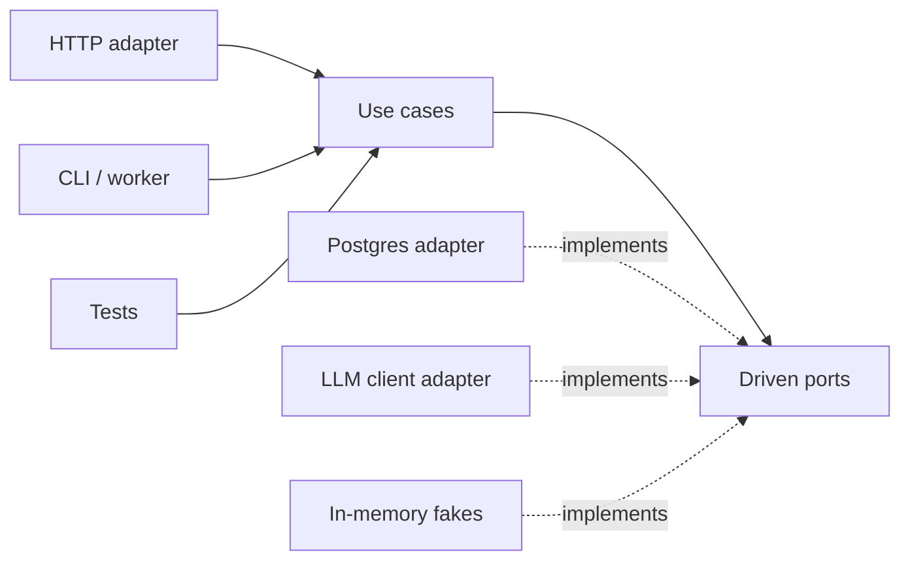
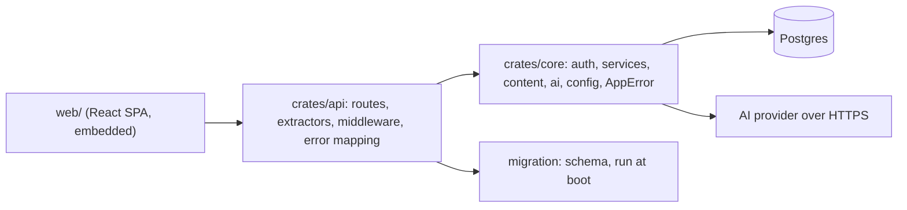

Open a three-year-old service and find the login handler. It parses JSON, runs a SQL query, verifies a password, decides which error message to show, mints a token, writes it to the database, formats a cookie and picks a status code, all in 150 lines. It works. Then three things happen in the same quarter: product wants a CLI that creates accounts in bulk, the security team wants the password hashing parameters changed, and the web framework ships a major version with a new request type. Each change touches the same function, each needs the whole HTTP stack plus a database to test, and each reviewer has to understand everything to approve anything.

Architecture is the set of decisions that make those changes cheap. Its main tool is the **boundary**: a line in the code that says which concepts may cross and in which direction. This lesson is about where to draw those lines, what they cost, and how this repository draws them.

## What a boundary is

A boundary is a place where the vocabulary changes. On one side you talk about `Request`, `HeaderMap`, `StatusCode` and cookies. On the other you talk about users, sessions, lessons and progress. Code that speaks both vocabularies at once is where change hurts, because a change to either vocabulary lands there.

Every boundary has a price. You write mapping code (HTTP body to input struct, domain error to status code). You add an indirection a new reader must follow. You sometimes duplicate a type on each side. So "add more layers" is not the senior answer. The senior answer starts from a question: **where does change come from, and which side of the line should absorb it?**

| Source of change | Rate of change | Should be isolated from |
|---|---|---|
| Business rules (who may delete a comment, when a session expires) | Monthly | Frameworks, transport, storage |
| Transport (REST today, a CLI or a queue consumer tomorrow) | Yearly | Business rules |
| Framework versions (Axum 0.7 to 0.8, Express 4 to 5) | Yearly, painfully | Everything else |
| Vendors (an AI provider, a payment gateway, an email service) | Unpredictably | Business rules |
| Storage engine | Rarely, very expensively | Usually not worth isolating fully |

The last row matters. Hiding the database behind an interface "in case we switch to Mongo" is the most common over-engineered boundary, because the switch almost never happens and the abstraction leaks transactions, locking and query shapes anyway.

## Dependency direction

Layers only help if the arrows point the right way. The rule, whatever name you know it by (clean architecture, onion, hexagonal): **source-code dependencies point toward policy and away from mechanism.** The domain may not import the web framework; the web framework's adapter imports the domain.

The trick that makes this possible is **dependency inversion**. When the domain needs something from the outside world (look up a user, call an AI model), it declares an interface in its own vocabulary and the outer layer implements it.

```python
from typing import Protocol
from dataclasses import dataclass
from datetime import datetime

class UserStore(Protocol):                       # a port, owned by the domain
    def find_by_email(self, email: str) -> "User | None": ...

@dataclass
class NewSession:
    token: str            # raw token, handed to the transport layer once
    expires_at: datetime

class InvalidCredentials(Exception): ...

class AuthService:                               # domain: no HTTP, no SQL
    def __init__(self, users: UserStore, sessions, hasher):
        self.users, self.sessions, self.hasher = users, sessions, hasher

    def login(self, email: str, password: str) -> tuple["User", NewSession]:
        user = self.users.find_by_email(email.strip().lower())
        if not self.hasher.verify(password, user.password_hash if user else None):
            raise InvalidCredentials()
        return user, self.sessions.create(user.id)

def login_handler(request, auth: AuthService):   # inbound adapter: HTTP only
    body = LoginInput.parse(request.body)
    try:
        user, session = auth.login(body.email, body.password)
    except InvalidCredentials:
        return error_response(422, "validation_error", "invalid email or password")
    resp = json_response(user.public())
    resp.set_cookie("session", session.token, httponly=True, secure=True, samesite="Lax")
    return resp
```

Now the unit test for "wrong password is rejected" constructs `AuthService` with an in-memory `UserStore` and never starts a server. The CLI calls `auth.login` directly. The framework upgrade touches `login_handler` and nothing else.

## Hexagonal architecture: ports and adapters

Alistair Cockburn's hexagonal architecture names the pieces. The **application core** sits in the middle. It exposes **driving ports** (the use cases: `login`, `mark_lesson_complete`) and declares **driven ports** (what it needs: user storage, a clock, an LLM). **Adapters** plug into ports: driving adapters translate a transport into use-case calls (an HTTP router, a CLI, a test); driven adapters implement the needs (a Postgres repository, an HTTP client for a vendor).



What it buys: fast tests with fakes, several entry points sharing one set of rules, and vendor swaps that stay local. What it costs: an interface per driven dependency, mapping between transport types and domain types, and the discipline to keep framework types out of the core. It pays for itself when the domain is rich and long-lived. It is overhead when the service is a thin CRUD layer over one table, where the "domain" is the schema and a test against a real database is both simpler and more honest.

## This repository: a core crate and an api crate

Ascend's backend is two main Rust crates with one hard boundary between them (a third, `crates/grader`, runs learner code in a WebAssembly sandbox for core and knows nothing of HTTP either). The module doc in `crates/core/src/lib.rs` states the contract: the domain layer is "transport-agnostic: no Axum, no HTTP types. The API crate is a thin adapter that maps HTTP to these services and back."

The rule is written down (the repository's `CLAUDE.md` says "`crates/core` must not depend on HTTP types. Routes stay thin; logic lives in services."), but it is not *enforced* by a document. It is enforced by the build graph: `crates/core/Cargo.toml` does not list `axum`, `tower` or `http` as dependencies, so a `use axum::...` in core fails to compile. `crates/api/Cargo.toml` depends on `ascend-core`, never the reverse. That is the cheapest possible fitness function: the compiler runs it on every build.



Follow a login through it. The handler in `crates/api/src/routes/auth.rs` is almost entirely translation:

```rust
async fn login(
    State(state): State<AppState>,
    jar: CookieJar,
    headers: HeaderMap,
    AppJson(input): AppJson<LoginInput>,
) -> ApiResult<Response> {
    let device = known_device(&state, &jar, &input.email).await?;
    if let Some(throttled) = state.limiter.check_password_attempt(&input.email, device.as_deref()).await {
        return Ok(throttled);
    }
    let (user, session) = state.auth.login(input, user_agent(&headers)).await?;
    let mut jar = jar.add(session_cookie(&state, session.token, session.expires_at));
    if device.is_none() {
        jar = jar.add(device_cookie(&state, state.auth.remember_device(user.id).await?));
    }
    Ok((jar, Json(user)).into_response())
}
```

The one step that is not translation is a throttle: ten password attempts per minute, answered with a `429` before the service runs, charged to this browser's own bucket when its `ascend_device` cookie is known for the account and to the account's bucket otherwise ([security fundamentals](/learn/senior-craft/software-craft/security-fundamentals) explains why). The quotas and keys are edge policy in the api crate's middleware, while the counting itself lives in core (`services::rate_limit`, in Postgres, so every replica charges one allowance); the domain's `login` stays a pure "check these credentials" use case that a CLI could call without inheriting HTTP throttling.

Even the body extractor is an adapter decision. `AppJson` (in `crates/api/src/extractors.rs`) wraps Axum's `Json` so that a rejected body comes back in the API's own `{"code": ..., "message": ...}` shape instead of Axum's plain-text rejection, while keeping the status Axum chose: `400 bad_request` for JSON that does not parse, `413` for an oversized body, `415` for the wrong content type, and `422 validation_error` for well-formed JSON with the wrong fields. Every handler with a JSON body uses it, so clients handle every error the same way. The first version collapsed all of these into `422 validation_error`, which told a client whose serialiser was broken that a field value was wrong; keeping the distinction is transport vocabulary, so it lives in the adapter.

`AuthService::login` in `crates/core/src/auth/service.rs` validates the input, normalises the email, verifies the password, and creates a session. It returns the user and a `NewSession { token, expires_at }`. It does not know what a cookie is. The api crate decides that the token travels in an `HttpOnly`, `SameSite=Lax` cookie whose `Secure` flag comes from configuration. If Ascend grew a mobile client that wanted a bearer token instead, only the adapter would change.

## What lives where

| Concern | Where it lives | Why there |
|---|---|---|
| Parsing JSON bodies, cookies, headers | `crates/api/src/routes`, `crates/api/src/extractors.rs` | Transport vocabulary |
| Status codes and error bodies | `crates/api/src/error.rs` | One mapping for the whole API |
| Rules: sessions expire, only the author or an admin deletes a comment | `crates/core/src/auth`, `crates/core/src/services` | Reusable by any entry point |
| Validated configuration | `crates/core/src/config.rs` | Every binary needs it, none should re-parse it |
| Schema | `migration/src` | Evolves on its own timeline, runs before the server binds |
| Curriculum | `content/` Markdown, embedded and parsed at startup | Reviewed and versioned like code |

The last row is a boundary decision too. Lessons are not database rows; they are files compiled into the binary, and the database refers to them only by stable slug (the doc comment on `migration/src/m0002_learning.rs` explains that this lets content change without a migration). Content therefore gets code review, diffs and atomic deploys for free.

### Where it is not pure hexagonal

Read the code honestly and you will see that the core is not a pure hexagon. `AuthService` holds a concrete `sea_orm::DatabaseConnection`; the entities in `crates/core/src/entities` are SeaORM models; `AppError` has a `Database(#[from] sea_orm::DbErr)` variant; and the AI client in `crates/core/src/ai` uses `reqwest` directly. There are no repository traits.

That is a defensible trade-off, not an accident. The one boundary that changes often (transport) is hard; the one that almost never changes (Postgres) is soft. The price is that service-level tests need a real database, which is exactly how the repository tests them: `crates/api/src/lib.rs` exposes the api crate as a library precisely so that integration tests can build the exact production router against a real Postgres, and `crates/api/tests/api.rs` does so. The coach, however, cannot be tested deterministically without either the network or a fake HTTP server. If you were reviewing this, the proportionate ask is not "abstract everything"; it is "put a port in front of the LLM client", because that is the dependency that is slow, costly, non-deterministic and most likely to be swapped.

## Under the hood: how the build graph enforces the rule

Cargo compiles each crate with one `rustc` invocation, and that invocation can name only the crates passed to it as `--extern name=path` flags, which Cargo passes for the crate's *direct* dependencies. Everything else in the graph is compiled and linked but cannot be named. `cargo tree`, which reads the lockfile without compiling anything, shows the difference on this repository:

- `cargo tree -p ascend-core --depth 1 -e normal` lists 26 direct dependencies (`sea-orm`, `reqwest`, `tokio`, `argon2`, `serde`, `opentelemetry`, the `ascend-grader` sandbox and the rest), with no `axum`, `tower` or `http`.
- `cargo tree -p ascend-core -i http -e normal` shows that `http` 1.5.0 *is* in core's graph, pulled in by `reqwest` through `hyper` and `http-body`. It is compiled into every build, and core still cannot write `use http::HeaderMap`.
- `cargo tree -p ascend-core -i axum` fails: Axum is not in core's graph at all.

A `use axum::http::HeaderMap;` in a crate that does not declare Axum fails at the first compile, in rustc 1.98's words:

```text
error[E0433]: cannot find module or crate `axum` in this scope
 --> core_lib.rs:1:5
  |
1 | use axum::http::HeaderMap;
  |     ^^^^ use of unresolved module or unlinked crate `axum`
```

The architectural change is therefore a one-line diff to `crates/core/Cargo.toml`, which no reviewer misses. Counting the source makes the two boundaries concrete: of core's 47 Rust files, none mentions `axum::`, `tower::` or `http::`, and 24 mention `sea_orm`. One boundary is hard and one is deliberately soft. In the other direction, the api files that query the database do operational work, not domain work: the readiness probe's `SELECT 1`, the boot migrator in `migrate.rs`, and the connection-budget check in `state.rs`.

Other ecosystems need a tool for the same guarantee. In Python every installed package is importable from everywhere, so import-linter parses `import` statements into a graph and fails CI on a forbidden edge. Go's toolchain refuses imports of a package under an `internal/` directory from outside its parent tree; Java's module system exports packages explicitly in `module-info.java`; ArchUnit checks rules against compiled bytecode inside a unit test. The cheaper the check, the earlier it runs, and Cargo's runs before a line of the crate compiles.

## A real refactor, traced: moving a decision out of the framework

The CSRF check ([security fundamentals](/learn/senior-craft/software-craft/security-fundamentals) covers what it defends against) began inside an Axum middleware. The decision needed the request's headers and one configuration string; the function holding it needed `State<AppState>`, `Request<Body>` and `Next`. A review found a bug (the `Referer` fallback compared by prefix, so `https://ascend.example.evil.net/page` passed), and the fix, in commit `008eee6`, changes the code in the order that keeps each step safe.

| Step | Change | Smallest test that can observe the decision | Behaviour |
|---|---|---|---|
| 0 | Decision inline in `enforce(State<AppState>, Request<Body>, Next)` | The router over a real `AppState`, which holds a Postgres pool: an integration test | Prefix bug present |
| 1 | Move the logic, unchanged, into `pub fn allowed(headers: &HeaderMap, public_origin: &str) -> bool` | A `HeaderMap` and a string: a unit test | Unchanged, bug included |
| 2 | Pin the current behaviour with tests, then add the look-alike case, which fails | Five tests, no I/O | The bug is a red test |
| 3 | Fix inside the pure function: `origin_of` reduces a `Referer` to its origin, origins compare for equality, the localhost allowance parses the host first | The same tests | Look-alikes rejected |
| 4 | `enforce` shrinks to an adapter | The existing integration test still passes | HTTP behaviour otherwise identical |

The adapter before and after:

```rust
// before: the decision and the framework in one function
pub async fn enforce(State(state): State<AppState>, req: Request<Body>, next: Next) -> Response {
    let mutating = matches!(*req.method(), Method::POST | Method::PUT | Method::PATCH | Method::DELETE);
    if mutating {
        let headers = req.headers();
        let expected = state.config.public_origin.trim_end_matches('/');
        let origin_ok = match headers.get("origin").and_then(|v| v.to_str().ok()) {
            Some(origin) => origin.trim_end_matches('/') == expected || is_local_dev(origin, expected),
            None => match headers.get("referer").and_then(|v| v.to_str().ok()) {
                Some(referer) => referer.starts_with(expected) || is_local_dev(referer, expected),
                None => true, // non-browser clients
            },
        };
        let header_ok = headers.get("x-requested-with").is_some();
        if !origin_ok || !header_ok { /* 403 csrf */ }
    }
    next.run(req).await
}

// after: the adapter translates; `allowed` decides
pub async fn enforce(State(state): State<AppState>, req: Request<Body>, next: Next) -> Response {
    let mutating = matches!(*req.method(), Method::POST | Method::PUT | Method::PATCH | Method::DELETE);
    if mutating && !allowed(req.headers(), &state.config.public_origin) {
        return (StatusCode::FORBIDDEN, Json(ErrorBody { code: "csrf", message: "cross-site request rejected".into() }))
            .into_response();
    }
    next.run(req).await
}
```

CI measures the difference. On the run for commit `527d3d1`, the api crate's 8 unit tests, five of them for `allowed`, reported `finished in 0.00s`; the 22 integration tests reported 1.49 s, after a Postgres service container that took 12 s to initialise. Each new tricky input now costs one line and microseconds. `HeaderMap` is still an `http` type, which is right: the rule is HTTP policy and belongs in the api crate. The refactor moved it away from the *framework's* signature, not away from HTTP.

The discipline generalises: move without changing behaviour, pin the behaviour with tests at the new seam, then change it. The repository did the move and the fix in one commit; for a riskier change, two commits let a reviewer confirm that the move alone changed nothing. The same commit made a smaller dependency-direction fix: the comment route stopped computing `user.role == "admin"` and calls `CurrentUser::is_admin`, moving the meaning of "admin" from the transport layer into core.

## The middleware stack is architecture too

Cross-cutting concerns (request IDs, logging, timeouts, compression, security headers, CSRF, rate limits) form their own layers, and their **order** is a design decision. `crates/api/src/app.rs` assembles them. In Axum, each `.layer(...)` call wraps everything added before it, so the last call is the outermost layer and sees the request first.

```rust
let api = Router::new()
    /* ...routes... */
    .route_layer(middleware::from_fn(crate::middleware::metrics::stamp_route))
    .fallback(api_not_found)
    .layer(middleware::from_fn_with_state(state.clone(), csrf::enforce))
    .layer(/* general rate-limit bucket */)
    .layer(DefaultBodyLimit::max(512 * 1024));

Router::new()
    .nest("/api", api)
    .fallback(get(static_handler))
    .layer(middleware::from_fn(security_headers::apply))
    .layer(CompressionLayer::new().br(true).gzip(true))
    .layer(TimeoutLayer::with_status_code(StatusCode::SERVICE_UNAVAILABLE, Duration::from_secs(240)))
    // Outside the timeout, so a request it cuts off is still recorded
    // (as a 503, counted against the availability objective).
    .layer(middleware::from_fn(crate::middleware::metrics::record))
    .layer(TraceLayer::new_for_http() /* span records request_id */)
    .layer(PropagateRequestIdLayer::x_request_id())
    .layer(SetRequestIdLayer::x_request_id(MakeRequestUuid))
    // Outermost: a client-supplied id is kept only if it is a UUID, so
    // logs cannot be polluted or correlated with attacker-chosen values.
    .layer(middleware::from_fn(crate::middleware::request_id::sanitise))
```

Read outermost first: drop a client-supplied request ID unless it is a UUID, set one if none survived, propagate it to the response, open a tracing span, start the metrics timer, start the timeout, compress, add security headers, then route. API requests additionally pass the body limit, the per-IP rate limiter and the CSRF check. Each position has a reason:

- **Sanitising outside everything.** The first version trusted any `x-request-id` a client sent, so a caller could put arbitrary text into every log line of its request, or reuse one ID across many requests to muddy correlation. The check has to run before `SetRequestIdLayer`, which only fills the header when it is absent.
- **Request ID before tracing.** The span reads `x-request-id` from the headers. Swap the two and every span records `-`.
- **Timeout inside tracing.** A timed-out request still gets a span and a logged status, so you can see it.
- **240 seconds.** Deliberately above the AI client's own default timeout of 180 seconds (`AI_TIMEOUT_SECS` in `crates/core/src/config.rs`). Nested timeouts should shrink as you go inward, so the innermost call fails first with a specific error instead of the outer layer killing it with a generic one.
- **503, not 408.** The first version answered a handler timeout with `408 Request Timeout`, which tells the client that *it* was too slow sending the request. Here the server failed to produce a response in time, so it now returns `503 Service Unavailable`, the status that retry logic and dashboards read as a server-side failure.
- **Security headers outside the router.** They apply to everything, including the SPA fallback and error responses, which are exactly the pages attackers frame or sniff.
- **Metrics split across the router.** The latency histogram is labelled by route template, which exists only after routing, yet refusals before routing must be counted too. So `metrics::record`, outside the router, times the request, and `stamp_route`, a `route_layer` that runs only on matched routes, copies the template onto the response for it to read ([observability in code](/learn/senior-craft/software-craft/observability-in-code) has the code). It used to sit inside the timeout, which meant a request cut off at 240 s produced no measurement at all: the one failure an availability objective most needs to see. Commit `2f1daaa` moved it outside, so the timeout's 503 is recorded; for an API request, on route `/api (unrouted)`, because the response never passed `stamp_route`.
- **Rate limiting before CSRF.** A flood of forged requests still spends the attacker's rate budget, and the cheap check runs first.
- **Body limit only on `/api`.** Static assets never read a body; the JSON API caps it at 512 KiB before a handler allocates anything.

One more boundary sits in the router: unknown `/api/...` paths hit `api_not_found` and return a JSON 404, while every other unknown path serves the SPA's `index.html`. Without that split, a typo in a client's API URL returns `200 OK` with HTML, and the failure surfaces far away as a JSON parse error.

```viz
{"type": "system", "algorithm": "request-flow", "variant": "layers",
 "title": "A request crossing the layers",
 "caption": "Each hop is a boundary with its own vocabulary. In Ascend the platform edge forwards to one binary whose middleware stack runs in the order above; the handler turns HTTP into a call on the core crate, and Postgres sits behind it."}
```

## Boundaries a transaction cannot cross

The database transaction is a boundary with a hard edge: work inside it is atomic, work outside it is not. Look at the coach route in `crates/api/src/routes/coach.rs`. It streams the model's reply to the browser and, when the stream ends, calls `finish_turn` to persist it; if that write fails it logs `failed to persist coach reply`. The user saw an answer the database never recorded. For a chat transcript that is an acceptable failure mode, and the code chooses it knowingly.

For a payment, a welcome email or an event another team consumes, it is not acceptable. Writing the row and then publishing the message is a **dual write**: either can fail after the other succeeded. The fix is to keep both inside one transaction by writing the message into an **outbox** table, and let a separate relay publish it.

```viz
{"type": "system", "algorithm": "outbox", "title": "Transactional outbox", "caption": "The business row and the outbox row commit together. A relay publishes afterwards and may publish twice, so consumers must be idempotent."}
```

The outbox moves the boundary instead of pretending it is not there: the guarantee becomes "at least once, eventually", and the consumer's idempotency is part of the contract. The full treatment is in [distributed transactions](/learn/system-design/distributed-systems/distributed-transactions).

## Modules before services

Ascend is a single binary. Its boundaries are crates and modules, checked by the compiler, not network hops. That is a **modular monolith**, and for a small team it is usually the right default: a function call cannot time out, a refactor across a boundary is one commit, and there is one thing to deploy and observe. The repository's first decision record, `docs/adr/0001-rust-monolith-with-embedded-content.md`, considered splitting auth, content and AI into services and rejected it in one line: "No team or scale reason to pay the operational cost."

Network boundaries buy independent deployment and independent scaling, and cost you partial failure, serialisation, versioned contracts and distributed tracing. Extract a service when a team or a scaling profile genuinely needs to move independently, and extract it along a module boundary that has already proven stable inside the monolith. [Microservices vs monolith](/learn/system-design/building-blocks/microservices-vs-monolith) works through the arithmetic.

Ascend's first extraction, in commit `c0b3151` (ADR 0006), followed that rule. Grading moved out along `crates/grader`, a boundary that already knew nothing of HTTP or the database, for two reasons no module can provide: **isolation**, since the grading service holds no database URL or AI key, so learner code that escaped the sandbox would find nothing to take; and a **different scaling profile**, since grading is CPU-bound and bursty and can scale on its own replicas without adding database connections. It is the same binary started with `--serve-grader`, so the split cost a network hop, a shared token, one retry on a busy or failed replica and a `traceparent` header to keep the trace whole (`2f1daaa`), not a second codebase. `GradingBackend` in core is either `Local` or `Remote`, and the submission service calls the same `run` on either; `the_api_grades_through_the_service` drives it over a real socket. The cheapness cut both ways. Production graded through the service from `eed6d46`, and when the idle replicas cost more than invite-only traffic justified, `04ab90f` put grading back in-process by setting one flag, `PHASE_2`, to false. A boundary you can cross in either direction with configuration is worth more than one that takes a project to undo.

## Make the rule executable

A boundary that is only documented will erode, one "just this once" import at a time. Make it executable. In Rust, separate crates do it for free. In languages with one package namespace you need a **fitness function**: a test that inspects the import graph and fails the build on a forbidden edge. Tools exist for this (ArchUnit on the JVM, import-linter in Python, dependency-cruiser in JavaScript), and the core check is small enough to write yourself.

```exercise
id: layer-violations
title: Write an architecture fitness check
prompt: |
  Write the check that fails the build when a module reaches across a
  boundary it should not.

  `allowed` maps each layer to the list of other top-level names it may
  import. A module's layer (or a package's name) is the part of its path
  before the first `/`: `core/auth/service` is in layer `core`, and
  `axum/extract` belongs to the package `axum`.

  `imports` is a list of `[from, to]` pairs. An import is a violation when the
  target's top-level name differs from the source's layer and is not listed in
  `allowed[source_layer]`. A source layer missing from `allowed` may import
  nothing outside itself (default deny).

  Return the violating pairs in their original order.
languages: [python, javascript]
entry: find_violations
starter:
  python: |
    def find_violations(allowed, imports):
        # your code here
        return []
  javascript: |
    function find_violations(allowed, imports) {
      // your code here
      return [];
    }
tests:
  - args: [{"api": ["core", "axum"], "core": ["serde"]}, [["api/routes/auth", "core/auth"], ["core/auth", "serde"], ["core/error", "axum"], ["api/app", "api/error"]]]
    expected: [["core/error", "axum"]]
  - args: [{"api": ["core"], "core": []}, [["core/auth/service", "api/state"]]]
    expected: [["core/auth/service", "api/state"]]
    label: an inner layer importing an outer one
  - args: [{"api": ["core"], "core": []}, []]
    expected: []
    label: no imports
  - args: [{"core": []}, [["core/auth/service", "core/error"], ["core/content/loader", "core/content/blocks"]]]
    expected: []
    label: imports inside a layer are free
  - args: [{"core": []}, [["scripts/seed", "core/auth"]]]
    expected: [["scripts/seed", "core/auth"]]
    hidden: true
    label: unknown layers are default-deny
  - args: [{"api": ["axum", "core"], "migration": ["sea_orm"]}, [["api/routes/auth", "axum/extract"], ["core/ai/client", "axum/response"], ["migration/m0001", "sea_orm/schema"], ["migration/m0002", "core/entities"]]]
    expected: [["core/ai/client", "axum/response"], ["migration/m0002", "core/entities"]]
    hidden: true
    label: several violations keep their order
hints:
  - "Split each path on `/` and take the first element for both ends of the edge."
  - "Look the source layer up with a default of an empty list, so unknown layers deny everything."
  - "An edge whose two top-level names are equal is internal to a layer and always allowed."
```

Notice the design choice in the prompt: unknown layers are **default deny**. A new top-level directory someone adds next year gets no permissions until a reviewer grants them, which is the same stance you want from firewalls and IAM policies.

## Failure modes

| Symptom | Diagnosis | Fix |
|---|---|---|
| Every production log line shows `request_id="-"` after a refactor of `app.rs` | The trace layer now runs before the layer that sets the ID; in Axum the last `.layer` call is outermost | Set the ID outside the trace layer; a test that reads the emitted log line |
| A slow AI call surfaces as a generic `503` instead of the client's own timeout error | The outer timeout is not longer than the inner one (here 240 s against 180 s) | Shrink timeouts inward so the most specific one fires first |
| A framework upgrade touches sixty files | Framework types (`Request`, `Json`, `HeaderMap`) passed into services | Adapters translate at the edge; services take domain types |
| A unit test for a business rule needs a database and a router | The rule lives in a handler or a middleware | Extract it into a pure function or a service, as with `allowed` |
| One service cannot deploy without three others | Services split along layers or sharing a schema: a distributed monolith | Merge back into modules, or split along a boundary proven stable inside the monolith |
| A typo in an API URL returns `200` and HTML | The SPA fallback catches unknown `/api` paths | A JSON 404 for unknown `/api/...` paths, as `api_not_found` returns |

## Trade-offs

| Style | Boundary enforced by | Cost of a change across it | Testing a business rule | Operational cost | Pays off when |
|---|---|---|---|---|---|
| Layers in one package | Convention and review | Low | Often needs the framework | One deploy | Small, short-lived services |
| Hexagonal, ports and adapters | Interfaces plus packages or a fitness check | Mapping code at each port | In-memory fakes, no I/O | One deploy | Rich, long-lived domains with swappable vendors |
| Modular monolith (Ascend's crates) | The compiler or a linter | One commit across modules | Real-database tests, in process | One deploy | Small teams whose boundaries still move |
| Microservices | The network | Versioned contracts, ordered rollouts | Contract tests plus integration | N deploys, tracing, partial failure | Independent teams or scaling profiles |

Hexagonal architecture is not only a textbook shape: in March 2020 Netflix's engineering blog described a Studio Workflows team building a new application on it because it needed "to swap data sources without impacting business logic", starting against the monolith's data and moving to new microservices as they came online.

## Interviewer follow-ups

**"How would you enforce 'the domain must not import the web framework' in a Python monolith?"** Model answer: put the domain and the adapters in separate packages, declare a layers contract in import-linter and run it in CI so a forbidden import fails the build, and state the reason beside the rule. Common wrong answer: "code review", which erodes one exception at a time.

**"Where would you add the first port in this codebase?"** Model answer: in front of the LLM client, because it is slow, costly, non-deterministic and the vendor most likely to change; a fake then makes coach tests deterministic. Not the database, which is tested for real and unlikely to be swapped. Common wrong answer: "a repository interface per table."

**"After a refactor, every log line says `request_id=-`. What happened?"** Model answer: the layer order changed, so the tracing span is created before the request-ID layer sets the header; in Axum each `.layer` wraps what came before, so the last call runs first. Restore the order and add a test that inspects an emitted line. Common wrong answer: "the UUID generator is broken."

**"When would you split Ascend into services?"** Model answer: when a team, a scaling profile or an isolation need must move independently, along a crate boundary that has proven stable. Grading went first, for isolation from secrets and CPU-bound scaling; the AI coach's cost and latency profile is the likeliest next. Replicas alone never forced it: the security rate limits moved into Postgres, the precondition ADR 0001's revisit trigger named. Common wrong answer: "when the codebase is big", which is not a reason by itself.

## What mid-level engineers get wrong

- **Abstracting the database "in case we switch"** while the LLM client, the dependency that does change, stays concrete.
- **Passing framework types into services.** Every framework upgrade then becomes a domain change.
- **Documenting the dependency rule without a check** that fails the build.
- **Treating middleware order as cosmetic.** Swapping two layers silently removes request IDs or security headers.
- **Moving code and changing its behaviour in the same step**, with no tests at the new seam to prove the move was neutral.
- **Splitting services along technical layers** (a "database service") instead of along business capabilities.

## Senior signals

- You justify each boundary by **where change comes from**, and you can name a boundary you deliberately did not draw (usually the database) and why.
- You make dependency direction **mechanically enforced**: separate packages or crates, or a fitness test in CI, not a diagram.
- You treat **middleware order** as a design decision and can explain what breaks when two layers swap.
- You make **nested timeouts shrink inward** so the most specific failure fires first.
- You recognise a **dual write** on sight and reach for a transaction, an outbox or an explicit "acceptable loss" decision.
- You default to a **modular monolith** and extract services along boundaries that have already proven stable.
- You refactor **move first, pin with tests, then change**, and you can point to the seam that made a rule unit-testable.

## Check yourself

```quiz
- q: >-
    An Axum router is built as Router::new().route("/x", get(h)).layer(A).layer(B). A request for /x arrives. In what order does it pass through the layers?
  options: ["A and B at once, then h", "A first, then B, then h", "B only, which replaced A", "B first, then A, then h"]
  answer: 3
  explanation: >-
    Each .layer call wraps everything added before it, so B wraps A, which wraps the route. The request meets the outermost layer, B, first. Tower's ServiceBuilder reads top-to-bottom in the opposite sense, which is a common source of confusion when switching between the two styles.
- q: >-
    Ascend's crates/core has no dependency on axum or http. What is the main thing that buys?
  options: ["Core types can be exported as an OpenAPI schema without any extra HTTP annotations", "The compiler keeps HTTP types out of the domain, so a CLI or test can reuse it", "Requests run faster because the domain no longer parses HTTP types on the hot path", "The release binary shrinks because the core crate compiles without any web framework"]
  answer: 1
  explanation: >-
    The build graph enforces the dependency rule on every compile: a use axum::... line in core does not compile. The same services can then be driven by a CLI, a worker or a test without an HTTP server. Speed and binary size are essentially unchanged, because the api crate still links Axum into the same binary, and API documentation has nothing to do with it; the benefit is changeability.
- q: >-
    In hexagonal terms, which of these is a driven (outbound) adapter?
  options: ["The Axum route handler for POST /api/auth/login", "The login use case inside the core crate", "The HTTP client that calls the AI provider", "A Playwright test that clicks the login button"]
  answer: 2
  explanation: >-
    Driven adapters implement what the core needs from the outside world: storage, clocks, vendors. Route handlers and tests are driving adapters that call into the core; the use case is the core.
- q: >-
    A handler inserts an order row and then publishes an OrderPlaced message to a broker. Occasionally the publish fails after the commit. Which change makes the two effects consistent?
  options: ["Publish the message first and insert the order row after", "Insert an outbox row in the same transaction and relay it", "Wrap both calls in a try/catch that logs any failure", "Retry the failed publish three times with exponential backoff"]
  answer: 1
  explanation: >-
    Reordering or retrying only moves the window where one effect happened without the other: a crash between the two steps still loses one of them. The outbox puts both writes inside one database transaction, and a relay delivers the message afterwards at least once, so consumers must deduplicate. Logging the failure is an explicit "acceptable loss" decision, fine for a chat transcript but not for an order.
- q: >-
    A reviewer proposes adding a repository interface in front of every SeaORM query in Ascend's core. When is that the wrong call?
  options: ["When the schema has grown past ten tables and a dozen migrations", "When a move to a second database engine is already planned for next year", "Never, because hexagonal design puts every dependency behind a port", "When storage is one Postgres the team already tests against directly"]
  answer: 3
  explanation: >-
    Boundaries cost indirection and mapping code. Storage is the dependency least likely to be swapped, and fakes of a relational database hide exactly the behaviour (transactions, constraints) you most need to test, so testing against the real Postgres is simpler and more honest. A planned engine move is the one case where that port would earn its keep, and hexagonal design does not require a port for everything: one pays off first for slow, costly, non-deterministic dependencies such as an LLM client. Table count is not the deciding factor.
- q: >-
    The http crate appears in ascend-core's dependency graph, pulled in by reqwest. Can code in core write use http::HeaderMap?
  options: ["No: Cargo drops transitive crates from the build before linking", "Yes: every crate compiled into the graph can be imported from core", "No: rustc names only crates Cargo passes as direct dependencies", "Yes, but only in test modules, which see every crate in the build"]
  answer: 2
  explanation: >-
    Cargo gives rustc an --extern flag only for each direct dependency, so a transitive crate is compiled and linked but cannot be named. That is why the boundary is enforced by core's Cargo.toml rather than by the whole graph. Transitive crates are not dropped (reqwest needs http at run time), and test modules follow the same rule, plus dev-dependencies.
```
