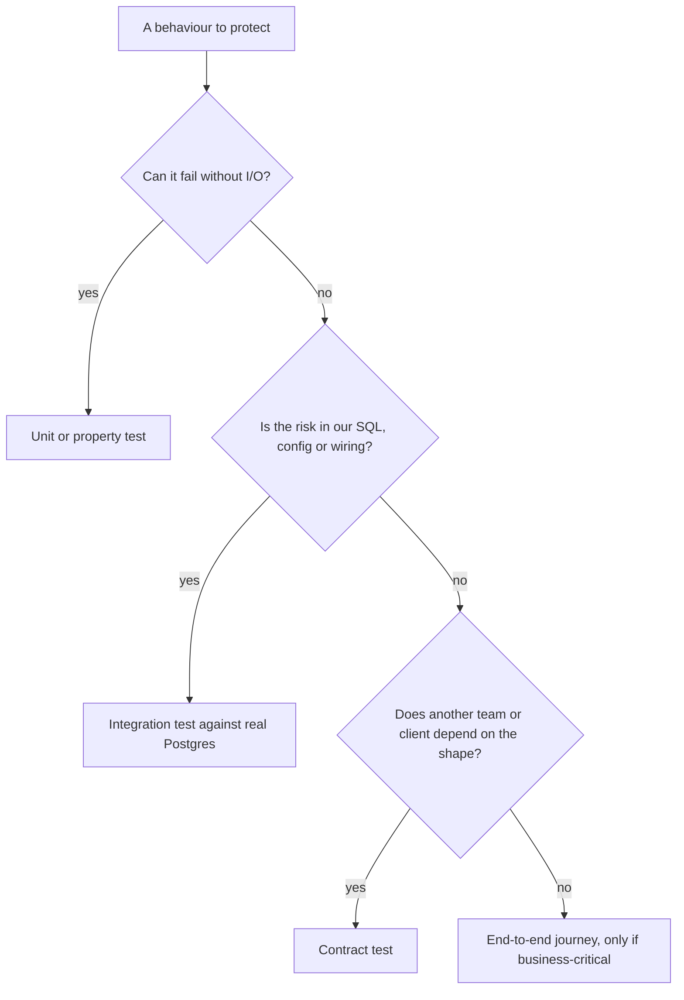

A team has 4,000 tests and a 40-minute CI run. They still ship a release that breaks login, because every test that touched users mocked the database, and a migration renamed the column the real query used. Meanwhile about one CI run in thirty fails for no reason, so everyone has learned to click "re-run" without reading the failure. That reflex is how the next real regression gets merged.

The problem is not a lack of tests. It is a lack of strategy: no one decided what each test is supposed to prove, at what level, at what cost. Tests are an investment portfolio. This lesson is about allocating it, using this repository's actual test suite, gaps included, as the example.

## What a test buys, and what it costs

Every test trades off three properties, and no single kind of test maximises all of them:

- **Fidelity**: how closely the test's world resembles production. A test against a real Postgres has high fidelity; a mocked repository has low fidelity.
- **Speed**: how fast it runs, which decides how often people run it. A pure-function test runs in microseconds; a browser test in seconds.
- **Precision**: how well a failure points at the cause. A failing unit test names a function; a failing end-to-end test says "something between the button and the database".

On the cost side sit runtime, maintenance (how often the test breaks when behaviour did *not* change) and flakiness. A test that fails whenever someone refactors internals is a tax on change, not a safety net. The guiding rule: **test behaviour at the lowest level that can observe it with realistic fidelity**, and no lower.

## The pyramid and its successors

The classic test pyramid says: many unit tests, fewer integration tests, very few end-to-end tests. Its logic is cost: lower tests are faster and more precise. Its failure mode is the story above: thousands of unit tests with mocks that encode the author's assumptions about the database, and nothing that checks those assumptions.

Two later shapes correct for that. The "testing trophy" puts the bulk of effort into integration tests that exercise real modules together, on the grounds that they give the most confidence per test. The "honeycomb", proposed for microservices, argues the same: in a service whose main job is talking to a database and other services, the interesting bugs live in the integration, so test there.

The shapes disagree less than they seem. All of them say: push each check to the cheapest level that can *actually* catch the bug. For pure logic that is a unit test. For SQL, configuration and wiring it is an integration test against the real dependency, because a mock of your database can only confirm what you already believed.



## The pyramid's costs, measured on this repository

The cost argument is easy to state and rarely measured. This repository's CI records it. On the run for commit `527d3d1` (GitHub's `ubuntu-latest` runners, warm caches), each level reported:

| Level | Tests | Reported time | Per test | Paid before the first test | What only this level catches |
|---|---|---|---|---|---|
| Rust unit, api crate | 8 | 0.00 s | microseconds | the shared 19.1 s test build | the CSRF decision, the error mapping, ETags |
| Rust unit, core crate | 16 | 1.83 s | about 0.1 s on average | the same build | hashing, tokens, content parsing |
| API integration, real Postgres | 22 | 1.49 s | about 70 ms of wall time, run in parallel | a Postgres 17 service container, 12 s to initialise | SQL, wiring, authorisation, races |
| Vitest, web | 1,133 | 6.63 s wall, 21% of it in tests | about 1 ms | test environments, 64% of the run | visualiser invariants, the SSE parser, Markdown |
| Playwright, end to end | 24 (12 specs on 2 profiles) | 42.8 s on 2 workers | 2.0 to 7.0 s | about 95 s: SPA and server builds, Chromium install | the real browser, cookies and runners together |

CI reports the core crate's 1.83 s only as a total; its 16 tests include an Argon2 round trip compiled without optimisation and a load of the full embedded curriculum, each far heavier than a typical unit test, so read that row as the cost of those tests rather than of the level. The shape is the pyramid's argument in numbers: each level up costs one to two orders of magnitude more per test, and the top one also pays a minute and a half before its first assertion. That is why the browser suite has 12 journeys and the visualiser suite has 1,133 cases, and why a rule that can be decided without I/O is moved to where a unit test can reach it.

## How this repository tests itself

Read the suite as an inventory, the way you would when joining a team.

**Rust unit tests guard the sharp edges.** They are few and deliberately placed: `crates/core/src/auth/password.rs` checks that a hash starts with `$argon2id$`, that the right password verifies, the wrong one does not, and a missing user (`None`) never verifies. `crates/core/src/auth/token.rs` checks that two generated tokens differ, match the expected 43-character URL-safe format, and hash to 64 hex characters. `crates/core/src/content/blocks.rs` checks that quiz answers are stripped from the public body, which is a security property: the answer key must never reach the browser. `crates/api/src/middleware/csrf.rs` tests its `allowed()` decision directly, including the look-alike origin `https://ascend.example.evil.net` that an earlier prefix comparison would have accepted, and `crates/core/src/ai/anthropic.rs` asserts on the serialised request body that the stable system block carries the cache breakpoint and the volatile context block does not. The CSRF decision was deliberately pulled out of the Axum middleware into a plain function over a `HeaderMap` so that a unit test can reach every case without building a router.

**Content is validated as a test.** The curriculum you are reading is code. `crates/core/src/content/loader.rs` contains a test, `embedded_curriculum_loads`, whose comment calls it "the content CI": a broken front matter or dangling reference fails `cargo test`. CI runs the strict validator as its own step, and the production build goes further: the Dockerfile runs the compiled binary with `--check-content` (the flag is handled at the top of `crates/api/src/main.rs`), strict unless a preview build deliberately opts out, so a broken lesson fails the image build instead of the deploy. There is a `CONTENT_LENIENT=1` escape hatch for authors working concurrently, and the loader's doc comment is explicit that it is never set in CI.

**Frontend visualisers get invariant tests.** Each file in `web/src/viz/families/*.test.ts` feeds every visualiser its example input plus hostile edge inputs (zero or one bucket, forty identical keys, unknown operations) and asserts properties that must always hold: at least one frame, a frame count bounded by the engine's `MAX_FRAMES` cap, and a non-empty explanation on every frame. They do not assert exact output, so they survive changes to wording and layout while still catching crashes and runaway loops.

## The integration suite carries the most weight

**API integration tests carry the most weight.** `crates/api/tests/api.rs` builds the *exact production router* against a real Postgres and drives it in-process with `tower::ServiceExt::oneshot`: no sockets, no browser, milliseconds per request. That is possible only because the api crate is also a library (`crates/api/src/lib.rs` says so in its first comment), which is architecture paying for testability. Read the test names and you have the system's promises: `login_errors_do_not_leak_account_existence`, `csrf_rejects_requests_without_header_or_with_foreign_origin`, `lesson_payload_hides_quiz_answers`, `comments_threading_and_authorisation`, `ai_features_degrade_gracefully_without_a_key`, `malformed_json_uses_the_api_error_shape`, `request_ids_are_server_controlled`. The session test even queries the `sessions` table to prove the raw cookie token is not stored, and `ai_budget_reservation_cannot_be_overshot_by_concurrency` tests a race the only way a race can be tested: it spawns 30 budget reservations at once against a limit of 10 and asserts that exactly 10 succeed. Two newer tests use the same technique on races a review found: `concurrent_registrations_for_one_email_yield_one_account_and_conflicts` fires four sign-ups for one email at once and asserts exactly one `200` and the rest `409` (registration used to check for the email and then insert, so two simultaneous requests could both pass the check and one surfaced as a `500`), and `a_learner_has_at_most_one_active_interview_and_solo_locks_the_coach` races five interview starts and asserts that exactly one is left active. The newest, `boot_migrations_are_locked_and_tolerate_a_newer_schema`, runs two boot-time migrations at once to prove the advisory lock added in commit `8f82820` serialises them, then plants a migration row the build does not know and asserts that boot plans `SchemaAhead` instead of refusing, the rollback case [CI/CD and deployment](/learn/senior-craft/software-craft/ci-cd-and-deployment) traces. These are the tests that would have caught the renamed column in the opening story.

Two design choices are worth copying, and a third was worth questioning until it was fixed. The suite loads a small fixture curriculum from `crates/api/tests/fixtures/content` instead of the real one, so editing a lesson can never break an API test. Every test registers its own uniquely named user, so tests share one database and run in parallel. The questionable one: when `TEST_DATABASE_URL` was unset, each test printed a notice and *passed*, so `cargo test` worked offline. CI's workflow provides a Postgres service container, so the tests really ran there, but nothing checked that they did: a workflow edit that dropped the variable would have turned the whole integration suite into silent passes. Now the skip path starts with `assert!(std::env::var_os("CI").is_none(), "TEST_DATABASE_URL must be set in CI")`. GitHub Actions sets `CI` on every runner, so offline laptops still skip and a misconfigured pipeline fails loudly. The general rule: a skipped test must never look like a passing one in the place that gates merges.

## End-to-end tests

**End-to-end tests cover the journeys only a browser can.** `web/e2e/smoke.spec.ts` drives the real binary and a real Postgres with Playwright, on a desktop and a mobile (`Pixel 7`) profile from `web/playwright.config.ts`. It used to run only on demand, with `make e2e` against a running server, which meant a change that broke the browser journey could merge with every CI check green. CI now has an `e2e` job that runs after the Rust and web jobs pass: it starts Postgres as a service container, builds the SPA and the binary, starts the server, polls `/api/readyz` until it answers, runs `e2e/smoke.spec.ts` in Chromium and uploads the Playwright report and server log if anything fails. It covers register to roadmap to lesson completion, quiz grading and comments, running JavaScript and Python in the browser, and one security regression: a `PUT` with `origin: https://evil.example` and no custom header must get a 403. The integration suite checks the same CSRF rule below the browser; the end-to-end copy proves the real browser, cookies and SPA behave as the server expects. Security controls deserve tests at both levels because they are exactly what a refactor silently removes.

## Under the hood: how the runners schedule tests

Parallelism is where most order-dependence flakes come from, so know what each runner does by default.

- **`cargo test`** builds one binary per crate's unit tests and one per file in `tests/`, and runs the binaries one after another. Inside a binary, libtest runs tests on a pool of threads sized by `std::thread::available_parallelism()`, unless `RUST_TEST_THREADS` or `--test-threads` says otherwise. The 24 tests in `crates/api/tests/api.rs` (22 on the run timed above) therefore run concurrently against one Postgres, which is safe only because each registers its own user; a test that counted all rows in `users` would pass alone and fail in the suite.
- **Tokio tests** (`#[tokio::test]`) each get their own runtime, current-thread by default, so a test that spawns 30 reservations races them on one thread; the race in `ai_budget_reservation_cannot_be_overshot_by_concurrency` is real because the contention is in Postgres, not in Rust.
- **Playwright** starts worker processes, half the logical CPUs by default, which is the "2 workers" in the CI log on a 4-vCPU runner. `web/playwright.config.ts` sets `fullyParallel: false`, so tests inside one file run in order in one worker, and `retries: 0`.
- **Vitest** runs each test file in its own isolated environment by default; the 64% of the run spent on environments is the price of that isolation.

## Contract tests

When two teams (or a client and a server) depend on a shape, an end-to-end test across both is slow, flaky and runs too late. A **contract test** pins the shape at the boundary instead.

In **consumer-driven contract testing** (the model behind tools such as Pact), the consumer records the requests it makes and the responses it relies on. The provider's CI replays those expectations against the real provider. If the provider renames a field a consumer uses, the provider's own pull request fails, before anything is deployed.

A consumer's expectation is data. For the SPA's reliance on the CSRF error, it might read:

```json
{"consumer": "web", "provider": "ascend-api",
 "interactions": [{
   "description": "a forged mutating request",
   "request": {"method": "PUT", "path": "/api/progress/lessons/t/m/l", "headers": {"origin": "https://evil.example"}},
   "response": {"status": 403, "body": {"code": "csrf", "message": {"match": "type", "example": "cross-site request rejected"}}}
 }]}
```

The provider's pipeline replays each request against the real provider and checks the response with the matchers: status equal, `code` equal, `message` any string. Renaming `csrf` to `csrf_rejected` fails the provider's own pull request; rewording the message passes, which is the stable-code rule from [API and error design](/learn/senior-craft/software-craft/api-and-error-design) made executable. A broker records which consumer versions have been verified against which provider versions, so a deploy can ask whether the version about to ship is compatible with what is running.

Inside one repository the idea scales down. The contract between Ascend's SPA and API includes the error shape from the previous lesson, and the integration suite already pins parts of it over HTTP: an unknown endpoint returns code `not_found`, a forged request returns `csrf`, a disabled AI feature returns `ai_disabled`. A table-driven unit test beside the mapping in `crates/api/src/error.rs` would pin *every* variant, including the one that matters most:

```rust
#[tokio::test]
async fn error_contract_is_stable() {
    let cases = [
        (AppError::Validation("email is invalid".into()), 422, "validation_error"),
        (AppError::NotFound("lesson"), 404, "not_found"),
        (AppError::Internal("/srv/secret/path".into()), 500, "internal_error"),
    ];
    for (err, status, code) in cases {
        let res = ApiError(err).into_response();
        assert_eq!(res.status().as_u16(), status);
        let body = axum::body::to_bytes(res.into_body(), 1024).await.unwrap();
        let json: serde_json::Value = serde_json::from_slice(&body).unwrap();
        assert_eq!(json["code"], code);
        assert!(!json["message"].as_str().unwrap().contains("secret"));
    }
}
```

The last assertion is the valuable one: it turns "internal details never leak" from a comment into a check.

## Property-based tests

An example-based test checks the cases you thought of. A **property-based test** states a rule that must hold for *all* inputs and lets a generator search for a counterexample. When it finds one, it **shrinks** it to a minimal failing input, so you debug `"À-"` instead of a 300-character string.

Good properties are rarely "the output equals X". They are shapes like these:

| Property | Example |
|---|---|
| Round trip | `decode(encode(x)) == x` for a pagination cursor |
| Idempotence | `slugify(slugify(s)) == slugify(s)` |
| Invariant | a visualiser never emits more frames than the engine's cap |
| Oracle / model | your open-addressing table agrees with a `dict` after any operation sequence |
| Metamorphic | sorting a shuffled copy gives the same result as sorting the original |

Heading anchors in lessons are generated twice. The server builds the table of contents with `headings` and `slugify` in `crates/core/src/content/blocks.rs`; the browser renders the Markdown, and `rehype-slug` (which uses github-slugger) puts an `id` on each heading. A table-of-contents link works only if the two agree. The first server version used its own rule: keep alphanumeric characters, lowercase them, collapse everything else into single dashes, trim a trailing dash. Its one example test (`"## Big-O: the intuition"` becomes `big-o-the-intuition`) passed, because on that input both rules agree. On many others they do not: github-slugger drops punctuation instead of turning it into a dash (`Why O(1) is a lie` is `why-o1-is-a-lie`, not `why-o-1-is-a-lie`), keeps underscores, turns every space into its own dash (`Two  spaces` is `two--spaces`), and numbers duplicate headings `-1`, `-2`. Those links silently went nowhere. The fix reimplemented github-slugger's rule, pinned each known disagreement as an example test (`heading_ids_match_github_slugger`), and made the site crawl in `web/e2e/crawl.spec.ts` check that every table-of-contents link lands on a heading.

Examples could only pin the disagreements someone had already noticed. The property that actually matters is an oracle property: for *every* heading text, the server's id equals the browser's. Sketched with Python's Hypothesis, where `slugify` is a port of the Rust function and `github_slug` stands for the reference implementation (the real github-slugger, run through Node on the generated inputs):

```python
from hypothesis import given, strategies as st

@given(st.text())
def test_server_ids_match_the_browser(s):
    assert slugify(s) == github_slug(s)               # oracle: the browser's rule

@given(st.text())
def test_slugify_is_idempotent(s):
    assert slugify(slugify(s)) == slugify(s)          # a slug is its own slug
```

### Shrinking, traced

What a property library does after it finds a failure is the part worth understanding. The script below plays both roles: a generator and a shrinker, with the property "the shipped rule agrees with the reference rule" (`slug_shipped` keeps what an `is_alphanumeric`-style check keeps; `slug_reference` keeps letters, marks, decimal digits, `_` and `-`, as github-slugger does for these characters).

```python
import random, unicodedata

def slug_shipped(s):                      # the first reimplementation's rule
    return "".join("-" if c == " " else c for c in s.lower()
                   if c.isalnum() or c in "-_ " or unicodedata.category(c).startswith("M"))

def slug_reference(s):                    # github-slugger's rule, for these characters
    return "".join("-" if c == " " else c for c in s.lower()
                   if c.isalpha() or c in "-_ " or unicodedata.category(c)[0] == "M" or unicodedata.category(c) == "Nd")

def fails(s):
    return slug_shipped(s) != slug_reference(s)

def shrink(s):
    progress = True
    while progress:
        progress = False
        size = max(len(s) // 2, 1)
        while size >= 1:                  # delete chunks, halving the chunk size
            i = 0
            while i + size <= len(s):
                if fails(s[:i] + s[i + size:]):
                    s = s[:i] + s[i + size:]
                    print(f"delete {size} at {i}: {s!r}")
                    progress = True
                else:
                    i += size
            size //= 2
        for i, c in enumerate(s):         # then simplify each character toward 'a'
            if c != "a" and fails(s[:i] + "a" + s[i + 1:]):
                s = s[:i] + "a" + s[i + 1:]
                print(f"simplify {i}: {s!r}")
                progress = True
    return s

rng = random.Random(2026)
case = next(s for s in ("".join(rng.choice("abcXYZ019 -_!(),.é²₂½") for _ in range(rng.randint(0, 24)))
                        for _ in range(1000)) if fails(s))
print("found:", repr(case))
print("minimal:", repr(shrink(case)))
```

It prints:

```text
found: 'X1₂₂é(²é,²)1a₂cX X)a'
delete 10 at 0: ')1a₂cX X)a'
delete 5 at 5: ')1a₂c'
delete 2 at 0: 'a₂c'
delete 1 at 0: '₂c'
delete 1 at 1: '₂'
minimal: '₂'
```

The second generated string failed; twelve property evaluations shrank 20 characters to one, a subscript two, which `isalnum` accepts (Unicode category No) and the reference drops. Hypothesis does the same with more strategies (it shrinks the random choices that built the value rather than the value itself, so it can shrink any generated structure) and stores the minimal example in a local database so the next run tries it first. A shrunk counterexample is also the regression test to keep: `slugs_match_github_slugger_on_unicode_edge_cases` is that list, written down.

Notice what the old example-based mindset would have asserted instead: "no double dashes, no leading or trailing dash, only alphanumerics and dashes". Every one of those is false for github-slugger, so a property suite written from the old implementation's habits would have locked the bug in. Choose properties from the *requirement* (anchors must match the browser), not from the current code.

Unicode is where the surprises hide. Lowercasing can turn one character into two (the Turkish capital dotted I lowercases to `i` followed by a combining dot above), and whether that combining mark survives depends on how your predicate classifies it. Ascend learned this the expensive way. The reimplementation kept any character Rust's `is_alphanumeric` accepted plus one block of combining marks, and it passed every example. Then the full-site crawl found three table-of-contents links that still went nowhere, all in headings like "O(n²)" and "log₂ n": `is_alphanumeric` accepts superscript and subscript digits (Unicode category No), while github-slugger keeps only the Alphabetic property, marks, *decimal* digits and connector punctuation. The fix wrote the rule in the reference's own terms, `[^\p{Alphabetic}\p{M}\p{Nd}\p{Pc} -]`, and replaced hand-written expectations with oracle ones: `slugs_match_github_slugger_on_unicode_edge_cases` pins fifteen inputs whose expected ids came from running github-slugger itself. A generator tries inputs like `²` within seconds; a human writing examples almost never does, and a human deriving expectations from their own reading of the rule repeats their own mistake.

Rust has the same tooling (`proptest`, `quickcheck`); JavaScript has `fast-check`. The visualiser invariant tests above are property tests with a hand-picked generator, which is a fine place to start.

## Test data

Most brittle suites are brittle because of their data, not their assertions.

- **Each test creates what it needs.** Ascend's `web/e2e/helpers.ts` builds a unique email per registration (`uniqueEmail()` combines a timestamp and a random number), and the API integration tests register a fresh user per test, so tests never collide on the unique email constraint and can run against a database that other tests have already written to.
- **Fixture content, not production content.** The API tests load a tiny purpose-built curriculum, so they test the engine, not whatever lessons happen to exist this week.
- **Factories over shared fixtures.** A `make_user(role="admin")` builder with sensible defaults beats a shared `admin@example.com` row that ten tests mutate.
- **Isolation at the database.** Wrap each integration test in a transaction that is rolled back, give each test its own schema, or, as Ascend's API suite does, make every test's data unique so one shared database is harmless. Order-dependent tests are flaky tests waiting for a parallel runner.
- **Time and randomness are inputs.** `AuthService::authenticate` refreshes `last_seen_at` only when more than an hour has passed since the last touch. Testing that branch means controlling the clock, which argues for a clock port in exactly the place [architecture and boundaries](/learn/senior-craft/software-craft/architecture-and-boundaries) said ports pay off: slow or non-deterministic dependencies.
- **Never production data.** Copying production rows into fixtures copies personal data into every laptop and CI log. Generate data instead.

## Flaky tests are bugs

A flaky test produces different results on the same code. A well-known 2014 study of flaky tests in open-source projects found the largest causes were asynchronous waits, concurrency and dependence on test order; time, randomness, network and leaked resources make up much of the rest.

Every cause has a diagnosis and a mechanical fix:

| Cause | Symptom | Diagnosis | Fix |
|---|---|---|---|
| Fixed sleeps | Fails on a slow CI machine | Fails more under load; `--repeat-each` with CPU contention reproduces it | Wait for a condition, not a duration |
| Shared state or order dependence | Passes alone, fails in the suite | Passes with one test thread, fails with many; a random order finds the pair | Per-test data and teardown |
| Wall-clock time | Fails near midnight or across DST | Failures cluster by time of day in CI history | Inject the clock; pin the timezone |
| Randomness | Fails one run in a thousand | The logged seed reproduces it every time | Seed, log the seed, keep the case |
| External services | Fails when a third party is slow | Failures correlate with the provider's status | Fake at the boundary; test the real one in a non-blocking job |
| A race in the product | Fails under parallel load, and users report the same symptom | The failure survives every test-side fix | Fix the product; keep the test |

### Diagnosing a flake

Diagnosis starts with a number. If a test fails with probability $p$ per run, $n$ reruns on one commit show at least one failure with probability $1 - (1 - p)^n$. To catch a 2% flake with 95% confidence you need $n \geq \ln 0.05 / \ln 0.98 \approx 148$ runs; a 0.1% flake needs about 2,995. So "I reran it ten times and it passed" rules out almost nothing: ten runs catch a 2% flake only 18% of the time. Playwright's `--repeat-each=200` and a shell loop over `cargo test <name>` produce those runs; running once with `--test-threads=1` and once without separates order dependence from everything else. Then read the artifacts: Ascend's CI uploads the Playwright report, traces and `server.log` on failure, so the first failure is also the first diagnosis.

The last row is the one that matters. Ascend's coach once dropped the first streamed reply of a new conversation: creating the conversation navigated between two routes, which remounted the page mid-stream. Commit `6cf9c45` fixed it with one route and a guard that never hydrates server history over a live stream, and added an opt-in Playwright spec for the AI journeys (`E2E_AI=1`, since it calls the real model). A test that flickered on that bug was reporting a real one.

Playwright's web-first assertions are the first fix built in: `await expect(page.getByTestId("results")).toContainText(...)` polls until the condition holds or a timeout expires, instead of sleeping a guessed duration. Ascend's config also sets `retries: 0`. That is a policy choice: retries make a suite green while hiding the flake. Where a test is genuinely slow rather than flaky, the suite says so explicitly: the Pyodide test raises its own timeout to 180 seconds because the first run downloads the Python runtime.

A senior team's policy looks like this: a flaky test is **quarantined** (moved out of the blocking suite) with an owner and a deadline, flake rate is **measured** from CI history rather than guessed, and "passed on retry" is recorded as a failure signal, not a success. Measuring starts with a definition you can compute.

```exercise
id: find-flaky-tests
title: Find flaky tests in CI history
prompt: |
  CI history is a list of runs `[test_name, commit, passed]`, where `passed`
  is a boolean. A test is **flaky** if, on at least one commit, it both passed
  and failed. A test that fails on one commit and passes on a later one is a
  regression that got fixed, not a flake.

  Return the names of flaky tests, sorted alphabetically, each listed once.
languages: [python, javascript]
entry: find_flaky
starter:
  python: |
    def find_flaky(runs):
        # your code here
        return []
  javascript: |
    function find_flaky(runs) {
      // your code here
      return [];
    }
tests:
  - args: [[["login_works", "a1", true], ["login_works", "a1", false], ["search_finds_lesson", "a1", true]]]
    expected: ["login_works"]
  - args: [[["csrf_rejects", "a1", false], ["csrf_rejects", "a1", false], ["csrf_rejects", "b2", true]]]
    expected: []
    label: a fixed regression is not a flake
  - args: [[]]
    expected: []
    label: empty history
  - args: [[["z_test", "c3", true], ["a_test", "c3", false], ["z_test", "c3", false], ["a_test", "c3", true], ["m_test", "c3", true]]]
    expected: ["a_test", "z_test"]
    label: sorted output
  - args: [[["t", "a", true], ["t", "a", false], ["t", "b", false], ["t", "b", true]]]
    expected: ["t"]
    hidden: true
    label: flaky on two commits is listed once
  - args: [[["x", "a", true], ["x", "b", false], ["y", "a", true], ["y", "a", true]]]
    expected: []
    hidden: true
    label: mixed outcomes across different commits
hints:
  - "Group outcomes by the pair (test, commit), not by test alone."
  - "A group is flaky when it contains both true and false; collect those test names in a set."
```

## Reviewing a change for tests

When you review a pull request, ask what each new behaviour needs, not "are there tests":

- A new branch in pure logic: a unit test, or a property if the input space is large.
- A new query or migration: an integration test against real Postgres.
- A new endpoint or error: the error-contract table gains a row.
- A new user journey that makes money or protects users: one end-to-end test of the happy path.
- A bug fix: a regression test that **fails before the fix**. If you never saw it fail, you do not know that it tests anything.

The foundations track covers the single-function version of this discipline in [testing your own code](/learn/foundations/problem-solving/testing-your-own-code), and [verifying AI code](/learn/ai-assisted-engineering/tools-and-workflows/verifying-ai-code) applies it to code you did not write.

## Failure modes

| Symptom | Diagnosis | Fix |
|---|---|---|
| CI green, production broken by a renamed column | Every repository test mocked the database | Integration tests that run the real SQL against the migrated schema |
| A pull request's build takes 40 minutes and people stop waiting for it | Browser tests used where a unit or integration test could observe the behaviour | Push each check down; keep end-to-end for journeys |
| "Re-run" is the team's reflex and real regressions merge | Retries hide flakes; no flake-rate tracking | Quarantine with an owner and a date; count pass-on-retry as a failure signal |
| The integration suite silently stops running | A skip path that passes when its dependency is missing | Fail in CI when the dependency is absent, as `CI` makes Ascend's tests do |
| Tests pass alone and fail together | Shared rows, global state, or a test that assumes an empty table | Unique data per test; run single-threaded to confirm |
| A property test passes forever | The property was derived from the current code, not the requirement | Use an oracle or a round trip that states the requirement |

## Trade-offs

| Technique | Fidelity | Speed | Failure precision | Maintenance | Best for |
|---|---|---|---|---|---|
| Unit test with fakes | Low at the boundaries | Microseconds | Names the function | Breaks when internals are refactored | Pure logic, decisions pulled out of frameworks |
| Integration test, real dependencies | High | Tens of milliseconds | Names the endpoint | Needs a database in CI | SQL, wiring, authorisation, races |
| Contract test | High at one boundary | Milliseconds to seconds | Names the interaction | A broker and a discipline across teams | Shapes other teams depend on |
| Property test | Depends on the oracle | Hundreds of cases per run | A shrunk minimal input | Generators and properties to design | Large input spaces: parsers, encoders, slugs |
| End-to-end test | Highest | Seconds | "Somewhere in the journey" | Selectors and timing | A few money or safety journeys |

## Interviewer follow-ups

**"Your CI takes 40 minutes. How do you cut it without losing confidence?"** Model answer: measure per job and per test first, then push checks down (a browser test that only checks an API response becomes an integration test), parallelise independent jobs, cache dependencies, and keep a small end-to-end set on every change with the long tail on a schedule. Common wrong answer: "delete the slow tests" or "run them nightly only", which moves the failure to after the merge.

**"How do you know a test is flaky and not the product?"** Model answer: rerun on the same commit enough times to estimate the rate (about 150 runs for a 2% flake), then isolate: single-threaded versus parallel, alone versus in the suite, pinned seed and clock. If it survives every test-side fix, it is a race in the product. Common wrong answer: "it passed on retry, so it is flaky."

**"When is a mock the wrong tool?"** Model answer: when the thing mocked is the thing most likely to be wrong: your SQL, your schema, your serialisation. A mock can only confirm the author's belief about it. Fake slow, costly or non-deterministic vendors at the boundary instead. Common wrong answer: "mock everything so tests are fast."

**"What makes a good property?"** Model answer: a round trip, an invariant, idempotence or an oracle derived from the requirement, run against a generator that includes hostile inputs; and when it fails, the shrunk case becomes an example test. Common wrong answer: "the output equals the expected value", which is an example test in disguise.

## What mid-level engineers get wrong

- **Counting tests or coverage instead of asking what each test proves.** 100% coverage of mocked code proves the mocks.
- **Mocking the database** and discovering schema drift in production.
- **Sleeping in tests**, then raising the sleep when it fails.
- **Retrying flaky tests automatically** and treating pass-on-retry as a pass.
- **Skipped tests that report success** in the place that gates merges.
- **Writing properties from the implementation** so the property shares the bug.
- **Fixing a bug without a test that failed first.**

## Senior signals

- You describe tests by **what they prove and what they cost** (fidelity, speed, precision), not by counting them.
- You test SQL and wiring **against the real database**, and you can explain why a mocked repository cannot catch a renamed column.
- You reach for **contract tests** at team boundaries and **property tests** where the input space is large, and you can name a good property for a given function.
- You treat **flaky tests as bugs** with owners, quarantine them rather than retrying them, and measure flake rate from CI history.
- You put **security controls under test** (CSRF, authorisation, secret non-leakage) because refactors remove them silently.
- You require every bug fix to come with a test that **failed before the fix**.
- You can **quote the cost of each level** in your own pipeline and **size a flake investigation** with the rerun arithmetic.

## Check yourself

```quiz
- q: >-
    Every repository test in a service mocks the database client. A migration renames a column and production breaks, yet CI stayed green. What is the most direct fix?
  options: ["Integration tests that run the real queries against migrated Postgres", "A coverage gate that fails the build below 100% of repository lines", "More unit tests around the repository, each with its own stricter mock", "An end-to-end browser test for every page that reads from that table"]
  answer: 0
  explanation: >-
    The mocks encoded the old column name, so they could only confirm the author's assumption, and stricter mocks or full coverage of mocked code add no fidelity. Only a test that executes the real SQL against the real, migrated schema can catch the drift. Browser tests would catch it too, but slowly, late and imprecisely, which is why the integration level is the direct fix.
- q: >-
    Which is the best property to test for a function that encodes and decodes an opaque pagination cursor?
  options: ["decode(encode(x)) == x for every valid position x", "encode(x) finishes in under 1 ms for any input", "decode(s) returns a position for any string s", "encode(x) is always exactly 43 characters long"]
  answer: 0
  explanation: >-
    Round-trip is the defining property of an encoder/decoder pair and holds for every input, which is exactly what a generator can search. A fixed length is false for variable-length positions, a timing bound is a flaky benchmark rather than a property, and decode should reject garbage input with an error rather than return a position for everything.
- q: >-
    A Playwright test uses page.waitForTimeout(2000) before checking a result and fails about one run in fifty. What is the right fix?
  options: ["Replace the sleep with an assertion that waits for the result", "Enable retries: 2 so a single slow run no longer fails the build", "Raise the wait to 5000 ms so slow CI machines have enough time", "Skip the test on CI and keep running it locally before each merge"]
  answer: 0
  explanation: >-
    Fixed sleeps are the most common flake cause: too short on a slow machine, wasted time on a fast one. A web-first assertion polls for the condition, so the test becomes both faster and deterministic. A longer sleep only moves the failure rate, retries hide the flake (Ascend's Playwright config sets retries: 0 for that reason), and skipping it in CI removes the check from the place that gates merges.
- q: >-
    Why does Ascend's production build run the binary with --check-content in strict mode, in addition to the embedded_curriculum_loads unit test?
  options: ["It shrinks the binary by dropping lessons that fail validation", "It lets the server skip parsing the curriculum at every boot", "It checks the exact content compiled into the binary that will ship", "It replaces the CI validation step, which only runs in lenient mode"]
  answer: 2
  explanation: >-
    Checking the artifact you are about to ship closes the gap between "tests passed somewhere" and "this binary is valid". Found at boot, a content error fails the deploy; found in the build, it blocks the image before anything ships. It complements the CI step, which is strict too, rather than replacing it; nothing is dropped from the binary, and the server still parses the curriculum at every boot.
- q: >-
    Your team's CI retries failing tests up to twice and reports green if any attempt passes. What is the main risk?
  options: ["Test order becomes fixed, so order-dependent bugs can no longer appear", "Flaky tests start failing more often because they run more times", "Every run gets slower because each test is now executed three times", "Real intermittent bugs, such as races in the product, look like noise"]
  answer: 3
  explanation: >-
    Some flakes are real product bugs (races, timeouts) that users will hit, and automatic retries turn them into green builds with no signal. Only failing tests are retried, so passing runs are not slower, and retrying changes neither test order nor how often the underlying bug fires. If you retry at all, record a pass-on-retry as a flake event and track it.
- q: >-
    A test fails in about 2% of runs. Roughly how many reruns on the same commit do you need to see at least one failure with 95% probability?
  options: ["About 20 reruns", "About 50 reruns", "About 500 reruns", "About 150 reruns"]
  answer: 3
  explanation: >-
    The chance of at least one failure in n runs is 1 - 0.98^n, which passes 0.95 at n = ln 0.05 / ln 0.98, about 148. Twenty runs catch it only a third of the time and fifty about 64% of the time, which is why a handful of green reruns proves little; 500 is more than needed.
```
