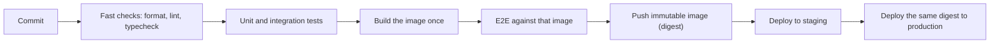
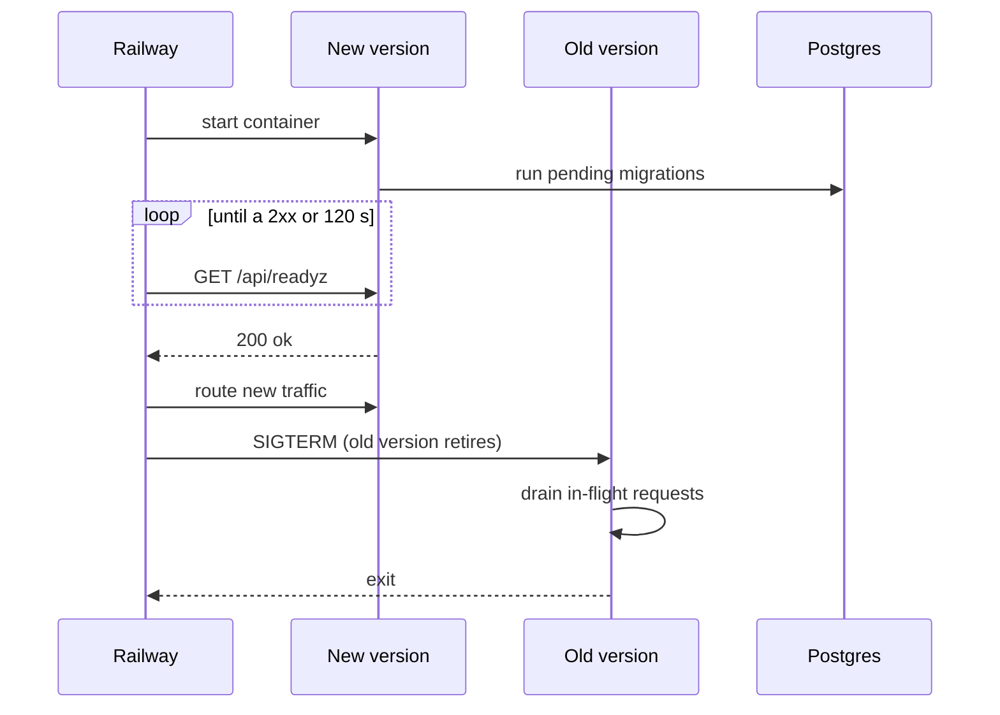

A team ships every two weeks. The release has a 40-item checklist, a release manager, and around 200 merged changes. When it breaks production, nobody knows which of the 200 changes did it, rolling back reverts all 200 (including three urgent fixes), and the real fix waits for the next train. After two bad releases the team decides to deploy *less* often, with a longer checklist. Each release now carries 400.

The instinct is backwards. Risk per deploy grows with the size of the deploy, and diagnosis time grows with the number of suspects. Small, frequent, automated, reversible deploys are safer. The DORA research programme's delivery metrics (originally four: deployment frequency, lead time for changes, change failure rate, time to restore service; [now five](https://dora.dev/guides/dora-metrics/)) consistently show speed and stability correlated rather than traded, with top performers doing well on all of them. This lesson builds that machinery: the pipeline, environments, the deploy, release strategies, rollback, and the migrations that make rollback hard.

## The pipeline: build once, promote the artifact

A delivery pipeline turns a commit into a running, verified release:



Four rules carry most of the value:

1. **Order by cost.** Formatting and type errors fail in seconds; nobody should wait for a browser suite to learn about them.
2. **Build once.** The artifact tested is the artifact deployed, identified by an immutable digest, never "the same Git SHA rebuilt for production": a rebuild can resolve a base-image tag or a dependency differently and ship something nobody tested.
3. **Test the artifact, not the source.** End-to-end tests run against the built image, so packaging mistakes (a missing asset, a wrong entrypoint) fail before users see them. [Testing strategy](/learn/senior-craft/software-craft/testing-strategy) covers what earlier stages should prove.
4. **Keep it fast.** A pipeline people wait 45 minutes for gets bypassed.

## This app's pipeline, timed

`.github/workflows/ci.yml` ran five jobs when measured on the push of commit `527d3d1` to `main` (run 36441384084, all caches warm; the commit changed lessons and three files under `web/src`), the run took 4 minutes 16 seconds:

| Job | Starts at | Duration | Where the time goes |
|---|---|---|---|
| problems | 0 s | 14 s | every practice problem's reference solution, then the quiz-order check |
| web | 1 s | 43 s | frozen-lockfile install 3 s, typecheck 9 s, Vitest 7 s (1,133 tests), build 11 s |
| rust | 1 s | 70 s | Postgres service container 12 s, cache restore 10 s, clippy 8 s, `cargo test` 23 s (19 s of it compiling), strict content validation 8 s |
| image (needs rust, web) | 75 s | 166 s | buildx setup 12 s, `docker build` 136 s |
| e2e (needs rust, web) | 76 s | 177 s | Postgres 14 s, SPA build 14 s, cache 18 s, debug server build 16 s, server ready 2 s, Chromium install 47 s, 24 Playwright tests 43 s |

The critical path is rust then e2e: 70 + 177 seconds plus scheduling. The tests are quick (22 API integration tests in 1.49 s, 24 Playwright tests in 42.8 s), so compilation, installs and setup cost more than testing; the largest step, installing Chromium, is cacheable. And `needs: [rust, web]` makes e2e wait 75 seconds for jobs whose outputs it does not use: runner minutes saved on red builds, paid for in wall-clock time on green ones.

Caches decide the rest:

| Run | Commit and cache state | rust job | e2e debug build | image build | Total |
|---|---|---|---|---|---|
| 36441384084 | `527d3d1`, warm | 70 s | 16 s | 136 s | 4 m 16 s |
| 36301079237 | `6ab2be2`, `Cargo.lock` changed | 156 s | 34 s | 260 s | 7 m 42 s |
| 36299226124 | `8657191`, e2e and image caches empty | 60 s | 347 s | 356 s | 9 m 01 s |

A cold Rust cache turns a 16-second build into almost six minutes. [Containers and infrastructure as code](/learn/senior-craft/software-craft/containers-and-infrastructure-as-code) traces why each of these three image builds hit or missed.

## What the timings teach, and the gaps they expose

**Cancellation has a cost.** A `concurrency` group cancels a run when a newer commit arrives on the branch. On 27 September run 36298629453 was cancelled with its image job two and a half minutes in; no earlier run had finished one either, so the layer cache had never been written and the next run built every layer (the 356-second row).

**Rule 3 was approximated; rule 2 still is.** The `e2e` job above tested a debug binary compiled from source, so a packaging mistake or a production-only default passed it. Since commit `8861312` the `image` job replaces it: it builds the Dockerfile, runs that image with its production defaults against a Postgres service, checks that `/api/readyz` reports the commit as `build`, runs the Playwright suite, then requires `docker stop` to exit 0 within 25 seconds with `shutdown complete` logged. Railway still builds its own image from the same commit; frozen lockfiles and digest-pinned base images make the inputs equal, a fair trade for one person, where the stricter design deploys CI's digest.

**Local parity.** `make check` mirrors the format, lint, test and validation steps, not the SPA build, image, browser suite or audits.

## The pipeline is also an attack surface

On the timed run every action was referenced by a movable tag such as `actions/checkout@v4`, and the token had default permissions. Commit `8f82820` pinned each action to a SHA, made the token read-only (`permissions: contents: read`), added `cargo audit` and `pnpm audit --prod`, and let Dependabot propose weekly pull requests to move the pins; patch, minor and digest-only ones now merge themselves once CI passes. [Security fundamentals](/learn/senior-craft/software-craft/security-fundamentals) traces the 2025 incident behind it.

## Environments and configuration

The same artifact runs everywhere; only configuration and data differ.

| Environment | What runs | Data | What it catches | In this repository |
|---|---|---|---|---|
| Local | `make dev` or `make run` | a Postgres 17 container | logic errors, in seconds | yes |
| CI | debug and release builds | an empty Postgres per job | regressions, integration, browser journeys | the rust and image jobs |
| Preview | one deployment per pull request | seeded | what reviewers need to click | not configured |
| Staging | the production artifact | realistic volume | config, migrations on real-sized data, third-party integrations | none |
| Production | the artifact | real | everything else | Railway, one replica |

Staging earns its cost when it differs from CI in the dimension that breaks you: data volume (a migration that takes 40 ms on 10,000 rows can take minutes on 400 million, as [schema migrations at scale](/learn/databases/data-modeling-and-evolution/schema-migrations-at-scale) measures) or real integrations. Staging with CI's data adds only a queue.

Configuration must be data read from the environment and **validated at boot**. `crates/core/src/config.rs` refuses to start on a bad value (a non-Postgres `DATABASE_URL`, or production without secure cookies), so a bad variable fails the new deployment's health check while the previous version keeps serving, instead of failing the first request that touches it.

Configuration can also be a release switch. With no `ANTHROPIC_API_KEY`, AI routes return `AiDisabled` (a 503 with code `ai_disabled`) and the UI shows a notice. That is a **feature flag**: it separates *deploying* code from *releasing* behaviour.

## How this app deploys

`.railway/railway.ts` declares the platform resources as code, including how a new version proves it is healthy:

```typescript
// excerpt from .railway/railway.ts
const app = service("ascend", {
  // Builds the root Dockerfile. A push to main deploys once CI passes.
  source: github("thull32/ascend", { checkSuites: true }),
  replicas: { [region]: 1 },
  // Migrations run on boot before the server binds, so a passing readiness
  // probe means the schema is current and Postgres is reachable.
  healthcheck: "/api/readyz",
  healthcheckTimeout: 120,
  // env: ...
});
```

`checkSuites: true` makes Railway wait for the commit's GitHub check suites before it deploys. It used to read `false`, leaving branch protection as the only thing between a red build and production.

The boot sequence in `crates/api/src/main.rs` makes the health check meaningful: validate config, connect to Postgres, **plan and run pending migrations under an advisory lock** (below), load the curriculum and the grader's runtimes (production refuses to boot without them), and only then bind the port. `/api/readyz` runs `SELECT 1` and reports the database status, AI configuration, content version and build (the commit, from `RAILWAY_GIT_COMMIT_SHA`), so a 200 means "config valid, schema current, database reachable, content loaded". [Build and deploy](/learn/case-study-ascend/shipping/build-and-deploy) walks the same path from the codebase's side.



Railway's [healthcheck documentation](https://docs.railway.com/reference/healthchecks) fixes the rest of the contract. The platform polls the path until it gets any 2xx, for 300 seconds by default (this service sets 120); if the window passes, the deploy is marked failed and the old deployment keeps serving. Railway does **not** poll the endpoint once the deployment is live: a process that later crashes is restarted by the [restart policy](https://docs.railway.com/deployments/restart-policy) (by default on failure, at most 10 times), not by a probe. A failed migration exits before binding, so traffic never moves. This is neither blue-green nor a canary: one replica is replaced by its successor, and every user moves at once.

## Draining, and the setting that decides it

Zero downtime needs the old version to finish what it started. On SIGTERM the server (`crates/api/src/serve.rs`) stops accepting connections, lets in-flight requests complete, then waits for background tasks such as an AI reply still being saved for a learner who closed the tab. A request can legitimately run for minutes: `TimeoutLayer` allows 240 seconds, and a streamed AI reply may use most of that.

How long the platform waits between SIGTERM and SIGKILL decides whether any of that runs. Railway calls it `RAILWAY_DEPLOYMENT_DRAINING_SECONDS`, and its [variables reference](https://docs.railway.com/reference/variables) gives the default as **0 seconds**: SIGTERM, then SIGKILL at once. Until commit `8f82820` `railway.ts` did not set it, so correct shutdown code never got time to run, and the symptom (a reply cut off mid-stream during a deploy) looked like a network blip until a review read the platform's documentation beside the code. `railway.ts` now sets it to `"60"`, and the server bounds its own shutdown to fit: `DRAIN_TIMEOUT` gives open connections 25 seconds (otherwise one client that stops reading a stream holds shutdown until SIGKILL), then background tasks get 30. 25 + 30 = 55, under 60, so the process reaches its own `shutdown complete`; a reply cut at 25 seconds is still persisted if its task finishes within the next 30. Code that runs only during deploys breaks unnoticed, so it is tested twice: `crates/api/tests/shutdown.rs` drives `serve` over real sockets (an in-flight request finishes, idle keep-alive connections do not delay exit, a stalled stream is abandoned at the deadline), and the CI image must stop cleanly under `docker stop`.

Readiness and liveness are different questions. `/api/healthz` answers "is the process up?" and checks nothing else; `/api/readyz` answers "should this instance get traffic?" and checks the database. An orchestrator that restarts containers on failed *liveness* must never use a check that depends on the database, or a 40-second database failover becomes every instance restarting at once.

## Blue-green, step by step

Blue-green keeps two complete environments and switches all traffic:

| Step | Traffic blue / green | What happens | Gate before the next step | Rollback |
|---|---|---|---|---|
| 1. Deploy green | 100 / 0 | green starts at full size from the same digest | every green instance ready | delete green |
| 2. Verify | 100 / 0 | smoke tests and synthetic transactions hit green's private address | smoke suite green | delete green |
| 3. Warm | 100 / 0 | replayed or synthetic load fills caches, JIT and connection pools | green p99 under load within target | delete green |
| 4. Switch | 0 / 100 | the router sends new requests to green; blue drains | error rate and p99 for 15–30 min against the pre-switch level | switch back, in seconds |
| 5. Retire | 0 / 100 | blue scales down or becomes the next idle colour | none | redeploy the old digest |

```viz
{"type": "system", "algorithm": "blue-green", "title": "Blue-green: verify idle, switch atomically", "caption": "The new version is tested at full size before it sees users. Rollback is a router change, not a redeploy. Both colours share the database, so the schema must suit both."}
```

The costs are double capacity during the switch and all-at-once exposure: a bug that only real traffic triggers reaches every user until someone switches back. Step 4 compares green with *blue's past*, so a traffic spike during the watch looks like a regression. And the switch is atomic for new requests only: an L7 proxy routes per request, but an L4 load balancer routes per connection, so keep-alive connections, WebSockets and server-sent event streams stay on blue until they close. Both colours usually share one database, so **the schema must work for both versions at once**.

## Canary, step by step

A canary sends a small share of traffic to the new version, compares it with the old one serving *at the same time*, and widens the share while the comparison stays clean. The plan below is for a service at 1,000 requests per second with a 0.1% error rate and a 180 ms p99; "roll back above" is the error count computed in the next section.

| Stage | Canary share | Window | Canary requests | Expected errors if healthy | Roll back above | Latency gate | Decision |
|---|---|---|---|---|---|---|---|
| 1 | 1% | 10 min | 6,000 | 6 | 13 | canary p99 over 1.2 × baseline p99 | pass → 5% |
| 2 | 5% | 10 min | 30,000 | 30 | 46 | same | pass → 25% |
| 3 | 25% | 10 min | 150,000 | 150 | 186 | same | pass → 50% |
| 4 | 50% | 10 min | 300,000 | 300 | 351 | same | pass → 100% |
| 5 | 100% | 30 min bake | all traffic | | burn-rate alerts | same | done; keep the old digest |

```viz
{"type": "system", "algorithm": "canary", "title": "Canary: widen only while the comparison stays clean", "caption": "Compare the canary with the baseline over the same window, so a traffic spike that slows both does not fail the release. Every promotion repeats the same gate."}
```

Compare against the concurrent baseline, because traffic mix and load change hour to hour: is v2 worse than v1 right now, on the same traffic? Compare error rate, p99 latency, saturation and at least one business metric, because some bugs return 200 with the wrong content. Netflix has described going further: it starts a fresh *baseline* cluster of the old version beside the canary, the same size and at the same time, so effects of long-running production instances do not bias the comparison. Its open-source Kayenta, released with Google, classifies each metric with a Mann-Whitney U test and scores the canary by the percentage that pass.

## Sample size decides the stage length

A healthy canary that sees $n$ requests at the baseline error rate $p$ expects $e = np$ errors. Error counts are close to Poisson, with standard deviation $\sqrt{e}$, so a gate that tolerates three standard deviations rolls back when errors exceed $e + 3\sqrt{\max(e, 1)}$; the floor of 1 keeps a stage that expects almost no errors from failing on the first one. Two questions set each stage: how often does a healthy canary fail (false alarm), and how often is a real regression caught (power)?

```python
import math

def poisson_at_least(k, lam):
    """P(X >= k) for X ~ Poisson(lam); fine for lam below about 700."""
    term = cdf = math.exp(-lam)
    for i in range(1, k):
        term *= lam / i
        cdf += term
    return max(0.0, 1 - cdf)

def stage(rps, pct, minutes, base_rate, bad_rate, z=3.0):
    n = rps * pct / 100 * 60 * minutes            # requests the canary sees
    e = n * base_rate                             # expected errors if healthy
    limit = e + z * math.sqrt(max(e, 1))
    k = math.floor(limit) + 1                     # smallest count that fails the gate
    return (round(n), round(e, 1), round(limit, 2),
            round(poisson_at_least(k, e), 4),         # false alarm
            round(poisson_at_least(k, n * bad_rate), 3))  # power

for pct, minutes in [(1, 1), (1, 5), (10, 1)]:
    print(pct, minutes, stage(1000, pct, minutes, 0.001, 0.005))
# 1 1 (600, 0.6, 3.6, 0.0034, 0.353)
# 1 5 (3000, 3.0, 8.2, 0.0038, 0.963)
# 10 1 (6000, 6.0, 13.35, 0.0036, 1.0)
```

For a release that raises errors fivefold, from 0.1% to 0.5%, a 1% canary evaluated after one minute catches it only 35% of the time: 600 requests expect 0.6 errors, the bug produces 3 on average, and the gate needs 4. For 95% power it needs about 4.4 minutes, a 10% canary about 30 seconds. A regression from 0.10% to 0.18% is caught at 1% for 10 minutes only 20% of the time, at 5% 85% of the time, and at 25% almost always. Each evaluation here raises a false alarm 0.2–0.4% of the time, and checking every minute multiplies that by up to the number of looks, so fix the evaluation points in advance. Stage lengths are arithmetic.

## A failed canary, traced

Release v2 fails requests whose `Accept-Language` it mishandles, raising the error rate from 0.10% to 0.18%. The plan is the table above; the baseline error rate stays at 0.1% throughout.

| Clock | Event | Canary requests | Canary errors | Limit | Decision |
|---|---|---|---|---|---|
| 10:00 | router weight 1% to v2 | 0 | 0 | | |
| 10:10 | stage 1 closes | 6,000 | 11 | 13.35 | pass: 11 is inside the noise around 6 |
| 10:10 | router weight 5% | | | | |
| 10:20 | stage 2 closes | 30,000 | 54 | 46.43 | **roll back** |
| 10:20 | router weight 0% for v2 | | | | new requests go to v1 within seconds |
| 10:20–10:22 | v2 instances drain and stop | | | | in-flight requests finish |
| 10:22 | release marked failed; alert carries both counts and the query | | | | |

The counts are typical, not lucky: the power arithmetic above gives this bug an 80% chance of passing stage 1 and an 85% chance of failing stage 2. Exposure was 36,000 requests, of which about 29 failed because of the bug (0.08% of 36,000). Sent to 100% at once, the same bug fails 0.8 extra requests every second, 480 for every ten minutes a signal this weak takes to notice. Rollback took seconds because it was a routing change; no redeploy, no rebuild.

## Under the hood: how traffic is split

Weights live in the layer-7 proxy. Envoy's `weighted_clusters`, the Kubernetes Gateway API's weighted `backendRefs` and cloud load balancers' weighted target groups pick a destination per request, and controllers such as Argo Rollouts and Flagger step the weights and query metrics between steps. A per-request random split sends one user's consecutive requests to different versions, which breaks anything version-coupled, such as a single-page app whose content-hashed assets exist only in the version that built them. Hash the user or session ID into the split so each user sees one version.

This app showed the asset problem without any canary. After a deploy that changed a lazy-loaded chunk, a tab opened before it requested `/assets/Dashboard-<old hash>.js`, and `static_handler` fell back to `index.html`, so the import failed as HTML served where JavaScript was expected. Commit `8f82820` fixed both ends: the server answers a missing `/assets/…` path with `404` and `Cache-Control: no-store`, and `web/src/main.tsx` reloads once on Vite's [`vite:preloadError`](https://vite.dev/guide/build.html) event, with a `sessionStorage` flag so a broken build cannot loop. Keeping previous builds' assets would avoid even that reload, but the binary embeds one build, so that needs an external asset store.

A one-replica service cannot split by instance, but it can canary by **feature flag**: hash the user ID, enable the new path for 5% of users, and compare their error rate with everyone else's.

## Rollback, roll-forward and irreversible changes

Rollback means redeploying the previous artifact. It is fast when artifacts are immutable and retained, and it is the default response because it restores service before anyone understands the bug. Decide the trigger before deploying ("roll back if errors exceed the stage limit, or p99 exceeds 1.2 times the baseline for five minutes") and roll forward only when the fix is smaller and better understood than the rollback.

Some changes cannot be undone by redeploying code: a migration that **dropped or rewrote** data, data written in a **new format** the old version cannot read, and **external side effects** such as emails sent or payments captured.

This app had one more, found by reading the migration library. sea-orm-migration 2.0.3 errors when the database records a migration the binary does not know ("Migration file of version 'm0007_integrity' is missing, this migration has been applied but its file is missing"). `main.rs` used to call `Migrator::up` at boot and propagate that error, so a rollback never turned healthy, and a release whose migration committed but whose new version failed its health check left the old deployment serving but unable to survive its next restart. Commit `8f82820` replaced the call with `crates/api/src/migrate.rs`, which reads the recorded versions itself and picks one of four plans:

| The database, relative to the binary | Plan | Boot |
|---|---|---|
| has exactly the binary's migrations | `UpToDate` | serves |
| lacks some of the binary's migrations, has nothing extra | `Apply` | runs them, then serves |
| has extra migrations, lacks none of the binary's | `SchemaAhead` | serves without migrating, after a WARN "database schema is ahead of this build" |
| has extra migrations *and* lacks some of the binary's | `Diverged` | refuses to boot: two branches were deployed against one database |

`SchemaAhead` is safe only under a contract the code cannot check: every migration stays expand-only for at least one release. The history shows what breaking it looks like: before commit `7154e9f` the comment entity read `user_id` as a non-null `Uuid`, and `m0007` made the column nullable, so an older binary would boot as `SchemaAhead` and then fail to decode any comment whose author had deleted their account. Relaxing a constraint is a contract change for old readers.

## Migrations when two versions are live

During a rollout, blue-green and any rollback, **old code runs against the new schema**. Renaming a column in one step breaks the old version instantly. Expand and contract spreads the change across releases, each compatible with the one before; here `users.name` becomes `display_name`:

| Release | Migration | Writes | Reads | Live together | Roll back one release? |
|---|---|---|---|---|---|
| R1 expand | add `display_name`, nullable | both columns | `name` | R0, R1 | yes: R0 boots as `SchemaAhead` and ignores the new column |
| backfill job | none | fills `display_name` in batches | | R1 | |
| R2 | none | both | `display_name` | R1, R2 | yes: R1 reads `name`, which R2 still writes |
| R3 | none | `display_name` | `display_name` | R2, R3 | yes; two releases back to R1 is not, since `name` went stale |
| R4 contract | drop `name` | `display_name` | `display_name` | R3, R4 | to R3 only |

Writing both before reading the new column means the backfill only covers rows older than R1. The contract waits longest because it removes the last rollback target.

This repository's conventions, at the top of `migration/src/lib.rs`, are the same discipline in miniature: migrations are **append-only** (editing a shipped one only changes what fresh databases get), and every foreign key declares an `ON DELETE` policy. When the comments table was found to cascade user deletion into other people's replies through `parent_id`, the correction shipped as `m0007_integrity`, not as an edit to `m0004_community`.

Migrating at boot fits one replica, and a review raised two limits. sea-orm-migration 2.0.3 takes no lock around `up`, so replicas booting together would all run the pending migration, and the second to commit would fail on the `seaql_migrations` primary key or on DDL that already ran. `migrate.rs` now takes a transaction-scoped advisory lock (`pg_advisory_xact_lock` on a fixed key) before planning, so a second replica waits, then finds `UpToDate`; a replica that crashes mid-run drops its connection, which releases the lock. The other limit stands: a migration longer than the 120-second health window fails the deploy midway, so large-table work (an index on a big table, a backfill) belongs in a separate, online step.

## Let the error budget decide when to ship

A service level objective turns "is it reliable enough?" into arithmetic. With an SLO of 99.9% successful requests over 30 days, the **error budget** is the other 0.1%: at 10 million requests a month, 10,000 may fail, and the failed canary above spent 29. The budget is meant to be spent on deploys, experiments and migrations; when it is gone, a written **error budget policy** halts releases other than urgent and security fixes until the service is back within its SLO, as in the [SRE workbook's example policy](https://sre.google/workbook/error-budget-policy/). [Observability](/learn/system-design/building-blocks/observability) covers burn-rate alerts.

```exercise
id: error-budget-gate
title: An error-budget release gate
prompt: |
  Implement `budget_status(slo, total, failed)` for a release gate.

  `slo` is the target success percentage (for example `99.9`), and `total`
  and `failed` are request counts for the current SLO window. Assume
  `total > 0` and `slo < 100`.

  Return an object with:
  `allowed`: failures the budget allows, `total * (100 - slo) / 100`,
  rounded to 2 decimal places.
  `remaining`: `allowed - failed`, rounded to 2 decimal places (may be negative).
  `consumed_pct`: `100 * failed / allowed`, rounded to 1 decimal place.
  `action`: from the unrounded consumed percentage, `"ship"` below 75,
  `"caution"` from 75 up to (not including) 100, `"freeze"` at 100 or more.
languages: [python, javascript]
entry: budget_status
starter:
  python: |
    def budget_status(slo, total, failed):
        # your code here
        return {"allowed": 0, "remaining": 0, "consumed_pct": 0, "action": "ship"}
  javascript: |
    function budget_status(slo, total, failed) {
      // your code here
      return { allowed: 0, remaining: 0, consumed_pct: 0, action: "ship" };
    }
tests:
  - args: [99.9, 1000000, 400]
    expected: {"allowed": 1000, "remaining": 600, "consumed_pct": 40, "action": "ship"}
  - args: [99.5, 20000, 90]
    expected: {"allowed": 100, "remaining": 10, "consumed_pct": 90, "action": "caution"}
  - args: [99.9, 50000, 80]
    expected: {"allowed": 50, "remaining": -30, "consumed_pct": 160, "action": "freeze"}
    label: budget overspent
  - args: [99.9, 3000000, 0]
    expected: {"allowed": 3000, "remaining": 3000, "consumed_pct": 0, "action": "ship"}
    label: no failures yet
  - args: [99.0, 12345, 100]
    expected: {"allowed": 123.45, "remaining": 23.45, "consumed_pct": 81, "action": "caution"}
    hidden: true
    label: fractional budget
  - args: [99.95, 2000000, 250]
    expected: {"allowed": 1000, "remaining": 750, "consumed_pct": 25, "action": "ship"}
    hidden: true
    label: three and a half nines
hints:
  - "Floating point makes 100 - 99.9 slightly less than 0.1; that is why the outputs are rounded."
  - "Decide the action from the unrounded ratio, then round the numbers you return."
```

The gate does not stop fixes: a frozen team still ships reliability changes through the same pipeline, canary and rollback machinery.

## Exercise: a canary promotion gate

The canary plan and the failed trace above become a function, tested on that trace, thin data, a latency regression and a spike that hits both versions.

```exercise
id: canary-gate
title: A canary promotion gate
prompt: |
  Implement `canary_gate(stages, policy)`. `stages` lists, in order, what
  was measured while the canary held each traffic share, for example:

  {"pct": 5,
   "baseline": {"requests": 570000, "errors": 570, "p99_ms": 182},
   "canary":   {"requests": 30000, "errors": 54, "p99_ms": 185}}

  `policy` is {"min_requests": ..., "z": ..., "max_p99_ratio": ...}.
  Baseline requests are always positive and there is at least one stage.

  Evaluate the stages in order. For each stage:
  1. If the canary has fewer than `min_requests` requests, return
     {"decision": "hold", "stage": i, "reason": "insufficient_data"}.
  2. expected = canary requests * baseline errors / baseline requests;
     limit = expected + z * sqrt(max(expected, 1)).
     If canary errors > limit, return "rollback" with reason "errors".
  3. If canary p99 > baseline p99 * max_p99_ratio, return "rollback"
     with reason "latency".
  If every stage passes, return
  {"decision": "promote", "stage": <index of the last stage>, "reason": "ok"}.
languages: [python, javascript]
entry: canary_gate
starter:
  python: |
    import math

    def canary_gate(stages, policy):
        # your code here
        return None
  javascript: |
    function canary_gate(stages, policy) {
      // your code here
      return null;
    }
tests:
  - args: [[{"pct": 1, "baseline": {"requests": 594000, "errors": 594, "p99_ms": 180}, "canary": {"requests": 6000, "errors": 8, "p99_ms": 184}}, {"pct": 5, "baseline": {"requests": 570000, "errors": 570, "p99_ms": 182}, "canary": {"requests": 30000, "errors": 33, "p99_ms": 190}}, {"pct": 25, "baseline": {"requests": 450000, "errors": 450, "p99_ms": 181}, "canary": {"requests": 150000, "errors": 160, "p99_ms": 188}}], {"min_requests": 1000, "z": 3, "max_p99_ratio": 1.2}]
    expected: {"decision": "promote", "stage": 2, "reason": "ok"}
    label: a healthy release
  - args: [[{"pct": 1, "baseline": {"requests": 594000, "errors": 594, "p99_ms": 180}, "canary": {"requests": 6000, "errors": 11, "p99_ms": 183}}, {"pct": 5, "baseline": {"requests": 570000, "errors": 570, "p99_ms": 182}, "canary": {"requests": 30000, "errors": 54, "p99_ms": 185}}], {"min_requests": 1000, "z": 3, "max_p99_ratio": 1.2}]
    expected: {"decision": "rollback", "stage": 1, "reason": "errors"}
    label: the failed canary from the lesson
  - args: [[{"pct": 1, "baseline": {"requests": 59400, "errors": 59, "p99_ms": 180}, "canary": {"requests": 600, "errors": 0, "p99_ms": 181}}], {"min_requests": 1000, "z": 3, "max_p99_ratio": 1.2}]
    expected: {"decision": "hold", "stage": 0, "reason": "insufficient_data"}
    label: one minute at 1% is not enough
  - args: [[{"pct": 1, "baseline": {"requests": 594000, "errors": 594, "p99_ms": 180}, "canary": {"requests": 6000, "errors": 7, "p99_ms": 240}}], {"min_requests": 1000, "z": 3, "max_p99_ratio": 1.2}]
    expected: {"decision": "rollback", "stage": 0, "reason": "latency"}
    label: latency regression
  - args: [[{"pct": 1, "baseline": {"requests": 594000, "errors": 0, "p99_ms": 180}, "canary": {"requests": 6000, "errors": 2, "p99_ms": 181}}, {"pct": 5, "baseline": {"requests": 570000, "errors": 0, "p99_ms": 180}, "canary": {"requests": 30000, "errors": 4, "p99_ms": 183}}], {"min_requests": 1000, "z": 3, "max_p99_ratio": 1.2}]
    expected: {"decision": "rollback", "stage": 1, "reason": "errors"}
    hidden: true
    label: a baseline with no errors
  - args: [[{"pct": 1, "baseline": {"requests": 594000, "errors": 594, "p99_ms": 180}, "canary": {"requests": 6000, "errors": 40, "p99_ms": 400}}], {"min_requests": 1000, "z": 3, "max_p99_ratio": 1.2}]
    expected: {"decision": "rollback", "stage": 0, "reason": "errors"}
    hidden: true
    label: errors are checked before latency
  - args: [[{"pct": 1, "baseline": {"requests": 594000, "errors": 5940, "p99_ms": 900}, "canary": {"requests": 6000, "errors": 70, "p99_ms": 950}}], {"min_requests": 1000, "z": 3, "max_p99_ratio": 1.2}]
    expected: {"decision": "promote", "stage": 0, "reason": "ok"}
    hidden: true
    label: a spike that hits both versions
  - args: [[{"pct": 1, "baseline": {"requests": 594000, "errors": 594, "p99_ms": 180}, "canary": {"requests": 6000, "errors": 5, "p99_ms": 182}}, {"pct": 5, "baseline": {"requests": 57000, "errors": 57, "p99_ms": 180}, "canary": {"requests": 900, "errors": 1, "p99_ms": 185}}], {"min_requests": 1000, "z": 3, "max_p99_ratio": 1.2}]
    expected: {"decision": "hold", "stage": 1, "reason": "insufficient_data"}
    hidden: true
    label: the second stage is still filling
hints:
  - "Compute the baseline error rate from the baseline's own counts in the same stage, never from an earlier stage."
  - "The floor inside the square root means a stage expecting almost no errors still tolerates up to z of them."
```

## Failure modes

| Symptom | Diagnosis | Fix |
|---|---|---|
| 502s or reset connections at every deploy | The old instance is killed mid-request: a 0 s drain window or no SIGTERM handler | A bounded SIGTERM drain inside the platform's window |
| A rollback never turns healthy after a release with a migration | The migrator refuses a database that records a migration the binary lacks | Start without migrating when the schema is only ahead; keep migrations expand-only for a release |
| Canary passed, full rollout fails | Stages too short to detect the regression, a missing business metric, or a load-dependent bug (pool exhaustion, cache stampede) | Size stages with power arithmetic; gate on saturation and business metrics; keep a 50% stage |
| Deploy fails after two minutes; the last log line is `Applying migration '…'` | A migration outran the 120 s health window, or waited on a lock | Move long DDL and backfills to an online step; find the lock holder in `pg_locks` |
| A broken page after a deploy until the user reloads | A stale tab's chunk request gets `index.html` as JavaScript | A 404 for missing assets; reload once on `vite:preloadError` |
| Pipeline time doubles for one commit | A cache miss: `Cargo.lock` changed, or cancelled runs never exported the cache | Expect it for dependency bumps; on `main`, let runs finish so the cache gets written |
| Works in staging, fails in production | Configuration differs and is only read on first use | Validate every setting at boot so the health check fails instead |

## Trade-offs

| Strategy | Extra capacity | Exposure if bad | Rollback time | Schema constraint | Needs |
|---|---|---|---|---|---|
| Recreate (stop old, start new) | none | 100%, plus downtime | a full redeploy | none during the gap | tolerance for downtime |
| Rolling | one surge instance | grows batch by batch | a reverse rolling update | old and new together | readiness checks |
| Health-gated replace (this app) | one instance during overlap | 100% once healthy | redeploy; across migrations only if they were expand-only | old and new together | a readiness endpoint that checks dependencies |
| Blue-green | 2x during the switch | 100% at once | seconds | both colours on one schema | a router and double capacity |
| Canary | small | the stage's share | seconds | old and new together | weighted routing, metrics, a gate |
| Feature flag | none | the flag's share | seconds, no deploy | the code handles both paths | a flag service and flag hygiene |

## Interviewer follow-ups

**"How long should each canary stage run?"** Model answer: long enough to detect the regression you care about: expected errors at the baseline rate, a limit a few standard deviations above, then the power against the smallest regression you must catch; for a fivefold one at 1,000 rps, about 4.4 minutes at 1% and 30 seconds at 10%. Common wrong answer: "five minutes per stage", regardless of traffic.

**"The release passed the canary and an hour later errors climb. Roll back or roll forward?"** Model answer: roll back if the release is reversible (no contract migration, new data format or external side effect); roll forward if the fix is smaller and better understood, or a migration makes rollback impossible. Common wrong answer: "always roll back", without checking what the release changed in the database.

**"Rename a column with zero downtime."** Model answer: expand, dual-write, backfill, switch reads, stop writing, contract, one release each, checking at every step that the two versions that can be live both work on the schema. Common wrong answer: one migration during a quiet hour, which breaks the version still serving the moment it runs.

**"Engineers bypass a 25-minute pipeline. What do you do?"** Model answer: measure the critical path per job and step; cache dependencies and browsers, parallelise independent suites, question `needs` edges that only save compute, and move slow suites post-merge only when a gate still covers the risk. Common wrong answer: bigger runners, which fix neither a cache miss nor a serial chain.

## What mid-level engineers get wrong

- **A 1% canary for five minutes, then 100%.** The first stage sees only gross failures, and the jump skips every stage that could see more.
- **Assuming rollback is always available.** A contract migration, a new data format or a migration tool that refuses a newer schema removes it.
- **Shutdown code without the platform setting.** With 0 seconds of draining the handler is killed at once; with an unbounded drain, one stalled stream holds it until SIGKILL.
- **Flags that never die.** Each forgotten flag doubles the code paths to reason about.

## Senior signals

- You argue for **smaller, more frequent deploys**: batch size drives both failure rate and time to diagnose.
- You read a pipeline as a **critical path** with measured steps, including what a cache miss and a cancelled run cost.
- You insist on **build once, promote the digest**, tested end to end as the built artifact.
- You distinguish **liveness from readiness**, and check the platform's **drain setting** instead of trusting the shutdown handler.
- You pick **blue-green or canary** from the failure you fear, and size canary stages with **power arithmetic**.
- You know which changes are **irreversible**, including those your migration tool makes so, and run schema changes as **expand and contract** because two versions share the database for a while.

## Check yourself

```quiz
- q: >-
    A team rebuilds the Docker image from the same Git commit when promoting from staging to production. What is the risk?
  options: ["Production images must have debug symbols stripped, so a rebuild is needed anyway", "None, because one commit always builds a byte-identical image on any machine", "Only speed; rebuilding repeats work but yields the same tested artifact", "The rebuilt image can differ from the tested one, via a moved base tag or dependency"]
  answer: 3
  explanation: >-
    Builds are not reliably reproducible: base image tags move to new digests, and dependency resolution and caches change. Promoting the exact digest that passed tests is the only way to know production runs what you tested; frozen lockfiles narrow the gap but do not pin the base image.
- q: >-
    This app runs migrations before binding the port and Railway gates traffic on /api/readyz. A new release contains a migration that fails. What happens?
  options: ["The process exits non-zero, never turns ready, and the old deployment keeps serving", "The platform rolls the database back to its previous state and retries the deploy", "The new version starts anyway and serves traffic against the old, unmigrated schema", "Both versions share traffic until someone intervenes and picks which one to keep"]
  answer: 0
  explanation: >-
    Because migrations run before the listener binds, a failed migration means the process never becomes ready, so traffic never moves. Nothing rolls the database back for you; sea-orm-migration runs each Postgres migration in a transaction by default, which is why a failed one leaves no partial schema or record here.
- q: >-
    A service handles 1,000 requests per second with a 0.1% error rate. A release raises errors to 0.5%. With a 1% canary and a gate at expected errors plus three standard deviations, evaluated after one minute, how often is the regression caught?
  options: ["About half the time, because the gate compares against a coin flip", "Almost always, because a fivefold increase is far outside the noise", "About a third of the time, because 600 requests expect 0.6 errors", "Never, because a 1% canary cannot detect any error regression at all"]
  answer: 2
  explanation: >-
    The canary sees 600 requests; a healthy one expects 0.6 errors and the gate trips at 4. The broken release produces 3 on average, so it trips only about 35% of the time. A fivefold ratio sounds decisive, but with counts this small it is not; the same stage needs about 4.4 minutes for 95% power, and a 10% stage about 30 seconds.
- q: >-
    You roll this app back to the previous image after a release whose only schema change was adding a nullable column. With boot migrations planned by migrate.rs, what happens?
  options: ["The old binary refuses to boot because the database has a migration it lacks", "The old binary runs the new migration's down step, then serves traffic", "The old binary finds the schema ahead, skips migrating and serves", "Railway reverts the migration before it starts the old image"]
  answer: 2
  explanation: >-
    migrate.rs sees a migration it does not know and none of its own pending, plans SchemaAhead, logs a warning and starts; the nullable column is invisible to the old code, which is what expand-only migrations guarantee. Refusing to boot is what sea-orm-migration's own check did before commit 8f82820, which made this rollback impossible. Nothing runs down steps or reverts migrations automatically.
- q: >-
    You need to rename a column that the current release reads and writes. Which plan keeps every deploy reversible?
  options: ["Rename the column during a maintenance window when no traffic reaches the database", "Add the new column, dual-write, backfill, switch reads, then drop the old one later", "Create a view with the new name over the table, then rename the table beneath it", "Ship a single migration that renames the column together with the matching code change"]
  answer: 1
  explanation: >-
    Expand and contract keeps the schema compatible with the two releases that can be live at every step, so overlap and a one-release rollback are safe. A one-step rename, with or without a maintenance window, breaks whichever version expects the other name the moment it runs.
- q: >-
    Ascend sets RAILWAY_DEPLOYMENT_DRAINING_SECONDS to 60 and bounds its own shutdown at 25 seconds for connections, then 30 for background tasks. Why keep the server's total under the platform's window?
  options: ["So SIGKILL never lands mid-shutdown and cuts the task wait short", "So the new deployment's health check can begin as soon as possible", "Because Railway rejects any drain longer than the health-check window", "Because the timers start before SIGTERM and need slack to catch up"]
  answer: 0
  explanation: >-
    The window is the time between SIGTERM and SIGKILL. At Railway's default of 0, which applied until commit 8f82820, SIGKILL arrived at once and neither the drain nor the task wait ran. A server budget longer than the window fails the same way at its end; 55 seconds fits inside 60, so the process reaches its own shutdown. The timers start at SIGTERM, and draining the old deployment is separate from the new one's health check.
```
