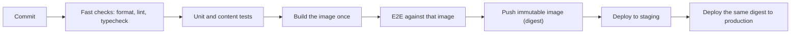
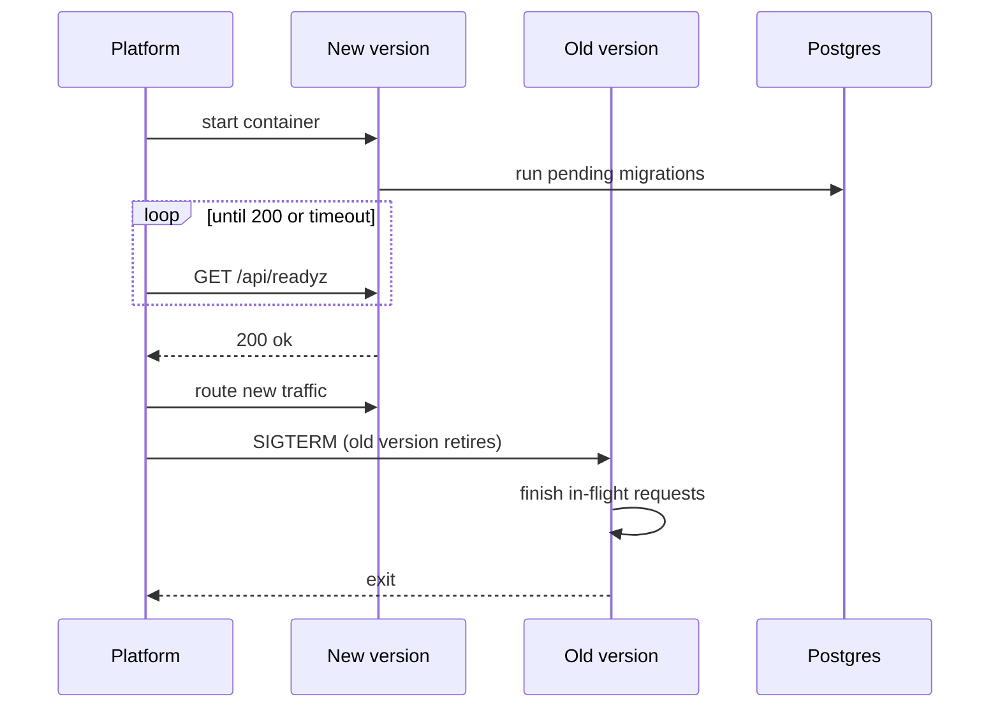

A team ships every two weeks. The release has a 40-item checklist, a release manager, and around 200 merged changes. When it breaks production, nobody knows which of the 200 changes did it, rolling back reverts all 200 (including three urgent fixes), and the real fix waits for the next train. After two bad releases the team decides to deploy *less* often, with a longer checklist. Each release now carries 400 changes.

This is the most common way deployment goes wrong, and the instinct it produces is backwards. Risk per deploy grows with the size of the deploy; diagnosis time grows with the number of suspects. Small, frequent, automated, reversible deploys are safer, and the research agrees: the DORA program's four key metrics (deployment frequency, lead time for changes, change failure rate, time to restore service) consistently show the best teams improving speed and stability together, not trading one for the other.

## The pipeline: build once, promote the artifact

A delivery pipeline turns a commit into a running, verified release. The shape that works:



Four rules carry most of the value:

1. **Order by cost.** Formatting and type errors fail in seconds; do not make someone wait for a 10-minute browser suite to learn about a missing semicolon.
2. **Build once.** The artifact tested is the artifact deployed, identified by an immutable digest, never "the same Git SHA rebuilt for production". A rebuild can pull a different base image or dependency and ship something nobody tested.
3. **Test the artifact, not the source.** End-to-end tests run against the built image, so packaging mistakes (a missing asset, a wrong entrypoint) are caught before users see them.
4. **Keep it fast.** A pipeline people wait 45 minutes for gets bypassed. Cache dependencies, parallelise independent stages, and move slow suites to a non-blocking lane only if something else covers the risk.

This repository's pipeline lives in `.github/workflows/ci.yml` and shows the rules at small scale. Four jobs run in parallel where they can:

- **rust** starts a Postgres service container (with a health check, so tests do not begin before the database accepts connections), then runs `cargo fmt --check`, `cargo clippy`, `cargo test --workspace` (unit tests, the content test and the API integration suite) and the strict content validator.
- **problems** executes every practice problem's reference solution against its own tests.
- **web** installs with a frozen lockfile, type-checks, runs Vitest and builds the SPA.
- **image** builds the production Dockerfile, with a layer cache, once the rust and web jobs pass.

Two small details are worth stealing. A `concurrency` group cancels an in-progress run when a newer commit arrives on the same branch, so nobody waits for results about code that no longer exists. And the Rust job writes a one-line placeholder `web/dist/index.html`, because the server embeds the SPA at compile time: the Rust checks do not need a real frontend, so they do not wait for one. `make check` runs the same steps locally (the Makefile describes it as everything CI runs), which keeps "passes on my machine" and "passes CI" the same statement.

Measured against the four rules, one gap stands out. The image job builds the Dockerfile but does not push it (`push: false`), and the platform builds its own image from the same commit when `main` changes. That is two builds of one commit, the pattern rule 2 warns about. Frozen lockfiles make the two builds very likely identical, and for a one-person project the simplicity is a fair trade; the stricter design pushes CI's image to a registry and deploys that digest. Similarly, the Playwright suite, the only test of the real browser, cookies and in-browser runners together, runs on demand (`make e2e`) rather than as one of the jobs, so its risks are covered less often than the rest.

## Environments and configuration

The same artifact runs everywhere; only configuration differs. That is the reason configuration must be data read from the environment, not code branches, and the reason it must be **validated at boot**. `crates/core/src/config.rs` loads every setting once and refuses to start on a bad value (a non-Postgres `DATABASE_URL`, or production without secure cookies). A bad variable in a new environment therefore fails the deploy's health check, and the previous version keeps serving, instead of failing the first user request that happens to touch it.

Configuration can also be a release switch. With no `ANTHROPIC_API_KEY`, the app logs a warning at startup, AI routes return `AiDisabled` (a 503 with code `ai_disabled`), and the UI shows a notice. Every other feature works. That is the same idea as a **feature flag**: separate *deploying* code from *releasing* behaviour, so the code can ship dark and be switched on, off, or to a percentage of users without a deploy.

## How this app deploys

Three pieces define the deploy. The `Dockerfile` builds the image in stages: Node builds the React SPA, Rust compiles the server with the SPA and the curriculum embedded into the binary, and the runtime image contains little more than that one binary (the next lesson covers the build in detail). `.railway/railway.ts` declares the platform resources as code, including how a new version proves it is healthy:

```typescript
// excerpt from .railway/railway.ts
const app = service("ascend", {
  // Builds the root Dockerfile. Pushing to main deploys.
  source: github("thull32/ascend", { checkSuites: false }),
  replicas: { [region]: 1 },
  // Migrations run on boot before the server binds, so a passing readiness
  // probe means the schema is current and Postgres is reachable.
  healthcheck: "/api/readyz",
  healthcheckTimeout: 120,
  // env: ...
});
```

The third piece is the process itself. The boot sequence in `crates/api/src/main.rs` is ordered to make that health check meaningful: load and validate config, initialise logging, connect to Postgres, **run pending migrations**, load the curriculum, and only then bind the port. `/api/readyz` (in `crates/api/src/routes/health.rs`) runs `SELECT 1` and reports the database status, whether AI is enabled and the content version. So a 200 from readiness means "config valid, schema current, database reachable, content loaded". If a migration fails, the process exits non-zero, the new deployment never turns healthy, and the platform keeps sending traffic to the old one.



Zero downtime needs one more piece: the old version must finish what it started. Once the new deployment is healthy, the platform stops the old one with SIGTERM. `main.rs` listens for it and shuts Axum down gracefully ("draining connections"), so requests in flight complete instead of being cut off. How long the platform waits between SIGTERM and a hard kill is a platform setting, and it must be longer than your slowest legitimate request, which for a streamed AI reply is minutes rather than seconds. The whole sequence is a small-scale version of the next strategy.

One line in the service definition deserves a reviewer's question: the source is configured with `checkSuites: false`. If that means what it says, a push to `main` deploys without waiting for GitHub's checks, and the only thing keeping a red build out of production is branch protection that requires CI to pass before anything merges. That can be a sound arrangement, but it should be a decision someone made, not a default nobody noticed.

Readiness and liveness are different questions. `/api/healthz` answers "is the process up?" and checks nothing else; `/api/readyz` answers "should this instance get traffic?" and checks the database. An orchestrator that restarts containers on failed *liveness* must never use a check that depends on the database, or a brief database outage becomes every instance restarting at once.

## Blue-green

Blue-green keeps two complete environments. Blue serves production; green gets the new version, is warmed and verified, and then the router flips all traffic at once. Rollback is flipping back, which takes seconds because blue is still running.

```viz
{"type": "system", "algorithm": "blue-green", "title": "Blue-green: verify idle, switch atomically", "caption": "The new version is tested at full size before it sees users. Rollback is a router change, not a redeploy. Both colours share the database, so the schema must suit both."}
```

The costs: double capacity during the switch, and an all-at-once exposure. If the new version has a bug that only real traffic triggers, 100% of users see it until someone flips back. And both colours usually share one database, so **the schema must work for both versions at once**, which is the constraint that shapes migrations below.

## Canary

A canary release sends a small slice of traffic to the new version, compares it with the old version running at the same time, and widens the slice in stages only while the comparison stays clean.

```viz
{"type": "system", "algorithm": "canary", "title": "Canary: widen only while the comparison stays clean", "caption": "Compare the canary with the baseline over the same window, so a traffic spike that slows both does not fail the release. Every promotion repeats the same gate."}
```

Two details separate a working canary from theatre.

**Compare against the concurrent baseline, not yesterday.** Traffic mix and load change hour to hour. The question is "is v2 worse than v1 right now, on the same kind of traffic?"

**Respect sample size.** Suppose the service handles 1,000 requests per second with a 0.1% error rate. At a 10% canary, the canary sees 100 req/s, which is 6,000 requests a minute and about 6 expected errors. A buggy release at 0.5% errors produces about 30 in that minute: an unmistakable signal. At a 1% canary the canary sees 600 requests a minute and about 0.6 expected errors; the same bug produces 3. You cannot tell 3 from random noise in one minute, so a 1% stage needs to run for many minutes before it means anything. Stage durations are arithmetic, not taste.

What to compare: error rate and latency percentiles (p99, not the mean), saturation (CPU, memory, connection pools) and at least one business metric such as sign-ups or successful checkouts, because some bugs return 200 with the wrong content.

A single-instance deployment like this app's cannot split traffic by instance, but it can still canary by **feature flag**: hash the user ID, enable the new code path for 5% of users, compare their error rate with everyone else's.

## Rollback, roll-forward and irreversible changes

Rollback means redeploying the previous artifact. It is fast when artifacts are immutable and retained, and it is the default response to a bad release because it restores service before anyone understands the bug.

Some changes cannot be rolled back by redeploying code:

- A migration that **dropped or rewrote** data. The old code expects a column that no longer exists.
- Data the new version wrote in a **new format** that the old version cannot read.
- **External side effects**: emails sent, payments captured, events published.

The senior habit is to make every deploy reversible by construction and to decide the rollback trigger before deploying (for example, "roll back if the canary's error rate exceeds twice the baseline for five minutes"). Roll forward instead only when the fix is smaller and better understood than the rollback.

## Migrations in a world with two versions

During overlap, blue-green and any rollback, **old code runs against the new schema**. Every migration must therefore be compatible with the previous release. Renaming a column in one step breaks the old version instantly. The safe pattern is **expand and contract**, spread over several deploys:

1. Expand: add the new column (nullable, or with a default). Old code ignores it.
2. Deploy code that writes both columns and reads the old one.
3. Backfill the new column in batches.
4. Deploy code that reads the new column.
5. Contract: stop writing the old column, then drop it in a later release.

This repository's migration conventions, written at the top of `migration/src/lib.rs`, are the same discipline in miniature. Migrations are **append-only**: never edit one that has shipped, add a new one, because production has already recorded it as applied and an edit would only change what fresh databases get. Every table gets `created_at`/`updated_at` with database-side defaults, so application code cannot forget them. Every foreign key declares an `ON DELETE` policy; user-owned rows cascade so that deleting an account erases the user's data.

Running migrations at boot is simple and fits a single instance, with two caveats to raise in review. With several instances starting together, they race to migrate, so you need a lock or a separate release step. And a migration that takes longer than the platform's health-check window (120 seconds here) fails the deploy midway, so large-table changes, such as building an index on a big table, belong in a separate, online operation. Know whether your migration tool wraps each migration in a transaction before you rely on a failed one leaving no trace. The deep treatment is in [schema migrations at scale](/learn/databases/data-modeling-and-evolution/schema-migrations-at-scale).

## Let the error budget decide when to ship

A service level objective turns "is it reliable enough?" into arithmetic. With an SLO of 99.9% successful requests over 30 days, the **error budget** is the other 0.1%: at 10 million requests a month, 10,000 may fail. The budget is meant to be spent, on deploys, experiments and migrations. When it is gone, a written **error budget policy** takes over: feature deploys freeze and the team ships only reliability work until the window recovers. That removes the recurring argument between "ship faster" and "be careful"; the budget decides. [Observability](/learn/system-design/building-blocks/observability) covers SLIs and burn-rate alerts; this exercise is the release gate.

```exercise
id: error-budget-gate
title: An error-budget release gate
prompt: |
  Implement `budget_status(slo, total, failed)` for a release gate.

  `slo` is the target success percentage (for example `99.9`), and `total`
  and `failed` are request counts for the current SLO window. Assume
  `total > 0` and `slo < 100`.

  Return an object with:
  `allowed`: failures the budget allows, `total * (100 - slo) / 100`,
  rounded to 2 decimal places.
  `remaining`: `allowed - failed`, rounded to 2 decimal places (may be negative).
  `consumed_pct`: `100 * failed / allowed`, rounded to 1 decimal place.
  `action`: from the unrounded consumed percentage, `"ship"` below 75,
  `"caution"` from 75 up to (not including) 100, `"freeze"` at 100 or more.
languages: [python, javascript]
entry: budget_status
starter:
  python: |
    def budget_status(slo, total, failed):
        # your code here
        return {"allowed": 0, "remaining": 0, "consumed_pct": 0, "action": "ship"}
  javascript: |
    function budget_status(slo, total, failed) {
      // your code here
      return { allowed: 0, remaining: 0, consumed_pct: 0, action: "ship" };
    }
tests:
  - args: [99.9, 1000000, 400]
    expected: {"allowed": 1000, "remaining": 600, "consumed_pct": 40, "action": "ship"}
  - args: [99.5, 20000, 90]
    expected: {"allowed": 100, "remaining": 10, "consumed_pct": 90, "action": "caution"}
  - args: [99.9, 50000, 80]
    expected: {"allowed": 50, "remaining": -30, "consumed_pct": 160, "action": "freeze"}
    label: budget overspent
  - args: [99.9, 3000000, 0]
    expected: {"allowed": 3000, "remaining": 3000, "consumed_pct": 0, "action": "ship"}
    label: no failures yet
  - args: [99.0, 12345, 100]
    expected: {"allowed": 123.45, "remaining": 23.45, "consumed_pct": 81, "action": "caution"}
    hidden: true
    label: fractional budget
  - args: [99.95, 2000000, 250]
    expected: {"allowed": 1000, "remaining": 750, "consumed_pct": 25, "action": "ship"}
    hidden: true
    label: three and a half nines
hints:
  - "Floating point makes 100 - 99.9 slightly less than 0.1; that is why the outputs are rounded."
  - "Decide the action from the unrounded ratio, then round the numbers you return."
```

Notice what the gate does not do: it does not stop fixes. A frozen team still deploys, just only changes that make the service more reliable, and it deploys them through the same pipeline, canary and rollback machinery as everything else.

## Senior signals

- You argue for **smaller, more frequent deploys** and can explain why batch size drives both failure rate and time to diagnose.
- You insist on **build once, promote the digest**, and on end-to-end tests that run against the built artifact.
- You distinguish **liveness from readiness** and gate traffic on a readiness check that proves config, schema and dependencies are good.
- You pick **blue-green or canary** from the failure you fear, and size canary stages with sample-size arithmetic.
- You make every change **reversible**, and you know which changes (destructive migrations, new data formats, external side effects) are not.
- You run schema changes as **expand and contract** because two versions of the code always share the database for a while.

## Check yourself

```quiz
- q: >-
    A team rebuilds the Docker image from the same Git commit when promoting from staging to production. What is the risk?
  options: ["None; the same commit produces the same image", "Rebuilding is slower but otherwise identical", "Production images must be built with debug symbols", "The production image can differ from the tested one, for example through a changed base image or dependency resolution"]
  answer: 3
  explanation: >-
    Builds are not reliably reproducible: base image tags move, and caches and registries change. Promoting the exact digest that passed tests is the only way to know production runs what you tested.
- q: >-
    Ascend runs migrations before binding the port and gates traffic on /api/readyz. A new release contains a migration that fails. What happens?
  options: ["The new version serves traffic with the old schema", "The process exits non-zero, readiness never passes, and the platform keeps the previous deployment serving", "The platform rolls the database back automatically", "Both versions serve traffic until someone intervenes"]
  answer: 1
  explanation: >-
    Because migrations run before the listener binds, a failed migration means the process never becomes ready, so traffic never shifts. Whether the failed migration left partial changes depends on the migration tool's transaction handling, which you should know before relying on it.
- q: >-
    A service handles 200 requests per second with a 0.2% error rate. You start a 1% canary. Roughly how many errors do you expect from the canary per minute if it is healthy?
  options: ["About 0.24", "About 2.4", "About 24", "About 240"]
  answer: 0
  explanation: >-
    1% of 200 req/s is 2 req/s, or 120 requests per minute. At 0.2% that is 0.24 expected errors per minute. With counts that small, one minute of data cannot distinguish a healthy canary from a moderately broken one, so early stages must run longer.
- q: >-
    You need to rename a column that the current release reads and writes. Which plan keeps every deploy reversible?
  options: ["One migration that renames the column, deployed with the code change", "Add the new column, dual-write, backfill, switch reads, then drop the old column in a later release", "Rename the column during a maintenance window", "Create a database view with the new name and drop the table"]
  answer: 1
  explanation: >-
    Expand and contract keeps the schema compatible with both the old and new code at every step, so overlap and rollback are safe. A one-step rename breaks whichever version expects the other name the moment it runs.
- q: >-
    Your SLO is 99.9% over 30 days and the error budget is exhausted on day 12. What does a typical error budget policy say?
  options: ["Lower the SLO to 99.5% for the rest of the month", "Stop all deploys, including fixes", "Freeze feature launches and ship only reliability work until the budget recovers", "Ignore it until the monthly review"]
  answer: 2
  explanation: >-
    The budget exists to trade velocity for reliability automatically. Fixes still ship, through the normal pipeline, because they restore the budget. Moving the SLO to fit the outage defeats its purpose.
```
