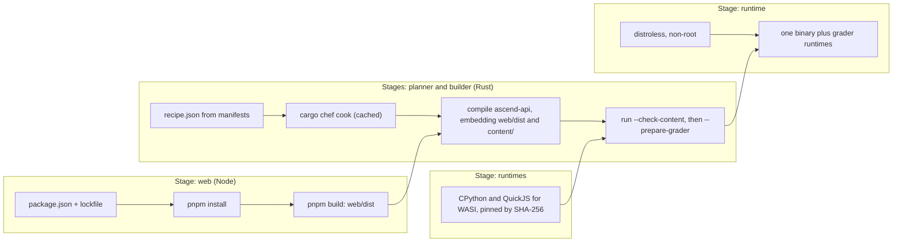

The service runs on one VM that someone configured by hand three years ago. It needs a particular OpenSSL, a CA bundle someone patched, and an environment variable set in a file nobody remembers editing. When the disk dies, rebuilding the machine takes a week of archaeology. Meanwhile a new engineer cannot run the app locally because their machine has a different Python minor version.

Those are two different problems. The first is that the **environment** is undocumented state; the second is that the **runtime** is not packaged with the code. Infrastructure as code fixes the first by making the environment a reviewed file. Containers fix the second by shipping the runtime with the application. This lesson covers both, measured on this repository's own image and CI builds.

## What a container actually is

A container is not a small virtual machine. It is an ordinary Linux process that the kernel shows a restricted view of the system:

- **Namespaces** give it its own process IDs, network interfaces, mount table, hostname and user IDs. Inside, the application is PID 1 and sees only its own files.
- **cgroups** cap what it may consume: CPU, memory, number of processes.
- The **image** supplies its filesystem: a stack of read-only layers plus metadata (entrypoint, environment, user). The running container adds one thin writable layer on top.

Consequences follow. Containers start in milliseconds because nothing boots; the kernel is shared. Isolation is weaker than a VM's for the same reason, which is why multi-tenant platforms add sandboxing layers. When a process exceeds its cgroup memory limit, the kernel's OOM killer sends SIGKILL and you see exit code **137** (128 + signal 9), usually with no application log at all. [Processes and threads](/learn/systems/operating-systems/processes-and-threads) covers the kernel side.

## Under the hood: digests, layers and overlayfs

An image is a JSON **manifest** that lists a config blob and a sequence of layer blobs, each identified by the SHA-256 of its bytes; the image's digest is the SHA-256 of the manifest itself. A tag such as `node:24-trixie-slim` is a mutable pointer to a digest, and BuildKit records the resolution: in this app's CI log for run 36441384084, the web stage starts `FROM docker.io/library/node:24-trixie-slim@sha256:8ec5d755…`. Pinning `@sha256:` in the Dockerfile makes that resolution part of the reviewed code instead of an accident of build time. This Dockerfile did not pin until commit `8f82820`: its three `FROM` lines now carry the digests that run recorded (`node:24-trixie-slim@sha256:8ec5d755…` among them), and Dependabot opens a weekly pull request when a tag moves, so a base-image upgrade is a diff that must pass CI, the production-image job included, before it merges itself.

Each layer is a tar archive of the files one step added, changed or deleted (steps such as `ENV` change only metadata and add no layer). Content addressing deduplicates across images: in the same run, one 29.83 MB layer (`6b37362b…`) was downloaded once and served both the Node stage and the Rust stage, because both base images are built on the same Debian trixie slim layer.

At run time, overlayfs stacks the layers as read-only `lowerdir`s under a writable `upperdir` and presents the merged view. The first write to a file that lives in a lower layer copies the whole file up, so appending one line to a 1 GB file copies 1 GB. Deleting a file writes a *whiteout* entry in the upper layer; the bytes stay in the layer below. That is why a secret copied in one step and deleted in the next is still in the image for anyone who unpacks the earlier layer.

Digests depend on bytes, not intentions. File order and timestamps are part of a tar, which this runnable sketch shows:

```python
import hashlib, io, tarfile

def layer_digest(files, mtime):
    """sha256 of an uncompressed layer tar (what an image config lists as a diff_id)."""
    buf = io.BytesIO()
    with tarfile.open(fileobj=buf, mode="w", format=tarfile.USTAR_FORMAT) as tar:
        for name in sorted(files):                 # fixed order: tar order is part of the bytes
            data = files[name].encode()
            info = tarfile.TarInfo(name)
            info.size, info.mtime, info.mode = len(data), mtime, 0o644
            tar.addfile(info, io.BytesIO(data))
    return "sha256:" + hashlib.sha256(buf.getvalue()).hexdigest()[:12]

layer = {"content/intro.md": "# Intro\n", "content/next.md": "# Next\n"}
a = layer_digest(layer, mtime=0)
b = layer_digest(dict(reversed(list(layer.items()))), mtime=0)   # same files, other insertion order
c = layer_digest(layer, mtime=1_790_000_000)                     # same bytes, rebuilt later
d = layer_digest({**layer, "content/intro.md": "# Intro!\n"}, mtime=0)
print(a == b, a == c, a == d)   # True False False
```

Rebuilding identical sources later gives a different digest unless timestamps are normalised, which BuildKit's `SOURCE_DATE_EPOCH` support exists for.

## Layers are a cache: how BuildKit decides

BuildKit gives every step a cache key built from the step's definition and its parent's key. For `COPY`, the key includes a checksum of the copied files' *contents* and metadata such as permissions, but not their modification times. For `RUN`, it includes only the command string and environment: BuildKit never inspects what the command would fetch, so `RUN apt-get update` stays cached with stale package indexes until something above it changes. When one key changes, that step **and every step after it** in the stage misses.

```text
# Naive: any change to any file rebuilds every dependency
FROM rust:slim
COPY . .
RUN cargo build --release

# Better: dependencies depend only on the manifests
FROM rust:slim
COPY Cargo.toml Cargo.lock ./
RUN <build dependencies only>
COPY crates/ ./crates/
RUN cargo build --release
```

Build arguments are part of the environment of every later `RUN`: Docker's documentation notes that a changed `ARG` value causes a miss at its first use, and every `RUN` after an `ARG` uses it implicitly. This Dockerfile declares `ARG RAILWAY_GIT_COMMIT_SHA` and sets `ENV ASCEND_BUILD_ID` immediately before the final `cargo build`, so a value that changes on every commit invalidates only a step that reruns anyway. Declared at the top of the stage, it would recompile every dependency on every deploy. `ARG CONTENT_LENIENT=0` does sit above the dependency step, which is harmless while the value never changes and a full dependency rebuild the day someone flips it.

Two properties of the remote cache matter. `cache-to: type=gha,mode=max` exports every intermediate stage (the planner, the web stage, the compiled dependencies); `mode=min` would export only the final image's layers, none of which contain the builder's work. And hits are lazy: a `CACHED` step is downloaded only when a later step needs its filesystem.

## This app's image, traced on four real builds

The CI `image` job builds the Dockerfile with that cache. Four runs, four cache situations:

| Run, commit | What the commit changed | First miss in the Rust stages | `cargo chef cook` | Final compile | Cache export | Build step |
|---|---|---|---|---|---|---|
| 36299226124, `8657191` | first build ever to finish: empty cache | every step | 118.9 s | 62.2 s | 158.9 s | 356 s |
| 36301079237, `6ab2be2` | `Cargo.lock` (dependencies dropped) and Rust code | planner `COPY Cargo.toml Cargo.lock` | 104.5 s | 60.2 s | 66.1 s | 260 s |
| 36303669951, `ec1cdd0` | one Rust file and two lessons | planner and builder `COPY crates` | cached | 51.3 s | 22.2 s | 169 s |
| 36441384084, `527d3d1` | lessons and three files in `web/src` | builder `COPY content` | cached | 61.6 s | 27.8 s | 136 s |

The warm run (`527d3d1`), step by step:

| Stage and step | Result | Why |
|---|---|---|
| web 2–5: `WORKDIR`, corepack, `COPY package.json pnpm-lock.yaml`, `pnpm install` | CACHED; install took 14.0 s to download | manifests unchanged; the last hit before a miss must be materialised |
| web 6: `COPY web/ ./` | miss | `web/src/lib/sse.ts` changed |
| web 7: `pnpm build` | ran, 12.3 s | its parent changed |
| planner 1–4, builder 1–4 (recipe, cook, manifests, `COPY crates`) | CACHED | no Rust file or manifest changed |
| builder 5: `COPY migration` | hit, but 29.2 s | parent of the first miss: 289 MB of Rust toolchain and 380 MB of compiled dependencies downloaded and unpacked |
| builder 6: `COPY content` | miss, 8.5 s | lessons changed |
| builder 8: `cargo build --release` then `--check-content` | 61.6 s | "Finished release profile in 1m 00s"; "content ok: 14 tracks, 347 lessons, 180 problems" |
| runtime: base, `COPY` binary | 3.7 s, 0.4 s | |
| export to the GitHub Actions cache | 27.8 s | `mode=max` |

The 136 seconds split into about 4 s of setup, 29 s downloading cache, 9 s copying content alongside the web build, 62 s compiling, 5 s assembling the runtime and 28 s exporting. The Dockerfile's comment that "a content-only change rebuilds in about a minute" is right about the compile; moving the cache in and out cost almost as much again.

## Why cook stayed cached when the code changed

`ec1cdd0` changed `crates/core/src/content/blocks.rs`. The planner's `COPY crates` missed (9.1 s) and `cargo chef prepare` reran in 0.1 s, but the `recipe.json` it wrote describes the manifests, the lockfile and the target layout, not source contents, so its bytes were identical. The builder's `COPY --from=planner /app/recipe.json` is keyed on the file's checksum, not on the planner having run, so it hit, and `cargo chef cook` stayed cached. That one mechanism is worth about 105 to 119 seconds per commit on this project: the cook times of the two runs where the recipe did change. The exercise below simulates the invalidation rule.

```exercise
id: layer-cache
title: Which layers will rebuild?
prompt: |
  Simulate the image build cache. `layers` is the list of Dockerfile steps in
  order, each `{"cmd": ..., "inputs": [...]}`. An input is:

  `"."`: the whole build context (matches every changed file)
  a path ending in `/`: a directory (matches any changed file that starts with it)
  anything else: a single file (matches only that exact path)

  `changed` lists the files modified since the last build. The first layer
  with an input matching any changed file is invalidated, and so is every
  layer after it. Return the `cmd` of every layer that rebuilds, in order.
  Layers with no inputs are only rebuilt if an earlier layer was.
languages: [python, javascript]
entry: rebuilt_layers
starter:
  python: |
    def rebuilt_layers(layers, changed):
        # your code here
        return []
  javascript: |
    function rebuilt_layers(layers, changed) {
      // your code here
      return [];
    }
tests:
  - args: [[{"cmd": "FROM rust:slim", "inputs": []}, {"cmd": "COPY . .", "inputs": ["."]}, {"cmd": "RUN cargo build --release", "inputs": []}], ["content/tracks/intro.md"]]
    expected: ["COPY . .", "RUN cargo build --release"]
    label: naive Dockerfile rebuilds everything
  - args: [[{"cmd": "FROM rust:slim", "inputs": []}, {"cmd": "COPY Cargo.toml Cargo.lock ./", "inputs": ["Cargo.toml", "Cargo.lock"]}, {"cmd": "RUN cargo chef cook --release", "inputs": []}, {"cmd": "COPY crates/ content/ ./", "inputs": ["crates/", "content/"]}, {"cmd": "RUN cargo build --release", "inputs": []}], ["content/tracks/intro.md"]]
    expected: ["COPY crates/ content/ ./", "RUN cargo build --release"]
    label: dependency layer stays cached
  - args: [[{"cmd": "FROM rust:slim", "inputs": []}, {"cmd": "COPY Cargo.toml Cargo.lock ./", "inputs": ["Cargo.toml", "Cargo.lock"]}, {"cmd": "RUN cargo chef cook --release", "inputs": []}, {"cmd": "COPY crates/ content/ ./", "inputs": ["crates/", "content/"]}, {"cmd": "RUN cargo build --release", "inputs": []}], ["Cargo.lock"]]
    expected: ["COPY Cargo.toml Cargo.lock ./", "RUN cargo chef cook --release", "COPY crates/ content/ ./", "RUN cargo build --release"]
    label: lockfile change rebuilds dependencies
  - args: [[{"cmd": "FROM rust:slim", "inputs": []}, {"cmd": "COPY . .", "inputs": ["."]}], []]
    expected: []
    label: nothing changed
  - args: [[{"cmd": "FROM rust:slim", "inputs": []}, {"cmd": "COPY crates/ ./crates/", "inputs": ["crates/"]}, {"cmd": "RUN cargo build --release", "inputs": []}], ["README.md"]]
    expected: []
    label: file outside every input
  - args: [[{"cmd": "FROM rust:slim", "inputs": []}, {"cmd": "COPY Cargo.toml Cargo.lock ./", "inputs": ["Cargo.toml", "Cargo.lock"]}, {"cmd": "RUN cargo chef cook --release", "inputs": []}, {"cmd": "COPY crates/ ./crates/", "inputs": ["crates/"]}, {"cmd": "RUN cargo build --release", "inputs": []}], ["crates/core/src/lib.rs", "Cargo.toml"]]
    expected: ["COPY Cargo.toml Cargo.lock ./", "RUN cargo chef cook --release", "COPY crates/ ./crates/", "RUN cargo build --release"]
    hidden: true
    label: the earliest match wins
  - args: [[{"cmd": "FROM rust:slim", "inputs": []}, {"cmd": "COPY Cargo.toml ./", "inputs": ["Cargo.toml"]}, {"cmd": "COPY crates/ ./crates/", "inputs": ["crates/"]}, {"cmd": "RUN cargo build --release", "inputs": []}], ["crates.txt", "Cargo.toml.bak"]]
    expected: []
    hidden: true
    label: directory inputs need the slash
hints:
  - "Write a helper `matches(input, path)` covering the three input kinds, then find the first layer where any input matches any changed path."
  - "Once you have that index, the answer is every cmd from there to the end."
```

## The stages, and what reaches production

The `Dockerfile` is a **multi-stage build**: each `FROM` starts a stage with its own toolchain, and later stages copy only the outputs they need, so build tools never reach the final image.



| Stage | Base | Contains | Reaches the runtime image |
|---|---|---|---|
| web | `node:24-trixie-slim` | pnpm, `node_modules`, the SPA source, `web/dist` | `web/dist`, inside the binary |
| planner | `cargo-chef` on Rust 1.98, slim trixie | manifests, sources, `recipe.json` | nothing |
| runtimes | the same | CPython and QuickJS for WASI, fetched and checked by SHA-256 | via the builder |
| builder | the same | toolchain, compiled dependencies, sources, `content/`, `web/dist`, the release binary | `/ascend-api`, and the runtimes with Python's standard library precompiled |
| runtime | `distroless/cc-debian13:nonroot` | glibc, OpenSSL, libstdc++, CA certificates, time zones, a `nonroot` user | all of it |

`docker history` on a local build from 26 September lists 22 layers totalling 62 MB unpacked: 21 distroless layers of about 32 MB (glibc 13.7 MB, libssl 8.1 MB, time zone data 4.4 MB, libstdc++ 2.7 MB, CA certificates 0.3 MB) and one 29.9 MB layer holding the binary. `docker image ls` reports 84.5 MB on disk and 22.4 MB compressed. The toolchain layer the builder starts from is 289 MB compressed by itself. Since commit `25fd477` the image also carries the grader's runtimes, about 55 MB by the Dockerfile's count.

The builder's `include_dir!` macros (in `crates/api/src/app.rs` and `crates/core/src/content/loader.rs`) embed the SPA and the curriculum; `ASCEND_BUILD_ID` gives the binary its commit, which `/api/readyz` reports and content ETags include; and `--check-content` fails the build on a broken lesson. Embedding content makes every lesson change a new image and a deploy, which is a feature here: lessons are versioned, validated and rolled back like code.

Distroless has no shell and no package manager: less for an attacker, and no `docker exec … sh` for you, so you debug through logs, metrics and ephemeral debug containers. `.dockerignore` keeps `target/`, `node_modules`, `.git` and `.env` out of the build context: smaller uploads, fewer spurious `COPY . .` misses, and no local secrets in a layer.

## Entrypoint, PID 1 and signals

The runtime stage ends with `ENTRYPOINT ["/usr/local/bin/ascend-api"]`, the exec form, so the binary itself is PID 1. That matters for three reasons.

**Signals.** A namespace's PID 1 receives only the signals it has installed a handler for, whether they come from inside the namespace or from the host; the only exceptions are SIGKILL and SIGSTOP sent from an ancestor namespace ([pid_namespaces(7)](https://man7.org/linux/man-pages/man7/pid_namespaces.7.html)). So a PID 1 without a SIGTERM handler ignores `docker stop`, which waits 10 seconds by default before SIGKILL; Kubernetes waits `terminationGracePeriodSeconds`, 30 by default; Railway waits its draining setting, which defaults to 0 and which this app has set to 60 since [CI/CD and deployment](/learn/senior-craft/software-craft/ci-cd-and-deployment) found the gap. `crates/api/src/main.rs` installs the handler through Tokio:

```rust
// crates/api/src/main.rs (excerpt)
let terminate = async {
    signal::unix::signal(signal::unix::SignalKind::terminate())
        .expect("install SIGTERM handler").recv().await;
};
```

**The shell form breaks both ways.** `ENTRYPOINT /usr/local/bin/ascend-api` means `/bin/sh -c …`. In distroless there is no `/bin/sh`, so the container fails to start. On an image with a shell, the shell becomes PID 1 and may not forward SIGTERM, so the application gets SIGKILL at the end of the grace period with requests in flight.

**Zombies.** PID 1 inherits orphaned child processes and must reap them. This binary spawns none, so it needs no init process; a server that forks workers or shells out should run under `tini` or `docker run --init`.

`USER nonroot` runs the process as an unprivileged user (UID 65532 in distroless), so an exploit lands without root inside the container.

## Kubernetes in one page

This app runs on a platform-as-a-service that builds the image, gates traffic on `/api/readyz` and terminates TLS; it does not use Kubernetes. At larger scale, and in most senior interviews, Kubernetes is the substrate, and you must be able to read its core objects:

| Object | What it is | Why you care |
|---|---|---|
| Pod | One or more containers sharing a network namespace | The unit that is scheduled, probed and killed |
| ReplicaSet | Keeps N identical pods running | The Deployment's tool; one per template version |
| Deployment | Desired replica count plus a rollout strategy | How new versions roll out and roll back |
| Service and EndpointSlice | A stable virtual IP and DNS name, and the pod IPs behind it, each marked ready or not | How traffic finds pods, and only ready ones |
| Ingress or Gateway | HTTP routing from outside the cluster | TLS, hostnames, paths, weighted splits |
| ConfigMap and Secret | Configuration and credentials injected as env or files | Same image, different environments |
| Probes | Readiness, liveness and startup checks | Remove from rotation versus restart |

Everything works by **reconciliation**: controllers loop forever comparing declared state with actual state and acting to close the gap. A Deployment for this app would read:

```yaml
apiVersion: apps/v1
kind: Deployment
metadata: { name: ascend }
spec:
  replicas: 3
  progressDeadlineSeconds: 600
  strategy: { rollingUpdate: { maxSurge: 1, maxUnavailable: 0 } }
  selector: { matchLabels: { app: ascend } }
  template:
    metadata: { labels: { app: ascend } }
    spec:
      securityContext: { runAsNonRoot: true }
      terminationGracePeriodSeconds: 300
      containers:
        - name: api
          image: registry.example.com/ascend@sha256:<digest>
          ports: [{ containerPort: 8080 }]
          envFrom: [{ secretRef: { name: ascend-env } }]
          readinessProbe: { httpGet: { path: /api/readyz, port: 8080 }, periodSeconds: 5 }
          livenessProbe: { httpGet: { path: /api/healthz, port: 8080 }, periodSeconds: 10 }
          lifecycle: { preStop: { sleep: { seconds: 5 } } }
          resources:
            requests: { cpu: 250m, memory: 256Mi }
            limits: { memory: 512Mi }
```

Read it as decisions. The image is pinned by digest. Readiness uses the dependency-checking endpoint and liveness the process-only one, so a database blip removes pods from rotation instead of restarting all of them. The grace period covers the 240-second request timeout plus draining. The memory limit is where exit 137 will come from. Three replicas also change this codebase's arithmetic: the security rate limits already live in Postgres, so only the loose 1,200-a-minute general bucket triples; each pod opens up to 20 database connections, so four pods during a surge can hold 80 of the 100 connections Postgres allows by default; and every pod runs the migrator at boot, which is why boot takes a Postgres advisory lock before planning migrations (`crates/api/src/migrate.rs`).

## A rolling update, traced

With `replicas: 3`, `maxSurge: 1` and `maxUnavailable: 0`, the controller may run at most 3 + 1 = 4 pods and must keep at least 3 − 0 = 3 available. Changing the image creates a new ReplicaSet and moves pods between the two:

| Step | Old pods (ready) | New pods (ready) | Total | Controller action | Waits for |
|---|---|---|---|---|---|
| 0 | 3 (3) | 0 | 3 | new ReplicaSet created at 0 replicas | |
| 1 | 3 (3) | 1 (0) | 4 | scale new to 1: 3 + 1 ≤ 4 | the new pod's readiness probe to pass |
| 2 | 2 (2) | 1 (1) | 3 | scale old to 2: 4 available − 3 required = 1 | the old pod's termination |
| 3 | 2 (2) | 2 (1) | 4 | scale new to 2 | readiness |
| 4 | 1 (1) | 2 (2) | 3 | scale old to 1 | termination |
| 5 | 1 (1) | 3 (2) | 4 | scale new to 3 | readiness |
| 6 | 0 | 3 (3) | 3 | scale old to 0: rollout complete | |

Under the hood, the Deployment controller (`pkg/controller/deployment/rolling.go`) computes both moves on every sync. Scale up by `min(replicas + maxSurge − total, replicas − new)`. Scale down old pods by at most `available − (replicas − maxUnavailable)`, where a new pod counts as available only after it has been Ready for `minReadySeconds`. Readiness gates traffic separately: the EndpointSlice controller marks a pod's endpoint ready only while its readiness probe passes, and kube-proxy and load balancers send traffic only to ready endpoints. Percentages resolve against `replicas`, surge rounding up and unavailable rounding down, so the defaults of 25% and 25% become 1 and 0 on three replicas; if both round to zero, the controller sets unavailable to 1. The old ReplicaSet is kept at zero (ten revisions by default) so `kubectl rollout undo` can scale it back up.

On removal, Kubernetes updates endpoints and sends SIGTERM concurrently, so a pod can receive requests for a moment after SIGTERM. The `preStop` sleep holds SIGTERM back a few seconds while load balancers catch up; the built-in `sleep` action (on by default since Kubernetes 1.30, stable since 1.34) matters here because a distroless image has no `sleep` binary to exec.

```exercise
id: rolling-update
title: Simulate a Deployment's rolling update
prompt: |
  Implement `rolling_update(replicas, max_surge, max_unavailable)` and return
  the sequence of `[old, new]` pod counts a rolling update passes through.

  `max_surge` and `max_unavailable` are integers or strings like "25%".
  A percentage is of `replicas`: round `max_surge` up and `max_unavailable`
  down. If both end up 0, use 1 for `max_unavailable`.

  Start with `old = replicas` ready old pods and `new = 0`; record `[old, new]`.
  Then repeat rounds until `old == 0` and `new == replicas`:
  1. Scale up: if `old + new < replicas + surge`, create
     `min(replicas + surge - (old + new), replicas - new)` new pods (not
     ready yet). If any were created, record `[old, new]`.
  2. Scale down: let `ready` be `old` plus the new pods that were already
     ready when the round began. If `ready > replicas - unavailable`, delete
     `min(old, ready - (replicas - unavailable))` old pods and, if any were
     deleted, record `[old, new]`.
  3. Every new pod becomes ready.
languages: [python, javascript]
entry: rolling_update
starter:
  python: |
    import math

    def rolling_update(replicas, max_surge, max_unavailable):
        # your code here
        return []
  javascript: |
    function rolling_update(replicas, max_surge, max_unavailable) {
      // your code here
      return [];
    }
tests:
  - args: [3, 1, 0]
    expected: [[3, 0], [3, 1], [2, 1], [2, 2], [1, 2], [1, 3], [0, 3]]
    label: surge one, never below three
  - args: [3, 0, 1]
    expected: [[3, 0], [2, 0], [2, 1], [1, 1], [1, 2], [0, 2], [0, 3]]
    label: no spare capacity, one pod down at a time
  - args: [4, 2, 1]
    expected: [[4, 0], [4, 2], [3, 2], [3, 3], [1, 3], [1, 4], [0, 4]]
  - args: [1, 1, 0]
    expected: [[1, 0], [1, 1], [0, 1]]
    label: a single replica
  - args: [3, "25%", "25%"]
    expected: [[3, 0], [3, 1], [2, 1], [2, 2], [1, 2], [1, 3], [0, 3]]
    hidden: true
    label: the defaults on three replicas
  - args: [10, "25%", "25%"]
    expected: [[10, 0], [10, 3], [8, 3], [8, 5], [5, 5], [5, 8], [3, 8], [3, 10], [0, 10]]
    hidden: true
    label: the defaults on ten replicas
  - args: [1, "0%", "25%"]
    expected: [[1, 0], [0, 0], [0, 1]]
    hidden: true
    label: both round to zero
  - args: [5, "50%", "0%"]
    expected: [[5, 0], [5, 3], [2, 3], [2, 5], [0, 5]]
    hidden: true
    label: a percentage surge rounds up
hints:
  - "Resolve the two limits first; everything after that is integer arithmetic on old, new and the count of ready new pods."
  - "Pods created in step 1 of a round do not count as ready in step 2 of the same round."
```

## When the new pod never becomes ready

Suppose v2 cannot reach a dependency, so its readiness probe fails every 5 seconds. The rollout stops at step 1: three old pods serve at full capacity, one new pod sits unready, and the only cost is the extra pod. If v2 exits instead (a failed migration exits non-zero in this app), the kubelet restarts it with a back-off of 10 s, 20 s, 40 s and so on up to 5 minutes, visible as `CrashLoopBackOff`, and each restart runs the migrations again.

Nothing else happens by itself. After `progressDeadlineSeconds` (600 by default) without progress, the Deployment's `Progressing` condition turns false with reason `ProgressDeadlineExceeded`, and `kubectl rollout status` exits non-zero, which is how a pipeline notices. Kubernetes does **not** roll back; `kubectl rollout undo`, or a controller such as Argo Rollouts or Flagger running canary analysis, does. With `maxSurge: 0, maxUnavailable: 1` instead, the same stuck rollout leaves two old pods serving: a third of capacity gone until someone acts. Choosing surge over unavailability is choosing to pay one pod rather than risk capacity.

The opposite failure is worse: v2 passes readiness and is broken in a way `SELECT 1` cannot see, so the rollout completes. Readiness proves an instance can serve; only the canary analysis in the previous lesson proves it serves correctly.

## Service meshes

Clusters often add a **service mesh**: a proxy beside every pod handling mutual TLS, retries, timeouts and per-request metrics without application changes.

```viz
{"type": "system", "algorithm": "service-mesh", "title": "Sidecar proxies carry the cross-cutting concerns", "caption": "Each service talks to its local proxy; proxies handle mTLS, retries and telemetry. The cost is an extra hop per call and a control plane to operate."}
```

The price is latency per hop, a control plane, and retries configured far from the code that knows what is idempotent. [Service meshes and proxies](/learn/networking/networking-in-practice/service-meshes-and-proxies) goes deeper.

## Infrastructure as code with Terraform

Infrastructure as code describes the environment (networks, databases, DNS, buckets, IAM, services) in files, reviews it in pull requests and applies it with a tool. Terraform (and its open-source fork OpenTofu) is a widely used declarative one. This app does not use it; were its database on AWS, the declaration would look like this:

```text
# abridged: credentials, networking and parameter groups omitted
resource "aws_db_instance" "ascend" {
  identifier              = "ascend-prod"
  engine                  = "postgres"
  instance_class          = "db.t4g.medium"
  allocated_storage       = 50
  storage_encrypted       = false
  deletion_protection     = true
  backup_retention_period = 7
}
```

Terraform keeps a **state file** mapping each resource address to a real ID and its last-known attributes. `terraform plan` refreshes (asks the provider for each resource's current attributes), diffs configuration against that, and prints the actions; `apply` executes them. The plan is the artifact you review.

## Reading a plan: update in place or replace

Change `instance_class` to `db.t4g.large` and the plan (abridged) reads:

```text
  # aws_db_instance.ascend will be updated in-place
  ~ resource "aws_db_instance" "ascend" {
        id                      = "db-3QK7EXAMPLE"
      ~ instance_class          = "db.t4g.medium" -> "db.t4g.large"
        # (unchanged attributes hidden)
    }

Plan: 0 to add, 1 to change, 0 to destroy.
```

Now set `storage_encrypted = true` as well:

```text
  # aws_db_instance.ascend must be replaced
-/+ resource "aws_db_instance" "ascend" {
      ~ address                 = "ascend-prod.c9x0example.us-east-1.rds.amazonaws.com" -> (known after apply)
      ~ id                      = "db-3QK7EXAMPLE" -> (known after apply)
      ~ instance_class          = "db.t4g.medium" -> "db.t4g.large"
      ~ storage_encrypted       = false -> true # forces replacement
        # (unchanged attributes hidden)
    }

Plan: 1 to add, 0 to change, 1 to destroy.
```

`~` is in place; `-/+` is destroy, then create (`+/-` if the resource sets `create_before_destroy`). `# forces replacement` names the attribute the provider cannot change on a live resource. `(known after apply)` on `address` means every consumer of the endpoint changes too, and the replacement is a new, **empty** database. `deletion_protection = true` makes the destroy step fail at the AWS API; `lifecycle { prevent_destroy = true }` makes the plan itself error. Neither makes the change safe; they make it loud. Encrypting an existing RDS instance is a migration: snapshot, copy the snapshot with encryption, restore, cut over.

## Drift and state locking, traced

Drift, step by step:

1. At 02:10, during an incident, an engineer raises `backup_retention_period` from 7 to 14 in the AWS console.
2. The next `terraform plan` refreshes, sees 14, and prints it under "Objects have changed outside of Terraform", then proposes `~ backup_retention_period = 14 -> 7`.
3. Decide. Applying reverts the fix. Editing the file to 14 adopts it, and the next plan shows no changes. `terraform apply -refresh-only` writes 14 into state, but the following plan still proposes 7, because configuration is the desired state: only the file settles it.
4. Detect sooner: a scheduled `terraform plan -detailed-exitcode` exits 0 for no changes, 2 for changes and 1 for errors, and exit 2 on an untouched `main` branch is drift.

Locking, step by step:

1. An engineer's apply takes the lock: the S3 backend writes a lock file beside the state (`use_lockfile`, added in Terraform 1.10) or, in older setups, an item in a DynamoDB table (now deprecated), recording an ID, the operation, who and when.
2. A CI apply starting a second later fails with "Error acquiring the state lock" and prints that record.
3. Without the lock, both read state serial 41, both create resources, both write serial 42, and the second write wins: the first apply's resources exist in AWS and not in state, billed and invisible until the next apply fails on a name that "already exists".
4. `terraform force-unlock <ID>` is for a lock whose holder is known to be dead, never for one that is inconvenient.

State holds every attribute, including database passwords, in plain text (`sensitive = true` only hides CLI output; since Terraform 1.11 a provider's write-only arguments, such as `password_wo`, keep a value out of state), so it lives in an encrypted, access-controlled remote backend, never in Git. Split state by lifecycle and ownership (network, data, services) so one apply cannot touch everything.

## Railway's IaC: the same idea without a state file

This repository declares its platform in `.railway/railway.ts`: a Postgres database, a 50 GB volume with usage alerts at 80, 95 and 100 percent, and the `ascend` service with its replica count, health check and environment. The header comment gives the workflow: `railway config plan` shows the diff against the live project and `railway config apply` applies it.

```typescript
// excerpt from .railway/railway.ts
const app = service("ascend", {
  // Builds the root Dockerfile. A push to main deploys once CI passes.
  source: github("thull32/ascend", { checkSuites: true }),
  healthcheck: "/api/readyz",
  env: {
    DATABASE_URL: db.env.DATABASE_URL,
    // Railway's edge sets X-Real-IP; the rate limiter trusts only that header.
    CLIENT_IP_HEADER: "x-real-ip",
    AI_DAILY_OUTPUT_TOKENS: "120000",
    ANTHROPIC_API_KEY: preserve(),
    // Strict: a dangling cross-reference or malformed block fails the build.
    CONTENT_LENIENT: "0",
  },
});
```

| Concern | Terraform | Railway IaC (per Railway's documentation) |
|---|---|---|
| What exists | the state file | the live environment, read at plan time; no state file |
| Drift | refresh shows "changed outside of Terraform" | a dashboard edit is a diff against the file |
| Concurrent applies | a state lock | apply re-plans first and is rejected if the environment changed since |
| Removing a resource from the file | planned destroy | a whole-project apply deletes it; partials only own what they declare |
| Secrets | plain text in state | `preserve()` keeps the value in Railway, out of the file |
| Drift check in CI | `plan -detailed-exitcode` | `railway config plan --detailed-exit-code`, exit 2 when changes are pending |

Two more details show the craft. The database URL is wired by **reference** (`db.env.DATABASE_URL`), so rotating credentials cannot leave a stale copy. And `CONTENT_LENIENT` used to be `preserve()`, leaving a build setting (Railway passes service variables to the Docker build as build arguments) to whatever someone last typed in the dashboard, where a leftover lenient value would ship broken lessons; it is now the literal `"0"`. `preserve()` is for values that must stay out of the repository; every other setting belongs in the reviewed file.

## GitOps

GitOps applies reconciliation to delivery. A Git repository holds the desired state of the cluster (manifests with image digests), and an agent inside the cluster (Argo CD and Flux are the common ones) keeps the cluster matching it. A deploy is a merged pull request that changes a digest; rollback is `git revert`; audit is `git log`; drift is corrected on the next sync. The security argument: in push-based deploys CI holds credentials that can change production, while in GitOps production credentials never leave the cluster.

## Failure modes

| Symptom | Diagnosis | Fix |
|---|---|---|
| Container dies with exit 137 and no log | `kubectl describe pod` shows `OOMKilled`: the cgroup memory limit was hit | Fix the leak or raise the limit; cap runtime heaps below the limit |
| A few 502s during every rollout | The pod got SIGTERM before load balancers dropped it, or it does not drain | `preStop` sleep; drain on SIGTERM; grace period above the slowest request |
| Rollout stuck; `rollout status` fails after 10 minutes | `ProgressDeadlineExceeded`: the new pod never became Ready (probe, config, `CrashLoopBackOff`) | Fix and roll forward, or `kubectl rollout undo` |
| Every CI image build takes six minutes | No `CACHED` lines in the BuildKit log: no remote cache, `mode=min`, an early `COPY . .`, or a per-commit `ARG` high in the file | Remote cache with `mode=max`; reorder; move ARGs down |
| A secret turns up in an old image | The file is in an earlier layer; deleting it later only wrote a whiteout | `.dockerignore`, BuildKit secret mounts, and rotate the secret |
| Plan wants to destroy and recreate after a refactor | The resource address changed (renamed, moved into a module) | A `moved` block (Terraform 1.1+) or `terraform state mv` |
| Resources exist that Terraform does not know | Two applies ran without a lock; the last state write won | Remote backend with locking; import the orphans |

## Trade-offs

| Runtime base | Size | Shell and packages | Attack surface | Debugging | Fits |
|---|---|---|---|---|---|
| `scratch` | the binary only | no | smallest | hardest | fully static binaries |
| distroless (this app) | about 32 MB unpacked here | no | libc, OpenSSL, CA certificates | logs, metrics, debug containers | glibc-linked binaries |
| Debian slim | tens of MB | yes | a small distribution | exec a shell | apps needing tools at run time |
| full distribution | hundreds of MB | yes | large | easiest | legacy apps |

| Platform | You operate | Rollout controls | Fits |
|---|---|---|---|
| PaaS (Railway, this app) | the app and its configuration | health-gated replacement, overlap and draining settings | one team, a few services |
| Managed Kubernetes | manifests, controllers, upgrades, networking | surge and unavailability, probes, progress deadlines; canaries via Argo Rollouts or Flagger | many services and teams |
| VMs with configuration management | the OS, packages and deploy scripts | whatever you build | special hardware, legacy |

## Interviewer follow-ups

**"Our image build takes 12 minutes. Make it faster."** Model answer: read the BuildKit log for the first step that is not `CACHED` and why (an early `COPY . .`, a lockfile copied with the sources, a per-commit `ARG` above a heavy `RUN`); confirm the cache reaches ephemeral runners (a remote cache with `mode=max`) and measure what moving it costs, 57 seconds of 136 in this app's warm build; use cache mounts for package managers. Common wrong answer: a bigger machine or a smaller base image, neither of which changes what misses.

**"A rollout has been at one new pod of three for 20 minutes."** Model answer: the new pod is not Ready; with `maxUnavailable: 0` the old pods still serve at full capacity; the Deployment reported `ProgressDeadlineExceeded` at 10 minutes and nothing rolled back; check events, probe failures and logs, then fix forward or `rollout undo`. Common wrong answer: "Kubernetes rolls back automatically after the deadline."

**"The plan shows `-/+` on the production database."** Model answer: find the `# forces replacement` attribute, do not apply, and choose a real path (revert, or a snapshot-restore migration); `deletion_protection` and `prevent_destroy` turn a mistake into an error. Common wrong answer: "apply it in the maintenance window", which replaces the data with an empty instance whenever it runs.

**"Why does the container take 30 seconds to stop and log nothing?"** Model answer: PID 1 has no SIGTERM handler (or a shell entrypoint swallows it), so it runs until SIGKILL; use the exec form, handle SIGTERM and drain, and add an init if it forks. Common wrong answer: raise the grace period, which only lengthens the wait.

## What mid-level engineers get wrong

- **`COPY . .` before installing dependencies.** Every commit reinstalls or recompiles every dependency.
- **Deleting a secret in a later layer.** The bytes stay in the earlier layer.
- **Tags instead of digests.** The same Dockerfile builds different images on different days.
- **A liveness probe that checks the database.** A database blip restarts every pod at once.
- **Applying a plan without reading it**, or running Terraform from laptops with local state and no lock.
- **A shell-form entrypoint.** SIGTERM never reaches the app, or a distroless container never starts.

## Senior signals

- You describe a container as **a process with namespaces and cgroups** over **content-addressed layers**, and explain exit 137, whiteouts and why PID 1 must handle SIGTERM.
- You read a **BuildKit log**: which step missed and why, which hits had to be downloaded, and what the remote cache costs.
- You order Dockerfile steps from **least to most frequently changing**, place per-commit ARGs last, and use multi-stage builds so toolchains never reach production.
- You can trace a **rolling update** from `maxSurge` and `maxUnavailable`, and say what happens when the new version never becomes ready.
- You treat the **plan as the review artifact**, spot `# forces replacement`, keep state remote, locked and encrypted, and detect drift on a schedule.
- You can argue for **GitOps** on audit and security grounds, and for a PaaS over Kubernetes when the team and system are small.

## Check yourself

```quiz
- q: >-
    A container is killed and its exit code is 137. There is nothing in the application's logs. What is the most likely cause?
  options: ["The image was built for the wrong CPU architecture, so the binary could not start", "SIGKILL, most often from the OOM killer after the container exceeded its memory limit", "The application called exit(137) after catching an unrecoverable internal error", "A failed readiness probe made the platform stop the container and restart it"]
  answer: 1
  explanation: >-
    137 is 128 + 9, meaning SIGKILL. A cgroup memory limit breach is the usual sender, and SIGKILL gives the process no chance to log. A failed readiness probe removes the pod from the Service but does not kill it; liveness failures do restart it, but via SIGTERM first.
- q: >-
    A commit changes one Rust source file. The planner stage's COPY crates misses and cargo chef prepare reruns, yet cargo chef cook is CACHED. Why?
  options: ["The recipe it wrote was byte-identical, and COPY is keyed on file contents", "The planner stage is skipped whenever the lockfile has not changed", "cargo chef cook reads only Cargo.lock, which Docker tracks separately", "BuildKit caches every RUN step by its command string, whatever its inputs"]
  answer: 0
  explanation: >-
    recipe.json describes manifests and the lockfile, not sources, so rerunning prepare produced the same bytes. The builder's COPY --from=planner is keyed on the copied file's checksum, so it hit and the cook step after it stayed cached. RUN keys do include the parent's key, which is why an unchanged command alone does not keep a step cached.
- q: >-
    In this app's warm CI build, the builder's COPY migration step was a cache hit but took 29 seconds. What was it doing?
  options: ["Waiting on a lock held by the web stage, which was building at the same time", "Exporting its layers to the remote cache before the next step could begin", "Downloading and unpacking cached layers, because the next step was a miss", "Recompiling the migration crate, since COPY steps always rerun their files"]
  answer: 2
  explanation: >-
    Remote cache hits are lazy. COPY content missed, so BuildKit needed the filesystem of the step before it, and downloaded and unpacked about 670 MB: the Rust toolchain layer and the compiled dependencies. Export happens once, at the end of the build.
- q: >-
    An image ends with ENTRYPOINT /usr/local/bin/app (shell form) on a Debian base. On docker stop, the app logs nothing and exits after 10 seconds. Why?
  options: ["The app handled SIGTERM but the kernel blocks writes to logs during shutdown", "The shell is PID 1 and did not forward SIGTERM, so the app got SIGKILL", "Shell form entrypoints run the app as root, which ignores SIGTERM by design", "Docker sends SIGKILL first and SIGTERM only if the process is still alive"]
  answer: 1
  explanation: >-
    The shell form runs /bin/sh -c, so the shell is PID 1 and the app is its child. A shell that does not forward the signal leaves the app running until docker stop's 10-second default expires and SIGKILL arrives. The exec form makes the app PID 1, and on distroless the shell form cannot start at all.
- q: >-
    A Deployment has 3 replicas, maxSurge 1 and maxUnavailable 0. The new version's readiness probe never passes. What is the state 15 minutes later?
  options: ["Two old pods and one unready new pod remain, with a third of capacity missing", "Three old pods serve, one new pod is unready, and progress is reported as exceeded", "All pods have been replaced, because readiness only delays traffic, not rollout", "Kubernetes has rolled back to the previous ReplicaSet and deleted the new pod"]
  answer: 1
  explanation: >-
    With maxUnavailable 0 no old pod may go until a new one is available, so the rollout stops after the first surge pod. After progressDeadlineSeconds (600 by default) the Progressing condition reports ProgressDeadlineExceeded, but nothing rolls back automatically. Losing a third of capacity is what maxSurge 0 with maxUnavailable 1 would do.
- q: >-
    terraform plan shows -/+ on aws_db_instance.ascend with storage_encrypted = false -> true # forces replacement. What would apply do?
  options: ["Create an encrypted copy of the data, switch the endpoint, then delete the original", "Encrypt the existing storage in place during the next maintenance window", "Refuse to run, because Terraform never replaces resources that hold data", "Destroy the instance and create a new, empty one, unless deletion protection blocks it"]
  answer: 3
  explanation: >-
    -/+ means destroy, then create. The provider cannot change that attribute on a live instance, so the replacement is new and empty, with a new endpoint. deletion_protection makes the destroy fail at the AWS API and prevent_destroy fails the plan, which is why production databases set them. Encrypting existing data is a snapshot, encrypted copy and restore migration.
```
