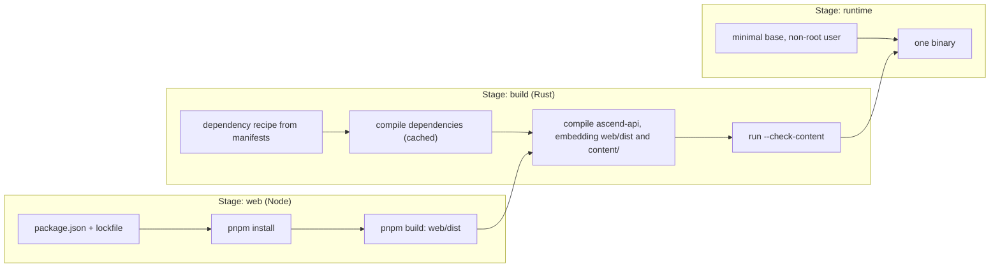

The service runs on one VM that someone configured by hand three years ago. It needs a particular OpenSSL, a CA bundle someone patched, and an environment variable set in a file nobody remembers editing. When the disk dies, rebuilding the machine takes a week of archaeology. Meanwhile a new engineer cannot run the app locally because their machine has a different Python minor version.

Those are two different problems. The first is that the **environment** is undocumented state; the second is that the **runtime** is not packaged with the code. Infrastructure as code fixes the first by making the environment a reviewed file. Containers fix the second by shipping the runtime with the application. This lesson covers both, with this repository's image as the example.

## What a container actually is

A container is not a small virtual machine. It is an ordinary Linux process that the kernel shows a restricted view of the system:

- **Namespaces** give it its own process IDs, network interfaces, mount table, hostname and user IDs. Inside, the application is PID 1 and sees only its own files.
- **cgroups** cap what it may consume: CPU shares, memory, process count.
- The **image** supplies its filesystem: a stack of read-only layers plus metadata (entrypoint, environment, user). The running container adds one thin writable layer on top.

Consequences you meet in production follow directly. Containers start in milliseconds because nothing boots; the kernel is shared. Isolation is weaker than a VM's for the same reason, which is why multi-tenant platforms add sandboxing layers. When a process exceeds its cgroup memory limit, the kernel's OOM killer sends SIGKILL and you see exit code **137** (128 + signal 9), usually with no application log at all. And because the app is PID 1, it must handle SIGTERM itself: the kernel does not apply default signal actions to a namespace's PID 1, so a process with no SIGTERM handler simply ignores the signal until the platform loses patience and sends SIGKILL. [Processes and threads](/learn/systems/operating-systems/processes-and-threads) covers the kernel side.

## Layers are a cache, and order is the strategy

Each Dockerfile instruction produces a layer, cached under a key made of the instruction, its inputs (for `COPY`, the content of the copied files) and the parent layer. If a layer's key changes, that layer **and every layer after it** is rebuilt.

That makes instruction order a performance decision:

```text
# Naive: any change to any file rebuilds every dependency
FROM rust:slim
COPY . .
RUN cargo build --release

# Better: dependencies depend only on the manifests
FROM rust:slim
COPY Cargo.toml Cargo.lock ./
RUN <build dependencies only>
COPY crates/ ./crates/
RUN cargo build --release
```

In the naive version, fixing a typo in a lesson recompiles hundreds of crates. In the better version, the expensive dependency layer is reused until `Cargo.lock` changes, which is rare. Order instructions from least to most frequently changing. The exercise below simulates exactly this rule.

## This app's image, stage by stage

The repository's `Dockerfile` is a **multi-stage build**: several `FROM` stages, each with its own toolchain, where later stages copy only the outputs they need from earlier ones. Build tools never reach the final image.



1. **Node builds the SPA.** The stage copies `package.json` and the lockfile first and installs with a frozen lockfile, so the dependency layer is cached and the build fails if the lockfile and manifest disagree. Then it copies the source and runs `pnpm build`, producing `web/dist`.
2. **Rust builds the server.** A tool called `cargo-chef` derives a "recipe" from the Cargo manifests so that dependencies compile in their own cached layer, the same trick as above for a multi-crate workspace. Then the stage copies the crates, the migrations, the `content/` directory and `web/dist` from the Node stage, and compiles `ascend-api`. The `include_dir!` macros in `crates/api/src/app.rs` and `crates/core/src/content/loader.rs` embed the SPA and the curriculum into the binary. The stage also turns the platform's `RAILWAY_GIT_COMMIT_SHA` build argument into `ASCEND_BUILD_ID`, which `crates/api/src/build_info.rs` reads at compile time, so the binary knows which commit it is: `/api/readyz` reports it as `build`, and content ETags include it, so a deploy that changes the response format invalidates cached lesson responses even when no lesson changed. Finally the build runs the binary with `--check-content`, so a broken lesson fails the image build. Strictness is a build argument that defaults to strict (`ARG CONTENT_LENIENT=0`), with a comment reserving the lenient setting for preview builds while content is being authored.
3. **The runtime stage is almost empty.** It starts from a distroless base (a C library and CA certificates, no shell, no package manager), copies the single binary, sets production defaults such as `APP_ENV=production`, and runs as a non-root user.

The trade-offs are worth being able to state. The image is small, starts fast and has very little for an attacker to use: no shell to spawn, no package manager to install tools with. Debugging is harder for the same reason: you cannot `exec` a shell into it, so you rely on logs, metrics and ephemeral debug containers. Embedding content means every content change is a new image and a new deploy, which is a feature here: lessons are versioned, validated and rolled back exactly like code.

Two more files matter. `.dockerignore` keeps `target/`, `node_modules`, `.git` and `.env` out of the build context: smaller uploads, better caching, and no local secrets baked into a layer. And the entrypoint uses the exec form (`ENTRYPOINT ["/usr/local/bin/ascend-api"]`), so the binary itself is PID 1 and receives the SIGTERM that triggers the graceful shutdown in `crates/api/src/main.rs`. A shell-form entrypoint would put `/bin/sh` in between, which may not forward signals, and the distroless image has no shell anyway.

One review habit applies to every Dockerfile: base images referenced by tag can change under you between two builds of the same commit. Pin by digest for reproducibility and let a dependency bot propose updates, so base-image changes arrive as reviewable pull requests rather than surprises.

## Kubernetes in one page

This app deploys to a platform-as-a-service that builds the image, runs it, checks `/api/readyz`, terminates TLS and collects logs. At larger scale, and in most senior interviews, the equivalent substrate is Kubernetes, and you need to be able to read its core objects.

| Object | What it is | Why you care |
|---|---|---|
| Pod | One or more containers sharing a network namespace | The unit that is scheduled, probed and killed |
| Deployment | Desired replica count plus a rolling-update strategy | How new versions roll out and roll back |
| Service | A stable virtual IP and DNS name in front of matching pods | How other workloads find yours |
| Ingress / Gateway | HTTP routing from outside the cluster | TLS, hostnames, paths |
| ConfigMap / Secret | Configuration and credentials injected as env or files | Same image, different environments |
| Probes | Liveness, readiness and startup checks | Restart vs. remove-from-rotation decisions |

Everything in Kubernetes works by **reconciliation**: you declare desired state, and controllers loop forever comparing it with actual state and acting to close the gap. A Deployment for this app would look like this:

```yaml
apiVersion: apps/v1
kind: Deployment
metadata: { name: ascend }
spec:
  replicas: 3
  strategy: { rollingUpdate: { maxSurge: 1, maxUnavailable: 0 } }
  selector: { matchLabels: { app: ascend } }
  template:
    metadata: { labels: { app: ascend } }
    spec:
      securityContext: { runAsNonRoot: true }
      terminationGracePeriodSeconds: 30
      containers:
        - name: api
          image: registry.example.com/ascend@sha256:<digest>
          ports: [{ containerPort: 8080 }]
          envFrom: [{ secretRef: { name: ascend-env } }]
          readinessProbe: { httpGet: { path: /api/readyz, port: 8080 }, periodSeconds: 5 }
          livenessProbe: { httpGet: { path: /api/healthz, port: 8080 }, periodSeconds: 10 }
          resources:
            requests: { cpu: 250m, memory: 256Mi }
            limits: { memory: 512Mi }
```

Read it as a list of decisions. The image is pinned by digest. `maxUnavailable: 0` means capacity never drops during a rollout. Readiness uses the dependency-checking endpoint and liveness the process-only one, so a database blip removes pods from rotation instead of restarting all of them. The memory limit is where exit 137 will come from. With three replicas, two things in this codebase would need attention. The in-memory rate limiter would give each client three times the budget; `docs/ARCHITECTURE.md` already names the fix: move rate limiting to Redis ("the `Limiters` type is the seam"). And all three pods would run the migrator at boot, so you need to know whether it serialises concurrent runs, for example with a database lock, or move migrations into a separate release step.

Clusters often add a **service mesh**: a proxy beside every pod that handles mutual TLS, retries, timeouts and per-request metrics without application changes.

```viz
{"type": "system", "algorithm": "service-mesh", "title": "Sidecar proxies carry the cross-cutting concerns", "caption": "Each service talks to its local proxy; proxies handle mTLS, retries and telemetry. The cost is an extra hop per call and a control plane to operate."}
```

A mesh moves cross-cutting code out of every service, at the price of latency per hop, a control plane to run, and retries configured far from the code that knows whether an operation is idempotent. [Service meshes and proxies](/learn/networking/networking-in-practice/service-meshes-and-proxies) goes deeper. For one service and a small team, a platform like the one this app uses gives you most of the value with none of the cluster to run; choosing it is a senior decision, not a junior one.

## Infrastructure as code

Infrastructure as code means the environment (networks, databases, DNS, buckets, IAM, services) is described in files, reviewed in pull requests, and applied by a tool. The dominant declarative tool is Terraform (and its open-source fork OpenTofu):

```text
# abridged: credentials, networking and parameter groups omitted
resource "aws_db_instance" "ascend" {
  identifier          = "ascend-prod"
  engine              = "postgres"
  instance_class      = "db.t4g.medium"
  allocated_storage   = 50
  deletion_protection = true
  backup_retention_period = 7
}
```

The workflow is **plan, review, apply**. `terraform plan` computes the difference between the files and reality and prints it; the plan is the artifact you review, because it shows whether a one-line change will update a resource in place or destroy and recreate it. `deletion_protection = true` is there because "recreate" on a database is a data-loss event.

The parts that bite:

- **State.** Terraform records what it created in a state file, which maps resources to real IDs and often contains secrets. It must live in a remote backend with locking and encryption, never in Git.
- **Drift.** Someone changes a setting in the console at 2 a.m. during an incident. The next plan shows a diff that reverts it. Run plans on a schedule to detect drift, and make the console read-only for most people.
- **Blast radius.** One giant root module means every apply risks everything. Split by lifecycle and ownership (network, data, services).

Terraform's HCL is one syntax among several. Pulumi and the AWS CDK express the same declarative model in general-purpose languages, and this repository does the same for its platform in `.railway/railway.ts`: a Postgres database, a 50 GB volume with usage alerts at 80, 95 and 100 percent, and the `ascend` service with its replica count, health check and environment. The header comment gives the workflow, which is Terraform's under different names: `railway config plan` shows the diff against the live project, and `railway config apply` applies it.

```typescript
// excerpt from .railway/railway.ts
const app = service("ascend", {
  // Builds the root Dockerfile. A push to main deploys once CI passes.
  source: github("thull32/ascend", { checkSuites: true }),
  healthcheck: "/api/readyz",
  env: {
    DATABASE_URL: db.env.DATABASE_URL,
    // Railway's edge sets X-Real-IP; the rate limiter trusts only that header.
    CLIENT_IP_HEADER: "x-real-ip",
    AI_DAILY_OUTPUT_TOKENS: "120000",
    ANTHROPIC_API_KEY: preserve(),
    // Strict: a dangling cross-reference or malformed block fails the build.
    CONTENT_LENIENT: "0",
  },
});
```

Three details show the craft. Secrets never appear in the file: `preserve()` tells the tool to keep whatever value is already set in the platform, so the IaC can be public while the key stays private. And the database URL is wired by **reference** (`db.env.DATABASE_URL`), not pasted, so rotating the database credentials cannot leave the app pointing at a stale copy. The third is a fix worth copying. `CONTENT_LENIENT` used to be `preserve()` as well, which left a build setting, not a secret, to whatever value someone had last typed into the dashboard; Railway passes service variables to the Docker build as build arguments, so a lenient value left over from authoring would have let a lesson with a dangling cross-reference ship. It is now the literal `"0"`, with a comment saying why. `preserve()` is for values that must stay out of the repository; every other setting belongs in the reviewed file. The danger to respect is the flip side of declarative tools: in whole-project mode, a resource you delete from the file is a resource the next apply deletes from the world. Read every plan before you apply it, and look hardest at anything marked for destruction.

## GitOps

GitOps applies the reconciliation idea to delivery. A Git repository holds the desired state of the cluster (manifests with image digests). An agent running *inside* the cluster (Argo CD and Flux are the common ones) watches that repository and reconciles the cluster to match it.

- **Deploy** is a merged pull request that changes a digest.
- **Rollback** is `git revert`.
- **Audit** is `git log`: who changed what, when, reviewed by whom.
- **Drift** is corrected automatically, because the agent keeps reconciling.

There is also a security argument. In push-based deploys, the CI system holds credentials that can change production. In pull-based GitOps, CI only builds images and opens pull requests; the production credentials never leave the cluster.

```exercise
id: layer-cache
title: Which layers will rebuild?
prompt: |
  Simulate the image build cache. `layers` is the list of Dockerfile steps in
  order, each `{"cmd": ..., "inputs": [...]}`. An input is:

  `"."`: the whole build context (matches every changed file)
  a path ending in `/`: a directory (matches any changed file that starts with it)
  anything else: a single file (matches only that exact path)

  `changed` lists the files modified since the last build. The first layer
  with an input matching any changed file is invalidated, and so is every
  layer after it. Return the `cmd` of every layer that rebuilds, in order.
  Layers with no inputs are only rebuilt if an earlier layer was.
languages: [python, javascript]
entry: rebuilt_layers
starter:
  python: |
    def rebuilt_layers(layers, changed):
        # your code here
        return []
  javascript: |
    function rebuilt_layers(layers, changed) {
      // your code here
      return [];
    }
tests:
  - args: [[{"cmd": "FROM rust:slim", "inputs": []}, {"cmd": "COPY . .", "inputs": ["."]}, {"cmd": "RUN cargo build --release", "inputs": []}], ["content/tracks/intro.md"]]
    expected: ["COPY . .", "RUN cargo build --release"]
    label: naive Dockerfile rebuilds everything
  - args: [[{"cmd": "FROM rust:slim", "inputs": []}, {"cmd": "COPY Cargo.toml Cargo.lock ./", "inputs": ["Cargo.toml", "Cargo.lock"]}, {"cmd": "RUN cargo chef cook --release", "inputs": []}, {"cmd": "COPY crates/ content/ ./", "inputs": ["crates/", "content/"]}, {"cmd": "RUN cargo build --release", "inputs": []}], ["content/tracks/intro.md"]]
    expected: ["COPY crates/ content/ ./", "RUN cargo build --release"]
    label: dependency layer stays cached
  - args: [[{"cmd": "FROM rust:slim", "inputs": []}, {"cmd": "COPY Cargo.toml Cargo.lock ./", "inputs": ["Cargo.toml", "Cargo.lock"]}, {"cmd": "RUN cargo chef cook --release", "inputs": []}, {"cmd": "COPY crates/ content/ ./", "inputs": ["crates/", "content/"]}, {"cmd": "RUN cargo build --release", "inputs": []}], ["Cargo.lock"]]
    expected: ["COPY Cargo.toml Cargo.lock ./", "RUN cargo chef cook --release", "COPY crates/ content/ ./", "RUN cargo build --release"]
    label: lockfile change rebuilds dependencies
  - args: [[{"cmd": "FROM rust:slim", "inputs": []}, {"cmd": "COPY . .", "inputs": ["."]}], []]
    expected: []
    label: nothing changed
  - args: [[{"cmd": "FROM rust:slim", "inputs": []}, {"cmd": "COPY crates/ ./crates/", "inputs": ["crates/"]}, {"cmd": "RUN cargo build --release", "inputs": []}], ["README.md"]]
    expected: []
    label: file outside every input
  - args: [[{"cmd": "FROM rust:slim", "inputs": []}, {"cmd": "COPY Cargo.toml Cargo.lock ./", "inputs": ["Cargo.toml", "Cargo.lock"]}, {"cmd": "RUN cargo chef cook --release", "inputs": []}, {"cmd": "COPY crates/ ./crates/", "inputs": ["crates/"]}, {"cmd": "RUN cargo build --release", "inputs": []}], ["crates/core/src/lib.rs", "Cargo.toml"]]
    expected: ["COPY Cargo.toml Cargo.lock ./", "RUN cargo chef cook --release", "COPY crates/ ./crates/", "RUN cargo build --release"]
    hidden: true
    label: the earliest match wins
  - args: [[{"cmd": "FROM rust:slim", "inputs": []}, {"cmd": "COPY Cargo.toml ./", "inputs": ["Cargo.toml"]}, {"cmd": "COPY crates/ ./crates/", "inputs": ["crates/"]}, {"cmd": "RUN cargo build --release", "inputs": []}], ["crates.txt", "Cargo.toml.bak"]]
    expected: []
    hidden: true
    label: directory inputs need the slash
hints:
  - "Write a helper `matches(input, path)` covering the three input kinds, then find the first layer where any input matches any changed path."
  - "Once you have that index, the answer is every cmd from there to the end."
```

## Senior signals

- You describe a container as **a process with namespaces and cgroups**, and you can explain exit code 137 and why PID 1 must handle SIGTERM.
- You order Dockerfile steps **from least to most frequently changing** and use multi-stage builds so toolchains never reach production.
- You keep runtime images **minimal and non-root**, pin base images by digest, and keep secrets out of the build context.
- You can read a Deployment and point out the **probe, resource and rollout** decisions it encodes, including what breaks when replicas go from one to three.
- You treat the **Terraform plan as the review artifact**, keep state remote and locked, and watch for drift.
- You can argue for **GitOps** on audit and security grounds, and for a PaaS over Kubernetes when the team and system are small.

## Check yourself

```quiz
- q: >-
    A container is killed and its exit code is 137. There is nothing in the application's logs. What is the most likely cause?
  options: ["The image was built for the wrong CPU architecture, so the binary could not start", "SIGKILL, most often from the OOM killer after the container exceeded its memory limit", "The application called exit(137) after catching an unrecoverable internal error", "A failed readiness probe made the platform stop the container and restart it"]
  answer: 1
  explanation: >-
    137 is 128 + 9, meaning SIGKILL. A cgroup memory limit breach is the usual sender, and SIGKILL gives the process no chance to log. A failed readiness probe removes the pod from the Service but does not kill it; liveness failures do restart it, but via SIGTERM first.
- q: >-
    A Dockerfile does COPY . . followed by RUN npm ci and RUN npm run build. Every commit, even a README change, reinstalls all dependencies. What is the fix?
  options: ["Switch to a smaller base image so each layer is quicker to rebuild and push", "Commit node_modules to the repository so npm ci has nothing to download", "Copy package.json and the lockfile first, run npm ci, then copy the rest", "Move to a larger build machine so the dependency install finishes faster"]
  answer: 2
  explanation: >-
    The layer cache is invalidated from the first changed layer onward. With the manifests copied separately, the dependency layer's inputs change only when dependencies do. Hardware and base images do not change the invalidation rule, and committing node_modules does not help, because npm ci still runs after the same COPY . . that every commit invalidates.
- q: >-
    Why does Ascend's runtime stage contain no shell or package manager?
  options: ["To make image builds faster, since fewer packages have to be downloaded each time", "To shrink the image and the attacker's toolkit, at the cost of harder debugging", "A shell would conflict with the Rust binary's own signal handling as PID 1", "Railway forbids interactive shells inside the containers it deploys"]
  answer: 1
  explanation: >-
    A distroless runtime removes tools an attacker would use to explore, download or persist, and shrinks the image. The trade-off is that you debug through logs, metrics and ephemeral debug containers instead of exec'ing a shell. The binary is PID 1 because of the exec-form entrypoint, not because the shell is missing, and a smaller runtime base barely changes build time, which the compile stages dominate.
- q: >-
    In a three-replica Kubernetes Deployment, the liveness probe calls an endpoint that queries the database. The database fails over for 40 seconds. What happens?
  options: ["Every pod fails liveness and restarts together, adding a restart storm to the outage", "Pods leave the Service but keep running, then rejoin once the database has recovered", "Kubernetes pauses the probes until the database's own health check is passing again", "Nothing, because probes ignore errors from downstream dependencies"]
  answer: 0
  explanation: >-
    Liveness answers "should this process be killed?" and must check only the process itself. Leaving the Service while running is what a failing readiness probe does, which is why dependency checks belong there. That is why this app separates /api/healthz from /api/readyz.
- q: >-
    What is the main security advantage of pull-based GitOps over a CI pipeline that runs kubectl apply against production?
  options: ["It encrypts container images at rest, so a leaked registry token is harmless", "Production credentials stay in the cluster; CI only builds images and opens PRs", "Deploys are faster, because the agent applies changes without waiting for CI", "It removes the need for code review, since the agent validates every manifest itself"]
  answer: 1
  explanation: >-
    In push-based deploys, compromising CI compromises production. With an in-cluster agent pulling from Git, CI needs no production access, and every change is a reviewed, revertible commit.
```
