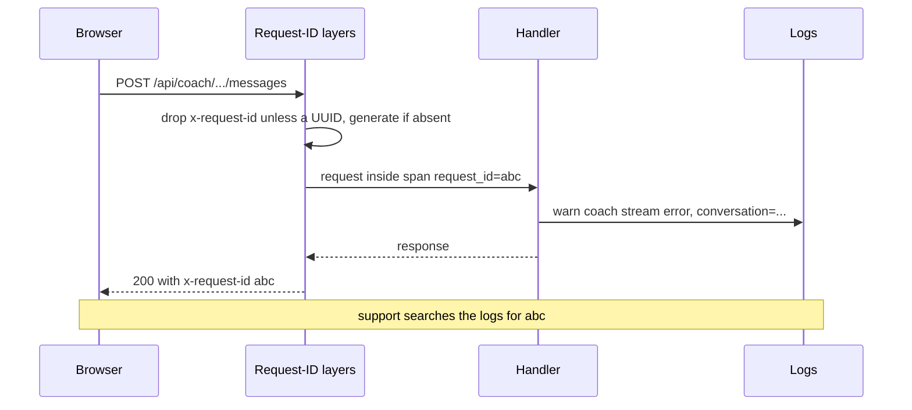

A learner writes in: "the coach stopped halfway through an answer, around 14:05." You open the logs for 14:00 to 14:10 and find 40,000 lines of free text from every request on the box. Somewhere in there is a line that says `stream error`. You cannot tell whose stream, which conversation, or whether it is related. An hour later you give up and reply "we could not reproduce it".

Now the other version. The learner's browser shows an `x-request-id` header on the failed response. You filter the logs by that ID and get eleven lines: the request, the conversation ID, the upstream error from the AI provider, and how long each step took. Five minutes, root cause found. The difference is not tooling. It is decisions made in the code, months earlier, about what to record and how.

## Three signals, and what code owes each

| Question | Signal | What the code must provide |
|---|---|---|
| What happened to *this* request? | Logs | Structured events with a correlation ID |
| How is the system behaving *overall*? | Metrics | Counters and histograms with bounded labels |
| Where did the time go *across hops*? | Traces | Spans with parent/child links, context propagated across processes |

Logs are detailed and expensive per event; metrics are cheap aggregates you can alert on; traces explain causality and latency. [Observability](/learn/system-design/building-blocks/observability) covers SLOs, burn-rate alerts and aggregation at scale. This lesson is about the code-level habits that make those possible.

## Structured logs: constant messages, variable fields

A structured log line is an event with named fields, not a sentence with values interpolated into it. Compare two ways to log the same failure:

```rust
// Unstructured: every occurrence is a different string
tracing::warn!("coach stream error for conversation {}: {}", conv.id, e);

// Structured (what crates/api/src/routes/coach.rs does)
tracing::warn!(error = %e, conversation = %conv.id, "coach stream error");
```

The structured form has a **constant message** (`coach stream error`), so you can count occurrences and group them, and **typed fields** you can filter on (`conversation = "0192..."`). The unstructured form forces every query to be a regular expression over prose, and breaks whenever someone rewords it.

`crates/api/src/telemetry.rs` decides the output format once, for the whole process:

```rust
let filter = EnvFilter::try_from_default_env().unwrap_or_else(|_| {
    EnvFilter::new("info,ascend_api=debug,ascend_core=debug,tower_http=info,sea_orm=warn,sqlx=warn")
});
let registry = tracing_subscriber::registry().with(filter);
if json {
    registry.with(fmt::layer().json().with_current_span(true).with_span_list(false).flatten_event(true)).init();
} else {
    registry.with(fmt::layer().compact()).init();
}
```

Four decisions are visible. Production writes one JSON object per line (the module comment notes that the platform's log explorer parses it), while development gets compact human-readable lines. `flatten_event(true)` puts event fields at the top level of that object, so a query is `status >= 500` rather than `fields.status >= 500`. `with_current_span(true)` attaches the fields of the span the event happened in, which is how the request ID reaches every line (next section), while `with_span_list(false)` leaves out the full chain of ancestor spans to keep lines short. And the filter sets levels **per module**: the app's own crates can be verbose while the ORM and database driver are held to warnings, because a chatty dependency can drown a service's own signal and multiply the log bill. `RUST_LOG` overrides it at runtime; the production image sets the app crates to `info`.

Levels should mean something a reader can act on:

- **ERROR**: someone should look. A bug, or a dependency failing in a way the code did not handle. `crates/api/src/error.rs` logs `database error` and `internal error` at this level.
- **WARN**: degraded but handled. The coach's upstream stream failed; the AI key is missing so AI features are off.
- **INFO**: lifecycle and business events. Boot, `running migrations`, `listening`, and the curriculum summary.
- **DEBUG**: detail for development, off in production.

The boot log in `crates/api/src/main.rs` is a good model of an INFO event:

```rust
tracing::info!(
    tracks = curriculum.tracks.len(),
    lessons = curriculum.lesson_count(),
    problems = curriculum.problems.len(),
    version = %curriculum.version,
    "curriculum loaded"
);
```

`version` is a hash of every content file, and `/api/readyz` reports the same value next to `build`, the commit the binary was compiled from. "Which lessons are live right now?" and "which code is live?" are each answered by one field, not by reconstructing the deploy history.

## Request IDs: one key that joins everything

A request ID is only useful if it is on every line of the request and visible to the person reporting the problem. `crates/api/src/app.rs` wires it up with one small middleware of its own and three layers from `tower-http`, outermost first:

1. `request_id::sanitise` (in `crates/api/src/middleware/request_id.rs`) removes a client-supplied `x-request-id` unless it parses as a UUID.
2. `SetRequestIdLayer` gives every incoming request an `x-request-id` header, generating a UUID when none survived.
3. `PropagateRequestIdLayer` copies that header onto the response, so the browser's network panel, a support ticket or a failing test can quote it.
4. `TraceLayer` opens a `request` span that records the method, the path and `request_id`, and logs the response status and latency when the request completes.



Notice where the ID lives: on the `request` span, not in each `warn!` or `error!` call. Handlers never pass it around, yet every event emitted inside the request inherits it, because the JSON formatter prints the current span's fields alongside the event's own. `docs/ARCHITECTURE.md` summarises the logs as JSON, "one line per request with the request ID", which undersells the result: every line emitted inside the request carries the ID, not only the request's own line. The mechanism is one formatter flag: build the same layer with `with_current_span(false)` and the ID silently disappears from production logs while development's compact output still shows span context, so nothing looks wrong until the first incident. Test your telemetry by reading what it actually emits, exactly as you would test any other output.

Span inheritance has one gap that bit this codebase. The coach streams its reply from a spawned task (`state.tasks.spawn`, a `TaskTracker` that hands the future to Tokio and lets shutdown wait for it), so the reply is still saved if the browser disconnects, and a spawned task does not run inside the span that was current when it was spawned. In the first version, "coach stream error" and "failed to persist coach reply", the two lines you most want during an incident, carried no request ID at all: the search in the opening story would have found the request line and nothing about why it failed. The fix is one call, `.instrument(tracing::Span::current())` on the spawned future, which attaches the handler's span to the task. Any work that outlives its request (spawned tasks, queued jobs, retries) must be handed its context explicitly, because nothing inherits it by accident.

Reading the configuration closely also turned up something about the ID itself.

**A client could choose its own ID.** `SetRequestIdLayer` keeps an `x-request-id` that is already present. That is convenient when a trusted proxy in front of you assigns IDs, but any client can send one, including a very long one, a duplicate of someone else's, or one containing characters that confuse log tooling. The first version accepted whatever arrived. The `sanitise` layer above is the fix: a well-formed UUID is still propagated, so a trusted caller can join its logs to yours, and anything else is replaced by a fresh ID. The integration test `request_ids_are_server_controlled` checks both paths. Validating the incoming value's format is one answer; generating your own and recording the caller's as a separate field is the other.

## Metrics: measure distributions, bound the labels

Metrics are numbers aggregated over time: **counters** (requests served, tokens consumed), **gauges** (connections in use) and **histograms** (latency distributions). Two checklists cover most services:

- **RED**, for anything that serves requests: rate, errors, duration.
- **USE**, for anything with capacity: utilisation, saturation, errors. For this app the obvious resource is the database pool, which `crates/api/src/state.rs` caps at 20 connections with a 5-second acquire timeout.

Latency must be a **histogram**, never an average. An average of 80 ms can hide a p99 of 4 seconds, and averages of percentiles are meaningless: you cannot combine the p99 of three instances by averaging them. Record bucketed counts and compute percentiles from the merged buckets.

The trap that takes down metrics systems is **cardinality**. Every unique combination of label values is a separate time series. `method × route × status` with 5 methods, 50 route templates and 10 status codes is 2,500 series, which is fine. Add a `user_id` label with 100,000 users and it is 250 million, which is an outage for your monitoring. Label with the **route template** (`/api/interviews/{id}`), never the raw path, and keep per-user detail in logs and traces.

```python
from prometheus_client import Counter, Histogram

REQUESTS = Counter("http_requests_total", "HTTP requests", ["route", "status_class"])
LATENCY = Histogram("http_request_duration_seconds", "Request latency", ["route"],
                    buckets=[.005, .01, .025, .05, .1, .25, .5, 1, 2.5, 5, 10, 30])
AI_TOKENS = Counter("ai_output_tokens_total", "Model output tokens", ["model"])
```

This codebase does not export application metrics today; it relies on the platform's CPU, memory and network graphs plus logs. The closest thing to a metric is a structured event, `coach turn complete`, logged once per coach turn with input, output, cache-read and cache-write token counts, which a log-based metric in the platform can aggregate. If you were adding them, the order of value is: a request counter and latency histogram per route template and status class (one middleware layer covers every route), AI output tokens by model (the dominant variable cost of a free product), database pool usage, and a counter of requests refused by the daily AI budget.

## Traces: where did the nine seconds go?

A trace is a tree of **spans**, each with a start, a duration, attributes and a parent. The coach request is a natural example: authenticate, load the conversation, assemble the prompt, open the upstream stream, relay tokens, persist the reply. When a learner says "it was slow", a trace shows which of those took the time.

```viz
{"type": "system", "algorithm": "request-flow", "title": "Each hop is a span", "caption": "A trace links the spans for every hop of one request under a single trace ID, so the slow hop is visible instead of inferred."}
```

Across processes, the trace context travels in a header. The W3C Trace Context standard defines `traceparent`:

```text
traceparent: 00-4bf92f3577b34da6a3ce929d0e0e4736-00f067aa0ba902b7-01
             version-trace id (16 bytes)-parent span id (8 bytes)-flags
```

Every service reads it, creates child spans under that parent, and forwards it on outbound calls. **OpenTelemetry** is the vendor-neutral standard for the APIs, SDKs and the collector that receives and routes this data, so the instrumentation in your code does not change when the backend does.

This is where an early decision in this codebase pays off. Because it logs through the `tracing` crate rather than printing strings, the `request` span already exists, and functions can gain spans with `#[tracing::instrument]`. Exporting them is an additional layer on the same subscriber registry built in `telemetry.rs`: the instrumentation stays, only the exporter is new.

Tracing every request is expensive, so traces are **sampled**. Head-based sampling decides at the start (keep 1% of traces), which is cheap but drops most of the interesting failures. Tail-based sampling decides after a trace completes (keep every error and every trace above 2 seconds, plus 1% of the rest), which keeps what you need at the cost of buffering spans in a collector.

## What never to log

Logs are copied to more places, kept longer and read by more people than your database. Treat them as a data store with weaker controls.

- **Never log credentials**: passwords, session tokens, cookies, API keys, `Authorization` headers. In this app `SecretString` redacts the database URL and API key from `Debug` output, so dumping the config cannot leak them.
- **Bound what you copy from outside.** The AI client logs at most 500 characters of an upstream error body; session user agents are truncated to 255 characters before storage.
- **Logs and responses get different text.** The provider's own error message, which can quote request content, goes to the log (`anthropic stream error event`, with its `kind` as a field); the learner sees a short classified sentence such as "The reply was interrupted. Try again." The log is where detail is useful, and the response is where it leaks.
- **Log an error once, where it is handled.** Logging at every layer that passes an error up produces five lines for one failure and makes counts meaningless. Here, internal and database errors are logged exactly once, in the error mapping, with the detail the client never sees.
- **Personal data** needs a reason, a retention period and a way to delete it. An email address in a log line survives an account deletion that cascaded through every database table.

Being able to parse and aggregate your own logs, and to notice when lines are malformed, is the last piece. A log pipeline that silently drops unparseable lines hides exactly the lines written during a crash. The exercise uses a flat `request_id` field for simplicity; in this app's real JSON output the ID sits inside the nested `span` object that `with_current_span(true)` adds.

```exercise
id: failed-requests-from-logs
title: Find failed requests in JSON logs
prompt: |
  You are given raw log lines. Each should be a JSON object, but some lines
  are truncated or garbage.

  A request **failed** if any of its lines has `"level": "ERROR"` or a numeric
  `status` of 500 or more. Lines belong to a request through a string field
  `request_id`; lines without a string `request_id` are ignored.

  Return `{"failed": [...], "malformed": n}` where `failed` lists the IDs of
  failed requests in the order each first qualified as failed (each once), and
  `malformed` counts lines that are not valid JSON or are valid JSON but not
  an object (for example `null` or an array).
languages: [python, javascript]
entry: failed_requests
starter:
  python: |
    import json

    def failed_requests(lines):
        # your code here
        return {"failed": [], "malformed": 0}
  javascript: |
    function failed_requests(lines) {
      // your code here
      return { failed: [], malformed: 0 };
    }
tests:
  - args: [['{"level":"INFO","request_id":"a1","message":"request","status":200}', '{"level":"ERROR","request_id":"b2","message":"database error"}', '{"level":"INFO","request_id":"b2","message":"finished processing request","status":500}']]
    expected: {"failed": ["b2"], "malformed": 0}
  - args: [['not json at all', '{"level":"INFO","request_id":"c3","status":503}', '{"truncated": ', '[1, 2, 3]']]
    expected: {"failed": ["c3"], "malformed": 3}
    label: garbage and non-object lines are counted
  - args: [[]]
    expected: {"failed": [], "malformed": 0}
    label: no lines
  - args: [['{"request_id":"z","status":502}', '{"request_id":"y","level":"ERROR"}', '{"request_id":"z","level":"ERROR"}']]
    expected: {"failed": ["z", "y"], "malformed": 0}
    label: order of first failure, no duplicates
  - args: [['{"level":"ERROR","message":"no id"}', 'null', '{"request_id":"q","status":"500"}', '{"request_id":"r","status":499}']]
    expected: {"failed": [], "malformed": 1}
    hidden: true
    label: string statuses and missing ids do not count
  - args: [['{"request_id":"w","level":"WARN","status":404}', '  {"request_id":"v","status":500}  ', '{"request_id":7,"status":500}']]
    expected: {"failed": ["v"], "malformed": 0}
    hidden: true
    label: whitespace and non-string ids
hints:
  - "Wrap the parse in try/except (or try/catch); a parse error means malformed."
  - "In JavaScript both null and arrays have typeof 'object'; check for them explicitly."
  - "A numeric status excludes booleans and strings; check the type before comparing."
```

## Senior signals

- You write logs as **constant messages with typed fields**, and you set levels so that ERROR means "someone should look".
- You make a **request ID** visible to users and present on every log line, and you have checked the actual output to confirm it is.
- You treat incoming correlation IDs and headers as **untrusted input**.
- You measure latency with **histograms and percentiles**, and you can estimate the **cardinality** of a metric before you ship it.
- You propagate **trace context** across process boundaries with `traceparent`, instrument through a vendor-neutral API, and choose **tail sampling** when errors matter more than volume.
- You keep **secrets and personal data out of logs**, and you log each error **once**, where it is handled.

## Check yourself

```quiz
- q: >-
    Which log statement is the most useful in production?
  options: ["info!(user = %id, lesson = %slug, seconds = secs, \"lesson completed\")", "debug!(request = ?req, user = %id, \"lesson completed\")", "info!(\"user {} completed lesson {} in {}s\", id, slug, secs)", "println!(\"[info] user={} lesson={} secs={} lesson completed\", id, slug, secs)"]
  answer: 0
  explanation: >-
    A constant message with typed fields at info level can be counted, grouped and filtered by user or lesson. The interpolated version makes every line unique text; println bypasses levels, the subscriber and its JSON output even when it imitates key=value text; and the debug line is off in production and dumps the whole request, which is noisy and a data-leak risk when it is on.
- q: >-
    A latency dashboard shows the average of each instance's p99, averaged across 10 instances. What is wrong?
  options: ["Nothing; averaging per-instance percentiles is the standard way to combine them", "Percentiles cannot be averaged; merge the histogram buckets and take p99 from them", "It should take the median of the p99s, which is robust to one slow instance", "It should weight each instance's p99 by its request count before averaging the ten"]
  answer: 1
  explanation: >-
    A percentile is a property of a whole distribution. Averaging per-instance p99s, weighted or not, can badly understate the true p99, especially when one instance is slow, and a median of them has the same flaw. Histograms merge correctly; percentiles do not.
- q: >-
    A teammate adds a user_id label to the request latency histogram so they can debug individual users. The service has 200,000 users and 40 routes. What is the concern?
  options: ["Privacy law forbids user IDs in metrics, so the change fails compliance review", "Series count multiplies into the millions; per-user detail belongs in logs and traces", "Per-user buckets hold so few samples that the latency percentiles become inaccurate", "Histograms cannot carry labels, so the metric would be rejected at registration"]
  answer: 1
  explanation: >-
    Every label combination is a separate series, and a histogram has one series per bucket too. 200,000 users times 40 routes times a dozen buckets is about 96 million series, which overloads the metrics backend. Logs and traces are built for high-cardinality detail.
- q: >-
    In Ascend, request_id is recorded on the request span rather than passed to every log call. Which formatter setting makes it appear on each production JSON log line?
  options: ["with_current_span(true)", "with_span_list(false)", "flatten_event(true)", "The RUST_LOG filter string"]
  answer: 0
  explanation: >-
    with_current_span(true) prints the fields of the span an event occurred in, so every event inside the request inherits request_id. flatten_event only moves the event's own fields to the top level, with_span_list(false) omits the ancestor chain, and RUST_LOG decides which events are emitted, not what they contain. Flip the flag to false and the IDs vanish from production logs without any error.
- q: >-
    You keep 1% of traces with head-based sampling, and incidents usually involve rare errors. What change best preserves the traces you need?
  options: ["Raise head-based sampling to 5%, so five times as many of the rare errors are captured", "Tail-based sampling that keeps every error and slow trace plus a share of the rest", "Stop sampling and keep every trace, since storage is cheaper than blind spots", "Sample on the client instead, where errors are first visible to the user"]
  answer: 1
  explanation: >-
    Head sampling decides before the outcome is known, so even at 5% it discards most rare failures. Tail sampling decides after the trace completes and can keep every interesting one, at the cost of buffering spans in the collector. Keeping everything is usually unaffordable.
```
