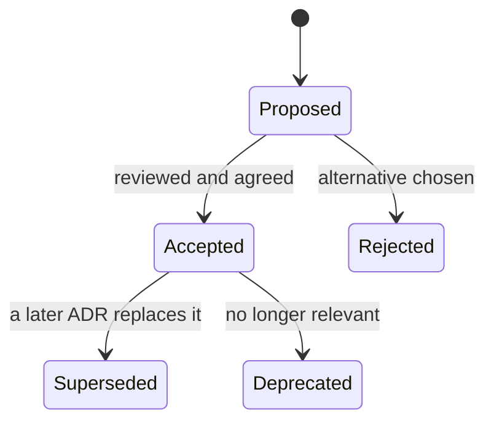

Two years from now someone opens `crates/core/src/auth/token.rs` and notices that session tokens are hashed with plain SHA-256. Every security article they have read says "use a slow hash", so they open a pull request switching to Argon2id. Every authenticated request gets about 100 ms slower, for zero security gain, because 256-bit random tokens cannot be brute-forced at any speed. Or they notice that login verifies a password even when the user does not exist, decide it is wasted work, and delete it, reintroducing the timing oracle it was there to close.

Code records *what* the system does. It rarely records *why*, what else was considered, or what would have to change for the decision to be wrong. That knowledge lives in the heads of the people who made it, and people move on. Senior engineers write it down, in the right place, for a specific future reader. This lesson is about which documents to write, where to keep them, and how to write them so they are read.

## Every document has one reader and one moment

The most useful framing is Diátaxis, which sorts documentation by what the reader is trying to do at that moment. This repository happens to have one of each:

| Reader's need | Kind of document | In this repository |
|---|---|---|
| "I am new and want to learn by doing" | Tutorial | `README.md`, "Run it locally": four `make` commands to a running app |
| "I have a specific task" | How-to guide | `content/CONTENT_GUIDE.md`: how to add a lesson that passes validation |
| "I need the exact facts" | Reference | `.env.example` with `crates/core/src/config.rs`; `make help` |
| "I want to understand why" | Explanation | `docs/ARCHITECTURE.md` and the decision records in `docs/adr/` |

Mixing them is how documents fail. A README that is half tutorial and half design essay serves neither the newcomer who wants the first command nor the reviewer who wants the rationale. This README keeps its rationale to one pointer ("Start with `docs/ARCHITECTURE.md`, then the decision records in `docs/adr/`") and spends its words on getting you running.

## Where the why lives in this repository

Rationale lives at three altitudes here, and each suits a different kind of decision.

**Local decisions live in module-level doc comments**, next to the code they explain:

- `crates/core/src/lib.rs` says the core is transport-agnostic *and why*: the domain stays testable without a web server and reusable from other binaries.
- `crates/api/src/main.rs` explains the boot order: migrations run before the server binds, so a healthy `/readyz` means the schema is current, and a failed migration leaves the previous deployment serving.
- `crates/api/src/middleware/security_headers.rs` explains why the CSP allows `'unsafe-eval'` and what compensates for it.
- `crates/api/src/middleware/rate_limit.rs` says in-memory limiting "is the right call for a single-instance deployment; the state is per process. If we scale horizontally the same interface can be backed by Redis."

That last one is a complete decision record in two sentences: the decision, the context that makes it right, and the **trigger** that would make it wrong. The trigger is the most valuable part, because it tells a future engineer when they are allowed, even expected, to change it.

Good comments of this kind state a constraint or a reason, never a restatement of the code. `// increment the counter` is noise. The doc comment on `AuthService::authenticate`, "Touches `last_seen_at` at most once per hour to avoid a write on every request", explains a behaviour that would look like a bug without it.

**The map lives in `docs/ARCHITECTURE.md`**: one diagram of the whole system, the repository layout, the life of a request from the edge through middleware, extractors, routes and services, and short sections on data, content, authentication, AI, code execution and operations. It ends with scaling notes that say what would change first, which is the architecture-level version of a revisit trigger.

**Cross-cutting decisions live in `docs/adr/`.** Comments are scattered and cannot record rejected alternatives. "Sessions, not JWTs" touches the migration, the auth service, the cookie code and the CSRF middleware, so it needs a home of its own.

## Architecture decision records

An **architecture decision record** (ADR) is a short document that captures one significant decision. The format most teams use comes from Michael Nygard: a title, a status, the context, the decision, and its consequences, often with an "alternatives considered" section. ADRs are numbered, kept in the repository next to the code, reviewed in pull requests, and **never edited after acceptance**. When a decision changes, a new ADR supersedes the old one, so the log reads as a history of the system's thinking.



This repository has four: `0001` one Rust binary with embedded content and SPA, `0002` server-side sessions, `0003` running learner code in the browser, and `0004` bounded LLM costs. Here is `docs/adr/0002-server-side-sessions.md` in full:

```text
# 0002. Server-side sessions with hashed opaque tokens, not JWTs

- Status: accepted
- Date: 2026-09-26

## Context

Users sign in from phones and laptops. We need logout, "log out everywhere", and the ability to revoke a
compromised session immediately. There is a single backend, so there is no need for tokens other services
can verify offline.

## Decision

Issue a random 256-bit token in an `HttpOnly`, `Secure`, `SameSite=Lax` cookie. Store only `SHA-256(token)`
in `sessions`, with an expiry and a `last_seen_at` that is refreshed at most hourly. CSRF is handled by
`SameSite`, an `Origin` check, and a required custom header.

## Alternatives considered

- **JWT access + refresh tokens.** Stateless verification is irrelevant with one service; revocation needs a
  denylist anyway; tokens in JavaScript-readable storage are exposed to XSS.
- **Storing the raw token.** A read-only database leak (backup, replica, log) would become account takeover.

## Consequences

- One indexed primary-key lookup per authenticated request (cached per request in extensions).
- Revocation is a `DELETE`. Expired rows are swept hourly.
- CSRF defence is layered, so one misconfiguration does not open the door.

## Revisit when

- A second service must authenticate users without calling this one (issue
  short-lived signed tokens from the session, keep the session as the source
  of truth).
- Session lookups show up in latency profiles (cache sessions in-process for
  seconds, or in Redis).
```

Notice what makes it useful. The context names the constraint that makes the decision right ("There is a single backend"), so a reader can tell when it stops holding. The alternatives section explains why the obvious option lost, which stops the next person from reopening the question without new information. And the consequences include the cost (a lookup per request), not just the benefits; an ADR with only upsides is a sales document.

The last section was added after a review. As first written, none of the four ADRs had an explicit **"Revisit when"** section, although the triggers were there in disguise: ADR 0001 ended with "Horizontal scaling needs one change: the in-process rate limiter moves to a shared store", and ADR 0003 said "Leaderboards or competitive features would need server-side verification." A trigger buried in a consequence is found only by someone already reading that ADR. Each record now ends with named triggers: ADR 0001 lists "A second replica is needed (move rate limiting to Redis first)", ADR 0003 lists competitive or credentialing features, and ADR 0004 even names a metric, "Cache hit rates in the `ai_usage` cache columns fall (a prompt change broke the stable prefix)". A trigger tied to a number someone can watch is the strongest kind.

Notice that adding those sections edited accepted records, which the rule above forbids. Many teams allow appending clarifications that leave the decision itself unchanged (a revisit trigger, a link, a corrected typo) and require a superseding ADR for anything that changes what was decided. Whichever line your team draws, write it down, because "never edited" and "quietly edited" are the two failure modes.

When to write one: the decision is **hard to reverse** (storage engine, auth model, public API shape), **cross-cutting** (affects many modules or teams), or **contested** (you had to argue for it). You do not need an ADR for which HTTP client library to use. A good test: would you otherwise explain this decision to every new hire?

Common failure modes: ADRs that grow into 15-page design documents (the design doc is a separate artifact; see [design docs and RFCs](/learn/senior-craft/technical-leadership/design-docs-and-rfcs)), ADRs written months later to justify what already shipped, statuses that are never updated, and an ADR log nobody can query. The last one is solvable with a few lines of tooling.

```exercise
id: adrs-in-force
title: Which decisions are in force?
prompt: |
  Your ADR log is a list of records `{"id", "title", "status", "supersedes"}`,
  where `status` is one of `proposed`, `accepted`, `rejected`, `deprecated`
  or `superseded`, and `supersedes` lists the ids this record replaces.

  A decision is **in force** when its status is `accepted` and no *accepted*
  record lists its id in `supersedes`. A proposed or rejected record does not
  replace anything.

  Return the titles of the decisions in force, ordered by id.
languages: [python, javascript]
entry: in_force
starter:
  python: |
    def in_force(adrs):
        # your code here
        return []
  javascript: |
    function in_force(adrs) {
      // your code here
      return [];
    }
tests:
  - args: [[{"id": 1, "title": "Use Postgres", "status": "accepted", "supersedes": []}, {"id": 2, "title": "Server-side sessions", "status": "accepted", "supersedes": []}]]
    expected: ["Use Postgres", "Server-side sessions"]
  - args: [[{"id": 1, "title": "In-memory rate limits", "status": "accepted", "supersedes": []}, {"id": 4, "title": "Redis rate limits", "status": "accepted", "supersedes": [1]}]]
    expected: ["Redis rate limits"]
    label: an accepted record supersedes
  - args: [[{"id": 1, "title": "In-memory rate limits", "status": "accepted", "supersedes": []}, {"id": 4, "title": "Redis rate limits", "status": "proposed", "supersedes": [1]}]]
    expected: ["In-memory rate limits"]
    label: a proposal changes nothing yet
  - args: [[]]
    expected: []
    label: empty log
  - args: [[{"id": 5, "title": "C", "status": "accepted", "supersedes": [3]}, {"id": 1, "title": "A", "status": "accepted", "supersedes": []}, {"id": 3, "title": "B", "status": "accepted", "supersedes": [1]}, {"id": 2, "title": "D", "status": "deprecated", "supersedes": []}, {"id": 6, "title": "E", "status": "rejected", "supersedes": [5]}]]
    expected: ["C"]
    hidden: true
    label: chains, deprecations and rejected replacements
  - args: [[{"id": 7, "title": "Opaque tokens", "status": "accepted", "supersedes": [99]}, {"id": 2, "title": "JWT sessions", "status": "superseded", "supersedes": []}, {"id": 3, "title": "Embed content in the binary", "status": "accepted", "supersedes": []}]]
    expected: ["Embed content in the binary", "Opaque tokens"]
    hidden: true
    label: sorted by id, unknown superseded ids ignored
hints:
  - "First collect every id listed in `supersedes` by an accepted record."
  - "Then keep accepted records whose id is not in that set, sort by id and return their titles."
```

## READMEs: the first ten minutes

A README has one job: get a competent stranger from `git clone` to a running system and a passing test, then point them to everything else. It should answer, in this order: what is this, how do I run it, how do I test it, and where do I go next.

This repository's `README.md` follows that order: a two-line pitch, a table of what the product contains, a pointer to the architecture document and ADRs, the stack, then "Run it locally" as four commands (`make db`, copy `.env.example` to `.env`, `make web`, `make run`), then `make check`, `make e2e` and `make image`, then how to contribute content. The `.env.example` file is itself documentation, and it shows a gap being closed. It used to hold only the seven variables you need to run locally; the optional knobs (session lifetime, AI budgets and timeouts, the trusted client-IP header) were discoverable only by reading `crates/core/src/config.rs`. It now lists every variable the config loader reads, grouped under required, server, content, AI and tests, with the optional ones commented out at their defaults and a one-line note on the ones with sharp edges: `PUBLIC_ORIGIN` is the "exact origin for CSRF checks", and `CLIENT_IP_HEADER` is safe "only behind a proxy that sets and overwrites it". The file you copy to get started is now also the reference, so the two cannot disagree without someone noticing in review.

The `Makefile` is documentation that cannot drift. Each target carries a `## description` comment, and `make help` greps those comments into a menu, so the list of commands and their explanations are the same text. `make check` is described as everything CI runs, so the command the README gives you and the pipeline that gates merges check the same things, with two exceptions that need more than a checkout: the Docker image build and the Playwright suite, which CI now runs against a live server. The stronger version has CI literally invoke `make check`, so the two can never drift apart.

The rule that keeps a README honest: **the first command must work**, on a clean machine, today. Documentation that lives in the repository and changes in the same pull request as the code ("docs as code") is the only kind that stays current. Module doc comments have an extra advantage: `cargo doc` renders them as the crate's reference documentation, so the rationale in `lib.rs` becomes the first page a reader of the API docs sees.

### Documentation for AI agents

A newer kind of reader is the coding agent. `CLAUDE.md` at the repository root is written for it: the commands (`make check`, how to run the API integration tests, how to validate content) and a short list of rules, such as "`crates/core` must not depend on HTTP types", "Migrations are append-only", and "Run throwaway Python through `scripts/safe_py.sh` (memory/time limits). A runaway script once took the machine down."

Writing for an agent is writing for the most literal new hire you will ever have. It follows rules exactly and cannot ask the hallway question, so each rule must be stated as a constraint, and the non-obvious ones need their reason attached: the `safe_py.sh` rule carries its incident with it, which is what stops anyone, human or model, from "simplifying" it away. The same file is a good onboarding checklist for people, which is no accident. [Writing effective specs](/learn/ai-assisted-engineering/tools-and-workflows/writing-effective-specs) covers these files in depth.

## Runbooks: documentation for 3 a.m.

A runbook's reader is on call, stressed, possibly unfamiliar with the service, and reading on a phone. Write for that person:

1. **Symptom**: what the alert or user report looks like.
2. **Impact**: who is affected and how badly.
3. **Checks**: fast, copy-pasteable commands that narrow the cause.
4. **Mitigation**: steps that stop the bleeding, even before the cause is understood.
5. **Escalation**: who to call when the steps do not work.
6. **Verification**: how you know it is fixed.

This codebase already emits the signals a runbook needs, which is itself a design goal. A "new deployment never becomes ready" runbook would read:

- **Impact**: none yet. Readiness gates traffic, so the previous deployment keeps serving.
- **Check the boot log.** A configuration failure prints `configuration:` followed by the variable's name (`missing required environment variable DATABASE_URL`, or `invalid value for COOKIE_SECURE: ...`), because `crates/core/src/config.rs` names the variable in every error. A migration failure appears after `running migrations`.
- **Check readiness on the instance still serving.** `GET /api/readyz` returns `503` with `"database": false` if Postgres itself is unreachable (which would also stop the new version from booting), and reports `content_version` and `build` (the commit the binary was compiled from) so you can confirm which build is answering.
- **Mitigate**: fix the variable and redeploy, or roll back to the previous image.

And an "AI features failing" runbook: readiness shows `"ai": false` when no API key is configured; errors with code `ai_upstream` and the message about the provider being overloaded mean the vendor is struggling and there is nothing to fix locally; `rate_limited` means a request-rate limit (per IP, or per session on the routes that call the model), a user's daily budget, or the provider throttling us, and the message says which; and a `conflict` from the coach while a solo mock interview is active is the no-AI lock doing its job, not a fault.

Runbooks rot faster than any other document, because they describe operations nobody performs until something breaks. Link every alert to its runbook, rehearse the important ones in game days, and make "update the runbook" a standard action item after each incident (see [incidents and postmortems](/learn/senior-craft/technical-leadership/incidents-and-postmortems)).

## Writing that gets read

A few habits separate documents people use from documents people skip:

- **Lead with the conclusion.** The first sentence of a section should be the answer; the reasoning follows for those who want it.
- **Be concrete.** "Sessions expire after `SESSION_TTL_DAYS` (default 30)" beats "sessions have a configurable lifetime".
- **Date it and give it a status.** Readers need to know whether a document describes the present or a plan from last year.
- **Delete stale documents.** A wrong document is worse than none, because it is trusted.
- **Keep diagrams as code.** Mermaid diagrams live in Markdown, diff in reviews and cannot drift out of the repository.
- **Write for the reader who was not in the room.** Define the acronym, link the ticket, name the constraint everyone "just knew".

AI tools are good at drafting reference documentation and summarising a pull request into an ADR skeleton; they cannot know the alternatives you rejected in a hallway conversation. [AI in design and review](/learn/ai-assisted-engineering/senior-engineering-with-ai/ai-in-design-and-review) covers how to use them without outsourcing the judgement.

## Senior signals

- You write documents for **a named reader at a specific moment**, and you keep tutorials, how-tos, reference and explanation apart.
- You put the **why next to the code**, including the condition under which the decision should change.
- You record hard-to-reverse, cross-cutting or contested decisions as **ADRs with alternatives, honest negative consequences and a revisit trigger**, and you supersede rather than edit.
- You keep a README whose **first command works on a clean machine**, ideally because CI runs it.
- You design services to **emit the signals a runbook needs** (named config errors, informative health endpoints) and you update runbooks after every incident.
- You **delete stale documentation** instead of letting it mislead.

## Check yourself

```quiz
- q: >-
    A decision to use in-memory rate limiting is documented as: "In-memory is the right call for a single-instance deployment; if we scale horizontally the same interface can be backed by Redis." What makes this more useful than "We use in-memory rate limiting"?
  options: ["It names a specific technology, so the next engineer knows what to install", "It is longer, and longer rationale is more likely to survive the next few refactors", "It lives in a code comment, where readers see it more often than a document", "It states the context that makes it right and the trigger that would make it wrong"]
  answer: 3
  explanation: >-
    The trigger tells a future engineer when changing the decision is expected rather than reckless, and the context says why it is right until then. Naming Redis is incidental, and where the sentence lives or how long it is matters far less than the conditional reasoning.
- q: >-
    An accepted ADR turns out to be wrong six months later. What should the team do?
  options: ["Write a new ADR that supersedes it and mark the old one as Superseded", "Edit the ADR in place so it describes the decision the team made instead", "Leave the ADR alone and explain the change in a comment next to the code", "Delete the ADR so nobody is misled by an outdated decision"]
  answer: 0
  explanation: >-
    ADRs are an append-only history. Superseding preserves why the first decision was made and why it changed, which is exactly what the next person needs; editing or deleting erases that history, and a code comment leaves the ADR log asserting something false.
- q: >-
    Which of these most needs an ADR?
  options: ["Choosing between two equivalent JSON libraries for one service", "Upgrading a dependency by a patch version across the workspace", "Switching session handling from server-side sessions to JWTs", "Renaming a private helper function used in a dozen files"]
  answer: 2
  explanation: >-
    Authentication design is hard to reverse, cross-cutting (cookies, CSRF, storage, revocation) and likely to be contested. The library choice, the rename and the patch upgrade are local, cheap to reverse, or routine, however many files they touch.
- q: >-
    A runbook step says "check whether the database is healthy". What is the main problem?
  options: ["It belongs in an ADR, because database health is an architectural decision", "It is not actionable: give the exact command and what healthy output looks like", "Runbooks should leave databases to the DBA team and cover only the application", "It is too short; runbook steps should explain the database architecture first"]
  answer: 1
  explanation: >-
    On-call readers need copy-pasteable checks with expected results, such as calling /api/readyz and reading the database field. Vague steps force the reader to rediscover the system under pressure, and more background or a different document does not fix that.
- q: >-
    A README's setup section has not been tested for a year. What is the most reliable way to keep it correct?
  options: ["Add a banner warning readers that the steps may be out of date", "Ask each new hire to fix whatever breaks during their first week", "Move the setup steps to a wiki where anyone can edit them", "Have CI run the same setup and test commands the README lists"]
  answer: 3
  explanation: >-
    If the documented commands are exercised by CI, a breaking change fails the build instead of silently rotting the docs. Warnings and wikis only move the problem, and relying on new hires makes their first day the test.
```
