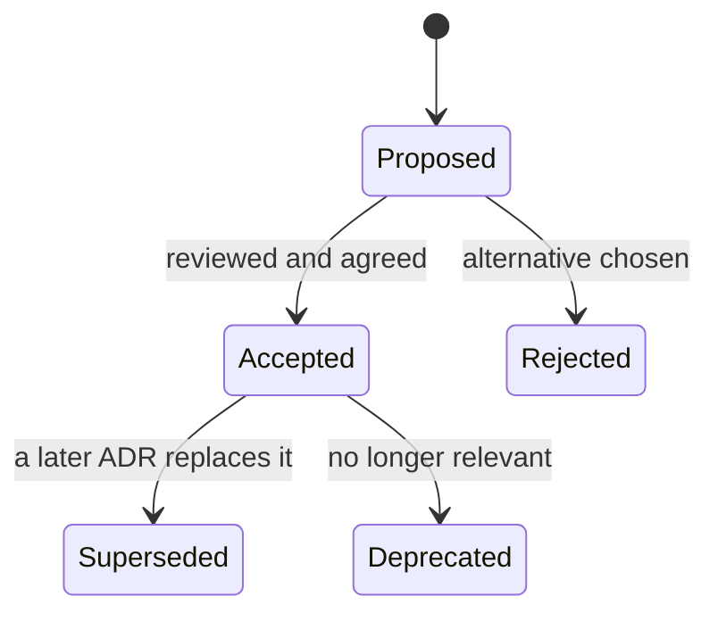

Two years from now someone opens `crates/core/src/auth/token.rs`, sees session tokens hashed with plain SHA-256, remembers that every security article says "use a slow hash", and switches to Argon2id. Every authenticated request gets about 100 ms slower for zero security gain, because 256-bit random tokens cannot be brute-forced at any speed. Or they notice that login verifies a password even when the user does not exist, call it wasted work, and delete it, reintroducing the timing oracle it closed.

Code records *what* the system does. It rarely records *why*, what else was considered, or what would have to change for the decision to be wrong. That knowledge leaves with the people who made the decision, so senior engineers write it down, in the right place, for a specific future reader.

## Every document has one reader and one moment

The most useful framing is Diátaxis, which sorts documentation by what the reader is trying to do at that moment. This repository has one of each, and their sizes (measured with `wc` at the time of writing) show how different the jobs are:

| Reader's need | Kind | In this repository | Size |
|---|---|---|---|
| "I am new and want to learn by doing" | Tutorial | `README.md`, "Run it locally": four commands to a running app | 75 lines, 799 words |
| "I have a specific task" | How-to guide | `content/CONTENT_GUIDE.md`: add a lesson that passes validation | 2,509 words |
| "I need the exact facts" | Reference | `.env.example` with `crates/core/src/config.rs`; `make help` | 54 lines |
| "I want to understand why" | Explanation | `docs/ARCHITECTURE.md` and the six records in `docs/adr/` | 1,850 words; 228 to 756 words per ADR |

Mixing them is how documents fail: a README that is half tutorial and half design essay serves neither the newcomer who wants the first command nor the reviewer who wants the rationale. This README keeps its rationale to one pointer ("Start with `docs/ARCHITECTURE.md`, then the decision records in `docs/adr/`"). And the ADR sizes make a point of their own: a decision record is a page or two, not a design document.

## Where the why lives in this repository

Rationale lives at three altitudes here.

**Local decisions live in module-level doc comments**, next to the code they explain. 73 of the 100 Rust files under `crates/` and `migration/` carry a `//!` module comment. Examples:

- `crates/core/src/lib.rs` says the core is transport-agnostic *and why*: testable without a web server, reusable from other binaries.
- `crates/api/src/main.rs` explains the boot order: migrations run before the server binds, so a healthy `/readyz` means a current schema.
- `crates/api/src/middleware/rate_limit.rs` used to say in-memory limiting "is the right call for a single-instance deployment; the state is per process. If we scale horizontally the same interface can be backed by Redis."

That was a complete decision record in two sentences: the decision, the context that made it right, and the **trigger** that would make it wrong. When the trigger approached, commit `427ed78` moved the security limits into Postgres and rewrote the comment: memory only for the general bucket, where "a per-replica approximation is fine". Good comments state a constraint or a reason, never a restatement of the code: "Touches `last_seen_at` at most once per hour to avoid a write on every request", on `AuthService::authenticate`, explains a behaviour that would otherwise look like a bug.

**The map lives in `docs/ARCHITECTURE.md`**: one diagram, the layout, the life of a request, a section per subsystem, and scaling notes that say what would change first.

**Cross-cutting decisions live in `docs/adr/`.** "Sessions, not JWTs" touches the migration, the auth service, the cookies and the CSRF middleware, and no one comment can record the alternatives that lost.

## Architecture decision records

An **architecture decision record** (ADR) captures one significant decision. The widely copied format comes from [Michael Nygard's 2011 post](https://www.cognitect.com/blog/2011/11/15/documenting-architecture-decisions): title, status, context, decision and consequences, often extended with alternatives considered. ADRs are numbered, kept next to the code, reviewed in pull requests, and **not rewritten after acceptance**: a changed decision gets a new ADR that supersedes the old one, so the log reads as a history of the system's thinking.



This repository has six: `0001` one Rust binary with embedded content and SPA, `0002` server-side sessions, `0003` running learner code in the browser, `0004` bounded LLM costs, `0005` grading submissions on the server, which amends 0003, and `0006` scaling out (a separate grading service, pushed telemetry, a connection budget). Here is `docs/adr/0002-server-side-sessions.md` in full:

```text
# 0002. Server-side sessions with hashed opaque tokens, not JWTs

- Status: accepted
- Date: 2026-09-26

## Context

Users sign in from phones and laptops. We need logout, "log out everywhere", and the ability to revoke a
compromised session immediately. There is a single backend, so there is no need for tokens other services
can verify offline.

## Decision

Issue a random 256-bit token in an `HttpOnly`, `Secure`, `SameSite=Lax` cookie. Store only `SHA-256(token)`
in `sessions`, with an expiry and a `last_seen_at` that is refreshed at most hourly. CSRF is handled by
`SameSite`, an `Origin` check, and a required custom header.

## Alternatives considered

- **JWT access + refresh tokens.** Stateless verification is irrelevant with one service; revocation needs a
  denylist anyway; tokens in JavaScript-readable storage are exposed to XSS.
- **Storing the raw token.** A read-only database leak (backup, replica, log) would become account takeover.

## Consequences

- One indexed primary-key lookup per authenticated request (cached per request in extensions).
- Revocation is a `DELETE`. Expired rows are swept hourly.
- CSRF defence is layered, so one misconfiguration does not open the door.

## Revisit when

- A second service must authenticate users without calling this one (issue
  short-lived signed tokens from the session, keep the session as the source
  of truth).
- Session lookups show up in latency profiles (cache sessions in-process for
  seconds, or in Redis).
```

The context names the constraint that makes the decision right ("There is a single backend"), so a reader can tell when it stops holding. The alternatives say why the obvious option lost, which stops the question being reopened without new information. And the consequences include the cost: an ADR with only upsides is a sales document.

## How these four ADRs changed on their first evening

`git log -- docs/adr` shows three commits on the evening of 26 September 2026 and seven on the 28th; the table shows the first two days' changes plus one code-only commit (times in UTC−7):

| Commit | Time | What changed |
|---|---|---|
| `33172fe` | 22:23 | All four ADRs created |
| `1d3da0c` | 22:51 | Code only: a per-user daily **input**-token budget, `AI_DAILY_INPUT_TOKENS`, enforced in `crates/core/src/ai/budget.rs` |
| `008eee6` | 22:54 | A "Revisit when" section appended to all four, after a review |
| `32c721f` | 23:46 | ADR 0004 edited in place: the AI rate limit became per session, with an "(Amended: …)" note |
| `8f82820` | 28 Sep, 10:31 | ADR 0004 amended in place again, with the billed-input budget, after a review of this lesson |
| `bd0dcf0` | 16:06 | ADR 0004's consequences brought into line: all three budgets |
| `25fd477` | 16:44 | ADR 0005 created; ADR 0003's status became "amended by 0005" |
| `ac7532b` | 16:51 | ADR 0004: cache reads weighted at the model's price |

Two lessons are in that table. First, the "Revisit when" sections and both amendments edited accepted records. Many teams allow appending clarifications that leave the decision unchanged (a trigger, a link, a typo) and require a superseding ADR for anything that changes what was decided; the per-IP to per-session change is arguably the second kind. Whichever line your team draws, write it down. ADR 0005 shows a third option: it *amends* 0003 (the browser still runs code; only where results are recorded changed), and 0003's status points at it.

Second, ADR 0004 disagreed with the code it governs. Its decision listed "request and output-token budgets"; the input budget added 28 minutes later (default 2,000,000 billed input tokens a day) appeared nowhere in it, because nothing checks ADRs against code. A review of this lesson found the gap two days later, and commit `8f82820` amended the decision, recording *why* the budget counts billed input (cache writes at 1.25x and reads at 0.1x the base price). Even the correction drifted twice: its consequences named only the two original variables until commit `bd0dcf0`, and 0.1x is Anthropic's standard read price, while its [prompt-caching page](https://docs.claude.com/en/docs/build-with-claude/prompt-caching) lists 0.05x for `claude-opus-5-5`, the app's default model, so the budget over-counted reads until commit `ac7532b` weighted them by model (`cache_read_divisor`) and amended the ADR in the same commit. That is the cheapest guard: change the ADR in the pull request that changes its subject, prompted by a template question, "does this change an ADR's decision or consequences?"

The real ADRs' triggers are good examples. ADR 0001 listed "A second replica is needed (move rate limiting to Redis first)"; the limits moved into Postgres instead, the trigger said Redis until commit `81b4436` (triggers go stale too), and ADR 0006 records what was decided when it fired. Its own trigger is a number: "Past about four API replicas: add PgBouncer". A trigger tied to a number someone can watch is the strongest kind.

## When to write one, and which are in force

Write an ADR when the decision is **hard to reverse** (storage engine, auth model, public API shape), **cross-cutting** (many modules or teams), or **contested** (you had to argue for it). A good test: would you otherwise explain this decision to every new hire?

ADRs fail by growing into 15-page design documents (a separate artifact; see [design docs and RFCs](/learn/senior-craft/technical-leadership/design-docs-and-rfcs)), being written months later to justify what shipped, never updating statuses, and forming a log nobody can query. The last is a few lines of tooling:

```exercise
id: adrs-in-force
title: Which decisions are in force?
prompt: |
  Your ADR log is a list of records `{"id", "title", "status", "supersedes"}`,
  where `status` is one of `proposed`, `accepted`, `rejected`, `deprecated`
  or `superseded`, and `supersedes` lists the ids this record replaces.

  A decision is **in force** when its status is `accepted` and no *accepted*
  record lists its id in `supersedes`. A proposed or rejected record does not
  replace anything.

  Return the titles of the decisions in force, ordered by id.
languages: [python, javascript]
entry: in_force
starter:
  python: |
    def in_force(adrs):
        # your code here
        return []
  javascript: |
    function in_force(adrs) {
      // your code here
      return [];
    }
tests:
  - args: [[{"id": 1, "title": "Use Postgres", "status": "accepted", "supersedes": []}, {"id": 2, "title": "Server-side sessions", "status": "accepted", "supersedes": []}]]
    expected: ["Use Postgres", "Server-side sessions"]
  - args: [[{"id": 1, "title": "In-memory rate limits", "status": "accepted", "supersedes": []}, {"id": 4, "title": "Redis rate limits", "status": "accepted", "supersedes": [1]}]]
    expected: ["Redis rate limits"]
    label: an accepted record supersedes
  - args: [[{"id": 1, "title": "In-memory rate limits", "status": "accepted", "supersedes": []}, {"id": 4, "title": "Redis rate limits", "status": "proposed", "supersedes": [1]}]]
    expected: ["In-memory rate limits"]
    label: a proposal changes nothing yet
  - args: [[]]
    expected: []
    label: empty log
  - args: [[{"id": 5, "title": "C", "status": "accepted", "supersedes": [3]}, {"id": 1, "title": "A", "status": "accepted", "supersedes": []}, {"id": 3, "title": "B", "status": "accepted", "supersedes": [1]}, {"id": 2, "title": "D", "status": "deprecated", "supersedes": []}, {"id": 6, "title": "E", "status": "rejected", "supersedes": [5]}]]
    expected: ["C"]
    hidden: true
    label: chains, deprecations and rejected replacements
  - args: [[{"id": 7, "title": "Opaque tokens", "status": "accepted", "supersedes": [99]}, {"id": 2, "title": "JWT sessions", "status": "superseded", "supersedes": []}, {"id": 3, "title": "Embed content in the binary", "status": "accepted", "supersedes": []}]]
    expected: ["Embed content in the binary", "Opaque tokens"]
    hidden: true
    label: sorted by id, unknown superseded ids ignored
hints:
  - "First collect every id listed in `supersedes` by an accepted record."
  - "Then keep accepted records whose id is not in that set, sort by id and return their titles."
```

## A full ADR, worked: the question and the facts

The next three sections write an ADR for a decision this codebase faced when this module was reviewed, with the facts as they stood at commit `527d3d1`. It is a worked example, not a file in `docs/adr/`; the code has since decided, and the last part compares the two.

**Step 1: write the question as a question.** "Move migrations out of boot" is a proposal and presumes the answer. The question is: *when should schema migrations run relative to a new version starting, so that deploys, restarts and rollbacks stay safe?*

**Step 2: collect facts, each with its source and how you know it** (as of commit `527d3d1`).

| Fact | Source | How known |
|---|---|---|
| The API ran `migration::Migrator::up` before binding the port | `crates/api/src/main.rs` | read |
| `up` applies each pending migration in its own Postgres transaction and takes no lock | sea-orm-migration 2.0.3, `migrator.rs` and `exec.rs` | read |
| A database recording a migration the binary lacks stops boot (`Migration file of version 'm0008_learner_notes' is missing…`), exit code 1 | local run against a scratch database with one extra row | observed |
| All seven migrations apply to an empty database within one second (identical `applied_at`) | local run | observed |
| One replica; health window 120 s | `.railway/railway.ts` | read |
| Railway restarts a crashed process under its restart policy, and rollback redeploys an earlier deployment | Railway documentation | read |
| A pre-deploy command runs in a separate container between build and deploy, with the private network and variables; if it fails, the deployment does not proceed and is not retried; no time limit by default | Railway documentation | read |

**Step 3: follow the facts to what nobody wrote down.** The known consequence is that rollback across a migration fails ([CI/CD and deployment](/learn/senior-craft/software-craft/ci-cd-and-deployment)). The facts expose a worse one. Suppose a release's migration commits and the new version then fails its health check. Railway keeps the old deployment serving, which looks safe, but the database now records `m0008`, which the old binary refuses to boot against: its next crash-and-restart exits, and the service is down with no deploy in progress. That hazard is what makes the decision worth an ADR.

## A full ADR, worked: forces, options and scores

**Step 4: name the forces and weight them before scoring**, so the weights cannot be tuned to favour an option you already like. Each criterion gets a test someone could run:

| Criterion | Weight | Observable test |
|---|---|---|
| R: an earlier image boots against the current schema | 3 | after a release with a migration, redeploy the previous image: it turns healthy |
| C: concurrent boots are safe | 2 | two replicas start together; both healthy, each migration applied once |
| L: a long migration does not race the health window | 1 | a five-minute migration completes and the deploy succeeds (weight 1: every migration so far takes under a second) |
| S: few moving parts for a one-person project | 3 | code and configuration added; steps a human must remember |
| F: a failed migration stops the release with the old version serving | 2 | a migration that errors leaves the previous deployment active |

**Step 5: list options, including the status quo**, and score each 0 to 2 per criterion:

| Option | R ×3 | C ×2 | L ×1 | S ×3 | F ×2 | Total of 22 |
|---|---|---|---|---|---|---|
| A. Status quo: `up` inside `main` | 0 | 0 | 0 | 2 | 2 | 10 |
| B. Boot migration under a Postgres advisory lock, with a pre-check that skips `up` when the database is only ahead | 2 | 2 | 0 | 1 | 2 | 17 |
| C. An `ascend-api migrate` subcommand as Railway's pre-deploy command; boot only checks the schema | 2 | 2 | 2 | 1 | 2 | 19 |
| D. An operator runs `cargo run -p migration -- up` before each deploy | 2 | 2 | 2 | 0 | 0 | 12 |

The reasons behind the zeros: A fails R (observed above) and C (without a lock, the second replica fails on the `seaql_migrations` primary key or on DDL that already ran); A and B both migrate inside the 120-second window; D depends on a step someone will forget, after which new code starts against an old schema.

**Step 6: check what the scores depend on.** C beats B only through L: with L at weight 0 both score 17, and the choice turns on whether a migration longer than a minute or two is likely within this decision's life. Naming the weight that decides the outcome tells a reviewer which assumption to challenge.

## A full ADR, worked: the record

**Step 7: write the record.** It states the decision, the costs and the triggers; the scoring stays in the pull request that proposes it.

```text
# NNNN. Run migrations in a pre-deploy step; boot only checks the schema
(worked example in the documentation lesson; not in docs/adr)

- Status: proposed
- Date: 2026-09-28

## Context

The API runs pending migrations before it binds (main.rs). sea-orm-migration 2.0.3 refuses
to start when the database records a migration the binary does not know, and takes no lock.
So: redeploying the previous image after a release that added a migration fails at boot; if
a release migrates and then fails its health check, the old deployment keeps serving but
cannot survive a restart; replicas booting together would race. One replica today; health
window 120 s; every migration so far applies in under a second.

## Decision

Add an `ascend-api migrate` subcommand and run it as Railway's pre-deploy command from the
same image. At boot, compare seaql_migrations with the migrations compiled in: pending ones
mean exit with "schema is behind: run migrate"; unknown applied ones mean log WARN
"database is ahead of this build" and serve. Every schema change stays expand-only for at
least one release, so the previous build can run on the new schema.

## Alternatives considered

- Status quo (10 of 22): simplest; breaks rollback, and restarts after a failed release.
- Boot migration with an advisory lock and a tolerant pre-check (17): fixes rollback and
  concurrency; a long migration still races the health window.
- Manual migrations before deploying (12): a step someone forgets.

## Consequences

- Rollback by redeploying the previous image works for expand-only changes.
- Migration time no longer counts against the 120 s health window.
- Costs: a subcommand and a boot check to own; `make run` must run migrate first, or keep a
  development-only flag that migrates at boot; check how the platform invokes the command,
  because the runtime image is distroless and has no shell.
- A migration still runs while the old version serves: expand/contract remains mandatory.

## Revisit when

- A pre-deploy run takes more than 10 minutes between its first and last log lines: move
  backfills to a batched job.
- "database is ahead of this build" appears in the logs across two releases: a rollback
  became permanent; fix forward.
- The service moves off Railway (on Kubernetes, the same contract is a Job run before the
  rollout).
- sea-orm-migration gains a lock or a tolerant status check, and the custom check can go.
```

Each trigger names an observable signal; "revisit if it becomes a problem" is not a trigger.

## What shipped, compared with the worked ADR

Commit `8f82820` made the decision in code, and it took option B, not C: `crates/api/src/migrate.rs` takes a transaction-scoped advisory lock, reads `seaql_migrations`, and plans `UpToDate`, `Apply`, `SchemaAhead` (start without migrating, with a WARN) or `Diverged` (refuse to boot). As step 6 predicted, B loses to C only on L, and every migration so far applies in under a second, so B buys fewer moving parts at exactly the cost it scored zero on. An honest ADR for B makes that its first revisit trigger: the first migration that approaches the health window moves long work out of boot, into option C's territory.

The scoring did not make the decision; it shrank the disagreement to one named weight. And the facts did more work than the options: the restart hazard in step 3 made "do nothing" untenable.

## READMEs: the first ten minutes

A README has one job: get a competent stranger from `git clone` to a running system and a passing test, then point them onwards. This repository's `README.md` does that with four commands (`make db`, copy `.env.example` to `.env`, `make web`, `make run`), then `make check`, `make e2e` and `make image`.

`.env.example` is documentation too. It used to hold only the seven variables needed to run locally; it now lists every variable the loader reads, optional ones commented out at their defaults with notes on sharp edges (`CLIENT_IP_HEADER` is safe "only behind a proxy that sets and overwrites it"), so the file you copy to get started is the reference.

The Makefile calls `make check` "Everything CI runs, locally", but CI calls the underlying commands directly and also runs the SPA build, the quiz-order check, the image build and the Playwright suite; the stronger version has CI invoke the same `make` targets.

The rule that keeps a README honest: **the first command must work**, on a clean machine, today. Documentation that changes in the same pull request as the code ("docs as code") stays current; documentation generated from the code stays current only while the generator's assumptions hold.

## Under the hood: how `make help` builds its menu

The Makefile's default goal is `help`, whose recipe is one pipeline (shown with its colour codes removed and `$(MAKEFILE_LIST)` written as `Makefile`):

```bash
grep -E '^[a-zA-Z0-9_-]+:.*?## ' Makefile | awk 'BEGIN {FS = ":.*?## "}; {printf "  %-16s %s\n", $1, $2}'
```

Traced on `run: db build ## Build everything and run the server on :8080`: `grep` keeps the line because it starts with a name, a colon, anything, then `## `. POSIX extended regular expressions have no lazy quantifiers, and GNU grep and awk read `.*?` as `.*`, so `awk` splits on the leftmost-longest `:.*## `, leaving `$1 = "run"` and `$2 =` the description; the prerequisites vanish into the separator.

Before commit `8f82820`, 12 targets carried a `##` description and `make help` printed 11: `e2e` was missing, because the old class `[a-zA-Z_-]+` had no digits, while the README told readers to run `make e2e`. Widening the class to `[a-zA-Z0-9_-]+` prints all 12 (checked). A generated document is only as correct as its generator; a CI step comparing the two counts would catch the next one.

## Under the hood: what rustdoc does with `//!`

`//! text` is shorthand for an inner attribute, `#![doc = " text"]`, on the enclosing module; `/// text` is an outer `#[doc]` on the next item. `cargo doc` renders them as Markdown and resolves intra-doc links (`` [`config`] `` in `crates/core/src/lib.rs`), with the `rustdoc::broken_intra_doc_links` lint warning when a target disappears. A fenced block without a language, or marked `rust`, becomes a doctest that `cargo test` compiles and runs. Ascend's doc comments use only `text` or `markdown` blocks, so it has no doctests, and CI never runs `cargo doc`, so a broken link passes unnoticed until `RUSTDOCFLAGS="-D warnings" cargo doc --no-deps` joins CI.

## Documentation for AI agents

A newer reader is the coding agent. `CLAUDE.md` (235 words) gives it the commands and short rules such as "`crates/core` must not depend on HTTP types", "Migrations are append-only", and "Run throwaway Python through `scripts/safe_py.sh` (memory/time limits). A runaway script once took the machine down."

Writing for an agent is writing for the most literal new hire you will ever have: it follows rules exactly and cannot ask the hallway question, so non-obvious rules need their reason attached, as the `safe_py.sh` rule carries its incident. [Writing effective specs](/learn/ai-assisted-engineering/tools-and-workflows/writing-effective-specs) covers these files in depth.

## Runbooks: documentation for 3 a.m.

A runbook's reader is on call, stressed, possibly new to the service, and on a phone. Every entry has six parts: **symptom** (what the alert or report looks like), **impact** (who is affected), **checks** (copy-pasteable commands with what healthy and unhealthy output look like), **mitigation** (steps that stop the bleeding before the cause is understood), **escalation** (who to call, and when), and **verification** (how you know it is fixed).

A service can be designed to make runbooks short. This one names the variable in every configuration error (`missing required environment variable X`, `invalid value for X: reason`, from `ConfigError`), logs each boot stage, and reports `database`, `ai`, `content_version` and `build` from `/api/readyz`. Each alert in `ops/prometheus/rules.yml` links to its section of `docs/RUNBOOK.md`. The payoff is measurable: Google's [SRE book](https://sre.google/sre-book/introduction/) reports that recording best practices in a playbook ahead of time gives "roughly a 3x improvement in MTTR" over "winging it". Runbooks also rot fastest, because nobody performs their operations until something breaks: rehearse the important entries and update them after every incident ([incidents and postmortems](/learn/senior-craft/technical-leadership/incidents-and-postmortems)).

## A runbook entry, written out: the checks

**Symptom.** Railway marks a new deployment failed after the 120-second health window. **Impact.** None yet: readiness gates traffic, so the previous deployment keeps serving. Check 3 decides whether the serving version is still healthy on the schema the failed release left behind.

**Check 1: what is serving?** `curl -s -i https://$DOMAIN/api/readyz`. Healthy is `200` with a body like the one observed locally, `{"ai":true,"build":"<commit>","content_version":"986c3fa09b7c2880","database":true,"status":"ok"}`, where `build` should be the previous commit. Unhealthy is `503` with `"database":false`: Postgres is unreachable, or every connection in the replica's pool (`DATABASE_POOL_MAX`, 15 in production) stayed busy for the 5-second acquire timeout, an outage with its own runbook entry.

**Check 2: why did the new one fail?** Read *its* log:

```bash
railway deployment list --service ascend --limit 5          # note the FAILED deployment's id
railway logs --deployment <FAILED_ID> --lines 200
```

Without the id, `railway logs` shows the most recent successful deployment (per the CLI's help text in version 5.63.1), which is the healthy old one. A healthy boot is a handful of JSON lines: `booting ascend-api`; `connection budget`; the migrator's `Applying migration '…'` lines and `migrations applied`, or `schema up to date`; then `curriculum loaded`, `grader ready` (or `grading delegated to the grading service`) and `listening`. After a rollback, a WARN `database schema is ahead of this build (a rollback?); starting without migrating` is expected too. Compare the last lines:

| Last lines of the failed deployment | Cause | Mitigation |
|---|---|---|
| `Error: configuration: missing required environment variable DATABASE_URL` | variable unset | M1 |
| `Error: configuration: invalid value for COOKIE_SECURE: must be true in production (set PUBLIC_ORIGIN to an https:// URL)` | bad value | M1 |
| `booting ascend-api`, then `Error: database connect: …`, the password shown as `***` | database unreachable from the new container | database runbook |
| `booting ascend-api`, then `Error: database and build have diverged: …` | two branches deployed against one database | M2 |
| `Applying migration '…'`, or `booting ascend-api` alone, then nothing until the window closes | a long migration, or a wait on the migration lock or a table lock | M3 |
| `curriculum loaded`, then `Error: grader: …` | production requires the grading runtimes, and the image lacks them | rebuild the image |
| `listening` is present | boot succeeded; readiness failed | check `PORT` and `/api/readyz` on the new instance |

The configuration errors are plain text on stderr, printed before JSON logging starts (observed locally), so search for `Error: configuration`, not a JSON field.

Until commit `8f82820` the table had a row for an image older than the schema, which could not boot at all; boot now starts such an image as `SchemaAhead`, the best way for a runbook entry to get shorter.

## A runbook entry, written out: the schema and the lock

**Check 3: is the schema ahead of what is serving, and does that matter?** In `railway connect Postgres`, run `SELECT version, to_timestamp(applied_at) FROM seaql_migrations ORDER BY version;`, then list the serving commit's migrations with `git show <SERVING_SHA>:migration/src/lib.rs | grep -oE 'm[0-9]{4}_[a-z_]+' | sort -u`. A row the serving commit lacks means the failed release committed its migration. The serving process survives a restart as `SchemaAhead`; what matters is whether that migration was expand-only, since one that dropped, renamed or tightened anything the serving code reads is already failing requests.

**Check 4, if the boot stalls while migrating:** who holds the migration lock? `SELECT pid, granted FROM pg_locks WHERE locktype = 'advisory' AND classid = 1634952037 AND objid = 1852047361;` (Postgres shows a bigint key's high half in `classid` and low half in `objid`; these are the halves of `migrate.rs`'s key `0x6173_6365_6e64_0001`). A granted row means another boot is migrating, or hung holding the lock. Then, what is the migration waiting for? `SELECT pid, state, now() - xact_start AS open_for, pg_blocking_pids(pid) AS blocked_by, left(query, 60) FROM pg_stat_activity WHERE datname = current_database() ORDER BY xact_start;`. Unhealthy is the migration's statement with a non-empty `blocked_by`, usually behind an idle transaction ([schema migrations at scale](/learn/databases/data-modeling-and-evolution/schema-migrations-at-scale)).

## A runbook entry, written out: mitigation, escalation, verification

**M1, configuration.** `railway variable set NAME=value --service ascend`. Setting a variable starts a new deployment unless you pass `--skip-deploys`, so this is also the retry.

**M2, diverged histories.** Do not delete rows from `seaql_migrations` to make a build boot: the schema changes they describe stay applied. Find which branch each unknown migration came from, and deploy a build that contains both histories, keeping every migration file.

**M3, long migration.** End the blocking session found in check 4 (`SELECT pg_terminate_backend(<pid>);`) and redeploy; a hung boot's migration lock is released when its connection ends. A migration that legitimately needs longer than the window can be applied with the standalone runner (`cargo run -p migration -- up`) before redeploying; boot then finds nothing pending.

**Escalation.** Check 1 unhealthy: open an incident now. Check 3 shows a migration that was not expand-only: whoever can ship a fix-forward, now. No application log lines at all: the platform's status page.

**Verification.** `railway deployment list` shows the new deployment active; `/api/readyz` returns `200` with the new commit as `build`; its log contains `listening`; `seaql_migrations` matches the new commit's list. Then add whatever surprised you to this entry.

## Exercise: can this image boot against this database?

Check 3, the runbook's error table and the worked ADR all rest on one comparison. Implement the version that ships in `migrate.rs`.

```exercise
id: migration-boot-check
title: Can this image boot against this database?
prompt: |
  Model the boot decision in Ascend's `crates/api/src/migrate.rs`. `applied`
  lists the versions recorded in the database's `seaql_migrations` table (any
  order). `image` lists the migrations compiled into the binary, in the order
  it applies them.

  - `unknown`: versions in `applied` that are not in `image`, sorted ascending.
  - `pending`: migrations in `image` that are not in `applied`, in `image`
    order, even one that sorts before migrations already applied.

  The plan is `"up_to_date"` when both are empty, `"apply"` when only
  `pending` is non-empty, `"schema_ahead"` when only `unknown` is non-empty
  (an older build on a newer schema: it boots without migrating), and
  `"diverged"` when both are non-empty (it refuses to boot).

  Return `{"plan": ..., "boots": bool, "unknown": [...], "will_apply": [...]}`,
  where `will_apply` is `pending` when the plan is `"apply"` and empty
  otherwise.
languages: [python, javascript]
entry: migration_check
starter:
  python: |
    def migration_check(applied, image):
        # your code here
        return {"plan": "up_to_date", "boots": True, "unknown": [], "will_apply": []}
  javascript: |
    function migration_check(applied, image) {
      // your code here
      return { plan: "up_to_date", boots: true, unknown: [], will_apply: [] };
    }
tests:
  - args: [["m0001_identity", "m0002_learning", "m0003_ai"], ["m0001_identity", "m0002_learning", "m0003_ai"]]
    expected: {"plan": "up_to_date", "boots": true, "unknown": [], "will_apply": []}
    label: up to date
  - args: [["m0001_identity", "m0002_learning"], ["m0001_identity", "m0002_learning", "m0003_ai"]]
    expected: {"plan": "apply", "boots": true, "unknown": [], "will_apply": ["m0003_ai"]}
    label: a release with a new migration
  - args: [["m0006_ai_usage_cache_tokens", "m0007_integrity", "m0008_learner_notes"], ["m0006_ai_usage_cache_tokens", "m0007_integrity"]]
    expected: {"plan": "schema_ahead", "boots": true, "unknown": ["m0008_learner_notes"], "will_apply": []}
    label: rolling back across a migration
  - args: [[], ["m0001_identity", "m0002_learning"]]
    expected: {"plan": "apply", "boots": true, "unknown": [], "will_apply": ["m0001_identity", "m0002_learning"]}
    label: empty database
  - args: [["m0001_a", "m0002_b", "m0004_d"], ["m0001_a", "m0002_b", "m0003_c", "m0004_d"]]
    expected: {"plan": "apply", "boots": true, "unknown": [], "will_apply": ["m0003_c"]}
    hidden: true
    label: an out-of-order migration is applied, not refused
  - args: [["m0009_b", "m0001_a", "m0008_c"], ["m0001_a", "m0002_new"]]
    expected: {"plan": "diverged", "boots": false, "unknown": ["m0008_c", "m0009_b"], "will_apply": []}
    hidden: true
    label: two histories; nothing applied
  - args: [["m0009_b", "m0001_a", "m0008_c"], ["m0001_a"]]
    expected: {"plan": "schema_ahead", "boots": true, "unknown": ["m0008_c", "m0009_b"], "will_apply": []}
    hidden: true
    label: several unknown, sorted
  - args: [[], ["m0002_b", "m0001_a"]]
    expected: {"plan": "apply", "boots": true, "unknown": [], "will_apply": ["m0002_b", "m0001_a"]}
    hidden: true
    label: image order, not sorted order
hints:
  - "Two set differences: database minus image, and image minus database."
  - "The pair (unknown is empty, pending is empty) decides the plan; only diverged refuses to boot."
  - "Walk `image` in order to build the pending list, so the binary's order is kept."
```

## Failure modes

| Symptom | Diagnosis | Fix |
|---|---|---|
| An ADR describes limits the code no longer has | The code changed in a pull request that never touched the ADR | A pull-request template question |
| A documented command is missing from `make help` | The generator's pattern excluded digits | Widen it; CI counts `##` targets against the menu |
| On-call reads "check the database is healthy" and stalls | The step has no command and no expected output | Exact commands with healthy and unhealthy output |
| The README's first command fails for every new hire | Nothing runs the documented commands | CI invokes the same `make` targets the README lists |
| A settled decision is reopened every quarter | No "alternatives considered", so nobody knows why the obvious option lost | Record rejected options with the reason |
| A broken intra-doc link ships | CI never runs `cargo doc` | `RUSTDOCFLAGS="-D warnings" cargo doc --no-deps` in CI |

## Trade-offs

| Where the rationale lives | Found when | Survives refactors | Records rejected options | Checked against code |
|---|---|---|---|---|
| Doc comment beside the code | reading that code | moves and dies with the code | rarely | only by doctests (Ascend has none) |
| ADR in `docs/adr/` | onboarding or searching | yes | yes | no: 0004 drifted within an hour |
| Design doc or RFC | before building | frozen after the decision | at length | no; historical by intent |
| Commit message | `git blame` on the line | yes, while history is kept | seldom | immutable |
| Wiki page | only if you know it exists | no link to the code | varies | no |

## Interviewer follow-ups

**"Should migrations run at boot?"** Model answer: it depends on forces you can name: whether an older image must boot against a newer schema (sea-orm-migration's own check refuses to, so Ascend's `migrate.rs` plans around it), whether replicas boot concurrently (the library takes no lock, so Ascend takes an advisory lock), and how long migrations run against the health window, the one force boot-time migration still loses. Common wrong answer: "never at boot, it's an anti-pattern", without the forces that make it fine for one replica with sub-second migrations.

**"An accepted ADR turns out to be wrong. What do you do?"** Model answer: write a superseding ADR and mark the old one superseded, so both reasonings survive; append clarifications only where the team's written policy allows. Common wrong answer: edit the decision in place, which erases why it was once right.

**"How do you keep documentation from rotting?"** Model answer: keep it in the repository, change it in the same pull request, test the generators, and delete what nobody owns. Common wrong answer: a quarterly review, which finds rot months late.

**"What makes a runbook usable at 3 a.m.?"** Model answer: symptom, impact, checks as exact commands with healthy and unhealthy output, a table from observed output to mitigation, time-bound escalation and verification. Common wrong answer: a thorough description of the architecture.

## What mid-level engineers get wrong

- **Writing the ADR after the code shipped.** It records the winner's argument, with alternatives reconstructed to lose.
- **Scoring options before weighting criteria.** The weights get tuned until the preferred option wins.
- **Revisit triggers nobody can observe** ("if it becomes a problem"), so nothing ever prompts a revisit.
- **Runbook steps without expected output**, so the reader cannot tell healthy from unhealthy.

## Senior signals

- You write documents for **a named reader at a specific moment**, and you keep tutorials, how-tos, reference and explanation apart.
- You put the **why next to the code**, including the condition under which the decision should change.
- You write ADRs from **a question, sourced facts, weighted criteria and scored options including the status quo**, with costs and observable triggers, and say which assumption decides the outcome.
- You supersede rather than silently edit, and you **check ADRs against the code** they govern.
- You keep a README whose **first command works on a clean machine** because CI runs it.
- You design services to **emit the signals a runbook needs**, and write runbook checks as commands with healthy and unhealthy output.

## Check yourself

```quiz
- q: >-
    A decision to use in-memory rate limiting is documented as: "In-memory is the right call for a single-instance deployment; if we scale horizontally the same interface can be backed by Redis." What makes this more useful than "We use in-memory rate limiting"?
  options: ["It names a specific technology, so the next engineer knows what to install", "It is longer, and longer rationale is more likely to survive the next few refactors", "It lives in a code comment, where readers see it more often than a document", "It states the context that makes it right and the trigger that would make it wrong"]
  answer: 3
  explanation: >-
    The trigger tells a future engineer when changing the decision is expected rather than reckless, and the context says why it is right until then. Naming Redis is incidental, and where the sentence lives or how long it is matters far less than the conditional reasoning.
- q: >-
    An accepted ADR turns out to be wrong six months later. What should the team do?
  options: ["Write a new ADR that supersedes it and mark the old one as Superseded", "Edit the ADR in place so it describes the decision the team made instead", "Leave the ADR alone and explain the change in a comment next to the code", "Delete the ADR so nobody is misled by an outdated decision"]
  answer: 0
  explanation: >-
    ADRs are a history. Superseding preserves why the first decision was made and why it changed, which is exactly what the next person needs; editing or deleting erases that history, and a code comment leaves the ADR log asserting something false.
- q: >-
    A release applies migration m0015, which only adds a nullable column, and then fails its health check, so Railway keeps the previous deployment serving. An hour later that old process restarts. Since commit 8f82820, what happens?
  options: ["It waits on the migration lock until the failed release is removed", "It plans SchemaAhead, logs a warning and serves as before", "It runs m0015's down step so the schema matches its own again", "It refuses to boot, because its migrator does not know m0015"]
  answer: 1
  explanation: >-
    migrate.rs finds a migration it does not know and none of its own pending, so it starts without migrating, and an expand-only change leaves the old code able to read and write. Before the commit, sea-orm-migration's own check refused the unknown m0015, so the restart took the service down with no deploy in progress; that hazard is what the worked ADR's facts exposed. Nothing runs down steps automatically, and the advisory lock is held only while a boot is migrating.
- q: >-
    A runbook step says: check whether the database is healthy. What is the main problem?
  options: ["Runbooks should leave databases to the DBA team and cover only the application", "It is not actionable: give the exact command and what healthy output looks like", "It is too short; runbook steps should explain the database architecture first", "It belongs in an ADR, because database health is an architectural decision"]
  answer: 1
  explanation: >-
    On-call readers need copy-pasteable checks with expected results, such as calling /api/readyz and reading the database field, which is false both when Postgres is down and when the pool stayed busy for the 5-second acquire timeout. More background or a different document does not fix a step nobody can execute.
- q: >-
    Before commit 8f82820, the Makefile had 12 targets with a ## description, but make help printed only 11. Why?
  options: ["Its awk script dropped any target whose recipe spanned several lines", "Its grep pattern allowed no digits in a target name, so e2e never matched", "Targets with prerequisites were filtered out by the grep pattern", "Make hid every target that also appeared in the .PHONY declaration"]
  answer: 1
  explanation: >-
    The pattern was ^[a-zA-Z_-]+: followed by ## somewhere, and e2e contains a digit. Prerequisites and multi-line recipes are irrelevant: run: db build still matches, and the .PHONY line only fails to match because it starts with a dot. The commit widened the class to include 0-9, which prints all 12, and a CI check comparing the counts would have caught it.
- q: >-
    A README's setup section has not been tested for a year. What is the most reliable way to keep it correct?
  options: ["Add a banner warning readers that the steps may be out of date", "Ask each new hire to fix whatever breaks during their first week", "Move the setup steps to a wiki where anyone can edit them", "Have CI run the same setup and test commands the README lists"]
  answer: 3
  explanation: >-
    If the documented commands are exercised by CI, a breaking change fails the build instead of silently rotting the docs. Warnings and wikis only move the problem, and relying on new hires makes their first day the test.
```
