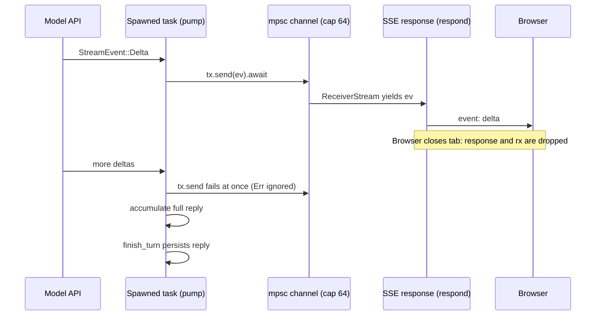

You are reviewing a pull request against `crates/api/src/routes/sse.rs` and you meet this signature:

```rust
pub async fn pump<S>(mut upstream: S, tx: &mpsc::Sender<StreamEvent>) -> (String, Usage, Option<String>)
where
    S: Stream<Item = StreamEvent> + Unpin,
```

Three questions decide whether you can review it. Why does `upstream` arrive by value while `tx` arrives by reference? What does `Unpin` buy? What happens inside this function when the browser disconnects halfway through a reply? An engineer who has never written Rust approves on vibes. A senior engineer reads the signature as a contract: `pump` *owns* the stream and will consume it, *borrows* the sender and therefore cannot close it, and needs a stream that can be polled without first being pinned in place.

Rust earns that density by moving memory management and data-race prevention from run time to compile time. There is no garbage collector and no reference counting unless you ask for it, yet use-after-free, double free, iterator invalidation and data races are compile errors. Everything in this lesson follows from three rules about who owns a value and who may look at it. Once those rules are mechanical, this app's backend (Axum on Tokio, SeaORM on Postgres) reads like any other codebase. Every number below was measured with `rustc 1.98.1 -O` on a Ryzen 9 9950X3D under WSL2; treat them as orders of magnitude for other machines.

## Ownership: one owner, freed exactly once

1. Every value has exactly one owner: a variable, a struct field, a slot in a collection.
2. Assigning or passing by value *moves* ownership. The source is statically dead afterwards.
3. When the owner goes out of scope the value is *dropped*: its destructor runs and its heap memory is freed.

```rust
fn main() {
    let s = String::from("hello"); // s owns a heap buffer; (ptr, len 5, cap 5) lives on the stack
    let t = s;                     // move: the 24-byte header is copied, s is invalidated
    // println!("{s}");            // error[E0382]: borrow of moved value: `s`
    println!("{t}");
}                                  // t is dropped here and the buffer is freed, once
```

A move is a bitwise copy of the stack part plus a compile-time note that the source is dead; the heap is untouched. Types that own no resources (integers, `bool`, `char`, shared references, tuples of those) implement `Copy` and are duplicated instead. A deep copy only happens when you write `.clone()`, so grep a hot path for `.clone()` and you have found its allocations. When a value is moved on only some paths (`if cond { consume(v) }`), the compiler adds a hidden one-byte *drop flag* and checks it at scope end; that is the only run-time trace ownership leaves.

In Python, Java or Go, `t = s` makes two names for one object and a collector decides when it dies. In C++, `t = s` deep-copies and `std::move` leaves the source "valid but unspecified". Rust makes the moved-from name unusable, so exactly one owner frees the buffer: no double free, no forgotten free, no collector. The [memory management lesson](/learn/foundations/how-code-runs/memory-management) sets this beside reference counting and tracing.

```viz
{"type": "memory", "algorithm": "ownership-borrowing",
 "title": "Owner, shared borrows, an exclusive borrow, then a move",
 "caption": "Watch which arrows are solid (ownership) and which are dashed (borrows). The buffer is freed exactly once, by whoever owns it at the end."}
```

## Under the hood: what values cost

`std::mem::size_of` answers "how big is the part that moves", measured:

| Type | Bytes | Why |
|---|---|---|
| `String`, `Vec<u32>` | 24 | Pointer, length, capacity; the contents are on the heap |
| `&str`, `&[u8]` | 16 | A *fat* pointer: address plus length |
| `Box<i32>`, `Rc<String>`, `Arc<Mutex<u64>>` | 8 | One pointer; the counts live in the heap block next to the value |
| `Box<dyn Fn()>`, `&dyn Debug` | 16 | Data pointer plus vtable pointer |
| `Option<Box<i32>>`, `Option<&i32>` | 8 | *Niche*: a null pointer is never a valid `Box`, so `None` is encoded as null for free |
| `Option<u64>` | 16 | Every `u64` bit pattern is valid, so the tag needs its own word |
| An enum with `NotFound(&'static str)`, `Validation(String)` and `RateLimited { message: String, retry_after_secs: Option<u64> }` | 40 | Largest variant (24 + 16) with the tag folded into a niche |
| `Result<u64, ThatEnum>` | 40 | The `Ok` case also fits in the error's spare tag values |

Two consequences for review. A `Result<T, E>` is as large as its larger side, and it is returned by value through every `?`, so a 200-byte error type makes every fallible call copy 200 bytes; that is why large error payloads get boxed. And collections grow geometrically: pushing 100 items into a `Vec<u32>` reallocated at capacities 4, 8, 16, 32, 64 and 128, and a `HashMap`'s capacity went from 3 to 7 at its 4th insert and to 14 at its 8th. Growth moves the elements, which is exactly why a reference into a collection cannot survive a mutation.

Allocation itself is cheap but not free: a 64-byte `Box` allocation and free measured 5.0 ns. Spawning and joining an OS thread measured about 96 µs on this machine, four orders of magnitude more, which is the number that makes async runtimes worth having.

## Borrowing: a real borrow-checker error, traced

Most functions do not want ownership; they want to look. `&T` is a shared borrow: any number may coexist and none may mutate. `&mut T` is an exclusive borrow: while it is live, no other borrow of the value exists. Here is the error you will meet most, in the form it takes in real code:

```rust
use std::collections::HashMap;

fn main() {
    let mut scores: HashMap<String, Vec<u32>> = HashMap::new();
    scores.insert("ana".to_string(), vec![90, 85]);
    let ana = scores.get("ana").unwrap();      // shared borrow of `scores`
    scores.insert("bo".to_string(), vec![70]); // needs &mut scores
    println!("{}", ana.len());                 // shared borrow still live here
}
```

```text
error[E0502]: cannot borrow `scores` as mutable because it is also borrowed as immutable
 --> borrow.rs:7:5
  |
6 |     let ana = scores.get("ana").unwrap();      // shared borrow of `scores`
  |               ------ immutable borrow occurs here
7 |     scores.insert("bo".to_string(), vec![70]); // needs &mut scores
  |     ^^^^^^^^^^^^^^^^^^^^^^^^^^^^^^^^^^^^^^^^^ mutable borrow occurs here
8 |     println!("{}", ana.len());                 // shared borrow still live here
  |                    --- immutable borrow later used here
```

Trace the checker's reasoning line by line. It needs only two facts per line: which borrows exist, and how long each is *live*. Since Rust 2018 a borrow is live from its creation to its **last use**, not to the end of the block ("non-lexical lifetimes").

| Line | Code | Borrows live after this line | Check |
|---|---|---|---|
| 5 | `scores.insert(...)` | a temporary `&mut scores`, ended at the semicolon | nothing else live: OK |
| 6 | `let ana = scores.get(...)` | `ana: &Vec<u32>` borrowed from `scores`, live until line 8 | shared borrow while no `&mut`: OK |
| 7 | `scores.insert(...)` | wants `&mut scores` | `ana` is live (used on line 8): **E0502** |
| 8 | `ana.len()` | `ana`'s last use | the "later used here" label |

Notice what the checker did *not* look at: the map's capacity. After one insert this map had capacity 3, so the second insert would not actually have resized and moved `ana`'s `Vec` header. The checker reasons from signatures (`insert` takes `&mut self`, so it *may* move anything inside), not from run-time state; the next insert that crosses a capacity boundary really does move the entries, and in C++ that is a dangling reference that passes tests.

The three fixes, in order of preference:

1. **Reorder so the borrow ends first.** Move the `println!` above the insert. Line 7 then sees no live borrow. This is free.
2. **Copy out what you need.** `let n = scores.get("ana").unwrap().len();` keeps a `usize`, not a borrow. Also free.
3. **Clone.** `let ana = scores["ana"].clone();` owns its copy. Correct, and it costs an allocation per call; fine at startup, suspicious in a hot loop.

The same rule, applied across threads, rules out data races: a race needs two accesses to one location, one of them a write, without synchronisation, and "many readers or one writer" forbids exactly that. Where the rule hurts is data structures with cycles or back-pointers (doubly linked lists, graphs, trees with parent links). The idiomatic fixes are nodes in a `Vec` linked by index, an arena, or runtime-checked sharing with `Rc<RefCell<T>>`. In an interview, a graph is `Vec<Vec<usize>>`.

## Lifetimes: names for how long a borrow is valid

A lifetime annotation never changes how long anything lives. It names a relationship so the compiler can check a function from its signature alone:

```rust
fn longest<'a>(a: &'a str, b: &'a str) -> &'a str {
    if a.len() >= b.len() { a } else { b }
}
```

"The result borrows from `a` or `b`, so it is valid only while both are." Most code has no annotations because of *elision*: with one reference input the output gets its lifetime, and in a `&self` method the output is tied to `self`. `'static` has two meanings:

| Written as | Means | In this repo |
|---|---|---|
| `&'static str` | A reference valid for the whole program, usually a literal in the binary | `AppError::NotFound(&'static str)` carries names like `"lesson"` with no allocation |
| `T: 'static` (a bound) | `T` holds no borrows shorter than the program: it owns its data | `tokio::spawn` and `spawn_blocking` require it; `String` qualifies, a `&str` into a request does not |

`T: 'static` does not mean the value lives forever. A `String` satisfies it and is dropped the moment its owner goes out of scope.

## Enums and errors as values

A Rust `enum` is a tagged union. The app's error vocabulary is one (`crates/core/src/error.rs`, abridged):

```rust
#[derive(Debug, thiserror::Error)]
pub enum AppError {
    #[error("{0}")]
    Validation(String),
    #[error("authentication required")]
    Unauthorized,
    #[error("{0} not found")]
    NotFound(&'static str),
    #[error("rate limit exceeded: {message}")]
    RateLimited {
        message: String,
        /// When a retry can succeed, if known; sent as `Retry-After`.
        retry_after_secs: Option<u64>,
    },
    #[error("upstream AI provider error: {0}")]
    AiUpstream(String),
    #[error("database error")]
    Database(#[from] sea_orm::DbErr),
    #[error("internal error: {0}")]
    Internal(String),
    // ...
}
```

`match` must be exhaustive. `AppError::code()` and the status mapping in `ApiError`'s `IntoResponse` impl (`crates/api/src/error.rs`) each list every variant with no `_ =>` wildcard, deliberately: add `PaymentRequired` and the build fails at both sites until someone decides its machine code and HTTP status. A wildcard would silently map the new variant to whatever the default was.

The shape of a variant is a design decision. `RateLimited` used to be `RateLimited(String)`, which had nowhere to put *when*, so the daily AI budget's 429 went out without `Retry-After` although the reset time was known. The struct variant made room for `retry_after_secs: Option<u64>`, whose type says some producers know the wait and some do not, and the compiler found every match that had to change. Constructors carry policy too: `AppError::ai_upstream(public, detail)` logs `detail` (provider messages that can echo request content) and keeps only `public` in the value, so the leak is impossible to write by accident at a call site.

`#[from]` generates `impl From<sea_orm::DbErr> for AppError`, and that impl is what makes `?` work. The operator is early return plus `From::from`:

```rust
let user = state.auth.authenticate(token).await?;
// is roughly
let user = match state.auth.authenticate(token).await {
    Ok(v) => v,
    Err(e) => return Err(From::from(e)),
};
```

Follow one failure end to end: Postgres drops a connection, SeaORM returns `DbErr`, `?` in a service converts it to `AppError::Database`, `?` in the handler converts that to `ApiError`, and `IntoResponse` maps it to a 500 whose body says `"internal error"` while the cause goes to the log. `thiserror` builds typed errors that callers match on; `anyhow` builds opaque errors with context chains for application edges, bridged by `From<anyhow::Error> for AppError`, which formats with `{e:#}` to keep the whole chain. `unwrap()` and `expect()` are assertions that panic: right for "Argon2 itself is broken", wrong for anything derived from request input.

## Traits and generics: how Axum turns types into behaviour

A trait is an interface any type can implement, including types written after the trait. Axum lets a handler's *argument types* decide how the request is parsed (`crates/api/src/extractors.rs`):

```rust
impl FromRequestParts<AppState> for CurrentUser {
    type Rejection = ApiError;

    async fn from_request_parts(parts: &mut Parts, state: &AppState) -> Result<Self, Self::Rejection> {
        match resolve(parts, state).await? {
            Some(u) => Ok(CurrentUser(u)),
            None => Err(ApiError(ascend_core::AppError::Unauthorized)),
        }
    }
}
```

A handler with a `CurrentUser` argument cannot run for an anonymous request, so a missing authorisation check shows up in review as a missing argument rather than a missing `if`. `resolve` caches the session in `parts.extensions` (a map keyed by type, read with `get::<MaybeUser>()`), so two extractors cost one database lookup.

Why wrap `AppError` in `ApiError(pub AppError)` instead of implementing `IntoResponse` for `AppError`? The **orphan rule**: a crate may implement a trait for a type only if it defines one of them. In `crates/api`, `IntoResponse` is Axum's and `AppError` is `ascend_core`'s, so the direct impl is rejected and the local newtype is allowed. The rule forces the right layering anyway: the core crate knows nothing about HTTP ([architecture and boundaries](/learn/senior-craft/software-craft/architecture-and-boundaries)). The same trick gives `AppJson<T>` its own rejection type, `JsonError`, which keeps the status Axum chose (400, 413, 415 or 422) instead of collapsing every rejection into a 422.

| | Generics (`fn f<S: Stream>(s: S)`, `impl Trait`) | Trait objects (`Box<dyn Trait>`, `&dyn Trait`) |
|---|---|---|
| Dispatch | Static: one copy per concrete type (monomorphisation), inlinable | Dynamic: a vtable pointer, one indirect call per method |
| Size | The concrete type's size | 16-byte fat pointer |
| Cost | Zero at run time; larger binaries, longer compiles | An indirection; blocks inlining |
| Use when | Hot paths, types known at compile time | Heterogeneous collections, plugin points, compile-time budgets |

`pump<S>` is generic, so each upstream stream type gets its own copy. `respond` returns `impl IntoResponse`, "some concrete type I choose not to name", which spares everyone from spelling a nest of stream adapters.

## Send and Sync: a real compile error, traced

Two marker traits govern threads, and the compiler derives them from a type's fields. `Send`: ownership may move to another thread. `Sync`: `&T` may be shared between threads (equivalently, `&T` is `Send`). `Rc` is neither, because its count is updated without atomics. `Arc<T>` is both when `T` is. `std::sync::MutexGuard` is `Sync` but not `Send`, because some platforms require a mutex to be unlocked by the thread that locked it.

`tokio::spawn` requires `F: Future + Send + 'static`, because the task may resume on a different worker after any `.await`. An `async fn` compiles to a struct holding every local that is alive across an `.await`, so a non-`Send` local held across one makes the whole future non-`Send`. The program, then rustc's output (abridged):

```rust
use std::sync::Mutex;

fn spawn<F: std::future::Future + Send + 'static>(_f: F) {} // same bound as tokio::spawn

async fn save(_n: u64) {}

static COUNTER: Mutex<u64> = Mutex::new(0);

async fn bump_and_save() {
    let mut guard = COUNTER.lock().unwrap();
    *guard += 1;
    save(*guard).await;          // guard is still alive across this await
}

fn main() {
    spawn(bump_and_save());
}
```

```text
error: future cannot be sent between threads safely
   = help: within `impl Future<Output = ()>`, the trait `Send` is not implemented for `std::sync::MutexGuard<'_, u64>`
note: future is not `Send` as this value is used across an await
10 |     let mut guard = COUNTER.lock().unwrap();
   |         --------- has type `std::sync::MutexGuard<'_, u64>` which is not `Send`
12 |     save(*guard).await;          // guard is still alive across this await
   |                  ^^^^^ await occurs here, with `mut guard` maybe used later
```

The compiler is protecting you twice. The guard is not `Send`, and holding a blocking lock while suspended is a deadlock waiting to happen: another task on the same worker that calls `lock()` blocks the thread, and the task holding the lock can never be polled to release it. The version-specific trap is the fix. On rustc 1.98, adding `drop(guard);` before the `.await` still fails with the same error, because the compiler decides what a future holds from the variable's scope, not from the move. What compiles is a block that ends the guard's scope:

```rust
async fn bump_and_save() {
    let n = {
        let mut guard = COUNTER.lock().unwrap();
        *guard += 1;
        *guard
    };                            // guard dropped at the end of the block
    save(n).await;
}
```

When the lock genuinely must span an await, use `tokio::sync::Mutex`, whose guard is `Send` and whose `lock()` yields instead of blocking. It is slower than `std::sync::Mutex`, which is why Tokio's own documentation recommends the standard mutex for short critical sections.

The cost of thread-safe sharing, measured: `Rc::clone` plus drop took 0.5 ns, `Arc::clone` plus drop 7.2 ns single-threaded. With 2, 4 and 8 threads cloning the *same* `Arc`, each clone took 21, 42 and 88 ns, because the count's cache line bounces between cores. An uncontended `Mutex` lock and unlock took 7.3 ns; eight threads fighting over one took 291 ns per acquisition. `AppState` derives `Clone` cheaply because every field is an `Arc` or a pool handle, but an `Arc` cloned per request on 32 cores is a contention point worth knowing about.

```viz
{"type": "memory", "algorithm": "reference-counting",
 "title": "What Arc and Rc do under the hood",
 "caption": "Counts rise on clone and fall on drop; the object is freed the instant the count hits zero. The final steps show the cycle that never reaches zero, which is why Rust gives you Weak."}
```

## Async under the hood: poll, wakers and Pin

An `async fn` returns a `Future`, a state machine that does nothing until an executor calls `poll`. `poll` returns `Ready(value)` or `Pending`; a future returning `Pending` must first hand the `Waker` from its `Context` to whatever will complete it (epoll, a timer, a channel), which calls `wake()` to ask the executor to poll again. This is the whole protocol, and it fits in std with no runtime:

```rust
use std::future::Future;
use std::pin::Pin;
use std::sync::{Arc, Condvar, Mutex};
use std::task::{Context, Poll, Wake, Waker};

/// A future that is not ready the first `n` times it is polled.
struct Countdown { n: u32 }

impl Future for Countdown {
    type Output = &'static str;
    fn poll(mut self: Pin<&mut Self>, cx: &mut Context<'_>) -> Poll<Self::Output> {
        if self.n == 0 {
            println!("  Countdown::poll -> Ready");
            return Poll::Ready("done");
        }
        println!("  Countdown::poll n={} -> Pending (wake scheduled)", self.n);
        self.n -= 1;
        cx.waker().wake_by_ref(); // a real I/O future would hand the waker to epoll instead
        Poll::Pending
    }
}

/// Minimal executor: poll, and park the thread until the waker fires.
struct Signal { woken: Mutex<bool>, cv: Condvar }
impl Wake for Signal {
    fn wake(self: Arc<Self>) { self.wake_by_ref() }
    fn wake_by_ref(self: &Arc<Self>) { *self.woken.lock().unwrap() = true; self.cv.notify_one(); }
}

fn block_on<F: Future>(fut: F) -> F::Output {
    let mut fut = std::pin::pin!(fut);           // pinned on this stack frame: it will never move again
    let signal = Arc::new(Signal { woken: Mutex::new(false), cv: Condvar::new() });
    let waker = Waker::from(signal.clone());
    let mut cx = Context::from_waker(&waker);
    let mut polls = 0;
    loop {
        polls += 1;
        println!("executor: poll #{polls}");
        if let Poll::Ready(v) = fut.as_mut().poll(&mut cx) { return v; }
        let mut woken = signal.woken.lock().unwrap();
        while !*woken { woken = signal.cv.wait(woken).unwrap(); }
        *woken = false;
    }
}

async fn handler() -> String {
    println!("  handler: start");
    let r = Countdown { n: 2 }.await;   // the handler's state machine is suspended here twice
    println!("  handler: resumed with {r}");
    format!("reply after {r}")
}

fn main() {
    println!("result: {}", block_on(handler()));
}
```

```text
executor: poll #1
  handler: start
  Countdown::poll n=2 -> Pending (wake scheduled)
executor: poll #2
  Countdown::poll n=1 -> Pending (wake scheduled)
executor: poll #3
  Countdown::poll -> Ready
  handler: resumed with done
result: reply after done
```

Read the trace: `handler: start` prints once. Polls 2 and 3 do not rerun the handler from the top; they resume the state machine at its `.await`, which the compiler implemented as a `match` on a saved state number. The locals the handler needs after the await are fields of that state machine, which is measurable: an `async fn` that keeps a 1,024-byte buffer alive across an `.await` produced a 1,026-byte future, and the same function with the buffer scoped to end before the await produced a 16-byte one. `tokio::spawn` moves the whole future into one heap allocation, so large locals held across awaits are memory per concurrent task.

**Pin.** That state machine may hold a reference to one of its own fields (`let r = &buf; x.await; use(r)`). Moving the future to another address would leave `r` pointing at the old one. So `poll` takes `self: Pin<&mut Self>`: a promise that the value will not move again until it is dropped. Types with no self-references implement the auto trait `Unpin`, for which pinning is a no-op; futures from `async` blocks are not `Unpin`. You pin with `Box::pin(fut)` (on the heap, and `Pin<Box<F>>` is itself `Unpin`), `std::pin::pin!(fut)` (on the stack, as `block_on` does), or the older `futures::pin_mut!`, which is what this app's routes use.

**What Tokio adds** is industrial versions of `block_on`: by default one worker thread per core, each with a local run queue plus a shared injection queue, idle workers stealing work, an I/O driver built on epoll that holds the wakers of every parked socket, and a timer wheel. Scheduling is cooperative: a task gives the thread back only when it returns `Pending`. Tokio adds a budget (128 operations per poll on its own resources) so a task that is always ready still yields sometimes, but nothing interrupts a task that computes for 40 ms without touching a Tokio resource.

## Blocking work in an async service

That is why `crates/core/src/auth/password.rs` looks the way it does:

```rust
pub async fn hash(password: String) -> AppResult<String> {
    let _permit = HASH_PERMITS.acquire().await.map_err(AppError::internal)?;
    tokio::task::spawn_blocking(move || hash_sync(&password))
        .await
        .map_err(|e| AppError::Internal(format!("join: {e}")))?
}
```

Argon2id with the crate's default parameters (19,456 KiB of memory, two passes, one lane, per the comment in `hash_sync`) costs tens of milliseconds of CPU and contains no await points. `spawn_blocking` moves it to a separate pool of threads (up to 512 by default). Read the rest of the signature as an ownership contract:

- **`password: String`, not `&str`.** `spawn_blocking` requires a `'static` closure because the blocking task can outlive the caller: if the browser disconnects, Axum drops the handler's future, but a thread already hashing cannot be interrupted. `move ||` transfers the `String` into the closure.
- **The nested `Result`.** `.await` on the join handle yields `Result<AppResult<String>, JoinError>`; `map_err` plus `?` unwraps the outer layer.
- **`_permit` is held, not used.** `let _permit` keeps the semaphore permit alive until the function returns. `let _ = ...` would drop it on the spot: `_` is not a variable, so nothing owns the value.
- **`verify` fails closed and in constant time.** It verifies against `DUMMY_HASH`, a `std::sync::LazyLock`, when the email does not exist, and `.unwrap_or(false)` turns a panicking verifier into a failed login. Because `LazyLock` initialises on first use, the first unknown-email login after boot would pay for a full Argon2 hash and reveal that the email was unknown, so `verify` reads it inside the blocking closure under a permit and `password::warm_up()` forces it at boot. (It used to be `once_cell::sync::Lazy`; the standard library type let the workspace drop the crate.)

## Channels and streams: decoupling work from the request

The coach route (`crates/api/src/routes/coach.rs`) streams a model reply to the browser and must save the full reply even if the tab closes mid-stream:

```rust
let (request, hold) = state.coach.prepare_turn(user.id, &conv, input, progress.as_ref()).await?;
// A failure to start the stream drops `hold`, which releases it.
let upstream = client.stream(&request).await?;

let (tx, rx) = sse::channel();
let coach = state.coach.clone();
// The spawned task outlives the request; `.instrument` carries the request
// span (method, path, request id) into its logs.
state.tasks.spawn(
    async move {
        futures::pin_mut!(upstream);
        let (reply, usage, error) = sse::pump(upstream, &tx).await;
        // … log any stream error and the token usage …
        if let Err(e) = coach.finish_turn(conv.id, reply, usage, hold).await {
            tracing::error!(error = %e, "failed to persist coach reply");
        }
    }
    .instrument(tracing::Span::current()),
);
Ok(sse::respond(rx))
```



- **Cancellation is dropping.** Dropping a future stops it at whatever `.await` it was parked on; the code after that point never runs, and there is no `finally`, only destructors. So the must-complete work lives in a spawned task that owns `tx`, `upstream`, `coach`, `conv` and `hold`; the HTTP response owns only `rx`, and a disconnect drops only that.
- **A budget hold is a value with a destructor.** `prepare_turn` reserves the call's worst case in the daily AI budget and returns a `Reservation`. `settle(mut self, usage)` takes it by value, so it can be settled once, and `Drop` releases an unsettled hold by spawning the database update (destructors cannot `await`). An early `?`, a panic or a failed stream start therefore cannot leak budget, which `a_budget_hold_caps_the_call_at_what_is_left_and_releases_itself` checks by dropping one.
- **A closed receiver is not an error here.** In `pump`, `let _ = tx.send(ev).await;` ignores the `Err` a closed channel returns immediately, and the loop keeps draining `upstream`.
- **The bound is backpressure.** `sse::channel()` is `mpsc::channel(64)`. A slow reader fills the buffer, `send(...).await` waits, `pump` stops pulling from upstream, and the slowdown propagates to the model connection instead of into memory.
- **`match &ev` then `send(ev)`.** `pump` inspects the event through a borrow, then moves it into the channel. The `Done` arm copies the counts out with `usage = *u`, which compiles because `Usage` derives `Copy`.
- **`Unpin` and `pin_mut!`.** The upstream is built with `async_stream::stream!`, which is not `Unpin`. `pin_mut!` pins it on the task's stack, producing a `Pin<&mut S>`, which is `Unpin`, so it satisfies `pump`'s bound.

```viz
{"type": "concurrency", "algorithm": "channels",
 "title": "Bounded channels: handoff, buffering and backpressure",
 "caption": "Tokio's mpsc behaves like the buffered phase here: sends succeed until the buffer is full, then the sender waits for the receiver. That wait is what keeps a slow browser from growing memory without limit."}
```

The [actors, channels and CSP](/learn/systems/concurrency/actors-channels-and-csp) lesson compares this style with locking, and [real-time transports](/learn/networking/application-protocols/real-time-transports) covers SSE on the wire.

## Failure modes in production

**Symptom: during a login burst, p99 rises on every endpoint, health checks included, and CPU use equals the number of workers.** Diagnosis: synchronous CPU work on Tokio workers; with 8 workers, 8 concurrent Argon2 calls occupy all of them and every other task waits. `tokio-console` shows the offending tasks with poll times in tens of milliseconds, and a span around the handler shows the time is not in any `.await`. Fix: `spawn_blocking`, as `password.rs` does. A rule of thumb from Tokio's maintainers is no more than 10 to 100 µs of work between awaits.

**Symptom: after moving hashing to `spawn_blocking`, a credential-stuffing burst OOM-kills the pod.** Diagnosis: the blocking pool bounds *threads* (512), not memory, and each Argon2 call holds 19 MiB: 200 concurrent attempts is about 3.7 GiB. Fix: a semaphore in front of the work, sized to the CPU count, which is what `HASH_PERMITS` is; waiting callers cost a parked task instead of a thread and 19 MiB, and the auth rate limit bounds how many wait.

**Symptom: after a deploy, a few conversations are missing the assistant's last reply, and the log never says "coach turn complete" for them.** Diagnosis: the reply task was a bare `tokio::spawn`; graceful shutdown waited for open connections, not detached tasks, and dropping the runtime when `main` returned cancelled the task before `finish_turn`. Fix: spawn through a `TaskTracker`; on shutdown `serve::finish_tasks` calls `tasks.close()` and waits up to 30 seconds for `tasks.wait()`, bounded so a hung upstream cannot block the deploy, and `crates/api/tests/shutdown.rs` checks both that a task finishes and that it cannot hold the process forever.

**Symptom: "coach stream error" lines lack the `request_id` every other line of the request carries.** Diagnosis: a spawned task does not inherit the current `tracing` span. Fix: `.instrument(tracing::Span::current())`, called in the handler while the request span is still current.

**Symptom: memory grows slowly and never falls in a service that keeps a graph of `Rc` or `Arc` nodes.** Diagnosis: a reference cycle; counts never reach zero, and safe Rust allows it. Fix: make back-pointers `Weak`, or store the graph as indices into a `Vec`.

## Reading Rust fast, and Rust in an interview

| You see | It means |
|---|---|
| `x?` | Unwrap `x`, or return early if it is `Err` (converted with `From`) or `None` |
| `&T`, `&mut T` | Shared borrow, exclusive borrow |
| `'a`, `'static` | A named borrow region; "valid for the whole program" or, as a bound, "owns its data" |
| `impl Trait`, `dyn Trait` | One concrete type, statically dispatched; any type, behind a vtable |
| `f::<T>()` | Turbofish: naming a generic parameter explicitly |
| `move \|\| ...`, `async move {}` | The closure or future takes ownership of what it captures |
| `Pin<&mut T>` | `T` will not move again; required to poll a self-referential future |
| `unsafe { ... }` | The author promises invariants the compiler cannot check; review it line by line |

| Interview need | Rust idiom | Trap |
|---|---|---|
| Frequency count | `*m.entry(k).or_insert(0) += 1` | `m[&k]` panics on a missing key |
| Min-heap | `BinaryHeap<Reverse<(u64, usize)>>` | `BinaryHeap` is a max-heap; `f64` is not `Ord` |
| Largest key at most x | `btree.range(..=x).next_back()` | `HashMap` has no order |
| Queue | `VecDeque::pop_front` | `Vec::remove(0)` is O(n) |
| Two-key sort | `v.sort_by(\|a, b\| b.1.cmp(&a.1).then(a.0.cmp(&b.0)))` | `sort_unstable` is faster but not stable |
| Index arithmetic | `usize` indices, `checked_sub` | `i - 1` with `i == 0` panics in debug and wraps in release |
| Graph or tree | `Vec<Vec<usize>>`, nodes in a `Vec` | `Rc<RefCell<Node>>` costs minutes of type wrangling |

Choose Rust for a coding round only if you are already fluent; the [choosing an interview language](/learn/senior-craft/languages-for-senior-engineers/choosing-an-interview-language) lesson measures what it costs. In a design review, Rust is the right call for latency-sensitive services where GC pauses show in p99 (proxies, storage engines, streaming), memory-constrained deployments, and parsing untrusted input. Its costs are slower compiles, a steeper learning curve, a smaller hiring pool and an async model that asks you to understand `Pin`, `Send` and cancellation. Tie the choice to a measured requirement ("our p99 budget is 5 ms and the JVM service spends 3 ms of it in GC pauses"), not to taste.

## Interviewer follow-ups

**"Why can't you hold a `std::sync::MutexGuard` across `.await`?"** Model answer: the guard is not `Send`, so the future cannot be spawned on a multi-threaded runtime; and even where it compiles, a task suspended while holding a blocking lock can deadlock a worker whose next task calls `lock()`. Scope the guard in a block that ends before the await (on rustc 1.98 an explicit `drop` is not enough), or use `tokio::sync::Mutex` when the lock must span it. Common wrong answer: "always use Tokio's mutex in async code", which pays an async lock's overhead for critical sections that never await.

**"`Rc` or `Arc`?"** Model answer: `Rc` for single-threaded sharing, with non-atomic counts (0.5 ns a clone measured) and no `Send`; `Arc` across threads, with atomic counts (7 ns uncontended, 88 ns with eight threads cloning one `Arc`). Common wrong answer: "`Arc` always, it is only a pointer", which ignores the cache-line contention on hot shared counts.

**"Can safe Rust leak memory?"** Model answer: yes, through `Rc` cycles, `mem::forget` and `Box::leak`; leaking is memory-safe, because Rust prevents dangling and double frees, not waste. Common wrong answer: "no, the borrow checker prevents leaks".

**"What happens to a spawned task when its `JoinHandle` is dropped, and to a handler when the client disconnects?"** Model answer: Tokio detaches the task and it keeps running (`abort()` cancels it); the handler's future is dropped at its current `.await` and nothing after it runs, so must-complete work belongs in a spawned, tracked task. Common wrong answer: "dropping the handle cancels the task", which is true of some other runtimes' task types and false for Tokio.

**"Why does `poll` take `Pin<&mut Self>`?"** Model answer: futures generated from `async` code can hold references into themselves across awaits, so they must not move once polled; `Pin` is the type-level promise, and `Unpin` types opt out. Common wrong answer: "`Pin` puts the future on the heap", when `Box::pin` does that and `pin!` pins on the stack.

## What mid-level engineers get wrong

- **Cloning to silence the borrow checker in a hot path.** Consequence: an allocation per call that reordering or copying a `usize` would have avoided.
- **`let _ = semaphore.acquire().await`.** Consequence: the permit drops immediately and the limit bounds nothing.
- **`unwrap()` on anything derived from a request.** Consequence: one malformed input panics the task, and the client sees a reset connection instead of a 400.
- **A `_ =>` arm on a domain enum.** Consequence: the next variant is silently mapped to the default status, and the compiler's checklist is gone.
- **Blocking calls inside `async fn`** (`std::fs`, a blocking HTTP client, a password hash). Consequence: worker starvation that shows up as latency on unrelated endpoints.
- **Holding large buffers across `.await`.** Consequence: every concurrent task's future carries them; a 1 KiB buffer made a 1,026-byte future instead of a 16-byte one.
- **Assuming `tokio::spawn` work finishes on shutdown.** Consequence: lost writes on every deploy.

## Exercise

Model the core of the borrow checker. Every test below matches what `rustc 1.98` does with the equivalent program.

```exercise
id: first-borrow-error
title: Find the first borrow-checker error
prompt: |
  A program works on one owned value `v`. `stmts` is its list of statements:

  - `["shared", name]` creates a shared borrow `name` (`let name = &v;`)
  - `["mut", name]` creates an exclusive borrow `name` (`let name = &mut v;`)
  - `["use", name]` uses an earlier borrow (`println!("{name:?}")`)
  - `["read"]` reads `v` through its owner (`v.len()`)
  - `["write"]` mutates `v` through its owner (`v.push(1)`)
  - `["move"]` moves `v` to a new owner (`let w = v;`)

  Each name is created once and used only after it is created. A borrow is
  live from its creation up to its last `use` (non-lexical lifetimes); a
  borrow that is never used is dead immediately. At statement `i`, the
  borrows that matter are those created before `i` and used after `i`.

  Return the index of the first statement the compiler rejects, or -1:
  `shared` and `read` fail while an exclusive borrow is live; `mut`,
  `write` and `move` fail while any borrow is live; and after a `move`,
  any statement other than `use` fails.
languages: [python, javascript]
entry: first_borrow_error
starter:
  python: |
    def first_borrow_error(stmts):
        # your code here
        return -1
  javascript: |
    function first_borrow_error(stmts) {
      // your code here
      return -1;
    }
tests:
  - args: [[["shared", "first"], ["write"], ["use", "first"]]]
    expected: 1
    label: "E0502: mutate while a shared borrow is live"
  - args: [[["shared", "first"], ["use", "first"], ["write"]]]
    expected: -1
    label: the borrow ends at its last use
  - args: [[["shared", "a"], ["shared", "b"], ["read"], ["use", "a"], ["use", "b"]]]
    expected: -1
    label: many readers
  - args: [[["mut", "m"], ["read"], ["use", "m"]]]
    expected: 1
    label: read while exclusively borrowed
  - args: [[["mut", "m"], ["mut", "n"], ["use", "n"], ["use", "m"]]]
    expected: 1
    label: "E0499: two exclusive borrows"
  - args: [[]]
    expected: -1
    label: empty program
  - args: [[["shared", "a"], ["move"], ["use", "a"]]]
    expected: 1
    hidden: true
    label: "E0505: move while borrowed"
  - args: [[["shared", "a"], ["use", "a"], ["move"], ["write"]]]
    expected: 3
    hidden: true
    label: "E0382: use after move"
hints:
  - "First pass: record each borrow's creation index, kind and last-use index (the creation index if it is never used)."
  - "Second pass: at each non-use statement i, the live borrows are those with created < i < last_use. Check the rule for the statement's kind."
  - "Keep a moved flag; once set, every later statement except use is an error."
```

## Senior signals

- You read a Rust signature as an ownership contract: by value means consumed, `&` means inspected, `&mut` means exclusively modified, `'static` means owns its data, `Pin` means will not move.
- You read a borrow-checker error as a liveness trace (created here, conflicting use here, later used here) and pick the cheapest fix: reorder, copy out, then clone.
- You explain `spawn_blocking` in terms of cooperative scheduling and ask what bounds the memory of the blocking work.
- You treat cancellation as dropping, and move must-complete work into a tracked task the request cannot cancel.
- You know what `Send` failures mean across `.await`, and that the fix on current compilers is a block scope, not `drop`.
- You prefer exhaustive `match` on domain enums, and recognise the newtype-at-the-boundary pattern as both an orphan-rule workaround and a layering decision.
- You pick Rust for a measured reason (tail latency, memory, safety of parsing) and name its costs to the team.

## Check yourself

```quiz
- q: >-
    `let ana = scores.get("ana").unwrap();` then `scores.insert(...)` then `ana.len()` fails with E0502, although the map has spare capacity and the insert would not resize. Why does the compiler reject it?
  options: ["It rejects any two method calls on one map within the same block", "It checks signatures: insert takes &mut self, which may move entries", "HashMap values are always boxed, so any insert invalidates every reference", "It tracks capacity and assumes the next insert will always resize the map"]
  answer: 1
  explanation: >-
    The borrow checker never looks at run-time state such as capacity. insert takes &mut self, and an exclusive borrow may do anything to the map, including the resize that really does move entries on a later insert. The error vanishes if ana's last use comes before the insert, because non-lexical lifetimes end the borrow there; values are stored inline in the table, not boxed.
- q: >-
    On rustc 1.98, an async fn locks a std::sync::Mutex, reads the value, calls `drop(guard)`, then awaits. Passing it to tokio::spawn still fails because the future is not Send. What compiles?
  options: ["Wrap the guard in an Arc so that it can be shared between the threads", "Add an explicit Send bound to the async fn's return type annotation", "Read the value inside a block that ends the guard's scope, then await", "Call the lock inside a closure that is passed to spawn_blocking instead"]
  answer: 2
  explanation: >-
    The analysis of what a future holds across an await is based on the variable's scope, so an explicit drop is not enough on this compiler, while a block that ends before the await is. Arc does not make a MutexGuard Send, and asserting Send in a signature does not change the type. spawn_blocking is for long CPU work, not for a nanoseconds-long critical section.
- q: >-
    An async fn keeps a 1,024-byte array alive across one .await; a second version ends the array's scope before the await. size_of_val on the two futures measured 1,026 and 16 bytes. What explains the difference?
  options: ["The compiler boxes every array that is larger than one kilobyte in size", "Awaiting copies the whole stack frame into the future, whatever is live", "The first future is compiled in debug mode and the second is optimised", "Locals alive across an await are stored as fields of the state machine"]
  answer: 3
  explanation: >-
    An async fn compiles to a state machine whose fields are the locals that must survive a suspension. A buffer that is dead before the await need not be saved, so the future stays small. Nothing is boxed implicitly and the frame is not copied wholesale, which is why scoping large temporaries before an await shrinks every spawned task.
- q: >-
    A teammate adds `AppError::PaymentRequired` with an `#[error(...)]` attribute and nothing else. What happens?
  options: ["The build fails at code() and at the status match until each handles it", "It compiles, because thiserror derives an HTTP status from the message", "It compiles, and the new variant falls into a default 500 arm at run time", "It compiles, then panics the first time a handler returns the variant"]
  answer: 0
  explanation: >-
    Both matches are exhaustive with no wildcard, so the compiler lists every site that must decide a machine code and a status. A wildcard would have silently produced a default. thiserror only generates Display (and From for #[from] fields); it knows nothing about HTTP.
- q: >-
    During a coach reply, the browser disconnects after ten deltas. What does `pump` do next?
  options: ["The upstream model stream is cancelled automatically once rx is dropped", "tx.send waits forever, because nobody reads from the channel any more", "tx.send returns Err at once; pump ignores it and keeps draining upstream", "tx.send panics on the closed channel and the spawned task aborts early"]
  answer: 2
  explanation: >-
    Dropping the receiver closes the channel; sends then fail fast instead of waiting or panicking. `let _ =` discards the error and the task goes on to finish_turn, so the full reply is persisted. Nothing links rx to the upstream stream, which is the design: the work outlives the request.
- q: >-
    You call `hash_sync` (Argon2, tens of milliseconds) directly inside an async handler on a Tokio runtime with 8 workers. What happens under 8 simultaneous logins?
  options: ["It fails to compile, because async code cannot call sync functions", "All 8 workers are stuck hashing, so every other request waits", "Tokio's 128-operation budget preempts the hashing and yields", "Tokio detects the blocking call and moves it to the blocking pool"]
  answer: 1
  explanation: >-
    Scheduling is cooperative: a task yields only by returning Pending. The coop budget counts operations on Tokio's own resources, so a pure computation never touches it and holds its worker the whole time. Calling a sync function from async code compiles fine, which is why this bug reaches production; spawn_blocking plus a bound on concurrency is the fix.
```
