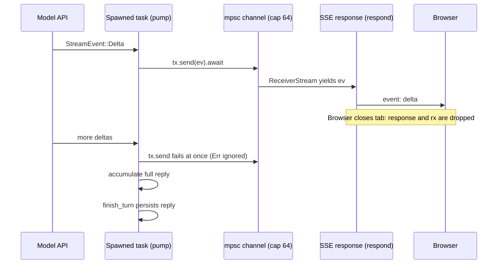

You are reviewing a pull request against `crates/api/src/routes/sse.rs` and you meet this signature:

```rust
pub async fn pump<S>(mut upstream: S, tx: &mpsc::Sender<StreamEvent>) -> (String, Usage, Option<String>)
where
    S: Stream<Item = StreamEvent> + Unpin,
```

Three questions decide whether you can review it. Why does `upstream` arrive by value while `tx` arrives by reference? What does `Unpin` buy? What happens inside this function when the browser disconnects halfway through a reply? An engineer who has never written Rust approves on vibes. A senior engineer reads the signature as a contract: `pump` *owns* the stream and will consume it, *borrows* the sender and therefore cannot close it, and needs a stream that can be polled without first being pinned in place.

Rust earns that density by moving memory management and data-race prevention from runtime to compile time. There is no garbage collector and no reference counting unless you ask for it, yet use-after-free, double free, iterator invalidation and data races are compile errors. Everything in this lesson follows from three rules about who owns a value and who may look at it. Once those rules are mechanical, this app's backend (Axum on Tokio, SeaORM on Postgres) reads like any other codebase.

## Ownership: one owner, freed exactly once

The rules:

1. Every value has exactly one owner: a variable, a struct field, a slot in a collection.
2. Assigning or passing by value *moves* ownership. The source is statically dead afterwards.
3. When the owner goes out of scope the value is *dropped*: its destructor runs and its heap memory is freed.

```rust
fn main() {
    let s = String::from("hello"); // s owns a heap buffer; (ptr, len 5, cap 5) lives on the stack
    let t = s;                     // move: the 24-byte header is copied, s is invalidated
    // println!("{s}");            // error[E0382]: borrow of moved value: `s`
    println!("{t}");
}                                  // t is dropped here and the buffer is freed, once
```

A move is a bitwise copy of the stack part (pointer, length and capacity: 24 bytes on a 64-bit machine) plus a compile-time note that the source is dead; the heap is untouched. Types that own no resources (integers, floats, `bool`, `char`, shared references, tuples of those) implement `Copy` and are duplicated instead of moved. A deep copy only happens when you write `.clone()`, which makes every allocation visible in review: grep a hot path for `.clone()` and you have found its copies.

Compare the same two lines elsewhere. In Python, Java or Go, `t = s` makes two names for one object and a garbage collector decides when it dies. In C++, `t = s` deep-copies by default and `std::move` leaves the source "valid but unspecified", a runtime hazard. Rust picks move-by-default and makes the moved-from name unusable, so there is always exactly one owner to free the buffer: no double free, no leak by forgetting, no collector.

```viz
{"type": "memory", "algorithm": "ownership-borrowing",
 "title": "Owner, shared borrows, an exclusive borrow, then a move",
 "caption": "Watch which arrows are solid (ownership) and which are dashed (borrows). The buffer is freed exactly once, by whoever owns it at the end."}
```

## Borrowing: many readers or one writer

Most functions do not want ownership; they want to look. A *borrow* lends access without transferring ownership:

- `&T` is a shared borrow. Any number may coexist. Through it you can read but not mutate.
- `&mut T` is an exclusive borrow. While it is live, no other borrow of the same value exists.

That is the whole rule, and it prevents a surprising range of bugs. The classic one:

```rust
let mut v = vec![1, 2, 3];
let first = &v[0];   // shared borrow into v's buffer
v.push(4);           // error[E0502]: cannot borrow `v` as mutable because it is also borrowed as immutable
println!("{first}");
```

`push` on a full `Vec` (capacity 3) reallocates to a bigger buffer and frees the old one, so `first` would point into freed memory. In C++ this is undefined behaviour that passes tests. In Java, mutating a list while iterating it throws `ConcurrentModificationException` at runtime, if you are lucky enough to hit the path. In Rust it does not compile. Delete the `println!` and it compiles, because a borrow lasts until its *last use*, not until the end of the block (the "non-lexical lifetimes" rule).

The same rule, applied across threads, is what rules out data races. A data race needs two accesses to the same memory, at least one a write, without synchronisation. "Many readers or one writer" forbids exactly that combination, so shared mutable state across threads has to go through a type that provides synchronisation (`Mutex<T>`, `RwLock<T>`, atomics, channels).

Where the rule hurts: data structures with cycles or back-pointers (doubly linked lists, graphs, trees with parent links) and structs that borrow from themselves. The idiomatic fixes are to store nodes in a `Vec` and link them by index, to use an arena, or to opt into runtime-checked sharing with `Rc<RefCell<T>>`. In an interview, use `Vec<Vec<usize>>` for graphs.

## Lifetimes: names for how long a borrow is valid

A lifetime annotation never changes how long anything lives. It names a relationship between borrows so the compiler can check a function by its signature alone.

```rust
fn longest<'a>(a: &'a str, b: &'a str) -> &'a str {
    if a.len() >= b.len() { a } else { b }
}
```

This says "the returned reference borrows from `a` or `b`, so it is valid only while both are". The caller cannot keep the result after either input is dropped. Most code has no annotations because of *elision*: with one reference input the output gets its lifetime, and in a `&self` method the output is tied to `self`.

`'static` has two meanings, and confusing them is a common interview stumble:

| Written as | Means | Example in this repo |
|---|---|---|
| `&'static str` | A reference valid for the whole program, usually a literal baked into the binary | `AppError::NotFound(&'static str)` carries names like `"lesson"` with no allocation |
| `T: 'static` (a bound) | `T` contains no borrows shorter than the program, i.e. it owns its data | `tokio::spawn` and `spawn_blocking` require it; `String` qualifies, `&str` from a request does not |

`T: 'static` does *not* mean the value lives forever. A `String` satisfies it and is dropped the moment its owner goes out of scope.

## Enums and errors as values

A Rust `enum` is a tagged union: each variant can carry different data, and the value is roughly as large as its largest variant plus a tag. The app's whole error vocabulary is one (`crates/core/src/error.rs`, abridged):

```rust
#[derive(Debug, thiserror::Error)]
pub enum AppError {
    #[error("{0}")]
    Validation(String),
    #[error("authentication required")]
    Unauthorized,
    #[error("{0} not found")]
    NotFound(&'static str),
    #[error("rate limit exceeded: {0}")]
    RateLimited(String),
    #[error("database error")]
    Database(#[from] sea_orm::DbErr),
    #[error("internal error: {0}")]
    Internal(String),
    // ...
}
```

`match` on an enum must be exhaustive. `AppError::code()` and the status mapping in `ApiError`'s `IntoResponse` impl (`crates/api/src/error.rs`) each list every variant with no `_ =>` wildcard, deliberately. Add `PaymentRequired` and the build fails at both sites until someone decides its machine code and HTTP status. The compiler becomes the checklist a reviewer would otherwise have to remember. A wildcard arm would silently map the new variant to whatever the default was.

`thiserror` is a derive macro. `#[error("...")]` generates `Display`, and `#[from]` generates a conversion:

```rust
impl From<sea_orm::DbErr> for AppError {
    fn from(e: sea_orm::DbErr) -> Self { AppError::Database(e) }
}
```

That conversion is what makes `?` work. The operator is early return plus `From`:

```rust
let user = state.auth.authenticate(token).await?;
// is roughly
let user = match state.auth.authenticate(token).await {
    Ok(v) => v,
    Err(e) => return Err(From::from(e)),
};
```

Follow one failure end to end: Postgres drops a connection, SeaORM returns `DbErr`, `?` in a service converts it to `AppError::Database`, `?` in the handler converts that to `ApiError` (via `From<AppError> for ApiError`), and `IntoResponse` maps it to a 500 whose body says `"internal error"` while the real cause goes to the log. No exceptions, no stack unwinding, and every conversion is a function you can read.

The repo also shows the standard split between the two popular error crates. `thiserror` builds *typed* errors that callers match on, which is what a domain layer needs. `anyhow` builds *opaque* errors with context chains, which is what application edges and scripts need. The bridge is `From<anyhow::Error> for AppError`, which formats with `{e:#}`: the alternate format prints the whole context chain (`loading config: reading file: permission denied`) into one `Internal` string.

`Option<T>` and `Result<T, E>` replace null and exceptions. `unwrap()` and `expect()` are assertions that panic. `expect("dummy hash")` in `password.rs` initialises a `LazyLock` once and can fail only if Argon2 itself is broken, a programming error where crashing loudly is correct; the same call on request input turns one bad input into a crashed task.

## Traits and generics: how Axum turns types into behaviour

A trait is an interface that any type can implement, including types written long after the trait. Axum uses traits to let a handler's *argument types* decide how the request is parsed. Here is the extractor from `crates/api/src/extractors.rs`:

```rust
impl FromRequestParts<AppState> for CurrentUser {
    type Rejection = ApiError;

    async fn from_request_parts(parts: &mut Parts, state: &AppState) -> Result<Self, Self::Rejection> {
        match resolve(parts, state).await? {
            Some(u) => Ok(CurrentUser(u)),
            None => Err(ApiError(ascend_core::AppError::Unauthorized)),
        }
    }
}
```

For every handler argument, Axum calls that type's `from_request_parts`. A handler declared as `async fn detail(State(state): State<AppState>, CurrentUser(user): CurrentUser, ...)` cannot run for an anonymous request, because a `CurrentUser` cannot be constructed without a session. Authorisation is expressed in the signature, and forgetting it is visible in review as a missing argument rather than a missing `if`. `type Rejection = ApiError` is an *associated type*: each implementation picks the error it fails with. `resolve` caches the session in `parts.extensions`, a map keyed by type (`get::<MaybeUser>()` is the "turbofish" naming the type), so a handler that uses two extractors still costs one database lookup.

Why does the API crate wrap `AppError` in `ApiError(pub AppError)` instead of implementing `IntoResponse` for `AppError` directly? The **orphan rule**: you may implement a trait for a type only if your crate defines the trait or the type. In `crates/api`, `IntoResponse` belongs to Axum and `AppError` belongs to `ascend_core`, so the direct impl is rejected. The newtype is local, so the impl is allowed. The rule forces a design that was right anyway: the core crate knows nothing about HTTP, and the mapping from domain error to status code lives once, at the edge. The [architecture and boundaries](/learn/senior-craft/software-craft/architecture-and-boundaries) lesson covers that split in depth.

The same local-type trick pays off again in the JSON body extractor. `AppJson<T>` is declared with `#[derive(FromRequest)]` and `#[from_request(via(axum::Json), rejection(JsonError))]`: the derive generates an extractor that runs Axum's `Json` and converts its rejection with `impl From<JsonRejection> for JsonError`. `From` and `JsonRejection` are both foreign, so that impl compiles only because `JsonError`, a small struct holding a status and a message, is local. Its `IntoResponse` keeps the status Axum chose (400 for malformed JSON, 413, 415, and 422 for well-formed JSON with the wrong fields) and writes the API's `{"code", "message"}` body. The first version converted straight into `ApiError`, which could only say `AppError::Validation`, so every rejection became a 422; a dedicated type was the cheapest way to keep the status and the shape. A handler opts in simply by naming `AppJson<T>` instead of `Json<T>` in its signature.

Generics and trait objects are the two ways to be polymorphic:

| | Generics (`fn f<S: Stream>(s: S)`, `impl Trait`) | Trait objects (`Box<dyn Trait>`, `&dyn Trait`) |
|---|---|---|
| Dispatch | Static: the compiler generates one copy per concrete type (monomorphisation) and can inline | Dynamic: a vtable pointer, one indirect call per method |
| Cost | Zero runtime overhead; larger binaries, longer compiles | A pointer indirection; blocks inlining |
| Use when | Hot paths, known types at compile time | Heterogeneous collections, plugin points, shrinking compile times |

`pump<S>` is generic, so each upstream stream type gets its own specialised copy. `respond` returns `impl IntoResponse`: "some concrete type I choose not to name", still statically dispatched, which spares everyone from spelling a nest of stream adapter types.

`#[derive(Clone)]` on `AppState` is cheap because every field is an `Arc` or a pool handle, and cloning an `Arc` increments an atomic counter rather than copying data. `Arc<T>` is reference counting, with the classic weakness: two `Arc`s pointing at each other never reach zero. The fix is `Weak<T>` for back-pointers.

```viz
{"type": "memory", "algorithm": "reference-counting",
 "title": "What Arc and Rc do under the hood",
 "caption": "Counts rise on clone and fall on drop; the object is freed the instant the count hits zero. The final steps show the cycle that never reaches zero, which is why Rust gives you Weak."}
```

## Async: futures are state machines someone must poll

An `async fn` returns a `Future`: a state machine that does nothing until an executor polls it. Tokio's multi-threaded runtime runs one worker thread per core by default, each polling many tasks. At every `.await` that is not ready, the task returns `Pending` and the worker picks up another task. The scheduling is cooperative: a task that computes for 40 ms without reaching an `.await` holds its worker for 40 ms.

That is why `crates/core/src/auth/password.rs` looks the way it does:

```rust
pub async fn hash(password: String) -> AppResult<String> {
    let _permit = HASH_PERMITS.acquire().await.map_err(AppError::internal)?;
    tokio::task::spawn_blocking(move || hash_sync(&password))
        .await
        .map_err(|e| AppError::Internal(format!("join: {e}")))?
}
```

Argon2id with the default parameters (19 MiB of memory, two passes) costs tens of milliseconds of CPU and contains no await points. Called directly in a handler on an 8-core machine, eight concurrent logins would occupy all eight workers, and every other request, health checks included, would queue behind them. `spawn_blocking` moves the closure to a separate pool of threads (up to 512 by default) built for exactly this.

Now read the signature with ownership in mind:

- **`password: String`, not `&str`.** `spawn_blocking` requires a `'static` closure. The blocking task can outlive the caller: if the browser disconnects, Axum drops the handler's future, but a thread already hashing cannot be interrupted. A borrowed `&str` from the request would dangle. `move ||` transfers ownership of the `String` into the closure, so the compiler has forced correct behaviour under cancellation.
- **The nested `Result`.** `.await` on the join handle yields `Result<AppResult<String>, JoinError>`. `map_err` turns a `JoinError` (the closure panicked) into `AppError`, `?` unwraps the outer layer, and the inner `AppResult<String>` is the function's return value.
- **`verify` fails closed.** Its blocking call ends with `.await.unwrap_or(false)`: if the verifier panics, the login fails. It also verifies against `DUMMY_HASH` when the email does not exist, so response time does not reveal which emails have accounts. `DUMMY_HASH` is a `std::sync::LazyLock`, initialised on first use. It used to be a `once_cell::sync::Lazy`; since `LazyLock` reached the standard library, the crate was dropped from the workspace, one dependency fewer to audit.
- **`_permit` is held, not used.** The `let _permit = ...` binding keeps the semaphore permit alive until the function returns, then its destructor gives it back. Writing `let _ = ...` instead would drop the permit on the spot and bound nothing: `_` is not a variable, so nothing owns the value.

That permit is the answer to the production follow-up a senior asks: the blocking pool bounds *threads*, not *memory*. The first version had no permit, and two hundred concurrent login attempts during a credential-stuffing burst would have meant about 200 × 19 MiB ≈ 3.7 GiB of Argon2 working memory. `HASH_PERMITS` is a `LazyLock<tokio::sync::Semaphore>` sized to the number of CPUs (at least two), so at most that many hashes run at once and the rest wait asynchronously for a permit, costing a parked task rather than a thread and 19 MiB. The authentication rate limit in front of the route bounds how many can wait.

Two marker traits govern threads. `Send`: the value may move to another thread. `Sync`: `&T` may be shared between threads. `tokio::spawn` requires a `Send` future because the task may resume on a different worker after any `.await`. Hold an `Rc` or a `std::sync::MutexGuard` across an `.await` and the future stops being `Send`: the compile error is telling you that you were about to keep a non-thread-safe handle, or a lock, across a suspension point.

**Cancellation is dropping.** Dropping a future stops it at whatever `.await` it was parked on; the code after that point never runs. There is no `finally`, only destructors. Any "do A, then B" sequence where B must happen (persisting a reply, releasing a lease) cannot live in a future that the client's disconnect can drop. Which is exactly the problem the SSE code solves.

## Channels and streams: decoupling work from the request

The coach route (`crates/api/src/routes/coach.rs`) streams a model reply to the browser and must save the full reply even if the tab closes mid-stream:

```rust
let (tx, rx) = sse::channel();
let coach = state.coach.clone();
// The spawned task outlives the request; `.instrument` carries the request
// span (method, path, request id) into its logs.
state.tasks.spawn(
    async move {
        futures::pin_mut!(upstream);
        let (reply, usage, error) = sse::pump(upstream, &tx).await;
        // … log any stream error and the token usage …
        if let Err(e) = coach.finish_turn(user.id, conv.id, reply, usage).await {
            tracing::error!(error = %e, "failed to persist coach reply");
        }
    }
    .instrument(tracing::Span::current()),
);
Ok(sse::respond(rx))
```

`sse::channel()` is `mpsc::channel(64)`, and `state.tasks` is a `TaskTracker` rather than the runtime itself; both matter below.



What each piece does:

- **The spawned task owns the work.** `async move` moves `tx`, `upstream`, `coach`, `conv` and `user` into the task, satisfying `spawn`'s `'static` bound. The HTTP response owns only `rx`. When the client disconnects, Axum drops the response stream, which drops `rx`. The task is unaffected.
- **Shutdown waits for it.** `state.tasks` is a `tokio_util::task::TaskTracker`: it spawns onto the runtime exactly like `tokio::spawn`, but also counts the task. The first version used a bare `tokio::spawn`. That survived a client disconnect but not a deploy: graceful shutdown waits for open connections, not for detached tasks, so on SIGTERM a reply whose browser had already left could still be draining in the background when `main` returned, and dropping the runtime cancelled it before `finish_turn` ran. Now `main` calls `tasks.close()` and waits up to 30 seconds for `tasks.wait()` after the server stops, bounded so a hung upstream cannot block the deploy.
- **A closed receiver is not an error here.** In `pump`, `let _ = tx.send(ev).await;` ignores the `Err` a closed channel returns immediately, and the loop keeps draining `upstream` so `finish_turn` still gets the whole reply.
- **The bound is backpressure.** `mpsc::channel(64)` holds at most 64 events. If the browser reads slowly, the buffer fills, `send(...).await` waits, `pump` stops pulling from upstream, and the slowdown propagates to the model connection instead of into unbounded memory.
- **`match &ev` then `send(ev)`.** `pump` inspects the event through a borrow, then moves it into the channel. Matching by value first would move `ev` into the match and leave nothing to send. The `Done` arm copies the token counts out of that borrow with `usage = *u`, which compiles only because `Usage` derives `Copy`: four integers are cheaper to duplicate than to share.
- **`.instrument(tracing::Span::current())`.** `Instrument` is an extension trait from the `tracing` crate: it adds a method to every future, wrapping it so the given span is entered on each poll. A spawned task does not inherit the span that was current when it was spawned, so the first version of this code logged "coach stream error" without the request ID that every other line of the request carried. The fix is this one call, made in the handler while the request span is still current.
- **`Ok::<_, Infallible>(event)`.** Axum's `Sse` wants a stream of `Result<Event, E>`. The turbofish names `E` as `Infallible`, a type with no values: this stream cannot fail.
- **`Unpin` and `pin_mut!`.** Polling a stream through `&mut` requires that it is safe to move between polls. Streams built from `async` blocks can hold references into themselves and are not `Unpin`. `pin_mut!` pins `upstream` on the task's stack, producing a `Pin<&mut S>`, which is `Unpin`, so it satisfies `pump`'s bound.

```viz
{"type": "concurrency", "algorithm": "channels",
 "title": "Bounded channels: handoff, buffering and backpressure",
 "caption": "Tokio's mpsc behaves like the buffered phase here: sends succeed until the buffer is full, then the sender waits for the receiver. That wait is what keeps a slow browser from growing memory without limit."}
```

The [actors, channels and CSP](/learn/systems/concurrency/actors-channels-and-csp) lesson compares this style with shared-memory locking, and [real-time transports](/learn/networking/application-protocols/real-time-transports) covers SSE on the wire.

## Reading Rust fast

| You see | It means |
|---|---|
| `x?` | Unwrap `x`, or return early if it is `Err` (converted with `From`) or `None` |
| `&T`, `&mut T` | Shared borrow, exclusive borrow |
| `'a`, `'static` | A named borrow region; "valid for the whole program" or, as a bound, "owns its data" |
| `impl Trait` (argument or return) | Some single concrete type implementing `Trait`, statically dispatched |
| `dyn Trait` | Any type implementing `Trait`, behind a pointer with a vtable |
| `f::<T>()` | Turbofish: explicitly naming a generic parameter |
| `move \|\| ...` | The closure takes ownership of what it captures |
| `Arc<T>`, `Arc<Mutex<T>>` | Shared ownership across threads; shared *mutable* state across threads |
| `#[derive(...)]` | Compiler-generated trait impls (`Debug`, `Clone`, `Serialize`) |
| `unsafe { ... }` | The author promises invariants the compiler cannot check; review it line by line |

## Rust in interviews and design reviews

In a coding round, choose Rust only if you are already fluent. Tree and linked-list problems in Rust mean `Option<Box<ListNode>>` or `Option<Rc<RefCell<TreeNode>>>`, and fighting those types costs minutes you do not have. The standard library has what you need otherwise: `BinaryHeap` (a max-heap; wrap items in `std::cmp::Reverse` for a min-heap), `BTreeMap` for ordered maps, `VecDeque`, `HashMap` with the entry API. The [choosing an interview language](/learn/senior-craft/languages-for-senior-engineers/choosing-an-interview-language) lesson weighs this properly.

In a design review, Rust is the right call for latency-sensitive services where GC pauses show up in p99 (proxies, storage engines, streaming), memory-constrained deployments, and correctness-critical parsing of untrusted input. The costs are real: slower compiles, a steeper learning curve, a smaller hiring pool, and an async ecosystem that asks you to understand `Pin`, `Send` and cancellation. A senior engineer states both sides and ties the choice to a measured requirement ("our p99 budget is 5 ms and the JVM service spends 3 ms of it in GC pauses") rather than to taste.

Follow-up questions interviewers use to probe depth:

- Why can you not hold a `std::sync::MutexGuard` across `.await`? (The guard is not `Send`, and holding a blocking lock while suspended can deadlock the worker; use `tokio::sync::Mutex` or restructure.)
- `Rc` versus `Arc`? (Non-atomic versus atomic counts; `Rc` is not `Send`.)
- Can safe Rust leak memory? (Yes: `Rc` cycles, `mem::forget`, `Box::leak`. Leaks are memory-safe; Rust prevents dangling, not waste.)
- What happens to a spawned task when its `JoinHandle` is dropped? (It keeps running; dropping the handle detaches it. Aborting requires `handle.abort()`.)

## Senior signals

- You read a Rust signature as an ownership contract: by value means consumed, `&` means inspected, `&mut` means exclusively modified, `'static` means owns its data.
- You explain `spawn_blocking` in terms of cooperative scheduling and worker starvation, and you ask what bounds the memory of the blocking work.
- You treat cancellation as dropping, and you move must-complete work (persistence, lease release) into a spawned task that the request cannot cancel, exactly as the SSE route does.
- You prefer exhaustive `match` without wildcards on domain enums, so adding a variant is a compile error at every site that must decide something.
- You know the orphan rule and recognise the newtype-at-the-boundary pattern as both a workaround and a layering decision.
- You pick Rust for a measured reason (tail latency, memory, safety of parsing) and name its costs to the team.

## Check yourself

```quiz
- q: >-
    Why does `password::hash` take a `String` rather than a `&str`?
  options: ["Argon2 accepts only heap-allocated input, never a slice of the request", "Owned strings hash faster, because Argon2 then skips copying the bytes", "spawn_blocking needs a 'static closure; the task may outlive the caller", "A &str can never be sent to another thread, whatever lifetime it carries"]
  answer: 2
  explanation: >-
    If the client disconnects, Axum drops the handler future, but the blocking thread keeps hashing. A borrow of request data would dangle, so the 'static bound forces the closure to own the String. Argon2 hashes bytes from any source at the same speed, and a &'static str can be sent between threads; the problem is the lifetime of a request-scoped borrow, not Send.
- q: >-
    A teammate adds `AppError::PaymentRequired` with an `#[error(...)]` attribute and nothing else. What happens?
  options: ["It compiles, because thiserror derives an HTTP status from the message", "The build fails at code() and at the status match until each one handles it", "It compiles, and the new variant falls into a default 500 arm at runtime", "It compiles, then panics the first time a handler returns the variant"]
  answer: 1
  explanation: >-
    Both matches are exhaustive with no wildcard, so the compiler lists every site that must decide a machine code and a status. That is the point of avoiding `_ =>` on domain enums: a wildcard would have silently produced a 500. thiserror only generates Display (and From for #[from] fields); it knows nothing about HTTP.
- q: >-
    Why does the api crate wrap AppError in `ApiError` instead of implementing Axum's IntoResponse for AppError directly?
  options: ["Axum implements IntoResponse only for tuple structs such as ApiError(..)", "Newtypes compile to faster code, since Axum can then inline the whole conversion", "AppError is not Send, so it cannot cross into Axum's async response path", "Orphan rule: no foreign trait on a foreign type, but a local wrapper is fine"]
  answer: 3
  explanation: >-
    In crates/api both IntoResponse (Axum) and AppError (ascend_core) are foreign, so the direct impl is rejected, while the local newtype is allowed. The constraint also enforces the intended layering: the domain crate has no dependency on the web framework. A newtype has no runtime cost or benefit, AppError is Send, and IntoResponse is implemented for all sorts of types (strings, tuples, Json).
- q: >-
    During a coach reply, the browser disconnects after ten deltas. What does `pump` do next?
  options: ["tx.send panics on the closed channel and the spawned task aborts early", "The upstream model stream is cancelled automatically once rx is dropped", "tx.send waits forever, because nobody is reading from the channel any more", "tx.send returns Err at once; pump ignores it and keeps draining upstream"]
  answer: 3
  explanation: >-
    Dropping the receiver closes the channel; sends then fail fast instead of waiting or panicking. `let _ =` discards the error and the task goes on to finish_turn, so the full reply is persisted. Nothing links rx to the upstream stream, which is the design: the work outlives the request.
- q: >-
    You call `hash_sync` directly inside an async handler on a Tokio runtime with 8 worker threads. What happens under 8 simultaneous logins?
  options: ["Nothing, because Tokio preempts any task that runs longer than 10 ms", "All 8 workers are stuck hashing, so every other request waits for them", "Tokio detects the blocking call and moves it to the blocking pool", "It does not compile, because a sync function cannot be called in async code"]
  answer: 1
  explanation: >-
    Tokio schedules cooperatively: a task yields only at an .await, and nothing detects or preempts a long synchronous computation, which holds its worker the whole time. Calling a sync function from async code compiles fine, which is why this bug reaches production. spawn_blocking, plus a bound on how many run at once, is the fix.
- q: >-
    What does the bound `T: 'static` on tokio::spawn's future actually require?
  options: ["It is stored in static memory rather than on the heap or the stack", "It is immutable, so several threads can read it without any locks", "It holds no borrows shorter than the program, so a String qualifies", "It lives until the program exits and is never dropped before that point"]
  answer: 2
  explanation: >-
    As a bound, 'static means "owns everything it references". A String satisfies it and is dropped as normal. What fails the bound is a reference into a stack frame or request that could end while the task is still running.
```
