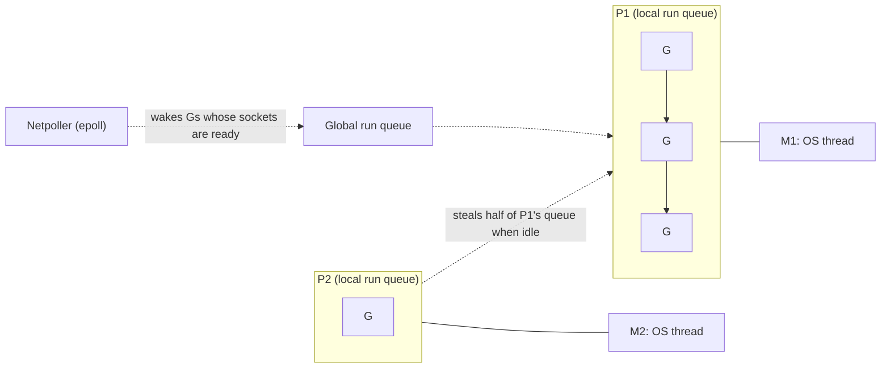

A request to your API must call 20 downstream services, return whatever has arrived within 150 ms, and stop waiting for the stragglers. With a thread per call that is 20 threads per request, a thread pool to bound them, futures, and careful timeout plumbing. With promises it is concise but single-threaded, and cancelling the stragglers is up to each library. In Go it is about 25 lines: a goroutine per call, a channel for results and a context for the deadline. That fit, cheap concurrency with a boring deployment story (one static binary), is why so much of the infrastructure you run is written in Go: Docker, Kubernetes, etcd, Prometheus and Terraform among them.

Go is deliberately small, and its minimalism hides mechanisms with sharp edges: goroutines that leak, `nil` errors that are not `nil`, slices that silently share memory, maps that crash the process, a heap that doubles before it is collected. Knowing the mechanism behind each is what lets you review Go code, and it is what separates "I have used Go" from "I have run Go in production". Every number below was measured with Go 1.27.1 on a 32-thread Ryzen 9 9950X3D under WSL2; treat them as orders of magnitude elsewhere.

## Goroutines: what one costs

A goroutine is a function scheduled by the Go runtime rather than the operating system. It starts with a small stack that grows by copying itself to a larger allocation when a function prologue finds it too small. Measured: 100,000 goroutines parked on a channel added 2.01 KiB each of stack in use and 2.78 KiB each of memory obtained from the OS, and creating them took about 1.4 µs each including their first scheduling. An OS thread reserves megabytes of virtual stack and costs a system call; spawning and joining one from Rust on the same machine took about 96 µs. That factor of roughly 70 in creation cost, and the difference in memory, is why Go code starts a goroutine per request, per connection, or per downstream call without a second thought.

Cheap is not free. At 2.8 KiB each, a million goroutines is almost 3 GB. A goroutine that never exits is a leak of its stack plus everything its stack references, and that is the most common Go production bug; see the fan-out section below.

## The scheduler: G, M and P

The runtime multiplexes goroutines onto threads with the **G-M-P** model:

- **G**: a goroutine: its stack, its saved registers, its state.
- **M**: an OS thread ("machine").
- **P**: a processor context holding a local run queue of up to 256 runnable Gs. There are `GOMAXPROCS` of them. An M must hold a P to run Go code.

`GOMAXPROCS` defaults to the number of CPUs; since Go 1.25 it also respects a container's CPU limit. Before that, a Go 1.24 service in a 2-CPU container on a 64-core host created 64 Ps, and the kernel throttled it; the `automaxprocs` library was the fix.



The runtime prints its own state. Here are 64 CPU-bound goroutines on 4 Ps with `GODEBUG=schedtrace=200` (the `needspinning` and `idlethreads` fields omitted):

```text
SCHED 0ms:   gomaxprocs=4 idleprocs=1 threads=4 spinningthreads=1 runqueue=0  [ 1 0 0 0 ]    schedticks=[ 0 0 0 0 ]
SCHED 207ms: gomaxprocs=4 idleprocs=0 threads=5 spinningthreads=0 runqueue=41 [ 0 0 18 1 ]   schedticks=[ 14 11 12 14 ]
SCHED 409ms: gomaxprocs=4 idleprocs=0 threads=5 spinningthreads=0 runqueue=40 [ 0 2 8 10 ]   schedticks=[ 23 21 22 24 ]
SCHED 813ms: gomaxprocs=4 idleprocs=0 threads=5 spinningthreads=0 runqueue=11 [ 2 1 1 1 ]    schedticks=[ 50 48 47 49 ]
```

Trace the 207 ms line. Four Ps, none idle. `runqueue=41` is the global queue; `[ 0 0 18 1 ]` are the local queues, so 60 goroutines wait while 4 run: 64 in total. One more thread than Ps exists (a spare M for system calls and the runtime). `schedticks` counts scheduling decisions per P: about 12 per 200 ms, one every 15 to 20 ms, although none of these goroutines ever blocks. That is **preemption**: since Go 1.14 the background `sysmon` thread signals any goroutine that has run for 10 ms and the runtime switches it out. Measured directly: with `GOMAXPROCS=1` and one goroutine spinning in an empty `for {}` loop, a `time.Sleep(time.Millisecond)` in `main` woke after 11 ms. Before 1.14 it would never have woken. Node and Tokio have no such preemption: a long synchronous computation there blocks everything sharing its thread.

Blocking is where the model earns its keep. A goroutine blocked on a network read is parked with the **netpoller** (epoll on Linux) and holds no thread; when the socket is readable it becomes runnable again. A goroutine blocked in a system call (a file read) keeps its M, so `sysmon` hands its P to another M and the CPUs stay busy. You write straight-line blocking code (`resp, err := client.Do(req)`) and get the efficiency of an event loop.

## Channels: synchronisation you can pass around

A channel is a typed, synchronised queue: a ring buffer, a lock, and two queues of parked goroutines (waiting senders and waiting receivers). Its behaviour depends on its state, and three cells of the table panic:

| Operation | nil channel | open channel | closed channel |
|---|---|---|---|
| `ch <- v` (send) | blocks forever | blocks until a receiver takes it (unbuffered) or there is buffer space | **panic** |
| `v, ok := <-ch` (receive) | blocks forever | blocks until a value arrives | drains the buffer, then returns the zero value with `ok == false` at once |
| `close(ch)` | **panic** | succeeds | **panic** |

An unbuffered channel is a rendezvous: the sender waits until a receiver takes the value, and the send *happens-before* the receive completes, so everything the sender wrote before sending is visible afterwards. A buffered channel of capacity `n` lets the sender run `n` values ahead, then blocks: it delays backpressure, it does not remove it. Costs, measured with one producer and one consumer over a million values: 90 ns per value unbuffered, 70 ns with capacity 1, 27 ns with capacity 128; an unbuffered request-reply round trip took 179 ns. With 8 goroutines incrementing a shared counter, a `sync.Mutex` cost 32 ns per increment, `atomic.Int64` 5.4 ns, and funnelling increments through a channel to an owner goroutine 36 ns. Channels are for handing over ownership and signalling, not for protecting a counter.

```viz
{"type": "concurrency", "algorithm": "channels",
 "title": "Unbuffered versus buffered channels",
 "caption": "Phase 1 is Go's make(chan int): every send waits for a receiver. Phase 2 is make(chan int, 2): sends succeed until the buffer is full, then block. Closing lets the receiver drain what is left and then see ok == false."}
```

The ownership rule that prevents the panics: **only the sender closes, and only when no more sends can happen.** With several senders, a coordinator closes after a `sync.WaitGroup` says all are done:

```go
func workerPool(jobs []int, workers int) int {
	in := make(chan int)
	out := make(chan int)
	var wg sync.WaitGroup
	for range workers {
		wg.Add(1)
		go func() {
			defer wg.Done()
			for j := range in { // ends when in is closed and drained
				out <- j * j
			}
		}()
	}
	go func() { // the single producer closes in
		for _, j := range jobs {
			in <- j
		}
		close(in)
	}()
	go func() { // the coordinator closes out once every worker has returned
		wg.Wait()
		close(out)
	}()
	sum := 0
	for v := range out {
		sum += v
	}
	return sum
}
```

`select` waits on several channel operations and runs one that is ready, chosen at random if several are, so no case starves. Setting a channel variable to `nil` disables its case, which is the idiom for "stop listening to this input once it is closed".

## Context, cancellation and the goroutine leak

The fan-out from the opening, written correctly:

```go
func fetchAll(ctx context.Context, urls []string) []Result {
	ctx, cancel := context.WithTimeout(ctx, 150*time.Millisecond)
	defer cancel()

	results := make(chan Result, len(urls)) // buffered: a late sender never blocks
	for _, u := range urls {
		go func() {
			results <- fetch(ctx, u) // fetch must honour ctx
		}()
	}

	var out []Result
	for range urls {
		select {
		case r := <-results:
			out = append(out, r)
		case <-ctx.Done():
			return out // stragglers finish into the buffer and are garbage collected
		}
	}
	return out
}
```

The decisive detail is `len(urls)` in `make`. Make the channel unbuffered and every straggler that finishes after the timeout blocks forever on `results <-`, because nobody will receive. Measured: a four-way fan-out with two slow calls, run 1,000 times with an unbuffered channel, left exactly 2,000 goroutines behind; with the buffered channel, zero. The runtime's "all goroutines are asleep" detector does not help, because in a server something is always running. At 1,000 requests per second with 5% hitting that path, you leak 100 goroutines a second, 8.6 million a day, and the service dies of memory with no error in the logs.

Three habits prevent it: give every goroutine a guaranteed exit (a buffered channel, a `ctx.Done()` case, a closed input); export `runtime.NumGoroutine()` as a metric, because a leak is a line that only goes up; and run a leak checker such as `goleak` in tests. `context.Context` conventions: first parameter, never stored in a struct, every `WithCancel`/`WithTimeout` paired with `defer cancel()`, passed to every outgoing call so a deadline set at the edge bounds the whole call tree. For fan-out with errors, `errgroup.WithContext` cancels siblings when one fails and `SetLimit` caps concurrency. Since Go 1.22 each loop iteration gets a fresh variable, so the goroutines above capture the right `u`; older code has the workaround `u := u`.

## Shared memory still has its place

"Share memory by communicating" is a proverb, not a rule. A cache is a map behind a lock:

```go
type Cache struct {
	mu sync.RWMutex
	m  map[string][]byte
}

func (c *Cache) Get(k string) ([]byte, bool) {
	c.mu.RLock()
	defer c.mu.RUnlock()
	v, ok := c.m[k]
	return v, ok
}
```

Maps are not safe for concurrent writes, and the runtime checks: two goroutines writing one map without a lock printed `fatal error: concurrent map writes` and killed the process on the first run. It is a fatal error, not a panic, so `recover` cannot catch it. The race detector (`go test -race`) instruments memory accesses and reports races that actually happen during the run; it slows execution several-fold, so it belongs in CI. The mechanics of locks are in [races, mutexes and invariants](/learn/systems/concurrency/races-mutexes-and-invariants).

## Interfaces: implicit, small, and a nil trap

A type satisfies an interface by having its methods; there is no `implements`. So the *consumer* declares the small interface it needs, and any type with those methods fits, including types written earlier. `io.Reader` has one method, and files, sockets, gzip streams and HTTP bodies all satisfy it. "Accept interfaces, return structs" follows.

Under the hood an interface value is two words, 16 bytes: a pointer to an *itab* (the concrete type plus a table of its method pointers for this interface) and a pointer to the data. `any` uses the type pointer directly. A method call through an interface loads the function pointer from the itab and calls it indirectly, which blocks inlining. Converting a non-pointer value to an interface usually copies it to the heap, which is why `fmt.Println(u)` shows up as `u escapes to heap` below.

The value is `nil` only when *both* words are nil. Go's most famous bug:

```go
type NotFoundError struct{ Name string }

func (e *NotFoundError) Error() string { return e.Name + " not found" }

func find(name string) error {
	var err *NotFoundError // a nil pointer
	if name == "" {
		err = &NotFoundError{Name: "user"}
	}
	return err // BUG: a non-nil interface holding a nil pointer
}

func main() {
	err := find("ana")
	fmt.Printf("err == nil: %v; printed: %v; type: %T\n", err == nil, err, err)
}
```

```text
err == nil: false; printed: <nil>; type: *main.NotFoundError
```

The type word is `*NotFoundError`, the data word is nil, so the comparison with `nil` is false and the caller treats success as failure, while logging prints `<nil>` and hides the cause. Return the literal `nil` on success, and never declare an error variable with a concrete pointer type. Generics (since 1.18, `func Max[T cmp.Ordered](xs []T) T`) are used mainly for containers and algorithms; interfaces remain the abstraction for behaviour.

## Errors are values

A function returns an `error` last and the caller checks it; `%w` wraps and keeps the cause, `errors.Is` walks the chain for a sentinel and `errors.As` for a type:

```go
func statusFor(err error) int {
	var ve *ValidationError
	switch {
	case errors.Is(err, ErrNotFound):
		return http.StatusNotFound
	case errors.As(err, &ve):
		return http.StatusUnprocessableEntity
	default:
		return http.StatusInternalServerError
	}
}
```

This is the same edge mapping as this app's Rust `ApiError`, with one difference in what the compiler enforces: Go has no sum types, so nothing forces this `switch` to handle a new error kind and `default` silently absorbs it, where Rust's exhaustive `match` fails the build. Linters (`errcheck`, `staticcheck`) catch ignored errors. `panic` is for programmer errors; `net/http` recovers a panic in a handler, but a panic in a goroutine *you* started terminates the whole process. `defer` runs at function exit in LIFO order with arguments evaluated at the `defer` statement, so `defer f.Close()` in a loop over 10,000 files holds all 10,000 open until the function returns.

## Escape analysis: reading `-gcflags=-m`

The compiler puts a value on the stack unless a pointer to it can outlive the function. `go build -gcflags='-m -l'` (the `-l` disables inlining, which otherwise re-runs the analysis at every call site) prints each decision. The functions are condensed to one line each here; the line numbers in the output refer to the full file:

```go
func newUser(id int) *User { u := User{ID: id, Name: "ana"}; return &u }
func byValue(id int) User  { return User{ID: id, Name: "bo"} }
func greet(u *User) string { return "hi " + u.Name }
func logUser(u User)       { fmt.Println(u) }
func buffers(n int) int    { fixed := make([]byte, 128); sized := make([]byte, n); return len(fixed) + len(sized) }
func counter() func() int  { count := 0; return func() int { count++; return count } }
```

```text
./main.go:14:2: moved to heap: u
./main.go:22:12: u does not escape
./main.go:23:15: "hi " + u.Name escapes to heap
./main.go:26:14: leaking param: u
./main.go:27:14: u escapes to heap
./main.go:31:15: make([]byte, 128) does not escape
./main.go:32:15: make([]byte, n) does not escape
./main.go:37:2: moved to heap: count
./main.go:38:9: func literal escapes to heap
```

| Line | Decision | Why | Allocations per call, measured |
|---|---|---|---|
| `newUser` | `moved to heap: u` | Its address is returned and outlives the frame | 1 |
| `byValue` | nothing printed | Returned by value; the caller's frame holds it | 0 |
| `greet` | `u does not escape`; the concatenation escapes | It only reads through the pointer; the new string is returned | 1 (the string) |
| `logUser` | `leaking param`, `u escapes to heap` | Conversion to `any` for `fmt.Println` | 1 |
| `buffers` | both `make`s do not escape | Neither slice leaves the function | 0 for `n` ≤ 32, 1 for `n` ≥ 33 |
| `counter` | `count` and the closure move to heap | The closure outlives the call and captures `count` | 2 |

The `buffers` row is version-sensitive. Older guidance, still repeated widely, says any `make` with a non-constant size escapes. On Go 1.27 a non-escaping `make([]byte, n)` uses a small stack buffer when `n` fits in 32 bytes and allocates on the heap otherwise, which `testing.AllocsPerRun` shows as 0 and 1. Constant-size `make`s stay on the stack up to 64 KiB; a constant 70,000-byte one allocated. Measure with `AllocsPerRun` or a `-benchmem` benchmark rather than trusting a rule from an older version.

## The garbage collector and its pacer

Go's collector is concurrent, non-generational and non-moving: a tri-colour mark-sweep that marks while your goroutines run, with a write barrier on during marking and two short stop-the-world phases per cycle. Dedicated workers take 25% of `GOMAXPROCS` while marking, and goroutines that allocate faster than marking progresses are made to *assist*, which is where GC shows up in latency. The [memory management lesson](/learn/foundations/how-code-runs/memory-management) covers the tri-colour invariant.

The **pacer** decides when to start. Since Go 1.18 the goal is live heap + (live heap + goroutine stacks + globals) × `GOGC`/100. With `GOGC=100` and a 257 MB live heap, `GODEBUG=gctrace=1` printed:

```text
gc 21 @0.348s 0%: 0.16+0.23+0.24 ms clock, 5.3+0/0.32/0+7.7 ms cpu, 511->513->258 MB, 515 MB goal, 0 MB stacks, 0 MB globals, 32 P
```

Decode it left to right: the 21st cycle, 0.348 s after start, GC has used 0% of CPU so far. `0.16+0.23+0.24 ms clock` is the stop-the-world sweep termination, the concurrent mark and the stop-the-world mark termination. `511->513->258 MB` is the heap when the cycle started, when marking finished, and what was live: 258 MB. `515 MB goal` is twice the previous live heap. The same program, 256 MiB of long-lived data plus 4 GiB of 1 KiB garbage, under four settings:

| Setting | GC cycles | Heap goal | Memory from the OS | Longest pause |
|---|---|---|---|---|
| `GOGC=50` | 32 | 393 MB | 406 MiB | 0.68 ms |
| `GOGC=100` (default) | 15 | 515 MB | 534 MiB | 0.59 ms |
| `GOGC=200` | 8 | 772 MB | 802 MiB | 0.57 ms |
| `GOGC=100`, `GOMEMLIMIT=400MiB` | 34 | 377 MB | 393 MiB | 0.49 ms |

Pauses stay sub-millisecond at every setting; what moves is how often the collector runs and how much memory the process holds. `GOGC` is a proportional knob: halve it and cycles roughly double. `GOMEMLIMIT` (Go 1.19+) is a ceiling: the pacer ignores `GOGC` near the limit and collects as often as needed, so the process stayed under 400 MiB. Its guard against a death spiral, a live heap at the limit forcing continuous collection, is a cap on GC CPU at 50% over a short window, after which the heap is allowed past the soft limit. Set `GOMEMLIMIT` to roughly 90% of the container's limit, leaving room for memory the runtime does not manage (cgo, the binary).

```viz
{"type": "memory", "algorithm": "gc-mark-sweep",
 "title": "Mark from the roots, sweep the rest",
 "caption": "Go performs these two phases concurrently with your program instead of pausing it, but the logic is the same: reachable from a root means live, everything else is reclaimed, cycles included."}
```

## Slices share memory

A slice is a three-word header (pointer, length, capacity) over a backing array, and `append` reallocates only when capacity runs out:

```go
a := make([]int, 3, 4) // len 3, cap 4
b := append(a, 1)      // fits: b shares a's backing array
c := append(a, 2)      // also fits: overwrites the slot b uses
fmt.Println(b[3], c[3]) // 2 2

d := make([]int, 3, 3) // full
e := append(d, 1)      // reallocates: e has its own array (cap 6)
f := append(d, 2)
fmt.Println(e[3], f[3]) // 1 2
```

Whether two slices alias depends on a run-time number, so copy (`slices.Clone`) any slice you did not allocate before appending to it. A 10-byte sub-slice of a 10 MB buffer keeps the whole 10 MB alive.

## Failure modes in production

**Symptom: memory and `runtime.NumGoroutine()` climb together, forever, with nothing in the logs.** Diagnosis: `/debug/pprof/goroutine?debug=1` groups goroutines by stack; thousands parked on the same `chan send` line is a fan-out whose receiver left. Fix: a buffer sized to the number of senders, or a `select` on `ctx.Done()` in the sender; add a `goleak` test.

**Symptom: a pod with 600 MiB live heap and a 1 GiB limit is OOM-killed every few hours.** Diagnosis: with `GOGC=100` the goal is about 1.2 GiB; `gctrace` shows goals above the limit. Fix: `GOMEMLIMIT` at about 90% of the limit; lower `GOGC` only if CPU is cheap.

**Symptom: p99 latency spikes and `container_cpu_cfs_throttled_seconds` rises on an older Go service in Kubernetes.** Diagnosis: before Go 1.25, `GOMAXPROCS` equalled the host's cores, so 64 Ps burned a 2-CPU quota in a fraction of each period and the kernel stalled the process. Fix: upgrade to 1.25+, or `automaxprocs`, or set `GOMAXPROCS` explicitly.

**Symptom: the process exits with `fatal error: concurrent map writes` under load, never in tests.** Diagnosis: a map shared by handlers without a lock; single-threaded tests never interleave. Fix: a mutex or `sync.Map` for append-mostly caches, and `-race` in CI.

**Symptom: a handler reports errors for requests that succeeded, and the logged error is `<nil>`.** Diagnosis: the nil-interface trap, a typed nil pointer returned as `error`. Fix: return literal `nil`; `staticcheck` and `nilness` analysers flag many cases.

## When Go wins, and Go in an interview

| Need | Go | Better alternative |
|---|---|---|
| Network services, proxies, many concurrent connections | Excellent: blocking-style code, netpoller efficiency | |
| Infrastructure tools, CLIs, Kubernetes operators | Excellent: static binary, fast builds, ecosystem | |
| Rich domain models with many states | Weak: no sum types, no exhaustive matching | Rust, Kotlin, TypeScript |
| Hard tail-latency budgets under memory pressure | Good: sub-millisecond pauses, but GC CPU and 2× headroom | Rust, C++ |
| Data science and ML | Weak ecosystem | Python |

| Interview need | Go idiom | Trap |
|---|---|---|
| Set | `map[T]struct{}` | No built-in set type |
| Frequency count | `counts[s]++` | Reading a missing key returns the zero value, which hides typos |
| Heap | `container/heap` with `Len`, `Less`, `Swap`, `Push`, `Pop` | Five methods from memory, pointer receivers for `Push`/`Pop` |
| Sort | `slices.SortFunc(xs, func(a, b T) int { return cmp.Compare(a.k, b.k) })` | `sort.Slice` is not stable; use `SliceStable` |
| Queue | slice with a head index, or `q = q[1:]` | `q[1:]` keeps the popped front alive until the next reallocation |
| Overflow | `int` is 64-bit on amd64 | Overflow wraps silently |
| Min, max, loops | `min`, `max` built-ins (1.21); `for i := range n` (1.22) | Older environments lack them |

## Interviewer follow-ups

**"How does Go run 100,000 goroutines on 8 cores?"** Model answer: G-M-P; 8 Ps with local run queues, work stealing, goroutines parked on the netpoller hold no thread, blocking syscalls hand the P to another M, and `sysmon` preempts after 10 ms; each parked goroutine costs about 2 to 3 KiB. Common wrong answer: "goroutines are green threads the OS schedules", which misses both the netpoller and the P.

**"When would you use a channel and when a mutex?"** Model answer: a channel to transfer ownership or signal events and cancellation; a mutex or atomic to protect state. Measured, a mutex counter costs 32 ns per increment under contention against 36 ns through a channel owner and 5 ns atomic. Common wrong answer: "channels always, that is idiomatic Go".

**"Your service is OOM-killed at 1 GiB with 600 MiB live. What do you change?"** Model answer: the default pacer targets about twice the live heap; set `GOMEMLIMIT` near 900 MiB so the collector works harder near the ceiling, and confirm with `gctrace`. Common wrong answer: "`GOGC=50`", which costs CPU on every cycle to fix a problem only at the peak.

**"Why does `err != nil` succeed when `find` returned a nil pointer?"** Model answer: an interface is a (type, data) pair and is nil only when both are; the typed nil pointer fills the type word. Common wrong answer: "Go has a bug in nil comparison".

**"Does this value allocate?"** Model answer: read `-gcflags=-m`, then measure with `AllocsPerRun` or `-benchmem`, because the rules move between versions (small variable-size `make`s stopped allocating recently). Common wrong answer: "pointers go on the heap and values on the stack".

## What mid-level engineers get wrong

- **Unbuffered result channels in a fan-out with a timeout.** Consequence: one leaked goroutine per straggler per request; 2,000 after 1,000 calls in the measurement above.
- **Protecting state with channels by reflex.** Consequence: slower and harder to reason about than a mutex, with a goroutine to leak besides.
- **Reading a saw-tooth memory graph as a leak.** Consequence: a lower `GOGC` that burns CPU; the troughs rising is the leak signal.
- **Starting goroutines without `recover` or a guaranteed exit.** Consequence: one nil dereference in a background goroutine kills every in-flight request.
- **Appending to a slice received as an argument.** Consequence: silent overwrites in the caller's data whenever capacity happens to allow it.
- **Returning a typed nil pointer as `error`.** Consequence: success reported as failure, logged as `<nil>`.

## Exercise

```exercise
id: channel-semantics
title: Simulate a Go channel in one goroutine
prompt: |
  Simulate what happens when a single goroutine, with no other goroutines
  running, performs `ops` in order on one channel. `capacity` is null for a
  nil channel, 0 for an unbuffered channel, or the buffer size.

  Return the list of outcomes, one per operation executed, stopping after
  the first panic or deadlock:
  - `["send", v]`: "ok" if the buffer has room; "deadlock" if it would
    block (nil channel, unbuffered, or full); "panic: send on closed
    channel" if the channel is closed.
  - `["recv"]`: `[v, true]` for the oldest buffered value; `[0, false]` if
    the channel is closed and empty; "deadlock" if it would block (nil, or
    open and empty).
  - `["close"]`: "ok"; "panic: close of closed channel" if already closed;
    "panic: close of nil channel" for a nil channel.
languages: [python, javascript]
entry: simulate_channel
starter:
  python: |
    def simulate_channel(capacity, ops):
        # your code here
        return []
  javascript: |
    function simulate_channel(capacity, ops) {
      // your code here
      return [];
    }
tests:
  - args: [2, [["send", 1], ["send", 2], ["recv"], ["recv"]]]
    expected: ["ok", "ok", [1, true], [2, true]]
  - args: [0, [["send", 5]]]
    expected: ["deadlock"]
    label: unbuffered send needs a receiver
  - args: [1, [["send", 1], ["close"], ["recv"], ["recv"]]]
    expected: ["ok", "ok", [1, true], [0, false]]
    label: close drains, then yields the zero value
  - args: [1, [["close"], ["send", 3], ["recv"]]]
    expected: ["ok", "panic: send on closed channel"]
    label: send on closed panics and stops
  - args: [null, [["recv"]]]
    expected: ["deadlock"]
    label: nil channel blocks forever
  - args: [3, []]
    expected: []
    label: no operations
  - args: [2, [["send", 1], ["send", 2], ["send", 3], ["recv"]]]
    expected: ["ok", "ok", "deadlock"]
    hidden: true
    label: full buffer blocks
  - args: [0, [["close"], ["recv"], ["close"]]]
    expected: ["ok", [0, false], "panic: close of closed channel"]
    hidden: true
hints:
  - "Keep a FIFO buffer and a closed flag. For a nil channel (capacity null), every send and receive deadlocks."
  - "Check closed before capacity on send: a send on a closed channel panics even if the buffer has room."
  - "On receive, buffered values come out before the closed-and-empty zero value."
```

## Senior signals

- You can read a `schedtrace` line and a `gctrace` line field by field, and explain why pauses are sub-millisecond while GC still costs CPU and headroom.
- You give every goroutine a guaranteed exit path and can point at the line (buffer size, `ctx.Done()` case, `close`) that provides it.
- You choose channels for ownership transfer and signalling and mutexes or atomics for state, with the costs in mind.
- You set `GOMEMLIMIT` in containers, know the pacer's formula, and check `GOMAXPROCS` against the CPU quota on older Go versions.
- You read `-gcflags=-m` and verify with `AllocsPerRun`, knowing the rules change between releases.
- You know the nil-interface, slice-aliasing and concurrent-map traps and look for them in review.
- You choose Go for concurrency-heavy services and tooling and name its weak spot: no compiler-enforced exhaustive handling of domain states.

## Check yourself

```quiz
- q: >-
    A schedtrace line reads `gomaxprocs=4 idleprocs=0 threads=5 runqueue=41 [ 0 0 18 1 ]` while 64 CPU-bound goroutines run. How many goroutines are waiting to run?
  options: ["64, because every goroutine is waiting on a P", "60, the 41 global plus the 19 in local queues", "41, because only the global queue is counted", "19, because only the local queues hold work"]
  answer: 1
  explanation: >-
    runqueue is the global queue and the bracketed numbers are each P's local queue, so 41 + 18 + 1 = 60 wait while 4 run on the 4 Ps, 64 in total. The fifth thread is a spare M, not a fifth running goroutine.
- q: >-
    With GOMAXPROCS=1 and one goroutine spinning in an empty for loop, main calls time.Sleep(time.Millisecond). On Go 1.27, what happens?
  options: ["Main wakes after about 10 ms, when the spinner is preempted", "Main never wakes, because the spinner never yields the only P", "Main wakes after 1 ms, because timers run on their own thread", "The runtime detects the loop and kills the spinning goroutine"]
  answer: 0
  explanation: >-
    Since Go 1.14, sysmon asynchronously preempts a goroutine that has run for 10 ms, so the sleeping goroutine gets the P back; it was measured waking after 11 ms. Before 1.14 a loop with no function calls could starve it forever. Timers fire on a P, not a separate thread, which is why the 1 ms sleep took 11.
- q: >-
    gctrace prints `511->513->258 MB, 515 MB goal` with GOGC=100. What will the next goal be, roughly, if the live heap stays the same?
  options: ["About 770 MB, three times the live heap", "About 516 MB, twice the 258 MB that was live", "About 258 MB, since only live data is kept", "About 1,026 MB, twice the 513 MB at the end"]
  answer: 1
  explanation: >-
    The pacer sets the goal to live heap plus GOGC percent of it (plus stacks and globals, 0 MB here), and the third number is the live heap after marking. Doubling the heap at the end of the cycle confuses allocated with live; three times live is the GOGC=200 goal.
- q: >-
    A fan-out sends results on an unbuffered channel and returns early when the context expires. After 1,000 calls with two slow backends each, runtime.NumGoroutine is 2,000 higher. Why?
  options: ["Each straggler blocks forever on a send nobody will receive", "The runtime's deadlock detector is disabled inside a server", "Goroutines are pooled and reused, so the count never falls", "The garbage collector has not yet run to reclaim the goroutines"]
  answer: 0
  explanation: >-
    A goroutine blocked on a send is reachable from the channel's wait queue and is never collected; nothing will ever receive, so it lives until the process dies. Buffering the channel with one slot per sender left zero behind. The deadlock detector only fires when every goroutine is blocked, and goroutines are not pooled.
- q: >-
    On Go 1.27, `sized := make([]byte, n)` never leaves its function. How many heap allocations does it cost?
  options: ["Never any, because non-escaping slices live on the stack", "Always one, because any make with a variable size escapes", "None when n is at most 32 bytes, one when it is larger", "One per append, because the stack buffer cannot grow"]
  answer: 2
  explanation: >-
    Escape analysis says it does not escape, and recent compilers back small non-escaping variable-size makes with a 32-byte stack buffer, falling back to the heap at run time; AllocsPerRun measured 0 for n = 32 and 1 for n = 33. The always-escapes rule is from older versions, and a large n cannot fit in a frame whose size is fixed at compile time.
- q: >-
    `a := make([]int, 3, 4); b := append(a, 1); c := append(a, 2)`. What is `b[3]`?
  options: ["1, because each append copies a before writing", "0, because appends past length are discarded", "2, because b and c share one backing array", "It panics with index out of range on b[3]"]
  answer: 2
  explanation: >-
    Both appends fit in a's spare capacity, so they write the same slot of the same array and the second overwrites the first. With a full slice (cap 3) the appends reallocate and b[3] would be 1, which is why aliasing depends on a run-time number and slices you did not allocate should be cloned before appending.
```
