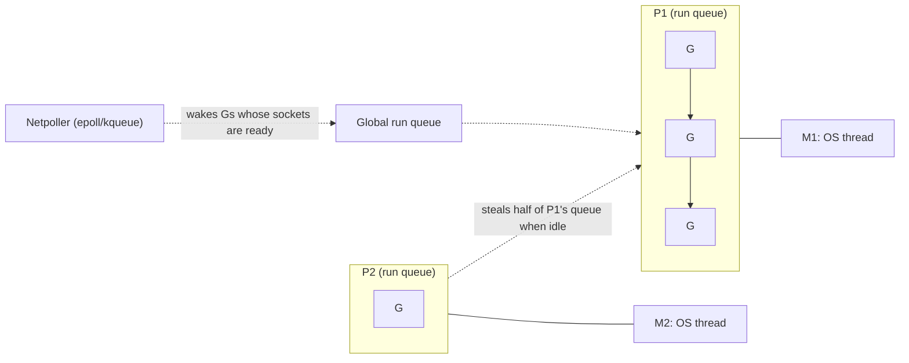

A request to your API must call 20 downstream services, return whatever has arrived within 150 ms, and stop waiting for the stragglers. With a thread per call that is 20 threads per request, a thread pool to bound them, futures, and careful timeout plumbing. With callbacks or promises it is concise but single-threaded, and cancelling the stragglers is up to each library. In Go it is about 25 lines: a goroutine per call, a channel for results and a context for the deadline. That fit, cheap concurrency with a boring deployment story (one static binary), is why so much of the cloud infrastructure you run is written in Go: Docker, Kubernetes, etcd, Prometheus and Terraform among them.

Go is deliberately small. Its minimalism hides mechanisms with sharp edges: goroutines that leak, `nil` errors that are not `nil`, slices that silently share memory, maps that crash the process. Knowing the mechanism behind each is what lets you review Go code, and what separates "I have used Go" from "I have run Go in production".

## Goroutines and the scheduler

A goroutine is a function scheduled by the Go runtime rather than the operating system. It starts with a 2 KiB stack that grows (by copying to a bigger allocation) when needed, so 100,000 idle goroutines cost roughly 200 MB of stack. An OS thread reserves megabytes of virtual stack and costs a system call to create, which is why nobody runs 100,000 threads.

The runtime multiplexes goroutines onto threads with the **G-M-P** model:

- **G**: a goroutine, its stack and its instruction pointer.
- **M**: an OS thread ("machine").
- **P**: a processor context holding a local run queue. There are `GOMAXPROCS` of them, by default the number of CPUs (recent Go versions also respect a container's CPU limit; older ones needed a library to do that).



Each M runs Gs from its P's queue. An idle P steals work from a busy one. A goroutine blocked on a network read is parked with the **netpoller** (epoll on Linux) and costs no thread at all; when the socket becomes readable the goroutine is made runnable again. A goroutine blocked in a system call (a file read) keeps its M, so the runtime hands the P to another M and keeps the CPUs busy. Since Go 1.14 the scheduler can also preempt a goroutine in a tight loop asynchronously, so one CPU-bound goroutine cannot starve the others: a real difference from Node and Tokio, where a long synchronous computation blocks everything sharing its thread.

The consequence for design: in Go you write straight-line blocking code (`resp, err := client.Do(req)`) and get the efficiency of an event loop, because the runtime turns your blocking call into a parked goroutine.

## Channels: synchronisation you can pass around

A channel is a typed, synchronised queue. Its behaviour depends on its state, and the table is worth memorising because three of the cells panic:

| Operation | nil channel | open channel | closed channel |
|---|---|---|---|
| `ch <- v` (send) | blocks forever | blocks until a receiver takes it (unbuffered) or there is buffer space | **panic** |
| `v, ok := <-ch` (receive) | blocks forever | blocks until a value arrives | drains the buffer, then returns the zero value with `ok == false` immediately |
| `close(ch)` | **panic** | succeeds | **panic** |

An unbuffered channel is a rendezvous: the sender waits until the receiver takes the value, and the send *happens-before* the receive completes, so everything the sender wrote before sending is visible to the receiver afterwards. A buffered channel of capacity `n` lets the sender run up to `n` values ahead, then blocks: it delays backpressure, it does not remove it.

```viz
{"type": "concurrency", "algorithm": "channels",
 "title": "Unbuffered versus buffered channels",
 "caption": "Phase 1 is Go's make(chan int): every send waits for a receiver. Phase 2 is make(chan int, 2): sends succeed until the buffer is full, then block. Closing lets the receiver drain what is left and then see ok == false."}
```

The ownership rule that prevents the panics: **only the sender closes, and only when no more sends can happen.** With several senders, a coordinator closes after a `sync.WaitGroup` says all are done. The worker pool below uses exactly that shape:

```go
func workerPool(jobs []int, workers int) int {
	in := make(chan int)
	out := make(chan int)
	var wg sync.WaitGroup
	for range workers {
		wg.Add(1)
		go func() {
			defer wg.Done()
			for j := range in { // ends when in is closed and drained
				out <- j * j
			}
		}()
	}
	go func() { // the single producer closes in
		for _, j := range jobs {
			in <- j
		}
		close(in)
	}()
	go func() { // the coordinator closes out once every worker has returned
		wg.Wait()
		close(out)
	}()
	sum := 0
	for v := range out {
		sum += v
	}
	return sum
}
```

`select` waits on several channel operations at once and runs whichever is ready first. Setting a channel variable to `nil` disables its case in a `select`, which is the idiom for "stop listening to this input once it is closed".

## Context, cancellation and the goroutine leak

Here is the fan-out from the opening, written correctly:

```go
func fetchAll(ctx context.Context, urls []string) []Result {
	ctx, cancel := context.WithTimeout(ctx, 150*time.Millisecond)
	defer cancel()

	results := make(chan Result, len(urls)) // buffered: a late sender never blocks
	for _, u := range urls {
		go func() {
			results <- fetch(ctx, u) // fetch must honour ctx
		}()
	}

	var out []Result
	for range urls {
		select {
		case r := <-results:
			out = append(out, r)
		case <-ctx.Done():
			return out // stragglers finish into the buffer and are garbage collected
		}
	}
	return out
}
```

The decisive detail is `len(urls)` in `make`. Make the channel unbuffered and every straggler that finishes after the timeout blocks forever on `results <-`, because nobody will ever receive. That is a **goroutine leak**: the goroutine, its stack and everything it references (response bodies, buffers) stay alive for the life of the process. The runtime's "all goroutines are asleep" detector will not save you, because in a server other goroutines are always running. At 1,000 requests per second with 5% of requests timing out on two slow backends, you leak 100 goroutines a second, about 8.6 million a day, and the service dies of memory in hours with no error in the logs.

Three habits prevent it. Give every goroutine a guaranteed exit path (a buffered channel, a `ctx.Done()` case, or a closed input). Export `runtime.NumGoroutine()` as a metric: a leak is a line that only goes up. And in tests, use a leak checker such as `goleak` that fails when goroutines outlive the test.

`context.Context` is how Go propagates cancellation and deadlines. The conventions: it is the first parameter, it is never stored in a struct, every `WithCancel`/`WithTimeout` is paired with `defer cancel()`, long loops check `ctx.Done()`, and outgoing calls pass it on so a deadline set at the edge bounds the whole call tree. For fan-out with error handling, `golang.org/x/sync/errgroup` wraps the pattern: `errgroup.WithContext` cancels the siblings when one fails, and `SetLimit` caps concurrency.

One historical trap is now closed: before Go 1.22, `for _, u := range urls` reused one variable `u` for every iteration, so goroutines capturing it could all see the last URL. Since 1.22 (governed by the `go` line in `go.mod`), each iteration gets a fresh variable. You will still meet the old workaround `u := u` in older code.

## Shared memory still has its place

The proverb says "do not communicate by sharing memory; share memory by communicating". In practice a mutex is often the simpler tool. A cache is a map behind a lock, not a goroutine with request and response channels:

```go
type Cache struct {
	mu sync.RWMutex
	m  map[string][]byte
}

func (c *Cache) Get(k string) ([]byte, bool) {
	c.mu.RLock()
	defer c.mu.RUnlock()
	v, ok := c.m[k]
	return v, ok
}
```

Use channels to transfer ownership of data or to signal events; use `sync.Mutex`, `sync.Once` and `sync/atomic` to protect state. Two facts every Go reviewer knows. First, Go maps are not safe for concurrent writes, and the runtime detects many such races and aborts the *whole process* with `fatal error: concurrent map writes`, which `recover` cannot catch. Second, the race detector (`go test -race`) instruments memory accesses and reports races that actually occur during the run; it slows execution several-fold, so it belongs in CI, not production. The mechanics of locks are in [races, mutexes and invariants](/learn/systems/concurrency/races-mutexes-and-invariants).

## Interfaces: implicit, small, and a nil trap

A Go type satisfies an interface by having its methods; there is no `implements` keyword. That inverts who defines interfaces: the *consumer* declares the small interface it needs, and any type with those methods fits, including types written before the interface existed. The standard library's `io.Reader` has one method, `Read(p []byte) (n int, err error)`, and files, sockets, gzip streams and HTTP bodies all satisfy it. The guidance "accept interfaces, return structs" follows: take the narrowest interface as a parameter, return the concrete type so callers keep its full API.

An interface value is a pair: a pointer to type information and a pointer to the data. It is `nil` only when *both* are nil. This produces Go's most famous bug:

```go
type NotFoundError struct{ Name string }

func (e *NotFoundError) Error() string { return e.Name + " not found" }

func find(name string) error {
	var err *NotFoundError // a nil pointer
	if name == "" {
		err = &NotFoundError{Name: "user"}
	}
	return err // BUG: a non-nil interface holding a nil pointer
}

func main() {
	if err := find("ana"); err != nil {
		fmt.Println("unexpected:", err) // runs, and prints "unexpected: <nil>"
	}
}
```

On the success path `find` returns an `error` whose type half is `*NotFoundError` and whose data half is nil. The comparison with `nil` checks both halves, so `err == nil` is false and the caller treats success as failure. The fix is to return the literal `nil` on success and never declare an error variable with a concrete pointer type.

Generics (since Go 1.18) add type parameters with constraints, such as `func Max[T cmp.Ordered](xs []T) T`. They are used mainly for containers and algorithms (`slices.Sort`, `maps.Keys`); interfaces remain the main abstraction for behaviour.

## Errors are values

Go has no exceptions for expected failures. A function returns an `error` as its last result and the caller checks it:

```go
u, err := store.User(ctx, id)
if err != nil {
	return fmt.Errorf("loading user %d: %w", id, err) // %w wraps, keeping the cause
}
```

Wrapping with `%w` builds a chain. `errors.Is(err, ErrNotFound)` walks it looking for a sentinel value; `errors.As(err, &target)` walks it looking for a type. Mapping domain errors to HTTP statuses happens once at the edge, the same design as this app's Rust `ApiError`:

```go
func statusFor(err error) int {
	var ve *ValidationError
	switch {
	case errors.Is(err, ErrNotFound):
		return http.StatusNotFound
	case errors.As(err, &ve):
		return http.StatusUnprocessableEntity
	default:
		return http.StatusInternalServerError
	}
}
```

The difference from Rust is what the compiler enforces. Go has no sum types, so nothing forces this `switch` to handle a newly added error kind; the `default` arm silently absorbs it. Rust's exhaustive `match` on `AppError` turns the same omission into a build failure. Go trades that guarantee for simplicity, and good Go codebases compensate with tests and linters (`errcheck`, `staticcheck`) that flag ignored errors.

`panic` is for programmer errors (nil dereference, impossible states). `net/http` recovers a panic inside a handler and logs it, so one bad request does not kill the server. A panic inside a goroutine *you* started has no such safety net and terminates the entire process. Any long-lived goroutine in a server needs its own `defer func() { if r := recover(); r != nil { ... } }()`, or better, code that does not panic.

`defer` runs at function exit in last-in-first-out order, and its arguments are evaluated when the `defer` statement runs, not when the deferred call runs. A `defer f.Close()` inside a loop over 10,000 files keeps all 10,000 open until the function returns; extract the loop body into a function.

## Memory: escape analysis and a GC tuned for latency

The compiler decides whether each value lives on the stack or the heap by **escape analysis**: if a pointer to it can outlive the function, it escapes to the heap. `go build -gcflags=-m` prints those decisions, and reducing escapes in a hot path is the first step of most Go performance work, because every heap allocation is future GC work.

Go's garbage collector is a concurrent, non-generational, non-moving tri-colour mark-sweep. It marks reachable objects while your goroutines keep running (a write barrier records pointer changes made during marking) and stops the world only for short phases, typically well under a millisecond. The price is paid in CPU (the collector aims to use about a quarter of `GOMAXPROCS` while marking) and in memory headroom.

```viz
{"type": "memory", "algorithm": "gc-mark-sweep",
 "title": "Mark from the roots, sweep the rest",
 "caption": "Go performs these two phases concurrently with your program instead of pausing it, but the logic is the same: reachable from a root means live, everything else is reclaimed, cycles included."}
```

Two knobs matter. `GOGC` (default 100) lets the heap grow to about twice the live heap before the next cycle: a service with 600 MiB live can reach about 1.2 GiB, which is an OOM kill in a 1 GiB container. `GOMEMLIMIT` (since Go 1.19) sets a soft memory ceiling so the collector works harder as the heap approaches it; set it to roughly 90% of the container limit. Lower `GOGC` means more CPU on GC and less memory; higher means the reverse.

Slices are the other memory trap. A slice is a three-word header (pointer, length, capacity) over a shared backing array:

```go
a := make([]int, 3, 4) // len 3, cap 4: [0 0 0 _]
b := append(a, 1)      // fits in the capacity: b shares a's backing array
c := append(a, 2)      // also fits: writes the same slot b uses
fmt.Println(b[3], c[3]) // 2 2
```

`append` reallocates only when capacity runs out, so whether two slices alias depends on a runtime number. Treat any slice you did not allocate as possibly shared, and copy (`slices.Clone`) before mutating or appending to one you received. Relatedly, keeping a 10-byte sub-slice of a 10 MB buffer keeps the whole 10 MB alive.

## When Go wins, and when it does not

| Need | Go | Better alternative |
|---|---|---|
| Network services, proxies, many concurrent connections | Excellent: blocking-style code, netpoller efficiency | |
| Infrastructure tools, CLIs, Kubernetes operators | Excellent: single static binary, fast builds, huge ecosystem | |
| Rich domain models with many states | Weak: no sum types, no exhaustive matching | Rust, Kotlin, TypeScript |
| Hard tail-latency budgets under memory pressure | Good, not perfect: short GC pauses but GC CPU and headroom | Rust, C++ |
| Data science and ML | Weak ecosystem | Python |
| Large enterprise systems with mature frameworks | Adequate | JVM (Spring, Kafka clients, tooling) |

In a coding interview Go works but costs keystrokes. There is no built-in set (use `map[T]struct{}`), no generic heap convenience (`container/heap` requires a type with five methods: `Len`, `Less`, `Swap`, `Push`, `Pop`), and integer overflow wraps silently. Recent versions help: `slices.Sort`, `slices.Contains`, `min`/`max` built-ins and `for i := range n`. If Go is your interview language, have the five-method heap in muscle memory. The [actors, channels and CSP](/learn/systems/concurrency/actors-channels-and-csp) lesson places Go's model among the alternatives.

## Senior signals

- You give every goroutine a guaranteed exit path and can point at the line (buffer size, `ctx.Done()` case, `close`) that provides it.
- You propagate `context.Context` everywhere and set deadlines at the edge, so one slow dependency cannot hold resources indefinitely.
- You know the interface nil trap, the slice aliasing trap and the concurrent-map-write crash, and you look for them in review.
- You reach for a mutex for shared state and a channel for ownership transfer or signalling, instead of forcing everything through channels.
- You set `GOMEMLIMIT` in containers and can explain why `GOGC=100` doubles the heap before collecting.
- You choose Go for concurrency-heavy services and tooling, and name its weak spot: no compiler-enforced exhaustive handling of domain states.

## Check yourself

```quiz
- q: >-
    `find` declares `var err *NotFoundError` and returns it on the success path. The caller writes `if err := find("ana"); err != nil`. What happens?
  options: ["It fails to compile, because a *NotFoundError cannot be returned as an error", "The condition is false, because a nil pointer converted to error is still nil", "The return statement panics, because it dereferences a nil pointer to build the error", "The condition is true, because the interface's type word is set to *NotFoundError"]
  answer: 3
  explanation: >-
    An interface is nil only when both its type and data words are nil. Converting a typed nil pointer to `error` fills in the type word, so the returned interface is non-nil even though the pointer inside is nil. Nothing is dereferenced and it compiles fine; return the literal nil on success.
- q: >-
    You change fetchAll's results channel to unbuffered and keep the early return on timeout. In production, what happens to requests that time out?
  options: ["The stragglers are cancelled automatically when fetchAll returns early", "Late results are dropped and the goroutines exit once their sends fail", "The runtime panics with 'all goroutines are asleep', crashing the server", "Each straggler blocks forever on its send, leaking its goroutine"]
  answer: 3
  explanation: >-
    Nobody will ever receive from the channel, so every late send blocks permanently, leaking the goroutine and everything it references. The deadlock detector only fires when every goroutine is blocked, which never happens in a busy server, so memory just grows. Returning does not cancel anything unless the goroutines watch a context.
- q: >-
    Two goroutines write to the same Go map without a lock. What is the realistic outcome?
  options: ["Last write wins, because each map assignment is a single atomic store", "Nothing goes wrong, because Go maps are internally synchronised by the runtime", "Some values are corrupted, but the process keeps running normally", "The runtime may abort the whole process with a fatal 'concurrent map writes' error"]
  answer: 3
  explanation: >-
    The runtime checks for concurrent map writes and throws a fatal error, which is not a panic and cannot be caught by recover, so the whole process dies. Maps are not synchronised; protect the map with a mutex or use a structure designed for concurrent access.
- q: >-
    A Go service with about 600 MiB of live heap runs in a 1 GiB container with default settings and is periodically OOM-killed. Which explanation and fix fit?
  options: ["The old generation overflows before promotion; raise the young generation size instead", "Go ignores cgroup memory limits, so only a bigger container limit will help here", "Goroutine stacks are never returned to the OS; restart the service on a nightly schedule", "The heap may grow to twice the live size before GC; set GOMEMLIMIT near the limit"]
  answer: 3
  explanation: >-
    Go's collector is not generational. With the default GOGC=100 the pacer targets live × (1 + GOGC/100), about 1.2 GiB here, above the 1 GiB container limit. GOMEMLIMIT adds a soft ceiling that makes the collector work harder as memory approaches the limit.
- q: >-
    `a := make([]int, 3, 4); b := append(a, 1); c := append(a, 2)`. What is `b[3]`?
  options: ["1", "0", "2", "It panics with index out of range"]
  answer: 2
  explanation: >-
    Both appends fit in a's spare capacity, so b and c share one backing array and the second append overwrites the slot the first wrote. Aliasing depends on capacity, which is why you copy slices you did not allocate before appending.
- q: >-
    For which of these would a senior engineer be most cautious about choosing Go?
  options: ["A proxy that holds 50,000 concurrent connections with tight latency needs", "A Kubernetes operator that reconciles custom resources across clusters", "A pricing engine with dozens of states where a missed case is costly", "A CLI tool that must be distributed to users as a single static binary"]
  answer: 2
  explanation: >-
    Go lacks sum types and exhaustive matching, so adding a new state does not force every switch to handle it. Rust, Kotlin sealed classes or TypeScript discriminated unions give that guarantee. CLIs, high-connection proxies and Kubernetes operators are Go's home ground.
```
