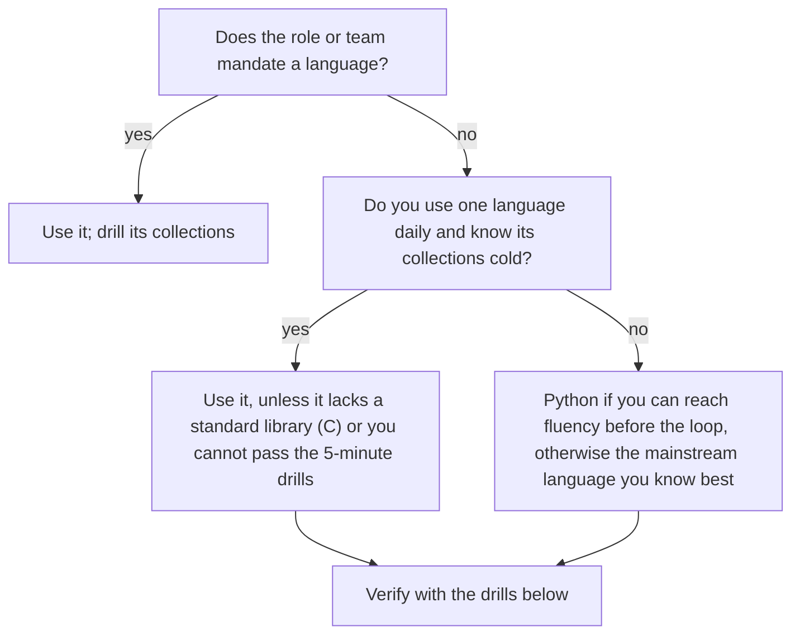

A 45-minute coding round contains about 30 minutes of actual coding. If your language costs you 30 seconds every time you reach for an idiom (the heap API, a comparator, a type the compiler rejects), six of those moments cost three minutes: ten percent of the round, and usually the follow-up question you never reach. An engineer who writes Java every day but interviews in Python "because it is shorter" can lose more to unfamiliarity than they save in keystrokes. The reverse is also common: a fluent Python programmer who picks Java for a Java shop spends the round wrestling generics.

The choice is an optimisation with measurable inputs: what the role requires, how fluent you are, how much the language's standard library does for you, and which traps it sets. This lesson gives you the inputs, the toolkit to have in your fingers, and a plan for switching languages without damaging a loop.

## What interviewers actually expect

Most large companies let you use any mainstream language in general coding rounds. The rubric measures problem solving, correctness, code quality, testing and communication. Nobody deducts points for choosing Python over Java. But fluency is visible within minutes: whether you write idiomatic code, whether you know the cost of the library calls you make, and whether you stop to look things up.

The language is constrained in three situations. Domain roles expect the domain's language (Swift or Kotlin for mobile, C++ for low-latency systems, TypeScript for frontend). Some teams run practical rounds in their production stack. And some companies' online assessments support a fixed list. Your recruiter will tell you which applies if you ask; always ask.

At the senior bar the language also becomes a topic. Interviewers follow up on what you chose: "what does that `sort` cost?", "how would you make this cache thread-safe in Java?", "why does this recursion fail at n = 100,000?". Pick Rust and expect ownership questions; pick Go and expect goroutine-leak questions. Choose a language whose runtime you can explain, which is what the other lessons in this module prepare you for.

## The trade-offs, measured

| | Python | Java | C++ | JavaScript / TS | Go | Rust |
|---|---|---|---|---|---|---|
| Verbosity | Lowest | High | Medium | Low | Medium to high | High |
| Heap | `heapq` (min, functions on a list) | `PriorityQueue` | `priority_queue` (max by default) | None | `container/heap` (implement 5 methods) | `BinaryHeap` (max) |
| Ordered map | None (bisect on a sorted list) | `TreeMap` | `std::map` | None | None | `BTreeMap` |
| Deque | `collections.deque` | `ArrayDeque` | `std::deque` | None (`shift()` is O(n)) | None (slice with a head index) | `VecDeque` |
| Integer overflow | Never (arbitrary precision) | Wraps silently | Undefined behaviour (signed) | Precision loss beyond 2^53 | Wraps silently | Panics in debug, wraps in release |
| Signature trap | Recursion limit, raw speed | `==` on boxed `Integer`, comparator overflow | Undefined behaviour, iterator invalidation | Lexicographic default `sort()`, no heap | Boilerplate, no set type | Borrow checker on trees and graphs |

Two rows decide most choices. **Ordered structures**: if a problem needs "the largest key at most x" with inserts, Java's `TreeMap.floorKey` and C++'s `std::map::upper_bound` are one call, while Python and JavaScript need a workaround (a sorted list with bisect, or an explanation that you would use a balanced tree). **Heaps**: JavaScript has none, so any Dijkstra, top-k or scheduling problem starts with writing one.



A practical test of readiness: can you write each of these from memory, correctly, in under five minutes? A heap-based Dijkstra, BFS on a grid, union-find with path compression, a trie, binary search on the answer, and an LRU cache. If yes, the language is ready. If not, that list is your practice plan.

## The toolkit you must know cold

The same five operations recur across most interview problems: count frequencies, maintain a heap of (priority, item), sort by two keys, run a FIFO queue, and find the largest key at most x.

```python
counts = Counter(items)
heapq.heappush(heap, (dist, node)); dist, node = heapq.heappop(heap)
people.sort(key=lambda p: (-p.score, p.name))
q = deque([start]); x = q.popleft()
i = bisect_right(keys, x) - 1           # floor via a sorted list; -1 means none
```

```java
for (String s : items) counts.merge(s, 1, Integer::sum);
PriorityQueue<int[]> heap = new PriorityQueue<>((a, b) -> Integer.compare(a[0], b[0]));
people.sort(Comparator.comparingInt(Person::score).reversed().thenComparing(Person::name));
Deque<Integer> q = new ArrayDeque<>(); q.offer(start); int x = q.poll();
Map.Entry<Integer, String> floor = byTime.floorEntry(x);   // null means none
```

```javascript
for (const s of items) counts.set(s, (counts.get(s) ?? 0) + 1);
// heap: write one (below)
people.sort((a, b) => b.score - a.score || (a.name < b.name ? -1 : a.name > b.name ? 1 : 0));
const q = [start]; let head = 0; const x = q[head++];   // index pointer, because shift() is O(n)
// floor: binary search over a sorted array
```

For Go, C++ and Rust the equivalents are `map[string]int` with `counts[s]++`, `container/heap` over a type with `Len`, `Less`, `Swap`, `Push` and `Pop`, `sort.Slice` with a two-key closure, a slice queue with a head index; `unordered_map`, `priority_queue` with `greater<>` for a min-heap, `std::sort` with a lambda, `std::queue`, `std::map::upper_bound` then step back; and `HashMap` with `*counts.entry(s).or_insert(0) += 1`, `BinaryHeap` with `Reverse`, `sort_by` with `cmp().then_with()`, `VecDeque`, `BTreeMap::range(..=x).next_back()`.

## The JavaScript heap you should write in three minutes

If you interview in JavaScript or TypeScript, have this memorised. It is the only substantial piece of infrastructure the language makes you bring.

```javascript
class MinHeap {
  constructor(less = (a, b) => a < b) { this.a = []; this.less = less; }
  get size() { return this.a.length; }
  peek() { return this.a[0]; }
  push(x) {
    const a = this.a;
    a.push(x);
    let i = a.length - 1;
    while (i > 0) {
      const p = (i - 1) >> 1;
      if (!this.less(a[i], a[p])) break;
      [a[i], a[p]] = [a[p], a[i]];
      i = p;
    }
  }
  pop() {
    const a = this.a, top = a[0], last = a.pop();
    if (a.length > 0) {
      a[0] = last;
      let i = 0;
      for (;;) {
        const l = 2 * i + 1, r = l + 1;
        let m = i;
        if (l < a.length && this.less(a[l], a[m])) m = l;
        if (r < a.length && this.less(a[r], a[m])) m = r;
        if (m === i) break;
        [a[i], a[m]] = [a[m], a[i]];
        i = m;
      }
    }
    return top;
  }
}
```

Pass a comparator for compound priorities: `new MinHeap((x, y) => x[0] < y[0] || (x[0] === y[0] && x[1] < y[1]))`. When `n` is small (a few thousand), saying "I will sort instead of writing a heap; that is O(n log n) and fine here, and I can write the heap if you want the streaming version" is a legitimate senior move: it shows you know both the cost and the trade-off.

```viz
{"type": "heap", "algorithm": "push-pop", "values": [5, 3, 8, 1, 9, 2], "kind": "min",
 "title": "What your hand-written heap must do",
 "caption": "Push appends and sifts up while the child beats its parent; pop moves the last element to the root and sifts down toward the smaller child. Both walk one root-to-leaf path, so both are O(log n)."}
```

## Switching languages safely

Switching is worth it when your current language has no usable standard library, when you are not fluent in any language (common for engineers who work mostly in configuration, SQL or a niche language), or when a role mandates it. It is rarely worth it three weeks before an onsite.

A plan that works in about six weeks at five to seven hours a week:

1. **Weeks 1 and 2: translate.** Re-solve 20 problems you already solved in your old language. The algorithm is known, so all the friction you feel is language friction. Write every idiom you had to look up onto a one-page cheat sheet.
2. **Weeks 3 and 4: produce.** Solve 30 new problems in the new language against a timer, covering every pattern family. Re-drill the five-minute list above until each item is automatic.
3. **Weeks 5 and 6: perform.** Do at least three mock interviews out loud in the new language. Mocks surface the failure that solo practice hides: going silent while you remember an API.

If you blank on an API during a real interview, do not spend three minutes guessing. Say what you need and move on: "I want a min-heap push here; in Python that is `heapq.heappush`, and I will double-check the argument order when we test". Most interviewers will simply confirm it. Writing a clearly named helper stub and continuing is better than stalling.

## Follow-ups to prepare for your language

| If you choose | Expect to be asked |
|---|---|
| Python | How `dict` works and when it degrades, the GIL, recursion limits, why the solution is slow at n = 10^6 |
| Java | `HashMap` internals and the `equals`/`hashCode` contract, boxing costs, thread safety of collections, GC |
| JavaScript / TS | The event loop, closures, `this`, number precision, how you would type the function |
| Go | Goroutine leaks, channel semantics, the nil interface trap |
| C++ | Move semantics, iterator invalidation, undefined behaviour, RAII |
| Rust | Ownership and borrowing, why trees are awkward, `Rc<RefCell<T>>` |

Each language lesson in this module ([Rust](/learn/senior-craft/languages-for-senior-engineers/rust-essentials), [Go](/learn/senior-craft/languages-for-senior-engineers/go-essentials), [TypeScript](/learn/senior-craft/languages-for-senior-engineers/typescript-deep-dive), [Python](/learn/senior-craft/languages-for-senior-engineers/python-idioms-for-interviews), [JVM](/learn/senior-craft/languages-for-senior-engineers/jvm-essentials)) ends with exactly these. For rounds where an AI assistant is allowed, the language matters less for typing and more for reading generated code critically; see [the AI-native interview](/learn/ai-assisted-engineering/senior-engineering-with-ai/the-ai-native-interview). For the minute-by-minute execution of the round itself, see [the 45-minute protocol](/learn/interview-patterns/interview-execution/the-45-minute-protocol).

## Beyond the coding round

Language knowledge shows up in the other rounds too, in a different form. In **system design**, nobody wants syntax; they want runtime consequences. Proposing a Go service for a proxy that holds 50,000 idle connections is a strong choice if you can say why (goroutines parked on the netpoller cost kilobytes, not a thread each). Proposing a JVM service for a latency-critical path invites "what about GC pauses?", and the senior answer names a collector, a heap size and an allocation budget rather than waving the question away. Proposing Python for a CPU-heavy pipeline invites the GIL question.

In **behavioural** rounds, language decisions are some of the best senior stories you have, because they are trade-offs with long consequences: the team that moved a hot path from Python to Go and had to retrain on-call, the migration you argued *against* because the hiring pool and tooling cost more than the latency win, the TypeScript adoption you phased in with `allowJs` rather than a big-bang rewrite. A story about choosing a technology is really a story about leading a decision, which the [technical leadership](/learn/senior-craft/technical-leadership/leading-without-authority) module covers.

## Exercise

This problem needs a priority queue in any language, so it is a direct test of whether your interview language is ready. Python has `heapq`; in JavaScript you will write the heap above.

```exercise
id: shortest-job-scheduler
title: Shortest-job-first scheduler
prompt: |
  `jobs[i] = [arrival, duration]`. A single worker starts at time 0 and
  processes one job at a time without interruption. Whenever the worker is
  free, it starts the job with the shortest duration among jobs that have
  already arrived (arrival <= current time), breaking ties by the smaller
  index. If no job has arrived, the worker idles until the next arrival.

  Return the indices of the jobs in the order they are started.
  `jobs` is not necessarily sorted by arrival. Aim for O(n log n).
languages: [python, javascript]
entry: schedule_jobs
starter:
  python: |
    import heapq

    def schedule_jobs(jobs):
        # your code here
        return []
  javascript: |
    function schedule_jobs(jobs) {
      // You will need a min-heap ordered by (duration, index).
      return [];
    }
tests:
  - args: [[[1, 2], [2, 4], [3, 2], [4, 1]]]
    expected: [0, 2, 3, 1]
  - args: [[[7, 10], [7, 12], [7, 5], [7, 4], [7, 2]]]
    expected: [4, 3, 2, 0, 1]
    label: everything arrives at once
  - args: [[]]
    expected: []
    label: no jobs
  - args: [[[5, 3]]]
    expected: [0]
    label: single job arriving later than time 0
  - args: [[[0, 1], [10, 2], [10, 1]]]
    expected: [0, 2, 1]
    label: worker idles until the next arrival
  - args: [[[0, 3], [1, 2], [1, 2], [2, 1]]]
    expected: [0, 3, 1, 2]
    hidden: true
    label: equal durations break ties by index
  - args: [[[5, 1], [0, 4], [2, 1]]]
    expected: [1, 2, 0]
    hidden: true
    label: input not sorted by arrival
hints:
  - "Sort the job indices by arrival once. Keep a pointer into that order and a heap of arrived jobs keyed by (duration, index)."
  - "Each step: if the heap is empty and the next job has not arrived, jump the clock to its arrival. Push every job with arrival <= clock, pop one, advance the clock by its duration."
  - "In JavaScript, give your heap the comparator (x, y) => x[0] < y[0] || (x[0] === y[0] && x[1] < y[1])."
```

## Senior signals

- You choose the interview language on evidence (fluency drills, standard-library fit, role requirements), not on which language is "shortest".
- You know your language's collections cold, including the ordered-map and heap story, and the cost of every call you make.
- You know your language's signature traps (overflow, boxing, lexicographic sort, recursion limits) and test for them on purpose.
- When an API slips your mind you name what you need and keep moving instead of stalling.
- You can discuss the runtime you chose (memory model, GC, concurrency) when the interviewer follows up.
- You do not switch languages in the final weeks before a loop.

## Check yourself

```quiz
- q: >-
    You have written Java daily for five years but have solved only a handful of problems in Python. Your onsite is in three weeks and nothing mandates a language. What is the strongest choice?
  options: ["Rust, because an unusual choice signals depth and helps you stand out", "Python, because its shorter solutions leave more time for testing", "Whichever language the interviewer uses, so they can follow your code", "Java, because your fluency outweighs Python's brevity on this timeline"]
  answer: 3
  explanation: >-
    Brevity only pays when the idioms are automatic. Three weeks is not enough to make Python fluent, while Java's TreeMap, PriorityQueue and ArrayDeque are already in your fingers. The interviewer's own language does not matter for general rounds, and an unfamiliar language adds risk rather than signal.
- q: >-
    In JavaScript you implement BFS with `queue.shift()` on a grid of 1,000 × 1,000 cells. What is the risk?
  options: ["None, because modern engines make shift() O(1) for arrays of any size", "The array cannot hold a million elements, so pushes start to fail", "shift() is O(n) in general, so BFS can degrade toward quadratic time", "BFS needs a priority queue, so the visit order will be wrong"]
  answer: 2
  explanation: >-
    Removing the first element shifts the rest in the general case, and engines do not guarantee otherwise. With up to a million entries that can be catastrophic. A head index into the array, or a ring buffer, keeps each dequeue O(1).
- q: >-
    A Java candidate writes the heap comparator `(a, b) -> a[0] - b[0]`. Which input breaks it?
  options: ["Arrays with duplicate first elements, where the comparator returns zero for both", "An empty heap, where the comparator is called on null array references", "Integer.MAX_VALUE with a negative number, where the subtraction overflows", "More than 2^16 elements, where the comparator's result is truncated"]
  answer: 2
  explanation: >-
    MAX_VALUE - (-5) overflows to a negative number, so the comparator reports MAX_VALUE as smaller and inverts the order. Integer.compare avoids the arithmetic entirely. Returning zero for equal keys is correct behaviour, and an empty heap never calls the comparator.
- q: >-
    Your interview problem needs "the largest timestamp at most t" with interleaved inserts, and you are using Python. What is the best response?
  options: ["Use a dict and scan every key on each query, since n is probably small", "Use heapq, whose smallest-first order answers floor queries directly", "Use bisect on a sorted list and state that each insert costs O(n)", "Switch to Java mid-interview to get TreeMap's floorKey in O(log n)"]
  answer: 2
  explanation: >-
    Python's standard library has no ordered map. Using bisect, naming its O(n) insert cost from list shifting, and saying a balanced tree or sortedcontainers would make inserts O(log n) shows you know the trade-off. A heap only exposes its minimum, so it cannot answer floor queries, and a silent linear scan hides the cost.
- q: >-
    Mid-interview you forget the exact name of the method you need. What does a senior candidate do?
  options: ["Switch to a brute-force approach that avoids needing the method at all", "Spend a few minutes recalling it, since exact API knowledge is part of the score", "Say what the call does, write a best guess, and check it during testing", "Ask to restart in another language whose standard library you know better"]
  answer: 2
  explanation: >-
    Interviewers assess problem solving and communication, not recall of method names. Naming the intent and writing a best guess or a clearly named helper keeps momentum, and most interviewers will simply confirm the API.
```
