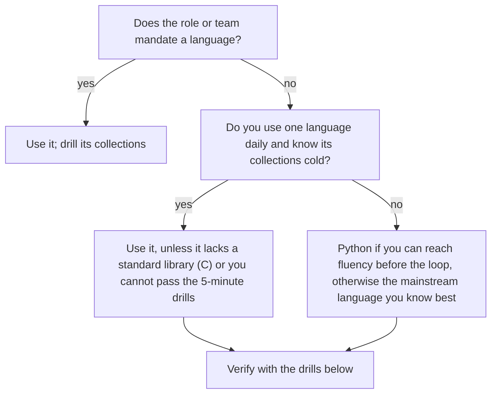

A 45-minute coding round contains about 30 minutes of actual coding. If your language costs you 30 seconds every time you reach for an idiom (the heap API, a comparator, a type the compiler rejects), six of those moments cost three minutes: ten percent of the round, and usually the follow-up question you never reach. An engineer who writes Java every day but interviews in Python "because it is shorter" can lose more to unfamiliarity than they save in keystrokes. The reverse is also common: a fluent Python programmer who picks Java for a Java shop spends the round wrestling generics.

The choice is an optimisation with measurable inputs: what the role requires, how fluent you are, how much the standard library does for you, how fast the result runs, and which traps the language sets. This lesson measures those inputs on one problem written six times, gives you the toolkit to have in your fingers, and a plan for switching languages without damaging a loop.

## What interviewers actually expect

Most large companies let you use any mainstream language in general coding rounds. The rubric measures problem solving, correctness, code quality, testing and communication; nobody deducts points for choosing Python over Java. But fluency is visible within minutes: whether you write idiomatic code, whether you know the cost of the calls you make, and whether you stop to look things up.

The language is constrained in three situations. Domain roles expect the domain's language (Swift or Kotlin for mobile, C++ for low-latency systems, TypeScript for frontend). Some teams run practical rounds in their production stack. And some online assessments support a fixed list. Ask your recruiter which applies; they will tell you.

At the senior bar the language also becomes a topic. Interviewers follow up on what you chose: "what does that `sort` cost?", "how would you make this cache thread-safe in Java?", "why does this recursion fail at n = 100,000?". Pick Rust and expect ownership questions; pick Go and expect goroutine-leak questions. Choose a language whose runtime you can explain, which is what the other lessons in this module prepare you for.

## One problem, six languages, measured

The problem is this lesson's exercise: a single worker runs jobs shortest-first among those that have arrived, breaking ties by index, idling until the next arrival when nothing is waiting. It needs a sort, a priority queue with a two-part key, and careful loop control, which is a fair sample of what a medium interview problem asks of a language. Each version below was written the way a fluent candidate would write it in an interview, run on the same 1,000,000 jobs generated by the same 32-bit linear congruential generator, and checked by an identical checksum of the output order (344397565 in every language). Times are the solve function only, three runs each, on a Ryzen 9 9950X3D under WSL2: CPython 3.14.7, Node 24.21, Go 1.27.1, `rustc 1.98.1 -O`, OpenJDK 21.0.12 and g++ 13.3 with `-O2`.

| Language | Lines you write | What those lines include | Time at n = 10⁶ | Time at n = 10⁵ |
|---|---|---|---|---|
| Python | 14 | `sorted` with a key, `heapq` with tuples | 2,851–2,941 ms | 106 ms |
| JavaScript | 49 | 32 lines of hand-written heap, then 17 of solution | 1,229–1,258 ms | 81 ms |
| Go | 38 | 18 lines for the five `container/heap` methods, then 20 | 485–498 ms | 35 ms |
| Java | 21 | `Integer[]` sort with a comparator, `PriorityQueue<int[]>` | 766–790 ms | 69 ms |
| C++ | 22 | `stable_sort`, `priority_queue` with `greater<>` | 157–166 ms | 13 ms |
| Rust | 21 | `sort_by_key`, `BinaryHeap<Reverse<(i64, usize)>>` | 142–157 ms | 8 ms |

Read the table in two directions. **Down the time column**, the spread is a factor of 20, from Rust to Python. **Across the rows**, the spread that matters in an interview is lines: Python's 14 against JavaScript's 49 is 35 lines you type, test and can get wrong while the clock runs. Interview inputs are usually sized so that any reasonable complexity passes in any mainstream language; at n = 10⁵ the slowest version finished in about a tenth of a second. Runtime decides the language only when the platform's time limit is tight and does not scale per language, which you can ask about.

The Rust version, as a sample of what "21 lines" looks like when the standard library has everything:

```rust
fn schedule_jobs(jobs: &[(i64, i64)]) -> Vec<usize> {
    let mut order: Vec<usize> = (0..jobs.len()).collect();
    order.sort_by_key(|&i| jobs[i].0);
    let mut heap = BinaryHeap::new();
    let mut out = Vec::with_capacity(jobs.len());
    let (mut t, mut k) = (0i64, 0usize);
    while k < order.len() || !heap.is_empty() {
        if heap.is_empty() && jobs[order[k]].0 > t {
            t = jobs[order[k]].0;
        }
        while k < order.len() && jobs[order[k]].0 <= t {
            let i = order[k];
            heap.push(Reverse((jobs[i].1, i)));
            k += 1;
        }
        let Reverse((d, i)) = heap.pop().unwrap();
        out.push(i);
        t += d;
    }
    out
}
```

And the part of the Go version that exists only because `container/heap` needs a type with five methods, before any of the solution is written:

```go
type item struct{ dur, idx int }
type jobHeap []item

func (h jobHeap) Len() int { return len(h) }
func (h jobHeap) Less(i, j int) bool {
	return h[i].dur < h[j].dur || (h[i].dur == h[j].dur && h[i].idx < h[j].idx)
}
func (h jobHeap) Swap(i, j int) { h[i], h[j] = h[j], h[i] }
func (h *jobHeap) Push(x any)   { *h = append(*h, x.(item)) }
func (h *jobHeap) Pop() any {
	old := *h
	it := old[len(old)-1]
	*h = old[:len(old)-1]
	return it
}
```

## Under the hood: where each runtime spent its time

The same algorithm, O(n log n) everywhere, ran at six different speeds. The differences are the runtime mechanisms the other lessons in this module teach, and naming them is exactly the follow-up answer an interviewer wants.

- **Rust and C++**: the heap stores `(duration, index)` pairs inline in one contiguous array and compares them with inlined code; there is no allocation per entry and no indirect call. The [Rust lesson](/learn/senior-craft/languages-for-senior-engineers/rust-essentials) shows why generics compile to this.
- **Go**: `heap.Push(h, item{...})` takes an `any`, so every push converts the struct to an interface, which escapes to the heap, and every `Less` is a call through an interface; about 3 times Rust's time. The [Go lesson](/learn/senior-craft/languages-for-senior-engineers/go-essentials) reads that allocation in `-gcflags=-m` output.
- **Java**: every heap entry is a separate `int[]` object and the sort works on `Integer[]` with a lambda comparator, so the run is dominated by allocation and pointer chasing. Repeating the call in the same JVM ran at 620 to 710 ms, so JIT warm-up explains little of the gap; boxing does. The [JVM lesson](/learn/senior-craft/languages-for-senior-engineers/jvm-essentials) measures what boxed collections cost.
- **JavaScript**: V8 compiles the hand-written heap well, but each entry is a two-element array object and every comparison calls a closure.
- **Python**: `heapq` and `sorted` run in C, which is why Python was only 20 times slower than Rust rather than 50; each push still allocates a tuple and the loop around it is interpreted. The [Python lesson](/learn/senior-craft/languages-for-senior-engineers/python-idioms-for-interviews) budgets that loop at millions of iterations a second.

## The trade-offs, per language

| | Python | Java | C++ | JavaScript / TS | Go | Rust |
|---|---|---|---|---|---|---|
| Lines for the benchmark | 14 | 21 | 22 | 49 | 38 | 21 |
| Heap | `heapq` (min; max API from 3.14) | `PriorityQueue` | `priority_queue` (max by default) | None | `container/heap` (5 methods) | `BinaryHeap` (max) |
| Ordered map | None (bisect on a sorted list) | `TreeMap` | `std::map` | None | None | `BTreeMap` |
| Deque | `collections.deque` | `ArrayDeque` | `std::deque` | None (`shift()` is O(n) on large arrays) | None (slice with a head index) | `VecDeque` |
| Integer overflow | Never (arbitrary precision) | Wraps silently | Undefined behaviour (signed) | Precision loss beyond 2⁵³ | Wraps silently | Panics in debug, wraps in release |
| Signature trap | Recursion limit, interpreter speed | `==` on boxed `Integer`, comparator overflow | Undefined behaviour, iterator invalidation | Lexicographic default `sort()` | Boilerplate, no set type | Borrow checker on trees and graphs |

Two rows decide most choices. **Ordered structures**: if a problem needs "the largest key at most x" with inserts, Java's `TreeMap.floorKey` and C++'s `std::map::upper_bound` are one call, while Python and JavaScript need a workaround (a sorted list with bisect, or an explanation that you would use a balanced tree). **Heaps**: JavaScript has none, so any Dijkstra, top-k or scheduling problem starts with writing one, which is 32 of the 49 lines above.



A practical test of readiness: can you write each of these from memory, correctly, in under five minutes? A heap-based Dijkstra, BFS on a grid, union-find with path compression, a trie, binary search on the answer, and an LRU cache. If yes, the language is ready. If not, that list is your practice plan.

## The toolkit you must know cold

The same five operations recur across most interview problems: count frequencies, maintain a heap of (priority, item), sort by two keys, run a FIFO queue, and find the largest key at most x.

```python
counts = Counter(items)
heapq.heappush(heap, (dist, node)); dist, node = heapq.heappop(heap)
people.sort(key=lambda p: (-p.score, p.name))
q = deque([start]); x = q.popleft()
i = bisect_right(keys, x) - 1           # floor via a sorted list; -1 means none
```

```java
for (String s : items) counts.merge(s, 1, Integer::sum);
PriorityQueue<int[]> heap = new PriorityQueue<>((a, b) -> Integer.compare(a[0], b[0]));
people.sort(Comparator.comparingInt(Person::score).reversed().thenComparing(Person::name));
Deque<Integer> q = new ArrayDeque<>(); q.offer(start); int x = q.poll();
Map.Entry<Integer, String> floor = byTime.floorEntry(x);   // null means none
```

```javascript
for (const s of items) counts.set(s, (counts.get(s) ?? 0) + 1);
// heap: write one (below)
people.sort((a, b) => b.score - a.score || (a.name < b.name ? -1 : a.name > b.name ? 1 : 0));
const q = [start]; let head = 0; const x = q[head++];   // index pointer, because shift() is O(n)
// floor: binary search over a sorted array
```

For Go, C++ and Rust the equivalents are `map[string]int` with `counts[s]++`, `container/heap` over a type with `Len`, `Less`, `Swap`, `Push` and `Pop`, `slices.SortFunc` with a two-key comparison, a slice queue with a head index; `unordered_map`, `priority_queue` with `greater<>` for a min-heap, `std::sort` with a lambda, `std::queue`, `std::map::upper_bound` then step back; and `HashMap` with `*counts.entry(s).or_insert(0) += 1`, `BinaryHeap` with `Reverse`, `sort_by` with `cmp().then_with()`, `VecDeque`, `BTreeMap::range(..=x).next_back()`.

## The JavaScript heap you should write in three minutes

If you interview in JavaScript or TypeScript, have this memorised. It is the only substantial piece of infrastructure the language makes you bring.

```javascript
class MinHeap {
  constructor(less = (a, b) => a < b) { this.a = []; this.less = less; }
  get size() { return this.a.length; }
  peek() { return this.a[0]; }
  push(x) {
    const a = this.a;
    a.push(x);
    let i = a.length - 1;
    while (i > 0) {
      const p = (i - 1) >> 1;
      if (!this.less(a[i], a[p])) break;
      [a[i], a[p]] = [a[p], a[i]];
      i = p;
    }
  }
  pop() {
    const a = this.a, top = a[0], last = a.pop();
    if (a.length > 0) {
      a[0] = last;
      let i = 0;
      for (;;) {
        const l = 2 * i + 1, r = l + 1;
        let m = i;
        if (l < a.length && this.less(a[l], a[m])) m = l;
        if (r < a.length && this.less(a[r], a[m])) m = r;
        if (m === i) break;
        [a[i], a[m]] = [a[m], a[i]];
        i = m;
      }
    }
    return top;
  }
}
```

Pass a comparator for compound priorities: `new MinHeap((x, y) => x[0] < y[0] || (x[0] === y[0] && x[1] < y[1]))`. When `n` is small (a few thousand), saying "I will sort instead of writing a heap; that is O(n log n) and fine here, and I can write the heap if you want the streaming version" is a legitimate senior move: it shows you know both the cost and the trade-off. The queue deserves the same care: in Node 24, draining an array with `shift()` cost 31 ns per call at 10,000 elements but 2.1 µs at 100,000 and 4.8 µs at 200,000, a quadratic drain; a head index costs nothing.

```viz
{"type": "heap", "algorithm": "push-pop", "values": [5, 3, 8, 1, 9, 2], "kind": "min",
 "title": "What your hand-written heap must do",
 "caption": "Push appends and sifts up while the child beats its parent; pop moves the last element to the root and sifts down toward the smaller child. Both walk one root-to-leaf path, so both are O(log n)."}
```

## Switching languages safely

Switching is worth it when your current language has no usable standard library, when you are not fluent in any language (common for engineers who work mostly in configuration, SQL or a niche language), or when a role mandates it. It is rarely worth it three weeks before an onsite.

A plan that works in about six weeks at five to seven hours a week:

1. **Weeks 1 and 2: translate.** Re-solve 20 problems you already solved in your old language. The algorithm is known, so all the friction you feel is language friction. Write every idiom you had to look up onto a one-page cheat sheet.
2. **Weeks 3 and 4: produce.** Solve 30 new problems in the new language against a timer, covering every pattern family. Re-drill the five-minute list until each item is automatic.
3. **Weeks 5 and 6: perform.** Do at least three mock interviews out loud in the new language on `/interviews`. Mocks surface the failure that solo practice hides: going silent while you remember an API.

If you blank on an API during a real interview, do not spend three minutes guessing. Say what you need and move on: "I want a min-heap push here; in Python that is `heapq.heappush`, and I will double-check the argument order when we test". Most interviewers will confirm it. A helper stub with a descriptive name is better than stalling.

## Failure modes

**Symptom: you finish the base problem at minute 35 and never reach the follow-up.** Diagnosis: language friction; count the moments you paused for an API or a type error in a recorded mock. Fix: the translation weeks above, or a switch back to the language you use daily.

**Symptom: a JavaScript solution passes the example and fails on numbers above 9.** Diagnosis: the default `sort()` compares strings, so `[10, 9, 1].sort()` returned `[1, 10, 9]`. Fix: always pass `(a, b) => a - b`, and test with a two-digit value.

**Symptom: a Java heap returns the wrong minimum on large values.** Diagnosis: a subtraction comparator overflowed; with `Integer.MAX_VALUE` and −5 in the queue it reported 2147483647 as the smallest. Fix: `Integer.compare`.

**Symptom: a Python DFS works on small trees and raises `RecursionError` on the hidden test.** Diagnosis: the 1,000-frame default limit. Fix: an explicit stack, which you should write by default when the depth can reach n.

**Symptom: twenty minutes in, a Rust tree solution is still fighting `Option<Rc<RefCell<Node>>>`.** Diagnosis: the ownership model makes shared mutable trees awkward, and the interviewer's `TreeNode` type forces it on you. Fix: choose Rust only if you already write such code fluently, or restructure around indices.

**Symptom: the solution times out on a platform with one time limit for every language.** Diagnosis: the budget is set for compiled languages; the Python benchmark here was 20 times slower than Rust. Fix: ask about per-language limits beforehand; push loops into C built-ins, or use the language you would use for performance work.

## Interviewer follow-ups

**"Why did you choose this language?"** Model answer: fluency first, then fit: "I write Java daily, and its `TreeMap` and `PriorityQueue` cover what these problems need; I would use Python for a quick script". Common wrong answer: "Python is shorter", with no evidence of fluency, which invites questions about its costs.

**"What would this cost in another language?"** Model answer: name the mechanism: "in Go, `container/heap` boxes each push into an interface, about three times slower than Rust in my measurement; in Java each `int[]` entry is a separate object". Common wrong answer: "it would be faster in C++", with no reason.

**"This passes, but would it be fast enough at 10⁷?"** Model answer: estimate from the runtime's throughput: about 3 seconds at 10⁶ in Python means about 30 at 10⁷, so for Python I would reduce allocation per item or change language; a compiled language at around 150 ms per million is fine. Common wrong answer: "it's O(n log n), so yes", which ignores constant factors.

**"How would you handle the missing heap in JavaScript?"** Model answer: write a 30-line binary heap with a comparator, or sort once when the problem is offline and n is small, saying which and why. Common wrong answer: sorting the array on every insertion, O(n² log n).

## Beyond the coding round

Language knowledge shows up in the other rounds in a different form. In **system design**, nobody wants syntax; they want runtime consequences. Proposing a Go service for a proxy that holds 50,000 idle connections is a strong choice if you can say why (goroutines parked on the netpoller cost kilobytes, not a thread each). Proposing a JVM service for a latency-critical path invites "what about GC pauses?", and the senior answer names a collector, a heap size and an allocation budget. Proposing Python for a CPU-heavy pipeline invites the GIL question.

In **behavioural** rounds, language decisions make good senior stories, because they are trade-offs with long consequences: the hot path moved from Python to Go and the on-call retraining it needed, the migration you argued *against* because hiring and tooling cost more than the latency win, the TypeScript adoption phased in with `allowJs` rather than a rewrite. A story about choosing a technology is a story about leading a decision ([leading without authority](/learn/senior-craft/technical-leadership/leading-without-authority)). For the minute-by-minute execution of the round itself, see [the 45-minute protocol](/learn/interview-patterns/interview-execution/the-45-minute-protocol); for rounds with an AI assistant, where the language matters less for typing and more for reading generated code critically, see [the AI-native interview](/learn/ai-assisted-engineering/senior-engineering-with-ai/the-ai-native-interview).

## Follow-ups to prepare for your language

| If you choose | Expect to be asked |
|---|---|
| Python | How `dict` works and when it degrades, the GIL, recursion limits, why the solution is slow at n = 10⁶ |
| Java | `HashMap` internals and the `equals`/`hashCode` contract, boxing costs, thread safety of collections, GC |
| JavaScript / TS | The event loop, closures, `this`, number precision, how you would type the function |
| Go | Goroutine leaks, channel semantics, the nil interface trap |
| C++ | Move semantics, iterator invalidation, undefined behaviour, RAII |
| Rust | Ownership and borrowing, why trees are awkward, `Rc<RefCell<T>>` |

## What mid-level engineers get wrong

- **Choosing the shortest language instead of the most fluent one.** Consequence: the lines saved are spent looking up APIs, and the follow-up never happens.
- **Switching languages weeks before a loop.** Consequence: the first real round is also the first time the new language meets pressure.
- **Believing runtime speed decides the language.** Consequence: a verbose language chosen for speed on inputs where every language finished in a tenth of a second.
- **Not knowing their language's traps.** Consequence: string-sorted numbers, boxed `==`, recursion limits and silent overflow reach the interviewer's hidden tests.
- **Explaining costs as "it's slower" without a mechanism.** Consequence: the follow-up reads as shallow; boxing, interface calls and interpreter loops are the answer.

## Exercise

This problem needs a priority queue in any language, so it is a direct test of whether your interview language is ready. Python has `heapq`; in JavaScript you will write the heap above. It is the problem the six-language benchmark ran.

```exercise
id: shortest-job-scheduler
title: Shortest-job-first scheduler
prompt: |
  `jobs[i] = [arrival, duration]`. A single worker starts at time 0 and
  processes one job at a time without interruption. Whenever the worker is
  free, it starts the job with the shortest duration among jobs that have
  already arrived (arrival <= current time), breaking ties by the smaller
  index. If no job has arrived, the worker idles until the next arrival.

  Return the indices of the jobs in the order they are started.
  `jobs` is not necessarily sorted by arrival. Aim for O(n log n).
languages: [python, javascript]
entry: schedule_jobs
starter:
  python: |
    import heapq

    def schedule_jobs(jobs):
        # your code here
        return []
  javascript: |
    function schedule_jobs(jobs) {
      // You will need a min-heap ordered by (duration, index).
      return [];
    }
tests:
  - args: [[[1, 2], [2, 4], [3, 2], [4, 1]]]
    expected: [0, 2, 3, 1]
  - args: [[[7, 10], [7, 12], [7, 5], [7, 4], [7, 2]]]
    expected: [4, 3, 2, 0, 1]
    label: everything arrives at once
  - args: [[]]
    expected: []
    label: no jobs
  - args: [[[5, 3]]]
    expected: [0]
    label: single job arriving later than time 0
  - args: [[[0, 1], [10, 2], [10, 1]]]
    expected: [0, 2, 1]
    label: worker idles until the next arrival
  - args: [[[0, 3], [1, 2], [1, 2], [2, 1]]]
    expected: [0, 3, 1, 2]
    hidden: true
    label: equal durations break ties by index
  - args: [[[5, 1], [0, 4], [2, 1]]]
    expected: [1, 2, 0]
    hidden: true
    label: input not sorted by arrival
hints:
  - "Sort the job indices by arrival once. Keep a pointer into that order and a heap of arrived jobs keyed by (duration, index)."
  - "Each step: if the heap is empty and the next job has not arrived, jump the clock to its arrival. Push every job with arrival <= clock, pop one, advance the clock by its duration."
  - "In JavaScript, give your heap the comparator (x, y) => x[0] < y[0] || (x[0] === y[0] && x[1] < y[1])."
```

## Senior signals

- You choose the interview language on evidence (fluency drills, standard-library fit, role requirements), not on which language is "shortest".
- You know your language's collections cold, including the ordered-map and heap story, and the cost of every call you make.
- You can explain why the same algorithm runs at different speeds in different runtimes: inline values against boxed objects, interface calls, interpreter loops.
- You know your language's signature traps (overflow, boxing, lexicographic sort, recursion limits) and test for them on purpose.
- When an API slips your mind you name what you need and keep moving instead of stalling.
- You do not switch languages in the final weeks before a loop.

## Check yourself

```quiz
- q: >-
    You have written Java daily for five years but solved only a handful of problems in Python. Your onsite is in three weeks and nothing mandates a language. What is the strongest choice?
  options: ["Whichever language the interviewer uses, so they can follow", "Java, because fluency outweighs Python's brevity on this timeline", "Python, because its shorter solutions leave more time for testing", "Rust, because an unusual choice signals depth and stands out"]
  answer: 1
  explanation: >-
    Brevity only pays when the idioms are automatic. Three weeks is not enough to make Python fluent, while TreeMap, PriorityQueue and ArrayDeque are already in your fingers. The interviewer's own language does not matter for general rounds, and an unfamiliar language adds risk rather than signal.
- q: >-
    The same scheduler took about 150 ms in Rust and 2.9 s in Python at n = 10^6, but 8 ms and 106 ms at n = 10^5. What should that imply for choosing an interview language?
  options: ["Neither result matters, since interviewers never run the code", "At interview sizes both finish quickly, so fluency and lines matter more", "Python is unusable, since a 2.9 second run fails any time limit", "Rust is the right choice, since it is twenty times faster than Python"]
  answer: 1
  explanation: >-
    Interview inputs are usually sized so that a correct complexity passes in any mainstream language; at 10^5 the slowest version took about a tenth of a second. Runtime matters when a platform uses one tight limit for all languages, which is worth asking about, but the everyday cost is lines and pauses.
- q: >-
    Go's version ran about three times slower than Rust's with the same algorithm. Which mechanism explains most of the gap?
  options: ["Go cannot sort slices without first copying them into a new array", "Go's garbage collector pauses the program for each heap operation", "Go compiles without optimisation unless a release flag is passed", "container/heap takes any, so each push boxes into an interface"]
  answer: 3
  explanation: >-
    heap.Push converts each item to an interface value, which allocates, and every Less is an indirect call through the interface, while Rust's BinaryHeap stores pairs inline and compares with inlined code. Go's GC pauses are sub-millisecond and it optimises by default.
- q: >-
    In JavaScript you implement BFS with `queue.shift()` on a grid of 1,000 × 1,000 cells. What is the risk?
  options: ["None, because modern engines make shift() O(1) at every size", "The array cannot hold a million elements, so pushes start to fail", "shift() is O(n) on large arrays, so the drain can go quadratic", "BFS needs a priority queue, so the visit order will be wrong"]
  answer: 2
  explanation: >-
    Measured in Node 24, shift() cost 31 ns at 10,000 elements but 2.1 µs at 100,000 and 4.8 µs at 200,000, so draining a large queue is quadratic. A head index into the array, or a ring buffer, keeps each dequeue O(1).
- q: >-
    A Java candidate writes the heap comparator `(a, b) -> a[0] - b[0]`. Which input breaks it?
  options: ["Arrays with duplicate first elements, so the comparator returns zero", "An empty heap, so the comparator runs on null array references", "Integer.MAX_VALUE with a negative number, so the subtraction overflows", "More than 2^16 elements, so the comparator's result is truncated"]
  answer: 2
  explanation: >-
    MAX_VALUE - (-5) overflows to a negative number, so the comparator reports MAX_VALUE as smaller; measured, peek() returned 2147483647 as the minimum. Integer.compare avoids the arithmetic. Returning zero for equal keys is correct, and an empty heap never calls the comparator.
- q: >-
    Your problem needs "the largest timestamp at most t" with interleaved inserts, and you are using Python. What is the best response?
  options: ["Switch to Java mid-interview to get TreeMap's floorKey instead", "Use heapq, whose smallest-first order answers floor queries directly", "Use a dict and scan every key on each query, since n is small", "Use bisect on a sorted list and state that each insert costs O(n)"]
  answer: 3
  explanation: >-
    Python's standard library has no ordered map. bisect with its O(n) insert named, plus a sentence that a balanced tree or sortedcontainers would make inserts O(log n), shows you know the trade-off. A heap exposes only its minimum, so it cannot answer floor queries, and a silent linear scan hides the cost.
```
