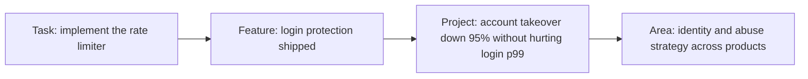

Two engineers on the same team each pick up a ticket that says "add rate limiting to login". Both ship in a week with clean, tested code. Six months later one is promoted to senior and the other is told to "keep doing what you are doing".

The code was not the difference. The first engineer asked why the ticket existed and learned that the real problem was credential stuffing from a botnet rotating through thousands of IP addresses, so a per-IP limit alone would barely dent it. She noticed that each login attempt runs an Argon2 hash costing about 19 MiB of memory, so a burst of attempts could exhaust the servers before any limit applied. She wrote a one-page proposal for per-account and per-IP limits with a bounded hashing pool, added an alert on failed-login rate, wrote a runbook, walked on-call through it, and a month later reported that account-takeover attempts reaching the hash step had fallen by about 95%. The second engineer implemented a token bucket per IP, exactly as specified.

Both did the task. Only one owned the problem. "Senior" is not a number of years or a level of coding skill; it is the size and shape of the problems you are trusted with, and what you do around the code. Levelling guides at large companies describe that change along the same few axes. Knowing them lets you aim your work deliberately, and tells you what interviewers are probing for.

## The axes that change

| Axis | Mid-level | Senior | Staff, for contrast |
|---|---|---|---|
| **Scope** | Well-defined tasks and features inside someone else's project | A project or system end to end, often a quarter long, often with a few other engineers | Problems spanning several teams or a whole area |
| **Ambiguity** | Given a solution, implements it well | Given a problem, finds and justifies a solution | Given a goal or an area, finds the problems worth solving |
| **Ownership** | Owns code until it merges | Owns the outcome: design, launch, operation, iteration and eventual deletion | Owns the technical direction of an area |
| **Leverage** | Impact is mostly their own output | Multiplies the team through reviews, docs, mentoring and tooling | Multiplies the organisation through standards, platforms and strategy |
| **Judgement** | Follows established patterns | Knows when a pattern does not apply and what not to build | Makes and explains bets with long-lived consequences |



Each step to the right is a problem statement with fewer instructions and a larger blast radius. Most promotion cases are an argument that someone has been operating one step to the right of their current level for long enough that it is clearly not luck.

## What the ladders say

Titles and numbering differ, but large companies line up roughly like this (use it as orientation; exact mappings shift over time and between organisations):

| Company | Mid-level | Senior | Staff |
|---|---|---|---|
| Google | L4 (SWE III) | L5 (Senior SWE) | L6 (Staff SWE) |
| Meta | E4 | E5 | E6 |
| Amazon | SDE II (L5) | SDE III / Senior (L6) | Principal (L7) |
| Microsoft | 61–62 (SDE II) | 63–64 (Senior) | 65–67 (Principal) |

Three things about ladders are worth knowing. First, at many large companies senior is a **career level**: you are not required to progress beyond it, while levels below it carry an expectation of promotion within a few years. Second, titles do not travel: "senior" at a 30-person startup often maps to mid-level at a large company, and down-levelling on a move is common and negotiable only with evidence of scope. Third, Netflix historically hired almost entirely at a single senior level with a very high bar, where "senior" meant operating independently with little oversight. It has since introduced a more conventional ladder, but the expectation of independent judgement at senior remains the defining trait of its culture (see [Netflix culture and interviews](/learn/senior-craft/getting-the-job/netflix-culture-and-interviews)).

## Scope: the size of the problem you own

A senior engineer typically owns something like "a one-to-three-month project with two to four engineers" or "a service and everything that happens to it". Owning it means you write the design doc, break the work down, sequence it so risk is retired early, coordinate with the teams it touches, make the calls when the plan meets reality, and report the result against the goal.

Notice how the goal statement changes with scope. Mid-level: "implement the rate limiter". Senior: "reduce account-takeover attempts reaching password verification by 90% without raising login p99 above 300 ms". The second statement leaves the solution open and makes success measurable. Being able to *rewrite* a task into that form, and get your manager to agree to it, is itself a senior skill.

## Ambiguity: turning a vague request into a plan

Ambiguous requests arrive constantly, and the junior response is to wait for someone to clarify them. Here is the senior response in miniature, to a hypothetical request about this app's AI coach:

> **Manager:** Users are saying the AI coach feels slow. Can you look into it?
>
> **Senior engineer:** Sure. Before I dig in: do we know if it is the wait before the first words appear, or the total time to finish a reply? Those have different causes.
>
> **Manager:** No idea. The complaints just say "slow".
>
> **Senior engineer:** Then I will instrument both first. I will add time-to-first-token and total duration at p50 and p95, split by conversation length, and come back on Thursday with numbers and a proposal. If first-token time is the problem, I suspect prompt assembly, because it loads progress data per request. If it is total time, it is mostly the model and output length, and the levers are different.
>
> *(Thursday)* p95 time-to-first-token is 4.1 s and 3.2 s of it is before the model call: prompt assembly runs one query per completed lesson. Batching it into one query should bring p95 under 1.5 s. It is about two days of work. I suggest a target of p95 under 1.5 s and an alert at 2.5 s.

The pattern: clarify what "success" would mean, measure before proposing, name hypotheses and how you will test them, give a date, and come back with a recommendation plus a number to hold yourself to.

## Ownership: the job ends when the outcome is achieved

Mid-level engineers are often "done" when the pull request merges. A senior engineer is done when the outcome is achieved and the system is left in a state someone else can run. A definition of done you can use:

```text
[ ] Shipped behind a flag, rolled out gradually, rollback path tested
[ ] Dashboards and alerts for the new behaviour; alert routed to the owning on-call
[ ] Runbook: what the alerts mean and what to do
[ ] Docs updated (README, API docs, ADR for the key decision)
[ ] Rollout completed to 100%; flag removed; old code path deleted
[ ] Result measured against the goal and shared with stakeholders
[ ] Follow-ups ticketed with owners, not left in someone's head
```

The last three items are where most engineers stop early. Dead flags and half-migrated code paths are how systems rot, and "we shipped it" without "and here is what changed" is how good work stays invisible.

## Leverage: multiplying others

Leverage is the idea that your impact is measured by the team's output, not only your own. It is also simple arithmetic. Suppose your own output is 1.0 unit per week. If you spend 20% of your time on reviews, docs and unblocking that make six teammates each 10% more effective, the team gains 0.8 + (6 × 0.1) = 1.4 units from you, not 1.0. A script that saves each of 10 engineers 10 minutes a day saves about 10 × 10 × 220 = 22,000 minutes, roughly 370 hours or nine engineer-weeks a year.

Leverage looks like: a code review that teaches a pattern rather than just fixing a line, a design doc template the team adopts, a flaky test fixed at the root, a new hire who is productive in two weeks instead of six because you paired with them, an interview loop you calibrated. None of it shows up in a commit count, which is why seniors make it visible in writing.

## Judgement: knowing what not to do

The clearest judgement signals are subtractive. Declining to build a generic plugin system when two hard-coded cases will do. Choosing the boring, well-understood database over the exciting one. Distinguishing **reversible** decisions (a library choice behind an interface, a feature flag) from **hard-to-reverse** ones (a public API, a data model, a storage engine) and spending review effort in proportion. Time-boxing an investigation instead of letting it expand. Saying "this is good enough; the remaining 5% is not worth two weeks" and being right about it.

## Anti-patterns that stall careers below senior

- **The hero.** Fixes every incident personally, becomes the only person who understands the system, and turns into a single point of failure. The organisation cannot promote someone it cannot do without in their current seat.
- **The ticket machine.** Excellent execution, never asks why. Stays excellent at mid-level.
- **The architecture astronaut.** Designs for scale and flexibility nobody asked for; ships late; systems are hard to change.
- **The gatekeeper.** Blocks reviews on personal taste; people route work around them.
- **The invisible senior.** Does senior work but leaves no trace: no docs, no written decisions, no summary of results. Promotion committees read artefacts, not intentions.

## How it shows up in interviews

Seniority is assessed in every round, not only the behavioural one. In coding rounds, seniors drive: they clarify, choose among approaches with stated trade-offs, test their own code and discuss production concerns. In system design, they handle ambiguity by scoping the problem themselves and making explicit calls. In behavioural rounds, their stories have senior scope (a project, not a ticket), senior ambiguity (they defined the problem) and measurable outcomes. The same loop is often used to decide *which level* to offer, so mid-level signals in an otherwise strong loop often produce a down-levelled offer rather than a rejection. The [behavioural interviews for seniors](/learn/senior-craft/getting-the-job/behavioral-interviews-for-seniors) lesson turns the axes above into a story bank.

## Senior signals

- You restate tasks as outcomes with numbers ("reduce X by Y without Z") and get agreement on them before building.
- You meet ambiguity by clarifying, measuring and proposing with a date, not by waiting for instructions.
- Your definition of done includes operations, cleanup and a measured result.
- You can quantify your leverage and you make it visible in writing.
- You separate reversible from hard-to-reverse decisions and spend scrutiny accordingly.
- You know the levelling axes at your target company and can map your own stories onto them.

## Check yourself

```quiz
- q: >-
    Which goal statement reflects senior-level scope for the login rate-limiting work?
  options: ["Add a rate-limiting library to the API crate and enable it for the /login route", "Implement a token bucket per IP address allowing 5 login attempts per minute", "Cut takeover attempts reaching password checks by 90% with login p99 under 300 ms", "Rate limit every endpoint to 100 requests per minute per client by end of quarter"]
  answer: 2
  explanation: >-
    A senior goal names the outcome (account-takeover attempts reaching password verification down 90%) and the constraint (login p99 under 300 ms) and leaves the solution open. The other options are solutions or tasks, however specific their numbers; they can be completed while the underlying problem stays unsolved.
- q: >-
    Your manager says users find a feature "slow". What is the strongest first response?
  options: ["Clarify which slowness matters, measure it, and come back by a set date with a proposal", "Start optimising the most complex code path, since that is where time usually goes", "Add caching in front of the feature's slowest queries and see whether complaints stop", "Ask the manager to write a detailed ticket first, so the requirements are clear"]
  answer: 0
  explanation: >-
    Seniors reduce ambiguity themselves: they clarify what success means, instrument the candidates and measure before acting, and commit to a date with numbers and a proposal. Waiting for a ticket pushes the ambiguity back upward, and optimising or caching blindly risks fixing the wrong thing.
- q: >-
    You spend 20% of your time on reviews and tooling that make each of five teammates 10% more effective. Assuming your own output is 1.0, what is your total contribution?
  options: ["1.3", "1.0", "1.5", "0.8"]
  answer: 0
  explanation: >-
    0.8 from your own reduced output plus 5 × 0.1 = 0.5 from the teammates gives 1.3. Leverage is why senior engineers deliberately trade some personal output for team output.
- q: >-
    Which item is most often missing from a mid-level engineer's definition of done?
  options: ["Code review approval from at least one teammate", "Flag cleanup and a result reported against the goal", "Unit tests covering every new code path added", "Merging to main and deploying behind a feature flag"]
  answer: 1
  explanation: >-
    Tests, review and deploying are usually in place. Removing the feature flag and the old code path, and reporting the measured result against the goal, are what turn shipped code into an owned outcome, and they are the parts promotion committees look for.
- q: >-
    An engineer is the only person who can debug the payments service and fixes every incident personally. Why can this stall their promotion?
  options: ["Fixing incidents is seen as reactive, and promotions reward only new features", "Incident work does not count as engineering output in most promotion rubrics", "They are a single point of failure, and seniors spread knowledge instead", "Payments is a maintenance area, so work there rarely shows senior-level scope"]
  answer: 2
  explanation: >-
    Heroics are visible but create risk and cap leverage: the system depends on one person. Seniors are expected to spread knowledge through runbooks, pairing and shared on-call so the team is resilient, which is the senior version of the same expertise. Incident work itself is valued; hoarding it is the problem.
```
