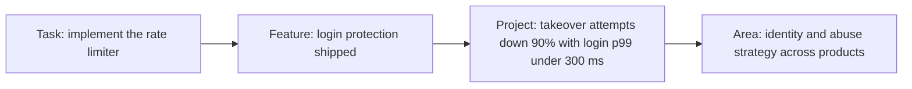

Two engineers on the same team each pick up a ticket that says "add rate limiting to login". Both ship within a few weeks with clean, tested code. Six months later one is promoted to senior and the other is told to "keep doing what you are doing".

The code was not the difference. The first engineer asked why the ticket existed and learned that the real problem was credential stuffing from a botnet rotating through thousands of IP addresses, so a per-IP limit alone would barely dent it. She noticed that each login attempt runs an Argon2id hash that allocates about 19 MiB, so a burst of attempts could exhaust memory before any limit applied. She wrote a one-page proposal, shipped per-account and per-IP limits with a bounded hashing pool, added an alert and a runbook, and a month later reported the drop in takeover attempts against a number she had agreed in advance. The second engineer implemented a token bucket per IP, exactly as specified. (The story is illustrative; the 19 MiB is real, and is the default Argon2id memory cost that this app uses.)

Both did the task. Only one owned the problem. "Senior" is not a number of years or a level of coding skill; it is the size and shape of the problems you are trusted with, and what you do around the code. Levelling guides describe that change along a handful of axes. This lesson turns them into a rubric, runs two projects at both levels side by side, and then shows how promotion committees and interview panels actually read the evidence.

## The levels rubric

Public career frameworks (several companies, Dropbox and GitLab among them, publish theirs) use different words for the same four axes. Read each row as "what you are given" on the left and "what you produce" on the right.

| Axis | Mid-level (L4, E4, SDE II) | Senior (L5, E5, SDE III) | Staff (L6, E6), for contrast |
|---|---|---|---|
| **Scope** | A feature or task inside a project someone else planned; horizon of weeks | A project or service end to end, often a quarter, often with two to four other engineers | Several teams or a whole area; horizon of a year or more |
| **Ambiguity** | Given a solution, implements it well | Given a problem, finds and justifies a solution | Given a goal or an area, finds the problems worth solving |
| **Impact** | Output: shipped code that works | An outcome: a number that moved, for users or the business, measured against a stated goal | A direction: a class of problems removed for many teams |
| **Influence** | Own work; good reviews when asked | Multiplies the team: design reviews, mentoring, docs, the decisions others follow | Multiplies the organisation: standards, platforms, strategy |

Two supporting traits run under all four rows. **Ownership** is where you consider the job finished: at merge, at launch, or when the outcome is achieved and the system can be run by someone else. **Judgement** is what you decline to do: the generic framework not built, the one-way door not rushed.



Each step to the right has fewer instructions and a larger blast radius. A promotion case is an argument that someone has operated one step to the right of their current level for long enough that it is not luck.

## The four questions a reviewer asks

Each axis reduces to a question you can ask of any piece of your own work:

| Axis | The question | Mid-level answer | Senior answer |
|---|---|---|---|
| Scope | How much of the plan did you write? | "The tech lead broke it down; I took three tickets" | "I wrote the design doc and the breakdown; three of us built it" |
| Ambiguity | What were you handed? | "A spec with the approach" | "A complaint, or a goal with no approach" |
| Impact | Which number moved, and who cares? | "It shipped on time" | "Takeover attempts fell 92% against a 90% goal; support tickets halved" |
| Influence | Who changed what they did because of you? | "My reviewer approved it" | "Two other teams adopted the limiter config; on-call uses my runbook" |

## What the ladders say

Titles and numbering differ, but large companies line up roughly like this. Treat it as orientation: mappings shift over time and between organisations, and the numbers are widely reported rather than officially cross-referenced.

| Company | Mid-level | Senior | Staff |
|---|---|---|---|
| Google | L4 (SWE III) | L5 (Senior SWE) | L6 (Staff SWE) |
| Meta | E4 | E5 | E6 |
| Amazon | SDE II (L5) | SDE III / Senior (L6) | Principal (L7) |
| Microsoft | 61–62 (SDE II) | 63–64 (Senior) | 65–67 (Principal) |

Three things about ladders are worth knowing. First, at many large companies senior is a **career level**: you are not required to progress beyond it, while the levels below it carry an expectation of promotion within a few years. Second, titles do not travel: "senior" at a 30-person startup often maps to mid-level at a large company, and down-levelling on a move is common and negotiable only with evidence of scope. Third, Netflix historically hired almost entirely at a single senior level with a very high bar, where "senior" meant operating independently with little oversight. It has since introduced a more conventional ladder, but independent judgement at senior remains the defining trait of its published culture (see [Netflix culture and interviews](/learn/senior-craft/getting-the-job/netflix-culture-and-interviews)).

## Worked example 1: login protection at two scopes

The opening story, phase by phase. The mid-level version is not bad work; it is correct work at a smaller scope.

| Phase | Mid-level version (about 1 week) | Senior version (about 3 weeks) |
|---|---|---|
| Input | Ticket: "add rate limiting to login" | The same ticket |
| Framing | Treats the ticket as the spec | Asks support why it exists: 40 account-takeover reports last month. Reads the auth logs: attempts come from about 12,000 IPs, most under 2 attempts a minute each |
| Goal | "Token bucket, 5 attempts a minute per IP" | "Cut takeover attempts reaching password verification by 90%, with login p99 under 300 ms" |
| Design | Middleware; no doc | One page: per-IP and per-account limits, a bounded hashing pool, an alert on failed-login rate; CAPTCHA and a vendor WAF rule listed as alternatives with reasons |
| Risk found | None looked for | A 4-core host completes perhaps 100–200 hashes a second, so 300 attempts a second queue up. Tokio's blocking pool allows up to 512 threads by default, and 512 concurrent hashes × 19 MiB ≈ 9.5 GiB. One hash per CPU caps it at 4 × 19 = 76 MiB |
| Launch | Merged and deployed | Shadow mode first (log, do not block) for a week: 0.3% of real logins would have been limited, all from one office NAT, so the per-IP limit rose and per-account became the main defence |
| Operate | Nothing added | Dashboard, alert routed to on-call, a runbook, a 15-minute walk-through with the rotation |
| Report | "Done" in stand-up | A paragraph to security and support: takeover attempts reaching hashing down 92% in 30 days, p99 unchanged at 180 ms |

All numbers except the hash size and Tokio's thread limit are illustrative. Two things decided the level. The senior engineer **changed the problem statement** before writing code, which is what the ambiguity axis measures. And the work left **artefacts other people use**: a doc, a runbook, an agreed goal, a result. The per-IP limit would have stopped almost nothing: at 12,000 IPs making under 2 attempts a minute, a 5-per-minute limit never fires, and the mid-level engineer would have shipped a correct control against the wrong attack. (Ascend bounds its own hashing the same way; the [authentication case study](/learn/case-study-ascend/the-system/authentication-and-security) walks through the semaphore.)

## Worked example 2: "search feels slow" at two scopes

The second project starts vaguer, which is where the gap widens. A streaming catalogue's product manager says users complain that search feels slow.

**Mid-level version.** The engineer opens the server dashboard, sees search p50 at 180 ms, adds a Redis cache in front of the search service, and two weeks later cached queries return in 60 ms. The complaints continue. Nobody asked what "slow" meant to the people complaining.

**Senior version, as a conversation:**

> **PM:** Users say search feels slow. Can you look into it?
>
> **Senior:** Yes. First question: slow while typing, or slow after pressing enter? And on which devices? The causes differ.
>
> **PM:** No idea. The app-store reviews say "laggy search".
>
> **Senior:** Then I will measure before proposing. I will add client-side timing from keystroke to results rendered, split by platform, next to the server's p95. Numbers and a proposal by Thursday.
>
> *(Thursday)* **Senior:** Server p95 is 220 ms and fine. On Android the time from keystroke to results is 1.8 s at p95. The app sends a request on every keystroke, never cancels the stale ones, and each response is about 400 KB. Proposal: debounce at 150 ms, cancel in-flight requests, and trim the payload to the fields the results row shows. That is mostly the Android team's code, so I have booked 30 minutes with their lead. Target: p95 under 600 ms, measured the same way.

Three weeks later Android p95 is 550 ms (illustrative). The server-side cache was never built, which saved an operational dependency nobody needed. The mid-level engineer optimised what was measurable; the senior engineer made the right thing measurable first, and moved work across a team boundary with a number instead of a request.

| | Mid-level | Senior |
|---|---|---|
| First action | Opened the dashboard that existed | Asked which slowness, then instrumented the missing one |
| Evidence | Server p50 | Client p95 by platform, beside server p95 |
| Change | Cache (new infrastructure) | Debounce, cancellation, smaller payload (no new infrastructure) |
| Who else moved | Nobody | The Android team, persuaded by a number |
| Result | Faster cache hits; complaints unchanged | Perceived p95 from 1.8 s to 0.55 s |

## A procedure for growing an assignment to senior scope

Both examples followed the same steps, and you can run them on any ticket. They typically add a day or two of work before the first line of code; the rest of the extra time in example 1 went into scope the mid-level version never had.

1. **Find who feels the problem and a number that describes it.** Login: 40 takeover reports a month. Search: app-store reviews, then a client timing nobody had.
2. **Rewrite the ticket as an outcome with a guardrail**, "move X by Y without breaking Z", and get the requester to agree in one written message. That message is the first artefact of the project.
3. **Find the fact that would make the obvious solution wrong, and check it first.** The IP distribution killed the per-IP limit; the client timing killed the cache.
4. **Name everyone outside your team who must change something**, and talk to them before you build (the Android lead, the on-call rotation).
5. **Decide how and when you will report the result, and to whom.** Put the date in the calendar when you set the goal.
6. **Leave one artefact other people will use**: a doc, a runbook, a config other teams can copy.

Step 2 is the one that changes the level. A mid-level engineer who does steps 3 to 6 on a task-shaped goal produces excellent task-level work; the reframed goal is what makes the rest count as project scope.

## Ownership: where the job ends

Mid-level engineers are often done when the pull request merges. A senior engineer is done when the outcome is achieved and someone else can run the system. A definition of done you can adopt:

```text
[ ] Shipped behind a flag, rolled out gradually, rollback path tested
[ ] Dashboards and alerts for the new behaviour; alert routed to the owning on-call
[ ] Runbook: what each alert means and the first three things to check
[ ] Docs updated (README, API docs, an ADR for the key decision)
[ ] Rollout completed to 100%; flag removed; old code path deleted
[ ] Result measured against the goal and shared with stakeholders
[ ] Follow-ups ticketed with owners, not left in someone's head
```

The last three items are where most engineers stop early. Dead flags and half-migrated paths are how systems rot, and "we shipped it" without "and here is what changed" is how good work stays invisible.

## Leverage: influence as arithmetic

Your impact is measured by the team's output, not only your own. Suppose your own output is 1.0 unit a week. If you spend 20% of your time on reviews, docs and unblocking that make six teammates each 10% more effective, the team gains 0.8 + 6 × 0.1 = 1.4 units from you, not 1.0. A script that saves each of 10 engineers 10 minutes a day saves 10 × 10 × 220 working days = 22,000 minutes, about 370 hours, or nine 40-hour engineer-weeks a year.

The same arithmetic shows when leverage is fake. If your 20% goes into reviews that change nothing (approvals with no comments, or nit lists), the teammates' gain is zero and your contribution drops to 0.8. Leverage is measured at the receiving end: a review that teaches a pattern, a template the team adopts, a flaky test fixed at the root, a new hire productive in two weeks instead of six. None of it shows in a commit count, which is why seniors write it down.

## Judgement: what you decline to do

The clearest judgement signals are subtractive. Declining to build a generic plugin system when two hard-coded cases will do. Choosing the boring, well-understood database. Separating **reversible** decisions (a library behind an interface, a feature flag) from **hard-to-reverse** ones (a public API, a data model, a storage engine) and spending review effort in proportion; [articulating trade-offs](/learn/system-design/senior-design-skills/articulating-trade-offs) prices that difference. Time-boxing an investigation. Saying "this is good enough; the remaining 5% is not worth two weeks" and being right about it. The search example above contains one: the cache that was not built.

## Under the hood: how packets and calibration read your work

Promotion processes differ by company and change every few years, so treat this as the common shape rather than any one company's current rules.

**The packet.** A promotion case is usually a written document: a summary from the manager, the candidate's own account of their work, feedback from peers who worked with them, and links to artefacts (design docs, launch results, postmortems, review threads). At several large companies the people deciding are not the candidate's manager. Committees of more senior engineers or managers from elsewhere in the organisation read packets from people they have never met, often many in one session, which is why the packet's first paragraph and its evidence links carry so much weight.

**How a reader reads it.** Readers map each claim to the rubric's axes and look for three properties: the claim is **at the next level** (a project, not a ticket), it is **attributable** ("I designed", not "we shipped"), and it is **sustained** (evidence across several quarters, not one heroic month). Here are two packet paragraphs describing the login project; the brackets are what a reader typically writes in the margin.

```text
WEAK
Worked on login security this half. Implemented rate limiting and      [task-level scope]
improved the auth service. Collaborated with security and support.     [no outcome, no "I"]
Received positive feedback from the team.                              [unverifiable]

STRONG
Took an open-ended ticket ("add rate limiting") and reframed it after   [ambiguity: reframed]
finding the attack came from ~12k IPs, below any per-IP limit. Wrote    [evidence-led]
the design (link), chose per-account limits plus a bounded hash pool    [owned the design]
over CAPTCHA, ran it in shadow mode, and rolled it out (link). Takeover [de-risked launch]
attempts reaching hashing fell 92% against a 90% goal; login p99        [outcome vs a goal]
unchanged. Runbook adopted by on-call; two teams reused the config.     [influence]
```

**Calibration.** Separately from promotion, many companies hold calibration meetings where managers across an organisation compare ratings, so that "exceeds expectations" means the same in two teams. Managers argue from the same evidence: a manager who cannot point to artefacts loses the argument to one who can. This is the mechanism behind the advice to write things down. Your manager represents you in a room you are not in, armed only with what exists in writing.

**Hiring loops use the same rubric.** Interview debriefs decide the level as well as the hire, and a strong loop with mid-level evidence commonly produces an offer at the level below rather than a rejection; [the FAANG loop](/learn/senior-craft/getting-the-job/the-faang-loop) covers how that decision is made.

## Career failure modes

| Pattern | Symptom you would observe | Diagnosis | Fix |
|---|---|---|---|
| The hero | Paged for every incident; nobody else can debug the service; feedback says "indispensable" but no promotion | A single point of failure; the organisation cannot move someone it cannot do without | Runbooks, pairing on incidents, handing the pager to others with you as backup; measure how many incidents you did not touch |
| The ticket machine | Excellent velocity; the promotion feedback says "needs more scope" | Every input was a solution; no evidence on the ambiguity axis | Ask for a problem, not a ticket; propose one thing per quarter that nobody asked for, with a number |
| The architecture astronaut | Designs for 100× the load; ships late; peers route around the abstraction | Judgement evidence is negative: generality nobody asked for | Size to the forecast with a named trigger for the bigger design |
| The gatekeeper | Reviews block on taste; people ask other reviewers | Influence by veto, not by teaching | Label comments by severity; move taste into a written guide or drop it ([code review as mentorship](/learn/senior-craft/technical-leadership/code-review-as-mentorship)) |
| The invisible senior | Does senior work; packet feedback says "not enough evidence" | No artefacts: no docs, no written decisions, no reported results | A design doc per project, a results paragraph at the end of each, a brag document updated monthly |

## Where to spend senior time

There are several legitimate shapes of senior work, and each produces evidence at a different rate.

| Shape | Leverage | Visibility to a committee | Risk | Time until evidence |
|---|---|---|---|---|
| Own one large project end to end | Medium: one outcome | High: one clear story | High if it slips | One to two quarters |
| Deep specialist (the database person) | High for one area | Medium: needs artefacts to show | Becoming the hero | Continuous |
| Team multiplier (reviews, mentoring, templates) | High, diffuse | Low unless measured | Seen as "not delivering" | Slow; needs numbers |
| Glue work (coordination, onboarding, process) | High for the team | Low at many companies | Career stalls if unrecognised | Rarely credited alone |

Glue work is the trap: it is essential, and Tanya Reilly's widely shared talk "Being Glue" documents how it goes uncredited when it is not tied to an outcome. The senior move is to do it in service of a project you own and to report it as part of that project's result.

## How it shows up in interviews

Seniority is assessed in every round, not only the behavioural one. In coding rounds, seniors drive: they clarify, choose among approaches with stated trade-offs, test their own code and discuss production concerns ([senior signals in coding rounds](/learn/interview-patterns/interview-execution/senior-signals-in-coding-rounds) shows the two write-ups side by side). In system design, they scope the problem themselves and make explicit calls. In behavioural rounds, their stories have senior scope (a project, not a ticket), senior ambiguity (they defined the problem) and a measured outcome. [Behavioural interviews for seniors](/learn/senior-craft/getting-the-job/behavioral-interviews-for-seniors) turns the rubric into a story bank.

## Interviewer follow-ups

**"What is the most ambiguous problem you have owned?"** Model answer: the vague input, the first thing you did to reduce the ambiguity (a question or a measurement), the reframed goal with a number, the decision you made that others would not have, and the result against the goal. The search story fits: "laggy search" became "Android keystroke-to-results p95 from 1.8 s to under 600 ms". Common wrong answer: a hard technical problem with a clear spec, which is difficulty, not ambiguity.

**"Tell me about your biggest impact."** Model answer: one outcome, quantified, with your part separated from the team's ("I designed and drove it; three of us built it"), and one sentence on what you would do differently. Common wrong answer: a list of technologies used, or "we" throughout so the interviewer cannot tell what you did.

**"Why are you not senior already?"** or **"What is your gap to the next level?"** Model answer: name the axis honestly and the evidence you are building: "my scope has been single-team; this year I drove the error-format change across four teams, and that is the kind of evidence I am still accumulating." Common wrong answer: blaming the process or claiming there is no gap, which reads as low self-awareness.

**"Tell me about something you decided not to build."** Model answer: the option, why it was tempting, the number that argued against it, and the trigger that would reopen it: "I did not add the search cache: server p95 was 220 ms; the problem was client-side. I would revisit if server p95 passed 400 ms." Common wrong answer: a feature product vetoed, which is someone else's judgement.

## What mid-level engineers get wrong

- **Equating seniority with technical difficulty.** They solve harder tickets, and the packet still reads "task-level scope".
- **Accepting the ticket as the spec.** The login engineer shipped a correct limiter against the wrong attack.
- **Stopping at merge.** No rollout plan, no alert, no measured result, so nothing exists for a reader to cite.
- **Writing "we" in every sentence.** Committees cannot credit what they cannot attribute.
- **Doing leverage work without measuring it.** Twenty hours of mentoring reported as "helped the team" earns nothing; "cut new-hire time to first production change from six weeks to two" does.
- **Waiting for a senior-sized project to be assigned.** Senior scope is usually created by reframing a mid-sized one.

## Exercise: read a packet like a committee

```exercise
id: packet-evidence
title: Which level does this evidence support?
prompt: |
  Model how a promotion reader turns evidence into a level. This is a
  teaching model, not any company's rule, but it encodes the two things
  committees look for: evidence must be sustained, and it must cover the
  axes, not one of them.

  `evidence` is a list of items `{"axis": a, "level": L, "quarter": q}` where
  `a` is one of "scope", "ambiguity", "impact", "influence", `L` is an
  integer level (4 mid, 5 senior, 6 staff) and `q` is an integer quarter.

  - An axis's demonstrated level is the highest level `L` such that items on
    that axis with level >= `L` occur in at least 2 distinct quarters.
    If no level qualifies, the axis is 0.
  - The packet `supported` the `target` level if either every axis is
    >= `target`, or exactly three axes are >= `target` and the fourth is
    `target - 1`.
  - `gaps` lists the axes below `target`, in the order scope, ambiguity,
    impact, influence.

  Return `{"axes": {"scope": s, "ambiguity": a, "impact": i,
  "influence": f}, "supported": bool, "gaps": [...]}`.
languages: [python, javascript]
entry: packet_level
starter:
  python: |
    def packet_level(evidence, target):
        # your code here
        return {"axes": {}, "supported": False, "gaps": []}
  javascript: |
    function packet_level(evidence, target) {
      // your code here
      return { axes: {}, supported: false, gaps: [] };
    }
tests:
  - args: [[{"axis": "scope", "level": 5, "quarter": 1}, {"axis": "scope", "level": 5, "quarter": 2}, {"axis": "ambiguity", "level": 5, "quarter": 2}, {"axis": "ambiguity", "level": 6, "quarter": 3}, {"axis": "impact", "level": 5, "quarter": 2}, {"axis": "impact", "level": 5, "quarter": 3}, {"axis": "influence", "level": 5, "quarter": 1}, {"axis": "influence", "level": 5, "quarter": 3}], 5]
    expected: {"axes": {"scope": 5, "ambiguity": 5, "impact": 5, "influence": 5}, "supported": true, "gaps": []}
    label: sustained senior evidence on every axis
  - args: [[{"axis": "scope", "level": 6, "quarter": 1}, {"axis": "scope", "level": 4, "quarter": 2}, {"axis": "ambiguity", "level": 5, "quarter": 1}, {"axis": "ambiguity", "level": 5, "quarter": 2}, {"axis": "impact", "level": 5, "quarter": 1}, {"axis": "impact", "level": 5, "quarter": 2}, {"axis": "influence", "level": 5, "quarter": 2}, {"axis": "influence", "level": 5, "quarter": 3}], 5]
    expected: {"axes": {"scope": 4, "ambiguity": 5, "impact": 5, "influence": 5}, "supported": true, "gaps": ["scope"]}
    label: one heroic quarter is not sustained, but one near miss is allowed
  - args: [[], 5]
    expected: {"axes": {"scope": 0, "ambiguity": 0, "impact": 0, "influence": 0}, "supported": false, "gaps": ["scope", "ambiguity", "impact", "influence"]}
    label: no evidence
  - args: [[{"axis": "impact", "level": 6, "quarter": 2}, {"axis": "impact", "level": 6, "quarter": 2}, {"axis": "impact", "level": 5, "quarter": 3}, {"axis": "scope", "level": 5, "quarter": 1}, {"axis": "scope", "level": 5, "quarter": 4}, {"axis": "ambiguity", "level": 5, "quarter": 1}, {"axis": "ambiguity", "level": 5, "quarter": 4}, {"axis": "influence", "level": 4, "quarter": 1}, {"axis": "influence", "level": 4, "quarter": 2}], 5]
    expected: {"axes": {"scope": 5, "ambiguity": 5, "impact": 5, "influence": 4}, "supported": true, "gaps": ["influence"]}
    label: two items in the same quarter count once
  - args: [[{"axis": "scope", "level": 5, "quarter": 1}, {"axis": "scope", "level": 5, "quarter": 2}, {"axis": "ambiguity", "level": 5, "quarter": 1}, {"axis": "ambiguity", "level": 5, "quarter": 2}, {"axis": "impact", "level": 4, "quarter": 1}, {"axis": "impact", "level": 4, "quarter": 2}, {"axis": "influence", "level": 4, "quarter": 1}, {"axis": "influence", "level": 4, "quarter": 3}], 5]
    expected: {"axes": {"scope": 5, "ambiguity": 5, "impact": 4, "influence": 4}, "supported": false, "gaps": ["impact", "influence"]}
    hidden: true
    label: two near misses are not enough
  - args: [[{"axis": "scope", "level": 6, "quarter": 1}, {"axis": "scope", "level": 6, "quarter": 3}, {"axis": "ambiguity", "level": 6, "quarter": 2}, {"axis": "ambiguity", "level": 6, "quarter": 3}, {"axis": "impact", "level": 6, "quarter": 1}, {"axis": "impact", "level": 5, "quarter": 2}, {"axis": "influence", "level": 6, "quarter": 2}, {"axis": "influence", "level": 6, "quarter": 4}], 6]
    expected: {"axes": {"scope": 6, "ambiguity": 6, "impact": 5, "influence": 6}, "supported": true, "gaps": ["impact"]}
    hidden: true
    label: a staff packet with a near miss on impact
  - args: [[{"axis": "scope", "level": 5, "quarter": 1}, {"axis": "scope", "level": 5, "quarter": 2}, {"axis": "ambiguity", "level": 5, "quarter": 1}, {"axis": "ambiguity", "level": 5, "quarter": 2}, {"axis": "impact", "level": 5, "quarter": 1}, {"axis": "impact", "level": 5, "quarter": 2}], 5]
    expected: {"axes": {"scope": 5, "ambiguity": 5, "impact": 5, "influence": 0}, "supported": false, "gaps": ["influence"]}
    hidden: true
    label: a missing axis is more than a near miss
hints:
  - "For each axis, collect the set of quarters at each level; an item at level 6 also counts as evidence at levels 5 and 4."
  - "Try candidate levels from the highest level present downwards and stop at the first one with at least two distinct quarters."
  - "Count the axes at or above the target, then check whether the remaining one (if any) is exactly one level short."
```

## Senior signals

- You restate tasks as outcomes with numbers ("reduce X by Y without Z") and get agreement on them before building.
- You meet ambiguity by clarifying, measuring and proposing with a date, not by waiting for a better ticket.
- Your definition of done includes operations, cleanup and a measured result reported to the people who care.
- You can say which axis of the rubric each of your projects demonstrates, and which one is your current gap.
- You know promotion and calibration run on written, attributable, sustained evidence, and you produce it as a by-product of the work.
- You quantify leverage at the receiving end and separate reversible from hard-to-reverse decisions.

## Check yourself

```quiz
- q: >-
    Which goal statement reflects senior-level scope for the login rate-limiting work?
  options: ["Cut takeover attempts reaching password checks by 90%, login p99 under 300 ms", "Add a rate-limiting library to the API crate and enable it for the login route", "Implement a token bucket per IP address allowing 5 login attempts per minute", "Rate limit every endpoint to 100 requests per minute per client by quarter end"]
  answer: 0
  explanation: >-
    A senior goal names the outcome and the constraint and leaves the solution open. The other statements are solutions, however specific their numbers, and the per-IP bucket would have shipped correctly while stopping almost nothing: an attack spread over 12,000 IPs at under 2 attempts a minute each never trips a 5-per-minute limit.
- q: >-
    In the search example, the mid-level engineer added a cache and cut cached query time from 180 ms to 60 ms, yet complaints continued. What was the root mistake?
  options: ["Not asking the Android team to review the cache before building it", "Choosing Redis rather than an in-process cache for the search results", "Caching before the server's p99 was known, since p50 hides the tail", "Optimising the existing metric rather than measuring the complaints"]
  answer: 3
  explanation: >-
    The complaint was about keystroke-to-results time on mobile, which no existing dashboard measured. The server was already at 220 ms p95. Any server-side change, whichever cache or percentile was chosen, optimised a number the users were not experiencing; the senior move was to instrument the complaint first.
- q: >-
    You spend 20% of your time on reviews and tooling that make each of five teammates 10% more effective. Your own output alone would be 1.0. What is your total contribution, and what if the reviews change nothing?
  options: ["1.5, falling to 1.0 if the reviews change nothing", "1.3, staying at 1.3 since review time is still work", "1.3, falling to 0.8 if the reviews change nothing", "1.0, since leverage cannot be counted as output"]
  answer: 2
  explanation: >-
    0.8 of your own output plus 5 × 0.1 from teammates gives 1.3. Leverage is measured at the receiving end: if the reviews teach nothing and catch nothing, the teammates gain nothing and you have traded 0.2 of your output for zero.
- q: >-
    A packet says: worked on login security, implemented rate limiting, collaborated with security and support, received positive feedback. Why does a committee reader discount it?
  options: ["It names other teams, which dilutes the candidate's own credit", "No outcome, no attribution, and nothing a reader could verify", "Security work is weighted below product work in most rubrics", "It is too short; packets should describe every ticket in detail"]
  answer: 1
  explanation: >-
    Readers look for next-level scope, attributable actions and a measured result with links. This paragraph has a task, a plural subject and unverifiable praise. Length and naming partner teams are not the problem, and security work is valued when it shows an outcome.
- q: >-
    In the exercise's model, an engineer has level-6 impact evidence in one quarter and level-4 impact evidence in another. What level does the impact axis demonstrate, and why?
  options: ["5, because the average of the two items rounds to five", "6, because the highest single piece of evidence sets the level", "4, because level 5 or above appears in only one quarter", "0, because the two items disagree with each other"]
  answer: 2
  explanation: >-
    Sustained evidence means the level recurs across quarters. Only one quarter shows level 5 or above, so the axis settles at 4, which two quarters support. This mirrors why one heroic month rarely carries a promotion case on its own.
- q: >-
    An engineer is the only person who can debug the payments service and fixes every incident personally. Why can this stall their promotion?
  options: ["Fixing incidents is reactive, and promotions reward only new features", "They are a single point of failure, and seniors spread the knowledge", "Incident work does not count as engineering output in most rubrics", "Payments is a maintenance area, so its work rarely shows senior scope"]
  answer: 1
  explanation: >-
    Heroics are visible but create risk and cap leverage: the organisation cannot move someone it cannot do without. Seniors turn the same expertise into runbooks, pairing and a shared rotation. Incident work itself is valued; hoarding it is the problem.
```
