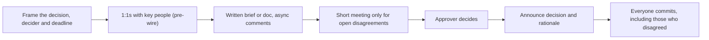

You need three teams to move off a deprecated authentication client by the end of the quarter, because the old client writes session tokens into debug logs. You manage none of those teams. Each has its own roadmap and a product manager who did not budget for your migration. Two of the tech leads have never heard of you. An email saying "please migrate by September 30" will be read, agreed with, and ignored.

This is the normal shape of senior work. The problems worth solving cross boundaries, and the people who must act report to someone else. Authority would make it easier, but you do not have it, and even people who have it usually get better results without leaning on it. What works is influence: making the right outcome easy to agree with, making the decision explicit, and handling disagreement so that it improves the decision instead of stalling it.

## Where influence comes from

| Source | What it looks like | How you build it |
|---|---|---|
| Expertise | People ask your opinion because you are usually right about this area | Go deep on something the organisation depends on; write down what you know |
| Track record | Your past proposals shipped and worked | Deliver on commitments, especially small ones; report outcomes |
| Relationships | People take your call and give you the benefit of the doubt | Help others with their problems before you need anything |
| Clarity | Your writing makes the decision easy to understand | Short docs, numbers, explicit trade-offs, a clear ask |
| Alignment | Your ask advances their goals, not only yours | Learn what each team is measured on |
| Borrowed mandate | A director or VP has said this matters | Use sparingly; it buys compliance, not commitment |

The first five compound over years and are what "senior" colleagues actually run on. The sixth works once and costs goodwill each time.

## Make yes the cheapest answer

Most "no"s to cross-team requests are not disagreement; they are cost. The other team agrees the migration matters and has no capacity for it this quarter. So reduce the cost until yes is easy:

- **Do the work for them.** Write the migration pull requests yourself, or a codemod that does 90% of the change, and ask only for review.
- **Make the new way the default.** Update the service template, the docs and the lint rule, so new code uses the new client without anyone deciding to.
- **Tie it to their goals.** "This removes a finding from your security review" lands better than "this helps the platform team".
- **Make progress visible.** A shared tracker showing 14 of 17 services migrated creates gentle pressure without anyone sending a reminder.

For the auth client migration, that means: a migration guide, a codemod, one PR per service opened by you, a 20-minute office hour each week, and a tracker linked from the security team's quarterly review.

## Driving a decision

Many cross-team efforts stall because nobody knows who decides, or that a decision is even being made. The fix is to name three things explicitly: **the decision, the decider, and the deadline.** Lightweight frameworks such as DACI (Driver, Approver, Contributors, Informed) exist to make those roles explicit. You are usually the driver, which means you do the work of reaching a decision, not that you make it.

A decision brief keeps it to one page:

```text
DECISION BRIEF: <the question, phrased so it can be answered>
Driver: <you>          Approver: <one named person>          Decide by: <date>
Contributors: <who must be consulted>     Informed: <who needs to hear the outcome>

Context (3-5 sentences): why this needs deciding now; what happens if we do nothing.

Options
  A. <option>  Pros / cons / cost / risk
  B. <option>  Pros / cons / cost / risk
  C. Do nothing  Pros / cons / cost / risk

Recommendation: <option> because <the one or two reasons that matter most>.
What would change this recommendation: <the evidence that would flip it>.
Open questions: <anything the approver must weigh>.
```

The "what would change this recommendation" line is the most useful in the brief. It turns disagreement from a clash of opinions into a question about evidence.



**Pre-wire.** Before any group meeting where a decision is expected, talk to each key stakeholder one to one. Nobody should be surprised in the room. Private conversations surface objections while they are cheap to address, and people argue less defensively without an audience.

## Dialogue: pre-wiring a skeptical peer

> **You:** Thanks for the time. I am proposing we standardise error responses across services on the code-plus-message format the API already uses. I wanted your take before the review on Thursday, since your team owns the most clients.
>
> **Tech lead (skeptical):** Honestly, we have bigger problems. Our clients already parse our errors. Changing it is churn.
>
> **You:** That is fair. What would it cost you, roughly?
>
> **Tech lead:** Every client has error handling for our format. Two weeks, maybe three, plus coordinating the mobile release.
>
> **You:** That matches my estimate. Two things might change the maths. First, the proposal keeps your current format valid for two quarters, so mobile can migrate on its normal release train. Second, the support team spends about six hours a week translating error codes across services during incidents; a single format would make most of that go away, and your on-call benefits most because you sit in the middle of the checkout flow.
>
> **Tech lead:** Six hours a week, from whom?
>
> **You:** From the support team's ticket tags over the last quarter; I will put the query in the doc. What would it take for you to support this?
>
> **Tech lead:** If the old format stays valid for two quarters and someone other than my team writes the shared parser, I can live with it.
>
> **You:** I can own the parser. I will put both conditions in the doc so you can hold me to them.

Notice what happened: you asked about their cost before defending your idea, you brought a number they could check, you asked directly what would earn their support, and you converted objections into written commitments.

## Disagreement that improves the decision

Disagreements usually mix three kinds of claim, and separating them makes most of the heat disappear:

- **Facts:** "The p99 of the current path is 180 ms." Resolve by measuring.
- **Predictions:** "This will not scale past 10,000 requests per second." Resolve by prototyping, load testing or reference to a comparable system.
- **Values and priorities:** "Operational simplicity matters more than latency here." Resolve by deciding, explicitly, whose call it is.

Useful moves in the room: restate the other person's position until they agree you have it right (steelman), ask "what would have to be true for your option to be the better one?", and ask "what evidence would change your mind?", including of yourself. Time-box it. If you cannot converge in the time-box, the disagreement is about values, and it goes to the decider.

Contrast two ways the same design review can go:

> **Unproductive:** "Kafka is overkill, everyone knows that." / "SQS will not scale." / (twenty minutes of anecdotes, meeting ends, nothing decided)
>
> **Productive:** "Let me check I understand: you prefer Kafka because we will want to replay events for the new analytics pipeline, and SQS cannot replay. Is that the core of it?" / "Yes." / "Then the question is whether replay is a real requirement this year. If analytics commits to it by Q2, Kafka's operational cost is justified. If not, SQS is cheaper to run. Can we ask the analytics lead and decide Friday?"

Once a decision is made, **disagree and commit**: argue fully before the decision, then execute it as if it were your own, without relitigating in hallways. Reopen it only with new evidence, and say so explicitly ("new information: the replay requirement is confirmed; I would like to revisit").

## Escalation done well

Escalation is not failure. Surprise escalation is. When two teams cannot agree and the decision matters, escalate together, with a shared write-up both sides agree represents their positions fairly:

```text
Subject: Decision needed by <date>: <question>

We (<you> and <other lead>) disagree on <question> and need a decision from you.
Context: <3 sentences>.
Option A (<you>): <position>; strongest reason: <reason>; cost: <cost>.
Option B (<other lead>): <position>; strongest reason: <reason>; cost: <cost>.
What we agree on: <shared facts and constraints>.
Impact of waiting: <what slips if undecided by date>.
We are both happy to commit to whichever you choose.
```

A manager who receives this can decide in ten minutes. A manager who hears two separate versions from two frustrated people has to re-run the whole argument, and trusts both of them a little less afterwards.

## The trust ledger

Influence behaves like a ledger. Deposits: delivering what you said you would, giving public credit, helping with other teams' problems, admitting quickly when you were wrong, keeping confidences. Withdrawals: surprising people in meetings, going around someone to their manager, relitigating decided questions, overstating certainty, and borrowing a VP's authority for routine asks. Senior engineers make deposits long before they need to withdraw, which is why their "can you help with this?" gets a yes.

## Anti-patterns

- **Consensus theatre:** "we all agreed" when nobody decided and the loudest person's view won by default.
- **The drive-by mandate:** announcing a standard in a channel and expecting adoption.
- **The endless RFC:** a proposal left open for comment indefinitely because closing it would require choosing.
- **Winning the argument, losing the ally:** being right in a way that makes the other person less likely to work with you next time.

## Senior signals

- You name the decision, the decider and the deadline, and you write a one-page brief with a recommendation and what would change it.
- You pre-wire: nobody is surprised in the meeting where a decision is taken.
- You reduce the cost of yes by doing work for other teams, making the new path the default, and tying asks to their goals.
- You separate facts, predictions and values in a disagreement and resolve each the right way.
- You escalate jointly, with a write-up both sides endorse, and you disagree and commit afterwards.
- You treat influence as a ledger and make deposits long before withdrawals.

## Check yourself

```quiz
- q: >-
    Three teams agree your migration matters but none has scheduled it. What is the most effective next step?
  options: ["Ask a VP to mandate it", "Send a firmer email with a deadline", "Wait until an incident proves the risk", "Reduce their cost: provide a codemod, open the PRs yourself, make the new client the default, and track progress visibly"]
  answer: 3
  explanation: >-
    The obstacle is cost, not disagreement. Lowering the cost of yes gets commitment; a mandate gets grudging compliance and spends goodwill, and waiting for an incident accepts the risk you are trying to remove.
- q: >-
    What is the main purpose of pre-wiring before a decision meeting?
  options: ["To surface objections one to one while they are cheap to address, so nobody is surprised in the room", "To get the decision made without a meeting", "To lobby for votes", "To avoid writing a design doc"]
  answer: 0
  explanation: >-
    People raise concerns more candidly in private and argue less defensively without an audience. Pre-wiring improves the proposal and the meeting; it is not a substitute for the written brief or the decision itself.
- q: >-
    Two engineers argue about whether a design "will scale". Which kind of disagreement is this, and how should it be resolved?
  options: ["A values disagreement; escalate to the manager", "A factual disagreement; look it up in the docs", "A prediction; resolve it with a load test, prototype or comparable system", "A personality clash; move on"]
  answer: 2
  explanation: >-
    Claims about future behaviour are predictions, and evidence settles them. Escalating a prediction wastes the decider's time; values and priorities are what go to the decider.
- q: >-
    After a decision goes against your recommendation, you learn nothing new. What does "disagree and commit" require?
  options: ["Keep raising the concern in each planning meeting", "Execute the decision fully as if it were your own, and reopen it only with new evidence, stated as such", "Implement it minimally to show it will not work", "Escalate to the approver's manager"]
  answer: 1
  explanation: >-
    Relitigating without new information erodes trust and slows everyone. The right to reopen is tied to new evidence, not persistence.
- q: >-
    You and another tech lead are deadlocked on a decision that blocks both teams. What is the best escalation?
  options: ["A joint write-up both of you agree is fair, stating the options, reasons, costs, what you agree on and the decision date needed", "Each of you messages your own manager with your side", "Post the disagreement in a public channel to gather votes", "Avoid escalating; escalation looks like failure"]
  answer: 0
  explanation: >-
    A joint write-up lets the decider decide quickly and preserves the relationship. Separate one-sided escalations force the manager to re-run the argument and cost both of you trust.
```
