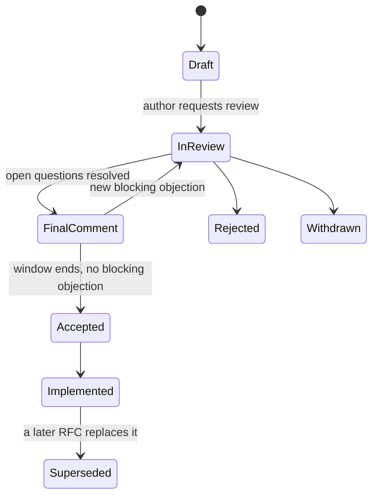

A team spends ten weeks building a WebSocket-based notification service. In week ten, a security review points out that a corporate proxy used by a third of their enterprise customers strips WebSocket upgrade requests, so those customers will never receive a notification. The team rebuilds on Server-Sent Events, which that proxy passes through. A four-page design doc circulated in week one would have drawn that comment from the networking team in a day. (The story is illustrative; proxies that break WebSocket upgrades are not.)

A design doc is the cheapest place to be wrong. Changing a paragraph costs minutes; changing a deployed system costs weeks and sometimes a migration. The doc is also how a senior engineer scales judgement: it lets ten people check your reasoning in parallel, records *why* a decision was made for the engineer who inherits it in two years, and forces you to find the hole in your design before the code does. This lesson works one RFC end to end, shows how the review meeting and the document's life actually run, and ends with a real decision from this app's code.

## When to write one

Write a design doc when any of these hold:

- The work is more than about two engineer-weeks.
- It crosses a team boundary or changes a shared API, event schema or data contract.
- It is hard to reverse: a data model, a storage engine, a public API, a vendor, a security boundary.
- It touches security, privacy or compliance, or adds infrastructure someone must operate.
- Reasonable engineers would disagree.

Size the document to the risk. A reversible two-week change deserves a one-pager (problem, proposal, alternatives, risks). A new storage layer deserves the full skeleton. A widely read description of design docs at Google puts larger projects at roughly ten to twenty pages and incremental changes at a one-to-three-page "mini design doc". A twelve-page doc for a reversible decision is its own failure: it teaches people that docs are bureaucracy.

A **design doc** is usually about a project one team owns. An **RFC** (request for comments) proposes a change that many teams must adopt: a shared standard, a platform capability, a convention. The audience is wider, adoption is voluntary until mandated, and the process (who may object, and until when) matters more.

## A full RFC, worked end to end

Five product teams each wrote their own HTTP retry logic, and one afternoon a slow dependency turned into a two-hour outage (the incident is illustrative, and [cross-team impact](/learn/senior-craft/technical-leadership/cross-team-and-organisational-impact) follows the adoption that came after). Here is the RFC that proposed the fix, as a reviewer would receive it.

```text
RFC-0142: Retries through one shared HTTP client
Author: Ana (platform)        Status: In review    Final comment period: 7 days
Reviewers: Marco (checkout: rollout), Kenji (payments: idempotency),
           Lee (SRE: budgets and alerts), Sam (mobile gateway: consumer)

SUMMARY
Five teams retry HTTP calls five different ways; under a dependency slowdown
their retries multiply to 9x the normal load and turned a slowdown into a
two-hour outage. We propose one client library with full-jitter backoff, a
per-client retry budget of 10%, and no retries of non-idempotent requests.
The cost is about 3 engineer-weeks to build and half a week per team to
adopt. We need a decision on the budget and on who owns the library.

CONTEXT
Three teams retry on every error, including 400s; two use no jitter; one
retries forever. Two layers of services each make up to 3 attempts, so a
dependency that fails every call receives 3 x 3 = 9 calls per user request.

GOALS
G1  Under total failure of a dependency, each layer adds at most 10% load.
G2  POSTs are retried only when they carry an Idempotency-Key header.
G3  All five teams on the library within two quarters.
G4  Steady-state p99 latency within 5% of today.

NON-GOALS
Circuit breaking (separate RFC); per-endpoint timeout policy (teams keep it);
gRPC services; adopting a service mesh.
```

Every goal is checkable, and every non-goal answers a question a reviewer would otherwise ask in the comments. G1 is the number the whole design exists to hit; it is derived below.

### Where the numbers come from

If each attempt fails independently with probability $f$ and a layer makes up to three attempts, the expected retries per request are $f + f^2$, so each layer multiplies load by $1 + f + f^2$, and two layers multiply it by the square of that. A retry budget caps retries at a fixed fraction of requests, which is the per-client budget of 10% described in Google's SRE book (chapter "Handling Overload").

```python
def per_layer(f, attempts, budget=None):
    retries = sum(f ** i for i in range(1, attempts))   # expected retries per request
    if budget is not None:
        retries = min(retries, budget)                   # the budget caps retries/requests
    return 1 + retries

for f in (0.1, 0.5, 0.7, 1.0):
    a, b = per_layer(f, 3), per_layer(f, 3, budget=0.1)
    print(f"f={f}: two layers {a*a:.2f}x without a budget, {b*b:.2f}x with one")
```

| Failure rate $f$ | Two layers, no budget | Load on a 2,000 rps dependency | Two layers, 10% budget | Load |
|---|---|---|---|---|
| 0.1 | 1.23× | 2,464 rps | 1.21× | 2,420 rps |
| 0.5 | 3.06× | 6,125 rps | 1.21× | 2,420 rps |
| 0.7 | 4.80× | 9,592 rps | 1.21× | 2,420 rps |
| 1.0 | 9.00× | 18,000 rps | 1.21× | 2,420 rps |

When failures are rare the budget refuses only a sliver of retries (0.10 per request against 0.11 without it), and when they are not it removes the storm. That asymmetry is the argument, and the table lets a reviewer check it without trusting the author.

### Options

| | A. Written guideline; teams fix their own code | B. Shared client library | C. Retries in a service-mesh sidecar | D. Do nothing |
|---|---|---|---|---|
| Worst-case load, two layers | Depends on each team; drifts | 1.21× | 1.21× (sidecar retry budgets) | 9× |
| Build cost | ~1 week to write | ~3 engineer-weeks | Mesh rollout: quarters | None |
| Adoption cost | 1–2 weeks per team | ~0.5 week per team (codemod) | Near zero per team once the mesh exists | None |
| New infrastructure | None | None | A sidecar per pod, a control plane | None |
| Drift over time | High: five implementations | Low: one library, a lint rule | Lowest: policy in config | Already drifted |
| Language coverage | Any | The two languages we use | Any | Any |

**Decision: B.** It meets G1 to G4 with no new infrastructure. C gives the strongest guarantee but asks the organisation to adopt a mesh for one feature; A is cheapest to write and least likely to stay true. **Revisit when** the organisation adopts a mesh for another reason (mutual TLS is the usual one), at which point retry policy should move into the sidecar and the library should shrink to idempotency rules.

### Rollout, risks and the decision log

```text
ROLLOUT
Phase 0  Shadow: library logs "would retry / would be refused by budget"; 1 week
Phase 1  Checkout, behind a per-service flag, 10% -> 100% of traffic; 2 weeks
Phase 2  Service template uses the library; codemod published; lint warns on
         hand-written retry loops
Phase 3  Remaining four teams migrate; platform opens the PRs; office hours
Phase 4  Lint fails on new retry loops; old helpers deleted
Rollback Flip the per-service flag; the old code path stays until Phase 4

RISKS                                     MITIGATION                    OWNER
Budget too tight: brief blips fail        Shadow data sets the ratio;   Ana
  more requests than before               alert on budget exhaustion
One library bug hits every service        Staged rollout; pinned        Ana
                                          versions; canary per service
Double retries (old loop + library)       Codemod removes old loops;    Lee
                                          lint in Phase 2
Teams stall at 80% adoption               Platform opens the PRs;       Ana
                                          director reviews the tracker

DECISION LOG
2026-03-04  Budget 10% of requests, per client, token bucket (Lee's review)
2026-03-06  POST retried only with Idempotency-Key (Kenji's review)
2026-03-09  Mobile gateway out of scope until Phase 3 (Sam: release train)
2026-03-13  Final comment period closed with no blocking objection: Accepted
```

The backoff itself is "full jitter": sleep a random time between zero and the capped exponential delay, which the AWS Architecture Blog's analysis of backoff showed spreads retries better than fixed or equal jitter.

## How the review meeting runs

Most of the review happens asynchronously in the document's comments, with a deadline (five working days is common). The meeting exists only for what is still contested. A 45-minute shape that works:

| Minutes | What happens | Why |
|---|---|---|
| 0–10 | Silent reading for anyone who has not read it; the author does not present | The doc is the argument; a presentation replaces it with charisma |
| 10–35 | Open comments, blocking ones first; each ends as accept, reject, or follow-up with an owner | Unresolved threads are how docs stall |
| 35–40 | The approver states the decision, or what must change for approval | Somebody must say it |
| 40–45 | Note-taker reads back the decision log entries | The record is agreed in the room |

The facilitator is not the author, so the author can listen. An excerpt from RFC-0142's meeting shows a blocking comment being closed:

> **Kenji:** Blocking: the draft retries any request that times out. A timed-out POST to payments may have succeeded. Retrying it charges twice.
>
> **Ana:** Agreed, that is a real bug in the draft. Proposal: POST is retried only with an `Idempotency-Key` header, and payments already dedupes on it. Does that close it?
>
> **Kenji:** For payments, yes. Other teams' POSTs have no keys.
>
> **Ana:** Then they are not retried at all, which is today's safest behaviour. Log entry: "POST retried only with Idempotency-Key." Owner: me, in the draft by Friday.

The objection was stated with its mechanism, the author conceded the fact without defending the draft, and the fix went into the decision log with an owner and a date.

## The document's lifecycle

| State | Who owns it | Edits allowed | Moves on when |
|---|---|---|---|
| Draft | Author | Anything | The author requests review from named reviewers |
| In review | Author, reviewers comment | Author edits the text as comments land | Open questions are resolved |
| Final comment period | Approver | Only fixes; no new scope | A fixed window (a week is common) ends with no blocking objection |
| Accepted | Author | Decision log only | Implementation starts |
| Implemented | Owning team | An "as built" section records where reality diverged | A later RFC or ADR replaces it |
| Superseded | Nobody | None; a banner links its successor | Never |



The **final comment period** is the important state: a fixed window, announced widely, after which silence counts as consent and the decision stands. Without it, RFCs stay open forever, which is itself a decision not to decide. The **as built** section is what prevents doc rot: a design doc that no longer describes the system is worse than none, because readers trust it.

## A design doc skeleton

```text
TITLE: <Verb phrase: "Persist AI replies independently of the client connection">
Author(s): <names>   Reviewers: <names + what each should focus on>
Status: Draft | In review | Approved | Superseded by <link>   Last updated: <date>

1. SUMMARY (5 sentences max): problem, proposal, main trade-off, what you need.
2. CONTEXT AND PROBLEM: what exists, what is wrong, evidence in numbers.
3. GOALS AND NON-GOALS: measurable outcomes; what a reader might assume is in
   scope but is not.
4. PROPOSED DESIGN: diagram, components, APIs, data model, key flows (happy
   path, then failure paths), capacity estimates.
5. ALTERNATIVES CONSIDERED: at least two real ones plus "do nothing", each
   with pros, cons, cost and why it lost.
6. CROSS-CUTTING CONCERNS: security, privacy, observability, failure modes,
   cost, performance.
7. ROLLOUT, MIGRATION AND ROLLBACK: flags, phases, backfills, how to undo
   each step, what "done" means.
8. RISKS AND OPEN QUESTIONS: with an owner for each.
9. DECISION LOG: dated decisions made during review, and why.
```

Three sections do most of the work. **Non-goals** stop reviewers critiquing the design for not solving a problem it never meant to solve. **Alternatives** are where reviewers check your judgement; a strawman alternative signals that the decision was made before the analysis. **Rollout and rollback** is where operational experience shows and hard-to-reverse mistakes are caught.

## A decision from this codebase: replies that outlive the connection

This app streams AI coach replies to the browser, and a reply can take tens of seconds. The obvious first implementation persists the reply at the end of the HTTP handler; then a closed tab cancels the handler and the reply, already paid for, is never saved. The comment at the top of `crates/api/src/routes/sse.rs` describes the design that avoids this. The heart of a doc arguing for it:

**Goals:** no reply lost because the client disconnected; no added first-token latency; no new infrastructure. **Non-goals:** surviving a server crash mid-stream; resuming a stream in a new tab.

| | A. Persist in the handler | B. Spawned task owns stream and persistence; response reads a bounded channel | C. Durable job queue, worker, pub/sub to the browser |
|---|---|---|---|
| Survives client disconnect | No | Yes | Yes |
| Survives a crash or deploy mid-stream | No | No (graceful shutdown mitigates deploys) | Yes, with retries |
| New infrastructure | None | None | A queue and a pub/sub channel |
| Added first-token latency | None | Negligible (in-process channel) | A queue hop per event |
| Code | Smallest | `sse.rs` is under 60 lines | Hundreds of lines plus operations |
| Backpressure | Implicit | Channel capacity 64 | Queue depth |

**Decision: B.** C solves a problem listed as a non-goal, at a cost in latency and operations. **Consequences:** a reply in flight when the process is killed is lost, so graceful shutdown must wait for in-flight tasks; the task must not depend on the request's lifetime; the channel must be bounded. **Revisit if** crash-time loss becomes visible in the data.

The consequences list shows how a consequence can be understood and still missed in code. The first implementation started the task with a bare `tokio::spawn`, and nothing waited for it at shutdown: once connections drained, `main` returned and the runtime dropped any reply whose browser had already gone. The fix spawns these tasks on a `TaskTracker` (`state.tasks`), and `crates/api/src/main.rs` now waits up to 30 seconds for them after the server stops accepting connections, bounded so a hung upstream cannot block the deploy. A consequence that says "must" is a requirement: give it a test or a checklist item, or it stays prose. [Building the AI coach](/learn/case-study-ascend/product-systems/building-the-ai-coach) and [Rust essentials](/learn/senior-craft/languages-for-senior-engineers/rust-essentials) walk through the code.

## ADRs: the decision log that outlives the doc

A design doc describes a design; an **architecture decision record** records one decision in a few paragraphs (context, decision, status, consequences) and is never edited afterwards, only superseded. Write one per significant decision, store them next to the code, and link them from the doc. The result is a searchable history of why the system is the way it is. [Documentation and ADRs](/learn/senior-craft/software-craft/documentation-and-adrs) covers the format, and [articulating trade-offs](/learn/system-design/senior-design-skills/articulating-trade-offs) shows an ADR with its sensitivity analysis.

## Getting feedback, and giving it

**As the author:** name reviewers with a focus ("Kenji: idempotency"), include a sceptic and a consumer, set a comment deadline, ask named approvers for explicit sign-off (silence is not approval outside a final comment period), and keep the text true as comments change the design.

**As a reviewer**, work a checklist rather than a mood:

1. Is the problem real and sized? A design for 50,000 requests a second backed by a dashboard showing 300 deserves a question.
2. Do goals and non-goals match what the business needs?
3. Are the alternatives honest? If you would have chosen differently, is your option in the table, fairly described?
4. What happens when each dependency fails, is slow, or returns garbage?
5. Can each step be rolled back, especially data migrations and contracts other teams consume?
6. Who operates it, and how will they know it is broken?
7. What does it cost to build and to run?

Separate blocking concerns from preferences, and phrase uncertainty as a question ("how does this behave if the queue is down for ten minutes?").

## Writing so people read it, and a pre-mortem

Put the recommendation first and keep the summary to five sentences, so a reader who stops there still knows what you want. Use numbers instead of adjectives ("p99 rises from 120 to 180 ms", not "slightly slower"). Draw one diagram of the proposed state. Steelman every alternative: if the reviewer who favours option C reads your description of C and thinks "yes, that is why I like it", you have earned the right to reject it.

Then run a **pre-mortem**: assume it is a year later and the design failed, and list the most likely reasons. For RFC-0142:

| "It failed because..." | Likelihood | Already covered? | Change to the RFC |
|---|---|---|---|
| Teams kept their old loops, so requests were retried twice | High | Partly: codemod | Lint fails on hand-written retry loops from Phase 4 |
| The budget refused retries during short blips, so teams turned it off | Medium | Shadow phase | Alert on budget exhaustion; the ratio is config, not code |
| The library fell behind a language upgrade and teams forked it | Medium | No | Named owner and an upgrade policy in the RFC |
| A bug in the library broke every service at once | Low | Staged rollout | Per-service flag kept until Phase 4 |

The third row was missing from the risks, and the pre-mortem found it in ten minutes. Imagining the failure as having already happened, the technique Gary Klein named the pre-mortem, tends to surface risks that "what could go wrong?" does not, because it asks for a story rather than a probability.

## Under the hood: how design review works at scale

**Rust's RFC process** is public and a good model: an RFC is a pull request; a sub-team member proposes a disposition (merge, close or postpone); once the relevant team members sign off, a final comment period of ten calendar days is announced, and a new blocking concern can still stop it. **Python's PEPs** follow a similar arc to a decision by the steering council.

**The IETF** decides by "rough consensus", and RFC 7282 explains the mechanism: the question is not whether everyone agrees but whether every objection has been heard and answered, which is a better test for an internal RFC than counting votes.

**Amazon** has described, in its shareholder letters, replacing slide decks with six-page narrative memos read silently at the start of meetings. The mechanism is the same as the first ten minutes of the meeting above: everyone argues with the same text, and the author cannot skate over a gap with delivery.

**Why async review works.** Ten reviewers commenting in parallel on a document cost each of them an hour; the same review as a meeting serialises everyone through one conversation and surfaces only what the loudest people think of in the room. The meeting is for the residue.

## Choosing the document

| Format | Effort | Audience | Speed to decision | Durability | Use when |
|---|---|---|---|---|---|
| One-pager | Hours | Own team | Days | Low | Reversible, local changes |
| Full design doc | Days | Own team plus neighbours | One to two weeks | Medium; needs an "as built" | Hard-to-reverse projects |
| RFC with final comment period | Days, plus weeks of adoption work | Many teams | Two to four weeks | High | Shared standards and platforms |
| ADR | An hour | Future engineers | Immediate | Highest; immutable | Each significant decision |
| Prototype or spike | Days | Whoever doubts it | Settles a factual dispute | Low | The argument turns on a measurable fact |

## Failure modes

| Failure | Symptom | Diagnosis | Fix |
|---|---|---|---|
| Post-hoc justification | Doc appears after the code; review comments cannot change anything | Docs seen as process, not design | Write the doc at the point the design could still change; review before the first PR |
| Strawman alternatives | Reviewers propose options the doc never mentions | The decision preceded the analysis | Ask each sceptic for their strongest option and include it fairly |
| Missing non-goals | Review sprawls into multi-region, mesh, "what about gRPC" | Scope not fenced | A non-goals section written before the review starts |
| The endless RFC | Open for comments for months | No final comment period | A dated window; silence then counts as consent |
| Design by committee | Every comment accepted; nobody would have chosen the result | Author treats all comments as blocking | Labels on comments; an approver who can say no to a comment |
| Doc rot | New joiners build on a design that was abandoned | No "as built" update, no superseded banner | Lifecycle states; link the ADR that replaced it |

## Interviewer follow-ups

**"Walk me through a design doc you wrote."** Model answer: the problem in numbers, the goals and non-goals, the strongest alternative and why it lost, what review changed, and what happened after launch compared with the doc. Common wrong answer: a tour of the architecture diagram, with no alternatives and nothing that review changed.

**"How do you get busy people to review your doc?"** Model answer: name each reviewer with a focus and a deadline, keep the summary to five sentences, include a sceptic and a consumer, and hold a meeting only for what is still contested. Common wrong answer: "I post it in the channel and wait for comments".

**"A reviewer blocks your design and you think they are wrong. What do you do?"** Model answer: restate their objection until they agree you have it, separate fact from preference, settle the fact (a spike, a lookup), and if it is a values question, take it to the approver with both positions written fairly. Common wrong answer: going around them to the approver, or accepting the change to end the argument.

**"When would you not write a design doc?"** Model answer: reversible, local, small work where a PR description and an ADR for the one decision are enough; the cost of the doc should track the cost of being wrong. Common wrong answer: "always write one", which is how docs become bureaucracy.

## What mid-level engineers get wrong

- **Writing the doc after building.** Review can only rubber-stamp, and the missed proxy is found in week ten.
- **Listing alternatives nobody would pick.** Reviewers stop trusting the analysis.
- **Omitting non-goals.** The review spends a week on multi-region failover.
- **Treating every comment as blocking.** The design turns into a committee's compromise.
- **Leaving the doc to rot.** The next engineer builds on a design that no longer exists.
- **Stopping at "approved".** Adoption, the hard part of an RFC, gets no plan, owner or dates.

## Exercise: where is this RFC?

```exercise
id: rfc-status
title: Replay an RFC's history
prompt: |
  Return an RFC's state on a given day. `events` is a list of `[day, kind]`
  pairs, sorted by day (ties in the given order). `fcp_days` is the length
  of the final comment period, and `day` is the day you are asked about.

  States: "draft" (the start, since day 0), "in-review", "fcp",
  "accepted", "rejected", "withdrawn". The last three are final and ignore
  every later event. Transitions:
  - "submit": draft to in-review.
  - "resolve": in-review to fcp; the window starts that day.
  - "block": fcp back to in-review.
  - "reject": in-review or fcp to rejected.
  - "withdraw": draft, in-review or fcp to withdrawn.
  An event that does not apply to the current state is ignored.

  A window that starts on day s closes on day s + fcp_days, and the RFC
  becomes accepted on that day unless a block, reject or withdraw arrived
  on a day before it. An event on the closing day or later is too late:
  the RFC is already accepted. Ignore events after `day`.

  Return `{"state": state, "since": d}`, where `d` is the day the RFC
  entered its current state.
languages: [python, javascript]
entry: rfc_status
starter:
  python: |
    def rfc_status(events, fcp_days, day):
        # your code here
        return {"state": "draft", "since": 0}
  javascript: |
    function rfc_status(events, fcp_days, day) {
      // your code here
      return { state: "draft", since: 0 };
    }
tests:
  - args: [[[0, "submit"], [5, "resolve"]], 10, 20]
    expected: {"state": "accepted", "since": 15}
    label: the window closes with no objection
  - args: [[[0, "submit"], [5, "resolve"]], 10, 12]
    expected: {"state": "fcp", "since": 5}
    label: asked during the window
  - args: [[[0, "submit"], [5, "resolve"], [9, "block"], [14, "resolve"]], 10, 23]
    expected: {"state": "fcp", "since": 14}
    label: a blocking objection restarts the window
  - args: [[[0, "submit"], [5, "resolve"], [15, "block"]], 10, 30]
    expected: {"state": "accepted", "since": 15}
    label: an objection on the closing day is too late
  - args: [[[3, "resolve"]], 7, 10]
    expected: {"state": "draft", "since": 0}
    label: never submitted
  - args: [[[0, "submit"], [4, "withdraw"], [6, "resolve"]], 7, 30]
    expected: {"state": "withdrawn", "since": 4}
    hidden: true
    label: withdrawn during review
  - args: [[[0, "submit"]], 7, 120]
    expected: {"state": "in-review", "since": 0}
    hidden: true
    label: the four-month RFC that nobody closes
  - args: [[[1, "submit"], [2, "resolve"], [4, "reject"]], 7, 50]
    expected: {"state": "rejected", "since": 4}
    hidden: true
    label: rejected during the window
hints:
  - "Before applying each event, check whether an open window has already closed; if its closing day is at or before the event's day, the RFC is accepted on the closing day."
  - "After the last event on or before `day`, check the window once more against `day` itself."
  - "Track the state, the day it was entered, and the day the current window started."
```

## Senior signals

- You write a doc when the change is costly, cross-team or hard to reverse, and you size it to the risk.
- Your docs have checkable goals, explicit non-goals, honest alternatives including "do nothing", numbers a reviewer can recompute, and a rollback for each irreversible step.
- You name reviewers with a focus, set a deadline, and use a meeting only for what is still contested, with a facilitator who is not the author.
- You close RFCs with a final comment period and put most of the effort into the adoption plan.
- You keep documents alive: a decision log during review, an "as built" section after, ADRs for each decision, and superseded banners.
- You lead with the recommendation and quantify trade-offs.

## Check yourself

```quiz
- q: >-
    Reviewers keep critiquing your design for not supporting multi-region failover, which you never intended to build this quarter. What was most likely missing from the doc?
  options: ["A clearer architecture diagram", "A longer executive summary", "More alternatives considered", "An explicit non-goals section"]
  answer: 3
  explanation: >-
    Non-goals tell readers what is deliberately out of scope, which keeps review on the problem being solved. Without them, reviewers fill the gap with their own assumptions, and no diagram, summary or extra alternative says the omission was deliberate.
- q: >-
    Two layers of services each make up to three attempts, and the dependency behind them fails every call. How many calls does it receive per user request, and what does a 10% retry budget per layer change it to?
  options: ["9, reduced to about 1.21", "9, reduced to about 3.00", "3, reduced to about 1.10", "6, reduced to about 1.10"]
  answer: 0
  explanation: >-
    Retries multiply across layers: 3 attempts at the outer layer each cause 3 at the inner one, 9 in all. A budget caps retries at 10% of requests per layer, so each layer adds at most 1.1 times its load and two layers give 1.1 squared, about 1.21. Adding the layers instead of multiplying them is the error behind 6.
- q: >-
    In the RFC's meeting, a reviewer shows that retrying a timed-out POST can charge a customer twice. What is the best way to close the comment?
  options: ["Defend the draft, since timeouts are uncommon", "Accept it and remove retries for every method", "Defer it to a follow-up RFC after acceptance", "Concede, fix the rule, log it with an owner"]
  answer: 3
  explanation: >-
    The objection is a fact with a mechanism, so the author concedes it and the fix (retry POST only with an Idempotency-Key) goes into the decision log with an owner and date. Defending the draft or deferring leaves a known double-charge bug; removing all retries overcorrects, since idempotent reads are safe to retry.
- q: >-
    An RFC for a cross-team logging standard has been open for comments for four months. What process element is most likely missing?
  options: ["A final comment period with a fixed end", "A working prototype that settles the debate", "A wider list of reviewers from every team", "A longer motivation section with evidence"]
  answer: 0
  explanation: >-
    Without a closing window there is no moment at which the proposal is accepted or rejected, so it drifts. A final comment period converts discussion into a decision; more evidence, reviewers or prototypes only feed a discussion with no end.
- q: >-
    In this app's reply-persistence design, the doc said graceful shutdown must wait for in-flight tasks, yet the first implementation used a bare tokio::spawn. What does that show?
  options: ["Spawned tasks cannot be awaited, so the design was flawed", "A must in a doc needs a test or a checklist item", "Graceful shutdown in Axum already waits for spawned tasks", "The durable queue option should have been chosen instead"]
  answer: 1
  explanation: >-
    The consequence was understood and written down, and still missed in code: nothing waited for untracked tasks when main returned. The fix tracked them on a TaskTracker and bounded the wait at 30 seconds. Axum's graceful shutdown waits for connections, not detached tasks, and the queue solved a problem the doc had fenced off as a non-goal.
- q: >-
    A design doc was approved a year ago, but the system was built differently after launch problems. What keeps the doc from misleading the next engineer?
  options: ["Leaving it as it is, since approval is final", "An as-built section and a superseded banner", "Deleting it once the system has shipped", "Rewriting its design to match what exists"]
  answer: 1
  explanation: >-
    An as-built section records where reality diverged, and a superseded banner linking the replacement keeps the history honest. Deleting or rewriting the original erases the reasoning future engineers need; leaving it untouched lets readers trust a design that no longer exists.
```
