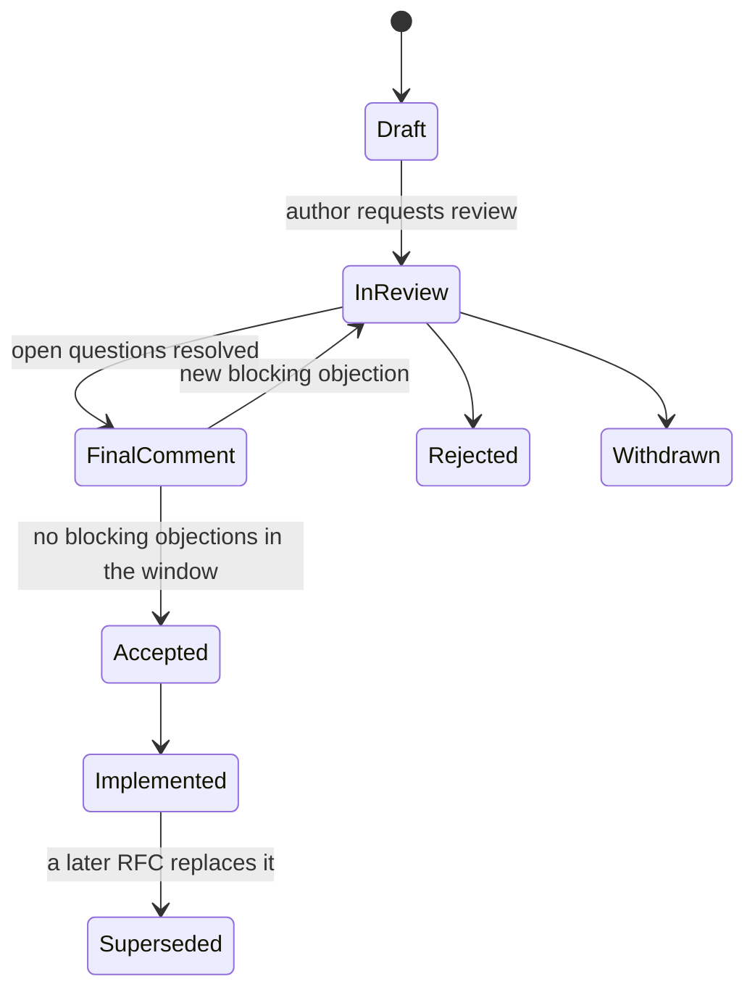

A team spends ten weeks building a WebSocket-based notification service. In week ten, a security review points out that a corporate proxy used by roughly a third of their enterprise customers strips WebSocket upgrade requests, and those customers will never receive a notification. The team rebuilds on Server-Sent Events, which that proxy passes through. A four-page design doc circulated in week one would have drawn that comment from the networking team in a day.

A design doc is the cheapest place to be wrong. Changing a paragraph costs minutes; changing a deployed system costs weeks and sometimes a migration. The doc is also how a senior engineer scales judgement: it lets ten people check your reasoning asynchronously, records *why* a decision was made for the engineer who inherits it in two years, and forces you to discover that your design has a hole before the code does.

## When to write one

Write a design doc when any of these hold:

- The work is more than about two engineer-weeks.
- It crosses a team boundary or changes a shared API, event schema or data contract.
- It is hard to reverse: a data model, a storage engine, a public API, a vendor, a security boundary.
- It touches security, privacy or compliance.
- It introduces new infrastructure someone will have to operate.
- You are unsure, or reasonable engineers would disagree.

Size the document to the risk. A reversible two-week change deserves a one-pager (problem, proposal, alternatives, risks). A new storage layer deserves the full skeleton below. Writing a twelve-page doc for a reversible decision is its own failure: it slows the team and teaches people that docs are bureaucracy.

## A design doc skeleton

```text
TITLE: <Verb phrase: "Persist AI replies independently of the client connection">
Author(s): <names>   Reviewers: <names + what each should focus on>
Status: Draft | In review | Approved | Superseded by <link>   Last updated: <date>

1. SUMMARY (5 sentences max)
   The problem, the proposal, the main trade-off, and what you need from readers.

2. CONTEXT AND PROBLEM
   What exists today, what is wrong with it, and evidence in numbers
   (error rates, latency, cost, incident links, user complaints).

3. GOALS AND NON-GOALS
   Goals: measurable outcomes ("no reply lost when the tab closes").
   Non-goals: things a reader might assume are in scope but are not.

4. PROPOSED DESIGN
   Overview diagram. Components and responsibilities. APIs and data model.
   Key flows (happy path, then failure paths). Capacity estimates.

5. ALTERNATIVES CONSIDERED
   At least two real alternatives plus "do nothing", each with honest pros,
   cons, cost, and the reason it lost. A comparison table helps.

6. CROSS-CUTTING CONCERNS
   Security and privacy. Observability (metrics, logs, alerts). Failure modes
   and blast radius. Cost. Performance. Accessibility where relevant.

7. ROLLOUT, MIGRATION AND ROLLBACK
   Flags, phases, backfills, how to undo each step, what "done" means.

8. RISKS AND OPEN QUESTIONS
   What could make this design wrong. Questions that need an answer, and who owns each.

9. DECISION LOG
   Dated record of decisions made during review and why.
```

Three sections do most of the work. **Non-goals** prevent the most common review failure, where readers critique the design for not solving a problem it never meant to solve. **Alternatives considered** are where reviewers check your judgement; strawman alternatives ("we could rewrite everything in assembly") signal that the decision was made before the analysis. **Rollout and rollback** is where operational experience shows, and where most hard-to-reverse mistakes are caught.

## Worked example: persisting replies when the client disconnects

This app streams AI coach replies to the browser. The obvious first implementation persists the reply at the end of the HTTP handler, after the stream finishes. Then, when a user closes the tab mid-reply, the server drops the handler and the reply is never saved. The comment at the top of `crates/api/src/routes/sse.rs` describes the design that avoids this; here is how the core of a design doc arguing for it might read.

**Problem.** Replies typically stream for 10 to 40 seconds. Any client disconnect during that window (closed tab, network change, laptop sleep) cancels the handler and loses the reply, although the model has already been paid for it. The conversation history then shows a question with no answer.

**Goals.** No reply is lost because the client disconnected. No added latency to the first token. No new infrastructure. **Non-goals.** Surviving a server process crash mid-stream; resuming a stream in a new tab.

| | A. Persist in the handler (status quo) | B. Spawned task owns the stream and persistence; response reads a bounded channel | C. Durable job queue, worker, and pub/sub to the browser |
|---|---|---|---|
| Survives client disconnect | No | Yes | Yes |
| Survives server crash or deploy mid-stream | No | No (mitigated by graceful shutdown) | Yes, with retries |
| New infrastructure | None | None | A queue and a pub/sub channel |
| Added first-token latency | None | Negligible (in-process channel) | A queue hop per event |
| Code size | Smallest | About 60 lines | Hundreds of lines plus operations |
| Backpressure | Implicit | Explicit: channel capacity 64 | Queue depth |

**Decision: B.** It meets every goal with no new moving parts. C solves a problem we listed as a non-goal, at a cost in latency and operations we cannot justify today. **Consequences:** a reply in flight when the process is killed is still lost, so graceful shutdown must wait for in-flight tasks; the spawned task must never depend on the request's lifetime; the channel must be bounded so a slow browser cannot grow memory without limit. **Revisit if** deploys become frequent enough, or streams long enough, that crash-time loss becomes visible in the data.

That is the design the code in `crates/api/src/routes/sse.rs` implements, and the [Rust essentials](/learn/senior-craft/languages-for-senior-engineers/rust-essentials) lesson walks through it line by line. Notice what the doc did: it made the rejected option's strength (C survives crashes) explicit, fenced it off with a non-goal, and wrote down the trigger for revisiting. A reader two years later knows exactly what was traded away and when to reconsider.

The consequences list also shows how a consequence can be understood and still be missed in code. The first implementation started the task with a bare `tokio::spawn`, and nothing waited for it at shutdown: once connections drained, `main` returned and the runtime dropped any reply whose browser had already gone, which is the exact case the design exists for, whenever a deploy landed mid-reply. The fix routes these tasks through a `TaskTracker` (`state.tasks`), and `crates/api/src/main.rs` now waits up to 30 seconds for them after the server stops accepting connections, bounded so a hung upstream cannot block the deploy. A consequence that says "must" is a requirement; give it a test or a checklist item, or it stays prose.

## RFCs: designs that change things for many teams

A design doc is usually about a project a team owns. An **RFC** (request for comments) proposes a change that affects many teams: a shared standard, a platform capability, a cross-cutting convention. The audience is wider, adoption is voluntary until mandated, and the process matters more.



The **final comment period** is the important state: a fixed window (a week is common) announced widely, after which silence counts as consent and the decision stands. Without it, RFCs stay open forever, which is itself a decision not to decide.

A compact RFC template, in the spirit of the templates popularised by open-source language communities:

```text
RFC-<number>: <title>
Author: <name>   Status: <state>   Final comment period ends: <date>

Summary          One paragraph.
Motivation       The problem, who has it, evidence, why now.
Proposal         What changes, precisely enough to implement. Examples.
Adoption         How existing systems migrate; timeline; tooling provided;
                 what happens to teams that do not migrate.
Drawbacks        Honest costs, including to teams that did not ask for this.
Alternatives     Including "do nothing" and "let each team decide".
Prior art        What others (internal teams, other companies, standards) do.
Unresolved       Questions to settle before or during implementation.
```

For example, an RFC standardising error responses across services would propose the `{ "code": "...", "message": "..." }` body this app's API already returns, compare it with the RFC 9457 "problem details" format, specify the stable machine codes, and put most of its effort into the **Adoption** section: a shared library, a compatibility period, and who writes the client-side parsers.

## ADRs: the decision log

A design doc describes a design; an **architecture decision record** records one decision in a few paragraphs, and is never edited afterwards, only superseded. The common format has four parts: context, decision, status, consequences. Write one for each significant decision (including those made inside a design doc), store them next to the code, and link them from the doc. When the decision changes, write a new ADR that supersedes the old one. The result is a searchable history of *why* the system is the way it is, which is exactly what a new senior engineer needs in their first month. The [documentation and ADRs](/learn/senior-craft/software-craft/documentation-and-adrs) lesson covers the format in detail.

## Getting feedback that actually arrives

- **Name reviewers with a focus.** "Alice: the storage and backfill section. Ben (security): the token handling. Priya (on-call): rollback." Generic requests get generic skims.
- **Include a skeptic and a consumer.** The person most likely to disagree and a team that will use the result find different problems.
- **Review asynchronously first, with a deadline.** Comments in the document, due in five working days. Hold a meeting only for points that are still contested, with the doc as pre-reading, and record the outcomes in the decision log.
- **Silence is not approval.** Ask named approvers for an explicit sign-off.
- **Keep the doc true.** Update the text when a comment changes the design, rather than leaving the truth scattered across resolved comment threads.

## Reviewing someone else's design

Seniors review more design docs than they write, and a good design review follows a checklist rather than a mood:

1. **Is the problem real and sized?** Look for evidence in numbers. A design for 50,000 requests per second backed by a dashboard showing 300 deserves a question.
2. **Do the goals and non-goals match what the business needs?** Most expensive mistakes are solving the wrong problem well.
3. **Are the alternatives honest?** If you would have chosen differently, is your option in the table, and is its description fair?
4. **What happens when each dependency fails?** Walk the failure paths: timeouts, retries, partial writes, a region going away.
5. **Can it be rolled out and rolled back?** Especially data migrations and API changes that other teams consume.
6. **Who operates it, and how will they know it is broken?** Alerts, dashboards, runbooks, on-call ownership.
7. **What does it cost?** Infrastructure, licences, and the ongoing engineering time to run it.

Separate blocking concerns from preferences, exactly as in code review, and phrase uncertainty as questions ("how does this behave if the queue is down for ten minutes?") rather than verdicts. The author should leave the review with a better design and a clear list of what must change before approval.

## Writing so people read it

Put the recommendation first. Keep the summary to five sentences so an executive can stop there. Use numbers instead of adjectives ("p99 rises from 120 to 180 ms" rather than "slightly slower"). Draw one diagram of the proposed state. Steelman every alternative: if a reviewer who favours option C reads your description of C and thinks "yes, that is exactly why I like it", you have earned the right to reject it. And add a short pre-mortem: "it is a year from now and this design failed; what is the most likely reason?"

## Failure modes

- **Post-hoc justification:** the doc is written after the code, to satisfy process.
- **Strawman alternatives:** options nobody would choose, listed to make the proposal look inevitable.
- **Missing non-goals:** review sprawls into problems the design never meant to solve.
- **No rollback plan:** the hardest-to-reverse step is described only in the happy path.
- **Design by committee:** every comment accepted, producing a design nobody would have chosen.
- **Doc rot:** approved docs that no longer describe the system. Mark them superseded and link the ADR that replaced them.

## Senior signals

- You write a doc when the change is costly, cross-team or hard to reverse, and you size it to the risk.
- Your docs have explicit non-goals, honest alternatives including "do nothing", and a rollback plan for each irreversible step.
- You name reviewers with a focus, set a deadline, and treat silence as silence, not approval.
- You record decisions in a log or ADRs, including what was traded away and the trigger to revisit.
- You use RFCs with a final comment period for cross-team standards, and invest most in the adoption plan.
- You lead with the recommendation and quantify trade-offs.

## Check yourself

```quiz
- q: >-
    Which change most clearly needs a design doc?
  options: ["Switching the primary datastore for user sessions", "Upgrading a library by a patch version everywhere", "Adding a field to an internal log line in one handler", "Renaming an internal function across one service"]
  answer: 0
  explanation: >-
    A datastore change is hard to reverse, affects operations and data, and usually crosses teams. The rename, the log field and the patch upgrade are reversible and local, however widely they are applied; a doc would be overhead.
- q: >-
    Reviewers keep critiquing your design for not supporting multi-region failover, which you never intended to build this quarter. What was most likely missing from the doc?
  options: ["A clearer architecture diagram", "An explicit non-goals section", "More alternatives considered", "A longer executive summary"]
  answer: 1
  explanation: >-
    Non-goals tell readers what is deliberately out of scope, which keeps review focused on the problem being solved. Without them, reviewers fill the gap with their own assumptions, and no diagram, summary or extra alternative tells them the omission was deliberate.
- q: >-
    In the reply-persistence example, why was the durable job queue (option C) rejected even though it survives server crashes?
  options: ["A queue cannot carry token-by-token streaming data at the latency a chat needs", "It was the most expensive option to run, and cost alone decided the comparison", "Crash survival was a non-goal, so its infrastructure and latency were unjustified", "It offered no backpressure, so one slow browser could exhaust the server's memory"]
  answer: 2
  explanation: >-
    The doc named C's strength honestly, then fenced it off with a non-goal and recorded a trigger to revisit. C adds a queue hop per event rather than making streaming impossible, and its queue depth is a form of backpressure; it lost because the goals did not justify its new infrastructure. That is how a senior rejects a stronger-but-costlier option without hiding the trade-off.
- q: >-
    An RFC for a cross-team logging standard has been open for comments for four months. What process element is most likely missing?
  options: ["A final comment period with a fixed end date", "A working prototype that settles the debate", "A wider list of reviewers from every team", "A longer motivation section with more evidence"]
  answer: 0
  explanation: >-
    Without a closing window there is no moment at which the proposal is accepted or rejected, so it drifts. A final comment period converts discussion into a decision; more evidence, reviewers or prototypes only feed a discussion that has no end.
- q: >-
    A decision recorded in an ADR two years ago no longer holds. What should you do?
  options: ["Write a new ADR that supersedes it and mark the old one superseded", "Edit the old ADR so that it reflects the decision now in force", "Delete the old ADR so that nobody follows it by mistake", "Leave the ADR unchanged and note the change in the README instead"]
  answer: 0
  explanation: >-
    ADRs are an immutable history of why things changed. Superseding preserves the original context and makes the evolution traceable; editing or deleting erases exactly the reasoning future engineers need, and a README note leaves the ADR log asserting something false.
```
